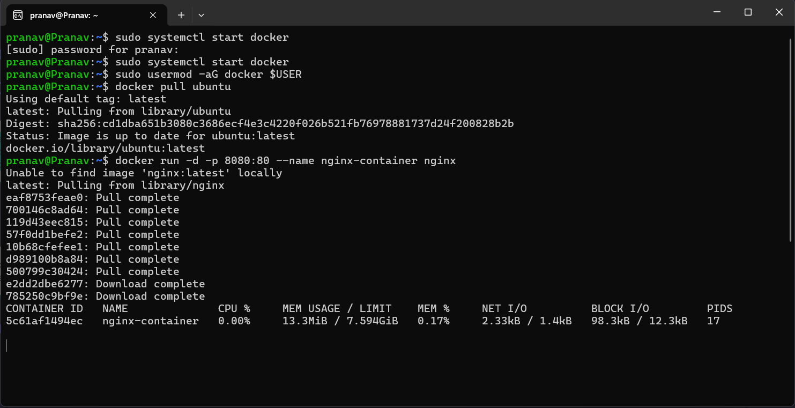

## 🎯 Objective

The primary goal of this experiment is to practically compare **Virtual Machines (VMs)** and **Containers** by deploying a web server (Nginx) using two different technologies: **Vagrant** (for VMs) and **Docker** (for Containers). By the end of this lab, you will understand the differences in setup time, resource utilization, and operational efficiency between these two approaches.

---

## 🧠 Theory: VMs vs. Containers

Before diving into the commands, it's crucial to understand what we are building.

### Virtual Machines (VMs)

A **Virtual Machine** allows you to run a full guest operating system (like Ubuntu) on top of your host operating system (Windows). It uses a piece of software called a **Hypervisor** (like VirtualBox) to manage resources.

* **Pros**: Full isolation, runs any OS.
* **Cons**: Heavy resource usage (RAM/CPU), slow startup.

### Containers

A **Container** allows you to package an application and its dependencies together. Unlike a VM, it shares the host OS kernel and does not require a full guest OS.

* **Pros**: Extremely lightweight, fast startup (seconds), efficient resource usage.
* **Cons**: Less isolation than VMs, kernel dependency.

---

## ⚙️ Prerequisites

Ensure you have the following tools installed:

* **Vagrant**: For managing virtual machine environments.
* **VirtualBox**: The hypervisor used by Vagrant.
* **Docker Desktop (or Engine)**: For running containers.
* **WSL 2** (Windows Subsystem for Linux): Recommended backend for Docker on Windows.

---

## 🧪 Part A: Virtual Machines with Vagrant

In this section, we will spin up a full Ubuntu VM and install Nginx inside it.

### Step 1: Project Setup

Create a dedicated directory for your Vagrant project.

```bash
mkdir vm-lab
cd vm-lab
```

### Step 2: Initialize Vagrant

Initialize a new Vagrant environment with an Ubuntu image.

```bash
vagrant init ubuntu/jammy64
```

* **Command**: `vagrant init` creates a `Vagrantfile` in your current directory. This file describes the type of machine required.
* **Argument**: `ubuntu/jammy64` specifies the "box" (image) to use. "Jammy64" refers to Ubuntu 22.04 LTS.
* **Expected Output**: A message confirming a `Vagrantfile` has been placed in the directory.

### Step 3: Start the Virtual Machine

Provision and start the VM.

```bash
vagrant up
```

* **Command**: `vagrant up` reads the `Vagrantfile` and tells VirtualBox to create and start the machine.
* **Deep Dive**: This process involves downloading the OS image (if not cached), allocating RAM/CPU, booting the guest OS, and setting up networking (SSH forwarding).
* **Expected Output**: Logs showing the import progress, network interface setup, and SSH key generation.

### Step 4: Access the VM

Log into the running VM via SSH.

```bash
vagrant ssh
```

* **Command**: securely connects you effectively "inside" the VM terminal.
* **Expected Output**: Your command prompt will change to something like `vagrant@ubuntu-jammy:~$`.

### Step 5: Install Nginx (Inside VM)

Now that we are inside the VM, we treat it like a regular server.

```bash
sudo apt update
sudo apt install -y nginx
sudo systemctl start nginx
```

* **Flags**:
  * `-y`: Automatically answers "yes" to prompts, avoiding interruption.
* **Expected Output**: Nginx installs and the service starts successfully.

### Step 6: Verify Nginx

Check if the web server is responding locally inside the VM.

```bash
curl localhost
```

* **Expected Output**: The raw HTML code of the "Welcome to Nginx" page.

### Step 7: Cleanup

Exit the VM and shut it down to free up resources.

```bash
# Exit the SSH session
exit 

# Stop the VM (saves state)
vagrant halt

# Destroy the VM (deletes all files)
vagrant destroy
```

---

## 🐳 Part B: Containers with Docker (via WSL)

Now, we will achieve the same result (running Nginx) using Docker containers.

### Step 1: Ensure WSL is Ready

If you haven't set up WSL 2 yet:

```bash
wsl --install
```

* **Command**: Installs the Windows Subsystem for Linux and the default Ubuntu distribution. REQUIRES RESTART.

### Step 2: Pull the Docker Image

Download the official Ubuntu image (optional, `docker run` does this automatically if missing).

```bash
docker pull ubuntu
```

### Step 3: Run Nginx Container

We will run an Nginx container directly. Note that we don't need to "install" Nginx manually; we just use the pre-built `nginx` image.

```bash
docker run -d -p 8080:80 --name nginx-container nginx
```

* **Command**: `docker run` creates and starts a container.
* **Flags**:
  * `-d` (**Detached**): Runs the container in the background. Without this, your terminal would be stuck showing server logs.
  * `-p 8080:80` (**Port Mapping**): Maps port `8080` on your host (Windows) to port `80` inside the container.
  * `--name nginx-container`: Assigns a custom name for easy management (instead of a random string).
  * `nginx`: The name of the image to use.
* **Expected Output**: A long alphanumeric string (Container ID) is returned.

### Step 4: Verify Nginx

Since we mapped the port, we can access Nginx from our host machine (Windows/WSL).

```bash
curl localhost:8080
```

* **Expected Output**: The "Welcome to Nginx" HTML page.

### Step 5: Monitor Resources

Compare the footprint of this container against the VM from Part A.

```bash
docker stats
```

* **Command**: Displays a live stream of container resource usage (CPU, Memory, Network).
* **Observation**: You will likely see the container using **< 20MB RAM**, whereas the Vagrant VM likely reserved **512MB - 1GB**.

---

## 🧐 Deep Dive

### Why Port Mapping (`-p`)?

Containers run in their own isolated network namespace. Port 80 inside the container is **not** open on your computer by default. The flag `-p 8080:80` creates a "bridge," forwarding traffic from your computer's port 8080 to the container's port 80.

### Image vs. Container

* **Image**: The blueprint or template (read-only). Like a Class in programming.
* **Container**: The running instance of that image. Like an Object in programming.

---

## ⚠️ Troubleshooting & Common Pitfalls

### 1. "Vagrant up" fails with Virtualization Error

* **Cause**: Virtualization technology (VT-x or AMD-V) is disabled in your computer's BIOS.
* **Fix**: Restart your PC, enter BIOS, and enable Virtualization.

### 2. Docker: "bind: address already in use"

* **Simulated Error**: `Error response from daemon: driver failed programming external connectivity...`
* **Cause**: Port 8080 is already being used by another application.
* **Fix**: Change the host port mapping, e.g., `-p 8081:80`.

### 3. "Docker daemon is not running"

* **Cause**: Docker Desktop is closed.
* **Fix**: Launch Docker Desktop from the Start menu and wait for the whale icon to stabilize.

---
**Student**: Pranav R Nair | **Batch**: 2(CCVT) | **SAP ID**: 500121466

### 📸 Visuals & Outputs





