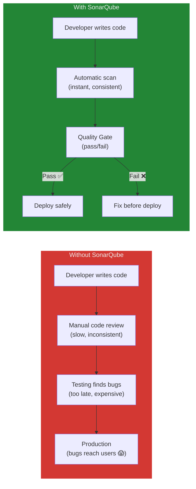
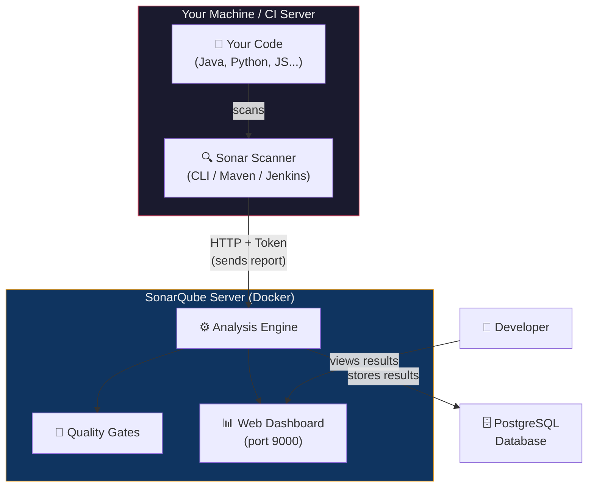
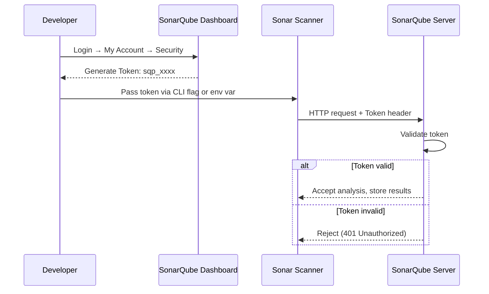
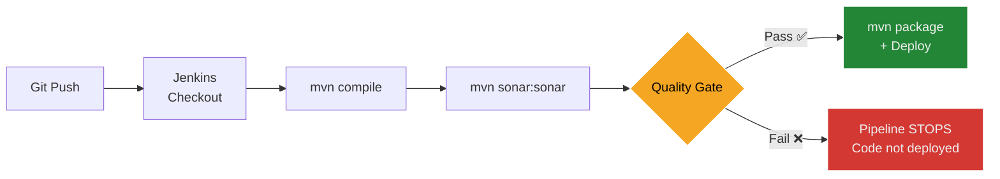

## Objective

Deploy a SonarQube server using Docker Compose, scan a Java application with intentional code issues, and analyze the results through the web dashboard and REST API to understand automated static code analysis in a CI/CD pipeline.

---

## Theory

### The Problem: Bugs Found Too Late

Code bugs and security vulnerabilities are often discovered during testing — or worse, after deployment in production. Manual code reviews are **slow, inconsistent, and don't scale** as teams grow.

Consider this: a team of 10 developers each pushes 3 commits per day. That's 30 code changes daily. Can a senior engineer manually review every line for:
- Division by zero?
- SQL injection?
- Null pointer dereferences?
- Unused variables?
- Copy-pasted code blocks?

**No.** This is where **static code analysis** comes in.

### What is SonarQube?

**SonarQube** is an open-source platform that automatically scans source code for bugs, security vulnerabilities, and maintainability issues — **without running the code**. This is called **static analysis** (analyzing code at rest, not at runtime).



### SonarQube Architecture — Server + Scanner

SonarQube has **two separate components**:



| Component | Role | Analogy |
| :--- | :--- | :--- |
| **SonarQube Server** | Stores results, applies rules, shows dashboard | The **examiner** — receives work, grades it, shows the report |
| **Sonar Scanner** | Reads source code, detects issues, sends report | The **student** — does the work and submits it |
| **PostgreSQL** | Persists all analysis data | The **filing cabinet** — stores all grades permanently |

### Why Both Are Required

| Scenario | Result |
| :--- | :--- |
| Only Server installed | Dashboard is empty — no code gets analyzed |
| Only Scanner installed | Nowhere to send results — analysis is wasted |
| Both installed together | Full pipeline works ✅ |

### Issue Categories SonarQube Detects

| Category | Icon | Meaning | Example |
| :--- | :--- | :--- | :--- |
| **Bug** | 🐛 | Code that will likely crash or behave incorrectly at runtime | Division by zero, null pointer dereference |
| **Vulnerability** | 🔓 | Security weakness an attacker could exploit | SQL injection, hardcoded passwords |
| **Code Smell** | 🦨 | Code that works but is poorly written | Unused variables, empty catch blocks |
| **Technical Debt** | ⏱️ | Estimated time to fix all issues | "57 minutes to fix all smells" |
| **Coverage** | 📊 | Percentage of code tested by unit tests | 0% means no tests exist |
| **Duplication** | 📋 | Repeated copy-pasted code blocks | Two identical methods |

### Token-Based Authentication

The Scanner authenticates with the Server using a **token** — not a username/password:



---

## Hands-on Lab

### Prerequisites

- WSL2 with Ubuntu
- Docker Desktop running
- Terminal access

---

### Phase 1: Install Java JDK & Maven

```bash
sudo apt update -y
sudo apt install -y openjdk-17-jdk maven

# Verify both
java -version
mvn -version
```

| Package | Purpose |
| :--- | :--- |
| `openjdk-17-jdk` | Java compiler — needed to compile the sample app |
| `maven` | Build tool — compiles Java, manages dependencies, runs the SonarQube scanner plugin |


---

### Phase 2: Set WSL2 Kernel Parameters

> **This is the most critical step.** Without it, SonarQube's embedded Elasticsearch crashes silently.

```bash
sudo sysctl -w vm.max_map_count=524288
sudo sysctl -w fs.file-max=131072
```

| Parameter | WSL2 Default | Required | Purpose |
| :--- | :--- | :--- | :--- |
| `vm.max_map_count` | 65530 | 524288 | Max memory-mapped areas for Elasticsearch |
| `fs.file-max` | varies | 131072 | Max open file descriptors system-wide |

> These reset on WSL restart. For permanent fix, add them to `/etc/sysctl.conf`.

---

### Phase 3: Start SonarQube with Docker Compose

Create the working directory:

```bash
mkdir -p ~/sonarqube-lab && cd ~/sonarqube-lab
```

Create `docker-compose.yml`:

```yaml
services:

  # Database — stores all SonarQube data persistently
  sonar-db:
    image: postgres:13
    container_name: sonar-db
    environment:
      POSTGRES_USER: sonar
      POSTGRES_PASSWORD: sonar
      POSTGRES_DB: sonarqube
      POSTGRES_HOST_AUTH_METHOD: trust
    volumes:
      - sonar-db-data:/var/lib/postgresql/data
    networks:
      - sonarqube-lab

  # SonarQube Server — web UI + analysis engine
  sonarqube:
    image: sonarqube:lts-community
    container_name: sonarqube
    ports:
      - "9000:9000"
    environment:
      SONAR_JDBC_URL: jdbc:postgresql://sonar-db:5432/sonarqube
      SONAR_JDBC_USERNAME: sonar
      SONAR_JDBC_PASSWORD: sonar
    volumes:
      - sonar-data:/opt/sonarqube/data
      - sonar-extensions:/opt/sonarqube/extensions
    depends_on:
      - sonar-db
    networks:
      - sonarqube-lab

volumes:
  sonar-db-data:
  sonar-data:
  sonar-extensions:

networks:
  sonarqube-lab:
    driver: bridge
```

#### Docker Compose Breakdown

| Key | Purpose |
| :--- | :--- |
| `postgres:13` | PostgreSQL database image — stores analysis results |
| `sonarqube:lts-community` | SonarQube Long-Term Support community edition |
| `ports: "9000:9000"` | Expose dashboard on `http://localhost:9000` |
| `SONAR_JDBC_URL` | Tells SonarQube how to connect to PostgreSQL |
| `depends_on: sonar-db` | Start database before SonarQube server |
| Named `volumes` | Persist data across container restarts |
| `networks: sonarqube-lab` | Isolated bridge network — containers communicate by name |

Start the containers:

```bash
docker compose up -d
docker compose logs -f sonarqube
```

Wait until you see "SonarQube is operational" in the logs, then press `Ctrl+C`.


#### Verify Server Health

```bash
curl -s http://localhost:9000/api/system/status | python3 -m json.tool
```

**Expected output when healthy:**

```json
{
    "id": "xxxxxxxx",
    "version": "9.9.x",
    "status": "UP"
}
```

Open `http://localhost:9000` in your browser. Default login: **admin / admin** (you'll be prompted to change the password on first login — use `Admin@1234`).

---

### Phase 4: Generate Authentication Token

```text
1. Open http://localhost:9000
2. Log in as admin
3. Click your user icon (top right) → "My Account"
4. Click the "Security" tab
5. Under "Generate Tokens", type: scanner-token
6. Click "Generate"
7. Copy the token immediately — it is shown only once!
   Format: sqp_xxxxxxxxxxxxxxxxxxxxxxxxxxxxxxxx
```

Store it as an environment variable:

```bash
export SONAR_TOKEN="sqp_your_actual_token_here"
echo $SONAR_TOKEN   # verify it's set
```

> **Security best practice:** Never hardcode tokens in `pom.xml` or source files. If you commit them to Git, anyone can access your SonarQube server.


---

### Phase 5: Create the Sample Java Project

```bash
mkdir -p ~/sonarqube-lab/sample-java-app/src/main/java/com/example
cd ~/sonarqube-lab/sample-java-app
```

Create `src/main/java/com/example/Calculator.java` — a class with **intentional bugs, vulnerabilities, and code smells**:

```java
package com.example;

public class Calculator {

    // BUG: Division by zero not handled
    // If someone calls divide(5, 0), this crashes at runtime
    public int divide(int a, int b) {
        return a / b;
    }

    // CODE SMELL: Unused variable
    // 'unused' is declared but never read — clutters the code
    public int add(int a, int b) {
        int result = a + b;
        int unused = 100;   // ← SonarQube flags this
        return result;
    }

    // VULNERABILITY: SQL Injection risk
    // Concatenating user input into SQL is exploitable
    // Attacker could pass: "1 OR 1=1" to get all users
    public String getUser(String userId) {
        String query = "SELECT * FROM users WHERE id = " + userId;
        return query;
    }

    // CODE SMELL: Duplicated code
    // These two methods are identical — should be one method
    public int multiply(int a, int b) {
        int result = 0;
        for (int i = 0; i < b; i++) {
            result = result + a;
        }
        return result;
    }

    public int multiplyAlt(int a, int b) {
        int result = 0;
        for (int i = 0; i < b; i++) {
            result = result + a;   // ← exact duplicate
        }
        return result;
    }

    // BUG: Null pointer risk
    // If name is null, .toUpperCase() throws NullPointerException
    public String getName(String name) {
        return name.toUpperCase();
    }

    // CODE SMELL: Empty catch block
    // Exception is caught but silently ignored — hides errors
    public void riskyOperation() {
        try {
            int x = 10 / 0;
        } catch (Exception e) {
            // ← never leave catch blocks empty
        }
    }
}
```

Create `pom.xml`:

```xml
<?xml version="1.0" encoding="UTF-8"?>
<project xmlns="http://maven.apache.org/POM/4.0.0"
         xmlns:xsi="http://www.w3.org/2001/XMLSchema-instance"
         xsi:schemaLocation="http://maven.apache.org/POM/4.0.0
         http://maven.apache.org/xsd/maven-4.0.0.xsd">

    <modelVersion>4.0.0</modelVersion>

    <groupId>com.example</groupId>
    <artifactId>sample-app</artifactId>
    <version>1.0-SNAPSHOT</version>

    <properties>
        <maven.compiler.source>17</maven.compiler.source>
        <maven.compiler.target>17</maven.compiler.target>
        <sonar.projectKey>sample-java-app</sonar.projectKey>
        <sonar.projectName>Sample Java Application</sonar.projectName>
        <sonar.host.url>http://localhost:9000</sonar.host.url>
        <!-- Token is NOT stored here — passed via CLI -->
    </properties>

    <dependencies>
        <dependency>
            <groupId>junit</groupId>
            <artifactId>junit</artifactId>
            <version>4.13.2</version>
            <scope>test</scope>
        </dependency>
    </dependencies>

    <build>
        <plugins>
            <plugin>
                <groupId>org.sonarsource.scanner.maven</groupId>
                <artifactId>sonar-maven-plugin</artifactId>
                <version>3.9.1.2184</version>
            </plugin>
        </plugins>
    </build>
</project>
```


---

### Phase 6: Compile and Scan

**Step 1 — Compile first** (creates `target/classes/`):

```bash
cd ~/sonarqube-lab/sample-java-app
mvn compile
```

> **Why compile first?** The SonarQube Maven plugin needs compiled `.class` files for **bytecode analysis** — detecting null pointer risks, unused variables, etc. Without compiled classes, SonarQube can only do text-level scanning and misses most bugs.


**Step 2 — Run the SonarQube scan:**

```bash
mvn sonar:sonar -Dsonar.login=$SONAR_TOKEN
```

| Flag | Purpose |
| :--- | :--- |
| `sonar:sonar` | Invokes the SonarQube Maven plugin |
| `-Dsonar.login=$SONAR_TOKEN` | Authentication token (from env variable) |

**Expected output:**

```text
[INFO] BUILD SUCCESS
[INFO] Analysis total time: 5.697 s
[INFO] More about the report processing at
       http://localhost:9000/api/ce/task?id=AZ3AqabR04yPRjbdvmww
```


---

### Phase 7: View Results in Dashboard

Open: `http://localhost:9000/dashboard?id=sample-java-app`

The dashboard shows:

| Metric | Value (from our scan) | Rating |
| :--- | :--- | :--- |
| **Bugs** | 1 | Reliability: D |
| **Vulnerabilities** | 0 | Security: A |
| **Security Hotspots** | 0 | Security Review: A |
| **Code Smells** | 6 | Maintainability: A |
| **Technical Debt** | 57 min | — |
| **Coverage** | 0.0% | No unit tests |
| **Duplications** | 0.0% | — |
| **Quality Gate** | ✅ Passed | All conditions met |


---

### Phase 8: Query Results via REST API

```bash
# View all bugs found
curl -s -u admin:Admin@1234 \
  "http://localhost:9000/api/issues/search?projectKeys=sample-java-app&types=BUG" \
  | python3 -m json.tool | grep -E "message|severity|component"

# View vulnerabilities
curl -s -u admin:Admin@1234 \
  "http://localhost:9000/api/issues/search?projectKeys=sample-java-app&types=VULNERABILITY" \
  | python3 -m json.tool | grep -E "message|severity"

# View code smells
curl -s -u admin:Admin@1234 \
  "http://localhost:9000/api/issues/search?projectKeys=sample-java-app&types=CODE_SMELL" \
  | python3 -m json.tool | grep -E "message|severity"

# Check Quality Gate status
curl -s -u admin:Admin@1234 \
  "http://localhost:9000/api/qualitygates/project_status?projectKey=sample-java-app" \
  | python3 -m json.tool
```

| Flag | Purpose |
| :--- | :--- |
| `-s` | Silent mode — suppresses progress bar noise |
| `-u admin:Admin@1234` | HTTP Basic Auth credentials |
| `python3 -m json.tool` | Pretty-print JSON output |
| `grep -E "message\|severity"` | Filter to show only relevant fields |


---

### Phase 9: Cleanup

```bash
cd ~/sonarqube-lab

# Stop containers (preserves data in volumes)
docker compose down

# Full reset — remove containers AND all stored data
docker compose down -v
```

| Command | Effect |
| :--- | :--- |
| `docker compose down` | Stops and removes containers + network; volumes are preserved |
| `docker compose down -v` | Also removes named volumes — full data reset |

---

## Alternative Scanner Method: Docker CLI Scanner

For non-Java projects (or if you don't want Maven), use the SonarQube Scanner Docker image:

Create `sonar-project.properties`:

```properties
sonar.projectKey=sample-java-app
sonar.projectName=Sample Java Application
sonar.projectVersion=1.0
sonar.sources=src
sonar.java.binaries=target/classes
sonar.sourceEncoding=UTF-8
```

Run the scanner via Docker:

```bash
docker run --rm \
  --network sonarqube-lab_sonarqube-lab \
  -e SONAR_TOKEN="$SONAR_TOKEN" \
  -v "$(pwd):/usr/src" \
  sonarsource/sonar-scanner-cli \
  -Dsonar.host.url=http://sonarqube:9000 \
  -Dsonar.projectBaseDir=/usr/src \
  -Dsonar.projectKey=sample-java-app
```

| Flag | Purpose |
| :--- | :--- |
| `--rm` | Auto-delete the scanner container after completion |
| `--network` | Connect to the same Docker network as SonarQube |
| `-e SONAR_TOKEN` | Pass authentication token |
| `-v "$(pwd):/usr/src"` | Mount your project folder into the scanner container |
| `http://sonarqube:9000` | Uses **container name** (not localhost) — because scanner runs inside Docker network |

> **Finding the network name:** Run `docker network ls` — it's typically `<folder>_sonarqube-lab`.

---

## Deep Dive: Jenkins CI/CD Integration

In production, SonarQube scans run automatically on every commit via Jenkins:



Example Jenkinsfile:

```groovy
pipeline {
    agent any
    environment {
        SONAR_HOST_URL = 'http://sonarqube:9000'
        SONAR_TOKEN = credentials('sonar-token')
    }
    stages {
        stage('Checkout') {
            steps { checkout scm }
        }
        stage('SonarQube Analysis') {
            steps {
                withSonarQubeEnv('SonarQube') {
                    sh 'mvn clean verify sonar:sonar'
                }
            }
        }
        stage('Quality Gate') {
            steps {
                timeout(time: 5, unit: 'MINUTES') {
                    waitForQualityGate abortPipeline: true
                }
            }
        }
        stage('Build & Deploy') {
            steps {
                sh 'mvn package'
                sh 'docker build -t sample-app .'
                sh 'docker run -d -p 8080:8080 sample-app'
            }
        }
    }
}
```

---

## Comparative Analysis

### DevOps Tool Comparison

| Feature | SonarQube | Jenkins | Ansible | Chef |
| :--- | :--- | :--- | :--- | :--- |
| **Purpose** | Code Quality / Static Analysis | CI/CD Automation | Configuration Management | Configuration Management |
| **Architecture** | Client-Server | Master-Agent | Agentless (SSH) | Client-Server |
| **Language** | Java | Groovy | YAML | Ruby |
| **Learning Curve** | Low | Moderate | Low | High |
| **Use Case** | Scan code for bugs/vulnerabilities | Build, test, deploy pipelines | Infrastructure as Code | Enterprise config management |

**How they work together:**
- **Jenkins** orchestrates the pipeline (build → test → deploy)
- **SonarQube** scans code quality within the pipeline
- **Ansible/Chef** manages server configuration at deployment

---

## Common Pitfalls & Troubleshooting

| Problem | Cause | Fix |
| :--- | :--- | :--- |
| SonarQube container starts but web UI never loads | `vm.max_map_count` too low for Elasticsearch | `sudo sysctl -w vm.max_map_count=524288` |
| `Invalid value for sonar.java.binaries` | Code not compiled — no `.class` files | Run `mvn compile` before `mvn sonar:sonar` |
| Scan runs but finds 0 issues | Bytecode analysis missing without compilation | Run `mvn compile` first |
| `401 Unauthorized` during scan | Invalid or expired token | Regenerate token in the web UI |
| `version: '3.8'` warning in Compose | Obsolete key in Compose v2 | Remove the `version:` line entirely |
| Java version mismatch error | `pom.xml` targets Java 11 but JDK 17 is installed | Set `maven.compiler.source/target` to `17` |
| Token committed to Git | Hardcoded in `pom.xml` | Use `$SONAR_TOKEN` env var + `-Dsonar.login` flag |

---

## Lab Fixes Summary

| Change | Original (Lab Sheet) | Fixed | Why |
| :--- | :--- | :--- | :--- |
| Compose version | `version: '3.8'` included | Removed | Obsolete in Compose v2, produces warnings |
| Kernel params | Not mentioned | Added `sysctl` commands | WSL2 defaults too low for Elasticsearch |
| Java version | Source/target = 11 | Changed to 17 | Must match installed JDK |
| Token storage | Hardcoded in `pom.xml` | Env variable + CLI flag | Security — tokens must never be in source files |
| Compilation | Straight to `mvn sonar:sonar` | Added `mvn compile` first | Scanner needs bytecode for full analysis |
| API auth | `-u admin:YOUR_TOKEN` | `-u admin:Admin@1234` | Use actual credentials for Basic Auth |
| Health check | Not mentioned | Added `curl /api/system/status` | Confirms server is truly operational |

---

## Best Practices

**Security:**
- Never hardcode tokens in source files — use environment variables or secrets managers
- Use HTTPS for SonarQube in production
- Give scanner tokens minimal permissions (analyze only)

**Code Quality:**
- Set Quality Gates to block merges when coverage drops below 80%
- Scan on every pull request, not just nightly
- Fix issues as they appear — don't let technical debt accumulate

**CI/CD:**
- Cache Maven dependencies between builds
- Run SonarQube analysis in parallel with unit tests
- Configure pipelines to fail fast on Quality Gate failures

---

## Glossary

| Term | Definition |
| :--- | :--- |
| **SonarQube** | Open-source platform for automated static code analysis |
| **Static Analysis** | Examining source code for bugs without executing it |
| **Sonar Scanner** | CLI tool or Maven plugin that reads code and sends analysis reports to SonarQube |
| **Quality Gate** | A set of pass/fail conditions code must meet before deployment |
| **Bug** | Code that will likely crash or behave incorrectly at runtime |
| **Vulnerability** | A security weakness attackable by malicious users |
| **Code Smell** | Code that works but is poorly structured or hard to maintain |
| **Technical Debt** | Estimated time needed to fix all detected issues |
| **Coverage** | Percentage of code exercised by unit tests |
| **Duplication** | Repeated code blocks (copy-paste programming) |
| **Token** | Authentication credential generated in the SonarQube UI for scanner access |
| **Maven** | Java build tool — compiles code, manages dependencies, runs plugins |
| **pom.xml** | Maven project configuration file — defines dependencies and build settings |
| **Bytecode Analysis** | Analyzing compiled `.class` files for deeper bug detection |
| **Quality Profile** | Set of rules SonarQube applies during analysis (per language) |
| **Elasticsearch** | Search engine embedded in SonarQube for indexing code and issues |
| **JDBC** | Java Database Connectivity — how SonarQube connects to PostgreSQL |
| **Idempotent Analysis** | Rescanning produces the same results — no duplicate issues created |

---

## Optional: Scanner for Other Languages

### Node.js / Express

```groovy
stage('SonarQube Analysis') {
    steps {
        withSonarQubeEnv('SonarQube') {
            sh 'npm install -g sonar-scanner'
            sh '''
            sonar-scanner \
              -Dsonar.projectKey=my-node-app \
              -Dsonar.sources=. \
              -Dsonar.host.url=$SONAR_HOST_URL \
              -Dsonar.login=$SONAR_AUTH_TOKEN
            '''
        }
    }
}
```

### Python

```groovy
stage('SonarQube Analysis') {
    steps {
        withSonarQubeEnv('SonarQube') {
            sh '''
            sonar-scanner \
              -Dsonar.projectKey=my-python-app \
              -Dsonar.sources=. \
              -Dsonar.host.url=$SONAR_HOST_URL \
              -Dsonar.login=$SONAR_AUTH_TOKEN
            '''
        }
    }
}
```

> **Key insight:** Maven is a **Java-specific** build tool. For non-Java projects, use the **universal SonarScanner CLI** directly.

---

## References

- [SonarQube Official Docs](https://docs.sonarqube.org)
- [SonarQube Docker Hub](https://hub.docker.com/_/sonarqube)
- [Maven SonarQube Plugin](https://docs.sonarqube.org/latest/analysis/scan/sonarscanner-for-maven/)
