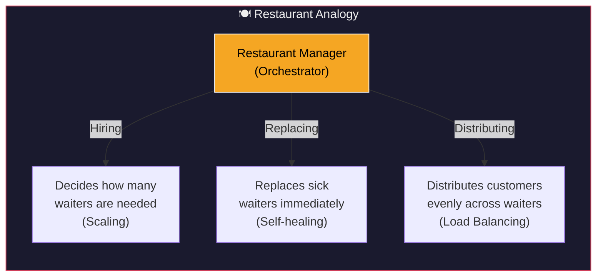
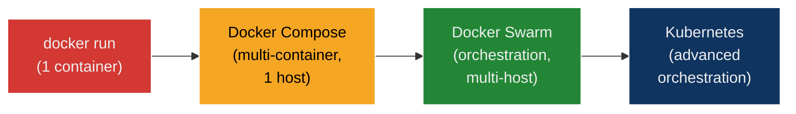
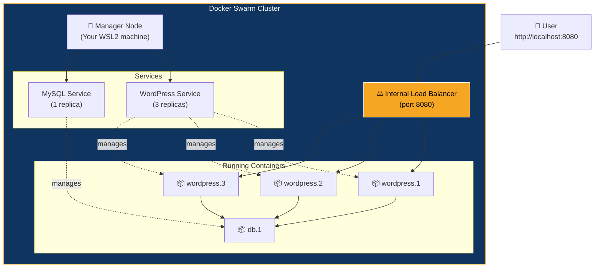
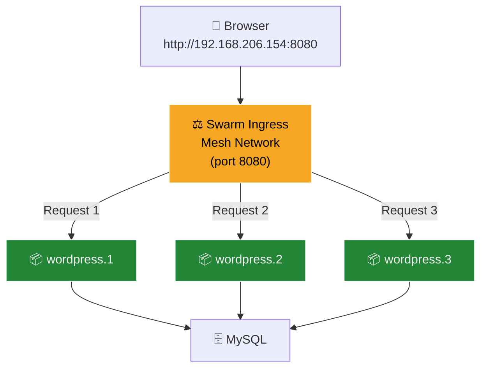
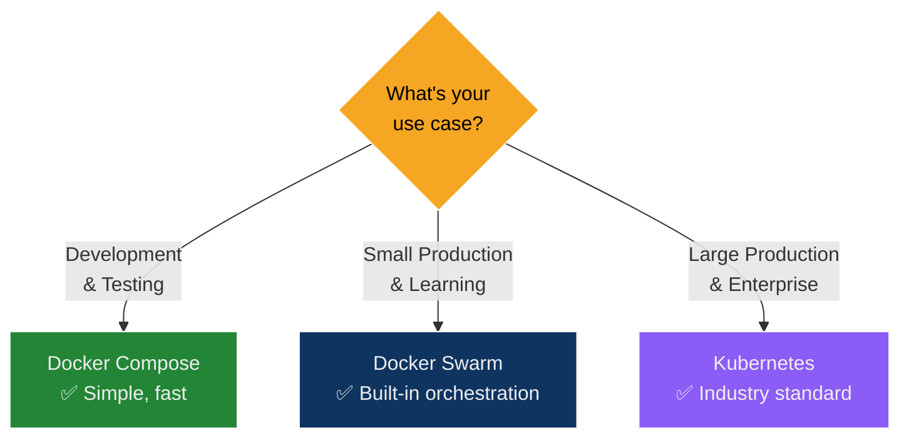

## Objective

Transition a WordPress + MySQL multi-container application from Docker Compose (single-host, manual management) to Docker Swarm (orchestrated, self-healing, load-balanced) to understand container orchestration concepts including scaling, service discovery, and automatic failure recovery.

---

## Theory

### The Problem: Compose Can't Manage Production Workloads

From Experiment 6, you used **Docker Compose** to run WordPress + MySQL together. But Compose has critical limitations:

| Limitation | What Goes Wrong |
| :--- | :--- |
| **No scaling** | Scaling WordPress to 3 copies causes port conflicts — all try to bind `8080` |
| **No self-healing** | If a container crashes, it stays dead until you manually restart it |
| **Single host only** | All containers must run on one machine — no distributed systems |
| **No load balancing** | Traffic hits one container; others sit idle |

### The Solution: Container Orchestration

**Orchestration** is the automatic management of containers across a cluster — deciding how many to run, where to place them, and how to recover from failures.



### The Container Evolution Path



> **This experiment focuses on:** Moving from Compose → Swarm

### What is Docker Swarm?

**Docker Swarm** is Docker's built-in orchestration tool. It turns a group of Docker hosts into a single virtual system (a "cluster") and manages containers as **services** rather than individual units.



### Key Swarm Concepts

| Concept | Description |
| :--- | :--- |
| **Node** | A Docker host (machine) participating in the Swarm |
| **Manager Node** | Controls the cluster — schedules tasks, maintains state |
| **Worker Node** | Runs containers assigned by the manager |
| **Service** | A definition of how to run containers (image, replicas, ports) |
| **Task** | A single container instance running as part of a service |
| **Stack** | A group of services deployed together from a Compose file |
| **Replica** | A copy of a container — `replicas: 3` = 3 identical containers |
| **Ingress Network** | Swarm's built-in mesh network + load balancer for routing traffic |

### Compose vs Stack Deploy

| Feature | `docker compose up` | `docker stack deploy` |
| :--- | :--- | :--- |
| **Mode** | Single host, no orchestration | Swarm-managed orchestration |
| **Scaling** | `--scale` (basic, port conflicts) | `docker service scale` (built-in LB) |
| **Load Balancing** | None | Yes (ingress mesh) |
| **Self-Healing** | None | Automatic container replacement |
| **Rolling Updates** | None | Zero-downtime updates |
| **Service Discovery** | Container names | DNS + Virtual IPs (VIP) |
| **Use Case** | Development, testing | Production clusters |

---

## Prerequisites

- WSL2 with Ubuntu
- Docker Desktop running (or Docker Engine with Swarm support)
- Familiarity with Experiment 6 (Docker Compose)

---

## Hands-on Lab

### Phase 1: Prepare the Environment

Clean up any containers from previous experiments:

```bash
docker compose down -v 2>/dev/null
docker ps
```

Create the working directory:

```bash
mkdir -p ~/swarm-lab && cd ~/swarm-lab
```

---

### Phase 2: Create the Docker Compose File

```yaml
# docker-compose.yml (Swarm-compatible version)
services:

  db:
    image: mysql:5.7
    restart: always
    environment:
      MYSQL_ROOT_PASSWORD: rootpass
      MYSQL_DATABASE: wordpress
      MYSQL_USER: wpuser
      MYSQL_PASSWORD: wppass
    volumes:
      - db_data:/var/lib/mysql

  wordpress:
    image: wordpress:latest
    depends_on:
      - db
    ports:
      - "8080:80"
    restart: always
    environment:
      WORDPRESS_DB_HOST: db:3306
      WORDPRESS_DB_USER: wpuser
      WORDPRESS_DB_PASSWORD: wppass
      WORDPRESS_DB_NAME: wordpress
    volumes:
      - wp_data:/var/www/html

volumes:
  db_data:
  wp_data:
```

> **Note:** This is the same WordPress + MySQL stack from Experiment 6, but with `version` and `container_name` removed (see Lab Fixes Summary for why).


---

### Phase 3: Initialize Docker Swarm

```bash
docker swarm init --advertise-addr $(hostname -I | awk '{print $1}')
```

| Flag | Purpose |
| :--- | :--- |
| `docker swarm init` | Activates Swarm mode, makes this node a manager |
| `--advertise-addr` | Specifies which IP address to use for cluster communication |

> **Why `--advertise-addr`?** WSL2 has multiple network interfaces (`lo` + `eth0`). Without specifying, Swarm fails with: *"could not choose an IP address to advertise"*

**Verify Swarm is active:**

```bash
docker node ls
```

**Expected output:**

```text
ID                    HOSTNAME   STATUS   AVAILABILITY   MANAGER STATUS
na1mcocekng0to9...    Pranav     Ready    Active         Leader
```


---

### Phase 4: Deploy the Stack to Swarm

```bash
cd ~/swarm-lab
docker stack deploy -c docker-compose.yml wpstack
```

| Argument | Purpose |
| :--- | :--- |
| `docker stack deploy` | Deploy a group of services to Swarm |
| `-c docker-compose.yml` | Use this Compose file as the blueprint |
| `wpstack` | Name of the stack — prefixes all service names |

**Expected output:**

```text
Creating network wpstack_default
Creating service wpstack_db
Creating service wpstack_wordpress
```

> **Note:** Swarm ignores the `restart` policy (it uses its own self-healing instead) — you'll see *"Ignoring unsupported options: restart"*.

Verify services are running:

```bash
docker service ls
```

**Expected output:**

```text
ID             NAME                MODE         REPLICAS   IMAGE             PORTS
z4ieajiugb2w   wpstack_db          replicated   1/1        mysql:5.7
q5k706zlkxsmc  wpstack_wordpress   replicated   1/1        wordpress:latest  *:8080->80/tcp
```

### Inspect individual service tasks:

```bash
docker service ps wpstack_wordpress
docker service ps wpstack_db
```

```bash
docker ps
```

Container names now follow Swarm's pattern: `wpstack_wordpress.1.xxxxxx` — the stack name + service name + replica number + task ID.


---

### Phase 5: Access WordPress

On WSL2, verify the port is listening:

```bash
curl -s -o /dev/null -w "%{http_code}" http://localhost:8080
# Expected: 302 (WordPress redirect to setup page)
```

Get the WSL2 IP:

```bash
hostname -I | awk '{print $1}'
# Example: 192.168.206.154
```

Open in your **Windows browser**:

```text
http://192.168.206.154:8080
```

> **Why not `localhost`?** WSL2 runs inside a Hyper-V virtual machine. Windows and WSL2 have **different network stacks** — `localhost` in the Windows browser looks for services on Windows itself, not inside WSL2. You must use the WSL2 IP address.


---

### Phase 6: Scale the Application — Swarm's Superpower

This is where Swarm fundamentally differs from Compose.

```bash
docker service scale wpstack_wordpress=3
```

**Expected output:**

```text
wpstack_wordpress scaled to 3
overall progress: 3 out of 3 tasks
1/3: running   [==================================================>]
2/3: running   [==================================================>]
3/3: running   [==================================================>]
verify: Service wpstack_wordpress converged
```

Verify:

```bash
docker service ls
```

```text
ID             NAME                MODE         REPLICAS   IMAGE             PORTS
z4ieajiugb2w   wpstack_db          replicated   1/1        mysql:5.7
q5k706zlkxsmc  wpstack_wordpress   replicated   3/3        wordpress:latest  *:8080->80/tcp
```

```bash
docker service ps wpstack_wordpress
```

```text
ID             NAME                    IMAGE              NODE     STATE     CURRENT STATE
3pciy4kv4k1w   wpstack_wordpress.1     wordpress:latest   Pranav   Running   Running 6 min ago
y47niyf3bokh   wpstack_wordpress.2     wordpress:latest   Pranav   Running   Running 25 sec ago
b4t0ytboja3a   wpstack_wordpress.3     wordpress:latest   Pranav   Running   Running 25 sec ago
```

```bash
docker ps | grep wordpress
```

3 WordPress containers running simultaneously!


#### Deep Dive: How Do 3 Containers Share Port 8080?



In plain Compose, scaling to 3 would **fail** because all containers try to bind to host port `8080`. In Swarm, the **ingress mesh network** acts as a built-in load balancer:
- It listens on port `8080` **once** on the host
- Routes incoming requests to all healthy replicas using round-robin
- No port conflicts — Swarm manages the internal routing transparently

---

### Phase 7: Test Self-Healing — Automatic Recovery

Self-healing is Swarm's ability to automatically replace failed containers.

**Step 1: List WordPress containers and pick one to kill:**

```bash
docker ps | grep wordpress
```

**Step 2: Simulate a crash:**

```bash
docker kill <container-id>
```

**Step 3: Watch Swarm recreate it instantly:**

```bash
docker service ps wpstack_wordpress
```

**Output showing self-healing in action:**

```text
ID             NAME                         IMAGE              NODE     STATE       CURRENT STATE         ERROR
3pciy4kv4k1w   wpstack_wordpress.1          wordpress:latest   Pranav   Running     Running 7 minutes ago
y47niyf3bokh   wpstack_wordpress.2          wordpress:latest   Pranav   Running     Running about a minute ago
r1pnkpnf4h8k   wpstack_wordpress.3          wordpress:latest   Pranav   Running     Running 2 seconds ago
b4t0ytboja3a   \_ wpstack_wordpress.3       wordpress:latest   Pranav   Shutdown    Failed 8 seconds ago   "task: non-zero exit (137)"
```

| Column | What It Shows |
| :--- | :--- |
| `\_ wpstack_wordpress.3` | The **killed** container — prefixed with `\_` to show it's history |
| `Failed 8 seconds ago` | When the failure was detected |
| `exit (137)` | Exit code 137 = 128 + 9 = **SIGKILL** — confirms our `docker kill` |
| `wpstack_wordpress.3` (new row) | Swarm spawned a **replacement** within seconds |

**Verify 3 containers are still running:**

```bash
docker ps | grep wordpress
# Still 3 healthy containers — Swarm fixed it automatically!
```


---

### Phase 8: Scale Down and Cleanup

Scale back to 1 replica:

```bash
docker service scale wpstack_wordpress=1
```

Remove the entire stack:

```bash
docker stack rm wpstack
```

**Expected output:**

```text
Removing service wpstack_db
Removing service wpstack_wordpress
Removing network wpstack_default
```

Verify everything is gone:

```bash
docker service ls    # should be empty
docker ps            # no wordpress/mysql containers
```

Clean up volumes and leave Swarm:

```bash
docker volume prune -f
docker swarm leave --force
```


---

## Deep Dive: Compose File Reusability

**The same YAML file works for both development and production:**

| Command | Mode | Behavior |
| :--- | :--- | :--- |
| `docker compose up -d` | Compose mode | Creates containers — managed by you |
| `docker stack deploy -c file.yml name` | Swarm mode | Creates services — managed by Swarm |

> **Key insight:** Swarm **extends** Compose, it doesn't replace it. The Compose file is the blueprint; Swarm is the factory that runs it at scale.

### Containers vs Services

| Concept | In Compose | In Swarm |
| :--- | :--- | :--- |
| **Unit of management** | Container | Service |
| **You manage** | Individual containers (`docker start/stop`) | Service definitions (`docker service scale`) |
| **Naming** | You choose (`container_name`) | Swarm assigns (`stack_service.replica.taskid`) |
| **Failure recovery** | Manual restart | Automatic replacement |
| **Scaling** | Port conflicts | Load-balanced, conflict-free |

---

## Part C — Compose vs Swarm Analysis

| Feature | Docker Compose | Docker Swarm |
| :--- | :--- | :--- |
| **Scope** | Single host only | Multi-node cluster |
| **Scaling** | `--scale` flag (basic, port conflicts) | `docker service scale` (built-in LB) |
| **Load Balancing** | None | Yes (ingress mesh network) |
| **Self-Healing** | None (must restart manually) | Yes (automatic container replacement) |
| **Rolling Updates** | None | Yes (zero-downtime deployments) |
| **Service Discovery** | Via container names | Via DNS + Virtual IPs |
| **Use Case** | Development, testing | Simple production clusters |
| **Complexity** | Low | Medium |

### When to Use What



---

## Part D — Multi-Node Swarm (Optional Advanced)

If you have access to multiple VMs or machines:

```bash
# On manager node — get the join token
docker swarm join-token worker

# On worker node — join the cluster
docker swarm join --token <token> <manager-ip>:2377

# Verify from manager
docker node ls
```

Swarm will then distribute containers across all nodes automatically.

---

## Lab Fixes Summary

| Change | Original (Lab Sheet) | Fixed | Why |
| :--- | :--- | :--- | :--- |
| `version` key | `version: '3.9'` included | Removed | Obsolete in Compose v2, causes warnings |
| `container_name` | Both services had fixed names | Removed both | Swarm manages names; fixed names block scaling (can't have 3 replicas named `wordpress_app`) |
| `docker swarm init` | No `--advertise-addr` flag | Added `--advertise-addr <eth0-ip>` | WSL2 has 2 interfaces; Swarm can't auto-pick |
| Browser access | `http://localhost:8080` | `http://192.168.206.154:8080` | WSL2 ≠ Windows localhost (Hyper-V NAT isolation) |
| Deployment method | `docker compose up` | `docker stack deploy` | The entire point — Swarm orchestration vs manual Compose |

### Exit Code 137 Explained

When you `docker kill` a container:
- Linux sends **SIGKILL** (signal 9) to the process
- Container exits with code **137** (128 + 9)
- Swarm detects the failure and immediately schedules a replacement
- The killed task shows as `Shutdown` / `Failed` in the task history
- A new task is created to maintain the desired replica count

---

## Common Pitfalls & Troubleshooting

| Problem | Cause | Fix |
| :--- | :--- | :--- |
| `could not choose an IP address to advertise` | WSL2 has multiple network interfaces | Add `--advertise-addr <eth0-ip>` to `docker swarm init` |
| Browser shows "Can't reach this page" | WSL2 and Windows don't share localhost | Access via WSL2 IP (`hostname -I`) instead of `localhost` |
| `docker stack deploy` fails silently | `container_name` set in Compose file | Remove all `container_name` entries — Swarm manages names |
| Scaling creates containers but they crash | Port conflicts or resource exhaustion | Check `docker service ps <service>` for error messages |
| `Ignoring unsupported options: restart` | Swarm has its own restart policy | This is a warning, not an error — safe to ignore |
| Volumes not cleaned up after `stack rm` | Swarm preserves volumes by default | Run `docker volume prune -f` manually |

---

## Learning Outcome Questions

1. **Why is Compose not enough for production?**
   No self-healing, no load balancing, single-host only — a crashed container stays dead until manually restarted.

2. **What does `docker stack deploy` do differently than `docker compose up`?**
   Stack deploy creates **services** managed by Swarm with automatic scaling, load balancing, and self-healing. Compose creates standalone containers with none of these features.

3. **How does Swarm achieve self-healing?**
   The manager continuously compares the **desired state** (e.g., 3 replicas) with the **actual state**. When a container dies, the manager schedules a new task to restore the desired count.

4. **What happens if you `docker kill` a Swarm-managed container?**
   Swarm detects the failure (exit 137), marks the old task as `Shutdown/Failed`, and spawns a new replacement container within seconds.

5. **Can the same Compose file be used for both Compose and Swarm?**
   Yes — `docker compose up` runs it in development mode, `docker stack deploy` runs it in orchestration mode. Same file, different execution engines.

---

## Glossary

| Term | Definition |
| :--- | :--- |
| **Orchestration** | Automated management of containers — scaling, placement, recovery, and load balancing |
| **Docker Swarm** | Docker's built-in orchestration tool for managing clusters of Docker hosts |
| **Manager Node** | The node that controls the Swarm cluster — schedules tasks and maintains state |
| **Worker Node** | A node that runs containers assigned by the manager |
| **Service** | A declarative definition of containers to run (image, replicas, ports, etc.) |
| **Task** | A single container instance running as part of a service |
| **Stack** | A group of related services deployed from a single Compose file |
| **Replica** | One copy of a container in a service — `replicas: 3` = 3 identical instances |
| **Ingress Mesh** | Swarm's built-in network that load-balances traffic across all replicas |
| **Self-Healing** | Automatic replacement of failed containers to maintain desired state |
| **Scaling** | Increasing or decreasing the number of container replicas |
| **Load Balancing** | Distributing incoming requests evenly across container replicas |
| **Rolling Update** | Updating containers one at a time with zero downtime |
| **Desired State** | The target configuration you declare (e.g., 3 replicas) |
| **Actual State** | The current running state — Swarm continuously reconciles this with desired state |
| **VIP (Virtual IP)** | A single IP assigned to a service — Swarm routes requests to individual replicas |
| **Exit Code 137** | 128 + 9 (SIGKILL) — confirms container was forcefully killed |
| **`--advertise-addr`** | Tells Swarm which IP address to use for cluster communication |

---

## Quick Reference Card

```bash
# Initialize Swarm
docker swarm init --advertise-addr $(hostname -I | awk '{print $1}')

# Deploy stack
docker stack deploy -c docker-compose.yml <stack-name>

# List services
docker service ls

# Scale service
docker service scale <stack_service>=<replicas>

# See service tasks (including history)
docker service ps <service-name>

# Remove stack
docker stack rm <stack-name>

# Clean up volumes
docker volume prune -f

# Leave Swarm
docker swarm leave --force
```

---

## References

- [Docker Swarm Official Docs](https://docs.docker.com/engine/swarm/)
- [Docker Stack Deploy](https://docs.docker.com/engine/reference/commandline/stack_deploy/)
- [Docker Service Scale](https://docs.docker.com/engine/reference/commandline/service_scale/)
