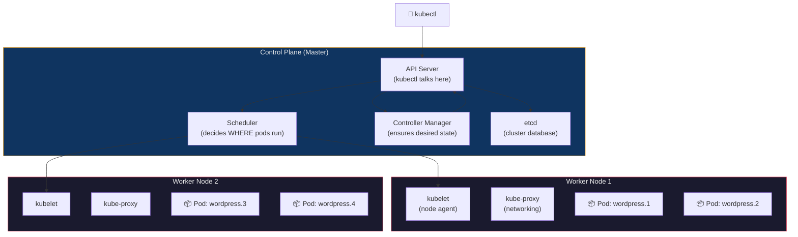
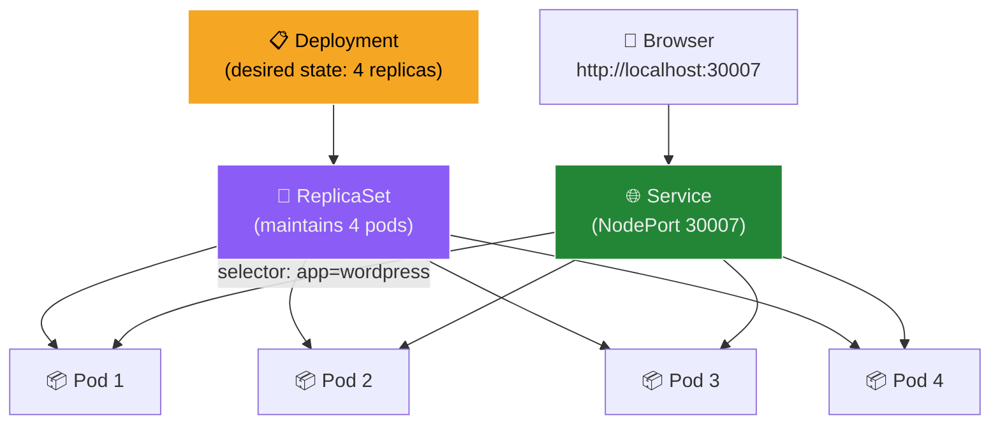
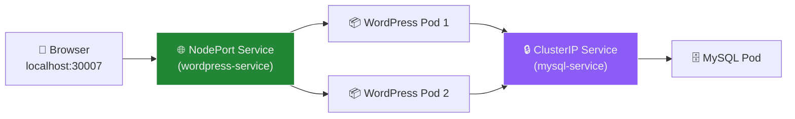
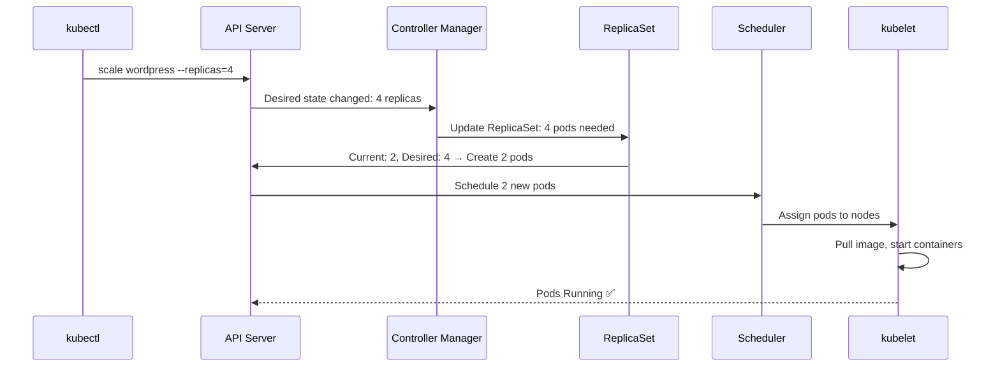

## Objective

Deploy, scale, and self-heal a WordPress application on a local Kubernetes cluster using k3d to understand core Kubernetes concepts including Pods, Deployments, Services, and ReplicaSets.

---

## Theory

### Why Kubernetes After Docker Swarm?

Experiment 11 used Docker Swarm for orchestration. Kubernetes solves the same problems — scaling, self-healing, load balancing — but at a much larger scale with far more features:

| Feature | Docker Swarm | Kubernetes |
| :--- | :--- | :--- |
| **Setup** | Very easy | More complex |
| **Scaling** | Basic (`service scale`) | Advanced (auto-scaling based on CPU/memory) |
| **Ecosystem** | Small | Huge (monitoring, logging, service mesh, etc.) |
| **Industry adoption** | Rare | Industry standard (AWS EKS, GKE, AKS) |
| **Scheduling** | Simple round-robin | Advanced (affinity, taints, tolerations) |
| **Configuration** | Compose YAML | Declarative YAML manifests with full API |

> **Verdict:** Swarm is great for learning orchestration basics. Kubernetes is what companies actually use in production.

### Kubernetes Architecture



### Core Concepts — Docker to Kubernetes Translation

| Docker Concept | Kubernetes Equivalent | What It Means |
| :--- | :--- | :--- |
| Container | **Pod** | Smallest deployable unit — wraps 1+ containers |
| Compose service | **Deployment** | Declares desired state: image, replicas, labels |
| Load balancing | **Service** | Stable endpoint that routes traffic to matching pods |
| Scaling count | **ReplicaSet** | Ensures N pod copies are always running |
| Compose file | **YAML Manifest** | Declarative configuration applied via `kubectl apply` |

### How Kubernetes Objects Relate



**The chain:** You create a **Deployment** → Kubernetes creates a **ReplicaSet** → ReplicaSet creates **Pods** → A **Service** exposes them.

### Why k3d Instead of Minikube?

| Tool | How It Works | WSL2 Compatibility |
| :--- | :--- | :--- |
| **Minikube** | Runs K8s inside a VM | ❌ WSL2 is already a VM — nested VMs fail or need special config |
| **k3d** | Runs K8s inside Docker containers | ✅ Docker already works on WSL2 — no VM needed |
| **kubeadm** | Real multi-VM cluster | ⚠️ Requires 2-3 separate VMs with 2+ CPU, 2+ GB RAM each |

---

## Prerequisites

- WSL2 with Ubuntu
- Docker Desktop running
- Terminal access

---

## Hands-on Lab

### Phase 1: Install kubectl and k3d

**Install kubectl** (the Kubernetes CLI):

```bash
curl -LO "https://dl.k8s.io/release/$(curl -Ls https://dl.k8s.io/release/stable.txt)/bin/linux/amd64/kubectl"
chmod +x kubectl
sudo mv kubectl /usr/local/bin/
kubectl version --client
```

| Step | Purpose |
| :--- | :--- |
| `curl -LO` | Downloads the latest stable kubectl binary |
| `chmod +x` | Makes it executable |
| `sudo mv` | Places it in system PATH |

**Install k3d** (lightweight Kubernetes in Docker):

```bash
curl -s https://raw.githubusercontent.com/k3d-io/k3d/main/install.sh | bash
k3d version
```


---

### Phase 2: Create the Kubernetes Cluster

```bash
k3d cluster create mylab \
  --port "30007:30007@server:0" \
  --port "8888:80@loadbalancer" \
  --agents 1
```

| Flag | Purpose |
| :--- | :--- |
| `mylab` | Cluster name |
| `--port "30007:30007@server:0"` | Maps NodePort 30007 from k3d server container to WSL2 host |
| `--port "8888:80@loadbalancer"` | Maps LB port 80 to host port 8888 |
| `--agents 1` | Creates 1 worker node + 1 control plane node |

> **Critical:** Port mappings **must** be set at cluster creation time. They cannot be added later without deleting and recreating the cluster.

**Verify the cluster:**

```bash
kubectl get nodes
```

**Expected output:**

```text
NAME                  STATUS   ROLES                  AGE    VERSION
k3d-mylab-agent-0     Ready    <none>                 102s   v1.31.5+k3s1
k3d-mylab-server-0    Ready    control-plane,master   105s   v1.31.5+k3s1
```


---

### Phase 3: Create the WordPress Deployment

```bash
mkdir -p ~/k8s-lab && cd ~/k8s-lab
```

Create `wordpress-deployment.yaml`:

```yaml
apiVersion: apps/v1
kind: Deployment
metadata:
  name: wordpress
spec:
  replicas: 2
  selector:
    matchLabels:
      app: wordpress
  template:
    metadata:
      labels:
        app: wordpress
    spec:
      containers:
      - name: wordpress
        image: wordpress:latest
        ports:
        - containerPort: 80
        env:
        - name: WORDPRESS_DB_HOST
          value: "mysql-service:3306"
        - name: WORDPRESS_DB_USER
          value: "wpuser"
        - name: WORDPRESS_DB_PASSWORD
          value: "wppass"
        - name: WORDPRESS_DB_NAME
          value: "wordpress"
```

#### YAML Manifest Breakdown

| Field | Purpose |
| :--- | :--- |
| `apiVersion: apps/v1` | Which Kubernetes API group to use for Deployments |
| `kind: Deployment` | Resource type — tells K8s to create a Deployment object |
| `metadata.name` | Unique name for this deployment |
| `spec.replicas: 2` | Run 2 identical pods |
| `selector.matchLabels` | How the Deployment finds its pods — must match `template.labels` |
| `template` | Blueprint for each pod |
| `containers[].image` | Docker image to run |
| `containerPort: 80` | Port the container listens on |
| `env` | Environment variables passed to the container |

> **Why env vars?** WordPress requires `WORDPRESS_DB_HOST` etc. to connect to MySQL. Without them, WordPress shows a database connection error.

---

### Phase 4: Create the MySQL Deployment and Services

Create `mysql-deployment.yaml`:

```yaml
apiVersion: apps/v1
kind: Deployment
metadata:
  name: mysql
spec:
  replicas: 1
  selector:
    matchLabels:
      app: mysql
  template:
    metadata:
      labels:
        app: mysql
    spec:
      containers:
      - name: mysql
        image: mysql:5.7
        env:
        - name: MYSQL_ROOT_PASSWORD
          value: "rootpass"
        - name: MYSQL_DATABASE
          value: "wordpress"
        - name: MYSQL_USER
          value: "wpuser"
        - name: MYSQL_PASSWORD
          value: "wppass"
        ports:
        - containerPort: 3306
```

Create `mysql-service.yaml` (ClusterIP — internal only):

```yaml
apiVersion: v1
kind: Service
metadata:
  name: mysql-service
spec:
  selector:
    app: mysql
  ports:
    - port: 3306
      targetPort: 3306
```

Create `wordpress-service.yaml` (NodePort — external access):

```yaml
apiVersion: v1
kind: Service
metadata:
  name: wordpress-service
spec:
  type: NodePort
  selector:
    app: wordpress
  ports:
    - port: 80
      targetPort: 80
      nodePort: 30007
```

#### Service Types Explained

| Type | Visibility | Use Case |
| :--- | :--- | :--- |
| **ClusterIP** (default) | Internal only — pods can reach it, browsers cannot | Databases, internal APIs |
| **NodePort** | External — exposed on every node at port 30000–32767 | Development, lab access |
| **LoadBalancer** | External — provisions a cloud load balancer | Production on AWS/GCP/Azure |




---

### Phase 5: Deploy Everything and Verify

```bash
cd ~/k8s-lab

# Apply all manifests
kubectl apply -f mysql-deployment.yaml
kubectl apply -f mysql-service.yaml
kubectl apply -f wordpress-deployment.yaml
kubectl apply -f wordpress-service.yaml

# Watch pods come up in real-time
watch kubectl get pods
```

> **Why `watch`?** Pods take 30–60 seconds to pull images. Without live monitoring, students think something is broken and kill the terminal.

**Verify everything:**

```bash
kubectl get pods
kubectl get svc
kubectl get deployment wordpress
```

**Expected output:**

```text
NAME                         READY   STATUS    RESTARTS   AGE
mysql-7bdb4b6688-bg7dt       1/1     Running   0          3m20s
wordpress-7c587db787-d8w8n   1/1     Running   0          3m18s
wordpress-7c587db787-nswjl   1/1     Running   0          3m18s

NAME                TYPE        CLUSTER-IP      PORT(S)        AGE
kubernetes          ClusterIP   10.43.0.1       443/TCP        4m23s
mysql-service       ClusterIP   10.43.78.132    3306/TCP       4m21s
wordpress-service   NodePort    10.43.143.178   80:30007/TCP   110s

NAME        READY   UP-TO-DATE   AVAILABLE   AGE
wordpress   2/2     2            2           110s
```

**Test access:**

```bash
curl -s -o /dev/null -w "%{http_code}" http://localhost:30007
# Expected: 302 (WordPress redirect to setup page)
```

Open in your Windows browser: `http://localhost:30007`

> **Note:** Unlike the Swarm experiment (EXP-11), k3d's `--port` flag handles the WSL2→Windows port forwarding automatically — no `netsh` needed.


---

### Phase 6: Scale the Application

```bash
kubectl scale deployment wordpress --replicas=4
```

| Argument | Purpose |
| :--- | :--- |
| `deployment wordpress` | Target the wordpress Deployment |
| `--replicas=4` | Set desired pod count to 4 |

**Verify:**

```bash
watch kubectl get pods
kubectl get deployment wordpress
```

**Expected:**

```text
NAME                         READY   STATUS    RESTARTS   AGE
mysql-7bdb4b6688-bg7dt       1/1     Running   0          3m20s
wordpress-7c587db787-d2hzj   1/1     Running   0          65s    ← new
wordpress-7c587db787-d8w8n   1/1     Running   0          3m18s
wordpress-7c587db787-nswjl   1/1     Running   0          3m18s
wordpress-7c587db787-vpvzw   1/1     Running   0          65s    ← new

NAME        READY   UP-TO-DATE   AVAILABLE   AGE
wordpress   4/4     4            4           3m19s
```

#### Deep Dive: How Scaling Works in Kubernetes



The **Controller Manager** continuously compares desired state (4 replicas) vs actual state. If they differ, it creates or deletes pods until they match.

---

### Phase 7: Self-Healing Demonstration

Kubernetes automatically replaces failed pods — just like Swarm, but with more sophisticated scheduling.

**Step 1: List pods and pick one to delete:**

```bash
kubectl get pods
```

**Step 2: Delete a pod (simulate a crash):**

```bash
kubectl delete pod <pod-name>
# Example: kubectl delete pod wordpress-7c587db787-d2hzj
```

**Step 3: Watch Kubernetes recreate it:**

```bash
watch kubectl get pods
```

The deleted pod disappears and a **new pod** with a different name appears within seconds. The total count stays at 4.


#### How Self-Healing Works

| Step | What Happens |
| :--- | :--- |
| 1 | You delete pod `wordpress-d2hzj` |
| 2 | ReplicaSet detects: actual = 3, desired = 4 |
| 3 | ReplicaSet tells API Server: "create 1 new pod" |
| 4 | Scheduler assigns it to a node |
| 5 | kubelet pulls image and starts the container |
| 6 | Actual = 4 again ✅ |

> **Key difference from Swarm:** In Swarm, the old task stays in history as `Shutdown/Failed`. In Kubernetes, the old pod is fully removed and a brand-new pod with a new name is created.

---

### Phase 8: Cleanup

```bash
# Delete Kubernetes resources
kubectl delete -f ~/k8s-lab/wordpress-service.yaml
kubectl delete -f ~/k8s-lab/wordpress-deployment.yaml
kubectl delete -f ~/k8s-lab/mysql-service.yaml
kubectl delete -f ~/k8s-lab/mysql-deployment.yaml

# Verify
kubectl get pods    # pods terminating/gone
kubectl get svc     # only 'kubernetes' ClusterIP remains

# Delete the entire k3d cluster
k3d cluster delete mylab
```

**Expected cleanup output:**

```text
INFO[0006] Deleting cluster 'mylab'
INFO[0018] Deleting cluster network 'k3d-mylab'
INFO[0018] Deleting 1 attached volumes...
INFO[0018] Removing cluster details from default kubeconfig...
INFO[0018] Successfully deleted cluster mylab!
```

---

## Part C — Swarm vs Kubernetes Comparison

| Feature | Docker Swarm (EXP-11) | Kubernetes (EXP-12) |
| :--- | :--- | :--- |
| **Deploy command** | `docker stack deploy` | `kubectl apply -f` |
| **Scale command** | `docker service scale` | `kubectl scale deployment` |
| **Self-healing** | Yes (basic — restart) | Yes (advanced — reschedule to different node) |
| **Config format** | docker-compose.yml | YAML manifests (Deployment, Service, etc.) |
| **Load balancing** | Ingress mesh (basic) | Services + Ingress controllers (advanced) |
| **Auto-scaling** | No | Yes (HPA — Horizontal Pod Autoscaler) |
| **Rolling updates** | Basic | Advanced (rollback, canary, blue-green) |
| **Ecosystem** | Small | Massive (Helm, Istio, Prometheus, ArgoCD) |
| **Cloud support** | Limited | Native (EKS, GKE, AKS) |

### When to Use What

| Tool | Best For |
| :--- | :--- |
| **Docker Compose** | Development and testing on a single machine |
| **Docker Swarm** | Simple production with basic orchestration needs |
| **k3d / Minikube** | Learning Kubernetes on your laptop |
| **kubeadm** | Real, production-style multi-node clusters |
| **EKS / GKE / AKS** | Enterprise production workloads |

---

## Part D — Advanced: Real Cluster with kubeadm

For production-style clusters with real VMs (not needed for this lab, but covered for completeness):

**Requirements:** 2-3 VMs, Ubuntu 22.04+, each with 2+ CPU, 2+ GB RAM.

```bash
# Step 1: Install on ALL nodes
sudo apt update
sudo apt install -y apt-transport-https ca-certificates curl
curl -fsSL https://pkgs.k8s.io/core:/stable:/v1.29/deb/Release.key | \
  sudo gpg --dearmor -o /etc/apt/keyrings/kubernetes-apt-keyring.gpg
echo 'deb [signed-by=/etc/apt/keyrings/kubernetes-apt-keyring.gpg] \
  https://pkgs.k8s.io/core:/stable:/v1.29/deb/ /' | \
  sudo tee /etc/apt/sources.list.d/kubernetes.list
sudo apt update && sudo apt install -y kubeadm kubelet kubectl
sudo apt-mark hold kubeadm kubelet kubectl

# Step 2: Initialize master node
sudo kubeadm init

# Step 3: Configure kubectl
mkdir -p $HOME/.kube
sudo cp /etc/kubernetes/admin.conf $HOME/.kube/config
sudo chown $(id -u):$(id -g) $HOME/.kube/config

# Step 4: Install network plugin (Calico)
kubectl apply -f https://docs.projectcalico.org/manifests/calico.yaml

# Step 5: Join workers (run on each worker node)
kubeadm join <master-ip>:6443 --token <token> \
  --discovery-token-ca-cert-hash sha256:<hash>

# Step 6: Verify from master
kubectl get nodes
```

---

## Lab Fixes Summary

| # | What | Problem | Fix |
| :--- | :--- | :--- | :--- |
| 1 | Tool choice | Minikube needs nested VMs on WSL2 | Chose k3d (runs inside Docker containers) |
| 2 | Installation | kubectl and k3d not installed, lab said "ask instructor" | Added full install commands |
| 3 | Cluster creation | No creation command provided | `k3d cluster create` with explicit `--port` mappings |
| 4 | Deployment YAML | No `WORDPRESS_DB_*` env vars → WordPress shows DB error | Added env vars pointing to `mysql-service:3306` |
| 5 | Pod monitoring | `kubectl get pods` is a snapshot — no live feedback | Added `watch kubectl get pods` throughout |
| 6 | Browser access | Lab said `<node-ip>:30007` with no guidance | Used `localhost:30007` — k3d port mapping handles it |
| 7 | Cleanup | No cleanup steps provided | Added `kubectl delete` + `k3d cluster delete mylab` |

### The Two Most Critical Changes

**Change 1 + 3 (k3d + port mappings):** Minikube would have failed entirely on WSL2 due to nested virtualization. And even with k3d, if `--port` flags aren't set at cluster creation, WordPress is unreachable — ports are trapped inside Docker's internal network with no way to add them later.

---

## Common Pitfalls & Troubleshooting

| Problem | Cause | Fix |
| :--- | :--- | :--- |
| Pods stuck in `ContainerCreating` | Image still downloading | Wait 30-60s; check `kubectl describe pod <name>` |
| Pods in `CrashLoopBackOff` | App crashes on startup (missing env vars, bad config) | Check logs: `kubectl logs <pod-name>` |
| WordPress shows "Error establishing DB connection" | No MySQL pod or wrong `WORDPRESS_DB_HOST` | Deploy MySQL + set host to `mysql-service:3306` |
| `curl localhost:30007` returns nothing | Port not mapped at k3d cluster creation | Delete cluster, recreate with `--port "30007:30007@server:0"` |
| `kubectl: command not found` | kubectl not installed or not in PATH | Install kubectl and move to `/usr/local/bin/` |
| Pods show `0/1 Running` | Container started but readiness probe failing | Check `kubectl describe pod <name>` for probe details |

---

## Glossary

| Term | Definition |
| :--- | :--- |
| **Kubernetes (K8s)** | Open-source container orchestration platform — industry standard |
| **kubectl** | CLI tool for communicating with the Kubernetes API server |
| **k3d** | Lightweight tool that runs K3s (minimal Kubernetes) inside Docker containers |
| **Pod** | Smallest deployable unit — wraps one or more containers |
| **Deployment** | Declarative definition of desired state: image, replicas, labels |
| **ReplicaSet** | Controller that ensures the specified number of pod replicas are running |
| **Service** | Stable network endpoint that routes traffic to pods matching a label selector |
| **NodePort** | Service type that exposes a port (30000-32767) on every node |
| **ClusterIP** | Default Service type — internal only, not accessible from outside the cluster |
| **Label** | Key-value metadata attached to resources for selection and grouping |
| **Selector** | Query that matches resources by their labels |
| **Namespace** | Virtual cluster within a cluster — isolates resources |
| **kubelet** | Agent running on each node — manages pods and communicates with API server |
| **kube-proxy** | Network proxy on each node — handles Service routing rules |
| **API Server** | Central management point — all kubectl commands go through it |
| **Controller Manager** | Runs controllers that maintain desired state (ReplicaSet, Deployment, etc.) |
| **Scheduler** | Decides which node a new pod should run on based on resources and constraints |
| **etcd** | Distributed key-value store — the cluster's "database" for all state |
| **kubeadm** | Tool for bootstrapping production-grade Kubernetes clusters |
| **Manifest** | YAML file declaring the desired state of Kubernetes resources |

---

## Quick Reference Card

```bash
# Install kubectl
curl -LO "https://dl.k8s.io/release/$(curl -Ls https://dl.k8s.io/release/stable.txt)/bin/linux/amd64/kubectl"
chmod +x kubectl && sudo mv kubectl /usr/local/bin/

# Install k3d
curl -s https://raw.githubusercontent.com/k3d-io/k3d/main/install.sh | bash

# Create cluster with port mappings
k3d cluster create mylab --port "30007:30007@server:0" --agents 1

# Apply manifests
kubectl apply -f <file.yaml>

# Watch pods in real-time
watch kubectl get pods

# Scale a deployment
kubectl scale deployment <name> --replicas=N

# Delete a pod (test self-healing)
kubectl delete pod <pod-name>

# Check logs
kubectl logs <pod-name>

# Describe a resource (debugging)
kubectl describe pod <pod-name>

# Delete resources by manifest
kubectl delete -f <file.yaml>

# Delete k3d cluster
k3d cluster delete mylab
```

---

## References

- [Kubernetes Official Docs](https://kubernetes.io/docs/)
- [k3d Documentation](https://k3d.io/)
- [kubectl Cheat Sheet](https://kubernetes.io/docs/reference/kubectl/cheatsheet/)
- [Kubernetes Concepts](https://kubernetes.io/docs/concepts/)
