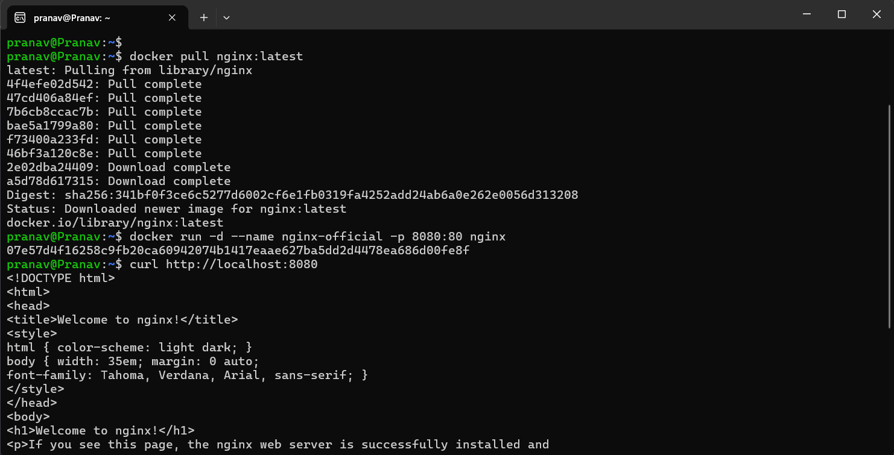
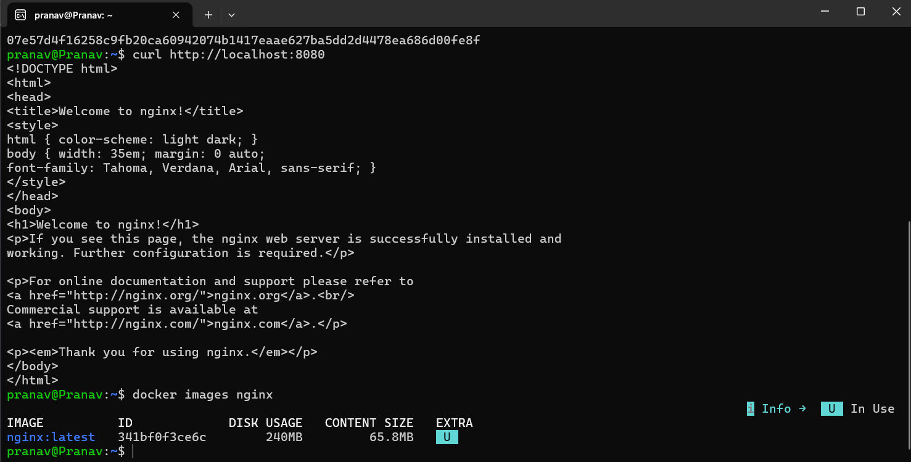
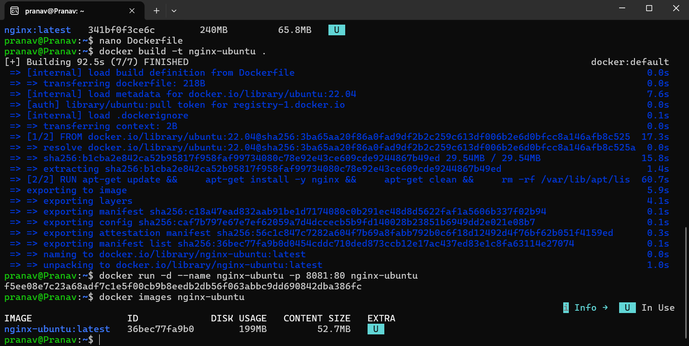
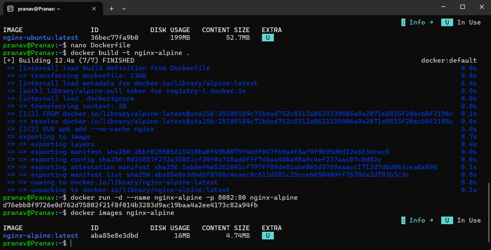
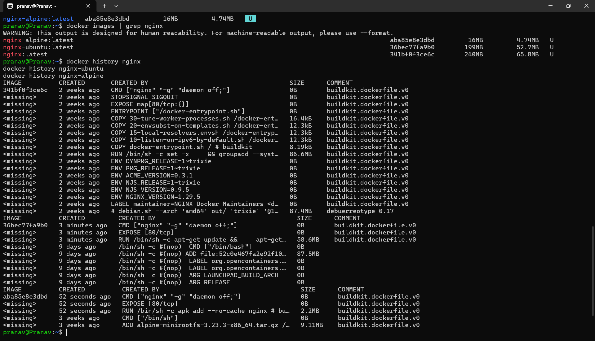
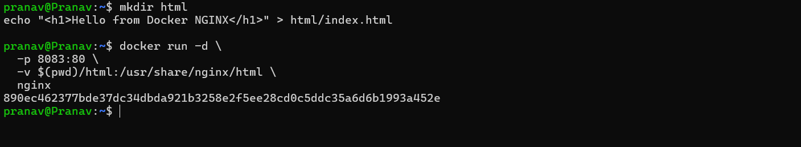

## 🎯 Objective

Deploy NGINX using three different Docker image strategies — the **Official image**, a **Ubuntu-based** custom image, and an **Alpine-based** custom image — then compare their image sizes, build times, layer structures, and production suitability.

---

## 🧠 Theory: Why Base Images Matter

Before running commands, it's essential to understand the concept of a **base image** and why it has a massive impact on your containerized application.

### What is a Base Image?

Every Docker image is built in **layers**. The very first layer is the **base image** — the foundational operating system or runtime that your application is built upon (specified by the `FROM` instruction in a Dockerfile). Everything you install or configure adds layers on top.

### The Three Strategies

| Strategy | Base | Philosophy |
| :--- | :--- | :--- |
| **Official `nginx`** | Debian (Slim) | Pre-optimized by the NGINX team; ready out-of-the-box. |
| **Ubuntu + NGINX** | `ubuntu:22.04` | Full-featured OS; install NGINX manually via `apt`. |
| **Alpine + NGINX** | `alpine:latest` | Ultra-minimal Linux distro (~5 MB); install NGINX via `apk`. |

### Why Alpine Images Are Smaller

Alpine Linux uses **musl libc** and **BusyBox** instead of the standard GNU C Library (glibc) and GNU coreutils. This means:

* **No unnecessary utilities**: Alpine ships with only the bare essentials.
* **musl libc** is a lightweight alternative to glibc, producing much smaller binaries.
* **Package manager (`apk`)** is designed for speed and minimal disk footprint; the `--no-cache` flag avoids storing the package index locally.
* **Result**: An Alpine base image is typically **~5–8 MB**, compared to Ubuntu's **~28–30 MB** (compressed).

### Why Ubuntu Images Are Avoided in Production

While Ubuntu is excellent for learning and debugging, it is **rarely used as a production base image** because:

* **Bloated size**: Ubuntu ships with hundreds of packages you don't need in a container (e.g., `apt`, `bash`, `systemd` stubs, locales).
* **Larger attack surface**: More packages = more potential CVEs (Common Vulnerabilities and Exposures).
* **Slower CI/CD**: Larger images take longer to pull, push, and deploy — multiplied across hundreds of containers in a cluster.
* **Wasted resources**: In Kubernetes, every node caches images. A 200 MB image vs. a 16 MB image adds up quickly at scale.

---

## ⚙️ Prerequisites

Ensure you have the following tools installed and running:

* **Docker Desktop** (or Docker Engine on Linux)
* **WSL 2** (for Windows users — recommended Docker backend)
* Basic familiarity with `docker run`, `Dockerfile`, and port mapping

---

## 🧪 Part 1: Deploy NGINX Using the Official Image (Recommended Approach)

This is the simplest and most production-ready method.

### Step 1: Pull the Image

```bash
docker pull nginx:latest
```

* **Command**: `docker pull` downloads an image from Docker Hub.
* **Argument**: `nginx:latest` pulls the most recent stable build of the official NGINX image, maintained by the NGINX team.
* **Expected Output**:

    ```text
    latest: Pulling from library/nginx
    4f4efe02d542: Pull complete
    47cd406a84ef: Pull complete
    ...
    Status: Downloaded newer image for nginx:latest
    ```

### Step 2: Run the Container

```bash
docker run -d --name nginx-official -p 8080:80 nginx
```

* **Command**: `docker run` creates and starts a new container.
* **Flags**:
  * `-d` (**Detached mode**): Runs the container in the background. Without this, your terminal would be hijacked by NGINX's access logs.
  * `--name nginx-official`: Assigns a human-readable name so you can reference it easily (instead of a random hex ID).
  * `-p 8080:80` (**Port mapping**): Maps **Host port 8080** → **Container port 80**. NGINX inside the container listens on port 80, but your host machine accesses it via port 8080.
  * `nginx`: The image to instantiate.
* **Expected Output**: A long container ID string, e.g., `07e57d4f16258c9fb20ca60942074b1417eaae627ba5dd2d4478ea686d00fe8f`.

### Step 3: Verify the Deployment

```bash
curl http://localhost:8080
```

* **Command**: Sends an HTTP GET request to the NGINX server.
* **Expected Output**: The raw HTML of the **"Welcome to nginx!"** page, confirming the server is live.

### Step 4: Inspect the Image

```bash
docker images nginx
```

* **Expected Output**:

    ```text
    IMAGE            ID             DISK USAGE    CONTENT SIZE
    nginx:latest     341bf0f3ce6c   240MB         65.8MB
    ```

* **Key Observation**: The official image is **~240 MB** on disk. It is based on Debian (slim variant) and comes pre-optimized with NGINX configured, entrypoint scripts, and environment variable templating.

---

## 🧪 Part 2: Custom NGINX Using Ubuntu Base Image

Here we build NGINX from scratch on a full Ubuntu OS to understand the overhead of a general-purpose base image.

### Step 1: Create the Dockerfile

```Dockerfile
FROM ubuntu:22.04

RUN apt-get update && \
    apt-get install -y nginx && \
    apt-get clean && \
    rm -rf /var/lib/apt/lists/*

EXPOSE 80

CMD ["nginx", "-g", "daemon off;"]
```

**Line-by-line breakdown:**

| Line | Purpose |
| :--- | :--- |
| `FROM ubuntu:22.04` | Uses Ubuntu 22.04 LTS as the base. This pulls the full OS (~28 MB compressed). |
| `RUN apt-get update` | Refreshes the package index so `apt` knows what's available. |
| `apt-get install -y nginx` | Installs NGINX. The `-y` flag auto-confirms prompts. |
| `apt-get clean` | Removes cached `.deb` files to reduce image size. |
| `rm -rf /var/lib/apt/lists/*` | Deletes the package index files (no longer needed after install). |
| `EXPOSE 80` | Documents that the container listens on port 80 (informational only). |
| `CMD ["nginx", "-g", "daemon off;"]` | Starts NGINX in the **foreground**. By default, NGINX daemonizes itself, but Docker requires the main process to stay in the foreground (PID 1) or the container exits immediately. |

### Step 2: Build the Image

```bash
docker build -t nginx-ubuntu .
```

* **Command**: `docker build` reads the Dockerfile and constructs an image layer by layer.
* **Flags**:
  * `-t nginx-ubuntu` (**Tag**): Names the resulting image `nginx-ubuntu` for easy reference.
  * `.` (**Build context**): Tells Docker to use the current directory as the context (where to find the Dockerfile and any files to `COPY`).
* **Expected Output**: Build completes in approximately **92.5 seconds** (network dependent):

    ```text
    [+] Building 92.5s (7/7) FINISHED
    ```

### Step 3: Run the Container

```bash
docker run -d --name nginx-ubuntu -p 8081:80 nginx-ubuntu
```

* **Flags**: Same as Part 1, but using port **8081** on the host (to avoid conflicts with the official container on 8080).
* **Expected Output**: A container ID string.

### Step 4: Inspect the Image

```bash
docker images nginx-ubuntu
```

* **Expected Output**:

    ```text
    IMAGE                  ID             DISK USAGE    CONTENT SIZE
    nginx-ubuntu:latest    36bec77fa9b0   199MB         52.7MB
    ```

* **Key Observation**: The Ubuntu-based image is **199 MB**, and took **92.5 seconds** to build. The bulk of the time and size comes from `apt-get update` downloading package metadata and installing NGINX plus its dependencies.

---

## 🧪 Part 3: Custom NGINX Using Alpine Base Image

Now we achieve the same result with a fraction of the resources.

### Step 1: Create the Dockerfile

```Dockerfile
FROM alpine:latest

RUN apk add --no-cache nginx

EXPOSE 80

CMD ["nginx", "-g", "daemon off;"]
```

**Line-by-line breakdown:**

| Line | Purpose |
| :--- | :--- |
| `FROM alpine:latest` | Uses Alpine Linux — a security-oriented, lightweight distro (~5 MB). |
| `RUN apk add --no-cache nginx` | Installs NGINX using Alpine's `apk` package manager. `--no-cache` avoids saving the package index locally, keeping the image small. |
| `EXPOSE 80` | Documents the listening port. |
| `CMD ["nginx", "-g", "daemon off;"]` | Runs NGINX in the foreground (same reason as Ubuntu). |

### Step 2: Build the Image

```bash
docker build -t nginx-alpine .
```

* **Expected Output**: Build completes in approximately **12.4 seconds** — over **7x faster** than the Ubuntu build:

    ```text
    [+] Building 12.4s (7/7) FINISHED
    ```

### Step 3: Run the Container

```bash
docker run -d --name nginx-alpine -p 8082:80 nginx-alpine
```

* **Flags**: Uses port **8082** on the host.

### Step 4: Inspect the Image

```bash
docker images nginx-alpine
```

* **Expected Output**:

    ```text
    IMAGE                   ID             DISK USAGE    CONTENT SIZE
    nginx-alpine:latest     aba85e8e3dbd   16MB          4.74MB
    ```

* **Key Observation**: The Alpine-based image is only **16 MB** — roughly **15x smaller** than the official image and **12x smaller** than the Ubuntu image.

---

## 📊 Part 4: Image Pull Time and Size Comparison

### I. Measured Image Pull & Build Times

These are the actual times measured during the experiment:

| Image | Pull/Build Time | Disk Usage | Content Size |
| :--- | :--- | :--- | :--- |
| `nginx:latest` (Official) | ~8 layers pulled | **240 MB** | 65.8 MB |
| `nginx-ubuntu` (Custom) | **92.5 seconds** build | **199 MB** | 52.7 MB |
| `nginx-alpine` (Custom) | **12.4 seconds** build | **16 MB** | 4.74 MB |

> **Takeaway**: Alpine images are **7.5x faster to build** and **15x smaller** than the official image. In a CI/CD pipeline that builds and deploys hundreds of times a day, this difference is enormous.

### II. Why This Matters in Production

* **Network bandwidth**: Pulling a 16 MB image vs. a 240 MB image across 50 Kubernetes nodes saves **~11 GB** of transfer per deployment.
* **Cold start latency**: Smaller images mean faster container startup, critical for auto-scaling.
* **Registry storage**: Docker registries (ECR, GCR, Docker Hub) charge by storage. Smaller images = lower costs.

---

## 🔬 Part 5: Layer Inspection (Deep Dive)

### Compare Layers

```bash
docker history nginx
docker history nginx-ubuntu
docker history nginx-alpine
```

### Layer Comparison Summary

| Image | Total Layers | Largest Layer | Key Observation |
| :--- | :--- | :--- | :--- |
| `nginx` (Official) | ~17 layers | 87.4 MB (Debian base) + 86.6 MB (NGINX install) | Many helper scripts, env vars, and entrypoint configs |
| `nginx-ubuntu` | ~8 layers | 87.5 MB (Ubuntu base) + 58.6 MB (apt install) | Full Ubuntu filesystem included |
| `nginx-alpine` | ~5 layers | 9.11 MB (Alpine base) + 2.2 MB (apk install) | Minimal — only what's needed |

### 🧐 Deep Dive: How Docker Layers Work

Each instruction in a Dockerfile (`FROM`, `RUN`, `COPY`, etc.) creates a new **read-only layer**. When a container runs, Docker adds a thin **writable layer** on top.

```text
┌─────────────────────────┐
│   Writable Container    │  ← Runtime changes (logs, temp files)
├─────────────────────────┤
│   CMD / ENTRYPOINT      │  ← Layer 3 (0 bytes — just metadata)
├─────────────────────────┤
│   RUN apk add nginx     │  ← Layer 2 (2.2 MB for Alpine)
├─────────────────────────┤
│   FROM alpine:latest    │  ← Layer 1 (9.11 MB base)
└─────────────────────────┘
```

**Why fewer layers matter:**

* Fewer layers = smaller image = faster pulls
* Docker caches layers, so unchanged layers aren't rebuilt
* Combining `RUN` commands with `&&` reduces the total number of layers

---

## 🧪 Part 6: Functional Task — Serve a Custom HTML Page

### Step 1: Create the HTML File

```bash
mkdir html
echo "<h1>Hello from Docker NGINX</h1>" > html/index.html
```

### Step 2: Run with a Volume Mount

```bash
docker run -d \
  -p 8083:80 \
  -v $(pwd)/html:/usr/share/nginx/html \
  nginx
```

* **Flags**:
  * `-v $(pwd)/html:/usr/share/nginx/html` (**Volume mount**): Maps your local `html/` directory into the container's web root. This means any changes you make to `html/index.html` on your host are **instantly reflected** inside the container — no rebuild needed.
* **Expected Output**: A container ID. Visit `http://localhost:8083` to see your custom page.

### Why Volume Mounts?

* **Development speed**: Edit files locally, see changes instantly.
* **Data persistence**: Container data survives restarts.
* **Separation of concerns**: Config/content lives outside the image, making the image reusable.

---

## 📋 Part 7: Comprehensive Comparison Summary

### Image Comparison Table

| Feature | Official NGINX | Ubuntu + NGINX | Alpine + NGINX |
| :--- | :--- | :--- | :--- |
| **Disk Usage** | 240 MB | 199 MB | 16 MB |
| **Content Size** | 65.8 MB | 52.7 MB | 4.74 MB |
| **Build Time** | Pre-built | ~92.5 seconds | ~12.4 seconds |
| **Layer Count** | ~17 | ~8 | ~5 |
| **Ease of Use** | ⭐⭐⭐ (Plug & Play) | ⭐⭐ (Manual setup) | ⭐⭐ (Manual setup) |
| **Debugging Tools** | Limited | Excellent (`apt`, `bash`) | Minimal (`ash` shell) |
| **Security Surface** | Medium | Large | Small |
| **Production Ready** | ✅ Yes | ⚠️ Rarely | ✅ Yes |

### When to Use What

| Use Case | Recommended Image |
| :--- | :--- |
| Production web server / reverse proxy | Official `nginx` or Alpine |
| Learning Linux internals + NGINX config | Ubuntu-based |
| Microservices / Kubernetes pods | Alpine-based |
| CI/CD build artifacts | Alpine-based |
| Heavy debugging / troubleshooting | Ubuntu-based |

---

## ⚠️ Troubleshooting & Common Pitfalls

### 1. Container Exits Immediately

* **Symptom**: `docker ps` shows nothing after `docker run`.
* **Cause**: NGINX defaults to running as a **daemon** (background process). When it daemonizes, PID 1 exits, and Docker thinks the container is done.
* **Fix**: Always include `CMD ["nginx", "-g", "daemon off;"]` in your Dockerfile to keep NGINX in the foreground.

### 2. "Bind: address already in use"

* **Error**: `Error response from daemon: driver failed programming external connectivity...`
* **Cause**: Another process (or container) is already using that host port.
* **Fix**: Change the host port, e.g., `-p 8084:80`, or stop the conflicting container with `docker stop <name>`.

### 3. "Conflict: container name is already in use"

* **Error**: `The container name "/nginx-official" is already in use...`
* **Cause**: A container with that name already exists (even if stopped).
* **Fix**: Remove the old container with `docker rm nginx-official`, or use a different name.

### 4. Alpine: "ash" shell instead of "bash"

* **Symptom**: Running `docker exec -it <container> bash` fails with `OCI runtime exec failed`.
* **Cause**: Alpine uses `ash` (from BusyBox), not `bash`.
* **Fix**: Use `docker exec -it <container> sh` instead.

### 5. Build takes too long / hangs at `apt-get update`

* **Cause**: Slow network or DNS issues inside the Docker build environment.
* **Fix**: Ensure Docker has internet access. On Windows, restart Docker Desktop.

---

## 📸 Visuals & Outputs













---

# Optional Read: NGINX Web Server Deep Dive

---

## 1. What is NGINX?

NGINX is a:

* High-performance **web server**
* **Reverse proxy**
* **Load balancer**
* **API gateway**

It is event-driven and asynchronous, which makes it far more efficient than traditional thread-based servers like Apache under high load.

---

## 2. Hosting Static Files (Most Common Use)

### Install NGINX on a Linux Server

**Ubuntu / Debian:**

```bash
sudo apt update
sudo apt install nginx
```

**RHEL / CentOS:**

```bash
sudo dnf install nginx
```

Start and enable the service:

```bash
sudo systemctl start nginx
sudo systemctl enable nginx
```

### Default Web Root

NGINX serves files from `/var/www/html` by default. Place your content there:

```bash
sudo nano /var/www/html/index.html
```

Access via `http://<server-ip>` in your browser.

---

## 3. Understanding NGINX Configuration

| Path | Purpose |
| :--- | :--- |
| `/etc/nginx/nginx.conf` | Main configuration file |
| `/etc/nginx/sites-available/` | Individual site configurations |
| `/etc/nginx/sites-enabled/` | Symlinks to active site configs |

NGINX uses **server blocks** (similar to Apache virtual hosts) to define how requests are handled.

---

## 4. Hosting a Custom Website (Server Block)

### Create the site directory and config

```bash
sudo mkdir -p /var/www/myapp
sudo chown -R www-data:www-data /var/www/myapp
```

### Create the NGINX configuration

```nginx
server {
    listen 80;
    server_name myapp.local;

    root /var/www/myapp;
    index index.html;

    location / {
        try_files $uri $uri/ =404;
    }
}
```

### Enable and reload

```bash
sudo ln -s /etc/nginx/sites-available/myapp /etc/nginx/sites-enabled/
sudo nginx -t        # Test configuration syntax
sudo systemctl reload nginx
```

---

## 5. NGINX as a Reverse Proxy

**Use case**: Frontend → NGINX → Backend app (Node.js, Python, Go)

```nginx
server {
    listen 80;

    location / {
        proxy_pass http://localhost:3000;
        proxy_set_header Host $host;
        proxy_set_header X-Real-IP $remote_addr;
    }
}
```

**Why this matters:**

* Hide backend ports from the public internet
* Central SSL/TLS termination
* Easy horizontal scaling

---

## 6. Load Balancing

```nginx
upstream backend_pool {
    server 10.0.0.1:8080;
    server 10.0.0.2:8080;
}

server {
    listen 80;

    location / {
        proxy_pass http://backend_pool;
    }
}
```

**Algorithms**: Round-robin (default), Least connections, IP hash.

---

## 7. HTTPS / SSL Termination

```nginx
server {
    listen 443 ssl;
    server_name example.com;

    ssl_certificate /etc/ssl/cert.pem;
    ssl_certificate_key /etc/ssl/key.pem;

    location / {
        root /var/www/html;
    }
}
```

---

## 8. NGINX vs Apache

| Feature | NGINX | Apache |
| :--- | :--- | :--- |
| Architecture | Event-driven | Process/thread |
| Static files | Faster | Slower |
| Reverse proxy | Excellent | Average |
| `.htaccess` support | No | Yes |
| Memory usage | Low | Higher |

---

**Student**: Pranav R Nair | **Batch**: 2(CCVT) | **SAP ID**: 500121466
