## 🎯 Objective

Containerize a Python Flask application using a `Dockerfile`, optimize the build context with `.dockerignore`, master image tagging and versioning strategies, implement multi-stage builds for production-ready images, and publish the final image to Docker Hub.

---

## 🧠 Theory: The Docker Build Pipeline

Before running commands, it's essential to understand the workflow that takes your source code and transforms it into a deployable container image.

### The Build Pipeline

```text
Source Code → Dockerfile → docker build → Image → docker run → Container
                ↑                                       ↓
          .dockerignore                          docker push → Registry
          (filters context)                                    (Docker Hub)
```

### Key Concepts

| Concept | What It Is | Why It Matters |
| :--- | :--- | :--- |
| **Dockerfile** | A text file with instructions to build an image layer by layer | Defines the reproducible "recipe" for your container |
| **.dockerignore** | A file that excludes paths from the build context | Reduces image size, speeds up builds, prevents secrets from leaking |
| **Tagging** | Naming and versioning images (e.g., `myapp:1.0`) | Enables version control, rollbacks, and organized registries |
| **Multi-stage builds** | Using multiple `FROM` statements to separate build and runtime | Produces smaller, more secure production images |
| **Docker Hub** | A cloud-hosted registry for storing and sharing images | Enables team collaboration and CI/CD pipelines |

---

## ⚙️ Prerequisites

* Docker Desktop installed and running
* A Docker Hub account (free at [hub.docker.com](https://hub.docker.com))
* Basic knowledge of Python (for understanding the Flask app)
* Familiarity with `docker run` and port mapping (covered in Experiments 1–3)

---

## 🧪 Part 1: Create the Application

### Step 1: Set Up the Project Directory

```bash
mkdir my-flask-app
cd my-flask-app
```

* **Command**: Creates a new folder and navigates into it. This folder will become the **build context** — everything Docker can "see" during the build.

### Step 2: Create the Flask Application

Create `app.py`:

```python
from flask import Flask
app = Flask(__name__)

@app.route('/')
def hello():
    return "Hello from Docker!"

@app.route('/health')
def health():
    return "OK"

if __name__ == '__main__':
    app.run(host='0.0.0.0', port=5000)
```

**Line-by-line breakdown:**

| Line | Purpose |
| :--- | :--- |
| `from flask import Flask` | Imports the Flask web framework |
| `app = Flask(__name__)` | Creates a Flask application instance |
| `@app.route('/')` | Defines the root URL endpoint |
| `app.run(host='0.0.0.0', port=5000)` | Starts the server on **all interfaces** (`0.0.0.0`) at port 5000. Using `0.0.0.0` is critical — `127.0.0.1` would only be accessible inside the container |

### Step 3: Create the Requirements File

Create `requirements.txt`:

```text
Flask==2.3.3
```

* This pins the Flask version to ensure reproducible builds across different environments.

---

## 🧪 Part 2: Write the Dockerfile

### Step 1: Create the Dockerfile

```dockerfile
# Use Python base image
FROM python:3.9-slim

# Set working directory
WORKDIR /app

# Copy requirements file
COPY requirements.txt .

# Install dependencies
RUN pip install --no-cache-dir -r requirements.txt

# Copy application code
COPY app.py .

# Expose port
EXPOSE 5000

# Run the application
CMD ["python", "app.py"]
```

**Instruction-by-instruction breakdown:**

| Instruction | What It Does | Why This Way |
| :--- | :--- | :--- |
| `FROM python:3.9-slim` | Sets the base image to Python 3.9 on a slim Debian variant (~120 MB vs ~900 MB for full) | `slim` removes docs, man pages, and unused packages to save space |
| `WORKDIR /app` | Sets `/app` as the working directory for all subsequent commands | Keeps things organized; avoids dumping files in `/` |
| `COPY requirements.txt .` | Copies **only** the requirements file first | Enables Docker layer caching — dependencies are only reinstalled when `requirements.txt` changes |
| `RUN pip install --no-cache-dir -r requirements.txt` | Installs Python dependencies | `--no-cache-dir` saves ~50 MB by not caching pip's download cache |
| `COPY app.py .` | Copies the application code | Done *after* pip install so code changes don't invalidate the dependency cache |
| `EXPOSE 5000` | Documents that the container listens on port 5000 | Informational — does not actually open the port |
| `CMD ["python", "app.py"]` | Defines the default command to run when the container starts | Uses **exec form** (JSON array) which runs directly as PID 1 |

### 🧐 Deep Dive: Why Copy Requirements Before Code?

Docker caches each layer. If you change `app.py` but not `requirements.txt`, Docker reuses the cached dependency layer — saving minutes on each build. This is called the **dependency caching pattern**:

```text
Layer 1: FROM python:3.9-slim        ← Cached (base image unchanged)
Layer 2: WORKDIR /app                 ← Cached
Layer 3: COPY requirements.txt .      ← Cached (file unchanged)
Layer 4: RUN pip install ...          ← Cached (requirements unchanged)
Layer 5: COPY app.py .                ← REBUILT (code changed)
Layer 6: CMD ["python", "app.py"]     ← REBUILT
```

---

## 🧪 Part 3: Configure .dockerignore

### Step 1: Create the .dockerignore File

```text
# Python files
__pycache__/
*.pyc
*.pyo
*.pyd

# Environment files
.env
.venv
env/
venv/

# IDE files
.vscode/
.idea/

# Git files
.git/
.gitignore

# OS files
.DS_Store
Thumbs.db

# Logs
*.log
logs/

# Test files
tests/
test_*.py
```

### Why .dockerignore Is Critical

| Without .dockerignore | With .dockerignore |
| :--- | :--- |
| `.git/` folder (often 50+ MB) gets copied into the build | Excluded — saves space and build time |
| `.env` with secrets gets baked into the image | Excluded — prevents credential leaks |
| `__pycache__/` adds stale bytecode | Excluded — Python generates fresh bytecode inside the container |
| `venv/` with host-OS libraries gets included | Excluded — container installs its own dependencies |
| Build context transfer: **50+ MB** | Build context transfer: **< 1 KB** |

---

## 🧪 Part 4: Build and Tag the Image

### Step 1: Basic Build

```bash
docker build -t my-flask-app .
```

* **Command**: `docker build` reads the Dockerfile and constructs an image.
* **Flags**:
  * `-t my-flask-app` (**Tag**): Names the image `my-flask-app` with an implicit `:latest` tag.
  * `.` (**Build context**): Tells Docker to use the current directory. Docker sends all files (minus `.dockerignore` exclusions) to the daemon.
* **Expected Output** (first build, ~69 seconds):

    ```text
    [+] Building 69.0s (11/11) FINISHED
    => [internal] load build definition from Dockerfile
    => [1/5] FROM docker.io/library/python:3.9-slim
    => [2/5] WORKDIR /app
    => [3/5] COPY requirements.txt .
    => [4/5] RUN pip install --no-cache-dir -r requirements.txt
    => [5/5] COPY app.py .
    => naming to docker.io/library/my-flask-app:latest
    ```

### Step 2: Version Tagging

```bash
# Tag with a specific version number
docker build -t my-flask-app:1.0 .
```

* **What changes**: Instead of `:latest`, the image gets the explicit tag `:1.0`.
* **Expected Output** (~6.6 seconds — cached):

    ```text
    [+] Building 6.6s (10/10) FINISHED
    => CACHED [2/5] WORKDIR /app
    => CACHED [3/5] COPY requirements.txt .
    => CACHED [4/5] RUN pip install ...
    => CACHED [5/5] COPY app.py .
    ```

> **Note**: The rebuild is nearly instant because Docker reuses all cached layers.

### Step 3: Multi-Tag Build

```bash
# Apply multiple tags in a single build
docker build -t my-flask-app:latest -t my-flask-app:1.0 .
```

* **Flags**: Multiple `-t` flags apply multiple tags to the **same** image (same SHA). This is efficient — no duplication.
* **Expected Output**: Build completes in ~2.3 seconds (fully cached), with both tags applied.

### Step 4: Tag for a Custom Registry

```bash
# Prefix with your Docker Hub username for publishing
docker build -t username/my-flask-app:1.0 .
```

* **Convention**: The format `username/image:tag` is required for pushing to Docker Hub. The `username/` prefix maps to your Docker Hub repository.

### Step 5: Re-tag an Existing Image

```bash
docker tag my-flask-app:latest my-flask-app:v1.0
```

* **Command**: `docker tag` creates a **new alias** for an existing image. It does NOT copy the image — both tags point to the same underlying layers.
* **Use case**: Promoting a tested image to a release version without rebuilding.

---

## 🧪 Part 5: Inspect the Image

### View Image Details

```bash
# List all images
docker images

# Show layer history
docker history my-flask-app

# Full JSON inspection
docker inspect my-flask-app
```

**`docker history` output** reveals each Dockerfile instruction as a layer:

```text
IMAGE          CREATED         CREATED BY                                      SIZE
82d629e35149   2 minutes ago   CMD ["python" "app.py"]                         0B
<missing>      2 minutes ago   EXPOSE [5000/tcp]                               0B
<missing>      2 minutes ago   COPY app.py . # buildkit                        12.3kB
<missing>      2 minutes ago   RUN pip install --no-cache-dir -r ...           13.4MB
<missing>      2 minutes ago   COPY requirements.txt . # buildkit              12.3kB
<missing>      2 minutes ago   WORKDIR /app                                    0B
```

**`docker inspect` output** shows comprehensive metadata including:

* **RepoTags**: All tags pointing to this image (`my-flask-app:1.0`, `my-flask-app:latest`, `my-flask-app:v1.0`)
* **ExposedPorts**: `5000/tcp`
* **Cmd**: `["python", "app.py"]`
* **WorkingDir**: `/app`
* **Architecture**: `amd64`
* **Size**: `48796436` bytes (~48.8 MB content size)

---

## 🧪 Part 6: Run and Manage Containers

### Step 1: Run the Container

```bash
docker run -d -p 5000:5000 --name flask-container my-flask-app
```

* **Flags**:
  * `-d` (**Detached**): Runs in the background.
  * `-p 5000:5000` (**Port mapping**): Maps host port 5000 → container port 5000.
  * `--name flask-container`: Assigns a readable name.

### Step 2: Verify the Application

```bash
# Test the endpoint
curl http://localhost:5000
```

* **Expected Output**: `Hello from Docker!`

```bash
# View running containers
docker ps
```

* **Expected Output**:

    ```text
    CONTAINER ID   IMAGE          COMMAND            STATUS          PORTS
    9cc9edec60e0   my-flask-app   "python app.py"    Up 15 seconds   0.0.0.0:5000->5000/tcp
    ```

```bash
# View container logs
docker logs flask-container
```

* **Expected Output**:

    ```text
     * Serving Flask app 'app'
     * Debug mode: off
    WARNING: This is a development server.
     * Running on all addresses (0.0.0.0)
     * Running on http://127.0.0.1:5000
    172.17.0.1 - - [26/Feb/2026 05:01:20] "GET / HTTP/1.1" 200 -
    ```

### Step 3: Container Lifecycle Management

```bash
# Stop the container (sends SIGTERM)
docker stop flask-container

# Restart a stopped container
docker start flask-container

# Remove a stopped container
docker rm flask-container

# Force remove a running container (sends SIGKILL)
docker rm -f flask-container
```

* **Flags**:
  * `-f` (**Force**): Skips the stop step and immediately kills the container. Use with caution — this doesn't give the application time to clean up.

---

## 🧪 Part 7: Multi-Stage Builds

### Why Multi-Stage Builds?

In a standard build, build tools (compilers, package managers) remain in the final image even though they're not needed at runtime. Multi-stage builds solve this by using **separate stages** — one for building, one for running.

### Step 1: Create the Multi-Stage Dockerfile

Create `Dockerfile.multistage`:

```dockerfile
# STAGE 1: Builder stage
FROM python:3.9-slim AS builder

WORKDIR /app

# Copy requirements
COPY requirements.txt .

# Install dependencies in a virtual environment
RUN python -m venv /opt/venv
ENV PATH="/opt/venv/bin:$PATH"
RUN pip install --no-cache-dir -r requirements.txt

# STAGE 2: Runtime stage
FROM python:3.9-slim

WORKDIR /app

# Copy virtual environment from builder
COPY --from=builder /opt/venv /opt/venv
ENV PATH="/opt/venv/bin:$PATH"

# Copy application code
COPY app.py .

# Create non-root user (security best practice)
RUN useradd -m -u 1000 appuser
USER appuser

# Expose port
EXPOSE 5000

# Run application
CMD ["python", "app.py"]
```

**Key instructions explained:**

| Instruction | Purpose |
| :--- | :--- |
| `FROM ... AS builder` | Names this stage "builder" so we can reference it later |
| `RUN python -m venv /opt/venv` | Creates an isolated virtual environment for dependencies |
| `COPY --from=builder /opt/venv /opt/venv` | Copies **only** the virtual environment from the builder stage into the fresh runtime image — build tools and caches are left behind |
| `RUN useradd -m -u 1000 appuser` | Creates a non-root user for security — if the app is compromised, the attacker doesn't have root access |
| `USER appuser` | Switches to the non-root user for all subsequent commands |

### Step 2: Build and Compare

```bash
# Build the regular image
docker build -t flask-regular .

# Build the multi-stage image
docker build -f Dockerfile.multistage -t flask-multistage .

# Compare sizes
docker images | grep flask-
```

* **Flag**: `-f Dockerfile.multistage` tells Docker to use a specific Dockerfile instead of the default `Dockerfile`.
* **Expected Output**:

    ```text
    flask-multistage:latest    189MB    46.2MB
    flask-regular:latest       200MB    48.8MB
    ```

> **Observation**: The multi-stage image is **~5% smaller** in this case. The savings are more dramatic with compiled languages (Go, Java, C++) where the build toolchain can add hundreds of MB.

---

## 🧪 Part 8: Publishing to Docker Hub

### Step 1: Log In to Docker Hub

```bash
docker login
```

* **Expected Output**: `Authenticating with existing credentials... Login Succeeded`
* **Note**: If no stored credentials, Docker prompts for username and password.

### Step 2: Tag for Docker Hub

```bash
# Tag with your Docker Hub username
docker tag my-flask-app:latest nairp126/my-flask-app:1.0
docker tag my-flask-app:latest nairp126/my-flask-app:latest
```

* **Convention**: The format `<username>/<repository>:<tag>` is mandatory for Docker Hub pushes.

### Step 3: Push the Image

```bash
# Push the versioned tag
docker push nairp126/my-flask-app:1.0

# Push the latest tag
docker push nairp126/my-flask-app:latest
```

* **Expected Output** (first push):

    ```text
    The push refers to repository [docker.io/nairp126/my-flask-app]
    833f8696a6de: Pushed
    38513bd72563: Pushed
    ...
    1.0: digest: sha256:82d629e35149... size: 856
    ```

* **Expected Output** (second push — layers already exist):

    ```text
    833f8696a6de: Already exists
    3d8e44f4b704: Layer already exists
    ...
    latest: digest: sha256:82d629e35149... size: 856
    ```

> **Key insight**: Docker pushes layers individually. If a layer already exists on the registry, it's skipped — making subsequent pushes near-instant.

### Step 4: Pull and Run from Docker Hub

```bash
# Pull from Docker Hub (simulating another machine)
docker pull nairp126/my-flask-app:latest

# Run the pulled image
docker run -d -p 5000:5000 nairp126/my-flask-app:latest
```

---

## 🧪 Part 9: Cleanup

```bash
# Remove all stopped containers
docker container prune

# Remove unused images
docker image prune

# Nuclear option: remove everything unused
docker system prune -a
```

* **Flags**:
  * `-a` (**All**): Removes ALL unused images, not just dangling ones. Use with caution — this will delete cached base images too.

---

## 📋 Essential Docker Commands Cheatsheet

| Command | Purpose | Example |
| :--- | :--- | :--- |
| `docker build` | Build image from Dockerfile | `docker build -t myapp .` |
| `docker run` | Create and start a container | `docker run -d -p 3000:3000 myapp` |
| `docker ps` | List running containers | `docker ps -a` (include stopped) |
| `docker images` | List local images | `docker images` |
| `docker tag` | Create a new tag for an image | `docker tag myapp:latest myapp:v1` |
| `docker login` | Authenticate with Docker Hub | `docker login` |
| `docker push` | Upload image to registry | `docker push username/myapp:1.0` |
| `docker pull` | Download image from registry | `docker pull username/myapp` |
| `docker rm` | Remove a container | `docker rm -f container-name` |
| `docker rmi` | Remove an image | `docker rmi image-name` |
| `docker logs` | View container output | `docker logs -f container-name` |
| `docker exec` | Run a command inside a container | `docker exec -it container sh` |
| `docker history` | Show image layer history | `docker history myapp` |
| `docker inspect` | Show full image/container metadata | `docker inspect myapp` |

---

## ⚠️ Troubleshooting & Common Pitfalls

### 1. Build Fails with "failed to resolve source metadata"

* **Error**: `ERROR: failed to solve: python:3.9-slim: failed to resolve source metadata...lookup registry-1.docker.io: no such host`
* **Cause**: Docker cannot reach Docker Hub (DNS resolution failure or Docker Desktop not running).
* **Fix**: Restart Docker Desktop and ensure you have internet connectivity. Wait for the Docker whale icon to stabilize.

### 2. "Container name is already in use"

* **Error**: `Conflict. The container name "/flask-container" is already in use`
* **Cause**: A container with that name exists (even if stopped).
* **Fix**: Remove it first: `docker rm flask-container`, or use a different name.

### 3. "Cannot remove a running container"

* **Error**: `Error response from daemon: cannot remove container "flask-container": container is running`
* **Cause**: You tried `docker rm` on a live container.
* **Fix**: Stop it first (`docker stop flask-container`), then remove. Or force: `docker rm -f flask-container`.

### 4. "Tag does not exist" when pushing

* **Error**: `tag does not exist: nairp126/my-flask-app:latest`
* **Cause**: You tried to push an image that hasn't been tagged with your Docker Hub username prefix.
* **Fix**: Tag it first: `docker tag my-flask-app:latest nairp126/my-flask-app:latest`

### 5. Application returns "Connection refused" after `docker run`

* **Cause**: Flask is bound to `127.0.0.1` (localhost only), which is unreachable from outside the container.
* **Fix**: Ensure `app.run(host='0.0.0.0', port=5000)` uses `0.0.0.0` to listen on all interfaces.

---

## 📸 Visuals & Outputs

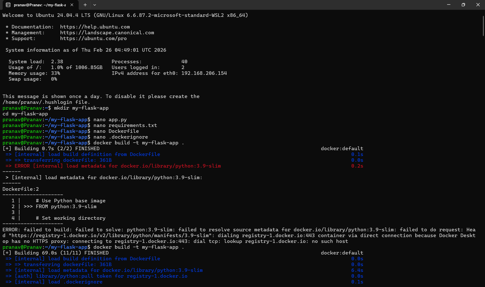

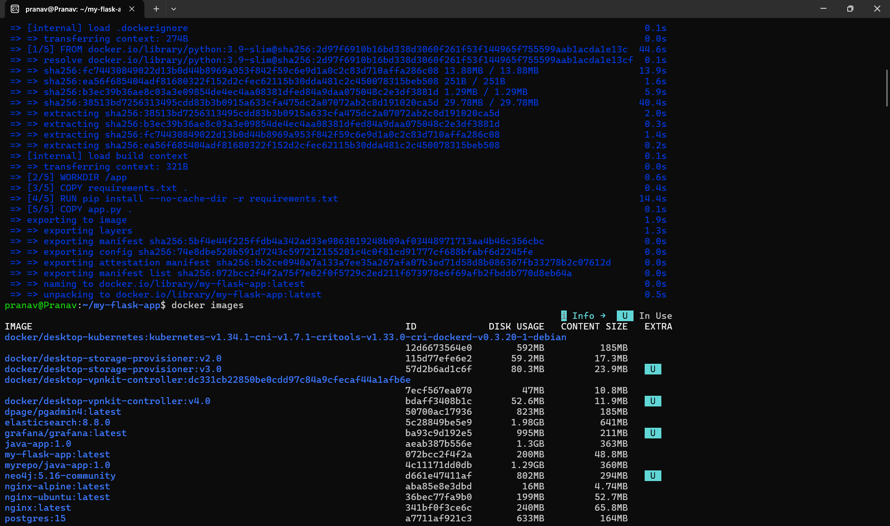

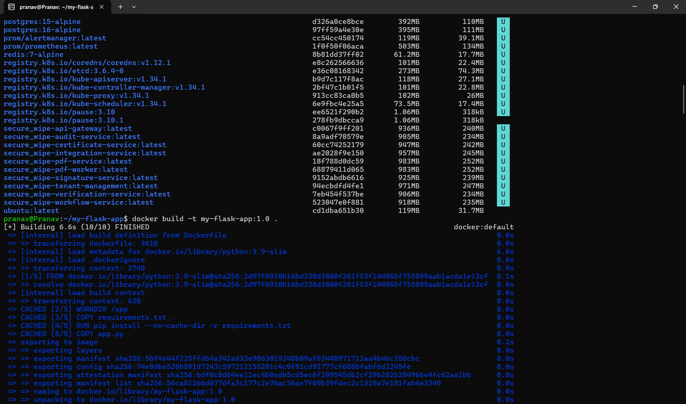

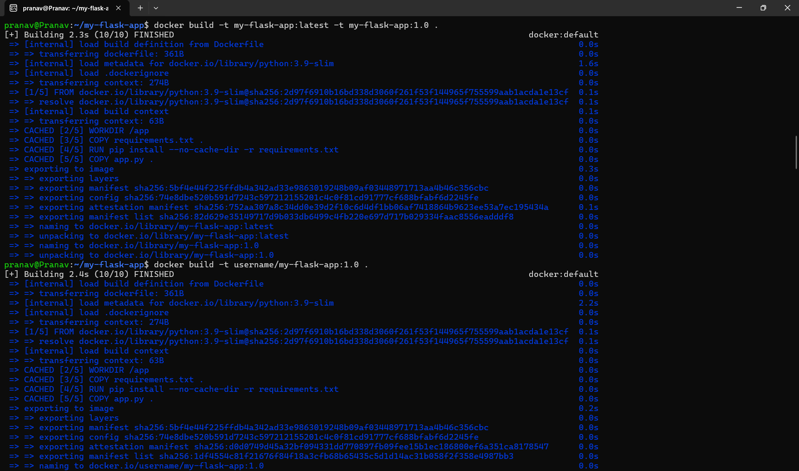

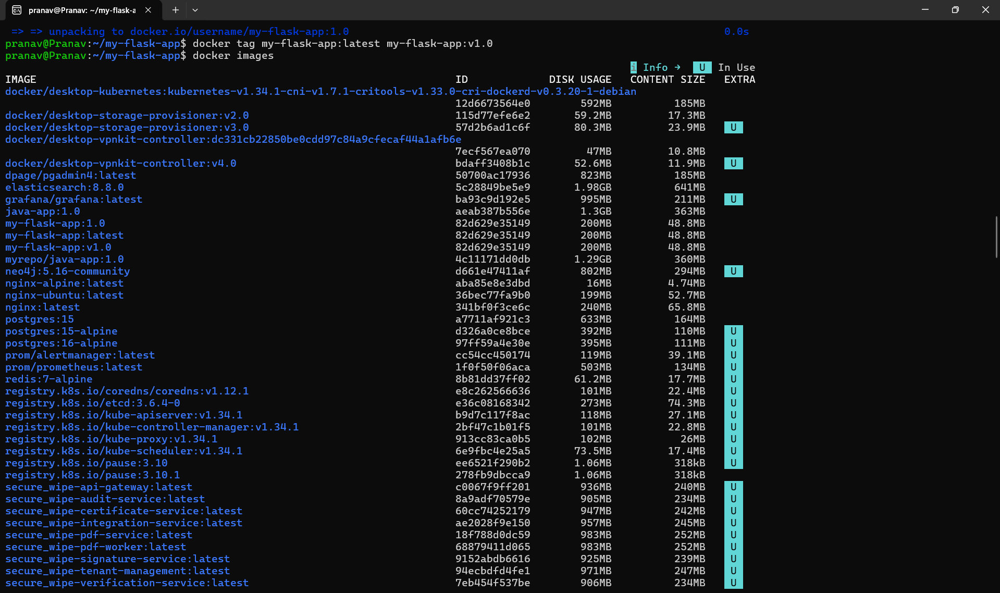

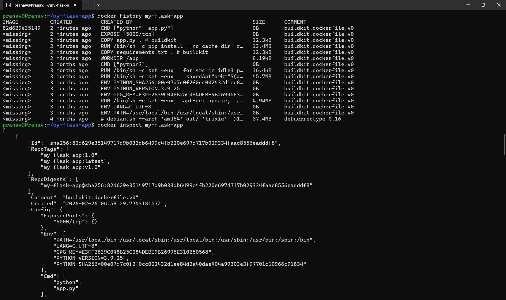

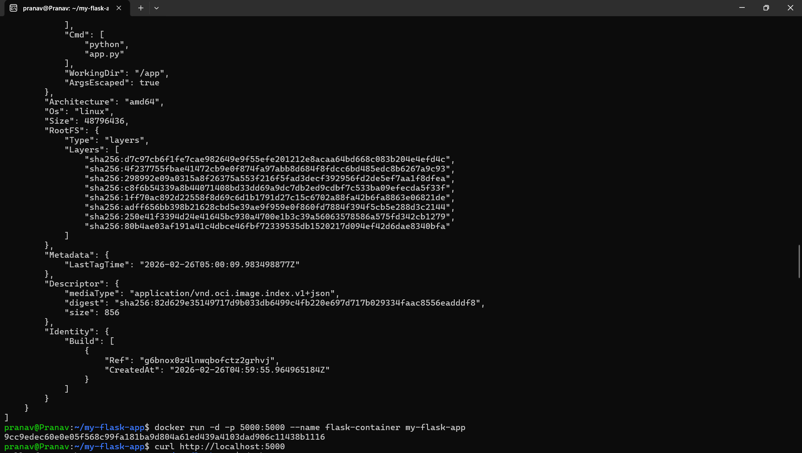

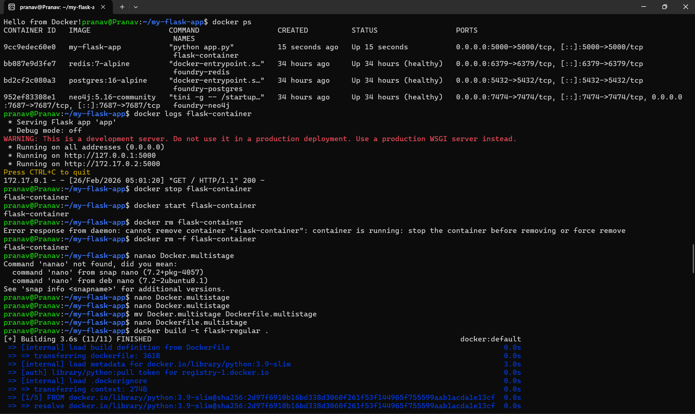

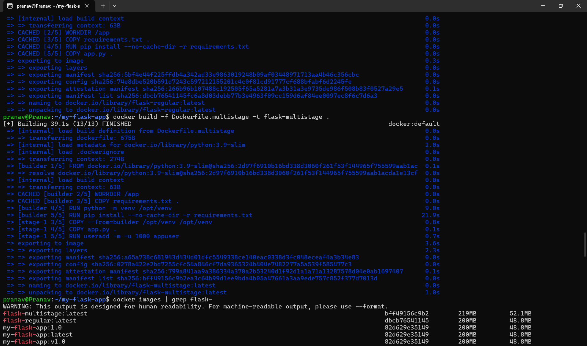

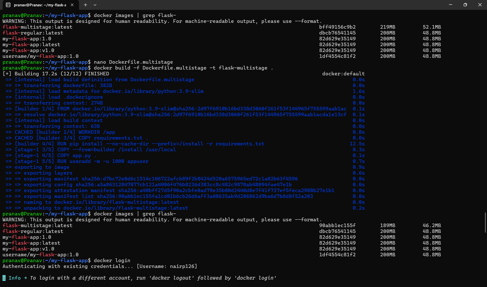

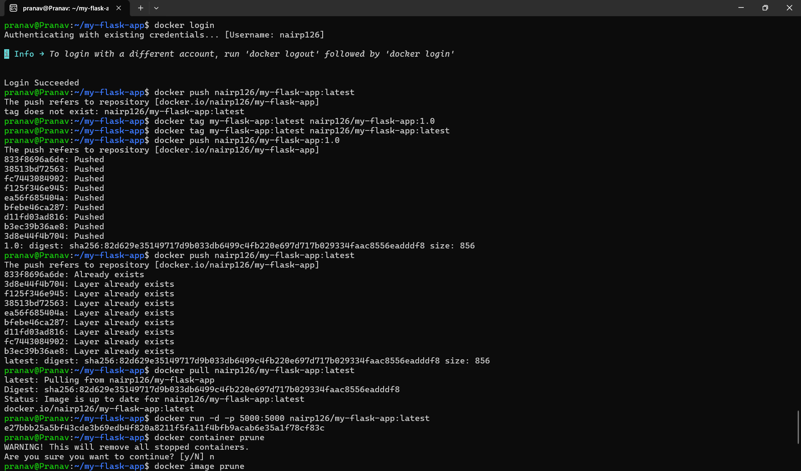

---

**Student**: Pranav R Nair | **Batch**: 2(CCVT) | **SAP ID**: 500121466
