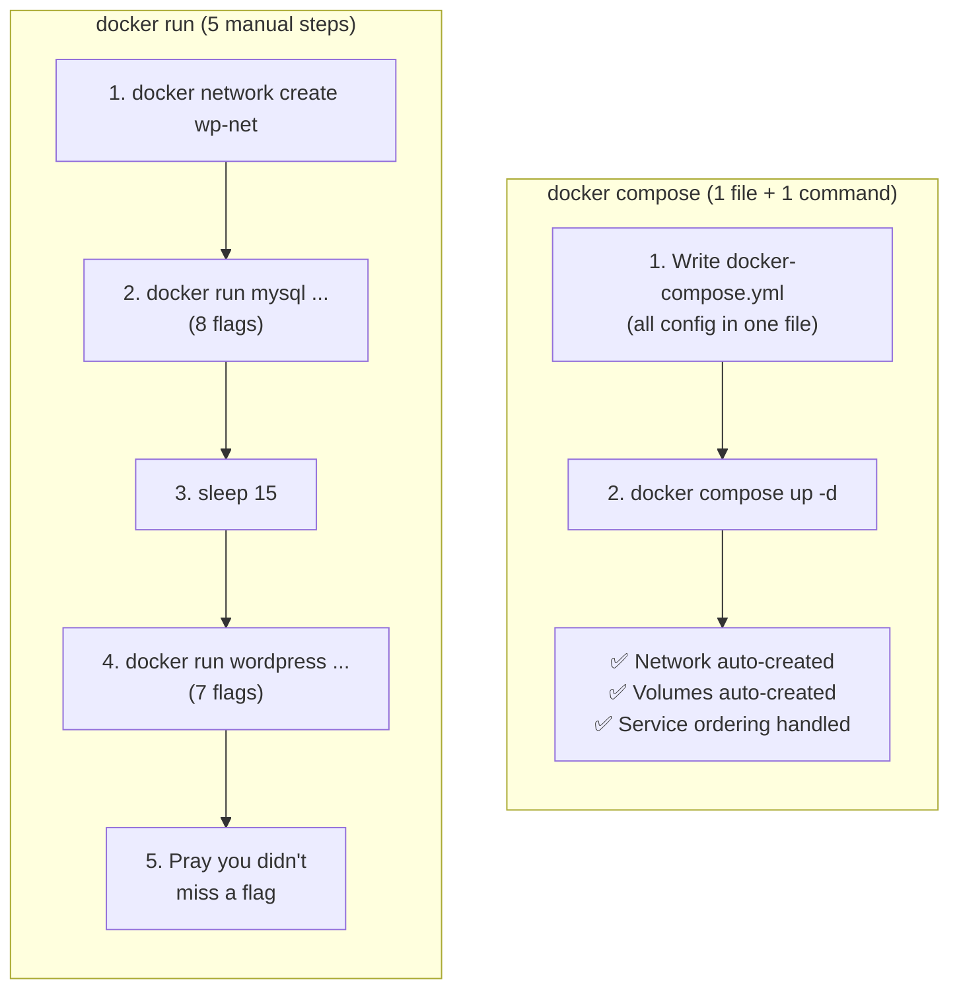
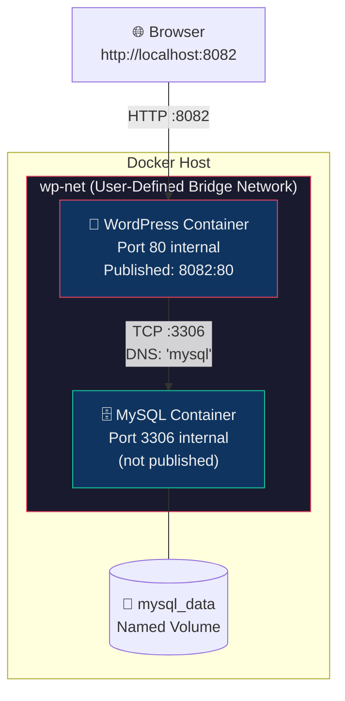
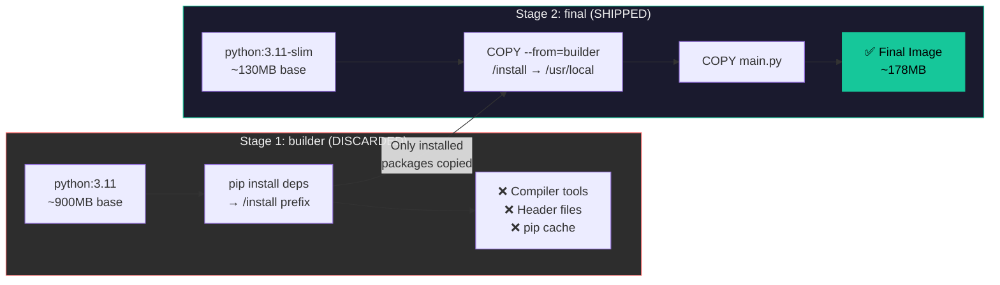
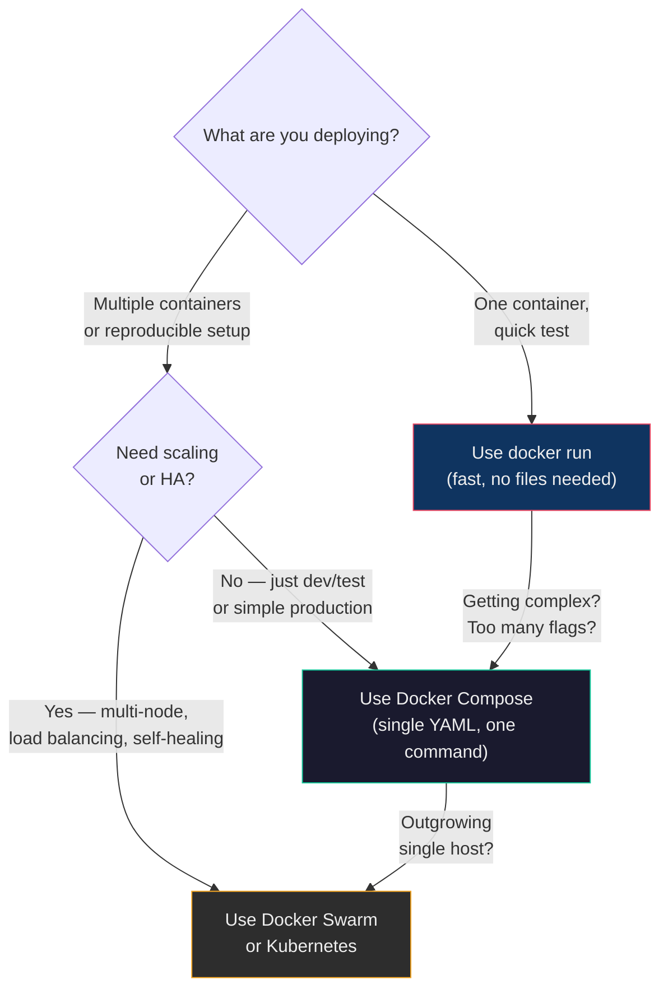

## 🎯 Objective

Systematically compare the imperative `docker run` approach against the declarative `docker-compose` approach across single-container, multi-container, resource-limited, and custom-built application scenarios — and understand exactly why each tool exists.

---

## 📋 Parts Overview

| Part | Focus |
| :--- | :--- |
| **Part A** | Theory — core concepts, flags, and common pitfalls |
| **Part B — Task 1** | Single Nginx container: `docker run` vs Compose |
| **Part B — Task 2** | Multi-container WordPress + MySQL |
| **Part C — Task 3** | Convert `docker run` commands to Compose |
| **Part C — Task 4** | Resource limits: `docker run` vs Compose |
| **Part D — Task 5** | Node.js app with custom Dockerfile + Compose `build:` |
| **Part D — Task 6** | Multi-Stage Python/FastAPI Dockerfile with Compose |
| **Cleanup** | System prune — remove all experiment artefacts |

---

# PART A — Theory

## 1. `docker run` vs Docker Compose — The Core Difference

> **`docker run`** is **imperative** — you specify every step explicitly via CLI flags.
> **`docker compose`** is **declarative** — you describe the desired end state in a YAML file.

| Dimension | `docker run` (Imperative) | `docker compose` (Declarative) |
| :--- | :--- | :--- |
| Configuration | CLI flags typed each time | `docker-compose.yml` — committed to Git |
| Multi-container | Multiple separate commands | Single file, single command |
| Readability | Hard to read long commands | Structured YAML |
| Reproducibility | Easy to miss a flag | Consistent every run |
| Networking | Manual `--network` flags | Auto-created shared network |
| Best for | Quick one-off tests, debugging | Dev environments, CI/CD, production |

### Workflow Comparison: Deploying WordPress + MySQL



---

## 2. Flag-to-YAML Mapping (Complete Reference)

| `docker run` Flag | `docker-compose.yml` Key | What it Does |
| :--- | :--- | :--- |
| `-p 8080:80` | `ports: ["8080:80"]` | Maps host port 8080 → container port 80 |
| `-v ./html:/app` | `volumes: ["./html:/app"]` | Bind mount: host folder into container |
| `-v pgdata:/data` | `volumes: ["pgdata:/data"]` + top-level `volumes:` | Named Docker-managed volume |
| `-e KEY=value` | `environment: [KEY=value]` | Sets env var inside the container |
| `--name myapp` | `container_name: myapp` | Human-readable container name |
| `--network mynet` | `networks: [mynet]` + top-level `networks:` | Custom network membership |
| `--restart unless-stopped` | `restart: unless-stopped` | Auto-restart policy |
| `--memory="256m"` | `deploy.resources.limits.memory: 256m` | RAM cap |
| `--cpus="0.5"` | `deploy.resources.limits.cpus: "0.5"` | CPU cap (0.5 = half a core) |
| `-d` | `docker compose up -d` | Detached (background) mode |
| `--hostname myhost` | `hostname: myhost` | Container hostname |

---

## 3. Restart Policies — Explained

| Policy | Behaviour | When to Use |
| :--- | :--- | :--- |
| `no` (default) | Never restart | One-off tasks, jobs |
| `always` | Always restart — even after `docker stop` | Critical services that must always be up |
| `unless-stopped` | Restart automatically, but NOT if you manually stopped it | Web servers, APIs |
| `on-failure` | Only restart on non-zero exit code | Batch jobs that may fail |

> **Key Difference: `always` vs `unless-stopped`:** If you run `docker stop myapp` and then reboot the machine, a container with `restart: always` will start again. A container with `restart: unless-stopped` will NOT — it remembers you stopped it intentionally.

---

## 4. Volume Types — Deep Dive

| Type | Syntax (docker run) | Syntax (Compose) | Where Data Lives | Survives `docker rm`? |
| :--- | :--- | :--- | :--- | :--- |
| **Bind Mount** | `-v $(pwd)/html:/app` | `- ./html:/app` | Your host filesystem | ✅ Yes (it's your file) |
| **Named Volume** | `-v pgdata:/var/lib/data` | `- pgdata:/var/lib/data` + `volumes: pgdata:` | `/var/lib/docker/volumes/` | ✅ Yes (until `docker volume rm`) |
| **Anonymous Volume** | `-v /var/lib/data` | not recommended | `/var/lib/docker/volumes/` | ❌ No — removed with container |

> **Rule of Thumb:** Use **bind mounts** for development (live code editing). Use **named volumes** for databases and persistent state. Avoid anonymous volumes.

---

## 5. `depends_on` — What It Does and Doesn't Do

```yaml
wordpress:
  depends_on:
    - mysql
```

✅ **What it does:** Starts `mysql` container *before* `wordpress`.

❌ **What it does NOT do:** It does NOT wait for MySQL to be *ready to accept connections*. MySQL takes 10–15 seconds to fully initialize after the container starts. If WordPress connects too early, it gets `Connection refused`.

**The correct production pattern:**

```yaml
mysql:
  image: mysql:5.7
  healthcheck:
    test: ["CMD", "mysqladmin", "ping", "-h", "localhost"]
    interval: 10s
    retries: 5
    timeout: 5s

wordpress:
  depends_on:
    mysql:
      condition: service_healthy   # Waits for healthcheck to pass
```

---

## 6. `image:` vs `build:` in Compose

| | `image:` | `build:` |
| :--- | :--- | :--- |
| **Source** | Pulls from Docker Hub or registry | Builds from local `Dockerfile` |
| **When to use** | Standard software (nginx, mysql, postgres) | Your own application code |
| **Speed** | Fast (already built, cached) | Slower first time, cached after |
| **Example** | `image: nginx:alpine` | `build: .` or `build: context: ./app` |

You can also combine them (build locally, tag it):
```yaml
services:
  app:
    build: .
    image: myapp:1.0   # The built image gets this tag
```

---

## 7. `deploy:` Resource Limits — When Do They Work?

```yaml
deploy:
  resources:
    limits:
      memory: 256m
      cpus: "0.5"
```

| Mode | Behaviour |
| :--- | :--- |
| **Docker Compose v2** (Docker Engine 20.10+) | ✅ `resources.limits` works in normal `docker compose up` |
| **Docker Swarm** (`docker stack deploy`) | ✅ Full `deploy:` block works — replicas, placement, update config |
| **Old Compose v1** (`docker-compose` binary) | ❌ `deploy:` block is **silently ignored** |

To check your version:
```bash
docker compose version   # Must show Compose v2.x for full support
```

---

## 8. Custom Networks — When You Must Declare Them

All services in a single `docker-compose.yml` are automatically placed on a **shared default network** and can reach each other by service name — no configuration needed.

You must declare a **custom network** explicitly when:
- You want to isolate groups of services
- You reference a named network inside a service (you MUST also declare it at the top level)
- You want to connect containers from separate Compose files

> **Bug from this lab:** If you write `networks: [app-net]` inside a service but forget the top-level `networks: app-net:` block, Compose throws: `network app-net declared as external, but could not be found`.

---

# PART B — Practical Tasks

## Task 1: Single Container — `docker run` vs Docker Compose

### Prerequisite Setup

> 🔧 **Fix Added:**  Without the `html/` directory and an `index.html` file, the volume mount either fails or serves an empty directory, causing the NGINX welcome page not to appear.

```bash
# Create the HTML directory and a test page
mkdir -p html
echo "<h1>Hello from Docker Run</h1>" > html/index.html
```

---

### Step 1A: Run Nginx Using `docker run`

```bash
docker run -d \
  --name lab-nginx \
  -p 8081:80 \
  -v $(pwd)/html:/usr/share/nginx/html \
  nginx:alpine
```

| Flag | Purpose |
| :--- | :--- |
| `-d` | Detached mode — container runs in the background, terminal stays free |
| `--name lab-nginx` | Gives the container a stable, memorable name for use in later commands |
| `-p 8081:80` | Maps **host port 8081** → **container port 80** (NGINX listens on 80 internally) |
| `-v $(pwd)/html:/usr/share/nginx/html` | Bind mount: serves your local `html/` directory instead of the NGINX default page |
| `nginx:alpine` | Minimal Alpine-based NGINX image — about 40MB vs 150MB for the default |

**Verify the container is running:**
```bash
docker ps
```

**Expected Output:**

```text
CONTAINER ID   IMAGE          COMMAND                  CREATED         STATUS         PORTS                  NAMES
a3f9b1c2d4e5   nginx:alpine   "/docker-entrypoint.…"   5 seconds ago   Up 4 seconds   0.0.0.0:8081->80/tcp   lab-nginx
```

**Test in browser:** `http://localhost:8081` should show **"Hello from Docker Run"**.


**Deep Dive — Why Port Mapping?** NGINX listens on port 80 *inside* the container's isolated network namespace. The host machine has no direct access to that namespace. The `-p 8081:80` flag instructs Docker's userland proxy to forward any traffic arriving on host port 8081 into the container's port 80. The host port (8081) can be any free port; the container port (80) must match what the process inside listens on.

**Cleanup:**
```bash
docker stop lab-nginx
docker rm lab-nginx
```

---

### Step 1B: Same Setup Using Docker Compose

Create `docker-compose.yml`:

```yaml
services:
  nginx:
    image: nginx:alpine
    container_name: lab-nginx
    ports:
      - "8081:80"
    volumes:
      - ./html:/usr/share/nginx/html
```

```bash
docker compose up -d
```

**Verify:**
```bash
docker compose ps
```

**Expected Output:**

```text
NAME        IMAGE          COMMAND                  SERVICE   CREATED         STATUS         PORTS
lab-nginx   nginx:alpine   "/docker-entrypoint.…"   nginx     4 seconds ago   Up 3 seconds   0.0.0.0:8081->80/tcp
```


**Cleanup:**
```bash
docker compose down
```

---

## Task 2: Multi-Container Application — WordPress + MySQL

### Architecture Diagram



> WordPress resolves the hostname `mysql` to the MySQL container's IP automatically via Docker's embedded DNS server. The named volume `mysql_data` persists database files across container restarts.

### 2A: Using `docker run` (Manual Way)

> 🔧 **Fix 1 Added:** `WORDPRESS_DB_USER=root` was missing. Without it, WordPress cannot authenticate with MySQL, causing the setup wizard to fail with a database connection error.

> 🔧 **Fix 2 Added:** `sleep 15` was missing between MySQL and WordPress startup. MySQL takes 10–15 seconds to initialize. Without the delay, WordPress attempts to connect to MySQL before it's ready, causing connection errors.

**Step 1: Create an isolated network**
```bash
docker network create wp-net
```

| Command part | Purpose |
| :--- | :--- |
| `docker network create` | Creates a user-defined bridge network |
| `wp-net` | Name for the network — used as a DNS domain by Docker |

**Step 2: Start MySQL**
```bash
docker run -d \
  --name mysql \
  --network wp-net \
  -e MYSQL_ROOT_PASSWORD=secret \
  -e MYSQL_DATABASE=wordpress \
  -e MYSQL_USER=root \
  mysql:5.7
```

| Flag | Purpose |
| :--- | :--- |
| `--network wp-net` | Connects MySQL to the named network so WordPress can reach it by hostname |
| `-e MYSQL_ROOT_PASSWORD=secret` | Sets the root password — required by MySQL image |
| `-e MYSQL_DATABASE=wordpress` | Auto-creates a database named `wordpress` on first run |
| `-e MYSQL_USER=root` | ✅ **Fix:** Explicitly sets the user WordPress will connect as |

**Step 3: Wait for MySQL to initialize**
```bash
sleep 15
```

> **Why `sleep 15`?** The MySQL container starts in seconds, but the actual database engine inside takes much longer to initialize, create system tables, and set up the configured database. WordPress doesn't retry connections — it fails on the first attempt if MySQL isn't ready.

**Step 4: Start WordPress**
```bash
docker run -d \
  --name wordpress \
  --network wp-net \
  -p 8082:80 \
  -e WORDPRESS_DB_HOST=mysql \
  -e WORDPRESS_DB_PASSWORD=secret \
  -e WORDPRESS_DB_USER=root \
  wordpress:latest
```

| Flag | Purpose |
| :--- | :--- |
| `--network wp-net` | Connects WordPress to the same network as MySQL |
| `-e WORDPRESS_DB_HOST=mysql` | `mysql` resolves to the MySQL container's IP via Docker DNS |
| `-e WORDPRESS_DB_USER=root` | ✅ **Fix:** Must match the MySQL user configured above |
| `-e WORDPRESS_DB_PASSWORD=secret` | Must match `MYSQL_ROOT_PASSWORD` |

**Test:** `http://localhost:8082` — you should see the WordPress setup wizard.


**Cleanup:**
```bash
docker stop wordpress mysql
docker rm wordpress mysql
docker network rm wp-net
```

---

### 2B: Using Docker Compose

> 🔧 **Fix noted:** `WORDPRESS_DB_USER`  Added here. For production, also add a proper MySQL healthcheck.

```yaml
services:
  mysql:
    image: mysql:5.7
    environment:
      MYSQL_ROOT_PASSWORD: secret
      MYSQL_DATABASE: wordpress
      MYSQL_USER: root
      MYSQL_PASSWORD: secret
    volumes:
      - mysql_data:/var/lib/mysql
    healthcheck:                          # Production-safe: wait for MySQL to be ready
      test: ["CMD", "mysqladmin", "ping", "-h", "localhost"]
      interval: 10s
      retries: 5
      timeout: 5s

  wordpress:
    image: wordpress:latest
    ports:
      - "8082:80"
    environment:
      WORDPRESS_DB_HOST: mysql
      WORDPRESS_DB_USER: root            # Fix: was missing in original
      WORDPRESS_DB_PASSWORD: secret
      WORDPRESS_DB_NAME: wordpress
    depends_on:
      mysql:
        condition: service_healthy        # Waits for healthcheck, not just container start

volumes:
  mysql_data:
```

```bash
docker compose up -d
docker compose ps
```

**Expected Output:**

```text
NAME        IMAGE              SERVICE   STATUS
mysql       mysql:5.7          mysql     running (healthy)
wordpress   wordpress:latest   wordpress running
```


**Deep Dive — Docker DNS:** Within the `wp-net` user-defined network (or the default Compose network), Docker runs an embedded DNS server. When WordPress resolves `mysql`, the DNS server returns the internal IP of the MySQL container — automatically. This is why `WORDPRESS_DB_HOST: mysql` works without you knowing the actual IP address.

**Cleanup:**
```bash
docker compose down -v    # -v also removes the mysql_data volume
```

---

# PART C — Conversion Tasks

## Task 3: Convert `docker run` to Docker Compose

### Problem 1: Basic Web Application

**Given `docker run` command:**
```bash
docker run -d \
  --name webapp \
  -p 5000:5000 \
  -e APP_ENV=production \
  -e DEBUG=false \
  --restart unless-stopped \
  node:18-alpine
```

**Equivalent `docker-compose.yml`:**
```yaml
services:
  webapp:
    image: node:18-alpine
    container_name: webapp
    ports:
      - "5000:5000"
    environment:
      APP_ENV: production
      DEBUG: "false"
    restart: unless-stopped
```

```bash
docker compose up -d
docker compose ps
```


---

### Problem 2: Volume + Custom Network Configuration

> 🔧 **Fix Added:** The original Compose solution referenced `app-net` inside each service but was missing the top-level `networks:` block. Docker Compose throws an error if you reference a custom network without declaring it at the root level.

**Given `docker run` commands:**
```bash
docker network create app-net

docker run -d \
  --name postgres-db \
  --network app-net \
  -e POSTGRES_USER=admin \
  -e POSTGRES_PASSWORD=secret \
  -v pgdata:/var/lib/postgresql/data \
  postgres:15

docker run -d \
  --name backend \
  --network app-net \
  -p 8000:8000 \
  -e DB_HOST=postgres-db \
  -e DB_USER=admin \
  -e DB_PASS=secret \
  python:3.11-slim
```

**Correct `docker-compose.yml` (with the network fix):**
```yaml
services:
  postgres-db:
    image: postgres:15
    container_name: postgres-db
    environment:
      POSTGRES_USER: admin
      POSTGRES_PASSWORD: secret
    volumes:
      - pgdata:/var/lib/postgresql/data
    networks:
      - app-net               # Attach to custom network

  backend:
    image: python:3.11-slim
    container_name: backend
    ports:
      - "8000:8000"
    environment:
      DB_HOST: postgres-db    # Docker DNS resolves this to the postgres container
      DB_USER: admin
      DB_PASS: secret
    depends_on:
      - postgres-db
    networks:
      - app-net               # Attach to custom network

volumes:
  pgdata:                     # Named volume — persists after docker compose down

networks:
  app-net:                    # ✅ Fix: must be declared here or Compose throws an error
```

```bash
docker compose up -d
docker compose ps
```


**Deep Dive — Why Must You Declare Custom Networks?** Compose's default network is created implicitly. But any network you name explicitly in `networks:` at the service level is treated as a reference to a named resource. Compose needs to know whether to create it (`app-net:`) or assume it already exists externally (`app-net: external: true`). Without the declaration, Compose can't determine its intent and fails.

**Cleanup:**
```bash
docker compose down -v
```

---

## Task 4: Resource Limits Conversion

### Given `docker run` command:

```bash
docker run -d \
  --name limited-app \
  -p 9000:9000 \
  --memory="256m" \
  --cpus="0.5" \
  --restart always \
  nginx:alpine
```

### Equivalent `docker-compose.yml`:

```yaml
services:
  limited-app:
    image: nginx:alpine
    container_name: limited-app
    ports:
      - "9000:9000"
    restart: always
    deploy:
      resources:
        limits:
          memory: 256m
          cpus: "0.5"
```

```bash
docker compose up -d
```

> 🔧 **Verification Added:** The original task had no way to confirm limits were applied. Use `docker stats` to verify:

```bash
docker stats limited-app --no-stream
```

**Expected Output:**

```text
CONTAINER ID   NAME          CPU %   MEM USAGE / LIMIT   MEM %   NET I/O   BLOCK I/O   PIDS
a4f2b1c0d3e6   limited-app   0.00%   3.664MiB / 256MiB   1.43%   ...       ...         2
```

The `MEM LIMIT` column shows `256MiB` — confirming the resource cap is enforced.


**Deep Dive — `deploy:` Behaviour Across Modes:**

| Mode | Result |
| :--- | :--- |
| `docker compose up` with Compose v2 + Engine 20.10+ | ✅ `resources.limits` is applied |
| `docker stack deploy` (Swarm) | ✅ Full `deploy:` block honoured |
| Old `docker-compose` v1 binary | ❌ Entire `deploy:` block silently ignored |

**Cleanup:**
```bash
docker compose down
```

---

# PART D — Custom Dockerfile Tasks

## Task 5: Replace Standard Image with Dockerfile (Node.js App)

Instead of using `node:18-alpine` directly from Docker Hub, we build our own application image.

### Step 1: Create `app.js`

```javascript
const http = require('http');

http.createServer((req, res) => {
  res.end("Docker Compose Build Lab");
}).listen(3000, () => {
  console.log("Server running on port 3000");
});
```

### Step 2: Create `Dockerfile`

```dockerfile
FROM node:18-alpine

WORKDIR /app

COPY app.js .

EXPOSE 3000

CMD ["node", "app.js"]
```

| Dockerfile Instruction | Purpose |
| :--- | :--- |
| `FROM node:18-alpine` | Base image — Node.js on Alpine (minimal ~120MB) |
| `WORKDIR /app` | Sets working directory inside container; all subsequent paths are relative to this |
| `COPY app.js .` | Copies `app.js` from build context into `/app/` inside the image |
| `EXPOSE 3000` | Documents the port; does not actually publish it |
| `CMD ["node", "app.js"]` | Default process to run when the container starts |

### Step 3: Create `docker-compose.yml`

```yaml
services:
  nodeapp:
    build:
      context: .
      dockerfile: Dockerfile
    container_name: custom-node-app
    ports:
      - "3000:3000"
```

### Step 4: Build and Run

```bash
docker compose up --build -d
```

| Flag | Purpose |
| :--- | :--- |
| `--build` | Forces a rebuild of the image before starting — even if it already exists |
| `-d` | Detached mode |

> 🔧 **Verification Added:** The original said "verify in browser" but gave no terminal command. Use `curl` for scriptable verification:

```bash
curl http://localhost:3000
```

**Expected Output:**

```text
Docker Compose Build Lab
```


### Step 5: Modify and Rebuild

> 🔧 **Commands Added:** The original described this in words only. Here are the exact commands:

```bash
# Modify the response message using sed (no editor needed)
sed -i 's/Docker Compose Build Lab/Updated: Docker Compose Build Lab v2/' app.js

# Rebuild and restart
docker compose up --build -d

# Verify the change
curl http://localhost:3000
```

**Expected Output:**

```text
Updated: Docker Compose Build Lab v2
```


### Cleanup

```bash
docker compose down
docker rmi task5-nodeapp   # Remove the locally built image
```

---

## Task 6: Multi-Stage Dockerfile — Python FastAPI App

> 🔧 **Entire Task Rewritten:** The original document described this task in words but provided no actual code. All four files below were written from scratch.

### Why Multi-Stage Builds?

A single-stage Python build image includes the compiler toolchain, header files, and build dependencies — all of which are unnecessary at runtime. A multi-stage build discards the "builder" layer and only ships the final runtime artifacts, dramatically reducing image size and attack surface.

### Multi-Stage Build Pipeline



> **Result:** ~900MB builder image is discarded entirely. Only the ~48MB of installed Python packages survives into the final ~178MB image — an **80% size reduction**.

---

### File 1: `main.py`

```python
from fastapi import FastAPI

app = FastAPI()

@app.get("/")
def read_root():
    return {"message": "Hello from Multi-Stage FastAPI", "env": "docker"}
```

### File 2: `requirements.txt`

```text
fastapi==0.110.0
uvicorn==0.27.1
```

### File 3: Multi-Stage `Dockerfile`

```dockerfile
# ── Stage 1: builder ──────────────────────────────────────────────
FROM python:3.11 AS builder

WORKDIR /install

COPY requirements.txt .

# Install dependencies into a separate prefix (easy to copy selectively)
RUN pip install --prefix=/install --no-cache-dir -r requirements.txt

# ── Stage 2: runtime (final image) ────────────────────────────────
FROM python:3.11-slim AS final

WORKDIR /app

# Copy only the installed packages — build tools stay in Stage 1
COPY --from=builder /install /usr/local

# Copy application code
COPY main.py .

EXPOSE 8080

CMD ["uvicorn", "main:app", "--host", "0.0.0.0", "--port", "8080"]
```

| Stage | Image used | What it contains |
| :--- | :--- | :--- |
| `builder` | `python:3.11` (~900MB) | Full Python + pip + compiler tools + installed packages |
| `final` | `python:3.11-slim` (~130MB) | Only: slim Python + the installed packages from builder |

**Key techniques:**
- `--prefix=/install` — installs packages to a known path so `COPY --from=` can target them precisely
- `--no-cache-dir` — prevents pip's HTTP cache from bloating the layer
- `COPY --from=builder` — the only connection between stages; everything else in `builder` is discarded

### File 4: `docker-compose.yml`

```yaml
services:
  fastapi:
    build:
      context: .
      dockerfile: Dockerfile
      target: final           # Build only up to the 'final' stage
    container_name: fastapi-app
    ports:
      - "8080:8080"
    environment:
      APP_ENV: development
    volumes:
      - ./main.py:/app/main.py   # Live code reload in development
```

### Build and Run

```bash
docker compose up --build -d
```

> 🔧 **Verification Added:**

```bash
curl http://localhost:8080
```

**Expected Output:**

```json
{"message":"Hello from Multi-Stage FastAPI","env":"docker"}
```


### Compare Image Sizes

```bash
docker images | grep -E "python|fastapi"
```

**Expected Output (approximate):**

```text
REPOSITORY        TAG        IMAGE ID       CREATED         SIZE
fastapi-app       latest     a1b2c3d4e5f6   2 minutes ago   178MB    ← final stage only
python            3.11       f6e5d4c3b2a1   2 weeks ago     912MB    ← builder stage base
python            3.11-slim  1a2b3c4d5e6f   2 weeks ago     130MB    ← runtime base
```

> The final application image is ~178MB vs ~912MB if we had used the full `python:3.11` as the single stage — a **~80% size reduction**.


### Cleanup

```bash
docker compose down
docker rmi fastapi-app
```

---

# Additional Screenshots — Lab Progress


---

# Common Pitfalls

| Pitfall | Symptom | Root Cause | Fix |
| :--- | :--- | :--- | :--- |
| Missing `html/` directory | NGINX serves 403 Forbidden | Volume mount path doesn't exist on host | `mkdir -p html && echo... > html/index.html` |
| Missing `WORDPRESS_DB_USER` | WordPress setup fails with DB error | WordPress doesn't know which MySQL user to connect as | Add `-e WORDPRESS_DB_USER=root` |
| No `sleep` between MySQL and WordPress (`docker run`) | WordPress: "Error establishing a database connection" | MySQL container starts in ~1s, MySQL engine needs 10–15s | Add `sleep 15` between the two `docker run` commands |
| Missing top-level `networks:` in Compose | `network app-net declared as external, but could not be found` | Referenced network not declared at Compose root level | Add `networks: app-net:` at the bottom of the file |
| `deploy:` not applying limits | Container has no memory cap despite the config | Running old `docker-compose` v1 (silently ignores `deploy:`) | Use `docker compose` (v2) — check with `docker compose version` |
| `docker compose up --build` not rebuilding | Stale image served despite code changes | Compose uses layer cache; host file wasn't COPYed | Use `docker compose build --no-cache` if cache is stale |
| `depends_on` not enough | App crashes on start because DB isn't ready | `depends_on` only waits for container START, not DB READY | Add a `healthcheck:` to the DB service + `condition: service_healthy` |

---

# Final Cleanup

> 🔧 **Cleanup Section Added:**  Run these commands at the end of the lab to remove all experiment artefacts.

```bash
# Stop and remove all stopped containers
docker container prune -f

# Remove all dangling images (untagged build intermediates)
docker image prune -f

# Remove all unused volumes (CAUTION: removes persistent data)
docker volume prune -f

# Remove all unused networks
docker network prune -f

# Or: remove everything at once (containers, images, networks, volumes)
docker system prune -a --volumes -f
```

> ⚠️ **Warning:** `docker system prune -a --volumes` removes ALL unused resources — not just from this experiment. Only run it if you want a completely clean Docker environment.

---

# Quick Reference Cheatsheet

| Action | `docker run` | `docker compose` |
| :--- | :--- | :--- |
| Start single container | `docker run -d -p 8081:80 nginx` | `docker compose up -d` |
| View running containers | `docker ps` | `docker compose ps` |
| View logs | `docker logs <name>` | `docker compose logs -f` |
| Stop container | `docker stop <name>` | `docker compose down` |
| Remove container | `docker rm <name>` | included in `docker compose down` |
| Scale service | ❌ Manual | `docker compose up --scale web=3` |
| Build from Dockerfile | `docker build -t myapp . && docker run myapp` | `docker compose up --build` |
| Check resource usage | `docker stats <name> --no-stream` | `docker stats --no-stream` |

---

## 🧭 Decision Flowchart — When to Use Which Tool



---

# Key Takeaways

1. **`docker run`** is best for quick, one-off containers and debugging. Every option must be typed manually — easy to miss flags.
2. **Docker Compose** is best for reproducible, multi-container setups. The YAML file is the single source of truth.
3. **`depends_on` is not enough** — always combine it with a `healthcheck` and `condition: service_healthy` for databases.
4. **Every named network must be declared at the top level** of the Compose file or Compose will throw an error.
5. **Multi-stage builds** dramatically reduce final image size — ship only what the runtime needs.
6. **`docker stats`** is the fastest way to verify resource limits are actually enforced.

---

> **Experiment Summary:** This lab demonstrated that `docker run` and `docker compose` are not competing tools — they are different levels of abstraction. Master the flag-to-YAML mapping, understand the common pitfalls (especially MySQL readiness and network declarations), and you will be equipped to confidently deploy and debug any containerized application.

**Student**: Pranav R Nair | **SAP ID**: 500121466 | **Batch**: 2(CCVT)
