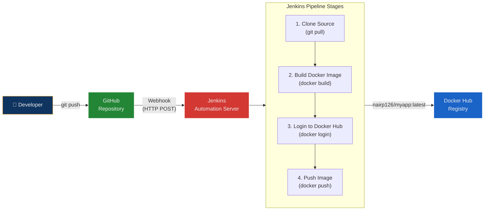
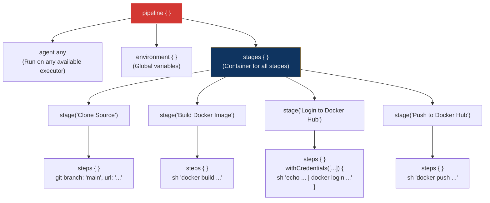
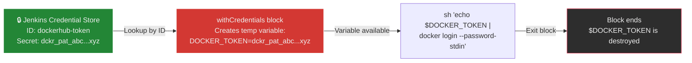
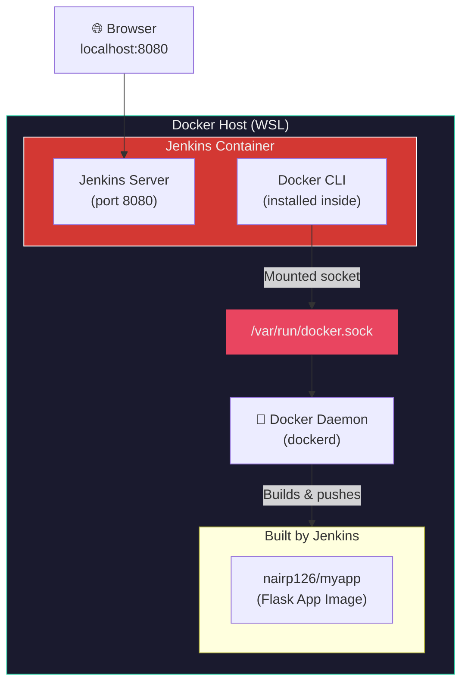
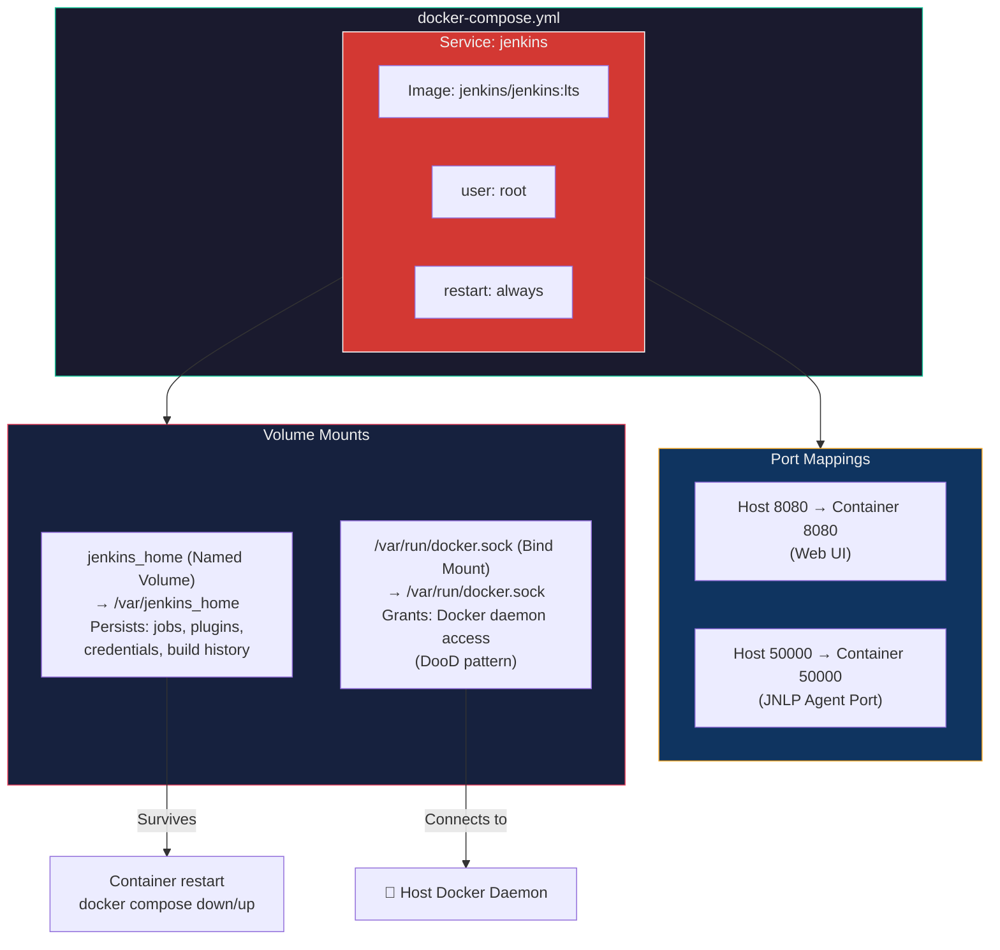
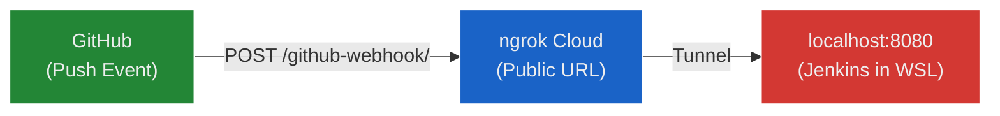
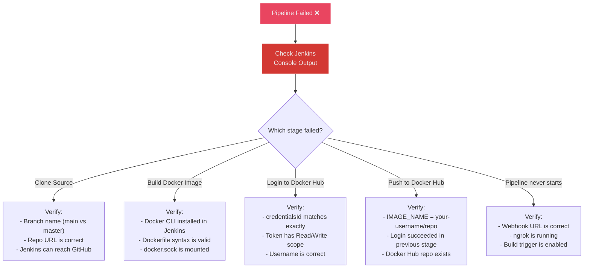
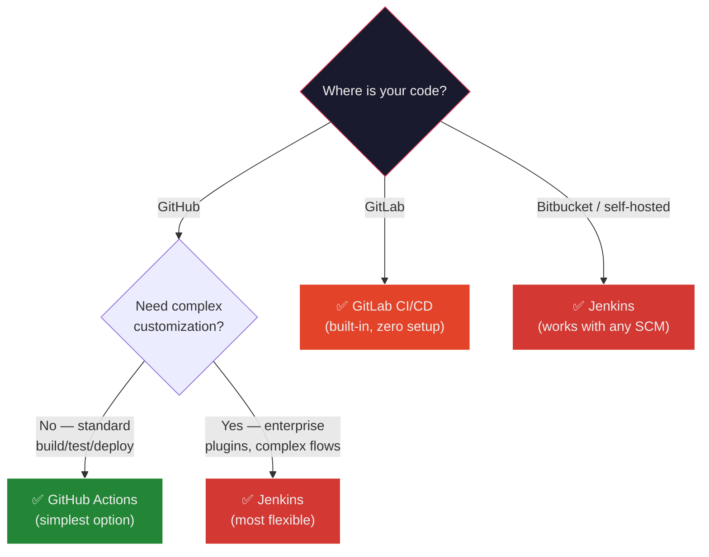

## 🎯 Objective

Design and implement a complete **CI/CD pipeline** where every `git push` to GitHub automatically triggers Jenkins to build a Docker image and push it to Docker Hub — achieving fully automated continuous integration and delivery.

---

## 📖 Theory — What Is CI/CD?

### The Assembly Line Analogy

Think of a **car manufacturing plant**:

| Factory Stage | CI/CD Equivalent |
| :--- | :--- |
| **Designer draws blueprints** | Developer writes code and pushes to GitHub |
| **Motion sensor detects new blueprint arrived** | GitHub webhook fires an HTTP POST to Jenkins |
| **Assembly line starts automatically** | Jenkins pipeline begins executing stages |
| **Parts are assembled into a car** | Docker builds the application into an image |
| **Quality inspection** | Tests run (if configured) |
| **Car is shipped to the dealership** | Docker image is pushed to Docker Hub |

Without CI/CD, a human has to walk each blueprint to the factory, start the machines, inspect the car, and drive it to the dealership manually. CI/CD **automates the entire chain**.

### CI (Continuous Integration)

Every commit pushed to the repository is **automatically built and tested**. The goal is to catch bugs early — before they reach production.

### CD (Continuous Delivery / Deployment)

Once the build passes, the **artifact** (in our case, a Docker image) is automatically **delivered** to a registry (Docker Hub) or **deployed** to a server.

### Jenkins

Jenkins is a **web-based automation server** that:

- Provides a browser-based dashboard for managing pipelines
- Uses **Pipeline as Code** — the build definition lives in a `Jenkinsfile` in your repo
- Has a plugin ecosystem (GitHub, Docker, Slack, Kubernetes, etc.)
- Runs on `localhost:8080` by default

### The Pipeline in This Lab



### Complete Event Sequence — From `git push` to Docker Hub

The flowchart above shows *what* happens. This sequence diagram shows *who talks to whom, and when*:

```mermaid
sequenceDiagram
    actor DEV as Developer
    participant GH as GitHub
    participant NG as ngrok Tunnel
    participant JK as Jenkins (localhost:8080)
    participant DK as Docker Daemon (Host)
    participant DH as Docker Hub

    DEV->>GH: git push origin main
    Note over GH: Commit received on main

    GH->>NG: POST /github-webhook/ (push event payload)
    NG->>JK: Forward HTTP request to localhost:8080
    JK->>JK: Match event to pipeline job (ci-cd-pipeline)

    rect rgb(40, 40, 80)
        Note over JK,DH: Jenkins Pipeline Execution
        JK->>GH: Stage 1: git clone (pull latest code)
        GH-->>JK: Source code

        JK->>DK: Stage 2: docker build -t nairp126/myapp:latest .
        DK-->>JK: Image built successfully

        JK->>DH: Stage 3: docker login (via withCredentials token)
        DH-->>JK: Login succeeded

        JK->>DH: Stage 4: docker push nairp126/myapp:latest
        DH-->>JK: Push complete
    end

    JK->>JK: Pipeline status = SUCCESS ✅
    Note over DH: Image available at<br/>hub.docker.com/r/nairp126/myapp
```



**Key observations from the sequence:**

1. **GitHub initiates** — The developer pushes code, but it's GitHub that calls Jenkins (not the other way around)
2. **ngrok bridges the gap** — Without it, GitHub can't reach `localhost:8080`
3. **Jenkins orchestrates** — It doesn't build images itself; it tells the Docker daemon what to do via the mounted socket
4. **Docker Hub is the final destination** — The built image is pushed to a public registry, available for deployment anywhere

---

## 🛠️ Prerequisites

- Docker & Docker Compose installed (Docker Desktop on Windows with WSL integration)
- A GitHub account with a personal access token
- A Docker Hub account with an access token
- Basic Linux command-line knowledge

---

## 📖 Part A — GitHub Repository Setup

### Step 1 — Create Project Directory

```bash
mkdir ~/my-app && cd ~/my-app
```

### Step 2 — Create the Flask Application

#### `app.py`

```python
from flask import Flask
app = Flask(__name__)

@app.route("/")
def home():
    return "Hello from CI/CD Pipeline!"

app.run(host="0.0.0.0", port=80)
```

| Code | Purpose |
| :--- | :--- |
| `Flask(__name__)` | Creates a Flask web application instance |
| `@app.route("/")` | Maps the root URL `/` to the `home()` function |
| `host="0.0.0.0"` | Listens on all network interfaces (not just localhost) — required inside a container |
| `port=80` | Standard HTTP port |

#### `requirements.txt`

```text
flask
```

Pip will install Flask and its dependencies (Werkzeug, Jinja2, etc.) during the Docker build.

### Step 3 — Create the Dockerfile

```dockerfile
FROM python:3.10-slim

WORKDIR /app
COPY . .

RUN pip install -r requirements.txt

EXPOSE 80
CMD ["python", "app.py"]
```

#### Line-by-Line Breakdown

| Instruction | What It Does | Why |
| :--- | :--- | :--- |
| `FROM python:3.10-slim` | Uses a minimal Python 3.10 base image (~45 MB) | Slim variant excludes compilers and docs — smaller image, faster pulls |
| `WORKDIR /app` | Sets `/app` as the working directory inside the container | All subsequent commands run from here |
| `COPY . .` | Copies all project files into the container | Brings `app.py`, `requirements.txt` into the image |
| `RUN pip install -r requirements.txt` | Installs Python dependencies at build time | Baked into the image layer — no network needed at runtime |
| `EXPOSE 80` | Documents that the container listens on port 80 | Informational metadata — does not actually publish the port |
| `CMD ["python", "app.py"]` | Default command when the container starts | Exec form (no shell wrapping) — proper signal handling |

### Step 4 — Create the Jenkinsfile

The `Jenkinsfile` is the **Pipeline as Code** definition — it tells Jenkins exactly what to do:

```groovy
pipeline {
    agent any

    environment {
        IMAGE_NAME = "nairp126/myapp"
    }

    stages {

        stage('Clone Source') {
            steps {
                git branch: 'main', url: 'https://github.com/nairp126/my-app.git'
            }
        }

        stage('Build Docker Image') {
            steps {
                sh 'docker build -t $IMAGE_NAME:latest .'
            }
        }

        stage('Login to Docker Hub') {
            steps {
                withCredentials([string(credentialsId: 'dockerhub-token', variable: 'DOCKER_TOKEN')]) {
                    sh 'echo $DOCKER_TOKEN | docker login -u nairp126 --password-stdin'
                }
            }
        }

        stage('Push to Docker Hub') {
            steps {
                sh 'docker push $IMAGE_NAME:latest'
            }
        }
    }
}
```

#### Jenkinsfile Structure Explained



| Keyword | Purpose |
| :--- | :--- |
| `pipeline { }` | Root block — everything goes inside this |
| `agent any` | Run the pipeline on any available Jenkins executor (in our case, the same Docker host) |
| `environment { }` | Define variables available to all stages — `IMAGE_NAME` avoids repeating `nairp126/myapp` |
| `stages { }` | Groups all pipeline phases |
| `stage('Name') { }` | A single logical phase — shown as a block in the Jenkins UI |
| `steps { }` | Contains the actual commands to execute |
| `git` | Built-in Jenkins step to clone a Git repository |
| `sh` | Execute a shell command |
| `withCredentials` | Temporarily injects a stored secret into an environment variable |

#### Deep Dive — `withCredentials` (The Tricky Part)

This is the most confusing block for beginners. Here's what's happening:

```groovy
withCredentials([string(credentialsId: 'dockerhub-token', variable: 'DOCKER_TOKEN')]) {
    sh 'echo $DOCKER_TOKEN | docker login -u nairp126 --password-stdin'
}
```

**Step-by-step:**

1. Jenkins looks up the credential stored with ID `dockerhub-token` in its credential store
2. It creates a **temporary** environment variable called `DOCKER_TOKEN` containing the secret value
3. Inside the `{ }` block, `$DOCKER_TOKEN` resolves to the actual token
4. `echo $DOCKER_TOKEN | docker login --password-stdin` pipes the token into Docker login securely
5. Once the block ends, `$DOCKER_TOKEN` is destroyed — it's never written to logs or disk



> **Why not just write the password in the Jenkinsfile?** Because the Jenkinsfile is committed to GitHub — anyone with repo access could read it. `withCredentials` keeps secrets in Jenkins's encrypted store, never in version control.

### Step 5 — Initialize Git and Push to GitHub

```bash
git init
git add .
git commit -m "Initial CI/CD setup"
git branch -M main
git remote add origin https://github.com/nairp126/my-app.git
git push -u origin main
```

| Command | Purpose |
| :--- | :--- |
| `git init` | Initialize a new Git repository |
| `git add .` | Stage all files for commit |
| `git commit -m "..."` | Create the initial commit |
| `git branch -M main` | Rename the default branch from `master` to `main` |
| `git remote add origin` | Link local repo to the GitHub remote |
| `git push -u origin main` | Push to GitHub and set `main` as the upstream tracking branch |

**Screenshots — Project creation and git push:**

.png)

.png)

.png)

---

## 📖 Part B — Jenkins Setup Using Docker

### Why Run Jenkins in Docker?

Running Jenkins as a container provides:

- **Isolation** — Jenkins and its dependencies don't clutter your host system
- **Reproducibility** — Same `docker-compose.yml` = same Jenkins on any machine
- **Persistence** — Named volumes preserve Jenkins data across container restarts

### Architecture — Jenkins + Docker Socket



**Key concept:** Jenkins runs *inside* a container, but uses the **host's Docker daemon** via the mounted socket. When Jenkins runs `docker build`, it's the host's Docker that does the actual building. This is called **Docker-outside-of-Docker (DooD)**.

### Step 1 — Create Docker Compose File

```bash
mkdir ~/jenkins-setup && cd ~/jenkins-setup
```

#### `docker-compose.yml`

```yaml
version: '3.8'

services:
  jenkins:
    image: jenkins/jenkins:lts
    container_name: jenkins
    restart: always
    ports:
      - "8080:8080"
      - "50000:50000"
    volumes:
      - jenkins_home:/var/jenkins_home
      - /var/run/docker.sock:/var/run/docker.sock
    user: root

volumes:
  jenkins_home:
```

#### Configuration Breakdown

| Key | Value | Purpose |
| :--- | :--- | :--- |
| `image` | `jenkins/jenkins:lts` | Official Jenkins Long-Term Support image — stable, patched regularly |
| `container_name` | `jenkins` | Fixed name for easy `docker exec` access |
| `restart` | `always` | Auto-restart on crash or Docker daemon restart |
| `ports: 8080` | `8080:8080` | Jenkins web UI — access via browser |
| `ports: 50000` | `50000:50000` | JNLP agent port — used by remote build agents (not needed in single-node setup, but included for completeness) |
| `volumes: jenkins_home` | Named volume | Persists Jenkins configuration, jobs, plugins, and build history across container restarts |
| `volumes: docker.sock` | Bind mount | Gives Jenkins access to the host Docker daemon (Docker-outside-of-Docker pattern) |
| `user` | `root` | Required for writing to the Docker socket — the socket is owned by `root:docker` |

#### Docker Compose Service Architecture



**Why two ports?**

| Port | Protocol | Used For | Needed in This Lab? |
| :--- | :--- | :--- | :--- |
| `8080` | HTTP | Jenkins web dashboard and webhook endpoint | ✅ Yes — core functionality |
| `50000` | TCP/JNLP | Communication with remote Jenkins agents (distributed builds) | ❌ No — we use a single-node setup, but included for future expansion |

**Why `user: root`?**

The Docker socket (`/var/run/docker.sock`) is owned by `root:docker` on the host. The Jenkins container runs as the `jenkins` user by default, which doesn't have permission to read/write the socket. Setting `user: root` is the simplest workaround for a lab environment.

> **Production alternative:** Instead of running as root, add the `jenkins` user to the `docker` group inside the container, or use a Docker socket proxy like [Tecnativa/docker-socket-proxy](https://github.com/Tecnativa/docker-socket-proxy) to limit API access.

### Step 2 — Start Jenkins

```bash
docker compose up -d
```

| Flag | Purpose |
| :--- | :--- |
| `up` | Creates and starts all services defined in `docker-compose.yml` |
| `-d` | Detached mode — runs in background |

> **Note:** Use `docker compose` (with a space), not `docker-compose` (with a hyphen). See the deep dive below.

#### Deep Dive — `docker-compose` vs `docker compose`

| | `docker-compose` (V1) | `docker compose` (V2) |
| :--- | :--- | :--- |
| **Type** | Standalone Python binary | Built-in Docker CLI plugin (Go) |
| **Installation** | Separate install (`pip install docker-compose` or download binary) | Ships with Docker Desktop and `docker-ce-cli` ≥ 20.10 |
| **Command** | `docker-compose up -d` | `docker compose up -d` |
| **Status** | ⚠️ Deprecated (July 2023) — no longer receives updates | ✅ Actively maintained |
| **Performance** | Slower (Python startup overhead) | Faster (native Go binary) |
| **Container naming** | Uses `_` separator: `project_service_1` | Uses `-` separator: `project-service-1` |

**What changed?** Docker Inc. rewrote Compose from Python (V1) to Go (V2) and integrated it directly into the Docker CLI as a plugin. The old `docker-compose` binary still works if installed, but new installations won't have it. Always use the V2 syntax (`docker compose` with a space) in modern environments.

**Expected Output:**

```text
[+] Running 16/16
 ✔ Image jenkins/jenkins:lts    Pulled             6.4s
 ✔ Network jenkins-setup_default  Created           0.0s
 ✔ Volume jenkins-setup_jenkins_home  Created       0.0s
 ✔ Container jenkins              Created           0.1s
```

### Step 3 — Get the Initial Admin Password

```bash
docker exec -it jenkins cat /var/jenkins_home/secrets/initialAdminPassword
```

| Part | Meaning |
| :--- | :--- |
| `docker exec -it jenkins` | Run a command inside the running `jenkins` container with an interactive terminal |
| `cat /var/jenkins_home/secrets/initialAdminPassword` | Read the auto-generated admin password |

**Expected Output:** A 32-character hex string like `5200d1dec42b44d98e0010ab7d81dcf1`

Copy this password and paste it at `http://localhost:8080` to unlock Jenkins.

### Step 4 — Install Docker Inside the Jenkins Container

> **⚠️ This step is NOT in the lab PDF** but is **required** for the pipeline to work.

The `jenkins/jenkins:lts` image does not include the Docker CLI. Without it, the `sh 'docker build ...'` stage fails with `docker: command not found`.

```bash
docker exec -it jenkins bash
apt-get update && apt-get install -y docker.io
docker --version
exit
```

| Command | Purpose |
| :--- | :--- |
| `docker exec -it jenkins bash` | Open an interactive shell inside the Jenkins container |
| `apt-get update` | Refresh the package index |
| `apt-get install -y docker.io` | Install the Docker CLI package |
| `docker --version` | Verify installation (should show `Docker version 26.x.x`) |
| `exit` | Return to the host shell |

**Why this works:** After installation, the Docker CLI inside Jenkins communicates with the Docker daemon via the mounted socket (`/var/run/docker.sock`). It doesn't run its own daemon — it uses the host's.

**Screenshots — Jenkins startup, admin password, and Docker installation:**

.png)

.png)

.png)

### Step 5 — Complete Initial Setup in Browser

1. Open `http://localhost:8080`
2. Paste the initial admin password
3. Click **"Install suggested plugins"** (wait for installation to complete)
4. Create your admin user (username, password, email)
5. Accept the default Jenkins URL

---

## 📖 Part C — Jenkins Configuration

### Step 1 — Add Docker Hub Credentials

**Path:** `Manage Jenkins → Credentials → (global) → Add Credentials`

| Field | Value |
| :--- | :--- |
| **Kind** | Secret text |
| **Secret** | Your Docker Hub access token (generate from hub.docker.com → Account Settings → Security → New Access Token) |
| **ID** | `dockerhub-token` |
| **Description** | Docker Hub access token |

> The `ID` must exactly match the `credentialsId` in the Jenkinsfile. If they don't match, the pipeline fails with `CredentialNotFoundException`.

### Step 2 — Create the Pipeline Job

1. **Dashboard → New Item**
2. **Name:** `ci-cd-pipeline`
3. **Type:** Pipeline
4. Click **OK**

**Configure the pipeline:**

| Setting | Value |
| :--- | :--- |
| **Build Triggers** | ☑ GitHub hook trigger for GITScm polling |
| **Pipeline Definition** | Pipeline script from SCM |
| **SCM** | Git |
| **Repository URL** | `https://github.com/nairp126/my-app.git` |
| **Branch Specifier** | `*/main` |
| **Script Path** | `Jenkinsfile` |

Click **Save**.

---

## 📖 Part D — GitHub Webhook Integration

### Why Webhooks?

Without webhooks, you would have to manually click "Build Now" in Jenkins after every code push. Webhooks make it **automatic** — GitHub tells Jenkins "new code arrived" via an HTTP POST request.

### The Problem: Jenkins on Localhost

The lab PDF assumes Jenkins runs on a public server with a fixed IP. But we're running Jenkins inside WSL on `localhost` — GitHub's servers can't reach it over the internet.

**Solution:** Use **ngrok** to create a temporary public tunnel.

### Step 1 — Install ngrok

```bash
curl -Lo ngrok.zip https://bin.equinox.io/c/bNyj1mQVY4c/ngrok-v3-stable-linux-amd64.zip
sudo apt install unzip -y
unzip ngrok.zip
sudo mv ngrok /usr/local/bin/
```

### Step 2 — Authenticate ngrok

```bash
ngrok config add-authtoken YOUR_NGROK_AUTH_TOKEN
```

Get your token from [dashboard.ngrok.com](https://dashboard.ngrok.com/get-started/your-authtoken).

### Step 3 — Start the Tunnel

```bash
ngrok http 8080
```

**Expected Output:**

```text
Session Status    online
Forwarding        https://polygenistic-reina-uncasked.ngrok-free.dev -> http://localhost:8080
```

The HTTPS URL printed in the `Forwarding` line is your **public Jenkins URL**.

### How ngrok Works



### Step 4 — Configure GitHub Webhook

**Path:** GitHub Repo → Settings → Webhooks → Add webhook

| Field | Value |
| :--- | :--- |
| **Payload URL** | `https://<your-ngrok-url>/github-webhook/` (trailing slash is required) |
| **Content type** | `application/json` |
| **Which events?** | Just the push event |
| **Active** | ☑ Checked |

> **Important:** Copy the **exact** URL from the ngrok terminal output. Every ngrok restart generates a new random URL — you must update the webhook if ngrok restarts.

**Screenshot — ngrok showing successful webhook delivery (200 OK):**

.png)

---

## 📖 Part E — Testing the Pipeline

### Test 1 — Manual Build

Click **"Build Now"** in the Jenkins dashboard to verify the pipeline works before testing webhooks.

### Test 2 — Webhook-Triggered Build

Make a code change, commit, and push:

```bash
cd ~/my-app
echo "# test" >> README.md
git add .
git commit -m "Test webhook"
git push
```

**What should happen automatically:**

1. GitHub fires a webhook POST to the ngrok URL
2. ngrok tunnels the request to Jenkins on localhost:8080
3. Jenkins receives the event and starts the pipeline
4. Clone → Build → Login → Push stages execute
5. Docker image `nairp126/myapp:latest` appears on Docker Hub

**Screenshots — Pushing changes and verifying webhook:**

.png)

.png)

.png)

---

## 🔧 Changes Made from Lab PDF

The lab PDF contained several placeholders and assumptions that required changes for a real implementation:

| # | What Changed | Lab PDF Had | Changed To | Why |
| :--- | :--- | :--- | :--- | :--- |
| 1 | **Git branch** | `git 'https://...'` (no branch) | `git branch: 'main', url: '...'` | Jenkins defaults to `master`; GitHub uses `main` |
| 2 | **IMAGE_NAME** | `your-dockerhub-username/myapp` | `nairp126/myapp` | Replaced placeholder with actual username |
| 3 | **Docker login** | `docker login -u your-dockerhub-username` | `docker login -u nairp126` | Same — replaced placeholder |
| 4 | **Docker CLI install** | Not mentioned at all | `apt-get install -y docker.io` inside Jenkins | Jenkins image has no Docker CLI — pipeline fails without it |
| 5 | **Compose command** | `docker-compose up -d` | `docker compose up -d` | Standalone `docker-compose` binary not available; plugin version works |
| 6 | **Webhook URL** | `http://<your-server-ip>:8080/github-webhook/` | `https://<ngrok-url>/github-webhook/` | Jenkins on localhost is not reachable by GitHub — ngrok creates a public tunnel |

---

## 🐛 Errors Encountered & Resolutions

### Error 1 — `Couldn't find any revision to build`

```text
ERROR: Couldn't find any revision to build. Verify the repository and branch configuration for this job.
```

**Root Cause:** The Jenkinsfile used `git 'https://...'` without specifying a branch. Jenkins defaults to `master`, but the GitHub repo uses `main`.

**Fix:** Changed the Clone Source stage to explicitly pass `branch: 'main'`:

```groovy
git branch: 'main', url: 'https://github.com/nairp126/my-app.git'
```

Then committed and pushed the fix:

```bash
git add Jenkinsfile
git commit -m "Fix: use main branch in Jenkinsfile"
git push
```

### Error 2 — Webhook Not Triggering Builds

**Symptom:** After configuring the webhook and pushing code, Jenkins didn't start a new build.

**Root Cause:** The webhook payload URL still contained the example placeholder from the guide, not the actual ngrok URL. Since ngrok generates a unique random URL every time it starts, the correct URL had to be read from the ngrok terminal output.

**Fix:**

1. Checked the ngrok terminal for the actual forwarding URL
2. Went to GitHub → Repository → Settings → Webhooks → Edit
3. Updated the Payload URL with the correct ngrok URL
4. After saving, GitHub's "Recent Deliveries" showed a green ✓ confirming successful delivery
5. Subsequent pushes automatically triggered Jenkins builds

---

## 🔍 Troubleshooting — Common Pitfalls

| # | Symptom | Likely Cause | Fix |
| :--- | :--- | :--- | :--- |
| 1 | **`docker: command not found`** in Jenkins console | Docker CLI not installed inside the Jenkins container | Run `docker exec -it jenkins bash` then `apt-get update && apt-get install -y docker.io` |
| 2 | **`permission denied` when accessing `/var/run/docker.sock`** | Jenkins container running as non-root user | Set `user: root` in `docker-compose.yml`, or add the jenkins user to the `docker` group inside the container |
| 3 | **`Couldn't find any revision to build`** | Jenkinsfile cloning `master` but repo uses `main` | Change `git 'url'` to `git branch: 'main', url: 'url'` in the Jenkinsfile |
| 4 | **Webhook shows ❌ in GitHub** (delivery failed) | ngrok URL expired, wrong URL, or Jenkins not running | Restart ngrok, copy the new Forwarding URL, update the webhook in GitHub Settings |
| 5 | **`denied: requested access to the resource is denied`** on docker push | Wrong Docker Hub username, or token lacks push permission | Verify `IMAGE_NAME` matches your Docker Hub username; regenerate the access token with Read/Write scope |
| 6 | **`CredentialNotFoundException`** | `credentialsId` in Jenkinsfile doesn't match the ID in Jenkins credential store | Go to Manage Jenkins → Credentials and verify the exact ID string |
| 7 | **Jenkins UI loads but pipeline never starts after push** | `GitHub hook trigger for GITScm polling` not enabled in the job | Edit the pipeline job → Build Triggers → check the GitHub hook trigger checkbox |

### Debugging Workflow

When a pipeline fails, follow this systematic approach:



---

## 📊 CI/CD Tools Comparison — Where Does Jenkins Fit?

Jenkins is one of many CI/CD tools. Understanding the landscape helps in interviews and real-world tool selection:

| Feature | Jenkins | GitHub Actions | GitLab CI/CD |
| :--- | :--- | :--- | :--- |
| **Type** | Self-hosted server | Cloud-hosted (SaaS) | Self-hosted or SaaS |
| **Setup** | Install + configure yourself | Zero setup — built into GitHub | Built into GitLab |
| **Pipeline definition** | `Jenkinsfile` (Groovy) | `.github/workflows/*.yml` (YAML) | `.gitlab-ci.yml` (YAML) |
| **Language** | Groovy DSL | YAML | YAML |
| **Plugin ecosystem** | 1,800+ plugins | GitHub Marketplace (Actions) | Built-in features |
| **Cost** | Free (open source) | Free tier (2,000 min/month) | Free tier (400 min/month) |
| **Infrastructure** | You manage the server | GitHub manages runners | GitLab manages runners (or self-host) |
| **Docker integration** | Via plugins + socket mounting | Native (runs in containers) | Native (Docker executor) |
| **Learning curve** | Steep (Groovy, plugins, admin) | Moderate (YAML) | Moderate (YAML) |
| **Best for** | Complex enterprise pipelines, custom workflows | GitHub-hosted projects, open source | GitLab-hosted projects, DevSecOps |

### When to Choose Each



> **Interview insight:** Jenkins is the oldest and most flexible CI/CD tool, but modern teams increasingly prefer GitHub Actions or GitLab CI for simpler setup and YAML-based configuration. Jenkins remains dominant in enterprise environments with complex, legacy, or multi-SCM pipelines.

---

## 📚 Key Terminology — Glossary

| Term | Definition |
| :--- | :--- |
| **CI (Continuous Integration)** | Practice of automatically building and testing code after every commit to a shared repository |
| **CD (Continuous Delivery/Deployment)** | Automatically delivering built artifacts (images, binaries) to a registry or production environment |
| **Jenkins** | Open-source automation server with a web dashboard, plugin ecosystem, and Pipeline as Code support |
| **Jenkinsfile** | A Groovy script checked into the repo that defines the pipeline stages (Pipeline as Code) |
| **Pipeline** | A sequence of automated stages (clone, build, test, deploy) executed by Jenkins |
| **Stage** | A logical phase in a pipeline (e.g., "Build Docker Image") — shown as a block in the Jenkins UI |
| **Agent** | The executor where pipeline stages run; `agent any` = run on any available node |
| **Webhook** | An HTTP callback — GitHub sends a POST request to Jenkins when code is pushed |
| **ngrok** | A tunneling tool that exposes a local port (e.g., `localhost:8080`) to the public internet via a temporary HTTPS URL |
| **Docker Socket** | `/var/run/docker.sock` — Unix socket for communicating with the Docker daemon; mounted into Jenkins for DooD |
| **DooD (Docker-outside-of-Docker)** | Pattern where a container uses the host's Docker daemon by mounting the Docker socket |
| **DinD (Docker-in-Docker)** | Pattern where a separate Docker daemon runs inside a container; requires `--privileged` |
| **`withCredentials`** | Jenkins pipeline step that temporarily injects a stored secret into an environment variable |
| **`--password-stdin`** | Docker login flag that reads the password from standard input instead of the command line (prevents it from appearing in process listings) |
| **Artifact** | The output of a CI/CD pipeline — in this lab, a Docker image pushed to Docker Hub |
| **Personal Access Token (PAT)** | A token-based authentication mechanism used as a secure alternative to passwords for GitHub and Docker Hub APIs |
| **SCM (Source Code Management)** | A system for tracking code changes — Git, SVN, etc.; Jenkins uses SCM to locate the Jenkinsfile |
| **GitHub Actions** | GitHub's built-in CI/CD service — pipelines defined in YAML, runs on GitHub-hosted runners, zero setup |
| **GitLab CI/CD** | GitLab's built-in CI/CD service — pipelines defined in `.gitlab-ci.yml`, integrated with GitLab's DevSecOps features |
| **Docker Compose V1 vs V2** | V1 was a standalone Python binary (`docker-compose`); V2 is a Go plugin integrated into Docker CLI (`docker compose`). V1 is deprecated since July 2023 |
| **JNLP (Java Network Launch Protocol)** | Protocol used by Jenkins agents to connect to the Jenkins controller over port 50000 |

---

## 🎓 Viva / Interview Preparation

### Q1: What is the role of the Jenkinsfile, and why is it stored in the same repository as the application code?

**Answer:**

The Jenkinsfile defines the CI/CD pipeline stages — clone, build, login, push — as Groovy code. Storing it in the repository follows the **Pipeline as Code** practice, which provides:

- **Version control:** Pipeline changes are tracked in Git alongside the application code
- **Review process:** Pipeline modifications go through the same PR/code review workflow
- **Reproducibility:** Any commit in the repo's history includes the exact pipeline definition that was used at that point in time
- **Single source of truth:** The pipeline definition lives with the code it builds — no configuration drift between the Jenkins server and the actual pipeline

Without Pipeline as Code, pipeline configuration lives only in the Jenkins UI (as a job configuration), which is fragile, not version-controlled, and easily lost when Jenkins is recreated.

---

### Q2: Explain the security model of `withCredentials`. Why is it better than hardcoding secrets in the Jenkinsfile?

**Answer:**

**How `withCredentials` works:**

1. Secrets are stored in Jenkins's encrypted credential store (backed by AES-128/256 encryption)
2. The `withCredentials` block retrieves the secret by its ID and creates a **temporary** environment variable
3. The variable is available **only** inside the `{ }` block — it's destroyed when the block exits
4. Jenkins actively **masks** the secret value in console logs — if the secret appears in output, it's replaced with `****`

**Why hardcoding is dangerous:**

```groovy
// ❌ NEVER DO THIS — the password is in version control
sh 'docker login -u user -p MyS3cretP@ss'
```

- The Jenkinsfile is committed to GitHub — anyone with repo access can read the password
- The password appears in Jenkins console logs in plaintext
- Password rotation requires changing code, committing, and pushing

**`withCredentials` eliminates all three risks:** secrets stay encrypted in Jenkins, are masked in logs, and can be rotated in the Jenkins UI without touching code.

---

### Q3: What is Docker-outside-of-Docker (DooD), and why is it used in this lab instead of Docker-in-Docker (DinD)?

**Answer:**

**DooD (Docker-outside-of-Docker)** — the approach used in this lab:

```yaml
volumes:
  - /var/run/docker.sock:/var/run/docker.sock
```

Jenkins container mounts the host's Docker socket, so when Jenkins runs `docker build`, it's the **host's Docker daemon** that builds the image. The images are built on the host, visible to the host, and can be pushed directly from the host's daemon.

**DinD (Docker-in-Docker)** — an alternative:

A separate Docker daemon runs **inside** the Jenkins container. Images built this way are isolated from the host.

**Why DooD was chosen:**

| Factor | DooD | DinD |
| :--- | :--- | :--- |
| **Setup complexity** | Simple — just mount the socket | Complex — requires `--privileged` flag |
| **Layer cache** | Shared with host — faster rebuilds | Separate cache — slower |
| **Security** | Socket access = root (known trade-off) | `--privileged` = even more dangerous |
| **Image visibility** | Images available on host immediately | Images isolated inside inner Docker |

For a learning lab, DooD is simpler, faster, and achieves the same result. In production CI/CD systems (like Kubernetes-based Jenkins), DinD or Kaniko (daemonless builds) are preferred for better isolation.

---

## 🔑 Key Takeaways

1. **Jenkinsfile = Pipeline as Code** — always store it in the repo, never configure pipelines only through the UI
2. **Never hardcode secrets** — use `withCredentials` to inject secrets from Jenkins's encrypted store
3. **Webhooks make CI/CD automatic** — without them, you'd need to click "Build Now" manually after every push
4. **Docker socket mounting** is a deliberate security trade-off — it gives Jenkins full control over the host's Docker daemon
5. **The `master` → `main` branch rename** is a common gotcha — always explicitly specify `branch: 'main'` in Jenkins Git steps
6. **ngrok** bridges the gap between localhost and the internet — essential when GitHub needs to send webhooks to a local Jenkins instance
