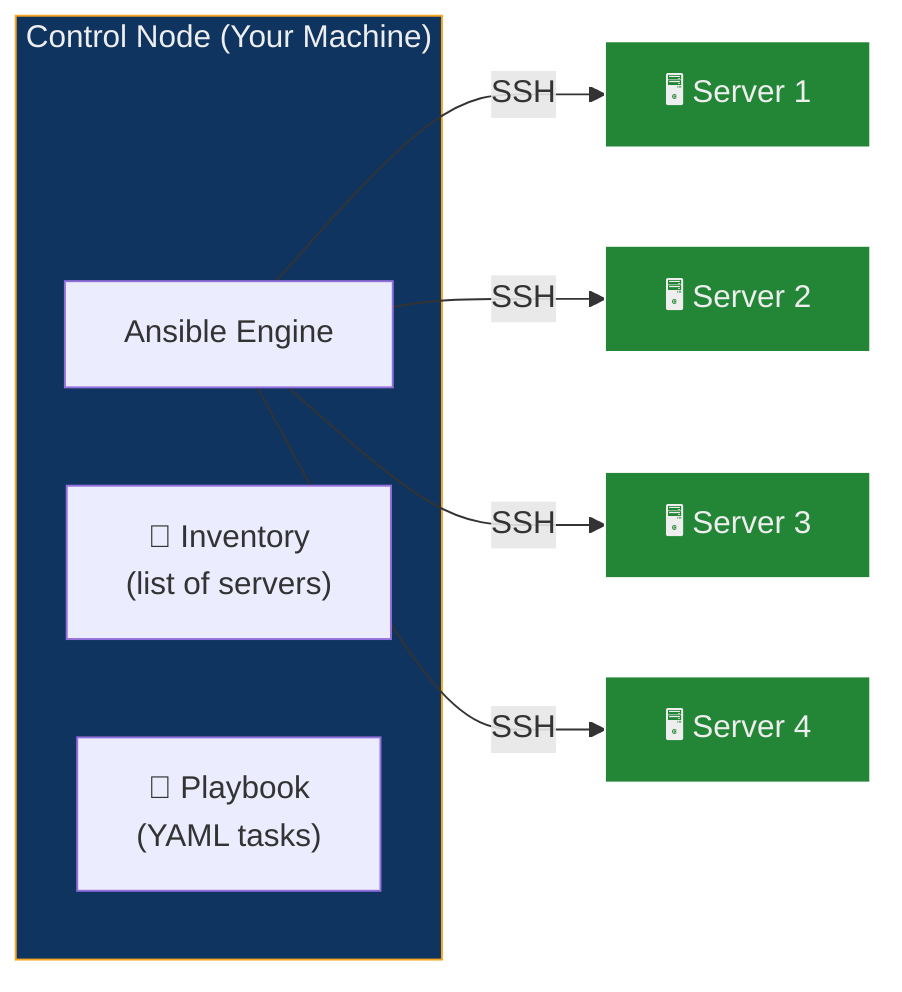
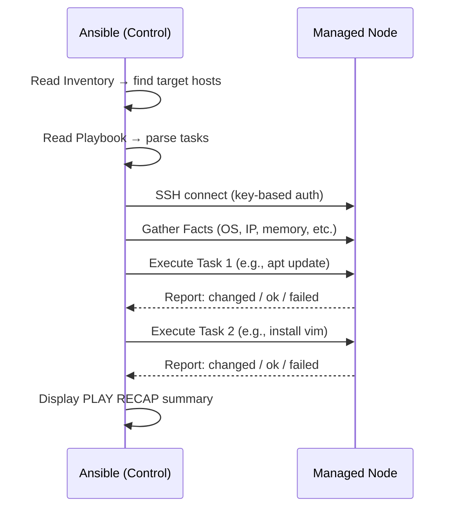
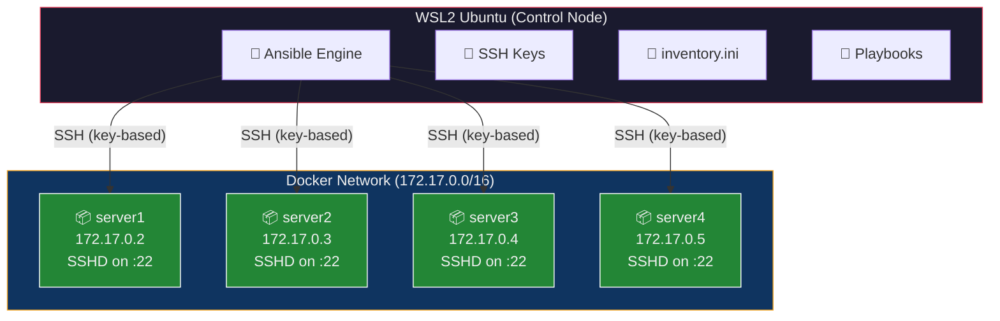
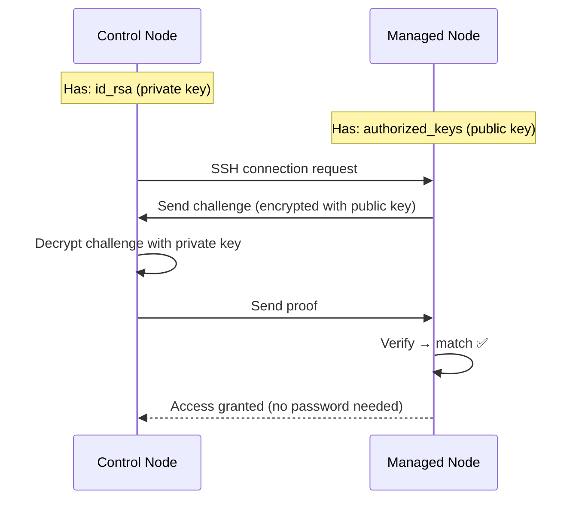

## Objective

Set up Ansible on a control node (WSL2 Ubuntu), build SSH-enabled Docker containers as managed nodes, and use Ansible playbooks to automate package installation, file creation, and system information gathering across all four servers simultaneously.

---

## Theory

### The Problem: Manual Server Management at Scale

Imagine you manage 100 production servers. A critical security patch needs to be applied — **today**. Manually:

1. SSH into server 1 → run `apt update && apt upgrade` → verify → logout
2. Repeat 99 more times
3. Pray you didn't miss one or make a typo

This is **slow, error-prone, inconsistent, and doesn't scale**. What if one server gets a different package version? What if you forget server #47?

### The Solution: Ansible

**Ansible** is an open-source automation tool that lets you define tasks in simple YAML files (playbooks) and execute them across hundreds of servers **simultaneously** over SSH — with **no agent software** required on the target machines.



### Key Ansible Concepts

| Component | Description |
| :--- | :--- |
| **Control Node** | Machine with Ansible installed — sends commands |
| **Managed Nodes** | Target servers — no Ansible needed, only SSH + Python |
| **Inventory** | INI/YAML file listing managed nodes and connection details |
| **Playbook** | YAML file defining a sequence of automation tasks |
| **Task** | A single action (e.g., install a package, create a file) |
| **Module** | Built-in function that performs a task (e.g., `apt`, `copy`, `command`) |
| **Role** | Reusable, structured collection of playbooks and vars |

### Why Ansible Wins — Key Properties

| Property | Meaning |
| :--- | :--- |
| **Agentless** | Uses SSH — no software to install/maintain on managed nodes |
| **Idempotent** | Running a playbook twice produces the same result — no duplicates |
| **Declarative** | You describe the **desired state** ("nginx must be installed"), not the steps |
| **Push-based** | Changes are initiated from the control node immediately |
| **YAML syntax** | Human-readable, version-controllable, easy to learn |

### How Ansible Executes a Playbook



### Ansible vs Other Tools

| Feature | Ansible | Chef | Puppet | SaltStack |
| :--- | :--- | :--- | :--- | :--- |
| **Architecture** | Agentless (SSH) | Agent-based | Agent-based | Agent-based |
| **Language** | YAML | Ruby DSL | Puppet DSL | YAML/Python |
| **Learning curve** | Low | High | Medium | Medium |
| **Push/Pull** | Push | Pull | Pull | Both |
| **Setup effort** | Minimal | High | High | Medium |

### Our Lab Architecture

In this experiment, we simulate a real multi-server environment using Docker containers:



Each Docker container runs Ubuntu with:
- OpenSSH server (sshd) listening on port 22
- Our public key pre-installed in `/root/.ssh/authorized_keys`
- Python3 installed (Ansible requires it on managed nodes)

---

## Prerequisites

- WSL2 with Ubuntu installed
- Docker Desktop running
- Basic terminal/command-line knowledge

---

## Part A — Installation & Setup

### Phase 1: Install Ansible

```bash
sudo apt update -y
sudo apt install -y ansible
ansible --version
```

**Expected output:** Ansible version info with Python path and config file location.

Verify with a local ping test:

```bash
ansible localhost -m ping
```

```json
localhost | SUCCESS => {
    "changed": false,
    "ping": "pong"
}
```


---

### Phase 2: Generate SSH Key Pair

```bash
ssh-keygen -t rsa -b 4096 -f ~/.ssh/id_rsa -N ""
```

| Flag | Purpose |
| :--- | :--- |
| `-t rsa` | Key type: RSA algorithm |
| `-b 4096` | Key size: 4096 bits (strong encryption) |
| `-f ~/.ssh/id_rsa` | Output file path — skips the interactive "enter file" prompt |
| `-N ""` | **Empty passphrase** — critical for Ansible (it can't type a passphrase interactively) |

> **Why `-N ""`?** Without this flag, `ssh-keygen` prompts for a passphrase. If you set one, Ansible will **hang indefinitely** on every SSH connection because it cannot provide the passphrase during automated playbook runs.

This creates two files:

| File | Location | Purpose |
| :--- | :--- | :--- |
| `id_rsa` (Private Key) | Control node (`~/.ssh/`) | Used by Ansible to authenticate — **never share** |
| `id_rsa.pub` (Public Key) | Copied into managed nodes | Placed in `~/.ssh/authorized_keys` to grant access |

### SSH Key Authentication Flow




---

### Phase 3: Build the Docker Image

Create the working directory and copy keys:

```bash
mkdir -p ~/ansible-lab && cd ~/ansible-lab
cp ~/.ssh/id_rsa.pub .
cp ~/.ssh/id_rsa .
```

Create the Dockerfile:

```dockerfile
FROM ubuntu

RUN apt update -y
RUN apt install -y python3 openssh-server
RUN mkdir -p /var/run/sshd

# Configure SSH: enable root login, disable password auth, enable key auth
RUN mkdir -p /run/sshd && \
    echo 'root:password' | chpasswd && \
    sed -i 's/#PermitRootLogin prohibit-password/PermitRootLogin yes/' /etc/ssh/sshd_config && \
    sed -i 's/#PasswordAuthentication yes/PasswordAuthentication no/' /etc/ssh/sshd_config && \
    sed -i 's/#PubkeyAuthentication yes/PubkeyAuthentication yes/' /etc/ssh/sshd_config

# Create .ssh directory with correct permissions
RUN mkdir -p /root/.ssh && \
    chmod 700 /root/.ssh

# Copy SSH keys into the image
COPY id_rsa /root/.ssh/id_rsa
COPY id_rsa.pub /root/.ssh/authorized_keys

# Set proper file permissions
RUN chmod 600 /root/.ssh/id_rsa && \
    chmod 644 /root/.ssh/authorized_keys

# Fix PAM login issue for SSH
RUN sed -i 's@session\s*required\s*pam_loginuid.so@session optional pam_loginuid.so@g' /etc/pam.d/sshd

EXPOSE 22

# Start SSH daemon in foreground
CMD ["/usr/sbin/sshd", "-D"]
```

#### Dockerfile Breakdown

| Line | Purpose |
| :--- | :--- |
| `FROM ubuntu` | Base image — latest Ubuntu |
| `apt install python3 openssh-server` | Python3 for Ansible, sshd for SSH |
| `echo 'root:password' \| chpasswd` | Sets root password (fallback) |
| `PermitRootLogin yes` | Allows SSH as root |
| `PasswordAuthentication no` | Disables password login — forces key-based auth |
| `PubkeyAuthentication yes` | Enables SSH key authentication |
| `COPY id_rsa.pub ... authorized_keys` | Installs our public key — grants access |
| `chmod 600 / 644` | SSH requires strict file permissions or it refuses to work |
| `pam_loginuid.so` fix | Prevents PAM errors when SSHing into containers |
| `CMD ["/usr/sbin/sshd", "-D"]` | Runs SSH daemon in foreground — keeps container alive |

Build the image:

```bash
docker build -t ubuntu-server .
```

Clean up keys from the build directory:

```bash
rm id_rsa id_rsa.pub
```


---

### Phase 4: Launch 4 Server Containers

```bash
for i in {1..4}; do
  echo -e "\nCreating server${i}"
  docker run -d --rm -p 220${i}:22 --name server${i} ubuntu-server
  echo "IP of server${i} is $(docker inspect -f '{{range.NetworkSettings.Networks}}{{.IPAddress}}{{end}}' server${i})"
done
```

| Flag | Purpose |
| :--- | :--- |
| `-d` | Detached mode — run in background |
| `--rm` | Auto-remove container when stopped |
| `-p 220${i}:22` | Map host port 2201–2204 to container SSH port 22 |
| `--name server${i}` | Name containers server1 through server4 |

Verify all containers are running:

```bash
docker ps
```


---

### Phase 5: Create the Ansible Inventory

```bash
cd ~/ansible-lab

# Auto-generate inventory from running container IPs
echo "[servers]" > inventory.ini
for i in {1..4}; do
  docker inspect -f '{{range.NetworkSettings.Networks}}{{.IPAddress}}{{end}}' server${i} >> inventory.ini
done

# Add connection variables
cat << 'EOF' >> inventory.ini

[servers:vars]
ansible_user=root
ansible_ssh_private_key_file=~/.ssh/id_rsa
ansible_python_interpreter=/usr/bin/python3
EOF
```

Verify:

```bash
cat inventory.ini
```

**Expected output:**

```ini
[servers]
172.17.0.2
172.17.0.3
172.17.0.4
172.17.0.5

[servers:vars]
ansible_user=root
ansible_ssh_private_key_file=~/.ssh/id_rsa
ansible_python_interpreter=/usr/bin/python3
```

#### Inventory Variable Breakdown

| Variable | Purpose |
| :--- | :--- |
| `ansible_user=root` | SSH as root user |
| `ansible_ssh_private_key_file=~/.ssh/id_rsa` | Path to the private key for authentication |
| `ansible_python_interpreter=/usr/bin/python3` | Explicitly set Python path — prevents auto-discovery warnings |

> **Why `~/.ssh/id_rsa` and not `./id_rsa`?** Relative paths break if you run Ansible from a different directory. Also, keys on NTFS (Windows mounts in WSL2) get `0777` permissions, causing SSH to reject them with "UNPROTECTED PRIVATE KEY FILE!" error. Keys in `~/.ssh/` on the Linux filesystem have correct `600` permissions.

---

### Phase 6: Test Connectivity

**Critical step — disable host key checking first:**

```bash
export ANSIBLE_HOST_KEY_CHECKING=False
```

> **Why?** First-time SSH connections show "The authenticity of host... can't be established. Are you sure (yes/no)?" — Ansible can't type "yes" in non-interactive mode, so the connection **fails silently**.

Test SSH manually:

```bash
SERVER1_IP=$(docker inspect -f '{{range.NetworkSettings.Networks}}{{.IPAddress}}{{end}}' server1)
ssh -i ~/.ssh/id_rsa -o StrictHostKeyChecking=no root@$SERVER1_IP "echo SSH works"
```

Test Ansible connectivity to all servers:

```bash
ansible all -i inventory.ini -m ping
```

| Flag | Purpose |
| :--- | :--- |
| `all` | Target all hosts in inventory |
| `-i inventory.ini` | Specify inventory file |
| `-m ping` | Use the `ping` module (tests SSH + Python, not ICMP) |

**Expected output (all 4 servers SUCCESS):**

```json
172.17.0.2 | SUCCESS => {
    "changed": false,
    "ping": "pong"
}
172.17.0.3 | SUCCESS => { ... }
172.17.0.4 | SUCCESS => { ... }
172.17.0.5 | SUCCESS => { ... }
```


---

## Part B — Running Playbooks

### Phase 7: Playbook 1 — Update & Install Packages

Create `update.yml`:

```yaml
---
- name: Update and configure servers
  hosts: all
  become: yes

  tasks:
    - name: Update apt packages
      apt:
        update_cache: yes
        upgrade: dist

    - name: Install required packages
      apt:
        name: ["vim", "htop", "wget"]
        state: present

    - name: Create test file
      copy:
        dest: /root/ansible_test.txt
        content: "Configured by Ansible on {{ inventory_hostname }}"
```

#### Playbook Breakdown

| Field | Purpose |
| :--- | :--- |
| `---` | YAML document start marker (required) |
| `name:` | Human-readable description of this play |
| `hosts: all` | Run on all hosts in inventory |
| `become: yes` | Escalate privileges (sudo) |
| `tasks:` | List of actions to perform |

| Task | Module | What It Does |
| :--- | :--- | :--- |
| Update apt | `apt` | Refreshes package cache and performs dist-upgrade |
| Install packages | `apt` | Installs vim, htop, wget — `state: present` means "ensure installed" |
| Create test file | `copy` | Creates a file with dynamic content using Jinja2 template (`{{ inventory_hostname }}`) |

Run the playbook:

```bash
ansible-playbook -i inventory.ini update.yml
```

**Expected output:**

```text
PLAY [Update and configure servers] *****

TASK [Gathering Facts] *****
ok: [172.17.0.2]
ok: [172.17.0.3]
ok: [172.17.0.4]
ok: [172.17.0.5]

TASK [Update apt packages] *****
changed: [172.17.0.2]
changed: [172.17.0.3]
...

TASK [Install required packages] *****
changed: [172.17.0.2]
...

TASK [Create test file] *****
changed: [172.17.0.2]
...

PLAY RECAP *****
172.17.0.2  : ok=4  changed=3  unreachable=0  failed=0
172.17.0.3  : ok=4  changed=3  unreachable=0  failed=0
172.17.0.4  : ok=4  changed=3  unreachable=0  failed=0
172.17.0.5  : ok=4  changed=3  unreachable=0  failed=0
```

#### Understanding PLAY RECAP

| Counter | Meaning |
| :--- | :--- |
| **ok** | Tasks that succeeded (including "already in desired state") |
| **changed** | Tasks that made actual changes on the server |
| **unreachable** | Hosts that couldn't be contacted via SSH |
| **failed** | Tasks that errored out |
| **skipped** | Tasks skipped due to conditions |


---

### Phase 8: Playbook 2 — System Info & Advanced Tasks

Create `playbook1.yml`:

```yaml
---
- name: Configure multiple servers
  hosts: servers
  become: yes

  tasks:
    - name: Update apt package index
      apt:
        update_cache: yes

    - name: Install Python 3 (latest available)
      apt:
        name: python3
        state: latest

    - name: Create test file with content
      copy:
        dest: /root/test_file.txt
        content: |
          This is a test file created by Ansible
          Server name: {{ inventory_hostname }}
          Current date: {{ ansible_date_time.date }}

    - name: Display system information
      command: uname -a
      register: uname_output

    - name: Show disk space
      command: df -h
      register: disk_space

    - name: Print results
      debug:
        msg:
          - "System info: {{ uname_output.stdout }}"
          - "Disk space: {{ disk_space.stdout_lines }}"
```

#### New Concepts in This Playbook

| Concept | Explanation |
| :--- | :--- |
| `state: latest` | Ensures the **latest** version is installed (vs `present` which accepts any version) |
| `content: \|` | YAML multi-line string (literal block scalar) — preserves line breaks |
| `{{ ansible_date_time.date }}` | Ansible **fact** — auto-gathered system info available as variables |
| `register: uname_output` | **Captures command output** into a variable for later use |
| `debug:` module | **Prints messages** to the console — used for displaying registered variables |

Run:

```bash
ansible-playbook -i inventory.ini playbook1.yml
```


---

### Phase 9: Verify Changes

```bash
# Verify ansible_test.txt (from update.yml)
ansible all -i inventory.ini -m command -a "cat /root/ansible_test.txt"

# Verify test_file.txt (from playbook1.yml)
ansible all -i inventory.ini -m command -a "cat /root/test_file.txt"

# Double-check via docker exec directly
for i in {1..4}; do
  echo "=== server${i} ==="
  docker exec server${i} cat /root/ansible_test.txt
done
```

**Expected output:**

```text
172.17.0.2 | CHANGED | rc=0 >>
Configured by Ansible on 172.17.0.2
172.17.0.3 | CHANGED | rc=0 >>
Configured by Ansible on 172.17.0.3
...
```


---

### Phase 10: Cleanup

```bash
for i in {1..4}; do
  docker stop server${i}
done
```

Since we used `--rm`, containers are automatically removed when stopped.


---

## Deep Dive: Understanding Idempotency

Run `update.yml` **twice**:

- **First run:** `changed=3` — packages installed, file created
- **Second run:** `changed=0` — packages already installed, file already exists with same content

This is **idempotency** — the defining property of configuration management tools. It means you can safely re-run playbooks without fear of duplicate installations or broken states.

```text
First run:   Install vim → changed ✅
Second run:  vim already installed → ok (no change) ✅
```

---

## Common Pitfalls & Troubleshooting

| Problem | Cause | Fix |
| :--- | :--- | :--- |
| `UNREACHABLE! Host key verification failed` | First SSH connection requires "yes" confirmation | `export ANSIBLE_HOST_KEY_CHECKING=False` |
| `UNPROTECTED PRIVATE KEY FILE!` | Key file permissions too open (0777 on NTFS) | Use `~/.ssh/id_rsa` on Linux filesystem, not NTFS mount |
| `Permission denied (publickey)` | Wrong key or key not in authorized_keys | Verify: `ssh -i ~/.ssh/id_rsa root@<ip>` manually |
| `Missing sudo password` | `become: yes` without password | Using root user directly, or add `ansible_become_password` |
| `No module named 'apt'` | Running playbook on non-Debian host | Ensure containers are Ubuntu-based |
| Container exits immediately | No foreground process | Ensure `CMD ["/usr/sbin/sshd", "-D"]` — `-D` keeps sshd in foreground |
| `ansible_connection must be one of [ssh, local...]` | Inventory uses `ansible_connection=2201` (port number) | `ansible_connection` is a **type** (ssh/local), not a port — use direct container IPs |

---

## Optional: Part B — Local & Advanced Exercises

### Ad-hoc Commands

```bash
# List all modules
ansible-doc -l

# Search for AWS modules
ansible-doc -l | grep aws

# View module documentation
ansible-doc apt
```

### Ansible Vault (Secrets Management)

```bash
# Create encrypted file
ansible-vault create secrets.yml

# Edit encrypted file
ansible-vault edit secrets.yml

# Run playbook with vault password
ansible-playbook -i inventory.ini playbook.yml --ask-vault-pass
```

### Ansible Galaxy (Reusable Roles)

```bash
# Install community collections
ansible-galaxy collection install community.general
```

---

## Lab Fixes Summary

The original lab sheet had several issues that were fixed for this experiment. These are documented for educational purposes:

| Change | Original (Broken) | Fixed | Why |
| :--- | :--- | :--- | :--- |
| SSH keygen | `ssh-keygen -t rsa -b 4096` (interactive) | Added `-f ~/.ssh/id_rsa -N ""` | Ansible can't type passphrases interactively |
| Dockerfile | `apt install python3 python3-pip` | Removed `python3-pip` | pip via apt is deprecated on Ubuntu 22.04+; Ansible only needs python3 |
| Host key checking | Not mentioned | `export ANSIBLE_HOST_KEY_CHECKING=False` | SSH prompts "are you sure?" which hangs non-interactive Ansible |
| Inventory entries | `ansible_connection=2201` (wrong) | Direct container IPs only | `ansible_connection` expects a type (ssh/local), not a port number |
| Docker run flags | `-p --rm 2222:22` (broken order) | `--rm -p 220${i}:22` | `--rm` between `-p` and its argument breaks flag parsing |
| Key file path | `./id_rsa` (relative) | `~/.ssh/id_rsa` (absolute) | Relative paths break from different directories; NTFS permissions cause errors |

---

## Glossary

| Term | Definition |
| :--- | :--- |
| **Ansible** | Open-source agentless automation tool for configuration management, deployment, and orchestration |
| **Control Node** | The machine where Ansible is installed and playbooks are executed from |
| **Managed Node** | Target server that Ansible configures — requires only SSH + Python |
| **Inventory** | File listing managed nodes, grouped and with connection variables |
| **Playbook** | YAML file defining a sequence of automation tasks to execute |
| **Task** | A single action in a playbook (e.g., install a package) |
| **Module** | Built-in Ansible function (e.g., `apt`, `copy`, `command`, `debug`) |
| **Role** | Reusable, structured automation bundle — playbooks + vars + templates |
| **Agentless** | No software needed on managed nodes — Ansible uses SSH |
| **Idempotent** | Running the same operation multiple times yields the same result |
| **Facts** | System info Ansible auto-collects (OS, IP, memory, date, etc.) |
| **Register** | Captures task output into a variable for use in later tasks |
| **Become** | Privilege escalation (sudo) — `become: yes` in playbooks |
| **PLAY RECAP** | Summary at the end showing ok/changed/failed/unreachable per host |
| **Ad-hoc command** | One-off Ansible commands without a playbook (`ansible all -m ping`) |
| **Ansible Vault** | Encryption tool for securing sensitive data (passwords, keys) |
| **SSH key pair** | Cryptographic key pair — private key (authenticates) + public key (authorizes) |
| **SSHD** | SSH daemon — the server process that listens for SSH connections |

---

## References

- [Ansible Official Docs](https://docs.ansible.com)
- [Ansible Getting Started](https://www.ansible.com)
- [Spacelift Ansible Tutorial](https://spacelift.io/blog/ansible-tutorial)
- [Ansible Tower](https://ansible.github.io/lightbulb/decks/intro-to-ansible-tower.html)
