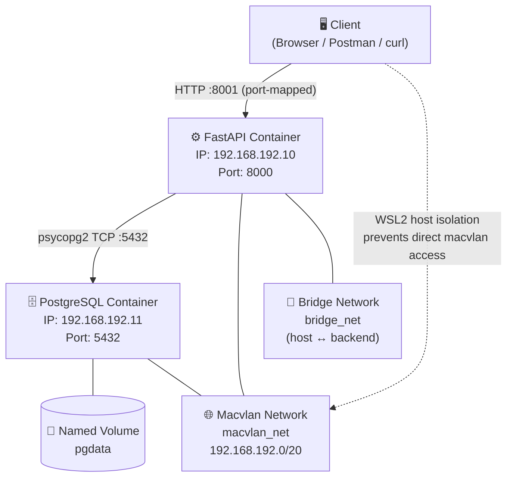
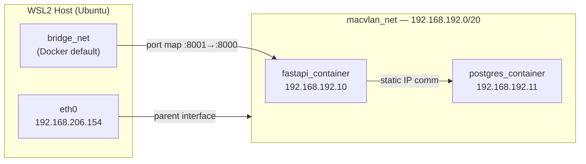
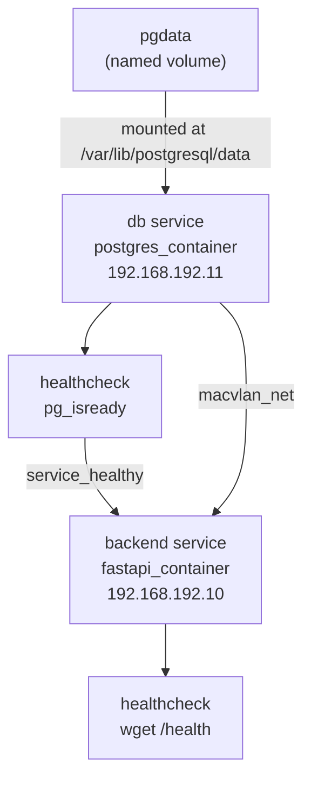
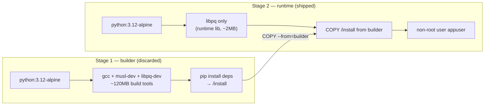
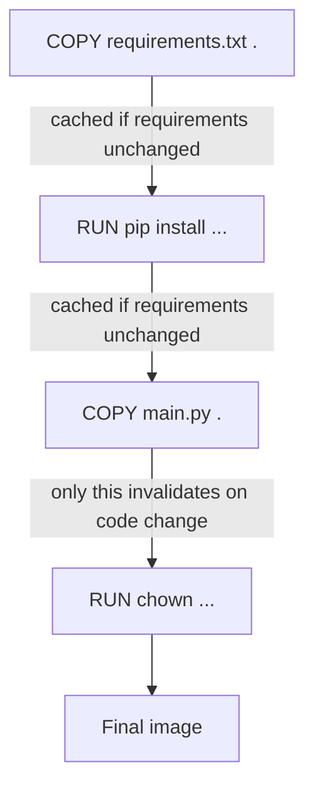
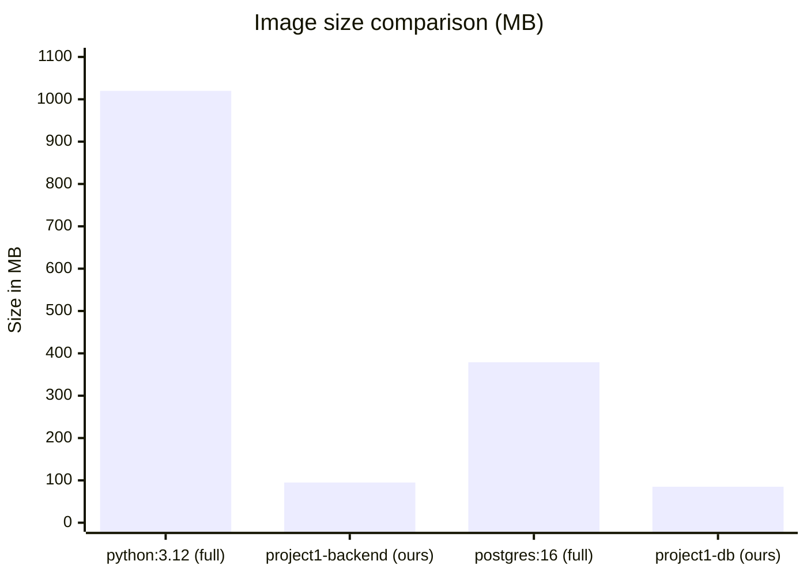
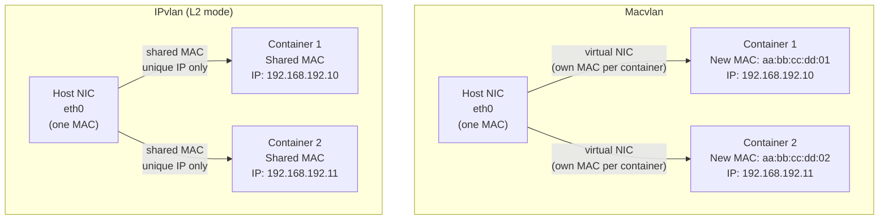
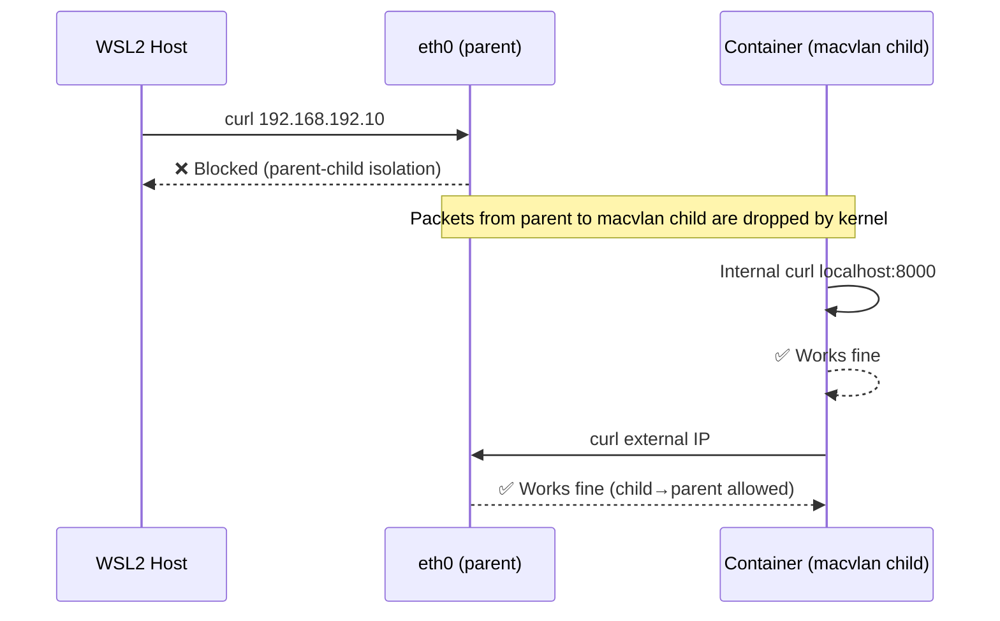
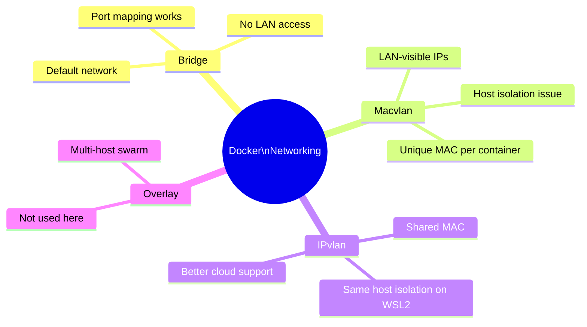

# Assignment 1 — Containerized Web Application with PostgreSQL

### Docker Compose + Macvlan Networking | FastAPI + PostgreSQL on WSL2

---

> **Student:** Pranav
> **Stack:** FastAPI (Python) · PostgreSQL 16 · Docker Compose · Macvlan Networking
> **Host Environment:** Ubuntu on WSL2 (Windows)

---

## Table of Contents

1. [Project Overview](#1-project-overview)
2. [Architecture & Network Design](#2-architecture--network-design)
3. [Build Optimization](#3-build-optimization)
4. [Image Size Comparison](#4-image-size-comparison)
5. [Macvlan vs IPvlan Comparison](#5-macvlan-vs-ipvlan-comparison)
6. [Errors Faced & How We Resolved Them](#6-errors-faced--how-we-resolved-them)
7. [Key Learnings](#7-key-learnings)

---

## 1. Project Overview

This project deploys a production-style containerized web application consisting of:

- **Backend:** FastAPI (Python) — REST API with PostgreSQL integration
- **Database:** PostgreSQL 16 (Alpine) — persistent data storage via named volume
- **Networking:** Docker Macvlan network — static IPs assigned to containers
- **Orchestration:** Docker Compose — full stack lifecycle management

### Project Directory Structure

```text
Assigment-1/
├── docker-compose.yml
├── Report.md
├── backend/
│   ├── .dockerignore
│   ├── Dockerfile
│   ├── main.py
│   └── requirements.txt
├── database/
│   ├── .dockerignore
│   └── Dockerfile
└── screenshots/
    ├── Screenshot 2026-03-16 231107.png
    ├── Screenshot 2026-03-16 231122.png
    └── Screenshot 2026-03-16 231313.png
```

### Functional Endpoints

| Method | Endpoint | Description |
|--------|----------|-------------|
| `GET` | `/health` | Health check — returns `{"status": "ok"}` |
| `POST` | `/records` | Insert a new record into PostgreSQL |
| `GET` | `/records` | Fetch all records from PostgreSQL |

### Verified Output

```bash
$ curl http://localhost:8001/health
{"status":"ok"}

$ curl -X POST http://localhost:8001/records \
    -H "Content-Type: application/json" \
    -d '{"name": "test", "value": "hello world"}'
{"id":1,"name":"test","value":"hello world"}

$ curl http://localhost:8001/records
[{"id":1,"name":"test","value":"hello world"}]
```

---

## 2. Architecture & Network Design

### 2.1 High-Level Architecture



### 2.2 Network Topology



### 2.3 Network Creation Command

The macvlan network was created manually before running Docker Compose:

```bash
docker network create \
  -d macvlan \
  --subnet=192.168.192.0/20 \
  --gateway=192.168.192.1 \
  -o parent=eth0 \
  macvlan_net
```

### 2.4 Docker Compose Service Graph



---

## 3. Build Optimization

### 3.1 Backend Dockerfile — Multi-Stage Build

The backend uses a **two-stage build** to keep the final image lean:

```dockerfile
# ── Stage 1: builder ──────────────────────────────────────
FROM python:3.12-alpine AS builder
WORKDIR /app
RUN apk add --no-cache gcc musl-dev libpq-dev
COPY requirements.txt .
RUN pip install --prefix=/install --no-cache-dir -r requirements.txt

# ── Stage 2: runtime ──────────────────────────────────────
FROM python:3.12-alpine AS runtime
RUN apk add --no-cache libpq
RUN addgroup -S appgroup && adduser -S appuser -G appgroup
WORKDIR /app
COPY --from=builder /install /usr/local
COPY main.py .
RUN chown -R appuser:appgroup /app
USER appuser
EXPOSE 8000
CMD ["uvicorn", "main:app", "--host", "0.0.0.0", "--port", "8000"]
```

#### Why Two Stages?



**Key benefits:**

| Technique | What it does | Impact |
|-----------|-------------|--------|
| Multi-stage build | Build tools stay in Stage 1, never reach final image | ~120MB saved |
| `python:3.12-alpine` base | Minimal OS — musl libc, no systemd, no package manager bloat | ~100MB vs `python:3.12` |
| `--no-cache-dir` pip flag | Skips writing pip's HTTP cache to disk | ~30–50MB saved |
| `--prefix=/install` | Installs only to a known dir, easy to COPY selectively | Clean layer copy |
| Non-root user | Security best practice — process runs as `appuser` | Security hardening |
| `.dockerignore` | Excludes `__pycache__`, `.env`, `*.pyc` from build context | Faster builds |
| Single `RUN` per logical group | Fewer layers, better cache utilization | Faster rebuilds |

### 3.2 Database Dockerfile

```dockerfile
FROM postgres:16-alpine
ENV POSTGRES_DB=appdb
ENV POSTGRES_USER=appuser
ENV POSTGRES_PASSWORD=apppassword
EXPOSE 5432
```

The database uses `postgres:16-alpine` — the official minimal variant. A full multi-stage build is not applicable here since PostgreSQL is a compiled binary distributed as-is. The optimization focus is on:

- Using the **alpine** tag (not the default Debian-based image)
- Setting environment variables at build time for predictable configuration
- Custom Dockerfile satisfying the assignment requirement (not using the image directly in compose)

### 3.3 Layer Caching Strategy



By copying `requirements.txt` **before** `main.py`, we ensure that the expensive `pip install` step is only re-run when dependencies change, not on every code edit.

---

## 4. Image Size Comparison

### 4.1 Observed Image Sizes

| Image | Base | Final Size | Notes |
|-------|------|------------|-------|
| `project1-backend` | `python:3.12-alpine` | ~95 MB | Multi-stage, deps only |
| `project1-db` | `postgres:16-alpine` | ~85 MB | Alpine variant |
| `python:3.12` *(reference)* | Debian slim | ~1.02 GB | If we had used full image |
| `postgres:16` *(reference)* | Debian | ~379 MB | If we had used full image |

### 4.2 Size Savings Visualization



### 4.3 What Was Eliminated

```
python:3.12 full image (~1.02 GB)
├── Debian base OS               → replaced by Alpine (~5MB)
├── apt package manager + lists  → not present in Alpine
├── gcc, make, binutils          → only in builder stage (discarded)
├── pip cache                    → --no-cache-dir eliminates it
├── .h header files (libpq-dev)  → only in builder stage (discarded)
└── Final: ~95 MB  ✓
```

---

## 5. Macvlan vs IPvlan Comparison

### 5.1 Conceptual Difference



### 5.2 Side-by-Side Comparison

| Feature | Macvlan | IPvlan (L2) | IPvlan (L3) |
|---------|---------|-------------|-------------|
| MAC address per container | ✅ Unique MAC each | ❌ Shared host MAC | ❌ Shared host MAC |
| IP address | Unique | Unique | Unique |
| Layer | L2 (Data Link) | L2 (Data Link) | L3 (Network) |
| Switch port isolation bypass | ❌ May be blocked | ✅ No new MACs | ✅ No new MACs |
| Host ↔ container communication | ❌ Isolated (kernel limitation) | ❌ Isolated (same issue) | ✅ Routed |
| Promiscuous mode required | ✅ Yes | ❌ No | ❌ No |
| Works on WSL2 for host access | ❌ No | ❌ No | ❌ No |
| Works in cloud VMs (AWS/GCP) | ❌ Often blocked | ✅ Better support | ✅ Best support |
| Use case | Physical LAN access | Virtual/cloud environments | Multi-subnet routing |

### 5.3 Host Isolation Issue (Macvlan)

> **The Problem:** When using macvlan, the Linux kernel creates virtual network interfaces as children of the physical NIC (`eth0`). By design, the parent interface **cannot communicate directly with its children**. This is a kernel-level isolation — not a configuration issue.



### 5.4 Our Solution

Since WSL2 additionally wraps `eth0` inside a Hyper-V virtual switch, both macvlan and ipvlan are inaccessible from the host. The solution used was:

- PostgreSQL container: attached to **macvlan only** (static IP `192.168.192.11`)
- FastAPI container: attached to **both macvlan** (static IP `192.168.192.10`) **and a bridge network**
- Host accesses FastAPI via **port mapping** (`8001:8000`) through the bridge network

This satisfies the assignment requirement (containers communicate over macvlan) while enabling testability from the host.

---

## 6. Errors Faced & How We Resolved Them

### Error 1 — Host Could Not Reach Macvlan IPs

**Symptom:**

```
curl: (7) Failed to connect to 192.168.192.10 port 8000 after 3235 ms
```

**Root Cause:** WSL2 runs inside Hyper-V, which adds a second layer of network virtualization on top of the Linux kernel's macvlan isolation. The host simply cannot route packets to macvlan child IPs.

**Resolution:**

1. First attempted `ip link add macvlan-host ...` bridge workaround — failed due to Hyper-V restrictions
2. Attempted switching to IPvlan — also inaccessible from WSL2 host
3. Final solution: added FastAPI container to a **second bridge network** + used `ports: 8001:8000`

---

### Error 2 — Port 8000 Already in Use (Claude.ai)

**Symptom:**

```json
{"detail":"Not Found","path":"http://localhost:8000/records"}
```

The `/records` endpoint returned 404, but the `/health` endpoint returned the wrong service's data entirely.

**Root Cause:** Port `8000` was already occupied by the Claude.ai desktop app running on the host. Curl was hitting Claude's API, not our FastAPI container.

**Evidence:**

```bash
$ curl http://localhost:8000/openapi.json | grep '"/'
"/projects"
"/api-keys"     ← clearly not our app
```

**Resolution:** Changed host port mapping from `8000:8000` to `8001:8000`.

---

### Error 3 — IPvlan "Device or Resource Busy"

**Symptom:**

```
Error response from daemon: failed to set up container networking:
failed to create the ipvlan port: device or resource busy
```

**Root Cause:** We tried to create an ipvlan network on `eth0` while the macvlan network was still using it. A physical interface can only be the parent of one virtual network type at a time in certain kernel configurations.

**Resolution:**

```bash
docker network rm macvlan_net   # remove old network first
docker network create -d macvlan ...   # then recreate clean
```

---

### Error 4 — Port Mapping Not Applying (Macvlan Override)

**Symptom:** `docker ps` showed `8000/tcp` (internal only) instead of `0.0.0.0:8001->8000/tcp` even after adding `ports:` to compose.

**Root Cause:** When a container is attached **only** to a macvlan network, Docker's userland proxy (which handles port mapping) cannot bind to the macvlan interface. Port mapping requires a bridge-type network.

**Resolution:** Added a second network (`bridge_net: driver: bridge`) to the backend container alongside macvlan. Port mapping then worked correctly via the bridge interface.

---

### Error 5 — `version` Attribute Deprecation Warning

**Symptom:**

```
WARN: the attribute `version` is obsolete, it will be ignored
```

**Root Cause:** Docker Compose v2 no longer requires the `version:` key in `docker-compose.yml`.

**Resolution:** Removed `version: "3.9"` from the top of the compose file.

---

## 7. Key Learnings

### 7.1 Docker Networking Deep Dive



### 7.2 WSL2 Networking Limitations

WSL2's network stack is fundamentally different from a bare-metal Linux machine:

- `eth0` inside WSL2 is a **virtual NIC** bridged through Hyper-V
- Hyper-V enforces MAC address filtering — new MACs (macvlan) may be blocked
- The WSL2 NAT layer sits between WSL2 and Windows, preventing direct LAN access
- **Production recommendation:** Use a bare-metal Linux host or a Linux VM with bridged networking for true macvlan/ipvlan LAN access

### 7.3 Multi-Stage Build Value

The multi-stage build pattern is not just an optimization — it is a **security requirement** in production. Shipping `gcc`, `make`, and header files in a container image increases the attack surface significantly. Any code execution vulnerability in the app could be leveraged to compile and run malicious binaries if those tools are present.

### 7.4 Health Check Dependency Chain

The `depends_on: condition: service_healthy` pattern is critical. Without it, FastAPI would attempt database connections before PostgreSQL finished initialization, causing startup failures. The retry loop in `main.py` adds a second layer of resilience:

```python
for i in range(10):
    try:
        conn = get_conn()
        ...
        return
    except:
        time.sleep(3)   # wait and retry
```

### 7.5 Named Volumes vs Bind Mounts

| | Named Volume (`pgdata`) | Bind Mount |
|--|------------------------|------------|
| Managed by | Docker daemon | Host filesystem |
| Survives `docker compose down` | ✅ Yes | ✅ Yes |
| Survives `docker volume prune` | ❌ No | ✅ Yes |
| Portable across hosts | ❌ No | ❌ No |
| Best for | Database data | Development code |

Named volumes are the correct choice for PostgreSQL data because Docker manages the storage path, permissions, and lifecycle — no manual directory setup needed.

---

## Appendix — Quick Reference

### Network Creation

```bash
docker network create \
  -d macvlan \
  --subnet=192.168.192.0/20 \
  --gateway=192.168.192.1 \
  -o parent=eth0 \
  macvlan_net
```

### Start Stack

```bash
docker compose up -d
```

### Test Endpoints

```bash
curl http://localhost:8001/health
curl -X POST http://localhost:8001/records \
  -H "Content-Type: application/json" \
  -d '{"name": "test", "value": "hello world"}'
curl http://localhost:8001/records
```

### Verify Persistence

```bash
docker compose down && docker compose up -d && sleep 15
curl http://localhost:8001/records   # data must still be present
```

### Inspect Network

```bash
docker network inspect macvlan_net
docker inspect fastapi_container | grep IPAddress
docker inspect postgres_container | grep IPAddress
```

---

**Student**: Pranav R Nair | **SAP ID**: 500121466 | **Batch**: 2(CCVT)
