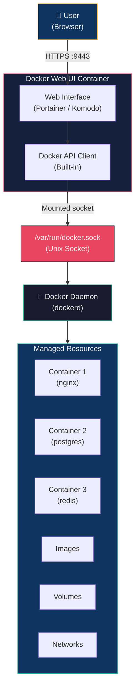
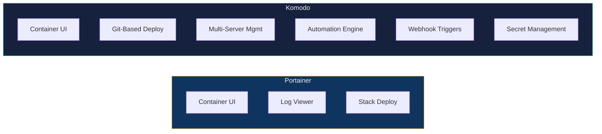
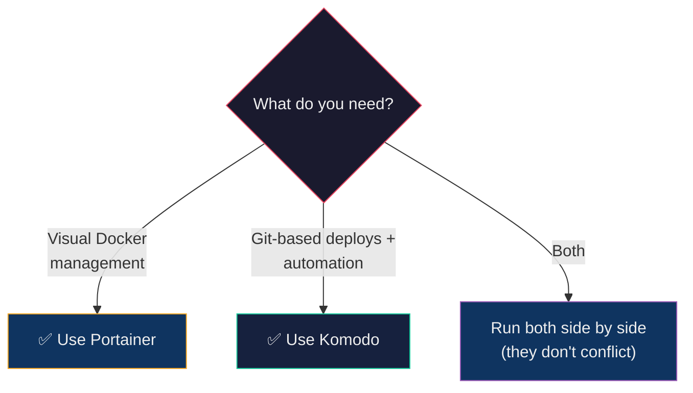
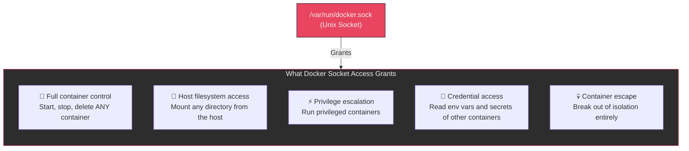

## 🎯 Core Concept

Docker Web UIs are **browser-based dashboards** that let you manage containers, images, volumes, and networks without typing CLI commands. This lecture covers the two most relevant tools — **Portainer** (beginner-friendly GUI) and **Komodo** (DevOps-oriented platform) — and then dives deep into the **security implications** of how they work, specifically the Docker socket and why mounting it is equivalent to granting root access.

---

## 🏨 Real-World Analogy — Hotel Management

Imagine you're managing a large **hotel** (your Docker host):

| Hotel Scenario | Docker Equivalent |
| :--- | :--- |
| **Walking room to room, checking guests manually** | Using `docker` CLI commands one at a time |
| **A front-desk dashboard** showing all rooms, check-ins, and housekeeping status | **Portainer** — visual overview of all containers, logs, and resources |
| **A full hotel management system** with booking, staff scheduling, vendor integration, and revenue reporting | **Komodo** — multi-server deployment platform with Git integration, automation, and pipelines |
| **The master keycard** that opens every door, safe, and restricted area | **Docker socket** (`/var/run/docker.sock`) — full control over the Docker daemon |
| **Giving the front-desk system the master keycard** | Mounting docker.sock into a container — necessary for UIs to work, but a security trade-off |

**Key insight:** Both Portainer and Komodo need the "master keycard" (docker.sock) to function. This makes them powerful — but also means a compromised UI = a compromised host.

---

## 📐 Architecture Diagram — How Docker Web UIs Work



**How it works:**

1. The Web UI container runs alongside your other containers
2. It mounts `/var/run/docker.sock` — the same Unix socket that `docker` CLI uses
3. Through this socket, it communicates with the Docker daemon using the Docker API
4. This gives it complete control: start/stop containers, view logs, manage images, etc.
5. You access the UI through your browser on a specific port (e.g., 9443 for Portainer)

---

## 📖 Part 1 — Portainer (Beginner-Friendly Docker GUI)

### What Is Portainer?

**Portainer** is the most popular open-source Docker management UI. It runs as a container itself and provides a clean, visual interface for managing your Docker environment.

### Setup Guide (WSL + Docker Desktop)

#### Step 1 — Create a Persistent Volume

```bash
docker volume create portainer_data
```

| What | Why |
| :--- | :--- |
| `docker volume create` | Creates a named volume for persistent storage |
| `portainer_data` | Portainer stores its configuration database here — survives container restarts |

#### Step 2 — Run Portainer

```bash
docker run -d \
  -p 8000:8000 \
  -p 9443:9443 \
  --name portainer \
  --restart=always \
  -v /var/run/docker.sock:/var/run/docker.sock \
  -v portainer_data:/data \
  portainer/portainer-ce
```

| Flag | Purpose |
| :--- | :--- |
| `-d` | Run in detached mode (background) |
| `-p 8000:8000` | Tunnel agent port (for edge agents to connect) |
| `-p 9443:9443` | HTTPS UI port — this is what you open in the browser |
| `--name portainer` | Name the container for easy reference |
| `--restart=always` | Auto-restart on system reboot or Docker restart |
| `-v /var/run/docker.sock:...` | Mount the Docker socket — gives Portainer full control over Docker |
| `-v portainer_data:/data` | Persist configuration across restarts |
| `portainer/portainer-ce` | Community Edition image (free) |

#### Step 3 — Access the UI

```text
https://localhost:9443
```

- Create an admin username and password on first login
- Select "Docker" as the environment type
- You'll see a full dashboard with all containers, images, volumes, and networks

### What You Can Do in Portainer

| Feature | Description |
| :--- | :--- |
| **Container Management** | Start, stop, restart, remove, inspect, and exec into containers |
| **Log Viewer** | View real-time container logs with search and filtering |
| **Deploy Stacks** | Paste or upload a `docker-compose.yml` and deploy it as a stack |
| **Image Management** | Pull, remove, and inspect Docker images |
| **Volume/Network Management** | Create, view, and delete volumes and networks |
| **Resource Monitoring** | CPU, memory, and network usage per container |
| **Container Console** | Open a terminal inside a running container (like `docker exec`) |

### When to Use Portainer

| Scenario | Fit |
| :--- | :--- |
| Learning Docker visually | ✅ Excellent |
| Managing containers without memorizing CLI | ✅ Great |
| Student lab environments | ✅ Perfect |
| Single-node Docker management | ✅ Good |
| Complex CI/CD pipelines | ❌ Not designed for this |
| Multi-server production deployments | ⚠️ Basic support (Business Edition) |

### Limitations

- **No GitOps integration** — can't auto-deploy from Git pushes
- **Limited automation** — no built-in scripting or workflow engine
- **Single-node focus** — multi-node requires Portainer Business Edition (paid)

---

## 📖 Part 2 — Komodo (DevOps-Focused Platform)

### What Is Komodo?

**Komodo** is more than a Docker UI — it's a **lightweight DevOps platform**. It provides Git-based deployments, multi-server management, automation workflows, and action history tracking. Think of it as a self-hosted alternative to basic CI/CD tools.

### Setup Guide (MongoDB Backend)

#### Step 1 — Download Configuration Files

```bash
wget -P komodo https://raw.githubusercontent.com/moghtech/komodo/main/compose/mongo.compose.yaml
wget -P komodo https://raw.githubusercontent.com/moghtech/komodo/main/compose/compose.env
```

#### Step 2 — Configure Environment Variables

```bash
# Edit the environment file with your preferred settings
nano komodo/compose.env
```

Key variables to set:

| Variable | Purpose |
| :--- | :--- |
| `KOMODO_HOST` | Hostname/IP for the UI |
| `KOMODO_PORT` | Port to expose the UI on |
| `MONGO_*` | MongoDB connection settings |
| `KOMODO_PASSKEY` | Secret key for authentication |

#### Step 3 — Deploy Komodo

```bash
docker compose -p komodo \
  -f komodo/mongo.compose.yaml \
  --env-file komodo/compose.env up -d
```

#### Step 4 — Access the UI

```text
http://<your-host>:<configured-port>
```

- Create admin credentials on first login
- Add servers and start managing deployments

### What Makes Komodo Different



### When to Use Komodo

| Scenario | Fit |
| :--- | :--- |
| DevOps lab environments | ✅ Excellent |
| Git-based deployments (push → auto-deploy) | ✅ Built-in |
| Managing containers across multiple servers | ✅ Core feature |
| Automation with scripts and webhooks | ✅ Strong |
| Secret and environment variable management | ✅ Built-in |
| Quick single-container management | ⚠️ Overkill — use Portainer |

### Limitations

- **More complex setup** — requires MongoDB (or FerretDB) as a backend database
- **Higher learning curve** — more concepts to understand (servers, stacks, builds, procedures)
- **Smaller community** — less documentation and fewer tutorials than Portainer

---

## 📖 Part 3 — Portainer vs Komodo (Decision Matrix)

| Feature | Portainer | Komodo |
| :--- | :--- | :--- |
| **Target audience** | Beginners, sysadmins | DevOps engineers, advanced users |
| **Setup complexity** | One `docker run` command | Docker Compose + MongoDB |
| **Core purpose** | Visual Docker management | DevOps platform (deploy + automate) |
| **Git integration** | ❌ Minimal | ✅ Built-in (auto-deploy on push) |
| **Automation** | ❌ Limited | ✅ Scripts, webhooks, workflows |
| **Multi-server** | ⚠️ Basic (paid edition) | ✅ Core feature |
| **Database required** | ❌ No | ✅ Yes (MongoDB / FerretDB) |
| **Container runtime support** | Docker, Swarm, Kubernetes | Docker (primarily) |
| **Audit trail** | Basic logs | Full action history |
| **Secret management** | Basic | Advanced (env vars + secrets) |
| **Best for** | Labs, quick management | Projects, pipelines, teams |

### Quick Decision



---

## 📖 Part 4 — Docker Socket Security (The Deep Dive)

### Why This Matters

Both Portainer and Komodo require this mount:

```bash
-v /var/run/docker.sock:/var/run/docker.sock
```

This single line gives the container **full, unrestricted root-level access** to your Docker host. Understanding *why* and *what the risks are* is critical knowledge.

### What Is `/var/run/docker.sock`?

| Property | Details |
| :--- | :--- |
| **Type** | Unix domain socket |
| **Owner** | `root:docker` |
| **Purpose** | Communication channel between Docker clients and the Docker daemon |
| **Used by** | `docker` CLI, Docker SDKs, any tool that talks to Docker |

When you type `docker ps`, your CLI sends a request through this socket to `dockerd` (the Docker daemon). The daemon processes the request and returns the result through the same socket.

### The Security Equation



### Real Attack Scenario

A container with docker.sock access can execute:

```bash
# From INSIDE the container, create a new container that mounts the host's root filesystem
docker run -v /:/host alpine chroot /host
```

This gives **complete access to the host filesystem** — reading SSH keys, modifying system files, creating new users. The container has effectively "escaped" its isolation.

### The Risk Matrix

| Container Type | Docker Socket | Privileged Flag | Risk Level | Example |
| :--- | :--- | :--- | :--- | :--- |
| Normal container | ❌ | ❌ | 🟢 Low — isolated by default | `docker run nginx` |
| Container with docker.sock | ✅ | ❌ | 🔴 Critical — full daemon control | Portainer, Komodo |
| Privileged container | ❌ | ✅ | 🔴 Critical — no kernel isolation | `docker run --privileged` |
| Both | ✅ | ✅ | 💀 Maximum — complete host takeover | Avoid this entirely |

### Why Web UIs Still Mount the Socket

> Docker has no "read-only management API." To manage containers (start, stop, create, delete), a tool needs *full* API access. There is no in-between.

This is an **intentional design trade-off**: you sacrifice some security boundaries to gain management capability. The key is to understand the risk and mitigate it.

---

## 📖 Part 5 — Security Best Practices

### 1. Never Expose the UI to the Public Internet

```text
❌ Bad:   -p 0.0.0.0:9443:9443     → Open to the entire internet
✅ Good:  -p 127.0.0.1:9443:9443   → Only accessible from localhost
✅ Good:  Access via VPN or SSH tunnel
```

### 2. Use Strong Authentication

- Set a strong admin password immediately on first login
- Never leave default credentials
- Enable MFA if supported (Portainer Business Edition supports it)

### 3. Add a Reverse Proxy with Authentication

```text
Internet → NGINX/Traefik (with auth) → Portainer/Komodo
```

This adds an additional authentication layer before traffic reaches the UI.

### 4. Consider Docker API over TLS (Instead of Socket)

```bash
# Instead of mounting the socket, expose Docker API over TLS
dockerd --tlsverify --tlscacert=ca.pem --tlscert=server-cert.pem --tlskey=server-key.pem -H=0.0.0.0:2376
```

This is more complex but allows:

- Certificate-based authentication
- Network boundary enforcement
- Fine-grained access on a per-client basis

### 5. Use Rootless Docker

Rootless Docker runs the daemon as a non-root user, reducing the impact of a compromise:

```bash
# Install rootless Docker
dockerd-rootless-setuptool.sh install
```

Even if a container escapes via docker.sock, the damage is limited to the non-root user's permissions.

### 6. Separate Management Hosts from Application Hosts

In production, don't run your management UI on the same host as your application containers. Use a dedicated management node.

---

## 📚 Key Terminology — Glossary

| Term | Definition |
| :--- | :--- |
| **Docker Web UI** | A browser-based dashboard for managing Docker containers, images, volumes, and networks without CLI |
| **Portainer** | The most popular open-source Docker management UI — beginner-friendly, single-command setup |
| **Komodo** | A DevOps-focused Docker management platform with Git integration, multi-server support, and automation |
| **Portainer CE** | Community Edition — the free, open-source version of Portainer |
| **Docker Socket** | `/var/run/docker.sock` — a Unix socket used for communication between Docker clients and the daemon |
| **Unix Socket** | A file-based inter-process communication (IPC) mechanism on Linux — faster than TCP for local communication |
| **Docker Daemon** | `dockerd` — the background process that manages Docker objects (containers, images, volumes, networks) |
| **Docker API** | The REST API exposed by the Docker daemon for programmatic container management |
| **Socket Mounting** | Binding the host's docker.sock into a container via `-v /var/run/docker.sock:/var/run/docker.sock` |
| **Privilege Escalation** | Gaining higher access than intended — e.g., a container accessing host resources via docker.sock |
| **Container Escape** | Breaking out of container isolation to access the host system directly |
| **Privileged Mode** | `--privileged` flag — removes all security restrictions from a container, giving it near-root access |
| **Rootless Docker** | Running the Docker daemon as a non-root user, limiting the blast radius of a compromise |
| **GitOps** | A practice where Git is the single source of truth for infrastructure, with deployments triggered by commits |
| **Reverse Proxy** | A server (NGINX, Traefik) that sits in front of a service, adding TLS, authentication, and load balancing |
| **Docker Compose Stack** | A group of services defined in a `docker-compose.yml` — deployable as a unit from Portainer |
| **Edge Agent** | A Portainer agent that runs on remote hosts, allowing centralized management from one UI |
| **TLS** | Transport Layer Security — encryption protocol; used to secure Docker API communication over the network |

---

## 🎓 Exam & Interview Preparation

### Q1: Explain how Docker Web UIs like Portainer gain full control over the Docker host. What is the security implication of this design?

**Answer:**

Docker Web UIs (Portainer, Komodo) gain control by **mounting the Docker socket** into their container:

```bash
-v /var/run/docker.sock:/var/run/docker.sock
```

`/var/run/docker.sock` is the Unix socket that the Docker daemon listens on. The `docker` CLI communicates with `dockerd` through this same socket. By mounting it inside the UI container, the container can send any Docker API request — making it functionally equivalent to running `docker` CLI as root.

**What this grants:**

- Full container lifecycle control (create, start, stop, delete any container)
- Ability to mount host directories into new containers (filesystem access)
- Ability to run privileged containers (privilege escalation)
- Access to environment variables and secrets of other containers

**Security implication:** If the Web UI container is compromised (through an exploit, weak credentials, or public exposure), the attacker has equivalent-to-root access on the host. A compromised Portainer = a compromised Docker host.

**Why it's necessary:** Docker has no read-only management API. Any tool that manages containers needs full socket access. This is a design trade-off — you accept the risk and mitigate it through access controls (localhost-only binding, VPN, strong auth, reverse proxy).

---

### Q2: Compare Portainer and Komodo. In what scenarios would you choose one over the other?

**Answer:**

| Dimension | Portainer | Komodo |
| :--- | :--- | :--- |
| **Setup** | One `docker run` command | Docker Compose + MongoDB |
| **Purpose** | Visual Docker management | DevOps platform (deploy, automate, manage) |
| **Git integration** | Minimal | Built-in (auto-deploy on Git push) |
| **Multi-server** | Basic (paid edition) | Core feature |
| **Automation** | Limited | Strong (scripts, webhooks, workflows) |
| **Learning curve** | Low | Moderate |

**Choose Portainer when:**

- You're learning Docker and want a GUI instead of CLI
- You need a quick, single-command setup for a lab environment
- You manage a single Docker host
- You want to visually explore containers, logs, images, and networks

**Choose Komodo when:**

- You want Git-based deployments (commit → auto-deploy)
- You manage containers across multiple servers
- You need automation: webhooks, scripts, scheduled tasks
- You want audit trails and action history for team environments

**In practice:** Both can run side by side. Use Portainer for daily visual management and Komodo for automated deployment workflows.

---

### Q3: A container runs with `-v /var/run/docker.sock:/var/run/docker.sock`. An attacker gains shell access to this container. What can they do, and how would you mitigate this risk?

**Answer:**

**What the attacker can do:**

1. **List and control all containers:** `docker ps -a`, `docker stop <any-container>`, `docker rm -f <any>`
2. **Read secrets and env vars:** `docker inspect <container>` exposes all environment variables
3. **Access the host filesystem:**

```bash
docker run -v /:/host alpine chroot /host
```

This mounts the entire host filesystem and gives the attacker a root shell on the host.

4. **Establish persistence:** Create new containers with backdoors, add SSH keys to the host, or modify system files
5. **Lateral movement:** Use the host's network identity to access other internal services

**Mitigation strategies:**

| Strategy | What It Does |
| :--- | :--- |
| **Localhost-only binding** | `-p 127.0.0.1:9443:9443` prevents remote access |
| **VPN/SSH tunnel** | Requires authenticated network access before reaching the UI |
| **Strong passwords + MFA** | Prevents credential-based attacks |
| **Reverse proxy with auth** | NGINX/Traefik adds a second authentication layer |
| **Docker API over TLS** | Replaces socket mount with certificate-authenticated network API |
| **Rootless Docker** | Runs dockerd as non-root — limits escalation impact |
| **Separate management host** | Compromised management container can't touch application containers |
| **Regular patching** | Keep Portainer/Komodo updated to avoid known CVEs |

**Key principle:** "Anyone who can access the Docker daemon **is** root." Design your security accordingly.

---

## 📎 References

- [Portainer Installation — WSL + Docker Desktop](https://docs.portainer.io/start/install/server/docker/wsl)
- [Komodo Setup Documentation](https://komo.do/docs/setup)
- [What Is Komodo?](https://komo.do/docs/intro)
- [Komodo Install with MongoDB](https://komo.do/docs/setup/mongo)
- [Docker Socket Security — Official Docs](https://docs.docker.com/engine/security/)
