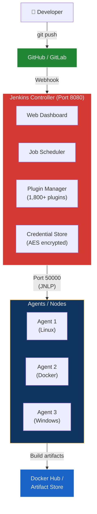
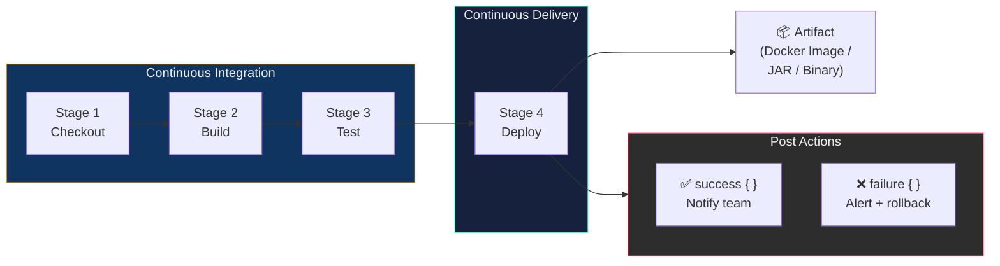
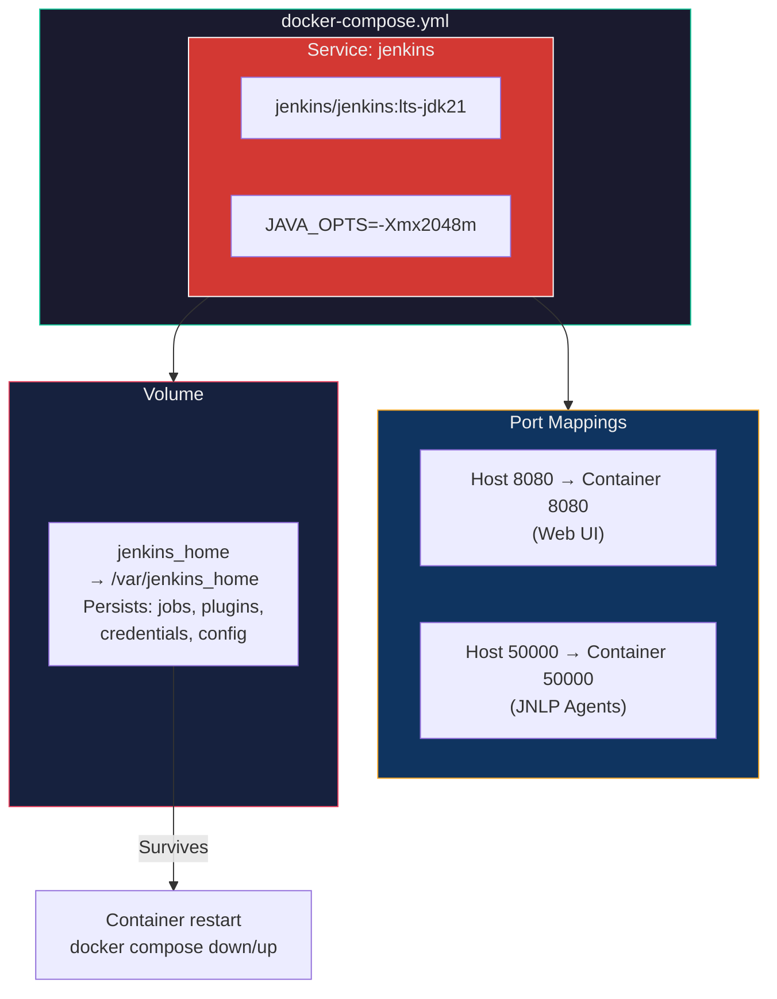
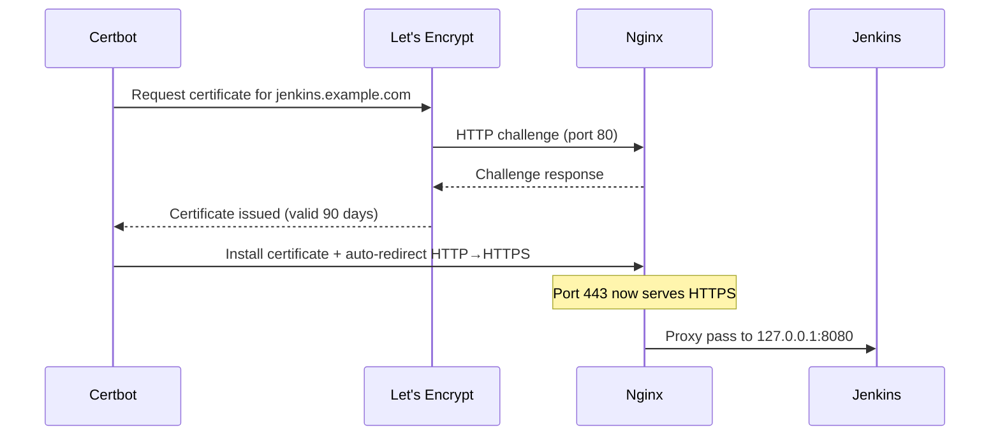

## 🎯 Core Concept

**Jenkins** is a free, open-source **automation server** that watches your code repository and, whenever someone pushes a change, automatically builds, tests, and deploys it. This process is called a **CI/CD pipeline** (Continuous Integration / Continuous Delivery). Jenkins is the most popular tool for this job, with over **1,800 plugins** connecting it to Git, Docker, Kubernetes, Slack, AWS, and almost any DevOps tool.

This guide covers **everything** — from installation (native Linux, Docker, WSL 2) through production hardening (Nginx reverse proxy, SSL/HTTPS) to writing your first pipeline.

---

## 🏗️ Real-World Analogy — The Automated Factory

Imagine a **clothing factory**:

| Factory Scenario | Jenkins Equivalent |
| :--- | :--- |
| **The factory building** | Jenkins Controller (the main server managing everything) |
| **Assembly line workers** | Agents/Nodes (machines that execute build jobs) |
| **Blueprint for a shirt** | Jenkinsfile (code that defines the pipeline) |
| **Quality checkers** | Test stages in the pipeline |
| **Shipping department** | Deploy stage (pushing the artifact to production) |
| **Manager's clipboard** | Jenkins Dashboard (web UI showing all jobs and builds) |
| **Security keycard** | Initial admin password and credentials |
| **Factory expansion** | Adding new agents, plugins, and integrations |

Without Jenkins, a human must pull code, compile it, run tests, package it, and push it to the server — every single time. Jenkins **automates the entire production line**.

---

## 📐 Architecture Diagrams

### Jenkins High-Level Architecture



### Installation Method Decision Tree

```mermaid
flowchart TD
    Q{"What's your environment?"}
    Q -->|"Ubuntu/Debian\nserver"| NATIVE["Native Install\n(Section 4)\n✅ Best for production"]
    Q -->|"Any OS with\nDocker installed"| DOCKER["Docker Install\n(Section 5)\n✅ Best for isolation"]
    Q -->|"Windows with\nWSL 2"| WSL["WSL 2 Install\n(Section 6)\n✅ Best for local dev"]

    DOCKER --> DQ{"Quick test or\nlong-term?"}
    DQ -->|"Quick test"| RUN["`docker run`\n(Method A)"]
    DQ -->|"Long-term"| COMPOSE["Docker Compose\n(Method B) ✅"]

    style Q fill:#1a1a2e,stroke:#e94560,color:#eee
    style NATIVE fill:#238636,stroke:#fff,color:#eee
    style DOCKER fill:#1a63c7,stroke:#fff,color:#eee
    style WSL fill:#9b59b6,stroke:#fff,color:#eee
```

### CI/CD Pipeline Flow



---

## 📖 Section 1 — Key Concepts Before You Start

| Term | Plain-English Explanation |
| :--- | :--- |
| **Jenkins Controller** | The main Jenkins server that manages everything — scheduling, UI, plugins |
| **Agent / Node** | A separate machine that actually runs your build jobs |
| **Job / Project** | A single automated task (e.g., "build my app") |
| **Pipeline** | A series of steps defined as code: build → test → deploy |
| **Jenkinsfile** | A text file in your repo that defines the pipeline (Pipeline as Code) |
| **Plugin** | An add-on that gives Jenkins new capabilities (Git, Docker, Slack, etc.) |
| **Workspace** | A folder on the agent where Jenkins checks out your code |
| **Build** | One execution of a job (e.g., Build #42) |
| **Port 8080** | Default port for the Jenkins web UI |
| **Port 50000** | Used by agents to connect to the controller via JNLP |

---

## 📖 Section 2 — System Requirements

### Minimum (for learning/testing)

| Resource | Minimum |
| :--- | :--- |
| RAM | 512 MB |
| Disk | 10 GB free |
| CPU | 1 core |

### Recommended (for real projects)

| Resource | Recommended |
| :--- | :--- |
| RAM | 4 GB+ |
| Disk | 50 GB+ |
| CPU | 2+ cores |

### Software Requirements

- **Java 21** (OpenJDK) — Jenkins is written in Java and cannot run without it
- **Ubuntu 20.04 / 22.04 / 24.04** or **Debian 11 / 12**
- A user account with `sudo` privileges

> **What is `sudo`?**
> `sudo` means "Super User DO" — it lets you run commands as the administrator. If a command starts with `sudo`, it needs admin rights.

---

## 📖 Section 3 — Installation on Ubuntu / Debian (Native)

This is the most common installation method. Jenkins runs directly on your operating system as a **system service** that starts automatically when your computer boots.

### Step 1 — Update Your System

Always update your package list before installing anything:

```bash
sudo apt update && sudo apt upgrade -y
```

| Part | Purpose |
| :--- | :--- |
| `apt update` | Refreshes the list of available packages |
| `apt upgrade -y` | Installs any pending updates; `-y` means "yes to all prompts" |

### Step 2 — Install Java (OpenJDK 21)

Jenkins needs Java to run. Install OpenJDK 21:

```bash
sudo apt install -y fontconfig openjdk-21-jre
```

Verify the installation:

```bash
java -version
```

**Expected output:**

```text
openjdk version "21.0.x" ...
OpenJDK Runtime Environment ...
OpenJDK 64-Bit Server VM ...
```

> **Why `fontconfig`?** Jenkins's web UI uses it to render certain fonts and charts. Without it, you may see blank graphics in the dashboard.

### Step 3 — Add the Jenkins GPG Signing Key

Jenkins packages are **signed** with a cryptographic key for verification:

```bash
sudo mkdir -p /etc/apt/keyrings

sudo wget -O /etc/apt/keyrings/jenkins-keyring.asc \
  https://pkg.jenkins.io/debian-stable/jenkins.io-2026.key
```

| Command | Purpose |
| :--- | :--- |
| `mkdir -p /etc/apt/keyrings` | Creates the directory for trusted keys (if it doesn't exist) |
| `wget -O ...` | Downloads the Jenkins signing key and saves it to the specified path |

> This key lets `apt` verify that Jenkins packages are authentic and haven't been tampered with. The key is valid until 2028.

### Step 4 — Add the Jenkins Repository

Tell your system where to download Jenkins from:

```bash
echo "deb [signed-by=/etc/apt/keyrings/jenkins-keyring.asc] \
  https://pkg.jenkins.io/debian-stable binary/" | \
  sudo tee /etc/apt/sources.list.d/jenkins.list > /dev/null
```

> **LTS vs Weekly?**
>
> | Release | Description | Use For |
> | :--- | :--- | :--- |
> | **LTS (Long-Term Support)** | Stable, tested release every 12 weeks | Production, learning |
> | **Weekly** | Latest features, potentially less stable | Bleeding-edge testing |
>
> Always use LTS for production systems.

### Step 5 — Install Jenkins

```bash
sudo apt update
sudo apt install -y jenkins
```

### Step 6 — Start Jenkins and Enable Auto-Start

Jenkins is managed by **systemd** (the system service manager):

```bash
sudo systemctl start jenkins
sudo systemctl enable jenkins
```

| Command | Purpose |
| :--- | :--- |
| `start jenkins` | Starts Jenkins right now |
| `enable jenkins` | Auto-starts Jenkins on every system boot |

### Step 7 — Verify Jenkins is Running

```bash
sudo systemctl status jenkins
```

**Expected output:**

```text
● jenkins.service - Jenkins Continuous Integration Server
     Loaded: loaded (/lib/systemd/system/jenkins.service; enabled)
     Active: active (running) since ...
```

Look for **`Active: active (running)`** in green. If it shows `failed`, see [Section 12 — Troubleshooting](#-section-12--common-troubleshooting).

### Step 8 — Get the Initial Admin Password

```bash
sudo cat /var/lib/jenkins/secrets/initialAdminPassword
```

Copy the 32-character hex string — you'll need it to unlock Jenkins in the browser.

### Step 9 — Access Jenkins in Your Browser

```text
http://localhost:8080
```

> **Remote server?** Use `http://your-server-ip:8080`. Run `hostname -I` to find your IP.

Paste the initial admin password and click **Continue**. Proceed to [Section 6 — Post-Installation Setup Wizard](#-section-6--post-installation-setup-wizard).

### Important File Locations (Ubuntu/Debian)

| File / Directory | Purpose |
| :--- | :--- |
| `/var/lib/jenkins/` | Jenkins home — all data, jobs, plugins |
| `/var/log/jenkins/jenkins.log` | Log file for debugging |
| `/etc/default/jenkins` | Jenkins startup settings (port, memory, etc.) |
| `/lib/systemd/system/jenkins.service` | Systemd service definition |
| `/var/lib/jenkins/secrets/initialAdminPassword` | First-time admin password |

---

## 📖 Section 4 — Installation via Docker

Docker lets you run Jenkins inside a **container** — an isolated, portable environment. This is great for:

- Keeping Jenkins isolated from your host system
- Easy backups and migrations
- Running multiple Jenkins instances

> **New to Docker?**
> A Docker **image** is like a recipe. A **container** is a running instance of that image. A **volume** is a folder that persists data even when the container stops.

### Prerequisites — Install Docker

If Docker isn't installed yet:

```bash
# Update packages
sudo apt update

# Install dependencies
sudo apt install -y ca-certificates curl gnupg

# Add Docker's GPG key
sudo install -m 0755 -d /etc/apt/keyrings
curl -fsSL https://download.docker.com/linux/ubuntu/gpg | \
  sudo gpg --dearmor -o /etc/apt/keyrings/docker.gpg
sudo chmod a+r /etc/apt/keyrings/docker.gpg

# Add Docker repository
echo \
  "deb [arch=$(dpkg --print-architecture) signed-by=/etc/apt/keyrings/docker.gpg] \
  https://download.docker.com/linux/ubuntu \
  $(. /etc/os-release && echo "$VERSION_CODENAME") stable" | \
  sudo tee /etc/apt/sources.list.d/docker.list > /dev/null

# Install Docker
sudo apt update
sudo apt install -y docker-ce docker-ce-cli containerd.io docker-compose-plugin

# Allow your user to run Docker without sudo
sudo usermod -aG docker $USER

# Apply group change (or log out and back in)
newgrp docker

# Verify Docker works
docker --version
```

### Method A — Quick Start with `docker run`

Fastest way to get Jenkins running — good for testing:

```bash
docker volume create jenkins_home

docker run \
  --name jenkins \
  --restart=on-failure \
  --detach \
  -p 8080:8080 \
  -p 50000:50000 \
  -v jenkins_home:/var/jenkins_home \
  jenkins/jenkins:lts-jdk21
```

#### Flag Breakdown

| Flag | What It Does |
| :--- | :--- |
| `--name jenkins` | Names the container for easy reference |
| `--restart=on-failure` | Auto-restarts if it crashes; also on system reboot |
| `--detach` | Runs in the background (you get your terminal back) |
| `-p 8080:8080` | Maps host port 8080 → container port 8080 (web UI) |
| `-p 50000:50000` | Maps host port 50000 → container port 50000 (agents) |
| `-v jenkins_home:/var/jenkins_home` | Named volume — all data survives container deletion |
| `jenkins/jenkins:lts-jdk21` | Official Jenkins LTS image with Java 21 |

> **Why use a volume?** Containers are temporary — if you delete one, all data inside is lost. A volume lives outside the container and survives deletions and upgrades.

Get the initial admin password:

```bash
docker exec jenkins cat /var/jenkins_home/secrets/initialAdminPassword
```

### Method B — Docker Compose (Recommended)

Docker Compose defines your entire setup in a single YAML file — much easier to manage than long `docker run` commands.

**Step 1:** Create a project directory

```bash
mkdir ~/jenkins-docker && cd ~/jenkins-docker
```

**Step 2:** Create `docker-compose.yml`

```yaml
version: '3.8'

services:
  jenkins:
    image: jenkins/jenkins:lts-jdk21
    container_name: jenkins
    restart: on-failure
    ports:
      - "8080:8080"    # Web interface
      - "50000:50000"  # Agent communication port
    volumes:
      - jenkins_home:/var/jenkins_home
    environment:
      - JAVA_OPTS=-Xmx2048m  # Allocate 2GB RAM to Jenkins

volumes:
  jenkins_home:
    name: jenkins_home
```

**Step 3:** Start Jenkins

```bash
docker compose up -d
```

**Step 4:** Check that it's running

```bash
docker compose ps
```

**Step 5:** Get the initial password

```bash
docker exec jenkins cat /var/jenkins_home/secrets/initialAdminPassword
```

### Docker Compose Architecture



### Useful Docker Commands for Jenkins

```bash
# Stop Jenkins
docker compose down

# Start Jenkins again
docker compose up -d

# Restart Jenkins
docker compose restart jenkins

# View live logs (press Ctrl+C to exit)
docker compose logs -f jenkins

# Open a shell inside the container
docker exec -it jenkins bash

# Upgrade Jenkins to the latest LTS image
docker compose pull
docker compose up -d
```

### Backing Up Jenkins Data (Docker)

All Jenkins data is in the `jenkins_home` volume:

```bash
# Stop Jenkins for a consistent backup
docker compose down

# Create a compressed backup archive
docker run --rm \
  -v jenkins_home:/data \
  -v $(pwd):/backup \
  alpine tar czf /backup/jenkins-backup-$(date +%Y%m%d).tar.gz -C /data .

# Start Jenkins again
docker compose up -d
```

---

## 📖 Section 5 — Installation on WSL 2 (Windows)

**WSL 2** (Windows Subsystem for Linux 2) lets you run a real Linux environment inside Windows — without a virtual machine or dual-boot setup.

### Step 1 — Install WSL 2 on Windows

Open **PowerShell as Administrator** and run:

```powershell
wsl --install
```

This installs WSL 2 with Ubuntu. **Restart your computer** when prompted.

> **Minimum requirement:** Windows 10 version 2004 (Build 19041) or higher, or Windows 11. Check with `Win + R` → type `winver` → Enter.

To install a specific Ubuntu version:

```powershell
wsl --install -d Ubuntu-24.04
```

### Step 2 — Verify WSL 2 is Being Used

```powershell
wsl --list --verbose
```

Your distro should show `VERSION 2`. If it shows `1`:

```powershell
wsl --set-version Ubuntu 2
wsl --set-default-version 2
```

### Step 3 — Install Jenkins Inside WSL 2

Inside the Ubuntu WSL terminal, follow the exact same steps as Section 3:

```bash
# 1. Update packages
sudo apt update && sudo apt upgrade -y

# 2. Install Java 21
sudo apt install -y fontconfig openjdk-21-jre

# 3. Verify Java
java -version

# 4. Add Jenkins signing key
sudo mkdir -p /etc/apt/keyrings
sudo wget -O /etc/apt/keyrings/jenkins-keyring.asc \
  https://pkg.jenkins.io/debian-stable/jenkins.io-2026.key

# 5. Add Jenkins repository
echo "deb [signed-by=/etc/apt/keyrings/jenkins-keyring.asc] \
  https://pkg.jenkins.io/debian-stable binary/" | \
  sudo tee /etc/apt/sources.list.d/jenkins.list > /dev/null

# 6. Install Jenkins
sudo apt update
sudo apt install -y jenkins
```

### Step 4 — Start Jenkins in WSL 2

WSL 2 may or may not have systemd. Check first:

```bash
ps -p 1 -o comm=
```

**If output is `systemd`:**

```bash
sudo systemctl start jenkins
sudo systemctl enable jenkins
sudo systemctl status jenkins
```

**If output is `init`:**

```bash
sudo service jenkins start
sudo service jenkins status
```

#### Enable systemd in WSL 2 (Recommended)

```bash
sudo nano /etc/wsl.conf
```

Add:

```ini
[boot]
systemd=true
```

Save, then from PowerShell:

```powershell
wsl --shutdown
```

Reopen Ubuntu — systemd is now active.

### Step 5 — Access Jenkins from Windows Browser

WSL 2 shares the network with Windows:

```text
http://localhost:8080
```

> **If `localhost` doesn't work**, find your WSL IP: `hostname -I` and use that IP in the browser.

### Step 6 — Enable Mirrored Networking (Best Practice)

Create or edit `C:\Users\YourName\.wslconfig` in Windows Notepad:

```ini
[wsl2]
networkingMode=mirrored
```

Restart WSL: `wsl --shutdown`, reopen Ubuntu. Now `http://localhost:8080` always works from Windows.

### Step 7 — Auto-Start Jenkins When WSL Opens (Optional)

```bash
echo 'sudo service jenkins start > /dev/null 2>&1' >> ~/.bashrc
```

### WSL 2 Quick Reference

```bash
# Check Jenkins status
sudo service jenkins status

# View logs
sudo tail -f /var/log/jenkins/jenkins.log

# Get the initial admin password
sudo cat /var/lib/jenkins/secrets/initialAdminPassword

# Restart WSL (run in PowerShell)
# wsl --shutdown
```

---

## 📖 Section 6 — Post-Installation Setup Wizard

After Jenkins is running (via any method), complete the one-time setup in your browser.

### Step 1 — Unlock Jenkins

Navigate to `http://your-ip:8080`. Paste the initial admin password and click **Continue**.

### Step 2 — Install Plugins

Two options appear:

| Option | When to Use |
| :--- | :--- |
| **Install suggested plugins** | ✅ Beginners — installs ~20 common plugins (Git, Pipeline, GitHub, etc.) |
| **Select plugins to install** | Advanced users who know exactly what they need |

Click **"Install suggested plugins"** — takes 2–5 minutes.

### Step 3 — Create Your First Admin User

Fill in: username, password, full name, email. Click **Save and Continue**.

### Step 4 — Configure the Jenkins URL

| Scenario | Set URL To |
| :--- | :--- |
| Running locally | `http://localhost:8080/` |
| Have a domain | `https://jenkins.yourdomain.com/` |

Click **Save and Finish** → **Start using Jenkins**. 🎉

---

## 📖 Section 7 — Firewall & Port Configuration

### Jenkins Ports Explained

| Port | Protocol | Purpose |
| :--- | :--- | :--- |
| **8080** | TCP | Jenkins web UI (default) |
| **50000** | TCP | Jenkins agent-to-controller communication |
| **443** | TCP | HTTPS (if using Nginx + SSL) |
| **80** | TCP | HTTP (needed for Let's Encrypt certificate verification) |

### UFW — Ubuntu's Built-in Firewall

```bash
# Check if UFW is active
sudo ufw status

# Enable UFW
sudo ufw enable

# CRITICAL: Allow SSH first (or you'll lock yourself out of remote servers)
sudo ufw allow OpenSSH

# Allow Jenkins web UI
sudo ufw allow 8080/tcp

# Allow Jenkins agent communication
sudo ufw allow 50000/tcp

# If using Nginx + SSL
sudo ufw allow 'Nginx Full'

# View current rules
sudo ufw status verbose
```

### Restricting Access (Security Best Practice)

```bash
# Only allow port 8080 from a specific IP
sudo ufw allow from 203.0.113.10 to any port 8080

# Block all other external access to 8080
sudo ufw deny 8080/tcp
```

### Changing Jenkins Default Port

If port 8080 is already in use:

```bash
sudo nano /etc/default/jenkins
```

Find or add:

```bash
HTTP_PORT=9090
```

Then restart:

```bash
sudo systemctl restart jenkins
sudo ufw allow 9090/tcp
```

---

## 📖 Section 8 — Nginx Reverse Proxy Setup

By default, Jenkins listens on port 8080 with plain HTTP. A **reverse proxy** using Nginx:

- Serves Jenkins on standard ports 80/443
- Handles SSL encryption
- Adds security headers
- Allows Jenkins to coexist with other web apps on the same server

### Reverse Proxy Architecture


### Step 1 — Install Nginx

```bash
sudo apt update
sudo apt install -y nginx
sudo systemctl status nginx
```

### Step 2 — Create Jenkins Log Directory

```bash
sudo mkdir -p /var/log/nginx/jenkins
```

### Step 3 — Create the Nginx Config

```bash
sudo nano /etc/nginx/conf.d/jenkins.conf
```

Replace `jenkins.example.com` with your domain or server IP:

```nginx
# Define the Jenkins backend server
upstream jenkins {
  keepalive 32;            # Keep connections alive (performance)
  server 127.0.0.1:8080;  # Jenkins runs locally on port 8080
}

# WebSocket support (required for live log streaming and Blue Ocean)
map $http_upgrade $connection_upgrade {
  default upgrade;
  ''      close;
}

server {
  listen 80;
  server_name jenkins.example.com;   # <-- CHANGE THIS

  root /var/run/jenkins/war/;

  access_log /var/log/nginx/jenkins/access.log;
  error_log  /var/log/nginx/jenkins/error.log;

  # Allow large file uploads (build artifacts)
  client_max_body_size 100m;

  # Jenkins static asset rewriting
  location ~ "^\/static\/[0-9a-fA-F]{8}\/(.*)" {
    rewrite "^\/static\/[0-9a-fA-F]{8}\/(.*)" /$1 last;
  }

  # Serve Jenkins user content directly via Nginx
  location /userContent {
    root /var/lib/jenkins/;
    if (!-f $request_filename) {
      rewrite (.*) /$1 last;
      break;
    }
    sendfile on;
  }

  # Proxy all other requests to Jenkins
  location / {
    sendfile           off;
    proxy_pass         http://jenkins;    # No trailing slash!
    proxy_http_version 1.1;

    proxy_set_header   Host              $host:$server_port;
    proxy_set_header   X-Real-IP         $remote_addr;
    proxy_set_header   X-Forwarded-For   $proxy_add_x_forwarded_for;
    proxy_set_header   X-Forwarded-Proto $scheme;

    # WebSocket headers
    proxy_set_header   Upgrade           $http_upgrade;
    proxy_set_header   Connection        $connection_upgrade;

    # Timeout settings (Jenkins recommends 90s minimum)
    proxy_connect_timeout 90;
    proxy_send_timeout    90;
    proxy_read_timeout    90;

    proxy_redirect     http://  https://;
  }
}
```

> ⚠️ **Common Mistake:** Do NOT add a trailing slash to `proxy_pass http://jenkins`. Writing `proxy_pass http://jenkins/` will break Jenkins URL routing.

### Step 4 — Restrict Jenkins to Localhost Only

```bash
sudo nano /etc/default/jenkins
```

Add `--httpListenAddress=127.0.0.1`:

```bash
JENKINS_ARGS="--webroot=/var/cache/jenkins/war --httpListenAddress=127.0.0.1 --httpPort=$HTTP_PORT"
```

### Step 5 — Give Nginx Read Access to Jenkins Files

```bash
sudo usermod -aG jenkins www-data
```

### Step 6 — Test Config and Restart

```bash
sudo nginx -t
```

**Expected:**

```text
nginx: the configuration file /etc/nginx/nginx.conf syntax is ok
nginx: configuration file /etc/nginx/nginx.conf test is successful
```

If the test passes:

```bash
sudo systemctl restart jenkins
sudo systemctl reload nginx
```

### Step 7 — Update Jenkins URL in Dashboard

**Manage Jenkins** → **System** → **Jenkins URL** → set to `http://jenkins.example.com/` → **Save**.

---

## 📖 Section 9 — SSL / HTTPS with Let's Encrypt

HTTPS encrypts all traffic between browsers and Jenkins. **Let's Encrypt** provides free, auto-renewing SSL certificates.

> **Prerequisites:**
>
> - A real domain name pointing to your server
> - Port 80 accessible from the internet
> - Nginx configured (Section 8 complete)

### Step 1 — Install Certbot

```bash
sudo apt update
sudo apt install -y certbot python3-certbot-nginx
```

### Step 2 — Obtain Your SSL Certificate

```bash
sudo certbot --nginx -d jenkins.example.com
```

Certbot guides you through email, terms, domain verification, and automatic Nginx configuration. Choose **option 2** (Redirect) for HTTP → HTTPS.

### Step 3 — Verify and Reload

```bash
sudo nginx -t
sudo systemctl reload nginx
```

Visit `https://jenkins.example.com` — you should see a padlock icon.

### Step 4 — Update Jenkins URL to HTTPS

**Manage Jenkins** → **System** → **Jenkins URL** → `https://jenkins.example.com/` → **Save**.

### Step 5 — Test Auto-Renewal

Let's Encrypt certificates expire after 90 days. Certbot auto-renews:

```bash
sudo certbot renew --dry-run
```

If you see `Congratulations, all simulated renewals succeeded`, you're good.

### Step 6 — Lock Down to HTTPS Only

```bash
sudo ufw delete allow 8080/tcp
sudo ufw reload
```

Jenkins is now only reachable via Nginx over HTTPS. ✅

### SSL Certificate Flow



---

## 📖 Section 10 — Your First Pipeline

A **Pipeline** is a set of automated steps written as code in a `Jenkinsfile`.

### Basic Pipeline Syntax

```groovy
pipeline {
    agent any       // Run on any available agent/machine

    stages {        // Contains all phases
        stage('Build') {      // A logical group of steps
            steps {           // Actual commands
                echo 'Hello!'
            }
        }
    }
}
```

### Creating Your First Pipeline in Jenkins

**Step 1:** Dashboard → **New Item** → name it `my-first-pipeline` → select **Pipeline** → **OK**

**Step 2:** Scroll to **Pipeline** section → paste this script:

```groovy
pipeline {
    agent any

    environment {
        APP_NAME = 'my-demo-app'
    }

    stages {

        stage('Checkout') {
            steps {
                echo "Starting pipeline for: ${APP_NAME}"
                // In a real project:
                // git url: 'https://github.com/youruser/yourrepo.git', branch: 'main'
            }
        }

        stage('Build') {
            steps {
                echo 'Building the application...'
                sh 'echo "Build completed on $(hostname) at $(date)"'
            }
        }

        stage('Test') {
            steps {
                echo 'Running automated tests...'
                sh '''
                    echo "Test 1: PASSED"
                    echo "Test 2: PASSED"
                    echo "Test 3: PASSED"
                    echo "All tests passed!"
                '''
            }
        }

        stage('Deploy') {
            steps {
                echo 'Deploying application...'
                sh 'echo "Deployed successfully at $(date)"'
            }
        }
    }

    post {
        success {
            echo '✅ Pipeline SUCCEEDED! All stages completed.'
        }
        failure {
            echo '❌ Pipeline FAILED! Check the Console Output above for errors.'
        }
        always {
            echo '🔄 Pipeline finished. This message always appears.'
        }
    }
}
```

**Step 3:** Click **Save** → **Build Now** → click the build number → **Console Output** to watch.

### Jenkinsfile-Based Pipeline (For Real Projects)

For real projects, the `Jenkinsfile` lives at the root of your Git repository:

```groovy
pipeline {
    agent any

    stages {
        stage('Checkout') {
            steps {
                checkout scm   // Jenkins automatically clones your repo
            }
        }

        stage('Build') {
            steps {
                sh './build.sh'
            }
        }

        stage('Test') {
            steps {
                sh './test.sh'
            }
        }

        stage('Deploy') {
            when {
                branch 'main'   // Only deploy from the main branch
            }
            steps {
                sh './deploy.sh'
            }
        }
    }

    post {
        success { echo 'Build passed and deployed!' }
        failure { echo 'Build or tests failed. Check Console Output.' }
    }
}
```

**Configure in Jenkins:** Create Pipeline job → Definition: **Pipeline script from SCM** → SCM: Git → Repository URL → Branch: `*/main` → Script Path: `Jenkinsfile` → **Save** → **Build Now**.

---

## 📖 Section 11 — Managing Jenkins (Start, Stop, Restart, Logs)

### Native Linux (systemctl)

```bash
sudo systemctl start jenkins       # Start
sudo systemctl stop jenkins        # Stop
sudo systemctl restart jenkins     # Restart
sudo systemctl status jenkins      # Status
sudo systemctl enable jenkins      # Enable auto-start
sudo systemctl disable jenkins     # Disable auto-start
sudo journalctl -u jenkins -f      # Live logs
sudo journalctl -u jenkins -n 100  # Last 100 lines
sudo tail -f /var/log/jenkins/jenkins.log  # Log file
```

### Docker Compose

```bash
docker compose up -d               # Start
docker compose down                # Stop
docker compose restart jenkins     # Restart
docker compose logs -f jenkins     # Live logs
docker compose ps                  # Status
```

### WSL 2 (without systemd)

```bash
sudo service jenkins start
sudo service jenkins stop
sudo service jenkins restart
sudo service jenkins status
```

### Browser-Based Management

| URL | Effect |
| :--- | :--- |
| `http://your-ip:8080/restart` | Immediate restart |
| `http://your-ip:8080/safeRestart` | Waits for jobs to finish, then restarts |
| `http://your-ip:8080/reload` | Reloads configuration without restarting |
| `http://your-ip:8080/exit` | Shuts Jenkins down (careful!) |

---

## 📖 Section 12 — Common Troubleshooting

| # | Problem | Diagnosis | Fix |
| :--- | :--- | :--- | :--- |
| 1 | **Jenkins won't start** | `sudo journalctl -u jenkins -n 50` | Check Java version: `java -version` (must be 21); check port conflict: `sudo lsof -i :8080` |
| 2 | **Can't access in browser** | `sudo systemctl status jenkins` | Verify it's running; open firewall: `sudo ufw allow 8080/tcp` |
| 3 | **Listening on 127.0.0.1 only** | `sudo ss -tlnp \| grep 8080` | Remove `--httpListenAddress=127.0.0.1` from `/etc/default/jenkins` if not using Nginx |
| 4 | **"Reverse proxy setup is broken"** | Jenkins URL mismatch | **Manage Jenkins** → **System** → set correct URL; verify no trailing slash on `proxy_pass` |
| 5 | **Plugins fail to install** | `curl -I https://updates.jenkins.io` | Check internet; reset update center URL; configure proxy if behind corporate firewall |
| 6 | **OutOfMemoryError** | Check logs for `java.lang.OutOfMemoryError` | Set `JAVA_ARGS="-Xms512m -Xmx2048m"` in `/etc/default/jenkins` or `JAVA_OPTS` in Docker Compose |
| 7 | **Can't find initial admin password** | File missing | `sudo cat /var/lib/jenkins/secrets/initialAdminPassword` (native) or `docker exec jenkins cat /var/jenkins_home/secrets/initialAdminPassword` (Docker) — if file doesn't exist, setup was already completed |
| 8 | **WSL 2 — localhost:8080 not working** | Network isolation | Run `hostname -I` in WSL and use that IP; or enable mirrored networking in `.wslconfig` |
| 9 | **GPG key error on `apt update`** | Signing key expired/changed | Re-download: `sudo wget -O /etc/apt/keyrings/jenkins-keyring.asc https://pkg.jenkins.io/debian-stable/jenkins.io-2026.key` |

---

## 📖 Section 13 — Quick Reference Cheat Sheet

### One-Shot Ubuntu Install

```bash
sudo apt update && sudo apt upgrade -y && \
sudo apt install -y fontconfig openjdk-21-jre && \
sudo mkdir -p /etc/apt/keyrings && \
sudo wget -O /etc/apt/keyrings/jenkins-keyring.asc \
  https://pkg.jenkins.io/debian-stable/jenkins.io-2026.key && \
echo "deb [signed-by=/etc/apt/keyrings/jenkins-keyring.asc] \
  https://pkg.jenkins.io/debian-stable binary/" | \
  sudo tee /etc/apt/sources.list.d/jenkins.list > /dev/null && \
sudo apt update && \
sudo apt install -y jenkins && \
sudo systemctl start jenkins && \
sudo systemctl enable jenkins && \
echo "=== Initial Admin Password ===" && \
sudo cat /var/lib/jenkins/secrets/initialAdminPassword
```

### Docker Quick Start

```bash
docker volume create jenkins_home && \
docker run --name jenkins --restart=on-failure --detach \
  -p 8080:8080 -p 50000:50000 \
  -v jenkins_home:/var/jenkins_home \
  jenkins/jenkins:lts-jdk21 && \
echo "Waiting for Jenkins to start..." && sleep 20 && \
docker exec jenkins cat /var/jenkins_home/secrets/initialAdminPassword
```

### Service Management Summary

| Action | Native Linux | Docker Compose |
| :--- | :--- | :--- |
| Start | `sudo systemctl start jenkins` | `docker compose up -d` |
| Stop | `sudo systemctl stop jenkins` | `docker compose down` |
| Restart | `sudo systemctl restart jenkins` | `docker compose restart jenkins` |
| Status | `sudo systemctl status jenkins` | `docker compose ps` |
| Live logs | `journalctl -u jenkins -f` | `docker compose logs -f jenkins` |
| Get password | `sudo cat /var/lib/jenkins/secrets/initialAdminPassword` | `docker exec jenkins cat /var/jenkins_home/secrets/initialAdminPassword` |

### Key URLs

| URL | Purpose |
| :--- | :--- |
| `http://your-ip:8080` | Jenkins dashboard |
| `http://your-ip:8080/restart` | Restart Jenkins |
| `http://your-ip:8080/safeRestart` | Safe restart (waits for jobs) |
| `http://your-ip:8080/pluginManager` | Plugin manager |
| `http://your-ip:8080/manage` | System settings |
| `http://your-ip:8080/log/all` | System log |
| `http://your-ip:8080/credentials` | Manage credentials |

### Important Files & Directories

| Path | Purpose |
| :--- | :--- |
| `/var/lib/jenkins/` | Jenkins home — all data, jobs, plugins, config |
| `/var/lib/jenkins/secrets/initialAdminPassword` | First-run admin password |
| `/var/log/jenkins/jenkins.log` | Jenkins log file |
| `/etc/default/jenkins` | Startup config: port, Java args, etc. |
| `/lib/systemd/system/jenkins.service` | Systemd service definition |
| `/etc/nginx/conf.d/jenkins.conf` | Nginx reverse proxy config |
| `/etc/letsencrypt/live/your-domain/` | SSL certificate files |
| `~/.wslconfig` | WSL 2 configuration (Windows host) |
| `/etc/wsl.conf` | WSL 2 per-distro config (inside WSL) |

---

## 📚 Key Terminology — Glossary

| Term | Definition |
| :--- | :--- |
| **Jenkins** | Free, open-source automation server for CI/CD pipelines; written in Java |
| **CI (Continuous Integration)** | Practice of automatically building and testing code after every commit |
| **CD (Continuous Delivery)** | Automatically delivering built artifacts to a registry or production server |
| **Jenkins Controller** | The main Jenkins server — manages scheduling, UI, plugins, and credentials |
| **Agent / Node** | A machine (physical, VM, or container) that executes build jobs dispatched by the controller |
| **Pipeline** | A sequence of automated stages (checkout → build → test → deploy) defined as code |
| **Jenkinsfile** | A Groovy script in the repo root that defines the pipeline (Pipeline as Code) |
| **Stage** | A logical phase in a pipeline — visible as a block in the Jenkins dashboard |
| **Step** | An individual command inside a stage (e.g., `sh`, `echo`, `git`, `withCredentials`) |
| **Plugin** | An add-on that extends Jenkins — over 1,800 available (Git, Docker, Slack, AWS, etc.) |
| **Workspace** | Directory on the agent where Jenkins checks out and builds your code |
| **Build** | A single execution of a pipeline (e.g., Build #42) |
| **Post Actions** | Blocks that run after all stages complete: `success`, `failure`, `always` |
| **systemd** | Linux system service manager — used to start, stop, and enable Jenkins on boot |
| **GPG Key** | Cryptographic key used to verify Jenkins packages are authentic |
| **LTS (Long-Term Support)** | Stable Jenkins release cycle (every 12 weeks) — recommended for production |
| **UFW** | Uncomplicated Firewall — Ubuntu's built-in firewall management tool |
| **Reverse Proxy** | A server (Nginx) that sits in front of Jenkins, handling SSL, routing, and security headers |
| **Certbot** | CLI tool that obtains and auto-renews free SSL certificates from Let's Encrypt |
| **Let's Encrypt** | Free, automated Certificate Authority providing TLS certificates |
| **JNLP** | Java Network Launch Protocol — used by Jenkins agents to connect to the controller on port 50000 |
| **WSL 2** | Windows Subsystem for Linux 2 — runs a real Linux kernel inside Windows for native Linux dev |
| **Mirrored Networking** | WSL 2 networking mode where `localhost` on Windows maps 1:1 to WSL — enables `localhost:8080` access |
| **Docker Volume** | Persistent storage that survives container deletion — used for Jenkins data durability |
| **`agent any`** | Jenkins pipeline directive that runs the pipeline on any available executor |
| **`checkout scm`** | Jenkins step that auto-clones the repo configured in the job's SCM settings |
| **`post` Block** | Pipeline section for cleanup/notification after all stages, with conditional blocks like `success {}` and `failure {}` |

---

## 📎 References

- [Jenkins Official Installation Guide](https://www.jenkins.io/doc/book/installing/)
- [Jenkins Pipeline Syntax](https://www.jenkins.io/doc/book/pipeline/syntax/)
- [Jenkins Signing Key Update (2025)](https://www.jenkins.io/blog/2025/12/23/repository-signing-keys-changing/)
- [Nginx Reverse Proxy for Jenkins](https://www.jenkins.io/doc/book/system-administration/reverse-proxy-configuration-nginx/)
- [Let's Encrypt — Certbot](https://certbot.eff.org/)
