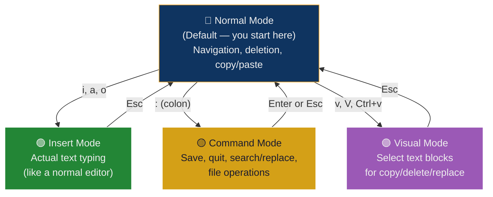
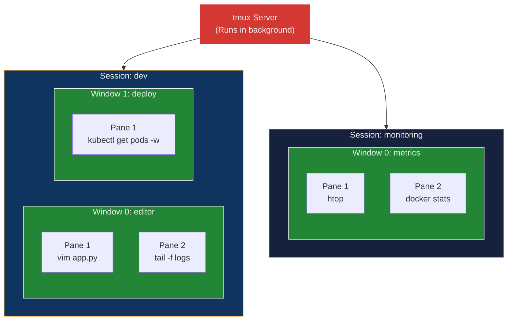

## 🎯 Overview

This lecture covers two **essential terminal tools** that every DevOps/Cloud engineer must know:

- **Vim** — a modal, keyboard-driven text editor available on virtually every Linux system
- **tmux** — a terminal multiplexer that provides persistent sessions, split panes, and multitasking

These are not optional "nice-to-haves" — they are the tools you use when there is **no GUI**, which is the default state on production servers, containers, and VMs.

---

## 🏗️ Real-World Analogy — The Swiss Army Knife & the Workshop Bench

Think of working on a remote server as being a **field mechanic** arriving at a job site:

| Field Mechanic Scenario | Terminal Tool Equivalent |
| :--- | :--- |
| **The Swiss Army Knife** — compact, always in your pocket, handles any quick repair | **Vim** — lightweight, pre-installed everywhere, handles any text editing task |
| **Knowing which blade to flip open** | **Vim modes** — Normal mode for navigating, Insert mode for editing, Command mode for saving |
| **The Workshop Bench** — multiple tools laid out, multiple projects open simultaneously | **tmux** — split panes, multiple windows, all inside one terminal |
| **Leaving tools on the bench overnight and resuming work the next day** | **tmux sessions** — detach, go home, reconnect tomorrow, everything is still running |
| **Without these:** carrying a full toolbox to every site, losing work if you leave | **Without Vim/tmux:** needing GUI editors, losing SSH sessions and running processes |

---

## Part 1 — Vim (Vi Improved)

## What is Vim?

`vim` (Vi Improved) is a powerful, lightweight **terminal-based text editor**. Unlike VS Code, Sublime, or Nano, Vim is **mode-based** — the same keys do different things depending on which mode you're in.

### Why Vim Matters for DevOps

| Reason | Explanation |
| :--- | :--- |
| **Available everywhere** | Pre-installed on almost every Linux server, container, and VM — no installation needed |
| **Works over SSH** | Full editing capabilities on remote servers with no GUI |
| **Keyboard-driven** | No mouse required — extremely fast once muscle memory develops |
| **Lightweight** | Runs in minimal environments — Alpine containers, embedded Linux, rescue shells |
| **Essential for config editing** | Kubernetes YAML, Nginx configs, `.env` files, shell scripts — all edited in-place |

### When You'll Use Vim in Practice

```text
ssh production-server
vim /etc/nginx/nginx.conf        # Fix a reverse proxy config
vim deployment.yaml               # Update a K8s image tag
vim ~/.bashrc                     # Add environment variables
kubectl edit deployment web       # Opens Vim by default
git commit                        # Vim opens for the commit message
```

---

## The Core Concept: Modes

Vim's mode system is the #1 source of confusion for beginners. Here's why it exists and how to think about it:



**The golden rule:** If you're lost, press `Esc` to return to Normal Mode. Always.

| Mode | How to Enter | What It Does | How to Exit |
| :--- | :--- | :--- | :--- |
| **Normal** | `Esc` (from any mode) | Navigate, delete, copy, paste, commands | — (default) |
| **Insert** | `i` (before cursor), `a` (after cursor), `o` (new line below) | Type text like a normal editor | `Esc` |
| **Command** | `:` (from Normal mode) | Save (`:w`), quit (`:q`), search, replace | `Enter` or `Esc` |
| **Visual** | `v` (char), `V` (line), `Ctrl+v` (block) | Select text for operations | `Esc` |

---

## Starting Vim

```bash
vim file.txt
```

If the file doesn't exist, Vim creates it when you save. You start in **Normal Mode**.

---

## Essential Commands — Cheat Sheet

### Navigation (Normal Mode)

| Key | Action |
| :--- | :--- |
| `h` | Move left |
| `j` | Move down |
| `k` | Move up |
| `l` | Move right |
| `w` | Jump forward one word |
| `b` | Jump backward one word |
| `0` | Jump to beginning of line |
| `$` | Jump to end of line |
| `gg` | Jump to top of file |
| `G` | Jump to bottom of file |
| `:42` | Jump to line 42 |

### Entering Insert Mode

| Key | Where Cursor Goes |
| :--- | :--- |
| `i` | Before the cursor (most common) |
| `a` | After the cursor |
| `I` | Beginning of the line |
| `A` | End of the line |
| `o` | New line below |
| `O` | New line above |

### Editing (Normal Mode)

| Key | Action |
| :--- | :--- |
| `dd` | Delete entire line |
| `dw` | Delete word |
| `d$` | Delete from cursor to end of line |
| `yy` | Yank (copy) entire line |
| `yw` | Yank word |
| `p` | Paste below cursor |
| `P` | Paste above cursor |
| `u` | Undo |
| `Ctrl+r` | Redo |
| `.` | Repeat last action |
| `x` | Delete single character |
| `r` | Replace single character |

### Search & Replace (Normal / Command Mode)

| Command | Action |
| :--- | :--- |
| `/word` | Search forward for "word" |
| `?word` | Search backward for "word" |
| `n` | Next match |
| `N` | Previous match |
| `:%s/old/new/g` | Replace all "old" with "new" in entire file |
| `:s/old/new/g` | Replace all in current line |
| `:%s/old/new/gc` | Replace all with confirmation prompt |

### File Operations (Command Mode)

| Command | Action |
| :--- | :--- |
| `:w` | Save (write) |
| `:q` | Quit |
| `:wq` | Save and quit |
| `:q!` | Force quit (discard changes) |
| `:wq!` | Force save and quit |
| `:e filename` | Open another file |
| `:set number` | Show line numbers |
| `:set nonumber` | Hide line numbers |
| `:syntax on` | Enable syntax highlighting |

---

## DevOps Workflow Example

Editing a Kubernetes Deployment YAML on a remote server:

```bash
ssh production-server
vim deployment.yaml
```

```text
1. You land in Normal Mode
2. Press  i         → Enter Insert Mode
3. Edit the image tag: nginx:1.24 → nginx:1.25
4. Press  Esc       → Return to Normal Mode
5. Type   :wq       → Save and quit
6. Run    kubectl apply -f deployment.yaml
```

### Without Vim

```text
❌ No GUI editor on the server
❌ Must download file, edit locally, upload — slow and error-prone
```

### With Vim

```text
✅ Edit directly on the server
✅ Save and apply changes instantly
✅ Works over any SSH connection
```

---

## Advanced Vim — Power User Features

### Multiple Files

```bash
vim file1.yaml file2.yaml    # Open multiple files
```

Switch between them:

| Command | Action |
| :--- | :--- |
| `:n` | Next file |
| `:prev` | Previous file |
| `:ls` | List open buffers |
| `:b2` | Switch to buffer 2 |

### Split Windows

| Command | Action |
| :--- | :--- |
| `:split file.yaml` | Horizontal split |
| `:vsplit file.yaml` | Vertical split |
| `Ctrl+w, w` | Switch between splits |
| `Ctrl+w, q` | Close current split |

### Useful `.vimrc` Settings (Customize Vim)

Create `~/.vimrc` to persist your preferences:

```vim
set number            " Show line numbers
set relativenumber    " Show relative line numbers
set tabstop=2         " Tab = 2 spaces (YAML-friendly)
set shiftwidth=2      " Indent = 2 spaces
set expandtab         " Use spaces instead of tabs
set autoindent        " Auto-indent new lines
syntax on             " Enable syntax highlighting
set hlsearch          " Highlight search results
set incsearch         " Incremental search (search as you type)
set cursorline        " Highlight current line
```

> **Why this matters for DevOps:** YAML files (Kubernetes, Docker Compose, Ansible) are indent-sensitive. Setting `tabstop=2` and `expandtab` prevents the #1 YAML error: mixing tabs and spaces.

### Vim + Kubernetes Integration

```bash
# kubectl edit opens Vim by default
kubectl edit deployment web

# Generate YAML and edit before applying
kubectl create deployment web --image=nginx --dry-run=client -o yaml > deployment.yaml
vim deployment.yaml
kubectl apply -f deployment.yaml
```

---

# Part 2 — tmux (Terminal Multiplexer)

## What is tmux?

`tmux` is a **terminal multiplexer** — it lets you run multiple terminal sessions inside a single terminal window, and those sessions persist even if you disconnect.

### tmux Hierarchy



| Concept | What It Is | Analogy |
| :--- | :--- | :--- |
| **Server** | The tmux process running in the background | The workshop building |
| **Session** | A complete workspace (e.g., "dev", "monitoring") | A project workbench |
| **Window** | A tab inside a session | A drawer in the workbench |
| **Pane** | A split section inside a window | A section of the drawer |

---

## Why tmux Matters for DevOps

### 1. Persistent Sessions (The Killer Feature)

**Without tmux:**

```text
ssh server → start deployment → SSH disconnects → ❌ PROCESS KILLED
```

**With tmux:**

```text
ssh server → tmux → start deployment → SSH disconnects → ✅ PROCESS STILL RUNNING
```

When you reconnect:

```bash
ssh server
tmux attach -t deploy    # Everything is exactly where you left it
```

This is critical for:

- Long-running deployments
- Build processes
- Database migrations
- Log monitoring
- Any process that must not be interrupted

### 2. SSH Session Survival

In cloud environments (AWS, GCP, Azure), SSH connections drop due to:

- Network timeouts
- VPN reconnects
- Laptop sleep/hibernate
- Internet instability

tmux ensures **no work is ever lost** due to a disconnection.

### 3. Terminal Multitasking

Split your terminal into multiple panes to simultaneously:

```text
┌─────────────────────┬─────────────────────┐
│                     │                     │
│  vim deployment.yaml│  kubectl get pods -w│
│                     │                     │
├─────────────────────┤                     │
│                     │                     │
│  docker logs app    │                     │
│                     │                     │
└─────────────────────┴─────────────────────┘
```

---

## Installation

```bash
# Ubuntu / Debian
sudo apt install tmux -y

# macOS (Homebrew)
brew install tmux

# Verify
tmux -V
```

---

## Essential tmux Commands

### The Prefix Key

All tmux keyboard shortcuts start with the **prefix key**: `Ctrl+b`

You press `Ctrl+b`, **release**, then press the command key. It's a two-step process.

### Session Management

| Command | Action |
| :--- | :--- |
| `tmux new -s dev` | Create a new session named "dev" |
| `tmux ls` | List all sessions |
| `tmux attach -t dev` | Reattach to session "dev" |
| `tmux kill-session -t dev` | Kill session "dev" |
| `Ctrl+b`, then `d` | **Detach** from current session (keeps it running) |
| `Ctrl+b`, then `$` | Rename current session |

### Window Management (Tabs)

| Shortcut | Action |
| :--- | :--- |
| `Ctrl+b`, then `c` | Create new window |
| `Ctrl+b`, then `0-9` | Switch to window by number |
| `Ctrl+b`, then `n` | Next window |
| `Ctrl+b`, then `p` | Previous window |
| `Ctrl+b`, then `,` | Rename current window |
| `Ctrl+b`, then `&` | Close current window |

### Pane Management (Splits)

| Shortcut | Action |
| :--- | :--- |
| `Ctrl+b`, then `%` | **Vertical split** (left/right) |
| `Ctrl+b`, then `"` | **Horizontal split** (top/bottom) |
| `Ctrl+b`, then `o` | Cycle through panes |
| `Ctrl+b`, then arrow keys | Move to adjacent pane |
| `Ctrl+b`, then `x` | Close current pane |
| `Ctrl+b`, then `z` | **Zoom** current pane (toggle fullscreen) |
| `Ctrl+b`, then `{` or `}` | Swap pane position |

### Scrolling

| Shortcut | Action |
| :--- | :--- |
| `Ctrl+b`, then `[` | Enter scroll/copy mode |
| Arrow keys or `PgUp/PgDn` | Scroll through output |
| `q` | Exit scroll mode |

---

## DevOps Workflow Example

### Scenario: Running a Long Deployment

```bash
# 1. SSH into the production server
ssh deploy@production-server

# 2. Start a named tmux session
tmux new -s deploy

# 3. Run the deployment
kubectl apply -f deployment.yaml
kubectl rollout status deployment web

# 4. Detach (deployment continues running)
# Press: Ctrl+b, then d

# 5. Go home, close laptop, whatever...

# 6. Next day, reconnect
ssh deploy@production-server
tmux attach -t deploy

# 7. Check the result — everything is still there
```

### Scenario: Multi-Pane Monitoring Setup

```bash
# Create a monitoring session
tmux new -s monitor

# Split into 4 panes:
# Ctrl+b, %    (vertical split)
# Ctrl+b, "    (horizontal split left)
# Ctrl+b, o    (move to right pane)
# Ctrl+b, "    (horizontal split right)

# Pane 1: kubectl get pods -w
# Pane 2: docker logs -f app
# Pane 3: htop
# Pane 4: tail -f /var/log/nginx/access.log
```

---

## Advanced tmux

### Custom Configuration (`.tmux.conf`)

Create `~/.tmux.conf` to customize tmux:

```bash
# Enable mouse support (click panes, resize, scroll)
set -g mouse on

# Set prefix to Ctrl+a (more ergonomic than Ctrl+b)
unbind C-b
set -g prefix C-a
bind C-a send-prefix

# Start window/pane numbering from 1 (not 0)
set -g base-index 1
setw -g pane-base-index 1

# Split panes with | and - (more intuitive)
bind | split-window -h
bind - split-window -v

# Status bar customization
set -g status-style 'bg=#1a1a2e fg=#eee'

# Increase scroll history
set -g history-limit 10000
```

Reload after editing:

```bash
tmux source-file ~/.tmux.conf
```

### tmux + Vim Together

The most common DevOps setup:

```text
tmux session "dev"
├── Window 0: "editor"
│   └── Pane: vim deployment.yaml
├── Window 1: "terminal"
│   ├── Pane 1: kubectl commands
│   └── Pane 2: docker logs -f
└── Window 2: "monitoring"
    └── Pane: htop
```

---

## Vim vs tmux — Understanding the Difference

| | Vim | tmux |
| :--- | :--- | :--- |
| **Purpose** | Edit text | Manage terminal sessions |
| **Core function** | Text editor | Terminal multiplexer |
| **Persistence** | ❌ Closes when terminal closes | ✅ Sessions survive disconnects |
| **Splitting** | Split editor windows (same editor) | Split terminal panes (any command) |
| **Used for** | Editing configs, YAML, scripts | Running multiple commands, monitoring, long tasks |
| **Replaceable by** | nano, VS Code (remote SSH) | screen (older alternative) |
| **Used together?** | ✅ Yes — Vim runs inside tmux panes | ✅ Yes — tmux provides the workspace |

---

## 📚 Key Terminology — Glossary

| Term | Definition |
| :--- | :--- |
| **Vim (Vi Improved)** | A modal, keyboard-driven text editor available on virtually every Unix/Linux system |
| **Modal editor** | An editor where the same keys perform different actions depending on the active mode (Normal, Insert, Command, Visual) |
| **Normal Mode** | Vim's default mode — for navigation, deletion, copying, pasting, and running commands |
| **Insert Mode** | Vim mode for typing text — behaves like a standard editor; entered with `i`, `a`, `o` |
| **Command Mode** | Vim mode for file operations — entered with `:` from Normal mode; used for saving, quitting, search/replace |
| **Visual Mode** | Vim mode for selecting text — entered with `v` (character), `V` (line), or `Ctrl+v` (block) |
| **Yank** | Vim's term for "copy" — `yy` yanks/copies the current line |
| **`.vimrc`** | Vim's configuration file — lives at `~/.vimrc` and persists editor preferences |
| **tmux** | Terminal multiplexer — manages multiple terminal sessions with persistence, splitting, and multitasking |
| **Terminal Multiplexer** | A program that lets you create multiple virtual terminals inside a single physical terminal |
| **tmux Session** | A complete workspace containing one or more windows — persists even when detached |
| **tmux Window** | A tab inside a session — each window has its own command prompt |
| **tmux Pane** | A split section inside a window — allows side-by-side terminal views |
| **Prefix Key** | The key combination (`Ctrl+b` by default) that tells tmux the next keypress is a command, not terminal input |
| **Detach** | Disconnecting from a tmux session without stopping it — processes continue running |
| **Attach** | Reconnecting to a previously detached tmux session — restores the exact state |
| **`.tmux.conf`** | tmux's configuration file — lives at `~/.tmux.conf` and persists customizations |
| **screen** | An older terminal multiplexer (predecessor to tmux) — less feature-rich but still found on many systems |

---

## 🎓 Viva / Interview Preparation

### Q1: Why is Vim essential for DevOps engineers, and how do its modes work?

**Answer:**

Vim is essential because it's **pre-installed on virtually every Linux server** — from production machines to Docker containers to embedded systems. When you SSH into a server, there's no VS Code or Sublime — Vim is your only reliable editing option.

**Vim's mode system:**

1. **Normal Mode** (default) — for navigation and manipulation. Keys like `dd` (delete line), `yy` (copy), and `p` (paste) work here. You move with `h/j/k/l`
2. **Insert Mode** — entered with `i`. Now Vim behaves like a regular editor where typing inserts text
3. **Command Mode** — entered with `:`. Used for file operations: `:w` (save), `:q` (quit), `:%s/old/new/g` (search/replace)
4. **Visual Mode** — entered with `v`. Used for selecting text blocks

**Why modes?** They allow every key to have meaning without modifier combinations. In Normal mode, `d` means "delete" and `w` means "word", so `dw` deletes a word. This composable grammar makes Vim extremely fast once learned — far faster than mouse-based editors for server-side editing.

---

### Q2: What problem does tmux solve for DevOps engineers working with remote servers?

**Answer:**

tmux solves the **SSH session persistence problem**.

**Without tmux:** If you SSH into a server and start a long-running process (deployment, database migration, build), and your SSH connection drops (network timeout, VPN reconnect, laptop sleep), the **process is killed** because it was attached to the SSH session's terminal.

**With tmux:** The process runs inside a tmux session, which is managed by the tmux server — a separate process on the remote machine. When SSH disconnects, the tmux server continues running. When you reconnect:

```bash
tmux attach -t session-name
```

Everything is exactly as you left it — running processes, terminal output, open panes.

**Additional benefits:**

- **Multitasking** — split the terminal into panes (e.g., editor + logs + monitoring)
- **Multiple sessions** — separate workspaces for different projects (e.g., "dev", "staging", "monitoring")
- **Collaboration** — multiple people can attach to the same session for pair programming/debugging

---

### Q3: Describe your workflow using both Vim and tmux to edit a Kubernetes YAML file and run a long deployment on a production server

**Answer:**

```bash
# 1. SSH into the server
ssh deploy@production-server

# 2. Start a named tmux session (so I can reconnect if SSH drops)
tmux new -s deploy

# 3. Split into two panes — editor on the left, monitoring on the right
# Press: Ctrl+b, then %     (vertical split)

# 4. In the left pane, edit the deployment file
vim deployment.yaml
# Press: i                   (Insert Mode)
# Change: image: nginx:1.24 → image: nginx:1.25
# Press: Esc                 (back to Normal Mode)
# Type:  :wq                 (save and quit)

# 5. Apply the change
kubectl apply -f deployment.yaml

# 6. Switch to the right pane
# Press: Ctrl+b, then o      (or arrow key)

# 7. Monitor the rollout
kubectl rollout status deployment web

# 8. Detach the session (deployment continues even if I disconnect)
# Press: Ctrl+b, then d

# 9. Later, reconnect to check the result
ssh deploy@production-server
tmux attach -t deploy
```

**Why this workflow matters:**

- **tmux** ensures the deployment survives SSH disconnections
- **Vim** lets me edit files directly on the server without downloading/uploading
- **Split panes** let me edit and monitor simultaneously
- The named session (`deploy`) makes it easy to reconnect to the right workspace

---

## 🔑 Key Takeaways

1. **Vim is everywhere** — learn at least the basics (`i`, `Esc`, `:wq`, `:q!`) to function on any Linux system
2. **Modes are Vim's superpower** — not a limitation. They make editing composable and fast
3. **tmux prevents lost work** — any long-running process on a remote server should be inside a tmux session
4. **Detach ≠ quit** — `Ctrl+b, d` detaches (keeps running), whereas `exit` terminates the session
5. **Together they're unstoppable** — Vim inside tmux is the standard DevOps workflow for server-side work
6. **Customize both** — `.vimrc` and `.tmux.conf` transform these tools from usable to powerful

---

## 📎 References

- [Vim Official Documentation](https://www.vim.org/docs.php)
- [tmux Getting Started](https://github.com/tmux/tmux/wiki/Getting-Started)
- [Vim Adventures](https://vim-adventures.com/) — gamified Vim learning
- [tmux cheat sheet](https://tmuxcheatsheet.com/)
