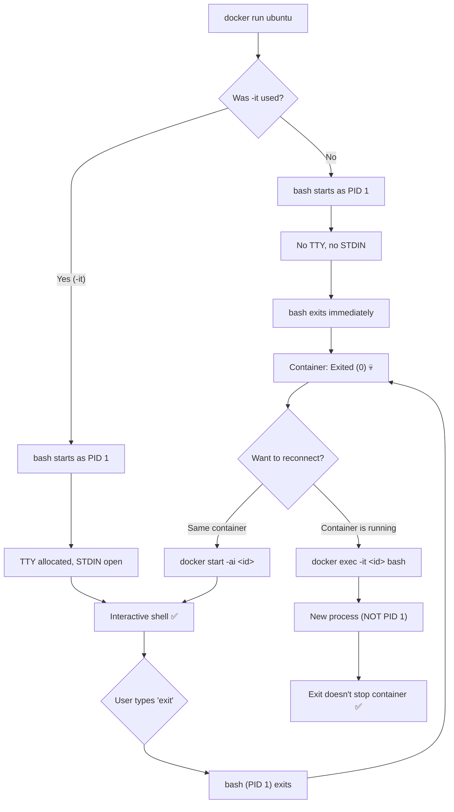

## 📚 Overview

This guide explains one of Docker's most common beginner surprises: **why does `docker run ubuntu` exit immediately?** You'll understand the fundamental rule that governs container lifecycle, learn four methods to interact with containers (running or stopped), and know exactly when to use each.

---

## 🏗️ The Analogy: The Phone Call

Think of a Docker container like a **phone call**:

| Phone Call | Docker Container |
| :--- | :--- |
| You **dial a number** | `docker run ubuntu` — starts a container |
| The other person **picks up** | The main process (PID 1) starts — `/bin/bash` |
| You start talking... but **nobody is listening** | No `-it` flags — no terminal, no keyboard input |
| The other person **hangs up** because there's silence | `bash` has no input → exits immediately → container stops |
| The call shows as **"Missed Call"** in your log | `docker ps -a` shows `Exited (0)` |

### The Four Ways to Fix This

| Fix | Phone Analogy | Docker Command |
| :--- | :--- | :--- |
| **Redial with a microphone + speaker** | Start a new call with proper audio equipment | `docker run -it ubuntu bash` |
| **Call back** the missed caller | Restart the same stopped container | `docker start -ai <id>` |
| **Join an ongoing group call** | Connect to a container already running | `docker exec -it <id> bash` |
| **Send a voice memo** | Run a one-off command and hang up | `docker exec <id> ls /` |

> **Key insight**: A container lives only as long as its **main process (PID 1)** is running. When PID 1 exits, the container stops — instantly, automatically, no exceptions. The flags `-i` (keep STDIN open) and `-t` (allocate a terminal) prevent bash from exiting by giving it something to listen to.

---

## 📐 Container Lifecycle Diagram



---

## 🧪 The Problem: Why Does `docker run ubuntu` Exit?

```bash
docker run ubuntu
```

**What happens:**

1. Docker creates a container from the `ubuntu` image
2. Starts the default command: `/bin/bash`
3. But there's **no terminal** (`-t`) and **no interactive input** (`-i`)
4. `bash` detects there's nothing to read → exits with code 0
5. PID 1 has exited → container immediately stops

**Check the evidence:**

```bash
docker ps -a
```

```text
CONTAINER ID   IMAGE    COMMAND       STATUS
abc123         ubuntu   "/bin/bash"   Exited (0) 5 seconds ago
```

> The container isn't "broken" — it did exactly what it was told to do. `bash` ran, had nothing to process, and exited successfully (code 0).

---

## 🧪 Four Solutions — When to Use Each

### Option 1: `docker run -it` — Create a New Interactive Container

```bash
docker run -it ubuntu /bin/bash
```

| Flag | Purpose |
| :--- | :--- |
| `-i` | **Interactive** — keeps STDIN open (your keyboard is connected) |
| `-t` | **TTY** — allocates a pseudo-terminal (you get a prompt) |
| `/bin/bash` | The command to run (optional — ubuntu's default is already bash) |

**Result:**

```bash
root@abc123:/# _     ← You're inside the container
```

**When you type `exit`:**
* `bash` (PID 1) terminates → container stops
* This is expected behavior

> **Use this when**: You need a fresh container for quick testing, exploration, or learning.

---

### Option 2: `docker start -ai` — Restart a Stopped Container

```bash
docker start -ai <container_id>
```

| Flag | Purpose |
| :--- | :--- |
| `-a` | **Attach** — connect your terminal's output to the container |
| `-i` | **Interactive** — connect your terminal's input to the container |

**Example:**

```bash
docker start -ai abc123
```

**Result:** You're back inside the same container, with all previous changes intact (files you created, packages you installed).

> **Use this when**: You exited a container and want to **resume where you left off** — without losing your work.

> **⚠️ Important**: This only works if the container's main command was an interactive shell. If the container ran a one-off command like `echo hello`, starting it again will just re-run that command and exit.

---

### Option 3: `docker exec -it` — Enter a Running Container

```bash
docker exec -it <container_id> /bin/bash
```

**How it differs from `attach`:**

| Aspect | `docker attach` | `docker exec -it ... bash` |
| :--- | :--- | :--- |
| Connects to | **PID 1** (main process) | **New process** (secondary) |
| Exiting kills container? | ⚠️ Yes (if PID 1 is bash) | ✅ No — only the exec process dies |
| Container must be | Running | Running |
| Use case | Interact with main process | Debug, inspect, run commands safely |

**Result:**

```bash
root@abc123:/# _     ← You're inside, but exiting won't stop the container
```

> **Use this when**: The container is **already running** (e.g., a web server, database) and you need to inspect logs, check files, or debug. This is the **safest and most commonly used** method.

---

### Option 4: `docker exec` (Non-Interactive) — Run a One-Off Command

```bash
docker exec <container_id> cat /etc/os-release
```

* Runs the command inside the running container
* Returns the output
* Does NOT open a shell session

> **Use this when**: You need a quick answer — check a config file, verify a process, read a log.

---

## 📋 Decision Flowchart: Which Method Do I Use?

| Situation | Command |
| :--- | :--- |
| I need a **brand new** container for testing | `docker run -it ubuntu bash` |
| I have a **stopped** container and want to resume | `docker start -ai <id>` |
| I have a **running** container and want to debug | `docker exec -it <id> bash` |
| I want to run a **quick command** in a running container | `docker exec <id> <command>` |
| I need a **background** container that stays running | `docker run -d ubuntu sleep infinity` |

---

## 📋 Quick Cheatsheet

```bash
# List all containers (including stopped)
docker ps -a

# Create a new interactive Ubuntu container
docker run -it ubuntu /bin/bash

# Restart and attach to a stopped container
docker start -ai <container_id>

# Enter a running container (safest)
docker exec -it <container_id> /bin/bash

# Run a one-off command in a running container
docker exec <container_id> cat /etc/hostname

# Keep an Ubuntu container running in the background
docker run -d --name mybox ubuntu sleep infinity

# Then attach to it anytime
docker exec -it mybox bash
```

---

# 📖 Glossary of Key Terms

| Term | Definition |
| :--- | :--- |
| **PID 1** | The first process inside a container. When PID 1 exits, the container stops — this is Docker's fundamental lifecycle rule. In an Ubuntu container, PID 1 is typically `/bin/bash`. |
| **TTY (Pseudo-Terminal)** | A virtual terminal device allocated by the `-t` flag. It provides a command prompt and handles terminal formatting (colors, cursor position, line editing). Without it, interactive programs like `bash` have no way to display a prompt. |
| **STDIN (Standard Input)** | The input stream (your keyboard). The `-i` flag keeps STDIN open so the container can receive your keystrokes. Without it, `bash` has nothing to read and exits. |
| **`docker attach`** | Connects your terminal to a container's PID 1 process. Dangerous for interactive shells because exiting (Ctrl+C or `exit`) kills PID 1, stopping the container. |
| **`docker exec`** | Spawns a **new, secondary process** inside a running container. Exiting this process does NOT affect PID 1 or stop the container. The safest way to interact with running containers. |
| **`docker start -ai`** | Restarts a stopped container and immediately attaches your terminal with interactive input. Combines `docker start` + `docker attach` + `-i` in one command. |
| **Exit Code** | A number returned when a process ends. `0` = success (bash exited normally). Non-zero = error (e.g., `137` = killed by SIGKILL, `1` = general error). Visible in `docker ps -a` under STATUS. |
| **Foreground Process** | A process that occupies the terminal and receives input. Containers need at least one foreground process to stay alive. Running `bash` without `-it` has no foreground — so it exits. |

---

# 🎓 Exam & Interview Preparation

## Potential Interview Questions

### Q1: "Why does `docker run ubuntu` exit immediately, and how do you fix it?"

**Model Answer**: The Ubuntu image's default command is `/bin/bash`. When Docker starts `bash` without the `-i` (interactive) and `-t` (TTY) flags, bash detects there's no terminal attached and no input stream — so it exits immediately with code 0. Since bash IS the container's PID 1 (the main process), its exit stops the entire container. Fix it with `docker run -it ubuntu bash`: `-i` keeps STDIN open so bash can read your input, and `-t` allocates a pseudo-terminal so bash can display a prompt. For containers that should stay running in the background without interaction, use `docker run -d ubuntu sleep infinity`, which keeps a foreground process alive indefinitely.

---

### Q2: "What is the difference between `docker attach` and `docker exec`? When would you use each?"

**Model Answer**: `docker attach` connects your terminal to the container's **PID 1 process** — the main process started when the container launched. If PID 1 is `bash` and you type `exit`, you terminate PID 1, which stops the container. `docker exec` spawns a **new, secondary process** inside the container — exiting it does NOT affect PID 1 or the container's lifecycle. In practice, `docker exec -it <container> bash` is almost always preferred because it's non-destructive: you can enter and leave the container without affecting its operation. Use `docker attach` only when you specifically need to interact with PID 1's I/O (rare) or to view the main process's output stream. If you must use attach, detach safely with `Ctrl+P, Ctrl+Q` instead of `exit`.

---

### Q3: "How do you recover work from a stopped container without losing data?"

**Model Answer**: A stopped container's filesystem is still intact — files you created, packages you installed, configuration changes are all preserved until the container is explicitly removed with `docker rm`. To re-enter a stopped container: `docker start -ai <container_id>`, which restarts the container and attaches interactively. If you need to **permanently preserve** changes, either: (1) `docker commit <container> <image_name>` to snapshot the filesystem into a reusable image, or (2) `docker cp <container>:/path/to/file ./local_path` to extract specific files without starting the container. The lesson is: `Exited` ≠ deleted. The data exists until you explicitly destroy it with `docker rm` or `docker system prune`.

---

**Student**: Pranav R Nair | **Batch**: 2(CCVT) | **SAP ID**: 500121466
