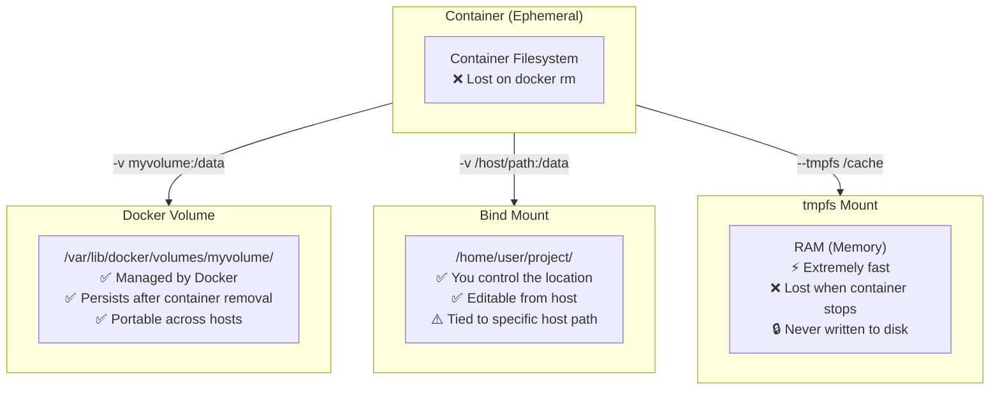
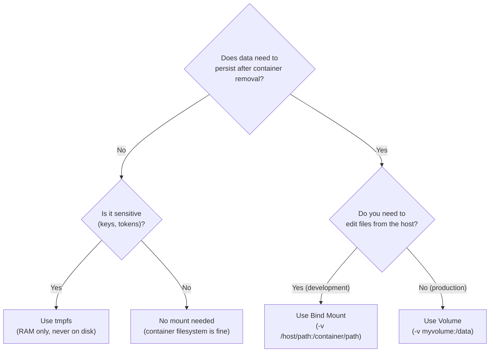

## 📚 Overview

Containers are **ephemeral** — when removed, everything inside vanishes. This guide covers Docker's three storage mechanisms to solve this: **Volumes** (Docker-managed persistent storage), **Bind Mounts** (host-controlled directory mapping), and **tmpfs** (RAM-only temporary storage). You'll understand when to use each, the syntax differences between `-v` and `--mount`, and how to prove data persistence through hands-on labs.

---

## 🏗️ The Analogy: Hotel Room Storage

Imagine you're staying at a **hotel** (your container):

| Hotel Scenario | Docker Storage |
| :--- | :--- |
| Things in your hotel room | Data inside the container's filesystem |
| You check out → housekeeping clears everything | `docker rm` → all container data is lost |
| **Hotel safe** (managed by the hotel, survives check-out) | **Volume** — Docker-managed, persists after container removal |
| **Your suitcase from home** (you brought it, you control it) | **Bind Mount** — host directory mapped into the container |
| **Sticky notes** (written in the room, thrown away at checkout) | **tmpfs** — RAM storage, vanishes when container stops |

### Why Each Matters

| Storage | Hotel Analogy | Real Docker Use Case |
| :--- | :--- | :--- |
| **Volume** | Hotel safe — hotel manages it, contents survive between stays | Database files (MySQL, PostgreSQL) in production |
| **Bind Mount** | Your suitcase — you control it, take it anywhere | Source code during development (edit locally, see changes instantly) |
| **tmpfs** | Sticky note — fast to write, guaranteed destroyed at checkout | Encryption keys, session tokens, temporary cache |

> **Key insight**: Without any of these, containers are like hotel rooms — everything you leave behind is destroyed when housekeeping comes. Volumes are the hotel safe that the hotel promises to protect. Bind mounts are your own suitcase. tmpfs is a sticky note that self-destructs.

---

## 📐 Architecture Diagram: Where Data Lives



---

## 📐 Decision Flowchart: Which Storage Do I Use?



---

# Part I: Docker Volumes (Production Storage)

## What Is a Volume?

A volume is a **Docker-managed** storage directory located at:

```text
/var/lib/docker/volumes/<volume_name>/_data/
```

Docker controls its lifecycle. You interact with it by **name**, not by path.

## Commands

### Create a Volume

```bash
docker volume create myvolume
```

### List All Volumes

```bash
docker volume ls
```

### Inspect a Volume (see metadata)

```bash
docker volume inspect myvolume
```

**Output shows**: mountpoint, driver, creation date, labels.

### Remove a Volume

```bash
docker volume rm myvolume
```

### Remove All Unused Volumes

```bash
docker volume prune
```

> **⚠️ Warning**: `docker volume prune` deletes ALL volumes not currently attached to a container. Double-check before running in production.

---

## Using Volumes with Containers

### `-v` Syntax (Short)

```bash
docker run -d \
  --name mysql-container \
  -e MYSQL_ROOT_PASSWORD=secret \
  -v dbdata:/var/lib/mysql \
  mysql
```

| Part | Purpose |
| :--- | :--- |
| `dbdata` | Volume name (auto-created if it doesn't exist) |
| `/var/lib/mysql` | Path inside the container where MySQL stores data |

### `--mount` Syntax (Modern, Recommended)

```bash
docker run -d \
  --name mysql-container \
  -e MYSQL_ROOT_PASSWORD=secret \
  --mount source=dbdata,target=/var/lib/mysql \
  mysql
```

> **Which syntax to use?** `--mount` is more explicit and readable. It separates `type`, `source`, and `target` clearly. Docker documentation recommends `--mount` for new projects.

---

## 🧪 Hands-On Lab: Proving Volume Persistence

**Step 1**: Create a volume and write data

```bash
docker run -it --rm -v testvol:/home/app ubuntu bash
# Inside: create a file
echo "sapid=500121466" >> /home/app/sapid.txt
cat /home/app/sapid.txt
exit
```

The container is deleted (`--rm`), but the volume persists.

**Step 2**: Start a NEW container with the same volume

```bash
docker run -it --rm -v testvol:/home/app ubuntu bash
cat /home/app/sapid.txt
```

**Output**: `sapid=500121466` — **data survived container destruction**.

> **Proof**: Docker volumes are independent of container lifecycle. The volume exists until you explicitly `docker volume rm` it.

---

# Part II: Bind Mounts (Development Storage)

## What Is a Bind Mount?

A bind mount maps a **specific host directory** into the container. The **host controls** the data — you decide where files live.

## Using Bind Mounts

### `-v` Syntax

```bash
docker run -d \
  --name nginx-dev \
  -p 8080:80 \
  -v $(pwd)/website:/usr/share/nginx/html \
  nginx
```

### `--mount` Syntax

```bash
docker run -d \
  --name nginx-dev \
  -p 8080:80 \
  --mount type=bind,source=$(pwd)/website,target=/usr/share/nginx/html \
  nginx
```

> **Windows PowerShell**: Use `${PWD}` instead of `$(pwd)`.

**Result**: Edit `website/index.html` on your host → changes appear in the container instantly. No rebuild, no restart.

### Read-Only Bind Mount

```bash
# --mount syntax
docker run --mount type=bind,source=$(pwd)/config,target=/etc/app/config,readonly nginx

# -v syntax
docker run -v $(pwd)/config:/etc/app/config:ro nginx
```

* `:ro` or `readonly` prevents the container from writing to the mounted directory
* Perfect for configuration files that shouldn't be modified at runtime

---

## 🧪 Hands-On Lab: Bind Mount Live Editing

**Step 1**: Create a project folder and run NGINX

```bash
mkdir website
echo "<h1>Version 1</h1>" > website/index.html
docker run -d --name web -p 8080:80 -v $(pwd)/website:/usr/share/nginx/html nginx
```

**Step 2**: Open `http://localhost:8080` — you see "Version 1"

**Step 3**: Edit the file on your host (no Docker commands needed)

```bash
echo "<h1>Version 2 - Live!</h1>" > website/index.html
```

**Step 4**: Refresh the browser — you see "Version 2 - Live!" instantly.

> **This is why developers love bind mounts**: Your editor, your files, your host — Docker just serves them.

---

## Docker Compose with Bind Mounts

```yaml
services:
  web:
    image: nginx
    ports:
      - "8080:80"
    volumes:
      - ./website:/usr/share/nginx/html
```

---

# Part III: tmpfs Mounts (RAM-Only Storage)

## What Is tmpfs?

tmpfs stores data **in RAM only**. It is:

* ⚡ **Extremely fast** (no disk I/O)
* 🔒 **Secure** (never written to disk — can't be recovered after stop)
* ❌ **Non-persistent** (vanishes when the container stops)

## Using tmpfs

### `--mount` Syntax

```bash
docker run -d \
  --name secure-app \
  --mount type=tmpfs,target=/app/cache \
  nginx
```

### `--tmpfs` Shorthand

```bash
docker run -d \
  --name secure-app \
  --tmpfs /app/cache \
  nginx
```

---

## 🧪 Hands-On Lab: Proving tmpfs Doesn't Persist

**Step 1**: Write data to tmpfs

```bash
docker run -it --rm --mount type=tmpfs,target=/app/temp ubuntu bash
echo "temporary secret" >> /app/temp/file.txt
cat /app/temp/file.txt      # Output: "temporary secret"
exit
```

**Step 2**: Start a new container with the same tmpfs path

```bash
docker run -it --rm --mount type=tmpfs,target=/app/temp ubuntu bash
cat /app/temp/file.txt       # Output: "No such file or directory"
```

> **Proof**: tmpfs data is gone. It was only in RAM and was destroyed the moment the container stopped.

---

## Use Cases for tmpfs

| Scenario | Why tmpfs? |
| :--- | :--- |
| Encryption keys during processing | Never written to disk — can't be recovered by forensic analysis |
| Session tokens | Automatically destroyed when container stops — no cleanup needed |
| Application cache (Redis-like) | RAM speed without a separate cache server |
| Build artifacts during CI/CD | Fast writes, automatically cleaned up |

---

# Part IV: Complete Comparison

## Mount Types at a Glance

| Feature | Volume | Bind Mount | tmpfs |
| :--- | :--- | :--- | :--- |
| **Managed by** | Docker | Host OS | Kernel (RAM) |
| **Storage location** | `/var/lib/docker/volumes/` | Any host directory | RAM (memory) |
| **Persists after `docker rm`** | ✅ Yes | ✅ Yes (on host) | ❌ No |
| **Persists after Docker restart** | ✅ Yes | ✅ Yes | ❌ No |
| **Editable from host** | ⚠️ Not easily | ✅ Yes | ❌ No |
| **Performance** | Good (disk) | Good (disk) | ⚡ Very fast (RAM) |
| **Portable across hosts** | ✅ Yes (by name) | ❌ No (path-dependent) | N/A |
| **Production safe** | ✅ Recommended | ⚠️ Use carefully | ⚠️ Limited use |
| **Development friendly** | ⚠️ Moderate | ✅ Excellent | ❌ Not useful |
| **Risk of host overwrite** | ❌ No | ⚠️ Yes | ❌ No |
| **Backup friendly** | ✅ Yes | Depends on host | Not needed |

## Syntax Comparison

| Type | `--mount` (Recommended) | `-v` (Short) |
| :--- | :--- | :--- |
| Volume | `--mount source=vol,target=/data` | `-v vol:/data` |
| Bind | `--mount type=bind,source=/host,target=/data` | `-v /host:/data` |
| tmpfs | `--mount type=tmpfs,target=/data` | `--tmpfs /data` |
| Read-only | Add `,readonly` | Add `:ro` |

## `-v` vs `--mount`: Key Differences

| Aspect | `-v` | `--mount` |
| :--- | :--- | :--- |
| **Readability** | Compact | Explicit and clear |
| **Type specification** | Implicit (guesses from path format) | Explicit (`type=bind` / `type=volume`) |
| **Missing host path** | Auto-creates directory (silent) | **Fails with error** (safer) |
| **Docker recommendation** | Legacy, still works | ✅ Recommended for new projects |

> **Important**: If the host path doesn't exist, `-v` silently creates an empty directory — this can mask bugs. `--mount` fails immediately, making errors visible.

---

## 📋 Quick Rule to Remember

```text
Volume  = Persistent + Safe + Production     (hotel safe)
Bind    = Host Controlled + Development       (your suitcase)
tmpfs   = Temporary + Fast + Memory Only      (sticky note)
```

---

# 📖 Glossary of Key Terms

| Term | Definition |
| :--- | :--- |
| **Volume** | A Docker-managed storage unit, independent of any container. Stored at `/var/lib/docker/volumes/`. Survives container removal and Docker restarts. The recommended storage for production data. |
| **Bind Mount** | A direct mapping of a specific host filesystem directory into a container. The host controls the data location and lifecycle. Ideal for development (live code editing). |
| **tmpfs Mount** | A mount that stores data in the host's **RAM only**. Data is never written to disk and is destroyed when the container stops. Used for sensitive temporary data. |
| **Ephemeral** | Temporary by nature. Containers are ephemeral — their filesystem changes are lost when the container is removed. This is Docker's default behavior. |
| **`-v` Flag** | The short syntax for mounting volumes and bind mounts: `-v name:/path` (volume) or `-v /host:/container` (bind). Docker guesses the type from the format. |
| **`--mount` Flag** | The modern, explicit syntax for all mount types. Uses key-value pairs: `type=`, `source=`, `target=`, `readonly`. Recommended because it's unambiguous and fails clearly on errors. |
| **Mountpoint** | The directory inside the container where external storage is attached (e.g., `/var/lib/mysql`). Also refers to the host-side storage location shown by `docker volume inspect`. |
| **`docker volume prune`** | Removes all volumes not currently attached to any container. Dangerous in production — always verify before running. |
| **Read-Only Mount** | A mount where the container can **read** but not **write** to the attached directory. Specified with `:ro` (`-v`) or `,readonly` (`--mount`). Used for config files. |
| **Container Filesystem (Union FS)** | The layered, copy-on-write filesystem inside a container. Changes are stored in a thin writable layer that is discarded on `docker rm`. This is why external storage is needed. |

---

# 🎓 Exam & Interview Preparation

## Potential Interview Questions

### Q1: "What are the three types of Docker storage, and when would you use each?"

**Model Answer**: Docker provides **Volumes**, **Bind Mounts**, and **tmpfs Mounts**. **Volumes** are Docker-managed storage at `/var/lib/docker/volumes/` — use them for production data (databases, uploads) because they're portable, backup-friendly, and independent of host directory structure. **Bind Mounts** map a specific host directory into the container — use them for development so you can edit source code on the host and see changes instantly inside the container without rebuilding. **tmpfs Mounts** store data in RAM only — use them for sensitive temporary data (encryption keys, session tokens) that should never be written to disk and must be automatically destroyed when the container stops.

---

### Q2: "What is the difference between `-v` and `--mount` syntax? Why does Docker recommend `--mount`?"

**Model Answer**: Both achieve the same result, but `--mount` is more explicit and safer. `-v` uses a compact format (`-v source:target:options`) where Docker **guesses** the mount type — if the source looks like a path, it's a bind mount; if it's a name, it's a volume. `--mount` requires explicit `type=volume` or `type=bind`, making intent clear. The critical safety difference: if a host path doesn't exist, `-v` **silently creates an empty directory** (which can mask bugs and lead to containers running with missing data), while `--mount` **fails immediately with an error**. Docker recommends `--mount` for new projects because it's explicit, readable, and catches configuration errors at startup rather than at runtime.

---

### Q3: "You have a MySQL container in production. The container crashes and is removed. How do you ensure the database survives?"

**Model Answer**: Use a **named Docker volume** mounted to MySQL's data directory. Create it with `docker volume create mysql_data`, then run MySQL with `-v mysql_data:/var/lib/mysql`. When the container crashes and is removed, the volume persists independently — it's stored at `/var/lib/docker/volumes/mysql_data/` on the host. Start a new MySQL container with the same volume mount, and all data is immediately available. To verify this works, I would: (1) insert test data, (2) `docker rm -f` the container, (3) start a new container with the same volume, (4) query the data to confirm persistence. Do NOT use a bind mount for production databases because it ties the data to a specific host path and is less portable. Do NOT rely on the container filesystem — it's ephemeral and destroyed on `docker rm`.

---

**Student**: Pranav R Nair | **Batch**: 2(CCVT) | **SAP ID**: 500121466
