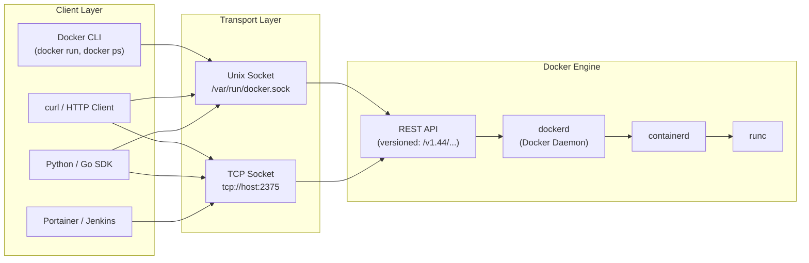

## 📚 Overview

This guide reveals what happens **under the hood** when you type `docker run` or `docker ps`. The Docker CLI is just a client — it sends HTTP requests to the **Docker Engine API**, a full REST API running on your machine. You'll learn to interact with Docker directly via `curl`, understanding the same protocol that powers CI/CD tools, Portainer, Kubernetes, and every Docker SDK.

---

## 🏗️ The Analogy: The Restaurant Kitchen

Think of Docker like a **restaurant**:

| Restaurant | Docker |
| :--- | :--- |
| **Waiter** (takes your order, brings food) | **Docker CLI** (`docker run`, `docker ps`) |
| **Kitchen ticket system** (written order format) | **Docker Engine API** (REST API — HTTP requests) |
| **Head Chef** (reads tickets, cooks food) | **Docker Daemon** (`dockerd` — executes commands) |
| **Kitchen door** (how waiters pass tickets) | **Unix Socket** (`/var/run/docker.sock`) |
| **Delivery window** (for external couriers) | **TCP Socket** (`tcp://0.0.0.0:2375`) |

When you type `docker ps`, here's what actually happens:

```text
You → "Show me running containers"
        ↓
Waiter (docker CLI) writes a ticket
        ↓
Ticket: GET /containers/json
        ↓
Passes it through the kitchen door (Unix socket)
        ↓
Head Chef (dockerd) reads the ticket, checks containers
        ↓
Returns the answer (JSON) back through the door
```

> **Key insight**: The waiter (CLI) is convenient, but you can also walk up to the kitchen door yourself and pass tickets directly (`curl`). The chef doesn't care who wrote the ticket — it just reads the format.

---

## 📐 Architecture Diagram: CLI vs API



---

## 🧪 Part 1: Verify the API Is Accessible

### Check the Socket Exists

```bash
ls -l /var/run/docker.sock
```

**Expected output:**

```text
srw-rw---- 1 root docker 0 docker.sock
```

* `s` = socket file (not a regular file)
* `rw-rw----` = readable/writable by root and `docker` group

### Ping the API

```bash
curl --unix-socket /var/run/docker.sock http://localhost/_ping
```

**Expected output:** `OK`

If this works, your Docker API is accessible and the daemon is running.

### Check API Version

```bash
curl --unix-socket /var/run/docker.sock http://localhost/version
```

**Expected output (excerpt):**

```json
{
  "Version": "25.0.3",
  "ApiVersion": "1.44"
}
```

> We'll use `/v1.44/` in all subsequent API calls to ensure compatibility.

---

## 🧪 Part 2: Container Operations via API

### Every `curl` command below mirrors a Docker CLI command. The pattern is always

```text
curl --unix-socket /var/run/docker.sock [METHOD] http://localhost/v1.44/[ENDPOINT]
```

### List Containers (`docker ps`)

```bash
# Running containers only (docker ps)
curl --unix-socket /var/run/docker.sock \
  http://localhost/v1.44/containers/json

# All containers including stopped (docker ps -a)
curl --unix-socket /var/run/docker.sock \
  "http://localhost/v1.44/containers/json?all=true"
```

### Pull an Image (`docker pull`)

```bash
curl --unix-socket /var/run/docker.sock \
  -X POST \
  "http://localhost/v1.44/images/create?fromImage=nginx&tag=latest"
```

| Part | Purpose |
| :--- | :--- |
| `-X POST` | Pull is a write operation (creates local image) |
| `fromImage=nginx` | Image name on Docker Hub |
| `tag=latest` | Version tag |

### Create a Container (`docker create`)

```bash
curl --unix-socket /var/run/docker.sock \
  -X POST \
  -H "Content-Type: application/json" \
  http://localhost/v1.44/containers/create?name=mynginx \
  -d '{
    "Image": "nginx",
    "ExposedPorts": {
      "80/tcp": {}
    },
    "HostConfig": {
      "PortBindings": {
        "80/tcp": [
          { "HostPort": "8080" }
        ]
      }
    }
  }'
```

**Response:** JSON with the container ID.

> **Deep Dive**: Notice that port mapping requires **two** places: `ExposedPorts` (metadata) and `HostConfig.PortBindings` (actual mapping). This separates documentation from configuration — a REST API design principle.

### Start / Stop / Restart

```bash
# Start (docker start mynginx)
curl --unix-socket /var/run/docker.sock \
  -X POST http://localhost/v1.44/containers/mynginx/start

# Stop (docker stop mynginx)
curl --unix-socket /var/run/docker.sock \
  -X POST http://localhost/v1.44/containers/mynginx/stop

# Restart (docker restart mynginx)
curl --unix-socket /var/run/docker.sock \
  -X POST http://localhost/v1.44/containers/mynginx/restart
```

### Inspect a Container (`docker inspect`)

```bash
curl --unix-socket /var/run/docker.sock \
  http://localhost/v1.44/containers/mynginx/json
```

Returns: IP address, mounts, environment variables, resource limits — everything.

### View Logs (`docker logs`)

```bash
# Standard logs
curl --unix-socket /var/run/docker.sock \
  "http://localhost/v1.44/containers/mynginx/logs?stdout=true&stderr=true"

# Follow logs (streaming)
curl --unix-socket /var/run/docker.sock \
  "http://localhost/v1.44/containers/mynginx/logs?follow=true&stdout=true"
```

### Execute a Command (`docker exec`) — Two-Step Process

Unlike simple operations, exec requires **two API calls**:

**Step 1: Create the exec instance**

```bash
curl --unix-socket /var/run/docker.sock \
  -X POST \
  -H "Content-Type: application/json" \
  http://localhost/v1.44/containers/mynginx/exec \
  -d '{
    "Cmd": ["ls", "/usr/share/nginx/html"],
    "AttachStdout": true,
    "AttachStderr": true
  }'
```

**Response:** `{ "Id": "exec_id_here" }`

**Step 2: Start the exec instance**

```bash
curl --unix-socket /var/run/docker.sock \
  -X POST \
  -H "Content-Type: application/json" \
  http://localhost/v1.44/exec/exec_id_here/start \
  -d '{ "Detach": false, "Tty": false }'
```

> **Why two steps?** Separation of concerns: Step 1 defines *what* to run, Step 2 executes it. This allows tools to create exec instances in advance or reuse configurations.

### Remove a Container (`docker rm`)

```bash
# Remove stopped container
curl --unix-socket /var/run/docker.sock \
  -X DELETE http://localhost/v1.44/containers/mynginx

# Force remove running container (docker rm -f)
curl --unix-socket /var/run/docker.sock \
  -X DELETE "http://localhost/v1.44/containers/mynginx?force=true"
```

---

## 🧪 Part 3: Image & System Operations

### List Images (`docker images`)

```bash
curl --unix-socket /var/run/docker.sock \
  http://localhost/v1.44/images/json
```

### Remove an Image (`docker rmi`)

```bash
curl --unix-socket /var/run/docker.sock \
  -X DELETE http://localhost/v1.44/images/nginx
```

### System Info (`docker info`)

```bash
curl --unix-socket /var/run/docker.sock \
  http://localhost/v1.44/info
```

### Container Stats (`docker stats`)

```bash
curl --unix-socket /var/run/docker.sock \
  "http://localhost/v1.44/containers/mynginx/stats?stream=false"
```

> `stream=false` returns a single snapshot. Without it, the API streams JSON frames continuously.

---

## 📋 CLI-to-API Mapping Cheatsheet

| Docker CLI | HTTP Method | API Endpoint |
| :--- | :--- | :--- |
| `docker ps` | `GET` | `/containers/json` |
| `docker ps -a` | `GET` | `/containers/json?all=true` |
| `docker pull nginx` | `POST` | `/images/create?fromImage=nginx` |
| `docker create` | `POST` | `/containers/create` |
| `docker start X` | `POST` | `/containers/X/start` |
| `docker stop X` | `POST` | `/containers/X/stop` |
| `docker restart X` | `POST` | `/containers/X/restart` |
| `docker inspect X` | `GET` | `/containers/X/json` |
| `docker logs X` | `GET` | `/containers/X/logs?stdout=true` |
| `docker exec X` | `POST` | `/containers/X/exec` (then `/exec/ID/start`) |
| `docker rm X` | `DELETE` | `/containers/X` |
| `docker rm -f X` | `DELETE` | `/containers/X?force=true` |
| `docker images` | `GET` | `/images/json` |
| `docker rmi X` | `DELETE` | `/images/X` |
| `docker info` | `GET` | `/info` |
| `docker stats X` | `GET` | `/containers/X/stats` |
| `docker version` | `GET` | `/version` |

---

## 🧪 Part 4: Real-World Use Cases

Understanding the API matters because **every tool you use in production talks to this API**:

| Tool | How It Uses Docker API |
| :--- | :--- |
| **Docker CLI** | Default client — sends API calls over Unix socket |
| **Portainer** | Web UI that reads/writes containers via the API |
| **Jenkins** | Spins up build containers via API plugins |
| **GitHub Actions** | Docker actions create containers using API SDKs |
| **Kubernetes** | kubelet talks to containerd (evolved from Docker API) |
| **Custom dashboards** | Go/Python apps using Docker SDKs |

---

## ⚠️ Security: The Docker Socket Is Root-Equivalent

```bash
/var/run/docker.sock
```

Anyone with access to this socket can:

* Start **privileged containers** with access to the host
* **Mount the host filesystem** (`-v /:/host`)
* **Read any file** on the host (SSH keys, passwords, databases)
* **Escalate to full root** on the host machine

> **Rule**: Never expose `/var/run/docker.sock` to untrusted processes. Never mount it into containers unless absolutely necessary (and even then, use read-only).

---

## 🧪 Practice Tasks

### Task 1: List Running Containers

Use the API to list only running containers. **Hint**: `GET /containers/json` (default excludes stopped).

### Task 2: Create a Sleep Container

Create an Ubuntu container that runs `sleep 300` using the API. **Hint**: Use `"Cmd": ["sleep", "300"]` in the JSON body.

### Task 3: Fetch Stopped Container Logs

Stop a container, then fetch its logs via API. **Hint**: Logs persist after stop — use `stdout=true`.

### Task 4: Mini Dashboard Script

Write a `curl` script that lists all containers and prints name + state. **Hint**: Parse JSON from `/containers/json?all=true`.

---

# 📖 Glossary of Key Terms

| Term | Definition |
| :--- | :--- |
| **Docker Engine API** | A RESTful HTTP API exposed by the Docker daemon. Every Docker CLI command translates to an API call. It's versioned (e.g., `/v1.44/`) for backward compatibility. |
| **REST API** | Representational State Transfer — an architectural style for web APIs using HTTP methods (GET, POST, PUT, DELETE) to operate on resources identified by URLs. |
| **Unix Socket** | A mechanism for inter-process communication (IPC) on the same machine, using a file path (`/var/run/docker.sock`) instead of network ports. Faster and more secure than TCP. |
| **`dockerd`** | The Docker daemon — a long-running background process that manages containers, images, networks, and volumes. It listens for API requests on the Unix socket or TCP port. |
| **containerd** | A lower-level container runtime managed by `dockerd`. It handles image pulls, container lifecycle, and storage. Kubernetes can use containerd directly, bypassing Docker. |
| **runc** | The lowest-level OCI-compliant container runtime. It creates the actual Linux namespaces and cgroups for container isolation. Called by containerd. |
| **Build Context** | (Not directly API-related, but relevant) The directory sent to the daemon during `docker build`. For API builds, this is sent as a tar archive to `/build`. |
| **API Versioning** | Docker's strategy for backward compatibility. Clients specify the API version in the URL path (e.g., `/v1.44/`). Older clients continue working against newer daemons. |

---

# 🎓 Exam & Interview Preparation

## Potential Interview Questions

### Q1: "What happens under the hood when you run `docker ps`?"

**Model Answer**: `docker ps` is a CLI command that sends an HTTP **GET** request to the Docker Engine API endpoint `/containers/json` via the Unix socket at `/var/run/docker.sock`. The Docker daemon (`dockerd`) receives this request, queries its internal state for running containers, and returns a JSON response. The CLI then formats this JSON into the familiar table output. This means Docker is a **client-server architecture** — the CLI is just one possible client. You could achieve the same result with `curl --unix-socket /var/run/docker.sock http://localhost/containers/json`. This is why tools like Portainer, Jenkins, and Kubernetes can control Docker without using the CLI.

---

### Q2: "Why is `docker exec` a two-step process in the API?"

**Model Answer**: The API splits exec into **create** (`POST /containers/{id}/exec`) and **start** (`POST /exec/{id}/start`) for separation of concerns. The create step defines *what* to execute (command, environment, attach settings) and returns an exec instance ID. The start step actually runs it. This design allows: (1) creating exec instances in advance for scheduling, (2) inspecting an exec definition before running it, (3) reusing exec configurations, and (4) separating authorization (who can create execs vs who can start them). The CLI hides this complexity — `docker exec` does both steps in one command.

---

### Q3: "Why is access to `/var/run/docker.sock` considered root-equivalent?"

**Model Answer**: The Docker socket provides unrestricted access to the Docker Engine API, which can manage the entire host system. An attacker with socket access can: (1) create a **privileged container** with `--privileged` flag, gaining access to all host devices, (2) **mount the host root filesystem** (`-v /:/host`) and read/write any file including `/etc/shadow` and SSH keys, (3) start containers in the **host's network namespace** to sniff traffic, (4) escape the container entirely using kernel exploits from a privileged context. This is why the socket has restrictive permissions (`srw-rw----`, owner root, group docker) and why adding a user to the `docker` group is effectively granting them root access.

---

**Student**: Pranav R Nair | **Batch**: 2(CCVT) | **SAP ID**: 500121466
