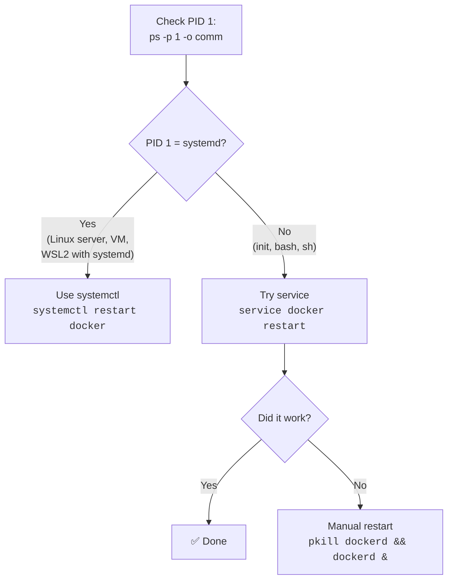

## 📚 Overview

This guide covers the **advanced and operational** side of the Docker Engine API: how to expose it over the network for remote access, how to secure it with TLS, and the critical cross-platform differences between Linux, WSL, Windows, and macOS. It also explains the frequently confusing topic of **restarting Docker on different systems** (systemctl vs service vs pkill).

---

## 🏗️ The Analogy: The Kitchen Door vs The Delivery Window

Continuing from Part A (where Docker API = restaurant kitchen):

| Scenario | Docker Equivalent |
| :--- | :--- |
| **Kitchen door** (waiters walk through it) | **Unix socket** — only processes on the same machine can access it |
| **Delivery window** (opens to the street) | **TCP socket** — anyone on the network can reach it |
| Delivery window **without a lock** | `tcp://0.0.0.0:2375` — no TLS, no authentication |
| Delivery window **with an ID check + lock** | `tcp://0.0.0.0:2376` — TLS + certificate verification |
| **Kitchen in the basement** (customers can't even see it) | Docker Desktop on Windows/macOS — daemon runs inside a hidden VM |
| **Intercom** to the basement kitchen | Named Pipe (Windows) or proxy socket (macOS) |

> **Key insight**: The Unix socket (kitchen door) is inherently safe — only people already in the building can use it. The TCP socket (delivery window) is convenient for remote access but **extremely dangerous** without locks (TLS). Docker Desktop hides the kitchen entirely (inside a VM) and provides an intercom instead.

---

## 📐 Cross-Platform Architecture Diagram

```mermaid
flowchart TB
    subgraph Linux["Linux / WSL2"]
        LC["docker CLI / curl"]
        LS["Unix Socket<br/>/var/run/docker.sock"]
        LD["dockerd (native)"]
        LC --> LS --> LD
    end

    subgraph Windows["Windows Docker Desktop"]
        WC["docker.exe"]
        WP["Named Pipe<br/>//./pipe/docker_engine"]
        WV["LinuxKit VM (hidden)"]
        WD["dockerd (inside VM)"]
        WC --> WP --> WV --> WD
    end

    subgraph macOS["macOS Docker Desktop"]
        MC["docker CLI"]
        MS["Proxy Socket<br/>~/Library/.../docker.sock"]
        MV["LinuxKit VM (hidden)"]
        MD["dockerd (inside VM)"]
        MC --> MS --> MV --> MD
    end

    subgraph Remote["Remote Access (any OS)"]
        RC["curl / SDK / Portainer"]
        RT["TCP: 2375 (no TLS) ⚠️<br/>TCP: 2376 (TLS) ✅"]
        RD["dockerd"]
        RC --> RT --> RD
    end
```



---

## 🧪 Part 1: Where the Docker API Lives on Each Platform

| Platform | Default API Endpoint | Protocol | Daemon Location |
| :--- | :--- | :--- | :--- |
| **Linux** | `/var/run/docker.sock` | Unix socket | Native on host |
| **WSL2** | `/var/run/docker.sock` | Unix socket | Shared with Docker Desktop or native |
| **Windows** | `npipe:////./pipe/docker_engine` | Named Pipe | Inside LinuxKit VM |
| **macOS** | `~/Library/Containers/com.docker.docker/Data/docker.sock` | Unix socket (proxy) | Inside LinuxKit VM |

### Verify Your Endpoint

```bash
docker context ls
docker context inspect default
```

**Example output (Windows):**

```json
{
  "Endpoints": {
    "docker": {
      "Host": "npipe:////./pipe/docker_engine"
    }
  }
}
```

> **Why Docker Desktop hides the API**: Security and UX consistency. The daemon runs inside a VM, and Docker provides a clean socket/pipe interface. This prevents accidental exposure and keeps behavior consistent across platforms.

---

## 🧪 Part 2: Exposing Docker API over TCP

### Why You Might Need TCP Access

* **Remote management** from another machine
* **CI/CD pipelines** (Jenkins, GitLab runners on different hosts)
* **Container management UIs** (Portainer on a central server)
* **SDKs** in applications that manage Docker remotely

### ⚠️ The Danger

> **Docker API = root access to the host machine.**
>
> Exposing it without TLS is equivalent to leaving your server's root password on a public website.

---

### Method: Linux / WSL

**Step 1: Edit the daemon configuration**

```bash
sudo nano /etc/docker/daemon.json
```

```json
{
  "hosts": [
    "unix:///var/run/docker.sock",
    "tcp://0.0.0.0:2375"
  ]
}
```

**Step 2: Restart Docker** (see Part 4 below for the correct command)

```bash
sudo systemctl restart docker
```

**Step 3: Verify**

```bash
ss -lntp | grep 2375
```

**Step 4: Test**

```bash
# From the same machine
curl http://localhost:2375/version

# From another machine
curl http://<host-ip>:2375/containers/json
```

### Method: Windows / macOS (Docker Desktop)

1. Open Docker Desktop → **Settings** → **Docker Engine**
2. Add TCP to the JSON configuration:

    ```json
    {
      "hosts": [
        "unix:///var/run/docker.sock",
        "tcp://0.0.0.0:2375"
      ]
    }
    ```

3. Click **Apply & Restart**
4. Test:

    ```bash
    curl http://localhost:2375/version
    ```

---

## 🧪 Part 3: Securing the API with TLS

### The Rule

| Port | Protocol | Security | Use Case |
| :--- | :--- | :--- | :--- |
| `2375` | Plain HTTP | ❌ **No encryption, no auth** | Local testing only |
| `2376` | HTTPS (TLS) | ✅ Encrypted + certificate-verified | Production remote access |

### Setting Up TLS (Simplified Overview)

**Step 1: Generate Certificates**

```bash
mkdir ~/docker-certs && cd ~/docker-certs
# Generate CA, server cert, and client cert
# (Use OpenSSL or cfssl — full process is a separate guide)
```

**Step 2: Configure the Daemon**

```json
{
  "hosts": ["tcp://0.0.0.0:2376"],
  "tls": true,
  "tlscacert": "/etc/docker/ca.pem",
  "tlscert": "/etc/docker/server-cert.pem",
  "tlskey": "/etc/docker/server-key.pem",
  "tlsverify": true
}
```

**Step 3: Connect with Client Certificates**

```bash
docker --tlsverify \
  --tlscacert=ca.pem \
  --tlscert=cert.pem \
  --tlskey=key.pem \
  -H=tcp://host:2376 ps
```

### Better Alternative: SSH Tunneling (Simplest Secure Method)

```bash
# From your local machine — creates a secure tunnel
ssh -L 2375:/var/run/docker.sock user@remote-host
```

Then locally:

```bash
export DOCKER_HOST=tcp://localhost:2375
docker ps   # This now talks to the remote Docker!
```

> **Why SSH is better for most cases**: No certificate management, no daemon reconfiguration, uses existing SSH keys, encrypted by default.

---

## 🧪 Part 4: Restarting Docker — The PID 1 Decision Tree

### Why It Feels Random

Students often try commands randomly (`systemctl`, `service`, `pkill`) until something works. This is because the correct command depends on **what process is PID 1** on your system.

### Step 1: Always Check PID 1 First

```bash
ps -p 1 -o pid,comm,args
```

### The Decision Tree



### What Each Command Actually Is

| Command | What It Does | Requires | Reliability |
| :--- | :--- | :--- | :--- |
| `systemctl restart docker` | Tells **systemd** to restart the Docker unit | systemd as PID 1 + D-Bus | ✅ Most reliable on modern Linux |
| `service docker restart` | Legacy wrapper — tries systemd first, falls back to SysV init scripts | Init system of some kind | ⚠️ Works in more places, less strict |
| `pkill dockerd && dockerd &` | Kills the daemon process and restarts it manually | Nothing — works anywhere | ❌ No logging, no auto-restart, last resort |

### Why WSL Makes This Confusing

| WSL Version | PID 1 | `systemctl` | `service` | Notes |
| :--- | :--- | :--- | :--- | :--- |
| WSL1 / old WSL2 | `init` or `bash` | ❌ Fails | ⚠️ Sometimes | No systemd — use `service` or `pkill` |
| WSL2 with systemd | `systemd` | ✅ Works | ✅ Works | Enable in `/etc/wsl.conf`: `[boot] systemd=true` |

### WSL Fix: Override Docker Service

If `systemctl restart docker` fails with a conflict error on WSL:

```bash
sudo systemctl edit docker
```

Add:

```ini
[Service]
ExecStart=
ExecStart=/usr/bin/dockerd
```

This removes the conflicting `-H fd://` flag. Then retry `sudo systemctl restart docker`.

---

## 🧪 Part 5: Why macOS Is Different

### macOS Is NOT Linux

When you run `docker` on macOS, your terminal is on **macOS** — but the Docker daemon runs inside a **hidden Linux VM**. This means:

```text
macOS Terminal (you are here)
        ↓
Proxy Unix Socket
        ↓
Docker Desktop VM (LinuxKit)
        ↓
dockerd (actual daemon)
```

### What Works on macOS

```bash
# ✅ Check daemon
docker info

# ✅ API via proxy socket
curl --unix-socket \
  ~/Library/Containers/com.docker.docker/Data/docker.sock \
  http://localhost/version

# ✅ TCP (if exposed)
curl http://localhost:2375/version
```

### What Will NEVER Work on macOS Host

```bash
# ❌ These check the macOS kernel, NOT the Linux VM
ss -lntp          # Command doesn't exist on macOS
netstat -lntp     # Shows macOS processes, not Docker's
systemctl          # macOS uses launchd, not systemd
```

### How to Access the VM's Network (Advanced)

```bash
docker run --privileged -it --pid=host alpine sh
# Now you are INSIDE the Docker VM
ss -lntp   # This works here — you're in Linux
```

---

## 🧪 Part 6: Verification & Security Audit

### Check If Your API Is Exposed

```bash
# From another machine — scan for open Docker port
nmap -p 2375,2376 <target-ip>

# Test API access
curl http://<target-ip>:2375/containers/json
```

> **If `curl` returns JSON**: The system is **fully compromised** — anyone can control Docker remotely.

### Security Checklist

* [ ] Docker API is **NOT** exposed on `0.0.0.0:2375` (plain HTTP)
* [ ] If TCP is needed, use **port 2376 with TLS**
* [ ] Socket permissions are `srw-rw----` (root:docker only)
* [ ] Consider **SSH tunneling** instead of TCP exposure
* [ ] Docker Desktop users: leave defaults (no TCP needed)

---

## 📋 Summary Table: API Access by Platform

| Platform | Socket Type | API Location | Can `curl` It? | Can Use `ss`? |
| :--- | :--- | :--- | :--- | :--- |
| Linux server | Unix | `/var/run/docker.sock` | ✅ `--unix-socket` | ✅ |
| WSL2 | Unix | `/var/run/docker.sock` | ✅ `--unix-socket` | ✅ |
| Windows | Named Pipe | `//./pipe/docker_engine` | ❌ (use WSL) | ❌ |
| macOS | Proxy Unix | `~/Library/.../docker.sock` | ✅ `--unix-socket` | ❌ |
| Any (TCP) | TCP | `tcp://host:2375` or `:2376` | ✅ `http://host:port` | ✅ (on host) |

---

# 📖 Glossary of Key Terms

| Term | Definition |
| :--- | :--- |
| **TCP Socket** | A network endpoint identified by `IP:PORT` that allows communication between machines over the network. Docker uses TCP sockets for remote API access (`tcp://0.0.0.0:2375`). |
| **Named Pipe** | A Windows-specific IPC mechanism similar to Unix sockets. Docker Desktop on Windows uses `//./pipe/docker_engine` instead of a Unix socket. |
| **TLS (Transport Layer Security)** | A cryptographic protocol that provides encryption and authentication over TCP. Docker uses TLS on port 2376 with mutual certificate verification (mTLS) to secure API access. |
| **PID 1** | The first process started by the kernel. On modern Linux, this is typically `systemd`. It controls all other services. The Docker restart command depends on which process is PID 1. |
| **systemd** | The most common Linux init system. Manages services (start, stop, restart) using unit files. Commands: `systemctl start docker`, `systemctl status docker`. |
| **SysV init** | The legacy Linux init system, predecessor to systemd. Uses scripts in `/etc/init.d/`. The `service` command wraps both systemd and SysV for backward compatibility. |
| **SSH Tunneling** | A technique to create an encrypted channel between two machines using SSH. For Docker: `ssh -L 2375:/var/run/docker.sock user@host` forwards API access securely without exposing TCP ports. |
| **Docker Context** | A Docker CLI feature that stores connection information (socket path, TLS certs) for different Docker endpoints. Allows switching between local and remote Docker hosts with `docker context use`. |
| **LinuxKit VM** | The lightweight Linux virtual machine that Docker Desktop creates on Windows and macOS to run the Docker daemon. Users don't interact with it directly. |
| **Privileged Container** | A container started with `--privileged` flag that has almost unrestricted access to the host's devices and kernel capabilities. This is why Docker socket access = root access. |

---

# 🎓 Exam & Interview Preparation

## Potential Interview Questions

### Q1: "How would you securely expose the Docker API for remote management?"

**Model Answer**: The safest approach is **SSH tunneling**: `ssh -L 2375:/var/run/docker.sock user@host` creates an encrypted tunnel without exposing any TCP ports. Set `DOCKER_HOST=tcp://localhost:2375` locally and all commands go through SSH. If a persistent TCP endpoint is required (e.g., for Portainer), expose on **port 2376 with TLS**: configure `daemon.json` with `tls`, `tlsverify`, `tlscacert`, `tlscert`, and `tlskey`. Use mutual TLS (mTLS) so both server and client must present valid certificates. **Never** expose port 2375 (plain HTTP) on `0.0.0.0` — this gives unauthenticated root access to anyone who can reach the port.

---

### Q2: "Explain why `systemctl restart docker` works on some systems but fails on WSL."

**Model Answer**: `systemctl` communicates with **systemd**, which must be running as PID 1. On standard Linux servers and VMs, systemd is the default init system, so `systemctl` always works. Older WSL2 installations don't run systemd — PID 1 is `init` or `bash`. Without systemd, `systemctl` has no daemon to talk to and fails. The fix depends on PID 1: check with `ps -p 1 -o comm`. If it's not systemd, use `service docker restart` (SysV fallback). If that also fails, manually kill and restart the daemon: `pkill dockerd && dockerd &`. On Windows 11, you can enable systemd in WSL2 by adding `[boot] systemd=true` to `/etc/wsl.conf`.

---

### Q3: "Why can't you use `ss -lntp` to check Docker ports on macOS?"

**Model Answer**: On macOS, the Docker daemon doesn't run on the host — it runs inside a **hidden LinuxKit virtual machine** managed by Docker Desktop. When you run `ss` or `netstat` on macOS, you're interrogating the **macOS kernel**, which knows nothing about the Linux VM's network stack. The ports Docker exposes are proxied through the VM but aren't visible to macOS network tools. To debug Docker networking on macOS, use Docker-native tools (`docker ps`, `docker inspect`, `docker context inspect`). If you truly need `ss`, you can enter the VM's namespace with `docker run --privileged -it --pid=host alpine sh` and run `ss` from inside that container.

---

**Student**: Pranav R Nair | **Batch**: 2(CCVT) | **SAP ID**: 500121466
