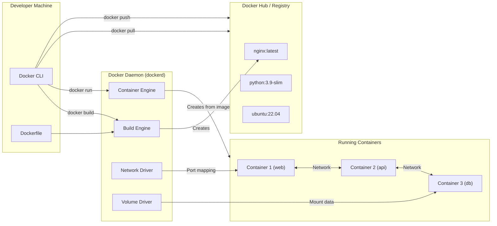
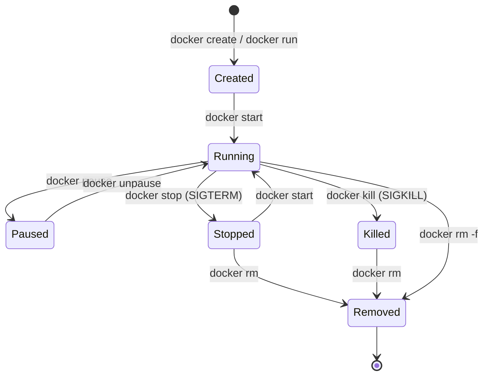

## 📚 Overview

This guide covers every essential Docker command, flag, and concept you need to build, run, manage, and troubleshoot containerized applications. Each command is explained with **what it does**, **why you use it**, and **what to expect**.

---

## 🏗️ The Analogy: Docker as an Apartment Building

Think of Docker like managing an **apartment building**:

| Apartment Building | Docker Equivalent |
| :--- | :--- |
| **Architectural blueprint** | **Image** — a read-only template describing what goes into an apartment |
| **Individual apartment** | **Container** — a running instance created from the blueprint |
| **Building lobby / mailbox** | **Port mapping** — how the outside world reaches a specific apartment |
| **Storage locker in the basement** | **Volume** — persistent storage that survives even if an apartment is demolished |
| **Internal hallways** | **Network** — how apartments communicate with each other |
| **Building superintendent** | **Docker daemon** — the background service managing everything |
| **Floor plans binder** | **Dockerfile** — step-by-step instructions to construct a new blueprint |
| **Real estate listing site** | **Registry (Docker Hub)** — a catalog where blueprints are shared publicly |

> **Key insight**: You can demolish an apartment (stop a container) and rebuild it from the same blueprint (image) instantly. The blueprint is never destroyed. If you used a storage locker (volume), your belongings survive the demolition.

---

## 📐 Architecture Diagram: How Docker Components Interact



---

## 📐 Container Lifecycle Diagram



---

## 🧪 Section 1: Docker Basics — System Information

### Check Docker version

```bash
docker version
```

* **What it shows**: Client version and Server (daemon) version
* **Why you use it**: Confirms Docker is installed and the daemon is running. If the "Server" section is missing, the daemon is down.

### System-wide information

```bash
docker info
```

* **What it shows**: Storage driver, cgroup version, number of images/containers, OS type, kernel version
* **Why you use it**: Debugging — tells you everything about your Docker installation at a glance

---

## 🧪 Section 2: Image Management

### List local images

```bash
docker images
```

| Flag | Purpose |
| :--- | :--- |
| `-a` | Show **all** images, including intermediate layers (normally hidden). Intermediate layers are created during multi-step builds. |
| `-q` | Output **only image IDs** — useful for piping into other commands (e.g., `docker rmi $(docker images -q)`) |

### Pull an image from a registry

```bash
docker pull ubuntu           # Pulls ubuntu:latest (default tag)
docker pull ubuntu:22.04     # Pulls a specific version
```

* **What happens**: Downloads the image layer-by-layer from Docker Hub (or a configured private registry)
* **`:tag` convention**: Always specify a version in production. `:latest` is a moving target and may change without warning.

### Remove an image

```bash
docker rmi ubuntu
```

| Flag | Purpose |
| :--- | :--- |
| `-f` | **Force** removal — removes even if a stopped container still references the image |

> **Deep Dive: Why can't I remove an image?**
> Docker prevents removal if any container (running or stopped) uses it. Either remove the container first (`docker rm`) or use `-f` to force.

---

## 🧪 Section 3: Container Lifecycle

### Run a container

```bash
docker run ubuntu
```

This is Docker's most important command. Here's every common flag explained:

| Flag | Full Form | Purpose | Example |
| :--- | :--- | :--- | :--- |
| `-i` | `--interactive` | Keeps STDIN open — you can type into the container | `docker run -i ubuntu` |
| `-t` | `--tty` | Allocates a pseudo-terminal (gives you a command prompt) | `docker run -t ubuntu` |
| `-it` | (combined) | Interactive terminal — the most common combo for shell access | `docker run -it ubuntu bash` |
| `-d` | `--detach` | Runs container in the **background** (doesn't hijack your terminal) | `docker run -d nginx` |
| `--name` | | Assigns a human-readable name instead of a random one | `docker run --name web nginx` |
| `--rm` | | **Auto-removes** the container when it exits — perfect for one-off tasks | `docker run --rm ubuntu echo "hello"` |
| `-e` | `--env` | Sets an **environment variable** inside the container | `docker run -e DB_HOST=localhost` |
| `--restart` | | Restart policy: `no`, `always`, `unless-stopped`, `on-failure` | `docker run --restart=always nginx` |

**Example: Interactive shell session**

```bash
docker run -it --name test ubuntu bash
```

* Creates a container named "test" from the `ubuntu` image
* Opens an interactive bash shell inside it
* When you type `exit`, the container stops (PID 1 process ended)

### List containers

```bash
docker ps          # Running containers only
docker ps -a       # All containers (running + stopped)
docker ps -q       # Only container IDs
```

### Start / Stop / Restart

```bash
docker start container_name     # Starts a stopped container
docker stop container_name      # Sends SIGTERM (graceful shutdown, 10s timeout)
docker restart container_name   # stop + start in one command
```

> **Deep Dive: `stop` vs `kill`**
> `docker stop` sends **SIGTERM** (polite: "please shut down") and waits 10 seconds. If the process doesn't exit, Docker sends **SIGKILL** (forced). `docker kill` sends SIGKILL immediately — no grace period.

### Remove a container

```bash
docker rm container_name       # Remove a stopped container
docker rm -f container_name    # Force-remove a running container (SIGKILL + remove)
```

---

## 🧪 Section 4: Executing Commands Inside Containers

### Attach to a running container

```bash
docker attach container_name
```

* **What it does**: Connects your terminal to the container's **main process** (PID 1)
* **Warning**: If you press `Ctrl+C`, you'll **stop the main process**, killing the container. Use `Ctrl+P, Ctrl+Q` to detach without stopping.

### Execute a command in a running container

```bash
docker exec -it container_name bash
```

* **What it does**: Spawns a **new process** inside an already-running container
* **Key difference from `attach`**: `exec` creates a secondary process. Exiting it does NOT stop the container.

| Flag | Purpose |
| :--- | :--- |
| `-i` | Interactive — keeps STDIN open |
| `-t` | Terminal — allocates a pseudo-TTY |

> **When to use which?**
>
> * Use `exec` for debugging (inspecting logs, checking config files, running diagnostics)
> * Use `attach` only when you specifically need to interact with PID 1

---

## 🧪 Section 5: Networking & Ports

### Port mapping

```bash
docker run -d -p 8080:80 nginx
```

* **Format**: `-p HOST_PORT:CONTAINER_PORT`
* **What happens**: Traffic hitting `localhost:8080` on your machine is forwarded to port `80` inside the container

| Flag | Purpose |
| :--- | :--- |
| `-p 8080:80` | Map **specific** host port 8080 → container port 80 |
| `-P` | Map **all** exposed ports to **random** high-numbered host ports |

> **Deep Dive: Why is port mapping necessary?**
> Containers run in their own **network namespace**. The container's port 80 is invisible to the host by default. Port mapping creates a bridge: `Host NIC → Docker proxy → Container namespace → Container process`.

### Docker networks

```bash
docker network ls                          # List all networks
docker network create mynet                # Create a custom network
docker run -d --network=mynet nginx        # Attach container to custom network
```

**Why custom networks?**

* Containers on the same custom network can reach each other **by container name** (automatic DNS)
* On the default `bridge` network, containers can only reach each other by IP address

---

## 🧪 Section 6: Volumes & Data Persistence

### The problem

Containers are **ephemeral** — when a container is removed, all data inside it is destroyed. Volumes solve this.

### Named volumes (Docker-managed)

```bash
docker volume create mydata                       # Create a named volume
docker run -v mydata:/data ubuntu                  # Mount it at /data inside the container
```

* Docker stores the volume data in `/var/lib/docker/volumes/mydata/` on the host
* Multiple containers can share the same volume

### Bind mounts (host-managed)

```bash
docker run -v /host/path:/container/path ubuntu
```

* Maps a **specific host directory** into the container
* Changes on either side are reflected immediately
* Best for development (edit code locally, see changes in container)

### Read-only mount

```bash
docker run -v mydata:/data:ro ubuntu
```

* `:ro` prevents the container from writing to the volume — useful for configuration files

---

## 🧪 Section 7: Logs & Monitoring

### View container logs

```bash
docker logs container_name
```

| Flag | Purpose |
| :--- | :--- |
| `-f` | **Follow** — stream logs in real-time (like `tail -f`) |
| `--tail 50` | Show only the **last 50 lines** |
| `--since 10m` | Show logs from the **last 10 minutes** |
| `--timestamps` | Prefix each line with a timestamp |

### Live resource usage

```bash
docker stats
```

* **Shows**: CPU %, Memory usage/limit, Network I/O, Disk I/O — for all running containers
* Press `Ctrl+C` to exit

---

## 🧪 Section 8: Inspect & Metadata

### Deep inspection

```bash
docker inspect container_name
```

* **Returns**: A comprehensive JSON document containing:
  * IP address, MAC address
  * Mount points and volumes
  * Environment variables
  * Network configuration
  * Image SHA, creation time

**Useful filtered queries:**

```bash
# Get container IP address
docker inspect -f '{{range.NetworkSettings.Networks}}{{.IPAddress}}{{end}}' container_name

# Get mount points
docker inspect -f '{{json .Mounts}}' container_name
```

---

## 🧪 Section 9: Building Images

### Build from a Dockerfile

```bash
docker build -t myapp .
```

| Flag | Purpose |
| :--- | :--- |
| `-t myapp` | **Tag** the resulting image with the name `myapp` |
| `-f Dockerfile.dev` | Use an **alternate Dockerfile** (not the default `Dockerfile`) |
| `--no-cache` | **Disable layer caching** — forces rebuild of every layer from scratch |

### Example Dockerfile

```dockerfile
FROM ubuntu:22.04
RUN apt update && apt install -y nginx
CMD ["nginx", "-g", "daemon off;"]
```

| Instruction | Purpose |
| :--- | :--- |
| `FROM` | Base image — the starting layer |
| `RUN` | Execute a command during build (creates a new layer) |
| `CMD` | Default command when the container starts |

---

## 🧪 Section 10: Docker Compose (Multi-Container Applications)

### Start all services

```bash
docker compose up
```

| Flag | Purpose |
| :--- | :--- |
| `-d` | **Detached** — run services in the background |
| `--build` | **Rebuild** images before starting (picks up code changes) |

### Stop and remove all services

```bash
docker compose down
```

* Stops all containers, removes them, and removes the default network
* Add `--volumes` to also delete named volumes (data loss!)

> **When to use Compose?** When your application has **multiple services** (e.g., web server + database + cache) that need to run together. Instead of running 3 separate `docker run` commands, you define everything in a `docker-compose.yml` file.

---

## 🧪 Section 11: Cleanup Commands

```bash
docker container prune       # Remove all stopped containers
docker image prune            # Remove dangling (untagged) images
docker volume prune           # Remove unused volumes
docker network prune          # Remove unused networks
docker system prune           # Remove all unused containers, networks, and dangling images
docker system prune -a        # Also remove ALL unused images (not just dangling)
docker system prune -a --volumes  # Nuclear: remove everything unused + volumes
```

> **⚠️ Warning**: `docker system prune -a --volumes` will delete cached base images, forcing re-downloads on next build. Use with caution.

---

## 📋 Complete `docker run` Flag Reference

| Flag | Meaning | Example |
| :--- | :--- | :--- |
| `-it` | Interactive terminal | `docker run -it ubuntu bash` |
| `-d` | Detached (background) mode | `docker run -d nginx` |
| `--rm` | Auto-remove container on exit | `docker run --rm alpine echo hi` |
| `--name` | Custom container name | `docker run --name web nginx` |
| `-p` | Port mapping (host:container) | `docker run -p 8080:80 nginx` |
| `-P` | Map all exposed ports to random host ports | `docker run -P nginx` |
| `-v` | Volume or bind mount | `docker run -v data:/app nginx` |
| `-e` | Set environment variable | `docker run -e KEY=val nginx` |
| `--network` | Attach to custom network | `docker run --network=mynet nginx` |
| `--restart` | Restart policy | `docker run --restart=always nginx` |
| `-w` | Set working directory | `docker run -w /app node` |
| `--cpus` | Limit CPU cores | `docker run --cpus=0.5 nginx` |
| `--memory` | Limit memory | `docker run --memory=256m nginx` |

---

## 🧪 Section 12: Minimal Lab Walkthrough (Ubuntu + Nginx)

```bash
# 1. Pull the NGINX image
docker pull nginx

# 2. Run a container in detached mode with port mapping
docker run -d --name web -p 8080:80 nginx

# 3. Verify it's running
docker ps

# 4. Test the web server
curl http://localhost:8080

# 5. View logs
docker logs web

# 6. Stop and remove
docker stop web
docker rm web
```

**Expected result**: After step 4, you'll see the NGINX welcome page HTML.

---

# 📖 Glossary of Key Terms

| Term | Definition |
| :--- | :--- |
| **Image** | A read-only, layered template that contains an application and its dependencies. Created from a Dockerfile. Think of it as a "class" in programming — you instantiate containers from it. |
| **Container** | A running instance of an image. It has its own filesystem, network, and process space. Think of it as an "object" instantiated from the image "class." |
| **Daemon (`dockerd`)** | A background process that manages Docker objects (images, containers, networks, volumes). The Docker CLI sends commands to the daemon via a REST API. |
| **Docker CLI** | The command-line tool (`docker`) that users interact with. It communicates with the daemon to execute commands. |
| **Registry** | A storage service for Docker images. Docker Hub is the default public registry. Images are pushed to and pulled from registries. |
| **Volume** | A Docker-managed storage mechanism that persists data beyond a container's lifecycle. Unlike bind mounts, Docker handles the storage location. |
| **Bind Mount** | A mapping of a specific host directory into a container. Gives the container direct access to host files. Unlike volumes, the user controls the host path. |
| **Port Mapping** | The `-p HOST:CONTAINER` flag that forwards traffic from a host port to a port inside the container's network namespace. Without this, container ports are invisible to the host. |
| **Network Namespace** | A Linux kernel feature giving each container its own isolated network stack (interfaces, routing tables, firewall rules). Port mapping bridges the host and container namespaces. |
| **SIGTERM vs SIGKILL** | `SIGTERM` (signal 15) asks a process to shut down gracefully. `SIGKILL` (signal 9) forces immediate termination. `docker stop` uses SIGTERM; `docker kill` uses SIGKILL. |
| **Detached Mode (`-d`)** | Runs a container in the background, returning control to your terminal immediately. Opposite of interactive mode (`-it`). |
| **Docker Compose** | A tool for defining and running multi-container applications using a `docker-compose.yml` file. One command (`docker compose up`) starts all services. |

---

# 🎓 Exam & Interview Preparation

## Potential Interview Questions

### Q1: "What is the difference between `docker exec` and `docker attach`?"

**Model Answer**: Both connect you to a running container, but they work fundamentally differently. `docker attach` connects your terminal to the container's **main process** (PID 1) — if you press Ctrl+C, you send SIGINT to PID 1, which typically stops the container. `docker exec` spawns a **new, secondary process** inside the container — exiting this process does NOT affect the main process or stop the container. In practice, `docker exec -it <container> bash` is almost always preferred because it's non-destructive. `docker attach` is rarely used except when you specifically need to interact with PID 1's I/O streams.

---

### Q2: "Explain the difference between a Docker volume and a bind mount. When would you use each?"

**Model Answer**: A **volume** is managed entirely by Docker — Docker decides where to store the data on the host filesystem (typically `/var/lib/docker/volumes/`). The user interacts with it by name. A **bind mount** maps a specific host directory (chosen by the user) into the container. **Use volumes** in production for data that should outlive containers (database files, uploads) because they're portable, backup-friendly, and don't depend on host directory structure. **Use bind mounts** in development for live code reloading — mount your source code directory so changes on your host appear instantly inside the container without rebuilding.

---

### Q3: "A container runs but the service inside isn't reachable from the host. How do you debug this?"

**Model Answer**: This is a systematic debugging process:

1. **Check if the container is running**: `docker ps` — verify the container is in "Up" status, not exited.
2. **Check port mapping**: Look at the PORTS column in `docker ps`. If it shows nothing, you forgot `-p HOST:CONTAINER` when running the container.
3. **Check application logs**: `docker logs <container>` — the application may have crashed or be listening on a different port.
4. **Check application listen address**: The service might be bound to `127.0.0.1` (localhost only), making it unreachable from outside the container. It should bind to `0.0.0.0` (all interfaces).
5. **Check network connectivity**: `docker inspect <container>` to verify the container has an IP address and is on the expected network.
6. **Test from inside**: `docker exec -it <container> curl localhost:<port>` — if this works but external access doesn't, the issue is port mapping or firewall.

---

**Student**: Pranav R Nair | **Batch**: 2(CCVT) | **SAP ID**: 500121466
