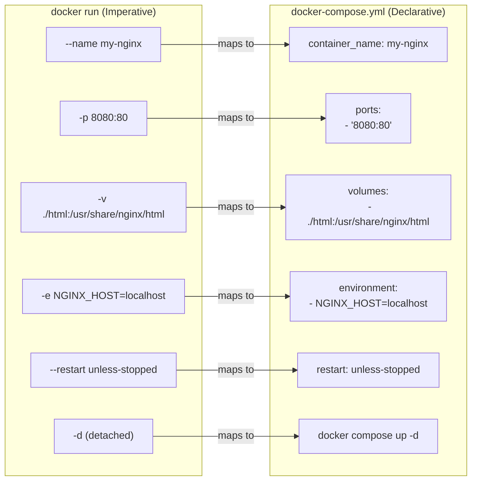
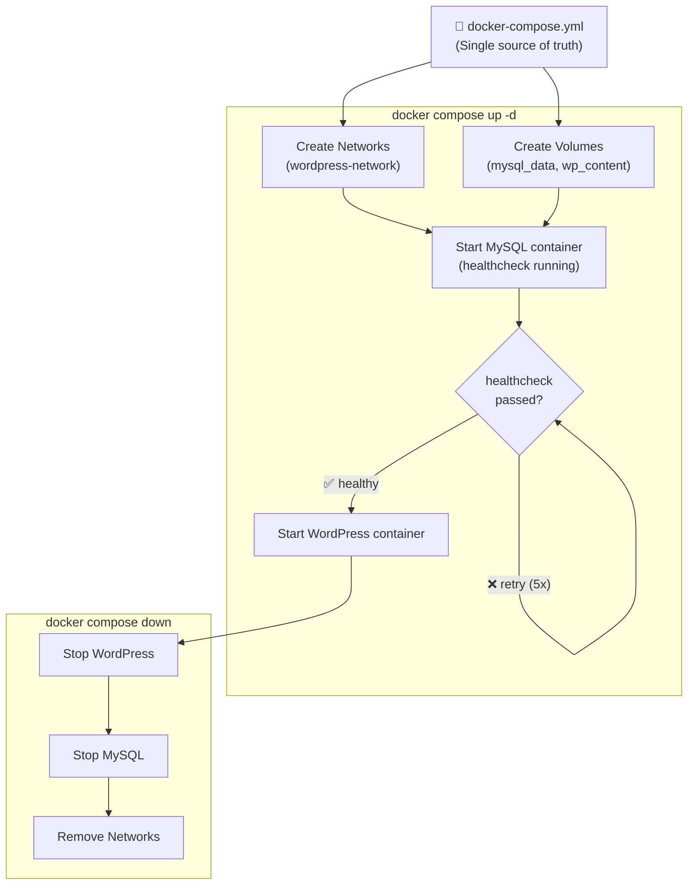
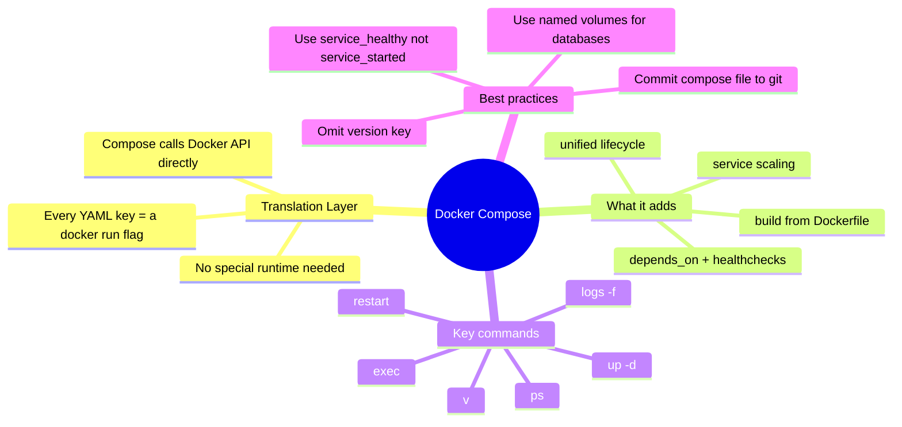

## 🎯 Objective

Understand the relationship between `docker run` and Docker Compose, master the one-to-one flag mapping between them, and confidently choose the right tool for single-container vs multi-service deployments.

---

## 🏗️ The Analogy: Building a House vs Filing Blueprints

Imagine you want to furnish a house with five rooms.

**The `docker run` way (imperative)** is like calling five separate contractors one by one, giving each of them individual verbal instructions over the phone:

> "Painter — go to Room 1, paint it blue, use matte finish, don't start until the plasterer is done."
> "Electrician — go to Room 2, install 4 sockets on the north wall..."

Each conversation is separate, error-prone, and if you ever need to recreate the same house, you have to remember every instruction perfectly.

**The `docker-compose` way (declarative)** is like handing your architect a single set of blueprints — a document that describes *every room, every finish, every dependency* in one place. Any contractor can pick up those blueprints and recreate the house identically, every time, anywhere in the world.

> `docker run` = Verbal instructions (imperative: **do this, then this**)
> `docker-compose` = Architect's blueprints (declarative: **this is what I want**)

---

## 📐 Diagram 1: Flag-to-YAML Translation Model



---

## Part 1: The Direct Mapping — `docker run` vs `docker-compose.yml`

Docker Compose does not do anything fundamentally different from `docker run`. It reads your YAML file and **translates** it into the equivalent `docker run` commands behind the scenes. Understanding this 1:1 mapping removes all mystery from Compose.

### Side-by-Side Example: Running NGINX

**`docker run` (imperative, one long command):**

```bash
docker run \
  --name my-nginx \
  -p 8080:80 \
  -v ./html:/usr/share/nginx/html \
  -e NGINX_HOST=localhost \
  --restart unless-stopped \
  -d \
  nginx:alpine
```

**`docker-compose.yml` (declarative, YAML file):**

```yaml
# This produces the EXACT same result as the command above
services:
  nginx:
    image: nginx:alpine
    container_name: my-nginx         # --name my-nginx
    ports:
      - "8080:80"                    # -p 8080:80
    volumes:
      - ./html:/usr/share/nginx/html # -v ./html:/usr/share/nginx/html
    environment:
      - NGINX_HOST=localhost          # -e NGINX_HOST=localhost
    restart: unless-stopped          # --restart unless-stopped
    # To run detached: docker compose up -d
```

> **Note:** The `version:` key (e.g., `version: '3.8'`) is now **obsolete** in Docker Compose v2 (2024+). Omit it — including it will produce a deprecation warning.

---

## Part 2: The Complete Flag Cheatsheet

| `docker run` Flag | `docker-compose.yml` Key | Notes |
| :--- | :--- | :--- |
| `--name my-app` | `container_name: my-app` | |
| `-p 8080:80` | `ports: ["8080:80"]` | Can list multiple |
| `-v ./data:/app` | `volumes: ["./data:/app"]` | Bind mount |
| `-v myvolume:/app` | `volumes: ["myvolume:/app"]` | Named volume |
| `-e KEY=value` | `environment: [KEY=value]` | Or dict format |
| `--env-file .env` | `env_file: .env` | |
| `--network mynet` | `networks: [mynet]` | |
| `--restart always` | `restart: always` | |
| `-w /app` | `working_dir: /app` | |
| `--user 1000:1000` | `user: "1000:1000"` | |
| `--entrypoint /bin/sh` | `entrypoint: /bin/sh` | |
| `myimage echo hello` | `command: echo hello` | Overrides CMD |
| `--hostname app-srv` | `hostname: app-srv` | |
| `-d` | `docker compose up -d` | Flag on the CLI, not in YAML |

---

## Part 3: Where Compose Goes Further

Docker Compose becomes essential once you add a **second container**. It introduces capabilities that `docker run` simply cannot provide at the same level of convenience.

### 3.1 Dependency Management — `depends_on`

```yaml
services:
  web:
    image: myapp
    depends_on:
      db:
        condition: service_healthy   # Wait until db passes its healthcheck

  db:
    image: postgres:16
    healthcheck:
      test: ["CMD", "pg_isready", "-U", "postgres"]
      interval: 5s
      retries: 5
```

> **Why this matters:** Without `depends_on`, your app container might start before the database is accepting connections, causing startup crashes. The `service_healthy` condition (not just `service_started`) is the production-safe option.

### 3.2 Build From Source — `build`

```yaml
services:
  api:
    build:
      context: ./backend         # Path to Dockerfile directory
      dockerfile: Dockerfile.dev # Custom Dockerfile name
      args:
        - NODE_ENV=development    # Build-time ARG values
```

There is no clean `docker run` equivalent — you would need to manually `docker build -t myimage .` first.

### 3.3 Service Scaling

```bash
# Run 3 instances of `web` and 2 instances of `worker`
docker compose up --scale web=3 --scale worker=2
```

### 3.4 Unified Lifecycle Management

```bash
docker compose up -d      # Start the entire stack (detached)
docker compose down       # Stop + remove containers AND networks
docker compose down -v    # Also remove volumes
docker compose logs -f    # Stream logs from ALL services
docker compose ps         # Status of all services in this project
docker compose restart    # Restart all services
docker compose exec db psql -U postgres  # Run command inside a service
```

---

## Part 4: Real-World Comparison — WordPress + MySQL

This is the clearest demonstration of why Compose was invented.

### ❌ The `docker run` Way (Error-Prone, Hard to Reproduce)

```bash
# Must run these 4 commands in the correct order — every single time

# Step 1: Create named volumes
docker volume create mysql_data
docker volume create wp_content

# Step 2: Create bridged network for container DNS
docker network create wordpress-network

# Step 3: Start MySQL first
docker run -d \
  --name mysql \
  --network wordpress-network \
  -e MYSQL_ROOT_PASSWORD=secret \
  -e MYSQL_DATABASE=wordpress \
  -e MYSQL_USER=wpuser \
  -e MYSQL_PASSWORD=wppass \
  -v mysql_data:/var/lib/mysql \
  mysql:5.7

# Step 4: Start WordPress (pray MySQL is ready)
docker run -d \
  --name wordpress \
  --network wordpress-network \
  -p 8080:80 \
  -e WORDPRESS_DB_HOST=mysql \
  -e WORDPRESS_DB_USER=wpuser \
  -e WORDPRESS_DB_PASSWORD=wppass \
  -e WORDPRESS_DB_NAME=wordpress \
  -v wp_content:/var/www/html/wp-content \
  wordpress:latest
```

### ✅ The `docker compose` Way (Single Source of Truth)

```yaml
# docker-compose.yml
services:
  mysql:
    image: mysql:5.7
    container_name: mysql
    environment:
      MYSQL_ROOT_PASSWORD: secret
      MYSQL_DATABASE: wordpress
      MYSQL_USER: wpuser
      MYSQL_PASSWORD: wppass
    volumes:
      - mysql_data:/var/lib/mysql
    networks:
      - wordpress-network

  wordpress:
    image: wordpress:latest
    container_name: wordpress
    ports:
      - "8080:80"
    environment:
      WORDPRESS_DB_HOST: mysql         # Docker DNS resolves "mysql" → container IP
      WORDPRESS_DB_USER: wpuser
      WORDPRESS_DB_PASSWORD: wppass
      WORDPRESS_DB_NAME: wordpress
    volumes:
      - wp_content:/var/www/html/wp-content
    depends_on:
      - mysql
    networks:
      - wordpress-network

volumes:
  mysql_data:
  wp_content:

networks:
  wordpress-network:
```

**Start everything:**

```bash
docker compose up -d
```

**Destroy everything (containers + networks):**

```bash
docker compose down
```

---

## 📐 Diagram 2: Docker Compose Lifecycle & Dependency Order



---

## Part 5: Full Flag Conversion Reference

**Complex `docker run` command:**

```bash
docker run -d \
  --name myapp \
  --hostname app-server \
  -p 8080:80 \
  -p 8443:443 \
  -v /opt/app/config:/etc/app \
  -v app-data:/var/lib/app \
  -e APP_ENV=production \
  -e DB_URL=postgres://user:pass@db:5432/app \
  --network app-network \
  --restart always \
  --memory="512m" \
  --cpus="1.0" \
  myimage:latest \
  --log-level debug
```

**Equivalent `docker-compose.yml`:**

```yaml
services:
  myapp:
    image: myimage:latest
    container_name: myapp
    hostname: app-server              # --hostname
    ports:
      - "8080:80"
      - "8443:443"
    volumes:
      - /opt/app/config:/etc/app      # Bind mount (host path)
      - app-data:/var/lib/app         # Named volume
    environment:
      APP_ENV: production
      DB_URL: postgres://user:pass@db:5432/app
    networks:
      - app-network
    restart: always
    command: --log-level debug        # Arguments after the image name

    # Resource limits require deploy key (or use --compatibility flag)
    deploy:
      resources:
        limits:
          cpus: '1.0'
          memory: 512M

volumes:
  app-data:

networks:
  app-network:
```

---

## 🔧 Common Pitfalls

| Pitfall | Symptom | Fix |
| :--- | :--- | :--- |
| Using `version:` key | Deprecation warning printed | Remove the `version:` line entirely |
| `depends_on` without healthcheck | App crashes on startup | Add `healthcheck` + `condition: service_healthy` |
| Port already in use | `Bind for 0.0.0.0:8080 failed` | Change the host port or stop the conflicting process |
| Named volume not declared | Compose error on startup | Declare all named volumes in the top-level `volumes:` block |
| Forgetting `-d` flag | Terminal locked, Ctrl+C kills stack | Always use `docker compose up -d` |
| `docker-compose` vs `docker compose` | `command not found` | The new V2 command is `docker compose` (no hyphen) |

---

## 🔑 Key Terminology Glossary

**Docker Compose**
: A tool that reads a `docker-compose.yml` file and orchestrates the creation, networking, and lifecycle of one or more containers. It is not a separate container runtime — it generates and executes `docker run`-equivalent API calls to the Docker daemon.

**Declarative Configuration**
: Describing the *desired end state* rather than the *steps to achieve it*. You specify what containers you want, and Compose figures out how to create them.

**Imperative Approach**
: Specifying exact commands in sequence ("do step 1, then step 2"). `docker run` is imperative — you must issue each command manually.

**Service**
: A named unit within a `docker-compose.yml` file. Each service typically maps to one container type (e.g., `web`, `db`, `redis`).

**`depends_on`**
: A Compose key that defines startup ordering. With `condition: service_healthy`, Compose will wait for a container's healthcheck to pass before starting dependent services.

**Named Volume**
: A Docker-managed persistent storage area identified by a human-readable name. Must be declared in both the service's `volumes:` key and the top-level `volumes:` block in Compose.

**Bind Mount**
: A mapping of a specific host filesystem path into a container. Changes on the host are instantly visible inside the container and vice versa.

**`docker compose down`**
: Stops and removes all containers and networks created by `docker compose up`. Data in named volumes is preserved unless `-v` flag is added.

**Project Name**
: Docker Compose groups all resources (containers, networks, volumes) under a project name, defaulting to the directory name. Used to avoid collisions between multiple Compose stacks.

**Service Scaling**
: Running multiple identical instances of a service using `--scale web=3`. Useful for load-testing or simple horizontal scaling.

---

## 🎓 Interview Preparation

### Q1: What is the fundamental difference between `docker run` and Docker Compose?

> **Model Answer:** `docker run` is an **imperative** tool — you write out each step (create network, create volume, run container 1, run container 2) in the correct order, every time. Docker Compose is **declarative** — you write a YAML file describing the desired state once, and Compose handles the orchestration. Under the hood, Compose translates the YAML into the equivalent Docker API calls, so it doesn't have any special powers; it's a productivity layer that prevents human error and enables reproducibility. The critical advantage Compose adds is **dependency management** (`depends_on` with health checks) and **unified lifecycle management** (`up`, `down`, `logs`, `ps` for the entire stack).

---

### Q2: A new developer joins your team and can't start the application because they forgot the `--network` flag. How does Docker Compose solve this class of problem, and what related issues does it prevent?

> **Model Answer:** Compose solves this with **"infrastructure as code"** — the `docker-compose.yml` file is the single source of truth committed to version control. When the developer runs `docker compose up`, Compose auto-creates the required custom network (listed in the top-level `networks:` block) and attaches each service to it automatically. No flags need to be remembered. This prevents: (1) forgotten flags causing silent misconfiguration, (2) environment drift between developer machines, (3) knowledge silos where only one person knows the full run command, and (4) startup order errors where the app starts before the database is ready.

---

### Q3: What is the difference between `depends_on: [db]` and `depends_on: db: condition: service_healthy`, and why does the distinction matter in production?

> **Model Answer:** `depends_on: [db]` with no condition only guarantees that the `db` container has been **started** — it does not wait for PostgreSQL to be ready to accept connections. The container process starts almost instantly, but the database engine takes several more seconds to initialize. The app container launched right after will try to connect, get `Connection refused`, and crash. `condition: service_healthy` tells Compose to poll the `db` container's `healthcheck` command (e.g., `pg_isready`) and only start the dependent service once that check passes. In production this is critical: without it, you need a retry loop in your application code **and** a proper healthcheck. Best practice is to use both — Compose healthchecks for orchestration, and application-level retries as a backup.

---

## 📋 Quick Reference Summary



---

> **Professor's Note:** `docker run` is your Swiss Army knife — indispensable for one-off debugging. `docker-compose` is your factory line — essential the moment you have more than one container working together. Know the mapping cold; every Compose key is just a `docker run` flag in disguise.

**Student**: Pranav R Nair | **SAP ID**: 500121466 | **Batch**: 2(CCVT)
