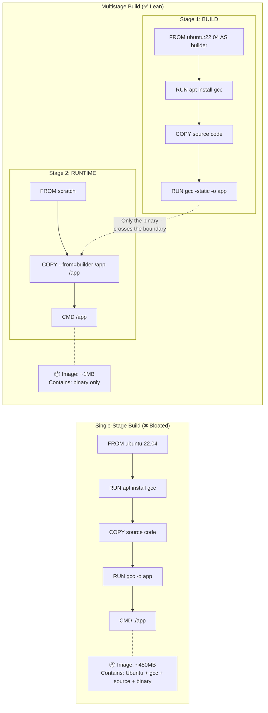
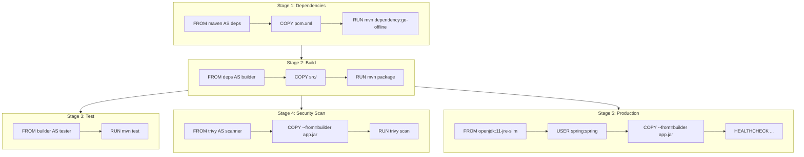

## 📚 Overview

This guide covers **multistage Dockerfiles** — Docker's most powerful technique for building production-grade images. You'll learn why single-stage builds create bloated, insecure images, how multistage builds solve this by separating **build** from **runtime**, and how to apply this pattern across C, Java, Go, and Node.js applications.

---

## 🏗️ The Analogy: Building a House

Think of creating a Docker image like **building a house**:

### Single-Stage Build: "Leave the scaffolding up"

You hire a construction crew. They bring heavy machinery — cranes, cement mixers, welding equipment. They build the house. When they're done, they **leave everything on site**. The crane stays in the yard. The cement mixer blocks the driveway. The welding torch sits on the kitchen table. You can't easily move the house, and intruders could use your construction tools against you.

### Multistage Build: "Clean handover"

The crew builds the house at a **construction yard** (Stage 1). When it's done, they take **only the finished house** and deliver it to the final location (Stage 2). The crane, cement mixer, and welding equipment stay at the yard. The delivered house is clean, lightweight, and has no dangerous tools lying around.

| Construction Analogy | Docker Equivalent |
| :--- | :--- |
| Construction yard with heavy machinery | **Build stage** — FROM maven / FROM gcc / FROM node |
| Blueprints, raw materials, tools | **Build dependencies** — compilers, package managers, source code |
| Finished house, fully furnished | **Built artifact** — compiled binary, JAR file, static HTML |
| Clean delivery to the new address | `COPY --from=builder` — copy only the artifact to the runtime stage |
| Empty lot, no tools | **Runtime stage** — FROM slim / FROM alpine / FROM scratch |
| Intruders using your crane | **Attack surface** — hackers exploiting build tools left in production |

> **Key insight**: A production image should contain **only what's needed to run the application** — not what was needed to build it. Multistage builds enforce this separation automatically.

---

## 📐 Architecture Diagram: Single-Stage vs Multistage



---

## 📐 Real-World Pipeline Diagram: Production Java Microservice



---

# Part I: The Problem with Single-Stage Builds

### A Single-Stage C Application

```dockerfile
FROM ubuntu:22.04
RUN apt-get update && apt-get install -y gcc
COPY hello.c .
RUN gcc -static -o hello hello.c
CMD ["./hello"]
```

**What's in the final image:**

| Component | Size | Needed at Runtime? |
| :--- | :--- | :--- |
| Ubuntu base OS | ~75MB | ❌ No (binary is statically compiled) |
| GCC compiler | ~70MB | ❌ No |
| APT package cache | ~30MB | ❌ No |
| Source code (`hello.c`) | ~1KB | ❌ No |
| Compiled binary (`hello`) | ~1MB | ✅ Yes |
| **Total** | **~175MB** | Only 1MB is useful |

> You're shipping a **175MB image** where **99.4%** of the content is unnecessary.

---

# Part II: The Multistage Solution

## `COPY --from=` — The Key Instruction

The magic of multistage builds is one instruction:

```dockerfile
COPY --from=builder /hello /hello
```

This copies a file **from a previous stage** (named `builder`) into the current stage. The previous stage is then **discarded** — its layers, tools, and source code never appear in the final image.

---

## Example 1: C Program (scratch)

```dockerfile
# Stage 1: Build
FROM ubuntu:22.04 AS builder
RUN apt-get update && apt-get install -y gcc
COPY hello.c .
RUN gcc -static -o hello hello.c

# Stage 2: Runtime (empty base image)
FROM scratch
COPY --from=builder /hello /hello
CMD ["/hello"]
```

**Result**: Image shrinks from **~175MB → ~1MB** (99.4% reduction).

### What Is `scratch`?

`scratch` is Docker's **empty base image** — literally 0 bytes. It contains:

* ❌ No OS, no shell, no package manager
* ❌ No standard libraries (that's why we use `-static` flag with GCC)
* ✅ Only what you explicitly copy in

> Use `scratch` for statically compiled languages: **C, Go, Rust**. Not for Java, Python, or Node.js (they need a runtime).

---

## Example 2: Java Application (JRE-slim)

```dockerfile
# Stage 1: Build (full JDK + Maven)
FROM maven:3.8-openjdk-11 AS builder
WORKDIR /app
COPY pom.xml .
COPY src ./src
RUN mvn clean package -DskipTests

# Stage 2: Runtime (JRE only — no compiler, no Maven)
FROM openjdk:11-jre-slim
WORKDIR /app

# Security: Run as non-root user
RUN useradd -m myuser
USER myuser

COPY --from=builder /app/target/app.jar app.jar
CMD ["java", "-jar", "app.jar"]
```

| Stage | Contains | Size |
| :--- | :--- | :--- |
| Build stage | Maven + JDK + source code + compiled JAR | ~750MB |
| Runtime stage | JRE-slim + JAR only | ~150MB |
| **Reduction** | | **80% smaller** |

**Security wins:**
* ❌ No Maven in production (can't download arbitrary dependencies)
* ❌ No source code visible (intellectual property protected)
* ❌ No JDK compiler (`javac` removed — attackers can't compile code)
* ✅ Non-root user execution

---

## Example 3: Go Application (scratch)

```dockerfile
# Stage 1: Build
FROM golang:1.19 AS builder
WORKDIR /app
COPY go.mod go.sum ./
RUN go mod download
COPY . .
RUN CGO_ENABLED=0 GOOS=linux go build -ldflags="-w -s" -o app .

# Stage 2: Security-hardened runtime
FROM gcr.io/distroless/static-debian11

# TLS certificates (for HTTPS calls)
COPY --from=builder /etc/ssl/certs/ca-certificates.crt /etc/ssl/certs/

# Binary only
COPY --from=builder /app/app /app

# Non-root (nobody:nobody)
USER 65534:65534
CMD ["/app"]
```

| Build Flag | Purpose |
| :--- | :--- |
| `CGO_ENABLED=0` | Disable C linkage — produces a fully static binary |
| `GOOS=linux` | Cross-compile for Linux (even if building on macOS/Windows) |
| `-ldflags="-w -s"` | Strip debug info and symbol tables — smaller binary |

> **distroless** images (by Google) contain only your app and its runtime dependencies — no shell, no package manager, no utilities. Even more secure than Alpine.

---

## Example 4: Full-Stack Application (Multiple Build Stages)

```dockerfile
# Stage 1: Build frontend
FROM node:16 AS frontend-builder
WORKDIR /app
COPY frontend/package*.json ./
RUN npm ci
COPY frontend/ .
RUN npm run build

# Stage 2: Build backend
FROM maven:3.8-openjdk-11 AS backend-builder
WORKDIR /app
COPY backend/ .
RUN mvn clean package -DskipTests

# Stage 3: Production (combines both)
FROM openjdk:11-jre-slim
COPY --from=frontend-builder /app/build /static
COPY --from=backend-builder /app/target/app.jar /app.jar
CMD ["java", "-jar", "/app.jar"]
```

> `COPY --from=` can reference **any named stage** — not just the immediately previous one. This allows independent, parallelizable build pipelines.

---

## Example 5: Production Java Microservice (5-Stage Pipeline)

```dockerfile
# Stage 1: Dependency resolution (heavily cached)
FROM maven:3.8-openjdk-11 AS deps
WORKDIR /app
COPY pom.xml .
RUN mvn dependency:go-offline

# Stage 2: Build with cached dependencies
FROM deps AS builder
COPY src ./src
RUN mvn clean package -DskipTests

# Stage 3: Test (optional — skip with --target=production)
FROM builder AS tester
RUN mvn test

# Stage 4: Security scan (optional)
FROM aquasec/trivy:latest AS scanner
COPY --from=builder /app/target/app.jar /
RUN trivy filesystem --exit-code 1 --no-progress /

# Stage 5: Production runtime
FROM openjdk:11-jre-slim
WORKDIR /app

RUN groupadd -r spring && useradd -r -g spring spring
USER spring:spring

COPY --from=builder /app/target/app.jar app.jar

HEALTHCHECK --interval=30s --timeout=3s \
  CMD curl -f http://localhost:8080/actuator/health || exit 1

ENV JAVA_OPTS="-Xmx512m -Xms256m"
ENTRYPOINT ["sh", "-c", "java $JAVA_OPTS -jar app.jar"]
```

### Build Specific Stages

```bash
# Build only up to the production stage (skip tests and security scan)
docker build --target production -t myapp:1.0 .

# Build up to the test stage
docker build --target tester -t myapp:test .
```

---

# Part III: Performance Comparison

| Aspect | Single-Stage | Multistage |
| :--- | :--- | :--- |
| **Image Size** | 500MB–1GB | 50–200MB (or ~1MB with scratch) |
| **Build Time** | Slower (rebuilds everything) | Faster (cached stages) |
| **Security** | ❌ High risk (full toolchain exposed) | ✅ Minimal attack surface |
| **Push/Pull Speed** | Slow (large layers) | Fast (small layers) |
| **Deployment** | Heavy, slow rollouts | Lightweight, fast scaling |
| **Source Code** | ❌ Visible in image | ✅ Discarded after build |

---

# Part IV: When to Use (and When Not to)

### ✅ Use Multistage When

1. **Production deployments** — always, no exceptions
2. **Microservices** — image size directly affects scaling speed
3. **CI/CD pipelines** — faster push/pull = faster deployments
4. **Compiled languages** (C, Go, Rust, Java) — build tools are large
5. **Security-sensitive apps** — minimize attack surface

### ❌ Skip Multistage When

1. **Development containers** — you need the full toolchain for debugging
2. **Interpreted languages** (Python, Ruby) — no compilation step (though still useful for dependency caching)
3. **Proof of concepts** — speed of setup matters more than image size
4. **Debugging production issues** — temporarily add tools to investigate

---

## 📋 Quick Tips for Effective Multistage Builds

1. **Name your stages**: `FROM node AS frontend-builder` — clarity for large Dockerfiles
2. **Separate dependencies from source**: Copy `package.json`/`pom.xml` first, then source code — maximizes cache hits
3. **Use `.dockerignore`**: Exclude `node_modules/`, `.git/`, `target/`, `.env` from the build context
4. **Use `--target`**: Build specific stages for different purposes (dev, test, production)
5. **Combine related operations**: Minimize RUN layers for fewer total layers
6. **Use distroless or scratch**: For the ultimate in security and size optimization

---

# 📖 Glossary of Key Terms

| Term | Definition |
| :--- | :--- |
| **Multistage Build** | A Dockerfile technique using multiple `FROM` instructions to separate build and runtime environments. Only the final stage's layers are included in the output image. |
| **`COPY --from=`** | The instruction that copies files from a named build stage (or an external image) into the current stage. This is the mechanism that bridges stages. |
| **`scratch`** | Docker's special empty base image (0 bytes). Contains no OS, shell, or libraries. Used for statically compiled binaries (C, Go, Rust). |
| **Distroless** | Google-maintained minimal container images that contain only the application runtime and its dependencies — no shell, no package manager, no utilities. More secure than Alpine. |
| **Build Stage** | A `FROM ... AS name` block in a multistage Dockerfile. Contains build tools, compilers, and source code. Discarded after the build unless explicitly copied from. |
| **Runtime Stage** | The final `FROM` block in a multistage Dockerfile. Contains only the application and its runtime dependencies. This is what becomes the output image. |
| **Static Compilation** | Compiling a binary with all dependencies bundled in, so it runs without external libraries. Enabled with `-static` (GCC) or `CGO_ENABLED=0` (Go). Required for `scratch` images. |
| **`--target`** | A `docker build` flag that builds only up to a specific named stage (e.g., `--target=tester`). Useful for running tests or building dev images. |
| **Attack Surface** | The total number of potential entry points an attacker can exploit. Fewer packages = fewer vulnerabilities = smaller attack surface. Multistage builds minimize this. |
| **Layer Caching** | Docker's optimization where unchanged build layers are reused from cache. In multistage builds, separating dependency installation from source code copying maximizes cache reuse. |
| **HEALTHCHECK** | A Dockerfile instruction that tells Docker how to test if a container is still working. Docker periodically runs the specified command and marks the container as healthy or unhealthy. |

---

# 🎓 Exam & Interview Preparation

## Potential Interview Questions

### Q1: "What is a multistage Docker build and why is it important for production?"

**Model Answer**: A multistage build uses multiple `FROM` instructions in a single Dockerfile, where each `FROM` starts a new build stage. The key instruction is `COPY --from=<stage>`, which copies specific files from one stage to another. Only the **final stage** becomes the output image — all previous stages are discarded. This is critical for production because it separates the **build environment** (compilers, SDKs, source code — often 500MB+) from the **runtime environment** (just the compiled binary or JAR — often 1-50MB). The result is smaller images (faster deployment and scaling), better security (no build tools for attackers to exploit), no source code exposure, and no intellectual property leaks.

---

### Q2: "Explain the difference between `scratch`, `alpine`, and `distroless` base images for the runtime stage."

**Model Answer**: These represent a spectrum of minimalism. **`scratch`** is Docker's empty image (0 bytes) — it contains absolutely nothing, so the binary must be statically compiled with all dependencies included. It's the smallest and most secure option, used for Go and C binaries. **Alpine Linux** (~5MB) is a minimal Linux distribution with a shell (`sh`), a package manager (`apk`), and musl libc. It allows installing runtime dependencies and debugging, but has a larger attack surface than scratch. **Distroless** (by Google) sits between the two — it contains a language runtime (e.g., Java JRE, Python interpreter) and CA certificates, but no shell, no package manager, and no utilities. It's ideal for languages that need a runtime but where you want to minimize attack surface. The choice depends on: scratch for statically compiled languages, distroless for JVM/Python/Node, and Alpine when you need a shell for debugging.

---

### Q3: "How does multistage build order affect Docker layer caching, and how would you optimize a Java build?"

**Model Answer**: Docker caches layers sequentially — if layer N changes, all layers N+1 onward are rebuilt. In a Java project, dependencies change rarely but source code changes frequently. The optimal strategy is to split dependency resolution into its own stage: **Stage 1** copies only `pom.xml` and runs `mvn dependency:go-offline` — this layer is cached as long as `pom.xml` doesn't change. **Stage 2** inherits from Stage 1 (`FROM deps AS builder`), copies `src/`, and runs `mvn package`. Since only the source code changed (not `pom.xml`), Stage 1's cached layer is reused, and only the compile step re-executes. Without this separation, changing a single line of Java code would trigger a full dependency re-download. This pattern applies to all ecosystems: copy `package.json` before `npm install`, copy `requirements.txt` before `pip install`, copy `go.mod` before `go mod download`.

---

**Student**: Pranav R Nair | **Batch**: 2(CCVT) | **SAP ID**: 500121466
