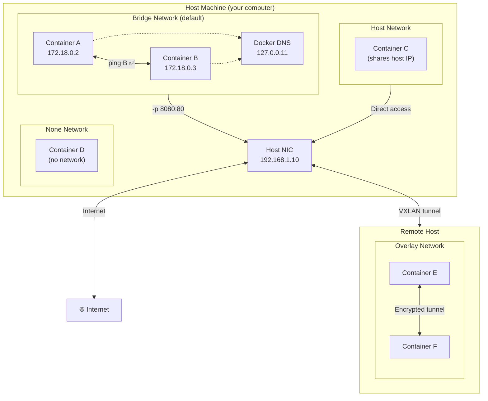
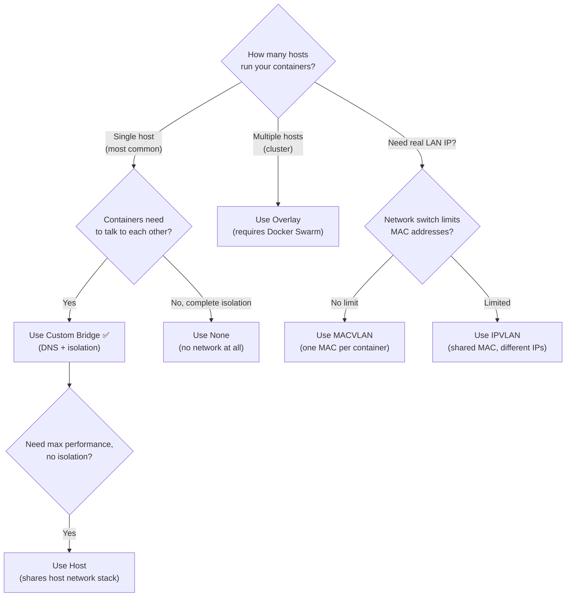

## 📚 Overview

This guide covers **Docker Networking** — how containers communicate with each other, with the host, and with the internet. You'll learn the five network drivers (bridge, host, overlay, macvlan, none), understand port publishing, discover Docker's built-in DNS, and build a two-tier application with isolated networks.

---

## 🏗️ The Analogy: The Apartment Complex

Imagine Docker containers as **apartments** in a building:

| Apartment Analogy | Docker Networking |
| :--- | :--- |
| Each apartment has its **own address** (unit number) | Each container gets its **own IP address** |
| Apartments on the **same floor** share a hallway | Containers on the **same bridge network** can talk directly |
| The **building intercom** lets you call "Apt 301" by name | Docker **DNS** lets containers reach each other by name |
| The **front desk** routes external mail to apartments | **Port publishing** (`-p 8080:80`) routes host traffic to containers |
| The **fire escape** goes directly outside (no lobby) | **Host network** — container shares the host's network directly |
| An **underground tunnel** between buildings | **Overlay network** — containers on different servers communicate |
| Each apartment has its **own PO Box** on the street | **MACVLAN** — container gets a real IP on the physical network |
| A **sealed room** with no doors or windows | **None network** — complete isolation, no networking |

> **Key insight**: By default, containers on the **same user-defined network** can find each other by name (DNS). Containers on **different networks** are isolated — they can't communicate at all unless you explicitly connect them.

---

## 📐 Architecture Diagram: Docker Network Drivers



---

## 📐 Decision Flowchart: Which Network Driver?



---

# Part I: Bridge Network (90% of Your Use Cases)

## Default Bridge vs Custom Bridge

Docker creates a default `bridge` network (`docker0`) at installation. But **always create a custom bridge** instead:

| Feature | Default Bridge | Custom Bridge |
| :--- | :--- | :--- |
| **DNS by container name** | ❌ Not available | ✅ Automatic |
| **Isolation** | All containers share it | Only containers you add |
| **Recommended** | ❌ No | ✅ Yes |

```bash
# See all networks (bridge, host, none are pre-created)
docker network ls
```

## Create a Custom Bridge Network

```bash
docker network create my_app_net

# Verify
docker network ls
docker network inspect my_app_net
```

## Run Containers on the Same Network

```bash
# Web server
docker run -d --name web --network my_app_net nginx

# Utility container
docker run -d --name utils --network my_app_net alpine sleep 3600

# Test DNS — ping by container NAME
docker exec utils ping web
```

**Result**: Ping works using container names. Docker runs an **embedded DNS server** at `127.0.0.11` inside each container on user-defined networks.

## Port Publishing (`-p` Flag)

Containers are isolated by default — to make them accessible from outside Docker:

```bash
# Map host port 8080 → container port 80
docker run -d --name web-public -p 8080:80 nginx

# Open http://localhost:8080 → NGINX welcome page
```

### Port Publishing Syntax Reference

| Syntax | Meaning |
| :--- | :--- |
| `-p 8080:80` | Host port 8080 → container port 80 (all interfaces) |
| `-p 127.0.0.1:8080:80` | Localhost only — not accessible from network |
| `-p 192.168.1.10:8080:80` | Specific host interface only |
| `-p 8080:80 -p 8443:443` | Multiple port mappings |
| `-p 53:53/udp` | UDP port (for DNS, gaming, etc.) |
| `-P` (capital) | Auto-assign random host port for all EXPOSE-d ports |
| `-p 8000-9000:80` | Random port from range 8000–9000 |

```bash
# Check assigned port mappings
docker port web-public
# Output: 80/tcp -> 0.0.0.0:8080
```

## Connect/Disconnect Running Containers

```bash
# Add a running container to a network
docker network connect my_app_net existing_container

# Remove from a network
docker network disconnect my_app_net existing_container
```

> A container can be on **multiple networks** simultaneously — it gets a separate IP on each.

---

## 🧪 Hands-On Lab: Two-Tier Application

### Goal: Web app talks to MySQL — by name, no IP addresses

```bash
# Step 1: Create an isolated network
docker network create todo_app

# Step 2: Run MySQL
docker run -d \
  --network todo_app \
  --name mysql-db \
  -e MYSQL_ROOT_PASSWORD=secret \
  -e MYSQL_DATABASE=todos \
  mysql:5.7

# Step 3: Run web app (connecting to "mysql-db" by name)
docker run -d \
  --network todo_app \
  --name web-app \
  -p 3000:3000 \
  -e DB_HOST=mysql-db \
  your-todo-app:latest

# Step 4: Verify
docker logs web-app   # Should show "Connected to database"
```

**What happened**: The web app connected to `mysql-db:3306` — Docker's DNS resolved the name `mysql-db` to its IP automatically. No hardcoded IPs, no configuration files.

---

# Part II: Host Network (Maximum Performance)

## How It Works

The container shares the host's network stack directly — no network namespace separation, no port mapping needed.

```bash
docker run -d --network host --name nginx-host nginx

# NGINX is now on host's port 80 — no -p flag needed
# Linux: ss -tulnp | grep 80
```

| Aspect | Bridge | Host |
| :--- | :--- | :--- |
| **Isolation** | ✅ Separate network namespace | ❌ Shares host namespace |
| **Port mapping** | Required (`-p`) | Not needed (direct access) |
| **Performance** | Slight NAT overhead | ✅ Native speed |
| **Port conflicts** | No (different namespaces) | ⚠️ Yes (shares host ports) |
| **Docker Desktop** | ✅ Full support | ⚠️ Limited support |

> **Use host network when**: Maximum network performance is critical and you don't need isolation. Avoid when running multiple containers that need the same port.

---

# Part III: Overlay Network (Multi-Host Communication)

## What Is Overlay?

When containers run on **different physical servers**, they need a virtual network that spans all hosts. Overlay creates an encrypted tunnel (VXLAN) between Docker hosts.

### Prerequisites

* **Docker Swarm** initialized
* Ports open between hosts: 2377/tcp, 7946/tcp+udp, 4789/udp

### Single-Machine Lab (Learning)

```bash
# Initialize Swarm (one machine is fine for learning)
docker swarm init --advertise-addr 127.0.0.1

# Create overlay network (--attachable lets regular containers use it)
docker network create -d overlay --attachable my_overlay

# Run containers
docker run -d --network my_overlay --name app1 alpine sleep 3600
docker run -d --network my_overlay --name app2 alpine sleep 3600

# Test — they communicate as if on the same network
docker exec app1 ping app2   # Works!
```

### Real Multi-Host Setup

```bash
# Manager node
docker swarm init --advertise-addr 192.168.1.10

# Worker node (run the join command from manager output)
docker swarm join --token SWMTKN-1-xxxx 192.168.1.10:2377

# Create overlay + deploy service across hosts
docker network create -d overlay prod_net
docker service create --name web --network prod_net --replicas 4 nginx
```

---

# Part IV: MACVLAN & IPVLAN (Direct LAN Access)

## MACVLAN — One MAC Address Per Container

Each container gets a **real MAC address** and a **real IP** on your physical network. Other devices on the LAN see it as a separate physical device.

```bash
docker network create -d macvlan \
  --subnet=192.168.1.0/24 \
  --gateway=192.168.1.1 \
  -o parent=eth0 \
  my_macvlan

docker run -d --network my_macvlan --ip 192.168.1.100 --name web nginx
# Accessible at http://192.168.1.100 from OTHER machines on the LAN
```

> **⚠️ Gotcha**: The host **cannot** reach MACVLAN containers directly. This is by design — the host's physical NIC and MACVLAN interfaces are separate.

## IPVLAN — Shared MAC, Different IPs

Like MACVLAN, but all containers share the **host's MAC address** while getting unique IPs. Better for networks that limit MAC addresses per port.

```bash
docker network create -d ipvlan \
  --subnet=192.168.1.0/24 \
  --gateway=192.168.1.1 \
  -o parent=eth0 \
  -o ipvlan_mode=l2 \
  my_ipvlan
```

| Feature | MACVLAN | IPVLAN |
| :--- | :--- | :--- |
| MAC addresses | One per container | One shared for all |
| Switch load | Higher (many MACs) | Lower (one MAC) |
| Scalability | Limited by switch | Much higher |
| WiFi compatible | ❌ Usually not | ❌ Usually not |

---

# Part V: None Network & Internal Networks

## None — Complete Isolation

```bash
docker run -d --network none --name isolated alpine sleep 3600
docker exec isolated ping google.com   # Fails — no network at all
```

Use for: batch processing, security-sensitive computation, or containers that should never communicate.

## Internal Networks — No Internet, Only Container-to-Container

```bash
docker network create --internal --subnet=10.10.0.0/16 internal_net
docker run -d --network internal_net --name db mysql

# Containers on internal_net can talk to each other
# But CANNOT reach the internet
```

> Perfect for databases that should never be directly accessible from outside.

---

# Part VI: Docker DNS Deep Dive

## How It Works

On **user-defined networks**, Docker runs an embedded DNS server at `127.0.0.11` inside every container.

```bash
# See the DNS configuration inside a container
docker exec utils cat /etc/resolv.conf
# Output: nameserver 127.0.0.11
```

### DNS Resolution Order

1. **Container name** → IP (within the same network)
2. **Service name** → Virtual IP (in Swarm mode)
3. **External DNS** → Internet addresses (forwarded to host's DNS)

### The Default Bridge Problem

DNS **does NOT work** on the default `bridge` network — only on user-defined bridges. This is the #1 beginner networking mistake:

```bash
# ❌ WRONG — default bridge, no DNS
docker run --name app1 nginx
docker run --name app2 alpine ping app1   # FAILS

# ✅ CORRECT — user-defined bridge, DNS works
docker network create mynet
docker run --network mynet --name app1 nginx
docker run --network mynet --name app2 alpine ping app1   # WORKS
```

---

# Part VII: Network Security

### Isolating Frontend from Database

```yaml
# docker-compose.yml
services:
  web:
    image: nginx
    ports:
      - "8080:80"
    networks:
      - frontend
      - backend     # Web can reach both networks

  app:
    image: node:18
    networks:
      - backend     # App only on backend

  db:
    image: postgres
    networks:
      - backend     # Database only on backend
    environment:
      - POSTGRES_PASSWORD=secret

networks:
  frontend:          # Exposed to outside via port publishing
  backend:           # Internal only — db is unreachable from outside
```

> **Security principle**: The database is on `backend` only. Even if the web container is compromised, the attacker can't directly reach the database from `frontend`.

### Encrypted Overlay (Swarm)

```bash
docker network create -d overlay -o encrypted secure_net
```

All container-to-container traffic on this network is encrypted with IPsec.

---

# Part VIII: Troubleshooting Cheatsheet

| Problem | Diagnosis | Solution |
| :--- | :--- | :--- |
| Containers can't ping by name | Using default bridge | Create custom bridge: `docker network create mynet` |
| Port already in use | Another process on that port | `lsof -i :80` (Linux) / `netstat -ano \| findstr :80` (Windows) |
| Container can't reach internet | Network is `--internal` or DNS issue | Check: `docker exec C cat /etc/resolv.conf` |
| Host can't reach MACVLAN container | By design — host NIC ≠ MACVLAN | Access from another machine, or create host MACVLAN shim |

### Quick Diagnostic Commands

```bash
# Network overview
docker network ls
docker network inspect <network>

# Container's IP and network
docker inspect <container> | grep IPAddress

# Test connectivity from inside container
docker exec <container> ping <target>
docker exec <container> nslookup <name>
docker exec <container> ip addr show
docker exec <container> ip route show

# Check port mappings
docker port <container>
```

---

## 📋 Network Commands Quick Reference

```bash
# Network lifecycle
docker network create mynet             # Create bridge
docker network create -d overlay mynet   # Create overlay (Swarm)
docker network rm mynet                  # Delete
docker network prune                     # Remove all unused

# Container ↔ Network
docker run --network mynet ...           # Run in network
docker network connect mynet container   # Add to network
docker network disconnect mynet container # Remove from network

# Inspection
docker network ls                        # List all
docker network inspect mynet             # Details
docker port container                    # Port mappings
```

---

# 📖 Glossary of Key Terms

| Term | Definition |
| :--- | :--- |
| **Bridge Network** | Docker's default network driver. Creates a virtual switch (`docker0`) on the host. Containers on the same bridge can communicate. Custom bridges add DNS resolution by container name. |
| **Host Network** | A driver where the container shares the host's network namespace directly — no isolation, no NAT, no port mapping needed. Maximum performance. |
| **Overlay Network** | A virtual network that spans multiple Docker hosts using VXLAN tunnels. Requires Docker Swarm. Enables cross-host container communication. |
| **MACVLAN** | A driver that gives each container its own MAC address and a real IP on the physical network. Other LAN devices see the container as a separate physical device. |
| **IPVLAN** | Similar to MACVLAN but all containers share the host's MAC address. More scalable on networks that limit MAC addresses per port. |
| **None Network** | Complete network isolation — the container has no network interfaces at all (except loopback). Used for security-sensitive batch processing. |
| **Port Publishing (`-p`)** | Maps a host port to a container port, allowing external access. Syntax: `-p HOST:CONTAINER`. Without this, containers are only reachable from within Docker networks. |
| **Docker DNS** | An embedded DNS server at `127.0.0.11` inside containers on user-defined networks. Resolves container names to IPs automatically. Does NOT work on the default bridge. |
| **Internal Network** | A network created with `--internal` flag. Containers can communicate with each other but cannot reach the internet. Used for database isolation. |
| **Network Namespace** | A Linux kernel feature that gives each container its own isolated network stack (interfaces, routing table, iptables rules). Bridge and overlay use separate namespaces; host mode shares the host's. |
| **VXLAN** | Virtual Extensible LAN — the tunneling protocol used by overlay networks to encapsulate container traffic between Docker hosts. |

---

# 🎓 Exam & Interview Preparation

## Potential Interview Questions

### Q1: "What is the difference between the default bridge and a user-defined bridge network?"

**Model Answer**: Both use the `bridge` driver, but they differ in critical ways. The **default bridge** (`docker0`) does NOT provide automatic DNS resolution — containers must use IP addresses to communicate, which breaks when containers restart with new IPs. A **user-defined bridge** (`docker network create mynet`) runs an embedded DNS server at `127.0.0.11`, allowing containers to find each other by name (`ping web` instead of `ping 172.18.0.2`). User-defined bridges also provide better isolation (only designated containers join) and allow live connect/disconnect (`docker network connect/disconnect`). Docker's own documentation recommends **always using user-defined bridges** — the default bridge exists only for backward compatibility.

---

### Q2: "How would you design networking for a three-tier web application (frontend, backend, database) with proper security isolation?"

**Model Answer**: Create **two separate networks**: `frontend` and `backend`. The **web server** (NGINX) connects to both networks and has port publishing (`-p 80:80`) for external access. The **application server** (Node.js/Java) connects to `backend` only — it can reach the database but is not directly exposed. The **database** (PostgreSQL) connects to `backend` only with no port publishing — it is completely unreachable from outside Docker. The web server reaches the app server by name (DNS) on the `backend` network. Additionally, create the `backend` network with `--internal` flag to prevent the database from making outbound internet connections. This ensures defense-in-depth: even if the web server is compromised, the attacker must pivot through the app server to reach the database, and the database can't exfiltrate data to the internet.

---

### Q3: "Explain Docker's port publishing. What does `-p 8080:80` actually do, and what is the security implication of `-p 0.0.0.0:8080:80` vs `-p 127.0.0.1:8080:80`?"

**Model Answer**: `-p 8080:80` creates a **NAT rule** (via iptables on Linux) that forwards TCP traffic arriving at the host's port 8080 to the container's port 80. By default, `-p 8080:80` binds to `0.0.0.0` — meaning **all network interfaces** on the host. This makes the container accessible from any machine that can reach the host, which is a security risk if the host is internet-facing. `-p 127.0.0.1:8080:80` binds only to **localhost** — the container is accessible only from the host itself, not from the network. For production, always consider binding to specific interfaces and using a reverse proxy (NGINX/Traefik) in front for TLS, rate limiting, and authentication rather than exposing container ports directly to `0.0.0.0`.

---

**Student**: Pranav R Nair | **Batch**: 2(CCVT) | **SAP ID**: 500121466
