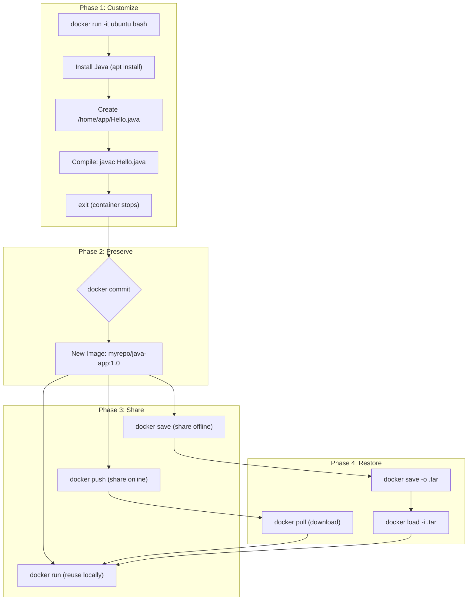

## 📚 Overview

This guide explains how to **persist modifications** made inside a running Docker container — installing software, creating files, configuring services — and turn those changes into a **reusable, shareable image**. We cover the full spectrum: `docker commit`, `docker save/load`, `docker export/import`, and when to use each.

---

## 🏗️ The Analogy: Customizing a Rental Apartment

Imagine you rent a **furnished apartment** (an Ubuntu container). You then:

1. **Install a bookshelf** (install Java)
2. **Place your books on the shelf** (create Java files in `/home/app`)
3. **Arrange everything the way you like** (compile, configure)

Now here's the problem: when your **lease ends** (container is removed), **all your customizations vanish**. The next tenant gets the original, empty apartment.

| Apartment Scenario | Docker Equivalent |
| :--- | :--- |
| Furnished apartment you move into | `docker run -it ubuntu bash` — starting from a base image |
| Installing a bookshelf & adding books | `apt install openjdk-17-jdk` + creating Java files |
| Taking a **photograph** of your customized apartment | `docker commit` — snapshot of the modified container |
| Using that photo to **furnish identical apartments** | `docker run myrepo/java-app:1.0` — spin up new containers |
| Burning the photo to a **DVD and mailing it** | `docker save -o image.tar` — offline transfer |
| Uploading the photo online for anyone to copy | `docker push` — share via Docker Hub |

> **Key insight**: `docker commit` is like photographing a customized apartment. The photo captures everything — furniture, books, decorations. Anyone with the photo can recreate the exact same setup instantly.

---

## 📐 Architecture Diagram: Container Preservation Workflow



---

## 🧪 Part 1: Set Up the Modified Container

### Step 1: Start a Base Ubuntu Container

```bash
docker run -it --name java_lab ubuntu:22.04 bash
```

| Flag / Argument | Purpose |
| :--- | :--- |
| `-it` | Interactive terminal — gives you a shell inside the container |
| `--name java_lab` | Assigns a human-readable name so we can reference it later |
| `ubuntu:22.04` | Base image — a clean Ubuntu installation with nothing extra |
| `bash` | The command to run — starts a Bash shell |

You are now **inside the container**. Your prompt changes to something like `root@a1b2c3d4e5f6:/#`.

### Step 2: Install Java Compiler

```bash
apt update
apt install -y openjdk-17-jdk
```

* `apt update` refreshes the package index (required before any install)
* `-y` auto-confirms the installation (no interactive prompt)
* `openjdk-17-jdk` installs both the Java Runtime (JRE) and Compiler (JDK)

**Verify the installation:**

```bash
javac --version
```

* **Expected output**: `javac 17.0.x`

### Step 3: Create a Java Application

```bash
mkdir -p /home/app
cd /home/app
```

Create the source file:

```bash
cat > Hello.java << 'EOF'
public class Hello {
    public static void main(String[] args) {
        System.out.println("Hello from Docker container!");
    }
}
EOF
```

> **Tip**: We use `cat > ... << 'EOF'` instead of `nano` because `nano` may not be installed in the minimal Ubuntu image.

**Compile and run:**

```bash
javac Hello.java
java Hello
```

* **Expected output**: `Hello from Docker container!`

Your container now contains:

* Java JDK 17 installed and configured
* `Hello.java` (source) and `Hello.class` (compiled) in `/home/app`

### Step 4: Exit the Container

```bash
exit
```

* The container **stops** because PID 1 (bash) ended
* **Critical**: The changes are NOT lost yet — they persist in the stopped container's filesystem
* However, if you `docker rm java_lab`, everything is gone forever

---

## 🧪 Part 2: Preserve with `docker commit`

### The Key Command

```bash
docker commit java_lab myrepo/java-app:1.0
```

| Argument | Purpose |
| :--- | :--- |
| `java_lab` | The name of the container to snapshot |
| `myrepo/java-app:1.0` | The name and tag for the new image |

**What happens internally:**

1. Docker takes the container's current filesystem (all changes since the base image)
2. Creates a **new layer** on top of the original `ubuntu:22.04` layers
3. Saves it as a new image with the given name and tag

**Verify:**

```bash
docker images
```

* **Expected output**: You'll see `myrepo/java-app` with tag `1.0` in the list. The image will be larger than `ubuntu:22.04` because it now includes Java + your app.

### 🧐 Deep Dive: What Does `docker commit` Actually Save?

| Saved | NOT Saved |
| :--- | :--- |
| All filesystem changes (installed packages, files) | Running processes |
| Environment variables set with `export` | Port mappings (`-p`) |
| Working directory changes | Volume data |
| New files and directories | Network configuration |

> `docker commit` captures the **filesystem state**, not the runtime state. It's a disk snapshot, not a memory snapshot.

---

## 🧪 Part 3: Reuse the Committed Image

### Run a New Container from Your Image

```bash
docker run -it myrepo/java-app:1.0 bash
```

**Test that everything persisted:**

```bash
cd /home/app
java Hello
```

* **Expected output**: `Hello from Docker container!`
* Java is already installed — no need to reinstall
* Source and compiled files are present — no need to recreate

You now have a **reusable, self-contained image** that includes your entire development environment.

---

## 🧪 Part 4: Share Offline with `docker save` / `docker load`

### Save an Image to a File

```bash
docker save -o java-app.tar myrepo/java-app:1.0
```

| Flag | Purpose |
| :--- | :--- |
| `-o java-app.tar` | **Output** file path — writes the image to a `.tar` archive |

* The resulting `.tar` file contains **all image layers**, metadata, tags, and configuration
* Transfer it via USB drive, SCP, network share, or any file transfer method

### Load an Image from a File

```bash
docker load -i java-app.tar
```

| Flag | Purpose |
| :--- | :--- |
| `-i java-app.tar` | **Input** file to load |

* Restores the complete image with all layers and tags
* Verify with `docker images` — you'll see `myrepo/java-app:1.0` appear

---

## 🧪 Part 5: Share Online with `docker push` / `docker pull`

```bash
# Log in to Docker Hub
docker login

# Push the image
docker push myrepo/java-app:1.0

# Pull on another machine
docker pull myrepo/java-app:1.0
```

> **Note**: Replace `myrepo` with your actual Docker Hub username (e.g., `nairp126/java-app:1.0`).

---

## ⚠️ Critical Distinction: `save/load` vs `export/import`

This is one of the **most commonly confused** concepts in Docker. They sound similar but do very different things.

### `docker save` (Image → File)

```bash
docker save -o image.tar myrepo/java-app:1.0
```

* Operates on an **image**
* Preserves **everything**: layers, history, tags, CMD, ENTRYPOINT, ENV
* Can be loaded back with `docker load`

### `docker export` (Container → File)

```bash
docker export java_lab > container.tar
```

* Operates on a **container** (running or stopped)
* Exports **raw filesystem only** — a flat tarball of all files
* **Loses**: Image name, layer history, CMD, ENTRYPOINT, ENV, metadata
* Imported with `docker import` (creates a new image with no history)

### Side-by-Side Comparison

| Aspect | `docker save` / `docker load` | `docker export` / `docker import` |
| :--- | :--- | :--- |
| **Operates on** | Image | Container |
| **Preserves layers** | ✅ Yes | ❌ No (flattened) |
| **Preserves CMD/ENTRYPOINT** | ✅ Yes | ❌ No |
| **Preserves tags** | ✅ Yes | ❌ No |
| **Preserves ENV variables** | ✅ Yes | ❌ No |
| **File size** | Larger (layered) | Smaller (flat) |
| **Use case** | Sharing complete images offline | Creating minimal base images |
| **Recommendation** | ✅ Use this | ⚠️ Rare — only for special cases |

> **Rule of thumb**: Almost always use `docker save/load`. Only use `docker export/import` if you specifically need to flatten an image into a single layer (e.g., creating a minimal base image).

---

## 📋 Complete Preservation Commands Cheatsheet

| Command | Direction | Purpose |
| :--- | :--- | :--- |
| `docker commit` | Container → Image | Snapshot a modified container into a new image |
| `docker save` | Image → File | Export a complete image (with layers) to `.tar` |
| `docker load` | File → Image | Import a `.tar` back into Docker |
| `docker push` | Image → Registry | Upload to Docker Hub or private registry |
| `docker pull` | Registry → Image | Download from Docker Hub or private registry |
| `docker export` | Container → File | Export raw filesystem (no metadata) |
| `docker import` | File → Image | Create a flat image from exported filesystem |

---

## 💡 Best Practice: Dockerfile > `docker commit`

For **production** and **reproducible builds**, prefer a Dockerfile over `docker commit`:

```dockerfile
FROM ubuntu:22.04
RUN apt update && apt install -y openjdk-17-jdk
WORKDIR /home/app
COPY Hello.java .
RUN javac Hello.java
CMD ["java", "Hello"]
```

```bash
docker build -t java-app:2.0 .
```

### Why Dockerfile is Better for Production

| Aspect | `docker commit` | Dockerfile |
| :--- | :--- | :--- |
| **Reproducibility** | ❌ Manual steps, easy to forget | ✅ Every step is documented |
| **Auditability** | ❌ No record of what changed | ✅ Version-controlled recipe |
| **Size optimization** | ❌ May include unnecessary files | ✅ Multi-stage builds possible |
| **CI/CD integration** | ❌ Requires manual intervention | ✅ Fully automated |
| **Layer caching** | ❌ One big commit layer | ✅ Each instruction is cacheable |

> **When to use `docker commit`**: Learning, labs, debugging, quick prototyping, or when you've done extensive manual configuration and need to "save your work" before you lose it.

---

# 📖 Glossary of Key Terms

| Term | Definition |
| :--- | :--- |
| **`docker commit`** | Creates a new image from a container's current filesystem state. Think of it as "taking a snapshot" of everything that changed since the container started. |
| **`docker save`** | Serializes a complete Docker image (all layers, metadata, tags) into a `.tar` archive file for offline transfer. |
| **`docker load`** | Deserializes a `.tar` archive created by `docker save` back into a Docker image, restoring all layers and metadata. |
| **`docker export`** | Exports a container's filesystem as a flat `.tar` archive. Loses all Docker metadata (layers, CMD, ENV). Rarely used. |
| **`docker import`** | Creates a new Docker image from a flat filesystem archive (created by `docker export`). The resulting image has no layer history. |
| **Image Layer** | A read-only filesystem diff. Each Dockerfile instruction or `docker commit` creates a new layer on top of existing ones. Layers are shared between images to save space. |
| **Stopped Container** | A container that has exited but has not been removed. Its filesystem changes are still intact and can be committed, restarted, or inspected. Removed with `docker rm`. |
| **`.tar` Archive** | A standard Unix archive format (Tape ARchive). Docker uses it to package images for transfer. Not compressed by default — pipe through `gzip` for smaller files. |
| **Registry** | A storage and distribution service for Docker images. Docker Hub is the default public registry. Private registries (AWS ECR, GitHub Container Registry) are used in enterprises. |

---

# 🎓 Exam & Interview Preparation

## Potential Interview Questions

### Q1: "What is the difference between `docker save` and `docker export`? When would you use each?"

**Model Answer**: `docker save` operates on an **image** and preserves everything — all layers, history, tags, CMD, ENTRYPOINT, and environment variables. The output can be restored with `docker load` to get an identical image. `docker export` operates on a **container** and produces a flat filesystem tarball — it loses all Docker metadata including layers, CMD, and ENTRYPOINT. Use `docker save/load` for transferring complete images between machines (e.g., air-gapped environments). Use `docker export/import` only in rare cases when you want to flatten an image into a single layer to reduce size or strip history for security.

---

### Q2: "You manually configured a container with software and data. How do you preserve it? What are the trade-offs vs using a Dockerfile?"

**Model Answer**: Use `docker commit <container> <image_name:tag>` to create a new image from the container's current filesystem state. This preserves all installed packages and files but NOT running processes or port mappings. The trade-off: `docker commit` is fast and convenient but produces **non-reproducible** images — there's no record of what commands were run. A Dockerfile is preferred for production because it's version-controlled, auditable, cacheable, and integrates with CI/CD. However, `docker commit` is perfectly valid for learning environments, quick prototyping, and situations where you've done extensive manual debugging and need to save your work.

---

### Q3: "A stopped container still has your changes. Why can't you just rely on that instead of committing?"

**Model Answer**: A stopped container's filesystem does retain all changes, but this is **fragile and temporary**. Three risks: (1) `docker rm` permanently deletes the container and all its changes — this can happen accidentally or through `docker system prune`. (2) The stopped container cannot be transferred to another machine — it exists only on the local Docker host. (3) You cannot create new containers from a stopped container — only from images. By committing, you convert the ephemeral container state into a **permanent, portable, reusable image** that can be versioned, shared via registry or file, and used to spawn identical containers anywhere.

---

**Student**: Pranav R Nair | **Batch**: 2(CCVT) | **SAP ID**: 500121466
