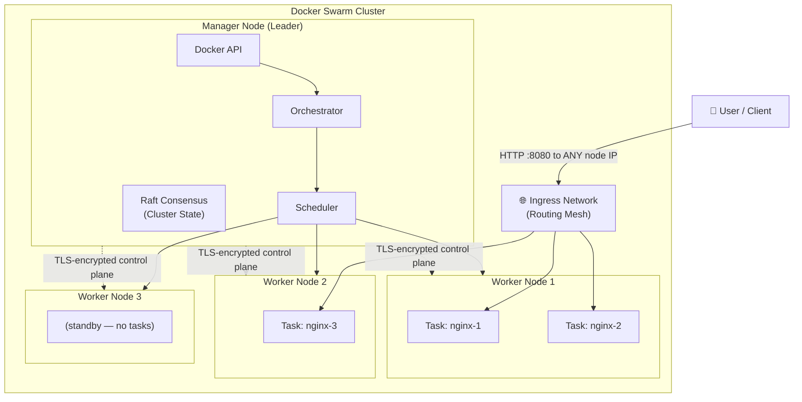
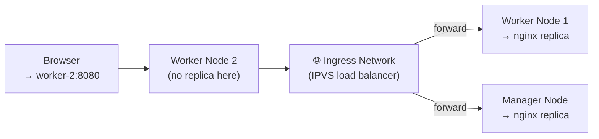

## 🎯 Objective

Understand why single-machine container deployment fails at scale, master Docker Swarm's core concepts (nodes, services, tasks, routing mesh), execute a complete hands-on lab from cluster initialization to rolling updates, and confidently compare `docker run` with `docker service create`.

---

## 🪖 The Analogy: From a Single Soldier to an Army Command System

Imagine the difference between sending **one soldier** on a mission versus running an **army**.

A single soldier (`docker run`) can do their job fine for a small task. But if they're injured (container crashes), the mission fails. They can't be in two places at once (no scaling), and you have to personally direct them for every move (manual management).

An **Army Command System** (`Docker Swarm`) changes everything:
- A **General** (Manager Node) receives the mission objective and delegates
- **Field commanders** (Scheduler) figure out which unit goes where
- **Soldiers** (Worker Nodes) execute tasks
- If a soldier falls, their mission is automatically reassigned to another
- New soldiers can be deployed instantly when the battle intensifies
- Troops are spread across multiple locations (multi-node) so no single point of failure exists

> `docker run` = Single soldier, manually deployed
> `Docker Swarm` = An army command system with commanders, field units, self-healing, and strategy

---

## 📐 Diagram 1: Docker Swarm Cluster Architecture



---

## Part 1: Why Docker Swarm Exists

### The Problem with `docker run` at Scale

```bash
docker run nginx   # Runs on THIS machine only
```

| Problem | Impact |
| :--- | :--- |
| Runs on a single machine | No redundancy — machine down = service down |
| No auto-recovery | Container crashes → stays stopped |
| No cross-machine scaling | Can't use multiple servers |
| No built-in load balancing | All traffic hits one container |
| Manual management | Every change requires human intervention |

### What Production Systems Actually Need

| Requirement | Example Scenario |
| :--- | :--- |
| **High availability** | Web app must stay up even if a node fails |
| **Auto-healing** | Container crashes → restart automatically on another node |
| **Horizontal scaling** | 10,000 users today, 100,000 tomorrow — add replicas |
| **Rolling updates** | Deploy new app version with zero downtime |
| **Load balancing** | Distribute traffic evenly across all replicas |
| **Multi-node cluster** | Use 3 physical servers as one logical system |

> **Docker Swarm solves all of these — and it's built directly into the Docker Engine. No extra installation required.**

---

## Part 2: Core Concepts

### 2.1 Swarm
A **cluster of Docker hosts** connected and working as one logical system. One swarm = one distributed computer made of many machines.

### 2.2 Nodes

| Type | Role | Can Run Containers? |
| :--- | :--- | :--- |
| **Manager Node** | Controls the cluster, stores state, schedules tasks | ✅ Yes (by default) |
| **Worker Node** | Executes the containers assigned by managers | ✅ Yes (primary role) |

> **Manager quorum:** For high availability, use an **odd number of managers** (3 or 5). Swarm uses the Raft consensus algorithm — a majority must agree on cluster state. With 3 managers, you can lose 1 and still operate.

### 2.3 Service
The **desired state declaration** — what you want Swarm to run and maintain.

> *"Run 3 instances of nginx, keep port 8080 published, always maintain 3 running replicas."*

If any replica fails, Swarm creates a new one automatically to match the desired count.

### 2.4 Task
A **single running container** within a service. A service with 3 replicas creates 3 tasks. Tasks are the atomic unit of scheduling.

### 2.5 Routing Mesh
The most powerful feature: Swarm publishes a service port on **every node in the cluster**, even nodes that aren't running the container. Any request to `<any-node-ip>:8080` is automatically forwarded to a healthy replica.

---

## Part 3: Hands-On Lab — Building a Swarm

### Part A — Initialize the Swarm

```bash
# On the machine that will become your Manager
docker swarm init
```

**Expected Output:**

```text
Swarm initialized: current node (xyz123) is now a manager.

To add a worker to this swarm, run the following command:
    docker swarm join --token SWMTKN-1-abc...xyz <MANAGER-IP>:2377
```

| Part | Meaning |
| :--- | :--- |
| `docker swarm init` | This host is now the Swarm Manager. Raft state store initialized. TLS certificates generated. |
| `SWMTKN-1-...` | The join token — a secret that authenticates workers |
| `<MANAGER-IP>:2377` | Port 2377 is the Swarm management port (TCP) |

```bash
# Verify the manager node is registered
docker node ls
```

**Expected Output:**

```text
ID             HOSTNAME    STATUS    AVAILABILITY  MANAGER STATUS
xyz123 *       manager-1   Ready     Active        Leader
```

---

### Part B — Add Worker Nodes

On each worker machine, paste the join command from the manager's output:

```bash
docker swarm join --token SWMTKN-1-abc...xyz 192.168.1.10:2377
```

| Flag | Purpose |
| :--- | :--- |
| `join` | Connect this host to an existing swarm as a worker |
| `--token` | Authentication token (prevents unauthorized nodes from joining) |
| `192.168.1.10:2377` | Manager's IP and the swarm management port |

Back on the manager, verify all nodes joined:

```bash
docker node ls
```

**Expected Output:**

```text
ID          HOSTNAME    STATUS    AVAILABILITY    MANAGER STATUS
xyz123 *    manager-1   Ready     Active          Leader
abc456      worker-1    Ready     Active
def789      worker-2    Ready     Active
```

---

### Part C — Deploy Your First Service

```bash
docker service create \
  --name webapp \
  --replicas 3 \
  -p 8080:80 \
  nginx
```

| Flag | Purpose |
| :--- | :--- |
| `service create` | Create a new service (not just a container) |
| `--name webapp` | Human-readable service name |
| `--replicas 3` | Desired number of running containers across the cluster |
| `-p 8080:80` | Publish port via routing mesh — accessible on ALL nodes at :8080 |
| `nginx` | Image to use for each task |

```bash
# List services
docker service ls

# See individual tasks and which node they're on
docker service ps webapp
```

**Expected Output of `docker service ps`:**

```text
ID          NAME        IMAGE    NODE       DESIRED STATE    CURRENT STATE
abc111      webapp.1    nginx    worker-1   Running          Running 30s ago
abc222      webapp.2    nginx    worker-2   Running          Running 30s ago
abc333      webapp.3    nginx    manager-1  Running          Running 30s ago
```

---

### Part D — Inspect the Service

```bash
# Full JSON details (useful for scripting/debugging)
docker service inspect webapp

# Human-readable format
docker service inspect --pretty webapp
```

`--pretty` shows the mode (`Replicated vs Global`), update config, endpoint spec, and placement constraints in a readable format.

---

### Part E — Scale the Service

```bash
# Black Friday incoming — scale to 6 replicas
docker service scale webapp=6

# Verify
docker service ls
docker service ps webapp
```

Swarm automatically:
- Calculates how many new tasks are needed (3 more)
- Schedules them across available nodes
- Distributes load evenly (considering resource constraints)

```bash
# Scale back down
docker service scale webapp=2
```

---

### Part F — Remove a Service

```bash
docker service rm webapp
```

Swarm removes **all tasks (containers) immediately** across all nodes, then removes the service record. No extra cleanup needed.

---

### Part G — Rolling Updates (Zero-Downtime Deployments)

This is where Swarm provides its most critical production value.

```bash
# Step 1: Deploy version 1.25
docker service create \
  --name app \
  --replicas 3 \
  nginx:1.25

# Step 2: Roll out nginx:latest — one container at a time, 10s apart
docker service update \
  --image nginx:latest \
  --update-parallelism 1 \
  --update-delay 10s \
  app
```

| Flag | Purpose |
| :--- | :--- |
| `--image nginx:latest` | The new image version to roll out |
| `--update-parallelism 1` | Update **1 replica at a time** (never more than this many simultaneously) |
| `--update-delay 10s` | Wait 10 seconds after each updated replica before updating the next |

**What happens:**
1. Swarm stops `app.1`, starts new `app.1` with `nginx:latest`
2. Waits 10 seconds (health stabilization window)
3. Updates `app.2`, waits 10 seconds
4. Updates `app.3`
5. At all times, at least 2 of 3 replicas are running — **zero downtime**

---

### Part H — Drain a Node for Maintenance

```bash
# Take a node offline for hardware maintenance
docker node update --availability drain <NODE-ID>
```

| Flag | Purpose |
| :--- | :--- |
| `--availability drain` | Stop scheduling NEW tasks here AND migrate existing tasks off this node |

Swarm immediately reschedules all tasks from the drained node to remaining active nodes. The node is still part of the swarm — just not running any containers.

```bash
# Bring it back online after maintenance
docker node update --availability active <NODE-ID>
```

---

### Part I — Understanding the Routing Mesh

```bash
# Deploy with 2 replicas out of 3 nodes
docker service create \
  --name mesh-test \
  --replicas 2 \
  -p 8080:80 \
  nginx
```

Even if `worker-2` has no replica running on it, visiting `http://<worker-2-ip>:8080` **still works**. Swarm's ingress network intercepts the request and forwards it to one of the two nodes that IS running the container.



> **How it works:** Each node runs an IPVS (IP Virtual Server) kernel module that intercepts traffic on published ports. This is the routing mesh — entirely transparent to the client.

---

## Part 4: `docker run` vs `docker service create` — The Big Picture

> **`docker run` = container-level execution** (single host, no orchestration)
> **`docker service` = cluster-level orchestration** (multi-host, self-healing)

### Feature Comparison

| Capability | `docker run` | `docker service create` |
| :--- | :--- | :--- |
| Scope | Single container | Cluster-managed service |
| Environment | Single host | Multi-node cluster |
| Scaling | Manual (run more commands) | Built-in (`--scale` / `--replicas`) |
| Load balancing | ❌ None | ✅ Routing mesh |
| Self-healing | ❌ Stays dead | ✅ Auto-recreated |
| Rolling updates | ❌ Impossible | ✅ `--update-parallelism` |
| Desired state | ❌ Fire-and-forget | ✅ Continuously enforced |
| Networking | bridge / host | overlay (multi-host) |
| Resource scheduling | Basic (current host) | Smart (finds node with free resources) |
| Production readiness | Local dev / debug | Full production ✅ |

### Common Flags — Same Purpose, Different Scope

| Purpose | `docker run` | `docker service create` |
| :--- | :--- | :--- |
| Name | `--name` | `--name` |
| Port publish | `-p 8080:80` | `-p 8080:80` (via routing mesh) |
| Environment | `-e KEY=val` | `-e KEY=val` |
| Volume mount | `-v myvol:/data` | `--mount type=volume,source=myvol,target=/data` |
| Network | `--network mynet` | `--network myoverlay` |
| Restart | `--restart always` | `--restart-condition any` |
| Resource limit | `--cpus="1.5" --memory="512m"` | `--limit-cpu 1.5 --limit-memory 512m` |

### Swarm-Only Flags (Don't Exist in `docker run`)

| Swarm Flag | Purpose |
| :--- | :--- |
| `--replicas N` | Run N container instances across the cluster |
| `--mode global` | Run exactly 1 container per node (for monitoring agents, log shippers) |
| `--update-parallelism N` | How many replicas to update simultaneously during rollout |
| `--update-delay Xs` | Wait time between updating each batch |
| `--constraint 'node.role==worker'` | Pin tasks to specific nodes by label/role |
| `--limit-cpu / --reserve-memory` | Cluster-aware resource limits (used for scheduling decisions) |
| `--placement-pref spread` | Distribute tasks evenly across nodes by label |
| `--with-registry-auth` | Pass registry credentials securely to worker nodes |

### When to Use Each

| Use `docker run` when... | Use `docker service` when... |
| :--- | :--- |
| Learning Docker basics | Running production applications |
| Quick debugging of a single container | Need high availability (>1 instance) |
| Local development | Running across multiple servers |
| One-off commands | Needing zero-downtime deployments |
| Testing locally | Load balancing is required |

---

## 📐 Diagram 2: Rolling Update Timeline

```mermaid
gantt
    title Rolling Update — nginx:1.25 to nginx:latest (3 replicas, delay 10s)
    dateFormat  ss
    axisFormat %Ss

    section Replica 1
    Running nginx:1.25     :done, r1a, 00, 05s
    Stopping               :crit, r1b, 05, 02s
    Starting nginx:latest  :active, r1c, 07, 03s
    Stable (wait 10s)      :r1d, 10, 10s

    section Replica 2
    Running nginx:1.25     :done, r2a, 00, 20s
    Stopping               :crit, r2b, 20, 02s
    Starting nginx:latest  :active, r2c, 22, 03s
    Stable (wait 10s)      :r2d, 25, 10s

    section Replica 3
    Running nginx:1.25     :done, r3a, 00, 35s
    Stopping               :crit, r3b, 35, 02s
    Starting nginx:latest  :active, r3c, 37, 03s
    Running                :r3d, 40, 05s
```

---

## Part 5: Real Industry Architecture — E-Commerce Platform

| Service Layer | Swarm Configuration | Reasoning |
| :--- | :--- | :--- |
| **Frontend (React)** | 5 replicas, `--update-delay 15s` | Stateless, user-facing — scale out freely |
| **Backend API** | 4 replicas, `--constraint node.role==worker` | Business logic — isolate from managers |
| **Redis Cache** | 3 replicas | Stateless reads — acceptable to scale |
| **MySQL Database** | 1 replica + external managed DB | Stateful — don't scale naively |
| **Log Shipper** | `--mode global` | 1 per node to capture all container logs |
| **Monitoring Agent** | `--mode global` | 1 per node for node-level metrics |

---

## 🔑 Key Terminology Glossary

**Swarm**
: A cluster of Docker hosts managed as a single system. One Swarm = many physical or virtual machines working as one.

**Manager Node**
: A Swarm node that runs the orchestrator, scheduler, and Raft consensus store. Responsible for cluster state, task scheduling, and serving the API.

**Worker Node**
: A Swarm node that executes tasks (containers) assigned by the manager. Does not make scheduling decisions.

**Service**
: The desired state declaration — the instruction to Swarm to run a certain image with certain parameters and maintain a certain replica count.

**Task**
: A single container instance within a service. If a service has 3 replicas, there are 3 tasks. The atom of Swarm scheduling.

**Routing Mesh (Ingress)**
: The built-in IPVS-based load balancer that routes incoming traffic from any node in the cluster to a healthy task, regardless of which node the task runs on.

**Overlay Network**
: A multi-host virtual network that spans all Swarm nodes, allowing containers on different physical machines to communicate using service names (DNS).

**Raft Consensus**
: The distributed algorithm Swarm uses for managers to agree on cluster state. Requires a majority (quorum) of managers to be available — this is why odd numbers of managers (1, 3, 5) are recommended.

**Global Mode**
: A service mode where Swarm runs exactly one task per node. Used for cluster-wide agents like log shippers and monitoring tools.

**Replicated Mode**
: The default service mode. Swarm runs exactly N tasks distributed across available nodes.

**Rolling Update**
: A zero-downtime deployment strategy where tasks are updated sequentially (or in configurable batches) with wait periods between each batch, ensuring the service is always partially available.

**Node Drain**
: Setting a node to `--availability drain` prevents new tasks from being scheduled on it and migrates existing tasks away, enabling safe maintenance without service disruption.

---

## 🎓 Interview Preparation

### Q1: Explain the difference between a Swarm "service" and a Swarm "task". Why does this abstraction matter?

> **Model Answer:** A **service** is the *desired state declaration* — it says "I want 3 running instances of nginx with these parameters." A **task** is a *single container instance* that Swarm creates to fulfil that desire. The service is persistent; tasks are ephemeral. When a task (container) dies, the service's desired state is no longer met, so the Swarm orchestrator immediately creates a new task to replace it — without any human intervention. This abstraction matters because it shifts the operator's mental model from "manage containers" to "declare outcomes." You never think about individual containers in Swarm — you only manage the service. The cluster handles the rest.

---

### Q2: What is the Swarm Routing Mesh, and how does it work internally?

> **Model Answer:** The Routing Mesh is Swarm's built-in ingress load balancer. When you publish a port with `docker service create -p 8080:80`, Swarm configures IPVS (Linux kernel's IP Virtual Server) on **every node** in the cluster to listen on port 8080. A client connecting to `<any-node-ip>:8080` has their traffic intercepted by that node's IPVS kernel module, which redirects it across the cluster's ingress overlay network to one of the healthy task containers — regardless of which node that container runs on. This means you can point a load balancer or DNS entry at any cluster node (or all of them) and get working traffic distribution with zero additional infrastructure. The client doesn't know or care which node or container actually handled the request.

---

### Q3: Your manager asks why you use 3 Swarm manager nodes instead of 1. Explain the tradeoff and what happens if a manager node goes down.

> **Model Answer:** Swarm managers use the **Raft distributed consensus algorithm** to maintain cluster state. Raft requires a **majority quorum** of managers to be available to make scheduling decisions. With 1 manager, the entire cluster's control plane is a single point of failure — if that node goes down, you cannot schedule new services, scale existing ones, or perform rolling updates (though existing containers continue running). With 3 managers, you can lose 1 and still have quorum (2 of 3 = majority), so the cluster remains fully operational. With 5 managers, you can lose 2. The tradeoff is that more managers means more Raft communication overhead and latency on state changes. The golden rule is: **use odd numbers of managers** (1, 3, or 5), and always fewer managers than workers. For most production setups, 3 managers across separate availability zones provides the right balance of resilience and operational simplicity.

---

## 📋 Core Commands Reference

| Action | Command |
| :--- | :--- |
| Initialize swarm | `docker swarm init` |
| Join as worker | `docker swarm join --token <TOKEN> <MGR-IP>:2377` |
| Get join token | `docker swarm join-token worker` |
| List nodes | `docker node ls` |
| Create service | `docker service create --name web --replicas 3 -p 8080:80 nginx` |
| List services | `docker service ls` |
| Inspect tasks | `docker service ps web` |
| Inspect service | `docker service inspect --pretty web` |
| Scale service | `docker service scale web=6` |
| Rolling update | `docker service update --image nginx:latest --update-parallelism 1 --update-delay 10s web` |
| Drain node | `docker node update --availability drain <NODE-ID>` |
| Reactivate node | `docker node update --availability active <NODE-ID>` |
| Remove service | `docker service rm web` |
| Leave swarm | `docker swarm leave` |

---

> **Professor's Note:** Docker Swarm is not Kubernetes — and that's a feature, not a bug. Swarm has a learning curve measured in hours, not weeks. For small-to-medium production workloads (tens of services, a few nodes), Swarm is often the right tool: built-in, simpler to operate, and perfectly capable. Understand Swarm deeply first — every concept here (nodes, services, tasks, rolling updates, overlay networking) maps directly onto a Kubernetes equivalent. Swarm is the fastest path to understanding distributed container orchestration.

**Student**: Pranav R Nair | **SAP ID**: 500121466 | **Batch**: 2(CCVT)
