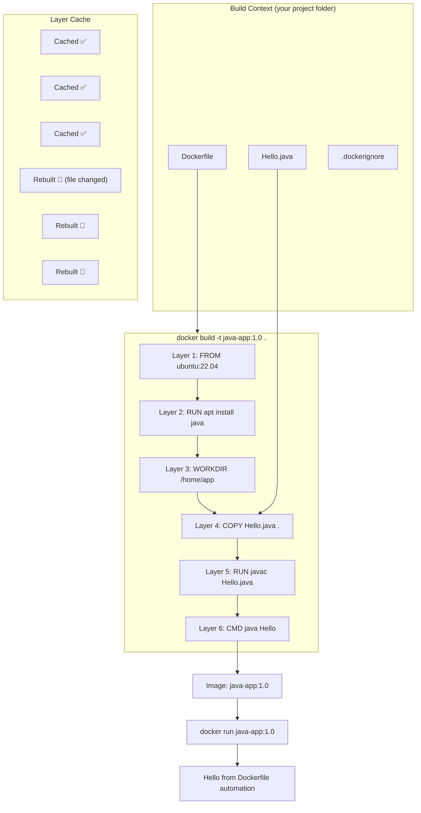
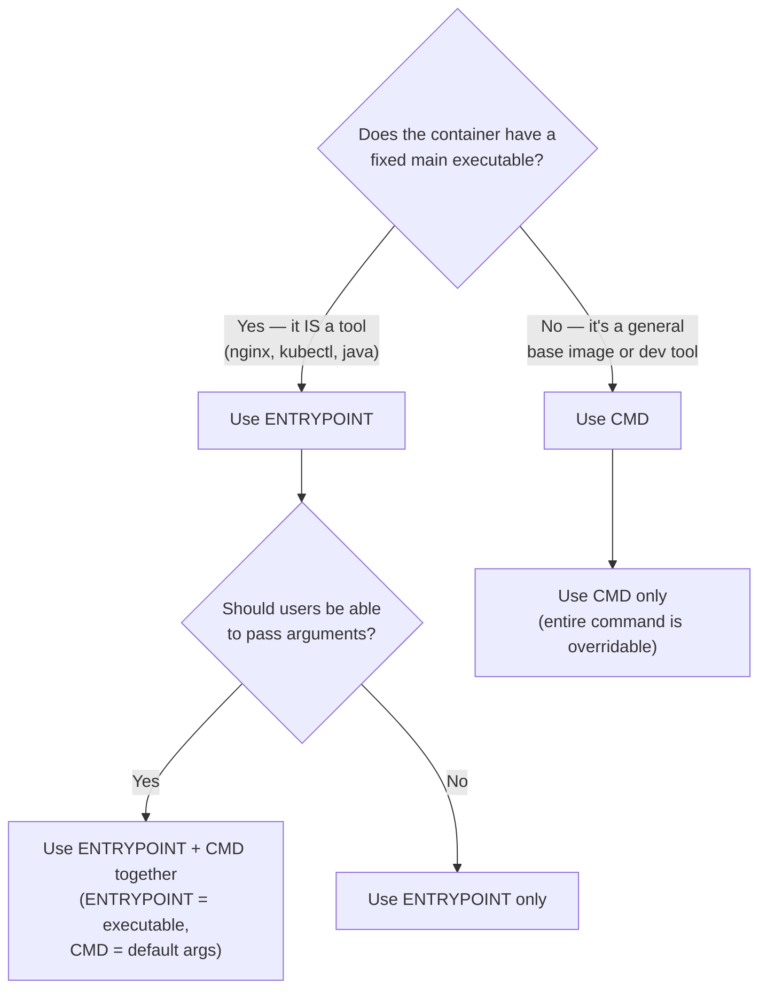

## 📚 Overview

This guide covers the **Dockerfile** — Docker's declarative build system. You'll learn why `docker commit` fails at scale, how every Dockerfile instruction works, the critical difference between **CMD** and **ENTRYPOINT**, and how to build, run, and share images the right way.

---

## 🏗️ The Analogy: Recipe Book vs Cooking from Memory

Imagine two chefs:

### Chef A: "Cooking from Memory" (`docker commit`)

Chef A walks into the kitchen, cooks a dish from memory, and takes a **photo of the finished plate**. Tomorrow, when asked to make it again, they might forget an ingredient, change a step, or use a different amount. No two plates are ever identical. If Chef A is on vacation, nobody else can replicate the dish.

### Chef B: "Following a Recipe" (Dockerfile)

Chef B writes a **precise recipe** before cooking — every ingredient, measurement, and step. Anyone can follow it and get the same dish every time. The recipe can be version-controlled ("v2: added more salt"), peer-reviewed, and used by a robot (CI/CD pipeline) to cook autonomously.

| Cooking Analogy | Docker Equivalent |
| :--- | :--- |
| Cooking from memory | Manually modifying a container + `docker commit` |
| Written recipe | Dockerfile |
| Recipe book on a shelf | Git repository |
| Robot chef following the recipe | CI/CD pipeline running `docker build` |
| Ingredient list | `apt install`, `pip install`, `COPY` instructions |
| "Serves 4" note | `EXPOSE 8080` (documentation, not enforcement) |
| "Serve immediately" instruction | `CMD` (default action, can be changed) |
| "This IS a soup" label | `ENTRYPOINT` (fixed identity, can't easily change) |

> **Key insight**: `docker commit` = cooking from memory. `Dockerfile` = a tested, versioned, shareable recipe. If it can't be rebuilt automatically, it doesn't scale.

---

## 📐 Architecture Diagram: Dockerfile Build Process



---

## 📐 CMD vs ENTRYPOINT Decision Diagram



---

# Part I: Why `docker commit` Fails at Scale

## The 5 Problems

| Problem | With `docker commit` | With Dockerfile |
| :--- | :--- | :--- |
| **Reproducibility** | ❌ No record of *how* Java was installed | ✅ Every step is written declaratively |
| **Version control** | ❌ Cannot review changes in Git | ✅ `git diff` shows exactly what changed |
| **Determinism** | ❌ Manual steps vary each time | ✅ Same Dockerfile = same image, every time |
| **CI/CD integration** | ❌ Pipelines can't replay interactive commands | ✅ `docker build` runs autonomously |
| **Maintenance** | ❌ Updating Java = redo everything manually | ✅ Change one line, rebuild |

### The Rule

> For **learning and debugging**, `docker commit` is acceptable.
> For **automation, CI/CD, production, and team projects**, **Dockerfile is mandatory**.

---

# Part II: Dockerfile Instructions — Complete Reference

## `FROM` — Set the Base Image

```dockerfile
FROM ubuntu:22.04
```

* **Must** be the first instruction in every Dockerfile
* Defines the OS or runtime environment
* Common choices: `ubuntu`, `alpine`, `python:3.9-slim`, `node:18-alpine`

## `RUN` — Execute Commands at Build Time

```dockerfile
RUN apt update && apt install -y openjdk-17-jdk
```

* Runs commands **during the build** (not at container start)
* Each `RUN` creates a **new image layer**
* **Best practice**: Combine related commands with `&&` to minimize layers

## `WORKDIR` — Set the Working Directory

```dockerfile
WORKDIR /home/app
```

* Sets the working directory for all subsequent `RUN`, `CMD`, `COPY`, `ADD` instructions
* Creates the directory if it doesn't exist
* Replaces `RUN cd /path` — which doesn't persist across layers

## `COPY` — Copy Files from Host to Image

```dockerfile
COPY Hello.java .
```

* Copies files from the **build context** (your project folder) into the image
* The `.` refers to the `WORKDIR` set earlier
* **Preferred** over `ADD` for simple file copying

## `ADD` — Copy with Extras (Use Sparingly)

```dockerfile
ADD app.tar.gz /home/app
```

* Same as `COPY`, plus: auto-extracts `.tar`, `.gz` archives and supports URLs
* **Best practice**: Use `COPY` unless you specifically need auto-extraction

## `ENV` — Set Environment Variables

```dockerfile
ENV JAVA_HOME=/usr/lib/jvm/java-17-openjdk-amd64
```

* Persists in the running container (accessible to the application)
* Available to subsequent `RUN` instructions during the build

## `EXPOSE` — Document Listening Ports

```dockerfile
EXPOSE 8080
```

* **Does NOT** publish the port — this is **documentation only**
* You still need `-p 8080:8080` when running the container
* Useful for tools and humans to know which ports the app uses

---

# Part III: CMD vs ENTRYPOINT — The Most Confused Concept

## `CMD` — Default Command (Easily Overridden)

```dockerfile
FROM ubuntu
CMD ["echo", "Hello World"]
```

**Without override:**

```bash
$ docker run myimage
Hello World
```

**With override — CMD is completely replaced:**

```bash
$ docker run myimage echo "Hi"
Hi
```

> **Mental model**: CMD says "do this by default, but the user can change it."

## `ENTRYPOINT` — Fixed Executable (Arguments Appended)

```dockerfile
FROM ubuntu
ENTRYPOINT ["echo"]
```

**Without arguments:**

```bash
$ docker run myimage
           # (prints empty line — echo with no args)
```

**With arguments — appended to ENTRYPOINT:**

```bash
$ docker run myimage Hello
Hello
```

> **Mental model**: ENTRYPOINT says "this container IS this program. User arguments are passed to it."

## ENTRYPOINT + CMD Together (Best Practice Pattern)

```dockerfile
FROM ubuntu
ENTRYPOINT ["echo"]
CMD ["Hello World"]
```

**How Docker resolves the final command:**

```text
Final command = ENTRYPOINT + CMD
             = ["echo"] + ["Hello World"]
             = echo Hello World
```

**Without arguments** — uses CMD as default:

```bash
$ docker run myimage
Hello World
```

**With arguments** — CMD is replaced by user args:

```bash
$ docker run myimage Hi Pranav
Hi Pranav
```

## Override Behavior Summary

| Scenario | CMD | ENTRYPOINT |
| :--- | :--- | :--- |
| `docker run image` | ✅ Used as default | ✅ Used as executable |
| `docker run image ls` | 🔄 Replaced by `ls` | ➕ `ls` appended as argument |
| `docker run --entrypoint bash image` | ❌ Ignored entirely | 🔄 Replaced by `bash` |

## ⚠️ Common Misconception: You Cannot Run Two Separate Commands

```dockerfile
# ❌ WRONG — this does NOT run echo AND java separately
ENTRYPOINT ["echo", "Pranav"]
CMD ["java", "Hello"]
```

Docker **concatenates** them into one command:

```bash
echo Pranav java Hello
# Output: "Pranav java Hello" (just prints text, doesn't run Java)
```

> **Rule**: ENTRYPOINT defines the **executable**. CMD provides the **default arguments**. They are NOT sequential commands.

**If you need to run multiple commands**, use a shell wrapper:

```dockerfile
ENTRYPOINT ["sh", "-c", "echo Pranav && java Hello"]
```

---

## Exec Form vs Shell Form

| Form | Syntax | Runs As | PID 1 | Signal Handling |
| :--- | :--- | :--- | :--- | :--- |
| **Exec** (recommended) | `CMD ["nginx", "-g", "daemon off;"]` | Direct execution | ✅ The process IS PID 1 | ✅ Receives SIGTERM properly |
| **Shell** (avoid) | `CMD nginx -g "daemon off;"` | Wrapped in `/bin/sh -c` | ❌ `sh` is PID 1, not nginx | ❌ SIGTERM goes to sh, not nginx |

> **Always use exec form** (JSON array syntax) in production. Shell form causes graceful shutdown failures because signals don't reach your application.

---

## When to Use What

| Use Case | Recommendation | Example |
| :--- | :--- | :--- |
| General-purpose image with overridable default | `CMD` only | `CMD ["python", "app.py"]` |
| Container behaves like a specific CLI tool | `ENTRYPOINT` only | `ENTRYPOINT ["kubectl"]` |
| Fixed executable with configurable defaults | `ENTRYPOINT` + `CMD` | `ENTRYPOINT ["nginx"]` + `CMD ["-g", "daemon off;"]` |

### Real-World Examples

**NGINX (web server):**

```dockerfile
ENTRYPOINT ["nginx"]
CMD ["-g", "daemon off;"]
# User can override: docker run nginx -c /custom/nginx.conf
```

**kubectl (CLI tool):**

```dockerfile
ENTRYPOINT ["kubectl"]
CMD ["version"]
# User can override: docker run kubectl-image get pods
```

**Java application (fixed process):**

```dockerfile
CMD ["java", "Hello"]
# Or: ENTRYPOINT ["java", "Hello"]
# No shell, no echo, one main process.
```

---

# Part IV: Hands-On Lab — Build a Java App with Dockerfile

## Project Structure

```text
java-docker/
├── Dockerfile
└── Hello.java
```

## Hello.java

```java
public class Hello {
    public static void main(String[] args) {
        System.out.println("Hello from Dockerfile automation");
    }
}
```

## Dockerfile

```dockerfile
FROM ubuntu:22.04

RUN apt update && apt install -y openjdk-17-jdk

WORKDIR /home/app

COPY Hello.java .

RUN javac Hello.java

CMD ["java", "Hello"]
```

## Build

```bash
docker build -t java-app:1.0 .
```

| Flag | Purpose |
| :--- | :--- |
| `-t java-app:1.0` | Name and tag for the resulting image |
| `.` | Build context — current directory |
| `-f test.Dockerfile` | (Optional) Use a non-default Dockerfile |
| `--no-cache` | (Optional) Ignore layer cache, rebuild everything |

## Run

```bash
docker run java-app:1.0
```

**Output:** `Hello from Dockerfile automation`

## Override CMD at Runtime

```bash
docker run -it java-app:1.0 bash
```

* CMD (`java Hello`) is replaced by `bash`
* You get a shell inside the container with Java and your app already installed

## Rebuild After Code Change

```bash
# Edit Hello.java, then:
docker build -t java-app:1.1 .
```

* **Layers 1–3** (FROM, RUN, WORKDIR) are **cached** ✅
* **Layers 4–6** (COPY, RUN javac, CMD) are **rebuilt** 🔄
* Result: rebuild takes seconds instead of minutes

## Share the Image

```bash
# Tag for Docker Hub
docker tag java-app:1.0 nairp126/java-app:1.0

# Push
docker push nairp126/java-app:1.0

# Pull on any machine
docker pull nairp126/java-app:1.0
docker run nairp126/java-app:1.0
```

---

## 📋 Quick Rule to Remember

```text
ENTRYPOINT = WHAT runs        (the executable)
CMD        = WITH WHAT         (default arguments)
Dockerfile = Infrastructure as Code
```

---

# 📖 Glossary of Key Terms

| Term | Definition |
| :--- | :--- |
| **Dockerfile** | A declarative text file containing step-by-step instructions to build a Docker image. It replaces manual container modification with reproducible, version-controlled automation. |
| **`FROM`** | The first instruction in every Dockerfile. Specifies the base image (OS or runtime) on which all subsequent layers are built. |
| **`RUN`** | Executes a command during the image build process. Each `RUN` creates a new read-only layer. Used for installing packages and configuring the environment. |
| **`COPY`** | Copies files from the host machine's build context into the image filesystem. Preferred over `ADD` for simple file transfers. |
| **`ADD`** | Like `COPY`, but with additional capabilities: auto-extracts tar archives and can fetch URLs. Use only when you need these features. |
| **`CMD`** | Specifies the default command or arguments when a container starts. Easily overridden by appending a command to `docker run`. |
| **`ENTRYPOINT`** | Defines the fixed executable for a container. Unlike CMD, it is not replaced by `docker run` arguments — arguments are appended instead. |
| **Exec Form** | The JSON array syntax for CMD/ENTRYPOINT: `CMD ["python", "app.py"]`. Runs the process directly as PID 1 with proper signal handling. Always preferred. |
| **Shell Form** | The string syntax for CMD/ENTRYPOINT: `CMD python app.py`. Wraps the command in `/bin/sh -c`, causing signal handling problems. Avoid in production. |
| **Layer** | A read-only filesystem diff created by each Dockerfile instruction. Layers are cached and shared between images, enabling fast rebuilds and efficient storage. |
| **Layer Caching** | Docker's optimization where unchanged layers are reused from cache during rebuilds. If layer N changes, layers N+1 through the end are rebuilt. |
| **Build Context** | The directory (and its contents) sent to the Docker daemon when running `docker build`. Controlled by `.dockerignore`. |
| **Infrastructure as Code (IaC)** | The practice of defining infrastructure (servers, environments, containers) through declarative code files rather than manual configuration. Dockerfile is IaC for containers. |

---

# 🎓 Exam & Interview Preparation

## Potential Interview Questions

### Q1: "Explain the difference between CMD and ENTRYPOINT. When would you use each?"

**Model Answer**: `CMD` specifies the **default command or arguments** for a container — it is completely replaced if the user provides a command at `docker run`. `ENTRYPOINT` defines the **fixed executable** — user arguments are **appended** to it rather than replacing it. Use `CMD` alone when the container's behavior should be easily overridable (e.g., a development image). Use `ENTRYPOINT` alone when the container should behave like a specific binary (e.g., `kubectl`). Use **both together** (the recommended pattern) when you want a fixed executable with configurable default arguments — `ENTRYPOINT ["nginx"]` + `CMD ["-g", "daemon off;"]` lets users override the config flags while keeping nginx as the fixed process.

---

### Q2: "Why is exec form recommended over shell form for CMD and ENTRYPOINT?"

**Model Answer**: Exec form (`CMD ["nginx", "-g", "daemon off;"]`) runs the process **directly as PID 1** inside the container. Shell form (`CMD nginx -g "daemon off;"`) wraps the command in `/bin/sh -c`, making **sh** the PID 1 process and nginx a child. This matters for **signal handling**: when Docker sends `SIGTERM` (during `docker stop`), it goes to PID 1. With exec form, nginx receives SIGTERM and gracefully shuts down. With shell form, `sh` receives SIGTERM but doesn't forward it to nginx — resulting in a 10-second timeout followed by SIGKILL, which is an ungraceful termination that can cause data loss or interrupted requests.

---

### Q3: "What is Docker layer caching and how does it affect Dockerfile instruction order?"

**Model Answer**: Docker caches each layer (created by each instruction) by its content hash. During a rebuild, if a layer's inputs haven't changed, Docker reuses the cached version instead of re-executing the instruction. **However**, if layer N is invalidated (e.g., a source file changed), all subsequent layers N+1 through the end must be rebuilt. This means **instruction order matters**: put rarely-changing instructions first (FROM, RUN apt install) and frequently-changing ones last (COPY source code). For example, copying `requirements.txt` and running `pip install` before copying application code means dependency installation is cached even when code changes — saving minutes per build.

---

**Student**: Pranav R Nair | **Batch**: 2(CCVT) | **SAP ID**: 500121466
