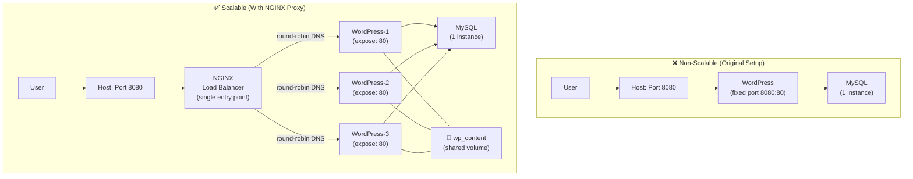
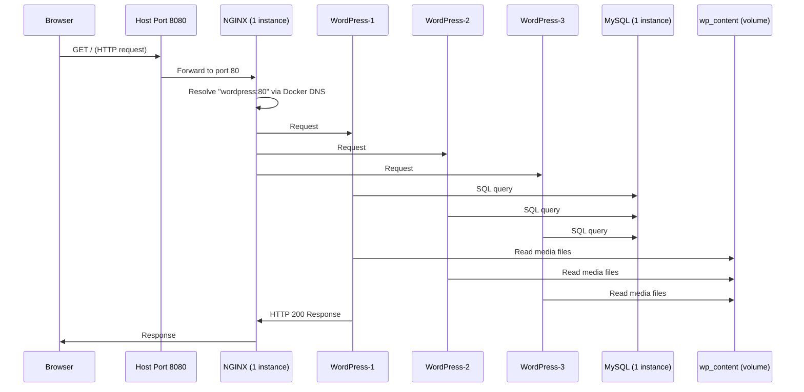
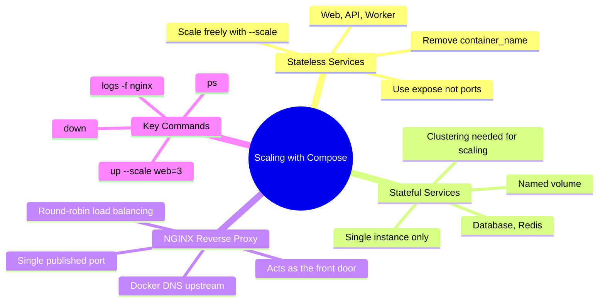

## 🎯 Objective

Understand the principle of **horizontal scaling** with Docker Compose, learn the critical distinction between stateless and stateful services, and build a production-style scalable architecture using an NGINX reverse proxy in front of multiple WordPress replicas.

---

## 🍕 The Analogy: A Pizza Restaurant at Peak Hour

Imagine a pizza restaurant getting slammed on a Friday night.

You have one **cashier** (NGINX — the single front door, handles all incoming customers), three **chefs** (WordPress replicas — all doing the same work), and one **storage room** with all the ingredients and recipes (MySQL + shared volume — cannot be duplicated without major coordination).

You can hire more chefs to handle the load — but you cannot just **photocopy** the storage room. The storage room is stateful: it has one real location and duplicating it without synchronization would cause recipes to conflict. The chefs are **stateless**: each one is interchangeable and follows the same recipes independently.

> **Stateless service** (Chef) → Scale freely with `--scale`
> **Stateful service** (Storage Room) → Requires clustering before scaling

---

## 📐 Diagram 1: Before & After Scaling Architecture



---

## Part 1: The Scaling Command — Explained

```bash
docker compose up --scale web=3 --scale worker=2 -d
```

| Part | What It Does |
| :--- | :--- |
| `up` | Creates and starts containers |
| `--scale web=3` | Runs **3 replicas** of the `web` service |
| `--scale worker=2` | Runs **2 replicas** of the `worker` service |
| Services not mentioned | Stay at **1 instance** by default |
| `-d` | Detached mode — runs in background |

### Basic Scalable Setup

```yaml
# docker-compose.yml — simple scalable web + worker
services:
  web:
    image: nginx:latest
    ports:
      - "8080-8082:80"   # Port RANGE: Docker maps web-1→8080, web-2→8081, web-3→8082
    networks:
      - app-network

  worker:
    image: alpine:latest
    command: sh -c "while true; do echo 'Working...'; sleep 5; done"
    networks:
      - app-network

  redis:
    image: redis:alpine
    networks:
      - app-network

networks:
  app-network:
```

```bash
docker compose up --scale web=3 --scale worker=2 -d
docker compose ps
```

**Expected Output:**

```text
NAME                    PORTS                    STATUS
example-web-1           0.0.0.0:8080->80/tcp     Up
example-web-2           0.0.0.0:8081->80/tcp     Up
example-web-3           0.0.0.0:8082->80/tcp     Up
example-worker-1                                 Up
example-worker-2                                 Up
example-redis-1                                  Up
```

---

## Part 2: The Golden Rule — What Can and Cannot Scale

This is the most important concept in horizontal scaling:

| Service Type | Can Scale? | Why | Examples |
| :--- | :--- | :--- | :--- |
| **Stateless** | ✅ Yes — freely | No local state, each replica is identical | Web servers, API workers, queue consumers |
| **Stateful** | ❌ No — needs clustering | Shared mutable state (disk, memory) causes conflicts | PostgreSQL, MySQL, Redis with persistence |

```yaml
services:
  web:          # ✅ Stateless — scale freely
    image: nginx

  worker:       # ✅ Stateless — scale freely
    image: python

  database:     # ❌ Stateful — DO NOT scale
    image: postgres
    volumes:
      - data:/var/lib/postgresql/data  # Two containers writing here = data corruption
```

> **Why can't you scale a database?** Two MySQL instances sharing the same volume would both write to the same data files with no coordination — this causes immediate data corruption. True database scaling requires **clustering solutions** (MySQL Group Replication, Galera Cluster, PostgreSQL Citus) which handle distributed consensus.

---

## Part 3: Port Handling Strategies for Scalable Services

This is the critical gotcha that prevents most people from scaling successfully.

| Strategy | YAML | Behaviour | Scalable? |
| :--- | :--- | :--- | :--- |
| **Fixed port** | `ports: ["8080:80"]` | One port, one container | ❌ Fails on `--scale > 1` |
| **Port range** | `ports: ["8080-8085:80"]` | Docker assigns 8080, 8081, 8082... | ✅ Up to range width |
| **Random port** | `ports: ["80"]` | Docker picks any free host port | ✅ Unlimited |
| **Expose only** | `expose: ["80"]` | Internal network only — no host access | ✅ Unlimited (use with proxy) |

### The Best Approach for Production: `expose` + Reverse Proxy

```yaml
wordpress:
  expose:
    - "80"        # Internal only — all replicas accessible by service name
  # Do NOT use: ports: - "8080:80"   ← this breaks at scale > 1
```

Internal service communication still works perfectly. All WordPress replicas are accessible on the custom Docker network at `wordpress:80` — Docker's built-in DNS load balances across all replicas.

---

## Part 4: The Problem — Original WordPress Setup Cannot Scale

```yaml
# Original docker-compose.yml — NOT scalable
services:
  mysql:
    image: mysql:5.7
    container_name: mysql       # ← hard-coded name also blocks scaling
    volumes:
      - mysql_data:/var/lib/mysql
    networks:
      - wordpress-network

  wordpress:
    image: wordpress:latest
    container_name: wordpress   # ← blocks scaling (name conflict)
    ports:
      - "8080:80"               # ← BLOCKS scaling (port conflict)
    depends_on:
      - mysql
    networks:
      - wordpress-network
```

If you run:

```bash
docker compose up --scale wordpress=3
```

**Error 1:**

```text
ERROR: Bind for 0.0.0.0:8080 failed: port is already allocated
```

**Error 2 (if you try to scale MySQL):**

```text
ERROR: Volume conflict — multiple containers can't share mysql_data
```

> **Root Cause Analysis:** The fixed port `"8080:80"` can only bind to host port 8080 once. The second WordPress replica also tries to bind 8080 → instant crash. The `container_name:` key has the same problem — Docker container names must be globally unique.

---

## Part 5: The Solution — Three-Tier Scalable Architecture

### The Three-Step Fix

#### Step 1 — Remove `ports` from WordPress, use `expose`

```yaml
wordpress:
  image: wordpress:latest
  # REMOVE: container_name (blocks scaling)
  # REMOVE: ports: - "8080:80"
  expose:
    - "80"             # Internal only — available to NGINX on the same network
```

#### Step 2 — Add NGINX as the single entry point

```yaml
nginx:
  image: nginx:latest
  ports:
    - "8080:80"        # NGINX is the ONLY container with a published port
  volumes:
    - ./nginx.conf:/etc/nginx/nginx.conf
  depends_on:
    - wordpress
  networks:
    - wordpress-network
```

#### Step 3 — Configure NGINX upstream with Docker DNS

```nginx
events {}

http {
    upstream wordpress {
        server wordpress:80;   # Docker DNS resolves "wordpress" to ALL replicas
                               # and automatically round-robins requests
    }

    server {
        listen 80;
        location / {
            proxy_pass http://wordpress;
            proxy_set_header Host $host;
            proxy_set_header X-Real-IP $remote_addr;
        }
    }
}
```

> **The Magic of Docker DNS:** When NGINX resolves `wordpress:80`, Docker's embedded DNS server returns the IP addresses of **all running replicas** with that service name. NGINX then distributes requests across them using round-robin. You get load balancing for free — no extra configuration needed.

---

## Part 6: The Complete Scalable `docker-compose.yml`

```yaml
services:
  mysql:
    image: mysql:5.7
    # NO container_name — allows compose to manage naming
    environment:
      MYSQL_ROOT_PASSWORD: secret
      MYSQL_DATABASE: wordpress
      MYSQL_USER: wpuser
      MYSQL_PASSWORD: wppass
    volumes:
      - mysql_data:/var/lib/mysql    # Named volume — single instance only
    networks:
      - wordpress-network

  wordpress:
    image: wordpress:latest
    # NO container_name — required for scaling
    # NO ports — use expose instead
    environment:
      WORDPRESS_DB_HOST: mysql
      WORDPRESS_DB_USER: wpuser
      WORDPRESS_DB_PASSWORD: wppass
      WORDPRESS_DB_NAME: wordpress
    volumes:
      - wp_content:/var/www/html/wp-content  # Shared uploads volume
    expose:
      - "80"                                  # Internal only
    depends_on:
      - mysql
    networks:
      - wordpress-network

  nginx:
    image: nginx:latest
    ports:
      - "8080:80"                             # Single public entry point
    volumes:
      - ./nginx.conf:/etc/nginx/nginx.conf
    depends_on:
      - wordpress
    networks:
      - wordpress-network

volumes:
  mysql_data:
  wp_content:

networks:
  wordpress-network:
```

### Running and Scaling

```bash
# Start the full stack with 3 WordPress replicas
docker compose up --scale wordpress=3 -d

# Verify all containers
docker compose ps
```

**Expected Output:**

```text
NAME                       PORTS
wordpress-wordpress-1      80/tcp
wordpress-wordpress-2      80/tcp
wordpress-wordpress-3      80/tcp
wordpress-nginx-1          0.0.0.0:8080->80/tcp
wordpress-mysql-1          3306/tcp
```

```bash
# Scale up to 5 instances (zero-downtime on a running stack)
docker compose up --scale wordpress=5 -d

# Scale back down
docker compose up --scale wordpress=1 -d

# Monitor NGINX routing logs
docker compose logs -f nginx

# Shut everything down
docker compose down
```

---

## 📐 Diagram 2: Request Flow Through the Scalable Stack



---

## Part 7: Why the Shared Volume Matters

All WordPress replicas must see the **same uploaded files** (images, plugins, themes). Without a shared volume, a file uploaded while WordPress-1 handled the request would only exist on WordPress-1's container filesystem — the next request routed to WordPress-2 would return a 404 for that file.

```yaml
wordpress:
  volumes:
    - wp_content:/var/www/html/wp-content  # All replicas mount the SAME volume
```

> **Production Note:** In a real production environment with many nodes, you'd replace this named volume with a **distributed filesystem** (NFS, AWS EFS, GlusterFS) or an **object store** (AWS S3) to allow scaling across multiple host machines. Named volumes only work when all replicas run on the same Docker host.

---

## 🔧 Common Pitfalls

| Pitfall | Error Message | Fix |
| :--- | :--- | :--- |
| Fixed port on scalable service | `Bind for 0.0.0.0:8080 failed` | Replace `ports` with `expose` |
| `container_name` on scalable service | `Container name already in use` | Remove `container_name` entirely |
| Scaling a stateful database | Data corruption or volume lock errors | Use a single DB instance; use clustering if horizontal DB scale is needed |
| NGINX not picking up new replicas | New replicas not receiving traffic | NGINX must resolve DNS at request time; add `resolver 127.0.0.11 valid=5s;` in NGINX config for dynamic re-resolution |
| `depends_on` without healthcheck | WordPress starts before MySQL is ready | Add `healthcheck` to MySQL and `condition: service_healthy` |

---

## 🔑 Key Terminology Glossary

**Horizontal Scaling**
: Adding more identical instances (replicas) of a service to distribute load, rather than making one instance bigger (vertical scaling). Achieved in Docker Compose with `--scale`.

**Stateless Service**
: A service that holds no persistent local state between requests. Every replica is functionally identical and interchangeable. Safe to scale freely.

**Stateful Service**
: A service that maintains persistent data (on disk or in memory) that must be shared or coordinated between instances. Requires clustering software before scaling.

**`expose`**
: A Compose key that makes a port available **within the Docker network only** — not to the host machine. Essential for scalable services behind a reverse proxy.

**`ports`**
: A Compose key that publishes a port on the **host machine** (`hostPort:containerPort`). Only one container can bind to a given host port — using this on a scalable service causes errors.

**Reverse Proxy**
: A server (NGINX in this case) that sits in front of backend services, receives all incoming requests, and forwards them to one of many backend replicas. Provides load balancing and a single public entry point.

**Load Balancing**
: The distribution of incoming traffic across multiple backend instances to prevent any single instance from being overwhelmed.

**Docker DNS Round-Robin**
: Docker's built-in DNS resolves a service name to the IP addresses of all running replicas of that service, cycling through them in order. NGINX automatically uses this for upstream load balancing.

**Upstream Block (NGINX)**
: The NGINX configuration that defines a group of backend servers (replicas) to distribute requests to. When the `server` directive uses a Docker service name, Docker DNS handles the replica resolution.

**Named Volume (Shared)**
: A Docker-managed volume mounted by multiple containers simultaneously, allowing all replicas to access the same data. Required to share WordPress uploads across replicas.

---

## 🎓 Interview Preparation

### Q1: Why can't you run `docker compose up --scale wordpress=3` on the original WordPress Compose file without modifications?

> **Model Answer:** Two reasons. First, the original file has a **fixed port mapping** `ports: ["8080:80"]`. Each WordPress replica tries to bind to host port 8080, but a host port can only be bound once — the second replica immediately fails with "port already allocated." Second, the original file uses `container_name: wordpress`, which specifies an explicit container name. Container names must be unique across the entire Docker daemon, so the second replica also fails with "container name already in use." The fix is to remove both `ports` and `container_name` from the WordPress service, replace `ports` with `expose: ["80"]`, and add an NGINX reverse proxy as the single container with a published port.

---

### Q2: Explain how NGINX load balances across multiple WordPress replicas without configuring individual IP addresses

> **Model Answer:** Docker Compose runs an **embedded DNS resolver** at `127.0.0.11` inside every container. When NGINX resolves the upstream hostname `wordpress:80`, this DNS server returns the IP addresss of every running replica of the `wordpress` service. NGINX receives multiple A records for the same hostname and distributes requests across them in round-robin order by default. This means you never touch the NGINX config when scaling — just run `docker compose up --scale wordpress=5` and NGINX automatically starts routing to the new replicas. The critical production caveat is that NGINX caches DNS responses; in long-running scenarios, you must add `resolver 127.0.0.11 valid=5s;` in the NGINX server block to force periodic re-resolution so that newly added or removed replicas are picked up.

---

### Q3: A senior engineer says "scale your web tier, not your database." What does this mean architecturally, and what would you actually do if the database becomes the bottleneck?

> **Model Answer:** It means that stateless services (web, API, worker) can be scaled horizontally with no coordination overhead — every replica is identical, shares no local state, and any replica can handle any request. Databases are stateful: all replicas must share the same data, writes must be coordinated to prevent conflicts, and reads must be consistent. Simply running two MySQL containers sharing the same volume volume would cause immediate data file corruption. If MySQL becomes the bottleneck, the proper solutions are: (1) **Read replicas** — one MySQL primary handles writes, multiple read-only replicas handle SELECT queries, the application routes appropriately; (2) **Connection pooling** — tools like PgBouncer or ProxySQL reduce connection overhead; (3) **Vertical scaling** — give the single MySQL instance more CPU and RAM; (4) **Database clustering** — MySQL Group Replication or Galera Cluster for true multi-master scaling, but this is complex to operate. The mantra is: scale stateless replicas first, defer database scaling, and choose the database solution that matches your consistency and availability requirements.

---

## 📋 Quick Reference Summary



---

> **Professor's Note:** The pattern of `expose` + reverse proxy is not just for Docker Compose — it maps directly to how Kubernetes works. Pods (replicas) expose ports internally; a Service object routes traffic across them. Mastering this pattern in Compose is your first step toward understanding Kubernetes architecture.

**Student**: Pranav R Nair | **SAP ID**: 500121466 | **Batch**: 2(CCVT)
