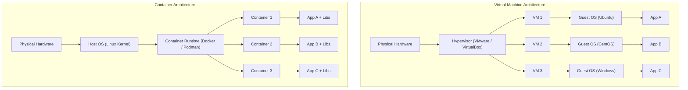
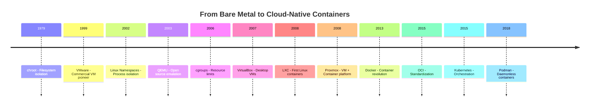

## 📚 Overview

This unit traces the evolution from bare-metal servers to virtual machines to containers, explaining **why** each technology emerged, **what problems** it solved, and **how** the modern container ecosystem (Docker, Podman, Kubernetes) came to dominate cloud-native computing.

---

## 🏗️ The Analogy: Shipping Containers Changed the World

Before diving into technical concepts, consider this real-world parallel:

### Before Shipping Containers (1950s)

Goods were shipped as **loose cargo** — barrels, crates, sacks — each a different shape and size. Loading a ship required specialized labor for every item type. Ports were slow, theft was rampant, and goods were often damaged. Every port had different equipment and procedures.

### After Shipping Containers (1960s)

Malcolm McLean introduced the **standardized shipping container** — a uniform steel box that could be loaded by crane, stacked on ships, moved to trains, and delivered by truck. The contents didn't matter; the **interface** was standardized.

### The Parallel to Software

| Shipping Industry | Software Industry |
| :--- | :--- |
| Loose cargo (different sizes) | Apps with unique dependencies, configs |
| Each port has different equipment | "Works on my machine, not on yours" |
| Standardized container (uniform box) | Docker container (standardized runtime) |
| Load once, ship anywhere | Build once, run anywhere |
| Container doesn't care what's inside | Container doesn't care if it's Python, Node, or Go |
| Ships, trains, trucks all support it | Laptops, servers, cloud — all support it |

> **Key insight**: Just as shipping containers didn't change **what** was shipped, software containers didn't change **what** applications do. They standardized **how** applications are packaged, shipped, and run.

---

## 📐 Architecture Diagram: VMs vs Containers



**Key difference**: VMs virtualize **hardware** (each gets a full OS). Containers virtualize the **OS** (they share one kernel).

---

## 📐 Evolution Timeline Diagram



---

# Part I: Virtualization Era (1999–2008)

## 1. The Original Problem: Hardware Utilization

### Before virtualization (1990s)

* **One OS per physical machine** — a database server, a web server, and a mail server each needed separate hardware
* Average CPU utilization: **5–15%** (85% wasted)
* Testing multiple environments required multiple physical machines
* Hardware costs were enormous

This drove the need for **hardware virtualization** — running multiple operating systems on a single physical machine.

---

## 2. VMware — The Commercial Pioneer (1999)

| Aspect | Details |
| :--- | :--- |
| First release | **1999** |
| Type | Type-2 (Workstation), later Type-1 (ESXi) |
| License | **Proprietary / Closed source** |
| Cost | Paid (enterprise licensing) |

### Why VMware mattered

* First mainstream **x86 virtualization** — proved you could run multiple OSes on commodity hardware
* Enterprise-grade **isolation** — each VM is completely independent
* Enabled **server consolidation** — run 10 VMs on 1 server instead of buying 10 servers

### Limitations

* **Heavy**: Each VM runs a full OS (1–2 GB RAM minimum)
* **Slow provisioning**: Booting a VM takes minutes
* **Expensive**: Enterprise licenses cost thousands per host

---

## 3. QEMU — Open Source Foundation (2003)

| Aspect | Details |
| :--- | :--- |
| First release | **2003** |
| License | **GPL / LGPL** (fully open source) |
| Type | Emulator + virtualizer |

### Key characteristics

* Can **emulate different CPU architectures** (run ARM code on x86)
* Combined with **KVM** (Kernel-based Virtual Machine), achieves **near-native performance**
* Foundation for many cloud platforms (OpenStack, Proxmox)

### Adoption

* Linux power users and cloud providers
* Embedded and cross-architecture testing
* Backbone of most open-source virtualization

---

## 4. VirtualBox — Desktop Convenience (2007)

| Aspect | VirtualBox (Sun) | Oracle VirtualBox |
| :--- | :--- | :--- |
| First release | **2007** | **2010** (Oracle acquired Sun) |
| Core engine | GPLv2 (open source) | GPLv2 (open source) |
| Extension Pack | Proprietary | Proprietary |

### Important distinction

* VirtualBox and Oracle VirtualBox are the **same product** — Oracle acquired Sun Microsystems in 2010
* The **Extension Pack** (USB 2/3, RDP, PXE boot) is **closed source** and requires a separate license for commercial use

### Adoption

* Developers running Linux on Windows (or vice versa)
* Educational institutions (free and cross-platform)
* Desktop virtualization for testing

---

## 5. Why VMs Weren't Enough (The Container Pressure)

By 2008, VMs were mature but had inherent limitations:

| Problem | Impact |
| :--- | :--- |
| Slow boot (minutes) | Can't scale rapidly during traffic spikes |
| High RAM/CPU overhead | Each VM wastes resources on a full OS |
| Poor microservice fit | Running 50 VMs for 50 tiny services is wasteful |
| Environment drift | "Works on my VM" ≠ "Works in production" |

This created demand for **lightweight, fast, portable isolation** — containers.

---

# Part II: The Container Revolution (2008–Present)

## 6. The Foundation: Linux Kernel Isolation Primitives

Containers did **not** appear suddenly. They were built on decades of Linux kernel development:

| Feature | Year | Purpose | Analogy |
| :--- | :--- | :--- | :--- |
| `chroot` | 1979 | Filesystem isolation | "A room with its own filing cabinet" |
| Namespaces | 2002–2008 | Process, network, user isolation | "Each room can't see other rooms" |
| cgroups | 2006 | Resource limits (CPU, RAM, I/O) | "Each room has a power meter with limits" |

Together, these primitives let the kernel create **isolated environments** that share the same OS — the foundation of every container runtime.

---

## 7. LXC — The First Real Containers (2008)

| Aspect | Details |
| :--- | :--- |
| First release | **2008** |
| License | **LGPL / GPL** (fully open source) |
| Type | OS-level virtualization |
| Target users | System administrators |

### What LXC did right

* First **practical container system** on Linux
* **Near-native performance** — no hypervisor overhead
* No full OS needed per container

### Why LXC didn't go mainstream

* **Complex CLI** — required deep Linux knowledge
* **No image standard** — no way to package and share containers
* **No registry** — no "Docker Hub" equivalent
* **Sysadmin-focused** — developers couldn't use it easily

LXC was **powerful but unfriendly**. It needed someone to make it accessible.

---

## 8. Docker — The Breakthrough (2013)

### What Docker changed (but did NOT invent)

Docker **did not invent containers**. It **productized** them by adding the developer experience layer that LXC lacked.

### Docker's Key Innovations

| Innovation | What It Did | Why It Mattered |
| :--- | :--- | :--- |
| **Dockerfile** | Declarative recipe for building images | Reproducible builds — anyone can build the same image |
| **Layered images** | Images built in cacheable layers | Faster builds, smaller transfers |
| **Docker Hub** | Central registry for sharing images | `docker pull nginx` — instant access to thousands of apps |
| **Simple CLI** | `docker run`, `docker build`, `docker push` | Developers could use it without being sysadmins |
| **Portable packaging** | App + dependencies in one unit | Eliminated "works on my machine" forever |

### Timeline & License

| Aspect | Details |
| :--- | :--- |
| First release | **2013** |
| Docker Engine | Open source (now the **Moby** project) |
| Docker Desktop | **Proprietary** (free for individuals, paid for enterprises 250+) |
| Business model | Open core + closed tooling |

### Adoption trajectory

* **2013–2014**: Early adopters, developer community excitement
* **2014–2017**: Massive enterprise adoption, became the DevOps standard
* **2017–present**: Cloud-native ecosystem (Kubernetes) formed around Docker's image format

> **Docker made containers a developer tool, not just an infrastructure tool.**

---

## 9. Standardization: OCI (2015)

Docker's dominance created a risk: **vendor lock-in**. If only Docker's runtime could run Docker images, the industry was dependent on one company.

### The Open Container Initiative (OCI)

* **Founded by**: Docker, Red Hat, CoreOS, Google, and others
* **Defined two standards**:
  * **Image Specification**: How container images are built and structured
  * **Runtime Specification**: How containers are executed
* **Result**: Any OCI-compliant runtime (Docker, Podman, containerd, CRI-O) can run any OCI image

This was critical for Kubernetes, which needed to be **runtime-agnostic**.

---

## 10. Podman — Secure, Daemonless Containers (2018)

### Why Podman was created

Docker's architecture has a design flaw for enterprise security: the **Docker daemon** runs as **root**. If the daemon is compromised, the attacker has root access to the host.

| Aspect | Details |
| :--- | :--- |
| First release | **2018** |
| License | **Apache License 2.0** (fully open source) |
| Maintainer | Red Hat |

### Key differences from Docker

| Feature | Docker | Podman |
| :--- | :--- | :--- |
| Architecture | Client → Daemon (root) | Direct execution (no daemon) |
| Root required | Yes (daemon runs as root) | No (rootless containers) |
| CLI compatibility | — | `alias docker=podman` works |
| OCI compliant | Yes | Yes |
| Systemd integration | Limited | Native |

### Adoption

* Enterprise Linux distributions (RHEL, Fedora — Docker replaced by Podman)
* Security-sensitive environments (government, finance)
* Kubernetes-friendly (shares the same OCI standards)

---

## 11. Proxmox — Bridging Both Worlds (2008)

| Aspect | Details |
| :--- | :--- |
| First release | **2008** |
| License | **AGPLv3** (fully open source) |
| Technologies | KVM (VMs) + LXC (Containers) |

### Why Proxmox matters

* Runs **VMs and containers side by side** on the same host
* Web-based management UI
* Cluster and high-availability support
* Popular **VMware alternative** for cost-sensitive organizations

### Adoption

* Small and medium businesses
* Homelabs and self-hosting
* Organizations migrating away from VMware licensing costs

---

# Part III: Comparison & Analysis

## 12. Containers vs Virtual Machines

| Aspect | Virtual Machine | Container |
| :--- | :--- | :--- |
| **Isolation level** | Full hardware isolation via hypervisor | OS-level isolation via namespaces/cgroups |
| **OS** | Full guest OS per VM | Shares host kernel |
| **Startup time** | Minutes | Seconds (sometimes milliseconds) |
| **Resource usage** | High (1–2 GB RAM per VM minimum) | Low (5–50 MB per container) |
| **Image size** | GBs | MBs |
| **Portability** | Medium (VM format varies) | Very high (OCI standard) |
| **Security isolation** | Very strong (hardware boundary) | Strong (but shared kernel is a risk) |
| **Best for** | Legacy apps, different kernels, strong isolation | Microservices, CI/CD, cloud-native apps |

### Why Containers Did NOT Replace VMs

| Use Case | Best Choice | Reason |
| :--- | :--- | :--- |
| Running Windows + Linux on same host | VM | Containers share one kernel |
| Legacy applications | VM | May need specific OS versions |
| Strict security isolation | VM | Hardware boundary > OS boundary |
| Microservices at scale | Container | Lightweight, fast, scalable |
| CI/CD pipelines | Container | Instant startup, disposable |
| Mixed workloads | Proxmox | Supports both VMs and containers |

---

## 13. Licensing Matrix

| Technology | Type | License | Open Source | Free to Use | Closed Parts |
| :--- | :--- | :--- | :--- | :--- | :--- |
| VMware | VM | Proprietary | ❌ No | Limited | Yes |
| QEMU | VM/Emulator | GPL/LGPL | ✅ Yes | Yes | No |
| VirtualBox (core) | VM | GPLv2 | ✅ Yes | Yes | Extension Pack only |
| Proxmox | VM + Container | AGPLv3 | ✅ Yes | Yes | No |
| LXC | Container | GPL/LGPL | ✅ Yes | Yes | No |
| Docker Engine | Container | Open source | ✅ Yes | Yes | No |
| Docker Desktop | Tooling | Proprietary | ❌ No | Free < 250 employees | Yes |
| Podman | Container | Apache 2.0 | ✅ Yes | Yes | No |

---

## 14. Combined Timeline

```
1979  → chroot (filesystem isolation)
1999  → VMware (commercial VMs)
2002  → Linux Namespaces (process isolation)
2003  → QEMU (open source emulation)
2006  → cgroups (resource limits)
2007  → VirtualBox (desktop VMs)
2008  → LXC (first Linux containers)
2008  → Proxmox (VM + Container platform)
2013  → Docker (container revolution)
2015  → OCI (standardization)
2015  → Kubernetes (orchestration)
2018  → Podman (daemonless containers)
```

---

## 15. Mental Model Summary

```text
┌──────────────────────────────────────────────────────────┐
│                    1990s: Bare Metal                      │
│            One server = One OS = One application          │
└──────────────────────┬───────────────────────────────────┘
                       ▼
┌──────────────────────────────────────────────────────────┐
│          1999–2008: Virtualization Era                    │
│   VMware → QEMU/KVM → VirtualBox → Proxmox              │
│   Multiple VMs on one server (but heavy)                 │
└──────────────────────┬───────────────────────────────────┘
                       ▼
┌──────────────────────────────────────────────────────────┐
│        2008–2013: Container Foundations                   │
│   LXC → Lightweight isolation (but poor UX)              │
└──────────────────────┬───────────────────────────────────┘
                       ▼
┌──────────────────────────────────────────────────────────┐
│          2013–Present: Container Revolution               │
│   Docker → OCI → Kubernetes → Podman                     │
│   Build once, run anywhere, scale infinitely             │
└──────────────────────────────────────────────────────────┘
```

---

# 📖 Glossary of Key Terms

| Term | Definition |
| :--- | :--- |
| **Hypervisor** | Software that creates and manages virtual machines. **Type-1** (bare-metal, e.g., VMware ESXi) runs directly on hardware. **Type-2** (hosted, e.g., VirtualBox) runs on top of an OS. |
| **Virtual Machine (VM)** | A software emulation of a complete computer, running its own guest OS on virtualized hardware provided by a hypervisor. |
| **Container** | A lightweight, isolated process that shares the host OS kernel. It packages an application with its dependencies but does NOT include a full operating system. |
| **Image** | A read-only template used to create containers. Built in layers, each layer representing a Dockerfile instruction. Think of it as a "snapshot" of an application at a point in time. |
| **Daemon** | A background process that runs continuously. Docker uses a daemon (`dockerd`) that manages containers. Podman is **daemonless** — it runs containers directly without a long-lived background process. |
| **Namespace** | A Linux kernel feature that isolates system resources (PIDs, network, filesystem, users) so each container "thinks" it's running alone on the system. |
| **cgroup** | Control Group — a Linux kernel feature that limits and monitors resource usage (CPU, memory, I/O) for a group of processes. Prevents one container from consuming all host resources. |
| **OCI** | Open Container Initiative — an industry standard for container images and runtimes, ensuring interoperability between Docker, Podman, containerd, and other runtimes. |
| **Orchestration** | Automated management of multiple containers across a cluster — scheduling, scaling, networking, health checks. Kubernetes is the dominant orchestrator. |
| **Registry** | A storage and distribution system for container images. Docker Hub is the most popular public registry. Private registries include AWS ECR, Google GCR, and GitHub Container Registry. |
| **`chroot`** | "Change root" — a 1979 Unix system call that changes the apparent root directory for a process, providing basic filesystem isolation. The earliest ancestor of containers. |
| **Rootless** | Running containers without requiring root (administrator) privileges. Podman's key security advantage over Docker. |

---

# 🎓 Exam & Interview Preparation

## Potential Interview Questions

### Q1: "Docker didn't invent containers. What did Docker actually do?"

**Model Answer**: Docker productized existing Linux kernel technologies (namespaces, cgroups, chroot) that had been available since 2008 via LXC. Docker's innovation was the **developer experience layer**: the Dockerfile for reproducible builds, layered images for efficient storage, Docker Hub as a central registry, and a simple CLI. LXC was powerful but required deep sysadmin knowledge. Docker made containers accessible to application developers, which drove mass adoption starting in 2013.

---

### Q2: "Why would an enterprise choose Podman over Docker?"

**Model Answer**: The primary reason is **security architecture**. Docker requires a long-running daemon (`dockerd`) that runs as root — if the daemon is compromised, the attacker gains root access to the host. Podman is **daemonless** (no persistent background process) and supports **rootless containers** (runs entirely without root privileges). It's also CLI-compatible with Docker (`alias docker=podman`), OCI-compliant so it runs the same images, and natively integrates with systemd. Red Hat replaced Docker with Podman in RHEL 8+, making it the default in enterprise Linux.

---

### Q3: "When would you use a VM instead of a container?"

**Model Answer**: Three key scenarios:

1. **Different kernel requirements**: If you need to run Windows and Linux workloads on the same host, you need VMs — containers share the host kernel and can't run a different one.
2. **Strong security isolation**: VMs provide hardware-level isolation via the hypervisor, creating a stronger boundary than containers (which share the kernel). Regulated industries often mandate VM isolation for sensitive workloads.
3. **Legacy applications**: Applications that depend on specific OS configurations, kernel modules, or system-level services may not containerize easily and are better served by VMs.

Containers are preferred for microservices, CI/CD pipelines, and cloud-native applications where speed, density, and portability outweigh the benefits of full isolation.

---

**Student**: Pranav R Nair | **Batch**: 2(CCVT) | **SAP ID**: 500121466
