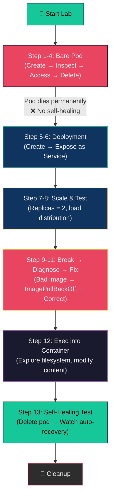
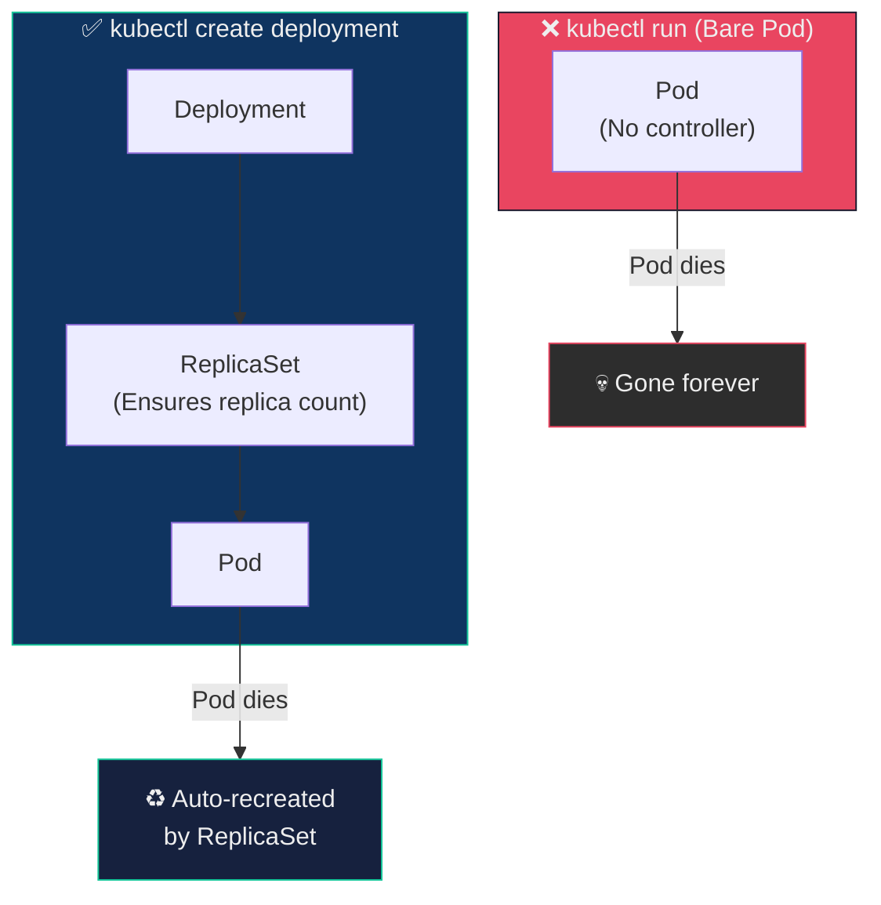
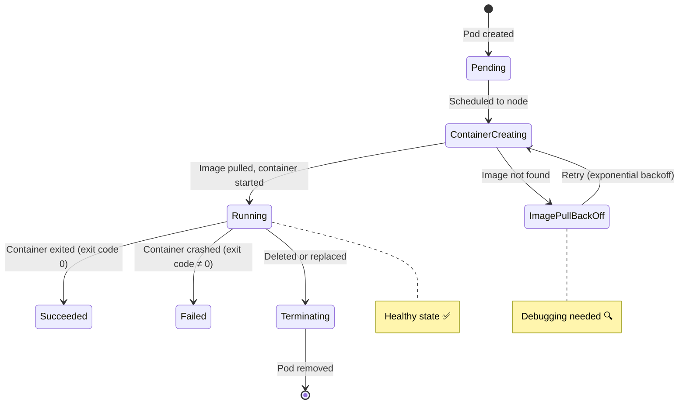

## 🎯 Lab Objective

Deploy and manage an **Apache httpd** web server on Kubernetes, and through 13 hands-on steps, learn the *why* behind every command — from bare pods to self-healing Deployments.

By the end of this lab, you will:

- Understand the **difference between bare pods and Deployments** (and why it matters)
- Know how to **expose, scale, break, diagnose, and fix** a running application
- Be able to **exec into containers** and modify them at runtime
- Observe Kubernetes **self-healing** in action

---

## 🍕 Real-World Analogy — The Pizza Restaurant

Imagine you're opening a **pizza restaurant**.

| Restaurant Scenario | Kubernetes Equivalent | What You'll Learn |
| :--- | :--- | :--- |
| **Hiring one pizza chef** | Creating a bare Pod (`kubectl run`) | Your app runs — but if the chef quits, nobody replaces him |
| **Hiring a restaurant manager** | Creating a Deployment | The manager guarantees: "We always have N chefs working" |
| **Opening the front door** | Exposing a Service | Customers (traffic) can now reach the kitchen |
| **Hiring more chefs** | Scaling replicas | Handle more orders (traffic) in parallel |
| **A chef calls in sick** | A pod crashes | The manager (Deployment controller) immediately hires a replacement |
| **Chef uses wrong recipe** | Bad container image (`wrongimage`) | App breaks — you debug, diagnose, and fix the recipe |
| **Walking into the kitchen** | `kubectl exec` into a container | Inspect files, run commands, modify content at runtime |

**Key insight:** You wouldn't run a restaurant with a single chef and no manager — so don't run production apps as bare pods without a Deployment.

---

## 📐 Lab Workflow Diagram



---

## 📖 Phase 1 — Bare Pods (The Fragile Way)

### Step 1: Create a Pod

```bash
kubectl run apache-pod --image=httpd
```

| Argument | Purpose |
| :--- | :--- |
| `run` | Imperative command — creates a single bare pod |
| `apache-pod` | Name of the pod |
| `--image=httpd` | The container image to pull from Docker Hub ([Apache HTTP Server](https://hub.docker.com/_/httpd)) |

**What happens behind the scenes:**

1. kubectl sends a request to the API server: "Create a pod named `apache-pod` running `httpd`"
2. The scheduler assigns it to a worker node
3. The kubelet on that node pulls the `httpd` image and starts the container
4. The container listens on port 80 inside the pod

**Verify the pod is running:**

```bash
kubectl get pods
```

**Expected Output:**

```text
NAME         READY   STATUS    RESTARTS   AGE
apache-pod   1/1     Running   0          10s
```

| Column | Meaning |
| :--- | :--- |
| `READY` | `1/1` = 1 out of 1 containers are healthy |
| `STATUS` | `Running` = container is alive and serving |
| `RESTARTS` | `0` = hasn't crashed or been restarted |

---

### Step 2: Inspect the Pod

```bash
kubectl describe pod apache-pod
```

**What to look for in the output:**

| Section | What to Check | Why It Matters |
| :--- | :--- | :--- |
| **Containers → Image** | Should show `httpd` | Confirms the correct image was pulled |
| **Containers → Port** | Default port 80 | Apache serves HTTP on port 80 |
| **Conditions** | All should be `True` | `PodScheduled`, `Initialized`, `ContainersReady`, `Ready` |
| **Events** (bottom) | `Pulling`, `Pulled`, `Created`, `Started` | Shows the chronological lifecycle of the pod |

> **`kubectl describe` is your #1 debugging tool.** When anything goes wrong, check the Events section here first.

---

### Step 3: Access the Application

```bash
kubectl port-forward pod/apache-pod 8081:80
```

| Argument | Meaning |
| :--- | :--- |
| `pod/apache-pod` | Target: forward to this specific pod |
| `8081:80` | `localPort:podPort` — map your machine's port 8081 → pod's port 80 |

**Now open your browser:**

```text
http://localhost:8081
```

**Expected result:** You should see the Apache default page:
> **"It works!"**
> **How port-forward works:** kubectl creates a temporary TCP tunnel from `localhost:8081` on your machine, through the API server, directly to port 80 on the pod. It's a development shortcut — not for production use. Press `Ctrl+C` to stop the port-forward when you're done.


---

### Step 4: Delete the Pod

```bash
kubectl delete pod apache-pod
```

**Verify it's gone:**

```bash
kubectl get pods
```

```text
No resources found in default namespace.
```

> ⚠️ **Critical insight:** The pod is gone *forever*. There is no controller watching over it. Nobody recreates it. If this were a production server, your users would see an error page and you'd get a 3 AM call.
>
> **This is why bare pods are dangerous.** They have zero self-healing.

---

## 📖 Phase 2 — Deployments (The Resilient Way)

### Step 5: Create a Deployment

```bash
kubectl create deployment apache --image=httpd
```

**What's different from Step 1?**



| Feature | `kubectl run` (Bare Pod) | `kubectl create deployment` |
| :--- | :--- | :--- |
| **Creates** | A single orphan pod | Deployment → ReplicaSet → Pod(s) |
| **Self-healing** | ❌ Dead = gone | ✅ Controller recreates crashed pods |
| **Scaling** | ❌ | ✅ `kubectl scale --replicas=N` |
| **Rolling updates** | ❌ | ✅ Zero-downtime image changes |
| **Rollback** | ❌ | ✅ `kubectl rollout undo` |

**Verify:**

```bash
# Check the deployment
kubectl get deployments
```

```text
NAME     READY   UP-TO-DATE   AVAILABLE   AGE
apache   1/1     1            1           10s
```

```bash
# Check the pods it created (note the random suffix)
kubectl get pods
```

```text
NAME                      READY   STATUS    RESTARTS   AGE
apache-7c8b9d6f5-x4k2m   1/1     Running   0          10s
```

> Notice the pod name now has a random suffix (`-x4k2m`). This is because the Deployment's ReplicaSet manages the pods and generates unique names.

---

### Step 6: Expose the Deployment as a Service

```bash
kubectl expose deployment apache --port=80 --type=NodePort
```

| Flag | Purpose |
| :--- | :--- |
| `--port=80` | The port the Service listens on (matches the container's port) |
| `--type=NodePort` | Exposes the Service on a static port (30000–32767) on every node |

**Access via port-forward:**

```bash
kubectl port-forward service/apache 8082:80
```

> **Notice:** We're forwarding to `service/apache` now, not a specific pod. The Service automatically routes to healthy backend pods — even if the underlying pod changes.

**Open your browser:**

```text
http://localhost:8082
```

You should see the same **"It works!"** message.

---

## 📖 Phase 3 — Scaling & Load Distribution

### Step 7: Scale the Deployment

```bash
kubectl scale deployment apache --replicas=2
```

**What happens internally:**

1. The Deployment controller updates desired replicas → 2
2. The ReplicaSet detects only 1 pod exists → creates 1 more
3. The Scheduler places the new pod on an available node
4. You now have **2 identical pods** serving traffic

**Verify:**

```bash
kubectl get pods
```

```text
NAME                      READY   STATUS    RESTARTS   AGE
apache-7c8b9d6f5-x4k2m   1/1     Running   0          5m
apache-7c8b9d6f5-r9n1a   1/1     Running   0          10s
```

> Two pods are now running the same application. The Service load-balances requests across both.

---

### Step 8: Test Load Distribution

```bash
kubectl port-forward service/apache 8082:80
```

Refresh browser multiple times. With the default Apache page, both pods serve identical content so you won't see visual differences — but the Service is distributing traffic.

**Advanced: Prove traffic goes to different pods**

```bash
# Customize each pod's page to identify it
POD1=$(kubectl get pods -o jsonpath='{.items[0].metadata.name}')
POD2=$(kubectl get pods -o jsonpath='{.items[1].metadata.name}')

kubectl exec $POD1 -- bash -c 'echo "Hello from Pod 1" > /usr/local/apache2/htdocs/index.html'
kubectl exec $POD2 -- bash -c 'echo "Hello from Pod 2" > /usr/local/apache2/htdocs/index.html'
```

Now when you refresh, you'll see responses alternating between "Hello from Pod 1" and "Hello from Pod 2" — proving the Service distributes traffic.

---

## 📖 Phase 4 — Breaking, Diagnosing & Fixing

### Step 9: Break the Application (Intentionally)

```bash
kubectl set image deployment/apache httpd=wrongimage
```

| Argument | Purpose |
| :--- | :--- |
| `set image` | Updates the container image of a Deployment |
| `deployment/apache` | Target deployment |
| `httpd=wrongimage` | Change the container named `httpd` to use an image called `wrongimage` (which doesn't exist) |

#### What just happened

1. Deployment triggers a **rolling update**
2. A new pod is created with the image `wrongimage`
3. Docker Hub doesn't have this image → **pull fails**
4. The pod enters `ImagePullBackOff` state

**Check:**

```bash
kubectl get pods
```

```text
NAME                      READY   STATUS             RESTARTS   AGE
apache-7c8b9d6f5-x4k2m   1/1     Running            0          10m
apache-9a2c4e8g1-b7d3f   0/1     ImagePullBackOff   0          30s
```

> Notice the old pod is still `Running` — Kubernetes' rolling update strategy ensures **at least one pod stays alive** while the new version fails. Your app is still accessible!

---

### Step 10: Diagnose the Problem

```bash
kubectl describe pod <failing-pod-name>
```

**What to look for in the Events section:**

```text
Events:
  Type     Reason     Age   From               Message
  ----     ------     ----  ----               -------
  Normal   Scheduled  30s   default-scheduler  Successfully assigned...
  Normal   Pulling    29s   kubelet            Pulling image "wrongimage"
  Warning  Failed     28s   kubelet            Failed to pull image "wrongimage": ...not found
  Warning  Failed     28s   kubelet            Error: ErrImagePull
  Normal   BackOff    15s   kubelet            Back-off pulling image "wrongimage"
  Warning  Failed     15s   kubelet            Error: ImagePullBackOff
```

**Diagnosis:** The image `wrongimage` doesn't exist on Docker Hub — that's the root cause.

**Also check pod logs (they'll be empty since the container never started):**

```bash
kubectl logs <failing-pod-name>
# Error: container "httpd" in pod ... is waiting to start: image pull back off
```

---

### Step 11: Fix the Application

```bash
kubectl set image deployment/apache httpd=httpd
```

**What happens:**

1. Deployment triggers another rolling update
2. A new pod starts with the correct `httpd` image
3. The failing pod is terminated
4. All pods return to `Running` state

**Verify:**

```bash
kubectl get pods
```

```text
NAME                      READY   STATUS    RESTARTS   AGE
apache-7c8b9d6f5-x4k2m   1/1     Running   0          12m
apache-7c8b9d6f5-n5p8q   1/1     Running   0          15s
```

> You just performed a **production-style debugging cycle**: observe problem → diagnose with `describe` → fix by updating image → verify recovery.

---

## 📖 Phase 5 — Exploring Inside Containers

### Step 12: Exec into a Running Pod

```bash
kubectl exec -it <pod-name> -- /bin/bash
```

| Flag | Purpose |
| :--- | :--- |
| `-i` | Interactive — keep stdin open |
| `-t` | TTY — allocate a terminal (gives you a prompt) |
| `--` | Separator between kubectl arguments and the command to run inside |
| `/bin/bash` | The shell to start inside the container |

**You're now *inside* the container's filesystem.** Explore:

```bash
# List the web root directory
ls /usr/local/apache2/htdocs/
# Output: index.html

# View the default page content
cat /usr/local/apache2/htdocs/index.html
# Output: <html><body><h1>It works!</h1></body></html>

# Modify the page
echo "<h1>Hello from Kubernetes!</h1>" > /usr/local/apache2/htdocs/index.html

# Exit the container
exit
```

**Now refresh your browser** — you'll see **"Hello from Kubernetes!"** instead of the default page.

> ⚠️ **Important:** Changes made via `exec` are **ephemeral**. If the pod restarts, or a new pod is created during scaling, the modification is lost. For persistent changes, use **ConfigMaps**, **Volumes**, or a custom Docker image.

---

## 📖 Phase 6 — Self-Healing in Action

### Step 13: Delete a Pod and Watch It Recover

```bash
# Delete one of the running pods
kubectl delete pod <one-pod-name>
```

**In a separate terminal, watch the recovery in real-time:**

```bash
kubectl get pods -w
```

**Expected sequence:**

```text
NAME                      READY   STATUS        RESTARTS   AGE
apache-7c8b9d6f5-x4k2m   1/1     Running       0          15m
apache-7c8b9d6f5-n5p8q   1/1     Terminating   0          3m     ← Deleted
apache-7c8b9d6f5-a2b4c   0/1     Pending       0          1s     ← New pod
apache-7c8b9d6f5-a2b4c   0/1     ContainerCreating  0     2s
apache-7c8b9d6f5-a2b4c   1/1     Running       0          5s     ← Recovered!
```

**What just happened:**

1. You deleted a pod
2. The ReplicaSet controller detected: "Desired = 2, Actual = 1"
3. It immediately created a new pod to restore the count
4. Within seconds, the new pod is `Running`

> **This is self-healing**: the Deployment *always* maintains the desired number of replicas. Whether a pod crashes, a node dies, or you manually delete a pod — it automatically recovers. This is the core value proposition of Kubernetes.

---

## 📖 Phase 7 — Cleanup

```bash
# Delete the deployment (also deletes its ReplicaSet and all pods)
kubectl delete deployment apache

# Delete the service
kubectl delete service apache

# Verify everything is clean
kubectl get all
```

---

## 📖 Optional Challenge — Custom Content at Runtime

Combine what you've learned to create a personalized web page:

```bash
# 1. Create a fresh deployment
kubectl create deployment myapp --image=httpd

# 2. Scale to 3 replicas
kubectl scale deployment myapp --replicas=3

# 3. Expose it
kubectl expose deployment myapp --port=80 --type=NodePort

# 4. Customize each pod's content
for i in $(kubectl get pods -l app=myapp -o jsonpath='{.items[*].metadata.name}'); do
  kubectl exec $i -- bash -c "echo '<h1>Pod: $i</h1><p>Running on Kubernetes!</p>' > /usr/local/apache2/htdocs/index.html"
done

# 5. Port-forward and refresh to see different pods respond
kubectl port-forward service/myapp 8080:80
```

**Cleanup:**

```bash
kubectl delete deployment myapp
kubectl delete service myapp
```

---

## 📚 Key Terminology — Glossary

| Term | Definition |
| :--- | :--- |
| **Bare Pod** | A pod created directly with `kubectl run` — has no controller managing it, no self-healing, no scaling |
| **Deployment** | A controller object that manages ReplicaSets and Pods — provides self-healing, scaling, rolling updates, and rollback |
| **ReplicaSet** | Created by a Deployment — ensures a specified number of identical pod replicas are running at all times |
| **Service** | A stable network endpoint (virtual IP + DNS) that load-balances traffic across a set of pods |
| **NodePort** | A Service type that opens a static port (30000–32767) on every node's IP to accept external traffic |
| **Port-Forward** | A `kubectl` feature that creates a temporary TCP tunnel from your local machine to a pod or service in the cluster |
| **`kubectl exec`** | Executes a command inside a running container — similar to `docker exec` |
| **ImagePullBackOff** | A pod status indicating the container runtime failed to pull the specified image — usually a wrong name or private registry issue |
| **Rolling Update** | Kubernetes' default update strategy — creates new pods with the updated image, waits for them to be healthy, then terminates old pods |
| **Self-Healing** | The ability of Kubernetes (via Deployment controllers) to automatically detect and replace crashed or deleted pods |
| **`kubectl describe`** | Shows detailed information about a resource, including Events — the primary debugging tool in Kubernetes |
| **`kubectl set image`** | Updates the container image of a Deployment, triggering a rolling update |
| **`kubectl scale`** | Changes the number of pod replicas for a Deployment |
| **httpd** | Apache HTTP Server — an open-source web server; the `httpd` Docker image serves static web content on port 80 |
| **htdocs** | Apache's default document root directory (`/usr/local/apache2/htdocs/`) — where web files (like `index.html`) are served from |

---

## 🧠 Concepts Deep Dive

### Pod Lifecycle States You Saw in This Lab



### Rolling Update Strategy Explained

When you run `kubectl set image`, Kubernetes performs a **rolling update**:

```text
Step 1: Create 1 new pod with the updated image
Step 2: Wait for the new pod to become Ready
Step 3: Terminate 1 old pod
Step 4: Repeat until all pods are updated
```

**Key guarantees:**

| Parameter | Default | Meaning |
| :--- | :--- | :--- |
| `maxSurge` | 25% | Max extra pods allowed during update (above desired count) |
| `maxUnavailable` | 25% | Max pods allowed to be unavailable during update |

This ensures **zero downtime** — at least some pods are always serving traffic during the update.

---

## 🎓 Exam & Interview Preparation

### Q1: A junior developer creates a pod using `kubectl run myapp --image=nginx` and deploys it to production. What risks does this introduce, and what is the correct approach?

**Answer:**

**Risks of bare pods in production:**

| Risk | What Happens |
| :--- | :--- |
| **No self-healing** | If the pod crashes or the node fails, the pod is gone forever — no controller recreates it |
| **No scaling** | Cannot run `kubectl scale` — bare pods don't support it |
| **No rolling updates** | Must manually delete and recreate to update the image — causing downtime |
| **No rollback** | If the new version is broken, there's no way to automatically revert |

**Correct approach — use a Deployment:**

```bash
kubectl create deployment myapp --image=nginx
```

Or declaratively:

```yaml
apiVersion: apps/v1
kind: Deployment
metadata:
  name: myapp
spec:
  replicas: 3
  selector:
    matchLabels:
      app: myapp
  template:
    spec:
      containers:
      - name: nginx
        image: nginx:1.25
```

Deployments provide self-healing, scaling, rolling updates, and rollback — everything needed for production reliability.

---

### Q2: You deploy a new version of your application and pods enter `ImagePullBackOff` state. Walk through the debugging process

**Answer:**

##### Step 1 — Identify the failing pods

```bash
kubectl get pods
# Look for pods with STATUS: ImagePullBackOff or ErrImagePull
```

##### Step 2 — Inspect the Events

```bash
kubectl describe pod <failing-pod-name>
# Scroll to the Events section → look for "Failed to pull image" messages
```

##### Step 3 — Determine the root cause

| Cause | Example Error |
| :--- | :--- |
| Typo in image name | `Failed to pull image "nignx"` (should be `nginx`) |
| Non-existent tag | `Failed to pull image "nginx:v999"` |
| Private registry without pull secret | `unauthorized: authentication required` |
| Network issue | `dial tcp: i/o timeout` |

##### Step 4 — Fix the issue

```bash
# Correct the image name
kubectl set image deployment/<name> <container>=<correct-image>

# Or if it's a private registry issue, create and attach a pull secret
kubectl create secret docker-registry myregistry --docker-server=... --docker-username=...
```

##### Step 5 — Verify recovery

```bash
kubectl get pods -w    # Watch pods transition to Running
kubectl rollout status deployment/<name>    # Confirm rollout completed
```

---

### Q3: Explain the Kubernetes self-healing mechanism. How does a Deployment ensure pods are always running?

**Answer:**

Kubernetes self-healing works through the **reconciliation loop** pattern:

#### The control flow

1. **You declare desired state:** `replicas: 3` in the Deployment spec
2. **Deployment creates a ReplicaSet** that is responsible for maintaining exactly 3 pods
3. **ReplicaSet controller continuously monitors** the actual pod count via the API server
4. **If actual ≠ desired, the controller acts:**
   - Too few pods → creates new ones (e.g., after a crash or deletion)
   - Too many pods → terminates extras (e.g., after scaling down)

#### Self-healing scenarios

| Event | What K8s Does | Speed |
| :--- | :--- | :--- |
| Pod process crashes | Kubelet restarts the container (respects `restartPolicy`) | Seconds |
| Pod is manually deleted | ReplicaSet creates a replacement pod | Seconds |
| Node becomes NotReady | Node controller marks pods for rescheduling; new pods created on healthy nodes | ~40 seconds (configurable) |
| Node is drained for maintenance | Pods are gracefully evicted and recreated elsewhere (respects PodDisruptionBudget) | Depends on grace period |

#### Key component interactions

- **kubelet** — monitors container health on each node, restarts crashed containers
- **ReplicaSet controller** — ensures pod count matches desired count
- **Node controller** — detects node failures via Lease heartbeats
- **Scheduler** — places newly created pods on appropriate nodes

The entire system is **declarative** — you state *what* you want, and Kubernetes continuously works to make reality match your declaration.

---

## 📖 Summary — What You Learned

| Phase | Concept | Commands Used |
| :--- | :--- | :--- |
| **Bare Pods** | Pods without controllers are fragile — no self-healing | `kubectl run`, `get pods`, `describe`, `port-forward`, `delete pod` |
| **Deployments** | Controllers that maintain desired state and enable scaling | `kubectl create deployment`, `expose`, `get deployments` |
| **Scaling** | Horizontal scaling by adjusting replica count | `kubectl scale --replicas=N` |
| **Debugging** | Breaking, diagnosing (Events), and fixing applications | `kubectl set image`, `describe pod`, `logs` |
| **Container Access** | Exec into containers to inspect and modify at runtime | `kubectl exec -it -- /bin/bash` |
| **Self-Healing** | Deployments automatically replace deleted/crashed pods | `kubectl delete pod`, `get pods -w` |
