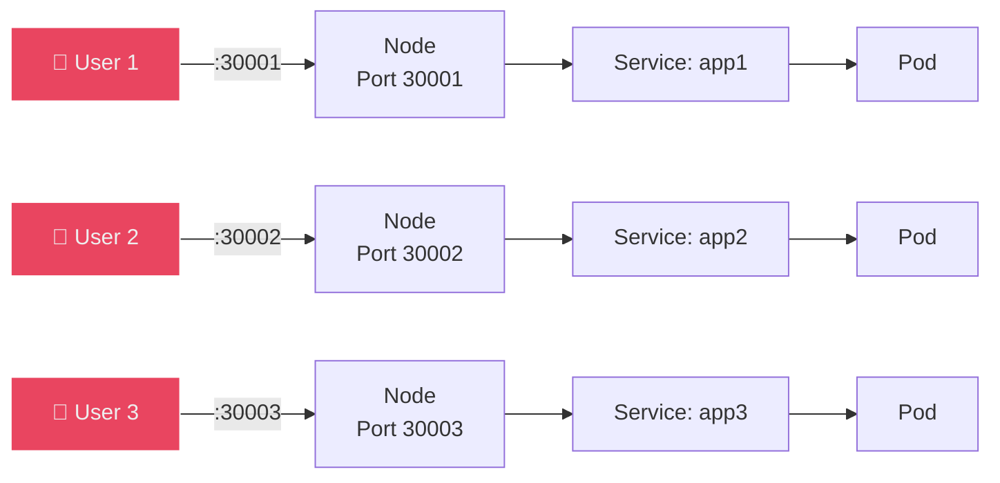
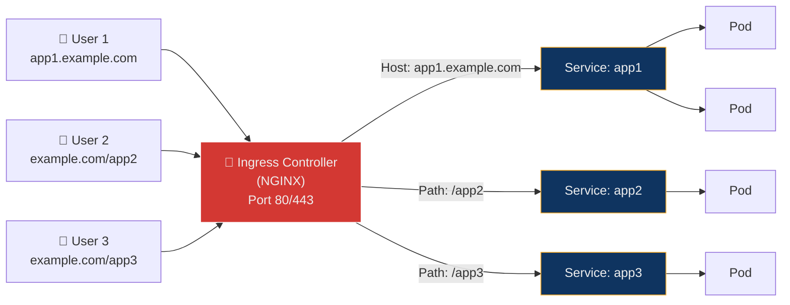
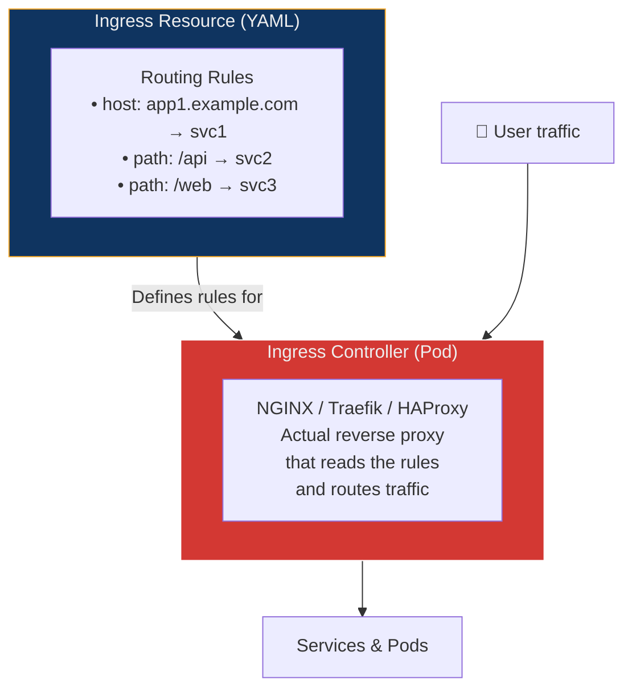
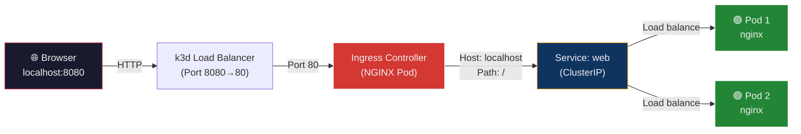
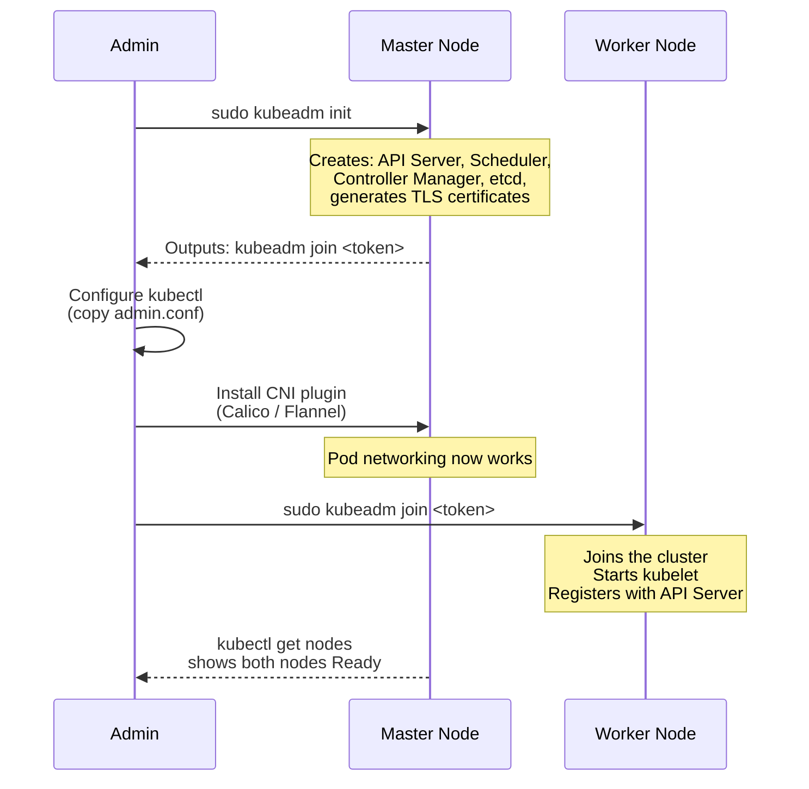
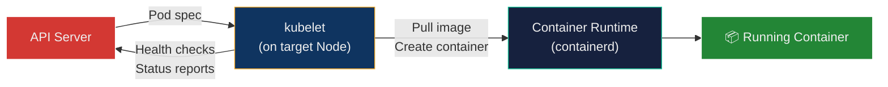
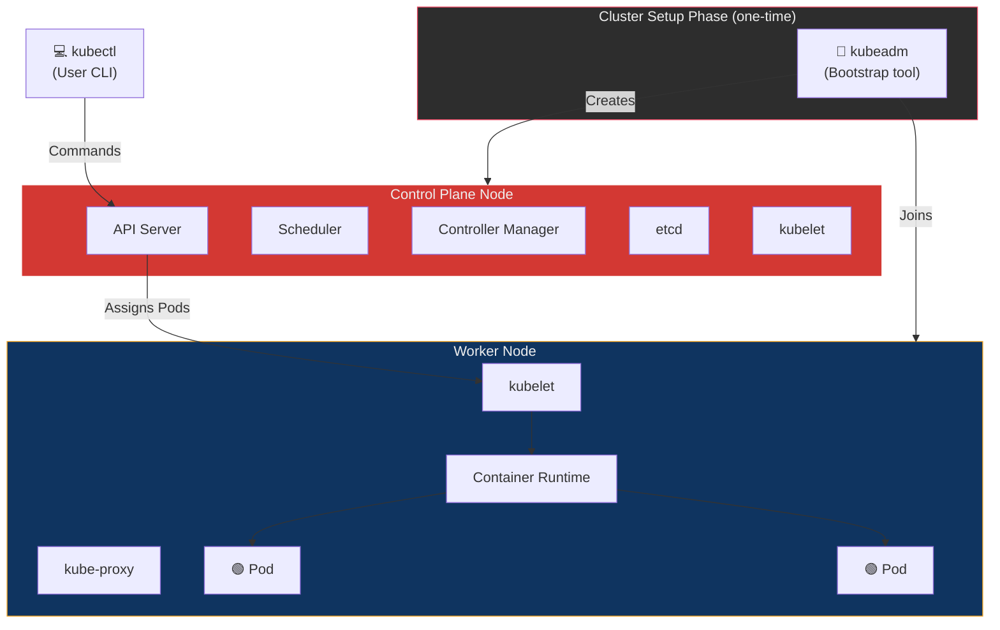
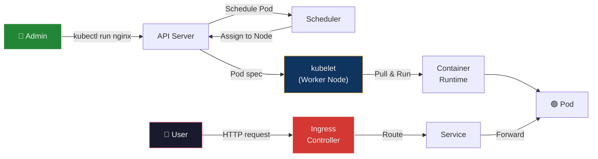
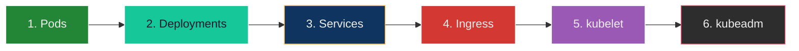

## 🎯 Objective

By the end of this lecture, you will:

- Understand why Ingress is needed and how it replaces NodePort/LoadBalancer for HTTP routing
- Deploy an application and route traffic to it using an Ingress resource
- Know the difference between `kubeadm` (cluster bootstrap tool) and `kubelet` (node agent)
- Understand how all Kubernetes components work together in a real cluster

---

## 🏗️ Real-World Analogy — The Office Building

Imagine a large **corporate office building** with many companies inside:

| Office Building Scenario | Kubernetes Equivalent |
| :--- | :--- |
| **The building itself** | The Kubernetes cluster |
| **The receptionist in the lobby** | **Ingress Controller** — the single entry point that directs visitors |
| **The visitor directory on the wall** | **Ingress Resource** — the routing rules ("Company A → Floor 3, Company B → Floor 7") |
| **Each company's office** | **Service** — a stable internal address for a group of Pods |
| **Individual employees inside** | **Pods** — the actual workloads running |
| **The building contractor** | **kubeadm** — built the building once, then left |
| **The building manager on each floor** | **kubelet** — always present, ensures offices are maintained, reports issues |
| **Giving visitors random fire escape routes** | **NodePort** — works, but ugly and hard to manage |
| **Each company buying their own building entrance** | **LoadBalancer** — expensive, one per service |

**The key insight:** Without a receptionist (Ingress), every visitor needs to know the exact floor and room number (NodePort). The receptionist gives everyone a clean, simple address and handles the routing internally.

---

## 📐 Architecture Diagrams

### The Problem: Without Ingress



**Problem:** Users need to remember random port numbers. No domain names. No HTTPS. Doesn't scale.

### The Solution: With Ingress



**Solution:** One entry point (port 80/443), clean URLs, domain-based and path-based routing.

---

## 📖 Part 1 — What is Ingress?

### The Problem Ingress Solves

When you expose applications using Kubernetes Services:

| Service Type | How It Works | Problem |
| :--- | :--- | :--- |
| **ClusterIP** | Internal only — not accessible from outside | ❌ Users can't reach it |
| **NodePort** | Opens a random port (30000–32767) on every Node | ❌ Ugly URLs (`http://192.168.1.5:30247`) |
| **LoadBalancer** | Provisions a cloud load balancer per Service | ❌ Expensive — one LB per app, costs add up |

With 3 apps using NodePort:

```text
app1 → http://node-ip:30001
app2 → http://node-ip:30002
app3 → http://node-ip:30003
```

What you *actually* want:

```text
app1.example.com      → Service: app1
example.com/api       → Service: app2
example.com/dashboard → Service: app3
```

**Ingress provides exactly this** — HTTP/HTTPS routing with clean URLs through a single entry point.

### What Ingress Provides

| Feature | Description |
| :--- | :--- |
| **Host-based routing** | `app1.example.com` → Service A, `app2.example.com` → Service B |
| **Path-based routing** | `example.com/api` → Service A, `example.com/web` → Service B |
| **SSL/TLS termination** | HTTPS at the Ingress, HTTP internally (offloads certificates) |
| **Single entry point** | One IP/port pair for all applications |
| **Load balancing** | Distributes traffic across Pods within a Service |

### Critical Distinction: Ingress Resource vs Ingress Controller

This is the most common confusion for beginners:



| Component | What It Is | Analogy |
| :--- | :--- | :--- |
| **Ingress Resource** | A YAML file with routing rules — defines *what* should happen | The visitor directory on the wall |
| **Ingress Controller** | A Pod running a reverse proxy (NGINX, Traefik, etc.) — does the *actual* routing | The receptionist who reads the directory and directs visitors |

> **Important:** An Ingress Resource does nothing without an Ingress Controller. You must install a controller first.

### Popular Ingress Controllers

| Controller | Used By | Notes |
| :--- | :--- | :--- |
| **NGINX Ingress Controller** | Most common, great for learning | Open-source, battle-tested |
| **Traefik** | k3s/k3d default | Auto-discovers routes, built-in dashboard |
| **HAProxy** | Enterprise / high-performance | Advanced load balancing features |
| **AWS ALB Ingress** | AWS EKS | Provisions AWS Application Load Balancers |
| **Istio Gateway** | Service mesh environments | Part of the Istio ecosystem |

---

## 📖 Part 2 — Hands-on Lab: Deploy & Expose Using Ingress

### Prerequisites

- WSL (Ubuntu) with Docker installed
- `kubectl` and `k3d` available
- Basic understanding of Pods, Deployments, and Services

### Step 1 — Create k3d Cluster with Ingress Support

```bash
k3d cluster create mycluster -p "8080:80@loadbalancer"
```

| Part | Purpose |
| :--- | :--- |
| `k3d cluster create mycluster` | Creates a local Kubernetes cluster named `mycluster` |
| `-p "8080:80@loadbalancer"` | Maps **host port 8080** to **container port 80** on the k3d load balancer — this is how Ingress traffic reaches your browser |

Verify the cluster is running:

```bash
kubectl get nodes
```

**Expected output:**

```text
NAME                     STATUS   ROLES                  AGE   VERSION
k3d-mycluster-server-0   Ready    control-plane,master   30s   v1.28.x
```

### Step 2 — Install the NGINX Ingress Controller

```bash
kubectl apply -f https://raw.githubusercontent.com/kubernetes/ingress-nginx/main/deploy/static/provider/cloud/deploy.yaml
```

This deploys the NGINX Ingress Controller as a set of Pods in the `ingress-nginx` namespace.

Wait for the controller to be ready:

```bash
kubectl get pods -n ingress-nginx --watch
```

**Expected output (wait until all show `Running`):**

```text
NAME                                        READY   STATUS    RESTARTS   AGE
ingress-nginx-controller-7dcdbcff84-x2k9f   1/1     Running   0          45s
```

### Step 3 — Deploy a Sample Application

```bash
kubectl create deployment web --image=nginx
```

Verify:

```bash
kubectl get pods
```

### Step 4 — Scale the Application

```bash
kubectl scale deployment web --replicas=2
```

Multiple Pods means the Service will **load balance** traffic across them.

### Step 5 — Expose Deployment as a ClusterIP Service

```bash
kubectl expose deployment web --port=80 --type=ClusterIP
```

| Part | Purpose |
| :--- | :--- |
| `--type=ClusterIP` | Internal-only Service — accessible inside the cluster but **not** from your browser |
| `--port=80` | The Service listens on port 80 |

Check:

```bash
kubectl get services
```

> **Why ClusterIP?** Because Ingress handles external access. The Service only needs to be reachable *inside* the cluster by the Ingress Controller.

### Step 6 — Create the Ingress Resource

Create the file:

```bash
nano ingress.yaml
```

Paste:

```yaml
apiVersion: networking.k8s.io/v1
kind: Ingress

metadata:
  name: web-ingress

spec:
  rules:
  - host: localhost          # Match requests to "localhost"
    http:
      paths:
      - path: /              # Match all paths
        pathType: Prefix     # Prefix matching (/ matches /anything)
        backend:
          service:
            name: web        # Route to Service named "web"
            port:
              number: 80     # Service port
```

#### YAML Field Breakdown

| Field | Purpose |
| :--- | :--- |
| `apiVersion: networking.k8s.io/v1` | API group for networking resources |
| `kind: Ingress` | This is an Ingress routing rule |
| `metadata.name` | Name of this Ingress resource |
| `spec.rules` | List of routing rules |
| `rules[].host` | Domain name to match (`localhost` for local dev) |
| `paths[].path` | URL path to match |
| `paths[].pathType` | `Prefix` (matches `/` and everything under it) or `Exact` (matches only the exact path) |
| `backend.service.name` | The Kubernetes Service to route to |
| `backend.service.port.number` | Port on that Service |

Apply:

```bash
kubectl apply -f ingress.yaml
```

### Step 7 — Test in Browser

Open:

```text
http://localhost:8080
```

You should see the **"Welcome to nginx!"** page.

### Complete Traffic Flow



**Step-by-step:**

1. **Browser** sends HTTP request to `localhost:8080`
2. **k3d load balancer** forwards port 8080 → port 80 inside the cluster
3. **Ingress Controller** (NGINX Pod) receives the request, checks its rules
4. Rule matches: `host: localhost`, `path: /` → route to Service `web` on port 80
5. **Service** load-balances across Pod 1 and Pod 2
6. **Pod** (nginx) returns the response → back through the chain to the browser

### Step 8 — Debug Commands

```bash
# Check Ingress resource
kubectl get ingress

# Detailed info (shows rules, backends, events)
kubectl describe ingress web-ingress

# Check the Service
kubectl get svc

# Check Pods with Node assignment
kubectl get pods -o wide
```

### Step 9 — Cleanup

```bash
# Delete individual resources
kubectl delete ingress web-ingress
kubectl delete service web
kubectl delete deployment web

# Or delete the entire cluster
k3d cluster delete mycluster
```

---

## 📖 Part 3 — What is kubeadm?

### Definition

`kubeadm` is a **cluster bootstrap tool** — it creates and initializes a real Kubernetes cluster.

> Think of it as the **building contractor**: they construct the building, hand over the keys, and leave.

### What kubeadm Does

| Task | What It Automates |
| :--- | :--- |
| `kubeadm init` | Sets up the Control Plane — API Server, Scheduler, Controller Manager, etcd, generates certificates |
| `kubeadm join` | Adds worker nodes to the existing cluster |
| `kubeadm upgrade` | Upgrades Kubernetes version on the cluster |
| `kubeadm reset` | Tears down a node's Kubernetes configuration |

### When You Need kubeadm

| Scenario | Need kubeadm? |
| :--- | :--- |
| Bare metal / VM cluster (on-premise) | ✅ Yes |
| Learning real cluster internals | ✅ Yes |
| Custom production setups | ✅ Yes |
| Using k3d / Minikube / kind | ❌ No — these tools handle setup internally |
| Using cloud-managed K8s (EKS, GKE, AKS) | ❌ No — the cloud provider manages the Control Plane |

### kubeadm Cluster Setup Flow



### Installation (Ubuntu / VM / Bare Metal)

```bash
sudo apt update
sudo apt install -y kubeadm kubelet kubectl
```

### Initialize the Master Node

```bash
sudo kubeadm init
```

This outputs a `kubeadm join` command with a token — save it for adding workers.

### Configure kubectl

```bash
mkdir -p $HOME/.kube
sudo cp /etc/kubernetes/admin.conf $HOME/.kube/config
sudo chown $(id -u):$(id -g) $HOME/.kube/config
```

### Install a Network Plugin (Required)

Without a CNI plugin, Pods cannot communicate across Nodes:

```bash
# Example: Calico
kubectl apply -f https://docs.projectcalico.org/manifests/calico.yaml
```

### Add a Worker Node

Run on the worker machine:

```bash
sudo kubeadm join <master-ip>:<port> --token <token> --discovery-token-ca-cert-hash <hash>
```

### Key Point

After setup is complete:

```text
kubeadm → job done → exits
```

kubeadm is **not running** in the cluster. It's a setup-time tool only.

---

## 📖 Part 4 — What is kubelet?

### Definition

`kubelet` is a **node agent** — a process that runs **continuously on every node** (both Control Plane and Workers).

> Think of it as the **building manager on each floor**: they're always present, ensure offices are maintained, handle issues, and report back to headquarters.

### What kubelet Does

| Responsibility | Description |
| :--- | :--- |
| **Receives instructions** | Watches the API Server for Pods assigned to its Node |
| **Starts containers** | Tells the container runtime (containerd, CRI-O) to pull images and run containers |
| **Monitors Pods** | Runs health checks (liveness/readiness probes) |
| **Restarts failed containers** | If a container crashes, kubelet restarts it according to the Pod's restart policy |
| **Reports node status** | Sends heartbeats and resource usage data back to the API Server |

### Pod Execution Flow



### Where kubelet Runs

```text
Control Plane Node:
  - API Server
  - Scheduler
  - Controller Manager
  - etcd
  - kubelet ✅          ← runs here too

Worker Node:
  - kubelet ✅
  - container runtime
  - kube-proxy
```

### Observing kubelet

You don't interact with kubelet directly — it works in the background. But you can observe and debug it:

```bash
# Check if kubelet is running
systemctl status kubelet

# View kubelet logs (useful for debugging Node issues)
journalctl -u kubelet

# Tail live kubelet logs
journalctl -u kubelet -f
```

### Key Point

```text
kubeadm → NOT running in the cluster (build-time tool)
kubelet → IS running on every node (runtime agent)
```

---

## 📖 Part 5 — How kubeadm, kubelet & kubectl Work Together

### Complete Cluster Architecture



### Component Comparison

| Component | Type | When It Runs | What It Does | Analogy |
| :--- | :--- | :--- | :--- | :--- |
| **kubeadm** | CLI tool | During setup only | Bootstraps the cluster, generates certs, joins nodes | Building contractor |
| **kubelet** | System service | Always (on every node) | Executes Pods, reports status, restarts containers | Building manager |
| **kubectl** | CLI tool | When user runs commands | Sends commands to the API Server | Tenant making requests |
| **Ingress** | Cluster resource | Always (runs as Pods) | Routes external HTTP/HTTPS traffic to Services | Receptionist |

### Request Flow — End to End



### When to Use What

| I Want To... | Use |
| :--- | :--- |
| Expose my app via HTTP/HTTPS with clean URLs | **Ingress** |
| Create a production Kubernetes cluster from scratch | **kubeadm** |
| Debug why a Node isn't working | **kubelet** (check logs) |
| Deploy apps and manage workloads | **kubectl** |
| Run Kubernetes locally for learning | **k3d / Minikube** (not kubeadm) |

### Learning Order (Recommended)



---

## 🔧 Common Issues & Fixes

| # | Problem | Diagnosis | Fix |
| :--- | :--- | :--- | :--- |
| 1 | **Page not loading at localhost:8080** | `kubectl get pods -n ingress-nginx` | Ensure Ingress Controller Pods are `Running`; wait if `ContainerCreating` |
| 2 | **Connection refused** | Cluster port mapping missing | Recreate cluster with `-p "8080:80@loadbalancer"` |
| 3 | **404 Not Found** | Service name mismatch | Ensure `backend.service.name` in Ingress YAML matches `kubectl get svc` output exactly |
| 4 | **Ingress ADDRESS is empty** | Ingress Controller not installed | Install NGINX Ingress Controller, then wait for it to assign an address |
| 5 | **kubelet not running** | `systemctl status kubelet` shows `inactive` | `sudo systemctl start kubelet`; check logs with `journalctl -u kubelet` |

---

## 📚 Key Terminology — Glossary

| Term | Definition |
| :--- | :--- |
| **Ingress** | A Kubernetes API resource that defines HTTP/HTTPS routing rules for external traffic |
| **Ingress Controller** | A Pod running a reverse proxy (NGINX, Traefik) that reads Ingress resources and routes traffic |
| **Ingress Resource** | The YAML manifest that declares routing rules (host, path → Service) |
| **Host-based routing** | Routing traffic based on the domain name (e.g., `app1.example.com` → Service A) |
| **Path-based routing** | Routing traffic based on the URL path (e.g., `/api` → Service A, `/web` → Service B) |
| **pathType** | Matching strategy for URL paths — `Prefix` (matches path and sub-paths) or `Exact` (matches only that path) |
| **TLS termination** | Decrypting HTTPS at the Ingress Controller, forwarding plain HTTP to backend Services |
| **kubeadm** | CLI bootstrap tool for creating and managing real Kubernetes clusters (not a runtime component) |
| **kubelet** | Node agent that runs on every node — receives Pod specs from the API Server and ensures containers run |
| **kubeadm init** | Command that initializes a Control Plane node — creates API Server, Scheduler, etcd, and generates certificates |
| **kubeadm join** | Command that adds a worker node to an existing cluster using a token |
| **CNI (Container Network Interface)** | Plugin (Calico, Flannel, Cilium) that provides Pod-to-Pod networking across Nodes |
| **ClusterIP** | Default Service type — accessible only inside the cluster; used as the backend for Ingress |
| **NodePort** | Service type that exposes a port on every Node (30000–32767) — a simpler but messier alternative to Ingress |
| **LoadBalancer** | Service type that provisions an external load balancer (cloud-only) — expensive at scale |
| **Reverse proxy** | A server (NGINX, HAProxy) that forwards client requests to backend servers based on rules |
| **k3d** | A tool for running lightweight k3s Kubernetes clusters inside Docker containers — ideal for local development |
| **Container Runtime** | Software that actually runs containers (containerd, CRI-O) — kubelet communicates with it via CRI |
| **CRI (Container Runtime Interface)** | Standardized API between kubelet and container runtimes |
| **NGINX Ingress Controller** | The most popular Ingress Controller — runs NGINX as a reverse proxy inside Kubernetes |

---

## 🎓 Viva / Interview Preparation

### Q1: What is the difference between a Kubernetes Service (NodePort/LoadBalancer) and Ingress? When would you use each?

**Answer:**

**NodePort** opens a random port (30000–32767) on every Node. Users access the app via `node-ip:port`. It works without any additional components but:
- No domain-based routing
- No path-based routing
- No SSL/TLS termination
- Ugly URLs with random port numbers
- One port per Service

**LoadBalancer** provisions a cloud provider's load balancer (e.g., AWS ELB). Each Service gets its own LB:
- Clean URLs but expensive — one LB per Service
- Only works on cloud providers
- No path-based routing between Services

**Ingress** provides a **single entry point** (one IP, ports 80/443) with:
- Host-based routing (`app1.example.com`, `app2.example.com`)
- Path-based routing (`/api`, `/web`, `/admin`)
- SSL/TLS termination (one certificate, one place)
- Works with any infrastructure (cloud, on-premise, local)

**When to use each:**
- **NodePort** → Quick local testing, non-HTTP protocols (TCP/UDP)
- **LoadBalancer** → Single service that needs a dedicated cloud LB (e.g., a database proxy)
- **Ingress** → Multiple HTTP/HTTPS services that need clean URLs and shared entry point (production standard)

---

### Q2: Explain the difference between kubeadm and kubelet. Can a Kubernetes cluster run without either one?

**Answer:**

**kubeadm** is a **bootstrap tool** — it creates the cluster by initializing the Control Plane (`kubeadm init`) and joining worker Nodes (`kubeadm join`). After setup, kubeadm **exits and is not running**. It's like a building contractor — builds the building, hands over the keys, and leaves.

**kubelet** is a **node agent** — it runs **continuously as a system service** on every node (both Control Plane and Workers). It:
1. Watches the API Server for Pods assigned to its Node
2. Tells the container runtime to pull images and start containers
3. Monitors container health (liveness/readiness probes)
4. Restarts failed containers
5. Reports Node status back to the API Server

**Can the cluster run without kubeadm?** ✅ Yes — kubeadm is just one way to create a cluster. Managed services (EKS, GKE, AKS), k3d, Minikube, and tools like kOps or Kubespray can create clusters without kubeadm.

**Can the cluster run without kubelet?** ❌ No — kubelet is a core required component on every node. Without it, no Pods can be scheduled or executed on that Node. If kubelet stops, the Node becomes `NotReady` and workloads are rescheduled elsewhere.

---

### Q3: Walk through the complete traffic flow when a user accesses `http://app.example.com` in a Kubernetes cluster with Ingress configured.

**Answer:**

1. **DNS resolution:** The user's browser resolves `app.example.com` to the cluster's external IP (or Node IP in local setups)

2. **Reaches the Ingress Controller:** The HTTP request arrives at port 80 on the Ingress Controller Pod (which is an NGINX/Traefik instance running inside the cluster)

3. **Rule matching:** The Ingress Controller checks its loaded Ingress rules:
   - Match `host: app.example.com` ✅
   - Match `path: /` ✅
   - Backend: Service `web`, port 80

4. **Service lookup:** The Ingress Controller forwards the request to the ClusterIP Service named `web`

5. **Pod selection:** The Service uses its `selector` labels to find matching Pods, then load-balances (round-robin by default) across them

6. **kubelet's role:** On the target Node, kubelet had already started the Pod by pulling the image and creating the container via the container runtime

7. **Response:** The Pod (nginx container) processes the request and returns the "Welcome to nginx!" page back through the same chain: Pod → Service → Ingress Controller → Browser

**Key insight:** The Ingress Controller is the only component that needs external access (port 80/443). All Services behind it can use ClusterIP (internal-only), improving security.
