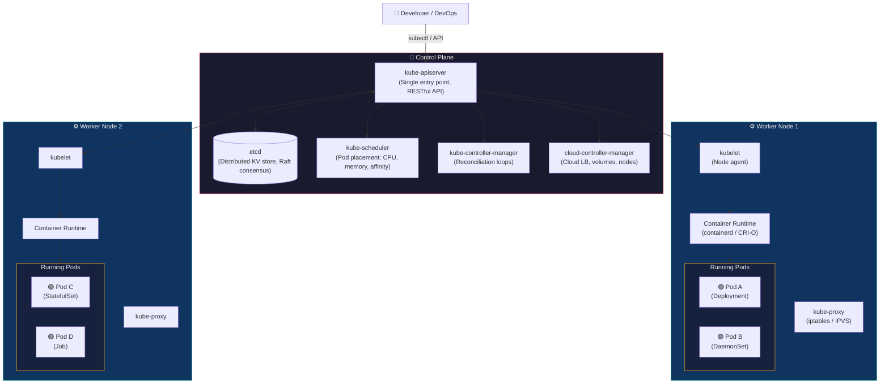
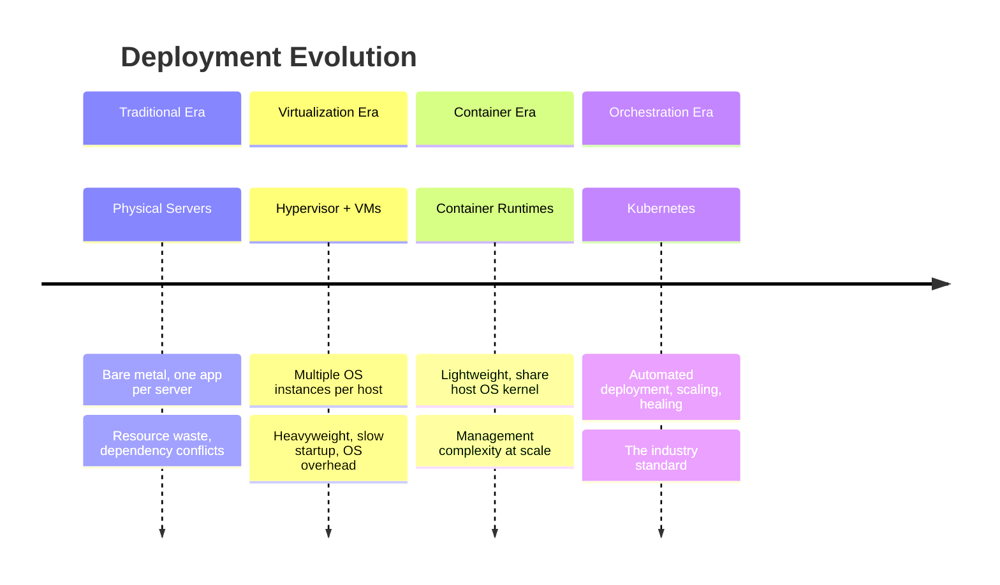
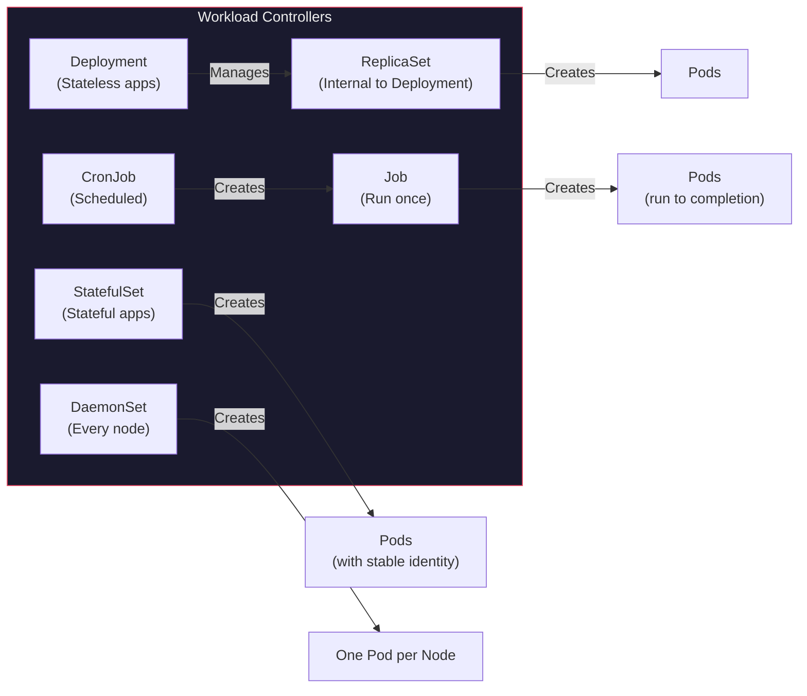
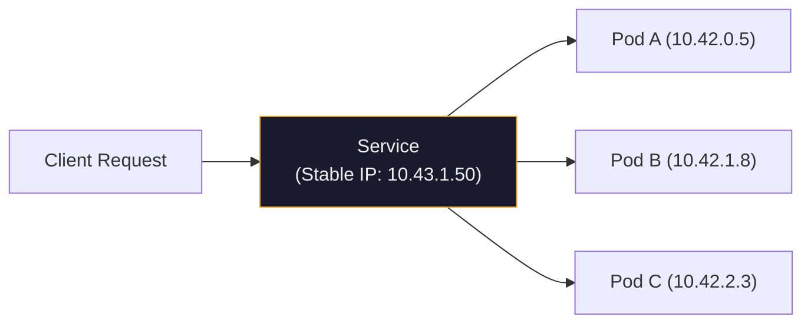
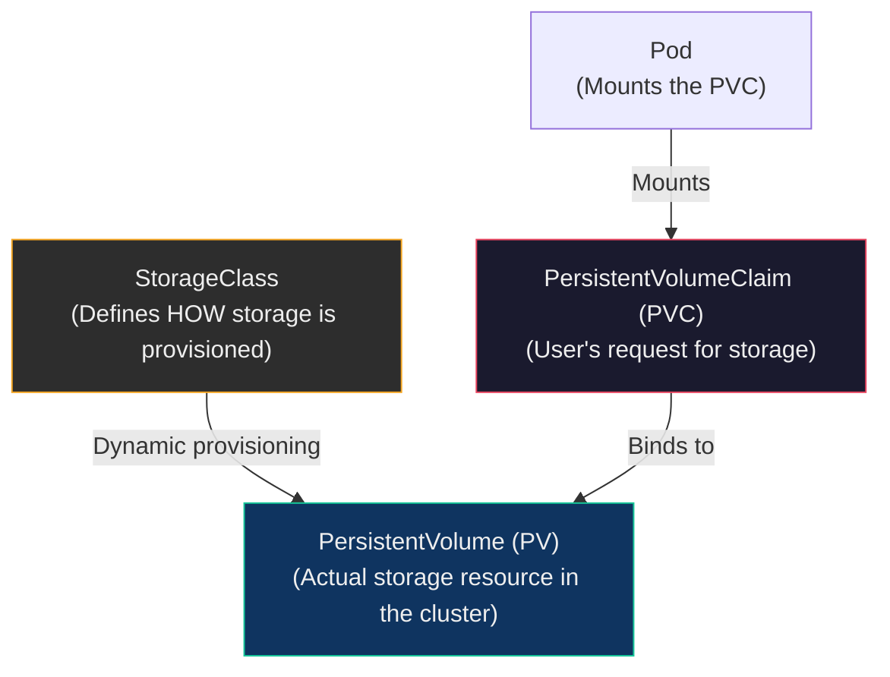
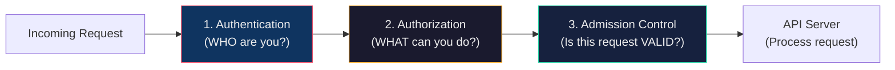
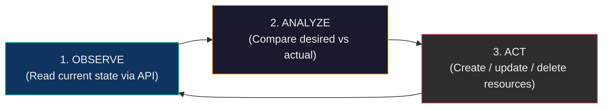

## 🎯 Core Concept

Kubernetes (K8s) is an open-source **container orchestration platform** that automates the deployment, scaling, and management of containerized applications. It provides a framework for running distributed systems resiliently — handling failover, load balancing, rolling updates, and self-healing automatically.

> You describe *what* you want. Kubernetes figures out *how* to make it happen — and keeps it that way, forever.

---

## 🏗️ Real-World Analogy — The Smart City

Imagine building a **smart city** from scratch.

You have thousands of citizens (containers) who need apartments (pods), roads (networking), water and electricity (storage), security checkpoints (RBAC), and a city hall (control plane) that keeps everything running. No single person manages every citizen — the city has automated systems.

| City Component | Kubernetes Equivalent | Role |
| :--- | :--- | :--- |
| **City Hall** | **Control Plane** | The decision-making authority — plans, schedules, monitors everything |
| **City Records Office** | **etcd** | Stores the official record of every citizen, building, and permit |
| **Urban Planning Dept** | **Scheduler** | Decides which neighbourhood (node) gets new buildings (pods) based on capacity |
| **Building Inspector** | **Controller Manager** | Continuously checks: "Are there really 5 hospitals as planned? If one collapsed, rebuild it." |
| **City Reception Desk** | **API Server** | The single window for all requests — every form goes through here first |
| **Neighbourhoods** | **Worker Nodes** | The actual land where buildings (pods) are constructed |
| **Local Ward Officer** | **Kubelet** | In each neighbourhood — receives orders from city hall, manages local buildings, reports status |
| **Construction Company** | **Container Runtime** | Actually builds and operates the buildings (containerd, CRI-O) |
| **Road Network & Traffic Police** | **Kube Proxy** | Routes citizens (traffic) to the right building, manages road rules (network policies) |
| **Apartment Building** | **Pod** | The smallest unit — one or more rooms (containers) sharing walls (network) and utilities (storage) |
| **Housing Society** | **Deployment** | Manages a set of identical buildings — if one burns down, a new one is automatically built |
| **Water & Electricity Board** | **PersistentVolume** | Utilities that exist independently of any single building |
| **Security Guard** | **RBAC** | Controls who enters which area and what they can do |

**The key insight:** You don't manage each building individually. You tell city hall: "I need 5 hospitals and 10 schools." City hall handles the rest — finding land, assigning contractors, connecting roads, and if a hospital collapses, automatically rebuilding it.

---

## 📐 Architecture Diagram — Complete Kubernetes Cluster



---

## 📖 Part 1 — Evolution to Container Orchestration

### 1.1 Historical Deployment Models



| Era | Architecture | Pros | Limitations |
| :--- | :--- | :--- | :--- |
| **Traditional** | Physical Servers | Simple, full hardware access | Resource waste, dependency conflicts, hard to scale |
| **Virtualized** | Hypervisor + VMs | Better isolation, multi-tenancy | Heavyweight (full OS per VM), slow startup |
| **Container** | Container Runtime | Lightweight, fast, portable | Management complexity at scale |
| **Orchestration** | Kubernetes | Automated everything | Learning curve |

### 1.2 Why Kubernetes Exists

Without orchestration, you face:

- **Scale Complexity** — Manual management becomes impossible beyond ~20 containers
- **Operational Burden** — Starting, stopping, restarting, updating — all done manually
- **No Self-Healing** — A container crashes at 3 AM, nobody notices until users complain
- **No Abstraction** — You must know which machine hosts which container

Kubernetes solves all of these by treating the entire cluster as a **single, programmable resource pool**.

### 1.3 What Kubernetes Is NOT

| Misconception | Reality |
| :--- | :--- |
| "K8s is a container runtime" | No — it *uses* runtimes like containerd and CRI-O to run containers |
| "K8s is a PaaS" | No — it's an infrastructure layer; PaaS tools (Heroku, Cloud Foundry) can be built *on top* of K8s |
| "K8s is only for microservices" | No — it can run any containerized workload: monoliths, batch jobs, databases |
| "K8s runs on one machine" | No — it's designed for clusters of machines; single-node setups are for learning only |

---

## 📖 Part 2 — Control Plane Components (The Brain)

The control plane manages the entire cluster. It runs on **master nodes** and you should never schedule application workloads here.

### 2.1 API Server (`kube-apiserver`)

- The **single entry point** for every interaction with the cluster
- Exposes a **RESTful API** — all `kubectl` commands are translated to HTTP requests
- Authenticates, validates, and processes every request
- **Stateless** — can be horizontally scaled (multiple API server instances behind a load balancer)
- Serves as the **communication hub** — no component talks to another directly; everything goes through the API server

```text
kubectl get pods  →  HTTPS  →  API Server  →  reads etcd  →  returns JSON  →  kubectl formats output
```

### 2.2 etcd

- A **distributed key-value store** that serves as the cluster's single source of truth
- Stores **everything**: pods, services, deployments, secrets, ConfigMaps, node state
- Uses the **Raft consensus algorithm** — ensures data consistency across multiple etcd nodes
- If etcd is lost and there's no backup, the entire cluster state is gone

> **Critical:** Only the API server communicates with etcd directly. No other component reads from or writes to etcd.

### 2.3 Controller Manager (`kube-controller-manager`)

Runs a set of **control loops** (controllers) that continuously watch the cluster state and reconcile it with the desired state.

**Key Controllers:**

| Controller | What It Does |
| :--- | :--- |
| **Node Controller** | Monitors node health; marks nodes as `NotReady` if heartbeats stop |
| **Replication Controller** | Ensures the correct number of pod replicas are running |
| **Deployment Controller** | Manages rolling updates, rollbacks, and rollout strategies |
| **Job Controller** | Tracks batch jobs to completion |
| **Endpoint Controller** | Populates Service endpoint objects (links Services to Pods) |
| **ServiceAccount Controller** | Creates default ServiceAccounts in new namespaces |

> **The reconciliation loop:** Observe → Compare (desired vs actual) → Act. This is the **core pattern** of all Kubernetes controllers.

### 2.4 Scheduler (`kube-scheduler`)

- Watches for newly created pods that have **no node assigned**
- Evaluates all available nodes and selects the best one based on:

| Factor | Example |
| :--- | :--- |
| **Resource requirements** | "This pod needs 2 CPUs and 4GB RAM — which node has that free?" |
| **QoS class** | Guaranteed > Burstable > BestEffort |
| **Node affinity** | "Run this pod only on nodes labelled `gpu=true`" |
| **Anti-affinity** | "Don't put two replicas of the same service on the same node" |
| **Taints & tolerations** | "This node is tainted for production-only workloads" |
| **Data locality** | "Put this pod near its persistent volume" |

### 2.5 Cloud Controller Manager (`cloud-controller-manager`)

- The **cloud provider integration layer**
- Manages cloud-specific resources that Kubernetes doesn't natively understand:
  - **Load balancers** (AWS ELB, GCP LB, Azure LB)
  - **Storage volumes** (AWS EBS, Azure Disk, GCE PD)
  - **Node lifecycle** (registering/deregistering cloud VMs)
- On-premise clusters don't use this component — keeping them cloud-agnostic

---

## 📖 Part 3 — Node Components (The Muscles)

Worker nodes are the machines that run your actual application workloads.

### 3.1 Kubelet

- The **primary agent** on every worker node
- Receives pod specifications from the API server and ensures the containers described in them are running and healthy
- Reports node resource usage and pod health back to the control plane
- **Not part of the Kubernetes binary** — it must be installed separately on each node

> **Note:** Kubelet does NOT manage containers that were not created by Kubernetes. If you manually `docker run` a container on a node, kubelet ignores it.

### 3.2 Kube Proxy (`kube-proxy`)

- The **networking engine** on every node
- Maintains network rules (iptables or IPVS) that implement Kubernetes **Services**
- When a request arrives for a Service, kube-proxy routes it to one of the healthy backend pods

**Modes:**

| Mode | How It Works | Best For |
| :--- | :--- | :--- |
| **iptables** (default) | Linux kernel netfilter rules | Most clusters |
| **IPVS** | Linux Virtual Server kernel module | High-traffic clusters (faster at scale) |
| **userspace** (legacy) | User-space proxy | Almost never used |

### 3.3 Container Runtime

- The **software that actually pulls images and runs containers**
- Must implement the **Container Runtime Interface (CRI)** — a standard API between kubelet and the runtime

| Runtime | Description | Status |
| :--- | :--- | :--- |
| **containerd** | Industry standard, extracted from Docker | ✅ Most common |
| **CRI-O** | Built specifically for Kubernetes, lightweight | ✅ Red Hat / OpenShift |
| **Docker** | Requires `cri-dockerd` adapter since K8s v1.24 | ⚠️ Deprecated as native runtime |

---

## 📖 Part 4 — Core Workload Resources

### 4.1 Pods — The Atomic Unit

- The **smallest deployable unit** in Kubernetes — NOT a container, but a wrapper around one or more containers
- All containers in a pod:
  - Share the same **network namespace** (same IP address, localhost works between them)
  - Share **storage volumes**
  - Are scheduled together on the same node
- Pods are **ephemeral** — they can be created, destroyed, and replaced at any time

> You almost never create pods directly. You use controllers (Deployments, StatefulSets) that manage pods for you.

### 4.2 Workload Controllers — The Full Comparison



| Controller | Purpose | Pod Identity | Use Case |
| :--- | :--- | :--- | :--- |
| **Deployment** | Manages stateless apps with rolling updates | Random names (`web-abc123`) | Web servers, APIs, microservices |
| **StatefulSet** | Provides stable identity, ordered deployment, persistent storage | Ordered names (`db-0`, `db-1`, `db-2`) | Databases, Kafka, ZooKeeper |
| **DaemonSet** | Ensures one pod runs on **every** node | One per node | Logging agents, monitoring agents (Prometheus node-exporter) |
| **Job** | Runs pods to **completion** (exit code 0) | Temporary | Batch processing, data migrations |
| **CronJob** | Creates Jobs on a **schedule** | Temporary | Backups, report generation, nightly ETL |
| **ReplicaSet** | Maintains a stable set of replica pods | Random names | You rarely create these directly — Deployments manage them |

---

## 📖 Part 5 — Networking & Service Discovery

### 5.1 The Four Networking Principles

Kubernetes networking is built on four non-negotiable rules:

1. **All pods can communicate** with all other pods — without NAT
2. **All nodes can communicate** with all pods — and vice versa
3. **Pod IP addresses are routable** within the cluster
4. **Services provide stable endpoints** — even when pods behind them change

### 5.2 Services — Stable Network Access

Pods are ephemeral — they get new IP addresses every time they're recreated. Services solve this by providing a **stable virtual IP and DNS name** that routes to healthy pods.



| Service Type | Access From | How It Works | Use Case |
| :--- | :--- | :--- | :--- |
| **ClusterIP** (default) | Inside cluster only | Virtual IP, internal DNS | Microservice-to-microservice communication |
| **NodePort** | `<NodeIP>:<StaticPort>` | Opens a port (30000–32767) on every node | Development, testing |
| **LoadBalancer** | External IP via cloud LB | Cloud provider provisions an external LB | Production external access |
| **ExternalName** | DNS CNAME | Maps to an external DNS name | Proxy to external services (e.g., RDS) |

### 5.3 Ingress — HTTP Layer Routing

- Manages **external HTTP/HTTPS access** to services inside the cluster
- Provides:
  - **Host-based routing** — `api.example.com` → Service A, `web.example.com` → Service B
  - **Path-based routing** — `/api/*` → Backend, `/` → Frontend
  - **SSL/TLS termination** — HTTPS handled at the Ingress level
  - **Virtual hosting** — multiple domains on one IP

> Ingress requires an **Ingress Controller** (NGINX, Traefik, HAProxy) to be installed in the cluster. Ingress resources do nothing without a controller.

### 5.4 Network Policies — Pod-Level Firewalls

- Define **allowed communication patterns** between pods
- Without any NetworkPolicy, **all traffic is allowed** by default
- Use **label selectors** to target specific pods
- Can restrict both **ingress** (incoming) and **egress** (outgoing) traffic

---

## 📖 Part 6 — Storage Architecture

### 6.1 The Storage Hierarchy



| Component | Purpose | Lifetime |
| :--- | :--- | :--- |
| **Volume** | Basic storage unit attached to a pod | Dies with the pod |
| **PersistentVolume (PV)** | A cluster-wide storage resource (provisioned by admin or dynamically) | Independent of any pod |
| **PersistentVolumeClaim (PVC)** | A user's request for storage ("I need 10GB of fast SSD") | Namespace-scoped |
| **StorageClass** | A template/profile that defines what kind of storage to provision | Cluster-wide |

### 6.2 Storage Types

| Type | Scope | Persistence | Use Case |
| :--- | :--- | :--- | :--- |
| **emptyDir** | Pod | ❌ Deleted when pod dies | Temp files, scratch space |
| **hostPath** | Node | ⚠️ Node-local only | Testing only — never in production |
| **NFS** | Network | ✅ Yes | Shared storage across pods |
| **AWS EBS / Azure Disk / GCE PD** | Cloud | ✅ Yes | Production databases |
| **CSI Drivers** | Any | ✅ Yes | Third-party storage integration |

---

## 📖 Part 7 — Configuration & Secrets Management

### 7.1 ConfigMaps

Store **non-confidential** configuration data as key-value pairs.

**How pods consume ConfigMaps:**

| Method | Example |
| :--- | :--- |
| **Environment variables** | `env: [{ name: DB_HOST, valueFrom: { configMapKeyRef: ... } }]` |
| **Mounted files** | The ConfigMap appears as files inside the container filesystem |
| **Command-line arguments** | Inject values into the container's command |

### 7.2 Secrets

Store **sensitive** information — passwords, API keys, TLS certificates.

> ⚠️ **Important:** Secrets are **Base64-encoded, not encrypted** by default. Anyone with access to etcd can read them. For production, enable **encryption at rest** and use external secrets managers (HashiCorp Vault, AWS Secrets Manager).

**Secret Types:**

| Type | Purpose |
| :--- | :--- |
| `Opaque` | Generic key-value pairs |
| `kubernetes.io/dockerconfigjson` | Docker registry pull credentials |
| `kubernetes.io/tls` | TLS certificate + private key |
| `kubernetes.io/basic-auth` | Username + password |

---

## 📖 Part 8 — Security & Access Control

### 8.1 The Security Triad



### 8.2 Authentication — WHO Are You?

| Method | Used By |
| :--- | :--- |
| **X.509 Client Certificates** | Local clusters (kubeadm, k3d, minikube) |
| **Bearer Tokens** | Service accounts, cloud providers |
| **OpenID Connect (OIDC)** | Enterprise SSO (Okta, Azure AD, Google) |
| **Webhook Token Authentication** | Custom identity providers |

### 8.3 Authorization — WHAT Can You Do?

**RBAC (Role-Based Access Control)** is the standard authorization mode.

| RBAC Object | Scope | Purpose |
| :--- | :--- | :--- |
| **Role** | Namespace | "In namespace `production`, allow `get` and `list` on pods" |
| **ClusterRole** | Entire cluster | "Across all namespaces, allow `create` on deployments" |
| **RoleBinding** | Namespace | Binds a Role to a user or service account |
| **ClusterRoleBinding** | Entire cluster | Binds a ClusterRole to a user or group |

### 8.4 Pod Security Standards

Three predefined security levels for pods:

| Level | What It Allows | Use Case |
| :--- | :--- | :--- |
| **Privileged** | Everything — no restrictions | System-level infrastructure pods |
| **Baseline** | Prevents known privilege escalations | Default for most workloads |
| **Restricted** | Maximum security — no root, no host access | Security-critical applications |

---

## 📖 Part 9 — Controllers & Reconciliation Pattern

### The Core Loop

Every Kubernetes controller follows the same pattern:



**Example:** The Deployment Controller

1. **Observe** — "There are currently 2 pods running for deployment `web`"
2. **Analyze** — "The desired state says 3 replicas"
3. **Act** — "Create 1 more pod"

This loop runs **continuously** — if a pod crashes, the controller detects the deviation and immediately acts to restore the desired state. This is how Kubernetes achieves **self-healing**.

### Node Health — The Lease Mechanism

- Each kubelet maintains a **Lease object** in etcd (a heartbeat)
- The Node Controller monitors these leases
- If a lease expires (configurable grace period, default ~40 seconds), the node is marked `NotReady`
- Pods on `NotReady` nodes are rescheduled to healthy nodes

---

## 📖 Part 10 — Container Runtime & Lifecycle

### 10.1 Container Runtime Interface (CRI)

- A **standard API** between kubelet and container runtimes
- Makes runtimes **pluggable** — switch from containerd to CRI-O without changing anything in Kubernetes
- Operations: image pull/list/remove, container create/start/stop/remove, pod lifecycle management

### 10.2 Container Lifecycle Hooks

| Hook | When It Fires | Use Case |
| :--- | :--- | :--- |
| **PostStart** | Immediately after container starts | Warm up caches, register with service discovery |
| **PreStop** | Before container termination signal (SIGTERM) | Graceful shutdown, drain connections, deregister from LB |

> **PreStop** is critical for zero-downtime deployments: it gives your app time to finish in-flight requests before being killed.

### 10.3 Runtime Classes

Select **alternative runtimes** per workload for enhanced security:

| Runtime | What It Provides |
| :--- | :--- |
| **containerd** (default) | Standard containerization |
| **gVisor** | Kernel-level sandboxing — extra isolation layer |
| **Kata Containers** | VM-like security — each pod runs in a lightweight VM |
| **Windows containers** | For mixed Linux/Windows OS clusters |

---

## 📖 Part 11 — Cluster Operations

### 11.1 Garbage Collection

Kubernetes automatically cleans up unused resources:

- **Terminated pods** — Completed or failed pods beyond the retention limit
- **Unused images** — Old container images not referenced by any pod
- **Orphaned resources** — Objects whose owner was deleted (cascade deletion)
- **Unclaimed PVCs** — Persistent Volume Claims no longer bound

### 11.2 High Availability

| Component | HA Strategy |
| :--- | :--- |
| **API Server** | Multiple instances behind a load balancer |
| **etcd** | 3, 5, or 7 node cluster (odd numbers for quorum) |
| **Pod replicas** | Anti-affinity rules spread pods across nodes/zones |
| **Maintenance** | `PodDisruptionBudget` (PDB) — ensures minimum availability during node drains |

---

## 📖 Part 12 — Add-ons & Ecosystem

| Category | Tool | Purpose |
| :--- | :--- | :--- |
| **DNS** | CoreDNS | Service discovery — `my-service.default.svc.cluster.local` resolves to ClusterIP |
| **Monitoring** | Prometheus + Grafana | Metrics collection, alerting, dashboards |
| **Logging** | EFK (Elasticsearch + Fluentd + Kibana) | Centralized log aggregation |
| **Ingress** | NGINX Ingress Controller, Traefik | HTTP/HTTPS routing |
| **UI** | Kubernetes Dashboard | Web-based cluster management |
| **Service Mesh** | Istio, Linkerd | mTLS, traffic management, observability |
| **GitOps** | ArgoCD, FluxCD | Declarative continuous delivery from Git |

---

## 📚 Key Terminology — Glossary

| Term | Definition |
| :--- | :--- |
| **Kubernetes (K8s)** | Open-source container orchestration platform, originally designed by Google, now maintained by CNCF |
| **Control Plane** | The brain of the cluster — API Server, Scheduler, Controller Manager, etcd, Cloud Controller Manager |
| **Worker Node** | A machine that runs application pods; managed by kubelet, container runtime, and kube-proxy |
| **Pod** | The smallest deployable unit — a wrapper around one or more containers sharing network and storage |
| **Deployment** | Manages stateless apps with rolling updates, scaling, and self-healing |
| **StatefulSet** | Manages stateful apps with stable network identity and persistent storage |
| **DaemonSet** | Ensures one pod runs on every node in the cluster |
| **ReplicaSet** | Ensures a specified number of pod replicas are running; managed by Deployments |
| **Service** | A stable network endpoint (virtual IP + DNS name) that load-balances traffic across pods |
| **Ingress** | HTTP/HTTPS routing layer — host-based and path-based routing with TLS termination |
| **NetworkPolicy** | Firewall rules for pods — controls allowed ingress and egress traffic |
| **PersistentVolume (PV)** | A storage resource in the cluster, independent of any pod's lifecycle |
| **PersistentVolumeClaim (PVC)** | A user's request for storage — binds to a PV |
| **StorageClass** | A template that defines how storage is dynamically provisioned |
| **ConfigMap** | Stores non-confidential configuration data (key-value pairs or files) |
| **Secret** | Stores sensitive data (Base64-encoded, not encrypted by default) |
| **RBAC** | Role-Based Access Control — defines who can do what in the cluster |
| **CRI** | Container Runtime Interface — standard API between kubelet and container runtimes |
| **etcd** | Distributed key-value store using Raft consensus; the cluster's single source of truth |
| **kubelet** | Agent on each worker node that ensures containers are running as described in pod specs |
| **kube-proxy** | Network proxy on each node implementing Services via iptables or IPVS |
| **kube-scheduler** | Assigns unscheduled pods to nodes based on resource availability and constraints |
| **Reconciliation Loop** | The core controller pattern: Observe → Compare → Act; repeats continuously |
| **Lease** | Heartbeat mechanism — kubelet renews a lease in etcd to prove the node is alive |
| **PostStart / PreStop** | Container lifecycle hooks executed after start and before termination |
| **PodDisruptionBudget** | Ensures minimum pod availability during voluntary disruptions (node drains, upgrades) |

---

## 🎓 Exam & Interview Preparation

### Q1: Explain the Kubernetes architecture. Describe each control plane component and its role in maintaining cluster state

**Answer:**

A Kubernetes cluster has two tiers:

**Control Plane (Master):**

- **API Server** — the single entry point for all cluster operations; exposes a RESTful API, authenticates/validates requests, and is the only component that communicates with etcd
- **etcd** — a distributed key-value store (Raft consensus) that holds the entire cluster state; if lost, the cluster loses all configuration
- **Scheduler** — watches for unscheduled pods and assigns them to nodes based on CPU/memory availability, affinity rules, taints/tolerations, and QoS classes
- **Controller Manager** — runs reconciliation loops (Deployment, ReplicaSet, Node, Job controllers) that continuously compare desired state with actual state and take corrective action
- **Cloud Controller Manager** — integrates with cloud providers to manage load balancers, storage volumes, and node lifecycle

**Worker Nodes:**

- **Kubelet** — the node agent that receives pod specs from the API server, instructs the container runtime to start containers, and reports health status
- **Kube Proxy** — implements Service networking via iptables or IPVS rules, load-balancing traffic across healthy pods
- **Container Runtime** — the CRI-compliant software (containerd, CRI-O) that actually pulls images and runs containers

The architecture is designed so that the control plane is **stateless** (API server) except for etcd, which stores all state. This means API servers can be horizontally scaled for high availability.

---

### Q2: Compare Deployment, StatefulSet, DaemonSet, and Job controllers. When would you use each?

**Answer:**

| Controller | Identity | Scaling | Storage | Use Case |
| :--- | :--- | :--- | :--- | :--- |
| **Deployment** | Random pod names (`web-abc123`) | Horizontal scaling, rolling updates | Shared (no per-pod state) | Stateless apps: web servers, APIs, frontend |
| **StatefulSet** | Ordered, stable names (`db-0`, `db-1`) | Ordered scaling (one at a time) | Per-pod PVC (sticky storage) | Stateful apps: databases (PostgreSQL, MySQL), Kafka, ZooKeeper |
| **DaemonSet** | One pod per node | Automatic — runs on every node | Optional | Cluster-wide agents: log collectors (Fluentd), monitoring (Prometheus node-exporter) |
| **Job** | Temporary, runs to completion | Parallelism configurable | Optional | Batch tasks: data migrations, ML training, report generation |

**Key distinction:** Deployments treat pods as interchangeable (any pod can handle any request). StatefulSets give each pod a unique, persistent identity — critical for databases that need stable hostnames and dedicated storage volumes.

---

### Q3: A developer reports that Kubernetes Secrets are "not secure." Evaluate this claim and explain how to properly secure sensitive data in K8s

**Answer:**

The developer is **partially correct**. By default, Kubernetes Secrets have significant security limitations:

1. **Base64 encoding ≠ encryption** — Base64 is encoding, not security. Anyone with access to the API can decode Secrets trivially
2. **Stored in etcd in plain text** (by default) — If etcd is compromised, all Secrets are exposed
3. **Visible in pod specs** — Secrets mounted as environment variables appear in `kubectl describe pod` output

**How to properly secure Secrets:**

| Measure | What It Does |
| :--- | :--- |
| **Enable encryption at rest** | Encrypt Secrets in etcd using `EncryptionConfiguration` (AES-CBC or AES-GCM) |
| **Use RBAC** | Restrict who can `get`, `list`, or `watch` Secrets to only the accounts that need them |
| **External secrets managers** | Use HashiCorp Vault, AWS Secrets Manager, or Azure Key Vault with K8s operators (External Secrets Operator) |
| **Avoid env vars for secrets** | Mount Secrets as files instead — env vars appear in `/proc/*/environ` and in crash dumps |
| **Audit logging** | Enable K8s audit logs to track who accessed which Secrets and when |
| **Network policies** | Restrict which pods can communicate with the Secret-serving components |

The enterprise-grade approach: Use an external secrets manager (Vault) + RBAC + encryption at rest + audit logging. Never rely on base64 alone.

---

## 📖 Summary — The Complete K8s Map

| Area | Kubernetes Solution |
| :--- | :--- |
| **Deployment** | Declarative configs, rolling updates, automatic rollback |
| **Scaling** | Horizontal Pod Autoscaler (HPA), manual `kubectl scale` |
| **Availability** | Self-healing, pod distribution, PodDisruptionBudgets |
| **Networking** | Service abstraction, Ingress, NetworkPolicies, DNS |
| **Storage** | PV/PVC with dynamic provisioning via StorageClasses |
| **Security** | RBAC, Pod Security Standards, Network Policies, Secrets encryption |
| **Configuration** | ConfigMaps (non-sensitive) + Secrets (sensitive) |
| **Extensibility** | CRDs, Operators, Custom Controllers, CSI/CRI/CNI interfaces |

> **Key Takeaway:** Kubernetes transforms infrastructure management by treating the entire data centre as a single, programmable resource pool. Its declarative model and self-healing capabilities let teams focus on *applications* rather than *operations*.
