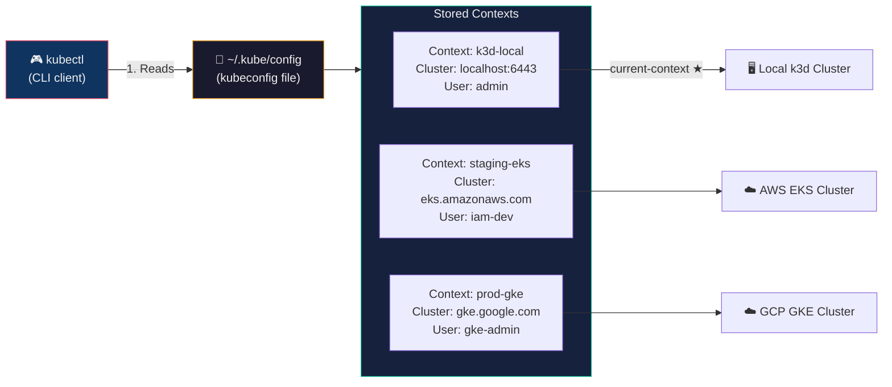
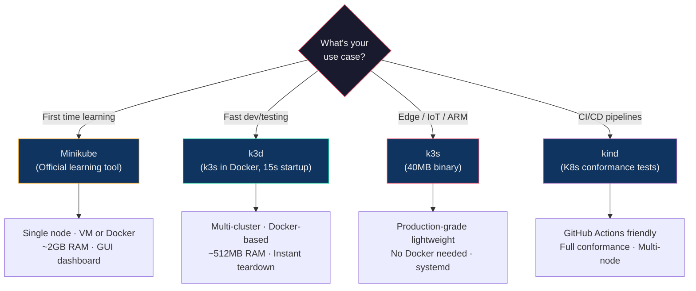
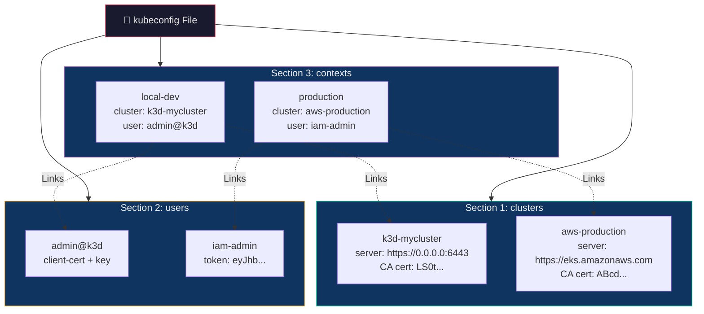

## 🎯 Core Concept

This part focuses on the **practical, hands-on** side of Kubernetes: how to set up a local cluster on your laptop, interact with it using `kubectl`, and understand how `kubeconfig` connects you to any cluster — local, cloud, or on-premise.

> **Part 1** covered *what* Kubernetes is (architecture, controllers, networking, storage, security).
> **Part 2** covers *how* to use Kubernetes (local setup, commands, configuration, multi-cluster management).

---

## 🎮 Real-World Analogy — The TV Remote Control

Imagine you have a **universal TV remote** (that's `kubectl`). It can control any TV (Kubernetes cluster) — your bedroom TV, your living room TV, or even a TV at a friend's house.

| Remote Component | Kubernetes Equivalent | Role |
| :--- | :--- | :--- |
| **The remote itself** | **kubectl** | A client tool — it doesn't contain a TV, it just talks to one |
| **Memory slots (TV 1, TV 2, TV 3)** | **kubeconfig file** | Stores addresses and credentials for multiple clusters |
| **Each memory slot** | **Context** | Links a specific TV (cluster) + user (credentials) |
| **Current selection (TV 2 is active)** | **current-context** | Which cluster `kubectl` is currently talking to |
| **Pressing "Source" to switch** | **`kubectl config use-context`** | Instantly switch from one cluster to another |
| **Pairing a new TV** | **`aws eks update-kubeconfig`** | Cloud provider adds a new cluster to your remote |

**The key insight:** `kubectl` is just a remote. Without a kubeconfig file telling it where to connect, it does nothing. With one, it can control any cluster anywhere.

---

## 📐 Architecture Diagram — How kubectl Connects to Clusters



---

## 📖 Part 1 — Why Not Use a Production Cluster for Learning?

A real production Kubernetes cluster requires:

| Resource | Typical Requirement |
| :--- | :--- |
| Control plane nodes | 3 (high availability) |
| Worker nodes | 3–10+ |
| RAM | 16–32 GB minimum |
| Networking | CNI plugins (Calico, Flannel, Cilium) |
| Storage | Persistent Volume providers |
| Load Balancers | External LB or MetalLB |

This is impractical on a student laptop. Instead, we use **local Kubernetes tools** that simulate a full cluster on a single machine.

---

## 📖 Part 2 — Local Kubernetes Tools (Complete Comparison)



### Detailed Comparison

| Tool | How It Works | Startup | RAM | Multi-Cluster | Best For |
| :--- | :--- | :--- | :--- | :--- | :--- |
| **Minikube** | Single-node cluster (VM or Docker driver) | ~60 sec | ~2 GB | ❌ | Absolute beginners, official tutorials |
| **k3s** | Lightweight K8s binary (single process) | ~30 sec | ~512 MB | ❌ (per install) | Edge computing, IoT, ARM/Raspberry Pi |
| **k3d** | Runs k3s *inside* Docker containers | ~15 sec | ~512 MB | ✅ Multiple clusters | Students, developers, rapid prototyping |
| **kind** | Runs K8s nodes as Docker containers | ~60 sec | ~1 GB | ✅ Multiple clusters | CI/CD testing, K8s conformance, GitHub Actions |

### When to Use What — Quick Decision Guide

| Scenario | Tool |
| :--- | :--- |
| "I'm brand new to Kubernetes" | **Minikube** |
| "I want the fastest possible local setup" | **k3d** |
| "I'm running K8s on a Raspberry Pi" | **k3s** |
| "I need to test my app against real K8s in CI/CD" | **kind** |
| "I need multiple clusters simultaneously" | **k3d** or **kind** |

---

## 📖 Part 3 — Recommended Student Stack

```text
┌──────────────────────────────────────────────┐
│  WSL 2 (Linux environment on Windows)        │
│                                              │
│  ┌────────────────┐  ┌─────────────────┐     │
│  │   kubectl      │  │      k3d        │     │
│  │  (CLI client)  │  │ (Local cluster) │     │
│  └────────────────┘  └─────────────────┘     │
│                                              │
│  ┌──────────────────────────────────────┐    │
│  │  Lens (Optional Kubernetes GUI)      │    │
│  └──────────────────────────────────────┘    │
└──────────────────────────────────────────────┘
```

| Tool | What It Is | Why You Need It |
| :--- | :--- | :--- |
| **WSL 2** | Real Linux environment on Windows | Same commands as production servers — no translation needed |
| **kubectl** | Kubernetes CLI client | The *only* tool you need to interact with any K8s cluster |
| **k3d** | Local K8s cluster engine | Creates clusters in seconds, destroys them instantly, uses minimal RAM |
| **Lens** (optional) | Kubernetes GUI dashboard | Visual view of pods, deployments, logs, and node health — great for learning |

---

## 📖 Part 4 — Installation Guide (WSL / Linux)

### Step 1: Install `kubectl`

```bash
# Download the latest stable kubectl binary
curl -LO https://dl.k8s.io/release/stable/bin/linux/amd64/kubectl

# Make it executable
chmod +x kubectl

# Move to system PATH so you can run it from anywhere
sudo mv kubectl /usr/local/bin/

# Verify the installation
kubectl version --client
```

**Expected Output:**

```text
Client Version: v1.29.x
Kustomize Version: v5.x.x
```

**What each step does:**

| Command | Purpose |
| :--- | :--- |
| `curl -LO <URL>` | Downloads the kubectl binary (`-L` follows redirects, `-O` saves with original filename) |
| `chmod +x kubectl` | Makes the file executable (Linux requires this for binaries) |
| `sudo mv kubectl /usr/local/bin/` | Moves it to a directory in your `$PATH` — so you can type `kubectl` anywhere |
| `kubectl version --client` | Verifies kubectl is installed and shows the version (doesn't need a cluster) |

---

### Step 2: Install k3d

```bash
# One-line install script from the k3d project
curl -s https://raw.githubusercontent.com/k3d-io/k3d/main/install.sh | bash

# Verify
k3d version
```

> **Prerequisites:** Docker must be running. k3d uses Docker to create containers that act as K8s nodes.

---

### Step 3: Create Your First Cluster

```bash
# Create a single-node cluster named 'mycluster'
k3d cluster create mycluster
```

**What happens behind the scenes:**

1. k3d pulls the `rancher/k3s` Docker image
2. Creates a Docker container running k3s (lightweight K8s)
3. Configures `~/.kube/config` with the cluster's API address and credentials
4. Sets `current-context` to `k3d-mycluster`
5. You now have a fully functional Kubernetes cluster

**Verify the cluster is running:**

```bash
kubectl get nodes
```

**Expected Output:**

```text
NAME                      STATUS   ROLES                  AGE   VERSION
k3d-mycluster-server-0    Ready    control-plane,master   30s   v1.28.x+k3s1
```

**Useful k3d commands:**

```bash
# List all k3d clusters
k3d cluster list

# Stop a cluster (preserves state)
k3d cluster stop mycluster

# Start a stopped cluster
k3d cluster start mycluster

# Delete a cluster completely
k3d cluster delete mycluster

# Create a multi-node cluster (1 server + 2 workers)
k3d cluster create multi --servers 1 --agents 2
```

---

## 📖 Part 5 — Essential `kubectl` Commands (10-Task Lab)

### Task 1: View Cluster Nodes

```bash
kubectl get nodes
```

| Column | Meaning |
| :--- | :--- |
| `NAME` | Hostname of the machine (or Docker container for k3d) |
| `STATUS` | `Ready` = healthy and accepting pods; `NotReady` = problem |
| `ROLES` | `control-plane` = master node; `<none>` = worker node |
| `AGE` | Time since the node joined the cluster |
| `VERSION` | Kubernetes version running on that node |

**Expected Output:**

```text
NAME                      STATUS   ROLES                  AGE   VERSION
k3d-mycluster-server-0    Ready    control-plane,master   5m    v1.28.x+k3s1
```

**Add `-o wide` for more details** (IP address, OS, container runtime):

```bash
kubectl get nodes -o wide
```

---

### Task 2: View Running Pods

```bash
kubectl get pods
```

> **Pod** = the smallest deployable unit in Kubernetes. A pod wraps one or more containers that share networking (same IP) and storage.

**If no pods exist yet:**

```text
No resources found in default namespace.
```

**See all namespaces** (including system pods):

```bash
kubectl get pods -A
```

**Watch pods in real-time** (auto-refreshes):

```bash
kubectl get pods -w
```

---

### Task 3: Run a Container (Create a Pod)

```bash
kubectl run nginx --image=nginx
```

| Argument | Purpose |
| :--- | :--- |
| `run` | Creates a single pod (imperative command) |
| `nginx` | Name of the pod |
| `--image=nginx` | Docker Hub image to pull and run inside the pod |

**Verify:**

```bash
kubectl get pods
```

**Expected Output:**

```text
NAME    READY   STATUS    RESTARTS   AGE
nginx   1/1     Running   0          15s
```

| Column | Meaning |
| :--- | :--- |
| `READY` | `1/1` = 1 container running out of 1 expected |
| `STATUS` | `Running`, `Pending`, `CrashLoopBackOff`, `ImagePullBackOff` |
| `RESTARTS` | Number of times the container has been restarted |

---

### Task 4: Inspect Pod Details

```bash
kubectl describe pod nginx
```

Shows **everything** about the pod:

- **Events** — image pull, container creation, scheduling decisions
- **Container info** — image name, ports, environment variables
- **Networking** — pod IP address, which node it's running on
- **Resource usage** — CPU/memory requests and limits
- **Conditions** — PodScheduled, Initialized, ContainersReady, Ready

> **This is your #1 debugging tool.** When a pod isn't working, `describe` is always the first command to run.

---

### Task 5: View Container Logs

```bash
kubectl logs nginx
```

Shows **stdout/stderr** output from the container — exactly like `docker logs`.

**Follow logs in real-time:**

```bash
kubectl logs -f nginx
```

**View previous container's logs** (if it crashed and restarted):

```bash
kubectl logs nginx --previous
```

**Multi-container pod** (specify which container):

```bash
kubectl logs nginx -c sidecar
```

---

### Task 6: Create a Deployment

```bash
kubectl create deployment web --image=nginx
```

**Why use a Deployment instead of `kubectl run`?**

| | `kubectl run` | `kubectl create deployment` |
| :--- | :--- | :--- |
| **Creates** | A single bare pod | Deployment → ReplicaSet → Pod(s) |
| **Self-healing** | ❌ If pod dies, it's gone forever | ✅ Controller automatically recreates it |
| **Scaling** | ❌ Cannot scale | ✅ `kubectl scale --replicas=N` |
| **Rolling updates** | ❌ | ✅ Zero-downtime updates |
| **Rollback** | ❌ | ✅ `kubectl rollout undo` |
| **Use case** | Quick test / debug | Production workloads |

> **Rule:** Always use Deployments for real applications. Never run bare pods in production — if the node fails, bare pods are *not* rescheduled.

---

### Task 7: Scale an Application

```bash
kubectl scale deployment web --replicas=3
```

**What happens internally:**

1. Deployment controller updates desired replica count → 3
2. ReplicaSet controller detects only 1 pod exists → needs 2 more
3. Scheduler assigns the 2 new pods to available nodes
4. You now have 3 identical pods handling traffic

**Verify:**

```bash
kubectl get pods
```

```text
NAME                   READY   STATUS    RESTARTS   AGE
web-6f8b4c5d7-abc12    1/1     Running   0          2m
web-6f8b4c5d7-def34    1/1     Running   0          10s
web-6f8b4c5d7-ghi56    1/1     Running   0          10s
```

**Scale back down:**

```bash
kubectl scale deployment web --replicas=1
```

---

### Task 8: Expose an Application (Create a Service)

```bash
kubectl expose deployment web --port=80 --type=NodePort
```

| Flag | Purpose |
| :--- | :--- |
| `--port=80` | The port the Service listens on (must match the container port) |
| `--type=NodePort` | Exposes the Service on a static port (30000–32767) on every node's IP |

**Service types recap:**

| Type | Access From | Use Case |
| :--- | :--- | :--- |
| `ClusterIP` (default) | Inside the cluster only | Microservice-to-microservice |
| `NodePort` | `<NodeIP>:<Port>` | Development, testing |
| `LoadBalancer` | External LB (cloud) | Production external access |

---

### Task 9: Access the Service

```bash
# List all services
kubectl get services
```

```text
NAME   TYPE       CLUSTER-IP     EXTERNAL-IP   PORT(S)        AGE
web    NodePort   10.43.12.56    <none>        80:31234/TCP   30s
```

```bash
# Create a tunnel from localhost to the service
kubectl port-forward service/web 8080:80
```

Now open `http://localhost:8080` in your browser — you'll see the NGINX welcome page.

> **Port-forward** creates a temporary tunnel from your machine to the cluster. It's a development tool — not for production traffic.

---

### Task 10: Delete Resources

```bash
# Delete a single pod
kubectl delete pod nginx

# Delete a deployment (also deletes its ReplicaSet and pods)
kubectl delete deployment web

# Delete a service
kubectl delete service web

# Nuclear option: delete EVERYTHING in the current namespace
kubectl delete all --all
```

---

## 📖 Part 6 — The kubeconfig System (Deep Dive)

### What Is kubeconfig?

`kubectl` does **not** discover clusters automatically. It relies entirely on a configuration file called **kubeconfig**.

**Default location:**

```text
~/.kube/config
```

This YAML file stores three things:

1. **WHERE** to connect (cluster addresses)
2. **HOW** to authenticate (user credentials)
3. **WHICH** combination to use (contexts)

---

### The Three Core Sections



---

#### Section 1: `clusters` — WHERE to Connect

```yaml
clusters:
- name: k3d-mycluster
  cluster:
    server: https://0.0.0.0:6443                    # API server URL
    certificate-authority-data: LS0tLS1CRUd...       # CA cert for TLS verification
```

> "This is the *address* of the Kubernetes cluster and the certificate to verify it's genuine."

---

#### Section 2: `users` — HOW to Authenticate

```yaml
users:
- name: admin@k3d-mycluster
  user:
    client-certificate-data: LS0tLS1CRUd...          # Client certificate
    client-key-data: LS0tLS1CRUdJ...                 # Private key
```

**Authentication methods vary by environment:**

| Method | Used By | Example |
| :--- | :--- | :--- |
| X.509 Certificates | Local clusters | k3d, minikube, kubeadm |
| Bearer Tokens | Service accounts, cloud | Cloud-managed clusters |
| OIDC / OAuth | Enterprise SSO | Okta, Azure AD, Google Workspace |
| Exec Plugins | Cloud CLIs | `aws-iam-authenticator`, `gke-gcloud-auth-plugin` |

> "These are the *credentials* to prove your identity to the API server."

---

#### Section 3: `contexts` — WHICH Cluster + WHICH User

```yaml
contexts:
- name: k3d-mycluster
  context:
    cluster: k3d-mycluster            # References a cluster from Section 1
    user: admin@k3d-mycluster          # References a user from Section 2
    namespace: default                  # Optional: default namespace for this context

current-context: k3d-mycluster         # The ACTIVE context
```

> "Use *this user* to connect to *this cluster* in *this namespace*."

---

### How `kubectl` Resolves a Command

When you run `kubectl get pods`, this happens internally:

```text
1. kubectl reads ~/.kube/config
2. Finds current-context → "k3d-mycluster"
3. Looks up context "k3d-mycluster":
   ├── cluster → k3d-mycluster → server: https://0.0.0.0:6443
   └── user   → admin@k3d → (certificate + key)
4. Makes HTTPS request: GET https://0.0.0.0:6443/api/v1/namespaces/default/pods
5. Authenticates with the client certificate
6. API Server validates, reads etcd, returns pod list as JSON
7. kubectl formats the JSON and displays it as a table
```

---

### Managing Multiple Clusters

```bash
# View all available contexts
kubectl config get-contexts
```

**Example Output:**

```text
CURRENT   NAME              CLUSTER           AUTHINFO              NAMESPACE
*         k3d-mycluster     k3d-mycluster     admin@k3d-mycluster   default
          minikube          minikube          minikube              default
          production-eks    aws-prod          iam-admin             production
```

The `*` marks the currently active context.

```bash
# Switch to a different cluster
kubectl config use-context minikube

# Verify which cluster you're now connected to
kubectl config current-context
# Output: minikube

# View the full kubeconfig (all clusters, users, contexts)
kubectl config view

# View only the relevant section (useful with many clusters)
kubectl config view --minify
```

---

### Using Custom kubeconfig Files

```bash
# Use a different config file for one command
kubectl --kubeconfig=~/aws-config.yaml get pods

# Merge multiple configs via environment variable
export KUBECONFIG=~/.kube/config:~/aws-config.yaml:~/staging-config.yaml
```

When `KUBECONFIG` contains multiple colon-separated paths, kubectl **merges** them into a single view. This lets you manage local, staging, and production clusters from one terminal without editing any file.

---

### How Cloud Providers Add Their Clusters

```bash
# AWS EKS — auto-adds cluster, user, and context to kubeconfig
aws eks update-kubeconfig --region ap-south-1 --name mycluster

# Google GKE
gcloud container clusters get-credentials mycluster --zone us-central1-a

# Azure AKS
az aks get-credentials --resource-group mygroup --name mycluster
```

Each command automatically:

1. Adds a `cluster` entry (API server URL + CA certificate)
2. Adds a `user` entry (auth plugin or token)
3. Creates a `context` linking them
4. Sets `current-context` to the new cluster

---

## 📖 Part 7 — Common Beginner Mistakes & Troubleshooting

| Symptom | Root Cause | Fix |
| :--- | :--- | :--- |
| `kubectl: command not found` | kubectl not installed or not in `$PATH` | Rerun installation steps (Part 4) |
| `The connection to the server was refused` | No cluster running or wrong context | `k3d cluster create mycluster` or `kubectl config use-context <correct>` |
| `Unable to connect to the server: dial tcp: connect: connection refused` | Docker not running (k3d needs Docker) | Start Docker Desktop or `sudo systemctl start docker` |
| `No resources found in default namespace` | Pods exist in a different namespace | `kubectl get pods -A` to see all namespaces |
| `error: the server doesn't have a resource type "pod"` | Typo — `pod` works, but `pods` is also valid | Use `kubectl api-resources` to see all resource names |
| "I ran `kubectl` but it's talking to the wrong cluster" | Wrong `current-context` selected | `kubectl config use-context <correct-cluster>` |
| `Forbidden` or `permission denied` | Incorrect credentials or missing RBAC permissions | Check kubeconfig user section or contact cluster admin |

---

## 📖 Part 8 — Advanced kubectl Techniques

### Imperative vs Declarative

| Approach | Command | When to Use |
| :--- | :--- | :--- |
| **Imperative** | `kubectl run nginx --image=nginx` | Quick tests, learning, debugging |
| **Declarative** | `kubectl apply -f deployment.yaml` | Production — version-controlled, repeatable, auditable |

### Useful Advanced Commands

```bash
# Execute a command inside a running pod (like docker exec)
kubectl exec -it nginx -- /bin/bash

# Copy files to/from a pod
kubectl cp local-file.txt nginx:/tmp/file.txt
kubectl cp nginx:/var/log/nginx/access.log ./access.log

# Get output as YAML (useful for learning resource structure)
kubectl get deployment web -o yaml

# Get output as JSON then filter with jq
kubectl get pods -o json | jq '.items[].metadata.name'

# Dry-run + output (generate YAML without creating the resource)
kubectl run nginx --image=nginx --dry-run=client -o yaml > pod.yaml

# Apply a YAML manifest (declarative)
kubectl apply -f deployment.yaml

# Watch resources change in real-time
kubectl get pods -w

# Get resource usage (requires metrics-server)
kubectl top pods
kubectl top nodes

# View cluster events (useful for debugging)
kubectl get events --sort-by=.metadata.creationTimestamp
```

---

## 📖 Part 9 — kubectl Cheatsheet

| Task | Command |
| :--- | :--- |
| **Cluster info** | `kubectl cluster-info` |
| **List nodes** | `kubectl get nodes` |
| **List all resources** | `kubectl get all -A` |
| **Create a pod** | `kubectl run <name> --image=<image>` |
| **Create a deployment** | `kubectl create deployment <name> --image=<image>` |
| **Scale** | `kubectl scale deployment <name> --replicas=N` |
| **Expose** | `kubectl expose deployment <name> --port=80 --type=NodePort` |
| **Describe** | `kubectl describe <resource> <name>` |
| **Logs** | `kubectl logs <pod>` |
| **Exec into pod** | `kubectl exec -it <pod> -- /bin/bash` |
| **Port forward** | `kubectl port-forward svc/<name> 8080:80` |
| **Delete** | `kubectl delete <resource> <name>` |
| **Apply YAML** | `kubectl apply -f <file.yaml>` |
| **Dry run → YAML** | `kubectl run <name> --image=<image> --dry-run=client -o yaml` |
| **Switch context** | `kubectl config use-context <name>` |
| **View contexts** | `kubectl config get-contexts` |
| **Current context** | `kubectl config current-context` |

---

## 📚 Key Terminology — Glossary

| Term | Definition |
| :--- | :--- |
| **kubectl** | The official CLI tool for interacting with Kubernetes clusters via the API Server |
| **kubeconfig** | A YAML config file (`~/.kube/config`) storing cluster addresses, user credentials, and contexts |
| **Context** | A triple of (cluster + user + namespace) in kubeconfig that determines where kubectl sends commands |
| **current-context** | The active context — all `kubectl` commands target this cluster by default |
| **Cluster (kubeconfig)** | An entry storing the API server URL and CA certificate |
| **User (kubeconfig)** | An entry storing authentication credentials (certificates, tokens, or exec plugins) |
| **Minikube** | Official single-node K8s learning tool — runs as a VM or Docker container |
| **k3s** | Lightweight Kubernetes distribution by Rancher — 40MB binary, production-grade |
| **k3d** | Tool that runs k3s inside Docker containers for fast local cluster creation |
| **kind** | Kubernetes IN Docker — runs K8s nodes as Docker containers, ideal for CI/CD |
| **WSL 2** | Windows Subsystem for Linux — real Linux kernel on Windows, used for K8s development |
| **Lens** | GUI dashboard for Kubernetes — visual view of pods, deployments, logs, and node health |
| **Pod** | The smallest deployable unit in K8s — wraps one or more containers sharing network and storage |
| **Deployment** | A controller that manages ReplicaSets and Pods — provides self-healing, scaling, rolling updates |
| **Service** | A stable network endpoint (virtual IP + DNS) that load-balances traffic across a set of pods |
| **NodePort** | A Service type that opens a static port on every node's IP (range: 30000–32767) |
| **Namespace** | A virtual partition within a cluster for isolating resources (e.g., `default`, `kube-system`) |
| **Port-forward** | A kubectl feature that tunnels local traffic to a pod or service inside the cluster |
| **Imperative** | Running commands directly (`kubectl run`, `kubectl create`) — quick but not version-controlled |
| **Declarative** | Applying YAML manifests (`kubectl apply -f`) — production standard, repeatable, auditable |
| **Dry run** | A `kubectl` flag (`--dry-run=client`) that simulates a command without actually executing it |

---

## 🎓 Exam & Interview Preparation

### Q1: Explain the kubeconfig file structure. How does `kubectl` use it to connect to different clusters?

**Answer:**

The kubeconfig file (default: `~/.kube/config`) is a YAML file with three core sections:

1. **`clusters`** — defines cluster endpoints (API server URL + CA certificate)
2. **`users`** — defines authentication credentials (X.509 certificates, bearer tokens, or exec plugins like `aws-iam-authenticator`)
3. **`contexts`** — links a cluster with a user and optionally a default namespace

When `kubectl` runs any command:

1. Reads `~/.kube/config`
2. Identifies `current-context` (e.g., `k3d-mycluster`)
3. Resolves the linked cluster → server URL + CA cert
4. Resolves the linked user → authentication credentials
5. Makes an authenticated HTTPS request to the API server
6. API server returns the result as JSON; kubectl formats and displays it

**Multi-cluster management:** Multiple clusters can coexist in one kubeconfig. Use `kubectl config use-context <name>` to switch instantly. The `KUBECONFIG` environment variable can merge multiple config files (colon-separated paths).

---

### Q2: Compare Minikube, k3d, k3s, and kind. When would you choose each for a project?

**Answer:**

| Tool | Architecture | Startup | RAM | Multi-Cluster | Best For |
| :--- | :--- | :--- | :--- | :--- | :--- |
| **Minikube** | Single-node (VM or Docker) | ~60s | ~2 GB | ❌ | Beginners following official K8s tutorials |
| **k3s** | Lightweight binary (systemd) | ~30s | ~512 MB | ❌ | Edge computing, IoT, ARM/Raspberry Pi, production-lightweight |
| **k3d** | k3s inside Docker containers | ~15s | ~512 MB | ✅ | Developers needing fast iteration, students, multiple clusters |
| **kind** | K8s nodes as Docker containers | ~60s | ~1 GB | ✅ | CI/CD pipelines, K8s conformance testing, GitHub Actions |

**Decision framework:**
- **Learning/tutorials** → Minikube (most documentation targets it)
- **Daily development** → k3d (fastest startup, easy teardown)
- **Low-resource environments** → k3s (runs on Raspberry Pi, edge devices)
- **Automated testing** → kind (designed for CI/CD, full K8s compliance)

---

### Q3: A junior developer says "`kubectl run` is sufficient for deploying apps to production." Evaluate this statement and explain the correct approach.

**Answer:**

This statement is **incorrect**. `kubectl run` creates a **bare pod** — a single pod with no controller managing it. Here's why that's dangerous in production:

| Risk | What Happens |
| :--- | :--- |
| **Pod dies** | Gone forever — no controller to recreate it |
| **Node fails** | The pod is NOT rescheduled to another node |
| **Need to scale** | Cannot — bare pods don't support `kubectl scale` |
| **Need to update** | Must delete and recreate manually — causing downtime |
| **No rollback** | If the new version is broken, there's no automatic rollback |

**Correct approach:** Use `kubectl create deployment` or, better yet, **declarative YAML manifests** with `kubectl apply -f`:

```yaml
apiVersion: apps/v1
kind: Deployment
metadata:
  name: web
spec:
  replicas: 3
  selector:
    matchLabels:
      app: web
  template:
    metadata:
      labels:
        app: web
    spec:
      containers:
      - name: nginx
        image: nginx:1.25
```

This provides: self-healing, scaling, rolling updates, rollback, and the YAML can be version-controlled in Git — making deployments repeatable and auditable.

**`kubectl run` is useful ONLY for:** quick debugging, one-off tests, or running a temporary pod to inspect cluster networking.

---

## 📎 Further Resources

- [Kubernetes Official Documentation](https://kubernetes.io/docs/)
- [kubectl Cheatsheet (Official)](https://kubernetes.io/docs/reference/kubectl/cheatsheet/)
- [k3d Documentation](https://k3d.io/)
- [Lens — Kubernetes GUI and Observability](https://medium.com/k8slens/lens-kubernetes-ide-overview-how-to-simplify-kubernetes-management-e19a9aea7dae)
- [Interactive K8s Playground (free)](https://labs.play-with-k8s.com/)
