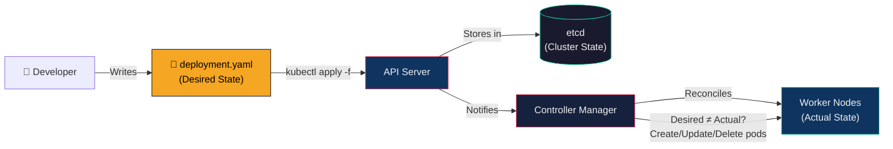
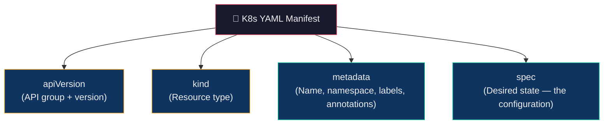
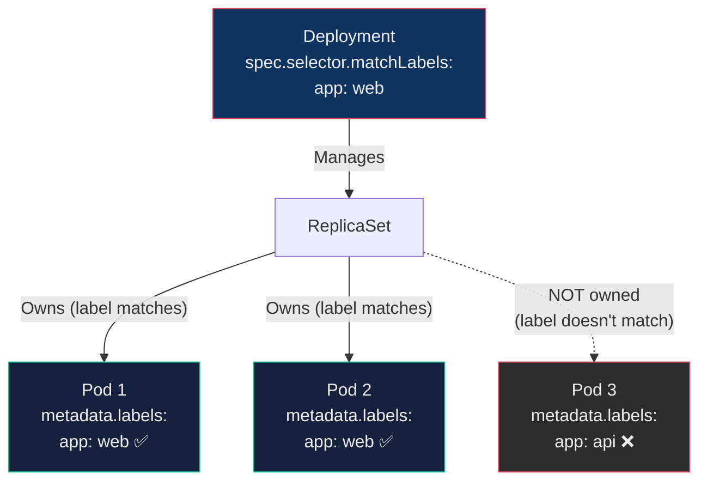
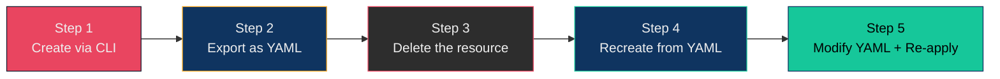
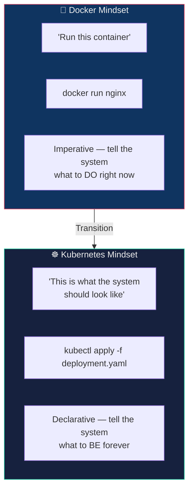

## 🎯 Core Concept

Kubernetes is designed as a **declarative system** — you describe *what* the system should look like, and Kubernetes continuously works to make it so. YAML manifests are the language you use to express that desired state.

> **Imperative:** "Create a deployment, then scale it to 3, then add an env var, then set resource limits..."
> **Declarative:** "Here's a file describing exactly what I want. Make it happen."

This lecture covers *why* YAML matters, *how* to write it, and *how* to transition from CLI commands to production-grade declarative configurations.

---

## 📦 Real-World Analogy — The Blueprint vs. Verbal Instructions

Imagine you're building a house.

| Approach | Real World | Kubernetes |
| :--- | :--- | :--- |
| **Verbal instructions** | "Build a wall here. Now add a window there. Wait, make it bigger." | `kubectl create`, `kubectl scale`, `kubectl set env` — one command at a time |
| **Architectural blueprint** | A detailed drawing showing every wall, window, and wire — reviewed, version-controlled, shared with contractors | A YAML file — reviewed, version-controlled, shared with teams and CI/CD pipelines |

**Why blueprints win:**

| Feature | Verbal (Imperative CLI) | Blueprint (YAML Declarative) |
| :--- | :--- | :--- |
| Reproducible | ❌ "What did I say 3 months ago?" | ✅ Same file → same result, always |
| Version controlled | ❌ No history of changes | ✅ Git tracks every modification |
| Shareable | ❌ Lives in one person's terminal | ✅ Team can review, approve, modify |
| Auditable | ❌ No record of who changed what | ✅ Git blame, PR reviews |
| Automatable | ❌ Requires human to type commands | ✅ CI/CD pipelines apply YAML automatically |

**Key insight:** No construction company builds from verbal instructions alone. No production Kubernetes cluster should be managed with CLI commands alone.

---

## 📐 How Declarative YAML Works in Kubernetes



**The flow:**

1. You write a YAML file describing *what* you want (3 nginx pods, port 80, 256MB memory)
2. `kubectl apply -f deployment.yaml` sends it to the API server
3. API server stores the desired state in etcd
4. Controller Manager compares desired state vs actual state
5. If they differ, controllers take action (create pods, update images, scale replicas)
6. This loop runs **continuously** — if a pod crashes, the controller recreates it to match the YAML

---

## 📖 Part 1 — Why Imperative CLI Commands Are Not Enough

### The 5 Problems with `kubectl create deployment`

```bash
kubectl create deployment web --image=nginx
```

This works for learning, but has **serious limitations** in any real environment:

#### Problem 1: No Version Control

```bash
# Did someone change the deployment last week?
# What was the original configuration?
# Who made the change?
# ¯\_(ツ)_/¯
```

There's no file, no history, no Git log. In a team, this means:

- No code reviews for infrastructure changes
- No rollback to a known-good configuration
- No audit trail

#### Problem 2: Not Reproducible

If you created a deployment with 5 CLI commands (create, scale, set env, set resources, set image), recreating the same setup on another cluster requires remembering and re-running all 5 commands in the exact same order. With YAML, it's one file, one command: `kubectl apply -f deployment.yaml`.

#### Problem 3: Hidden Defaults

When you run `kubectl create deployment web --image=nginx`, Kubernetes silently creates:

- Labels (`app: web`)
- Selectors (`matchLabels: app: web`)
- Pod template with defaults for restartPolicy, terminationGracePeriod, dnsPolicy
- A ReplicaSet with default strategy

You don't *see* any of this. With YAML, every field is explicit and visible.

#### Problem 4: Hard to Modify

Adding replicas, environment variables, resource limits, health checks, and volumes requires multiple separate commands:

```bash
kubectl scale deployment web --replicas=3
kubectl set env deployment/web ENV=prod
kubectl set resources deployment web -c=nginx --limits=memory=256Mi
# ...and more
```

With YAML, it's a single file edit + `kubectl apply`.

#### Problem 5: Not Production-Ready

Real-world Kubernetes environments use:

- **CI/CD pipelines** (GitHub Actions, ArgoCD, Jenkins) that apply YAML files
- **GitOps workflows** where Git is the source of truth
- **Team collaboration** with pull request reviews for infrastructure changes

None of these work with imperative CLI commands.

---

## 📖 Part 2 — The YAML Deployment Manifest (Line by Line)

### The Complete Example

```yaml
apiVersion: apps/v1           # Which K8s API group and version
kind: Deployment              # What type of resource

metadata:                     # Identity of this resource
  name: web                   #   Name (unique within namespace)
  labels:                     #   Optional labels for organizing
    app: web

spec:                         # Desired state specification
  replicas: 3                 #   Number of pod copies

  selector:                   #   How the Deployment finds its pods
    matchLabels:
      app: web                #   Must match the pod template labels

  template:                   #   Pod template — what each pod looks like
    metadata:
      labels:
        app: web              #   These labels must match selector above

    spec:                     #   Pod specification
      containers:
      - name: nginx           #   Container name
        image: nginx:1.25     #   Image to pull and run
        ports:
        - containerPort: 80   #   Port the container listens on
```

### The 4-Field Structure

**Every** Kubernetes resource follows this exact structure:



| Field | Purpose | Example |
| :--- | :--- | :--- |
| `apiVersion` | Which API group and version to use | `apps/v1` for Deployments, `v1` for Pods/Services |
| `kind` | What type of resource you're creating | `Deployment`, `Service`, `ConfigMap`, `Secret` |
| `metadata` | Identity — name, namespace, labels, annotations | `name: web`, `labels: { app: web }` |
| `spec` | The actual desired state configuration | Replicas, containers, ports, volumes, resources |

### The Label-Selector Connection

This is the **most commonly misunderstood** part of Kubernetes YAML:



**Rules:**

1. `spec.selector.matchLabels` in the Deployment **must match** `spec.template.metadata.labels` in the pod template
2. The Deployment only manages pods whose labels match its selector
3. If labels don't match, Kubernetes rejects the manifest with an error

---

## 📖 Part 3 — Applying YAML (The Commands)

### Create or Update

```bash
# Apply a YAML file (creates if new, updates if exists)
kubectl apply -f deployment.yaml
```

> `kubectl apply` is **idempotent** — you can run it 100 times and it only makes changes if the YAML has changed. This is what makes it safe for CI/CD pipelines.

### Verify

```bash
# Check the deployment
kubectl get deployments

# Check the pods it created
kubectl get pods

# Detailed view of the deployment
kubectl describe deployment web
```

### Update (Edit YAML → Re-apply)

```bash
# Edit the YAML file (e.g., change replicas from 3 to 5)
# Then re-apply:
kubectl apply -f deployment.yaml
```

Kubernetes diffs the new YAML against the current state and only changes what's different.

### Delete

```bash
# Delete everything defined in the YAML
kubectl delete -f deployment.yaml
```

---

## 📖 Part 4 — Essential kubectl Skills for YAML Work

### Skill 1: Generate YAML from Commands (The Shortcut)

```bash
# Generate YAML without creating the resource
kubectl create deployment web --image=nginx --dry-run=client -o yaml
```

| Flag | Purpose |
| :--- | :--- |
| `--dry-run=client` | Simulate — don't actually create anything |
| `-o yaml` | Output the result as YAML |

**Save it to a file:**

```bash
kubectl create deployment web --image=nginx --dry-run=client -o yaml > deployment.yaml
```

> This is the **fastest way to start writing YAML**. Let Kubernetes generate the boilerplate, then customize it.

### Skill 2: Export Existing Resources as YAML

```bash
# View any existing resource as YAML
kubectl get deployment web -o yaml
```

This shows the **complete** YAML — including all the fields Kubernetes added internally (status, managed fields, defaults). It's the best way to learn what fields are available.

### Skill 3: Use `kubectl explain` (Built-in Documentation)

```bash
# Explain a resource type
kubectl explain deployment

# Drill into nested fields
kubectl explain deployment.spec
kubectl explain deployment.spec.template.spec.containers
kubectl explain deployment.spec.strategy
```

> `kubectl explain` is your **interactive YAML reference**. It describes every field, its type, and whether it's required.

### Skill 4: Edit Live Resources

```bash
# Opens the resource in your default editor ($EDITOR)
kubectl edit deployment web
```

> ⚠️ **Use cautiously:** Editing live resources is useful for debugging, but changes aren't reflected in your YAML file. For production, always edit the YAML file and re-apply.

### Skill 5: Watch Changes in Real-Time

```bash
kubectl get pods -w
```

### Skill 6: View Events (Debugging)

```bash
kubectl get events --sort-by=.metadata.creationTimestamp
```

### Skill 7: Validate YAML Before Applying

```bash
# Server-side dry run — validates against the actual cluster
kubectl apply -f deployment.yaml --dry-run=server

# Client-side — validates YAML syntax only
kubectl apply -f deployment.yaml --dry-run=client
```

---

## 📖 Part 5 — YAML Syntax Essentials (for Kubernetes)

You don't need to master YAML as a language. You only need three concepts:

### 1. Key-Value Pairs

```yaml
name: web
replicas: 3
image: nginx:1.25
```

### 2. Nested Objects (Indentation = 2 spaces)

```yaml
metadata:
  name: web
  labels:
    app: web
    tier: frontend
```

> ⚠️ **YAML uses spaces, never tabs.** Incorrect indentation is the #1 cause of YAML errors.

### 3. Lists (Dash + Space)

```yaml
containers:
- name: nginx
  image: nginx
- name: sidecar
  image: fluentd
```

### Common YAML Mistakes

| Mistake | What Goes Wrong | Fix |
| :--- | :--- | :--- |
| Using tabs instead of spaces | `found character '\t' that cannot start any token` | Use spaces only (2-space indent) |
| Wrong indentation level | Fields end up under the wrong parent | Check that child items are exactly 2 spaces deeper |
| Missing `-` for list items | Containers treated as a single invalid object | Add `- ` before each item in a list |
| Typo in `apiVersion` or `kind` | `no matches for kind "Deployments"` | Use `kubectl api-resources` to verify correct names |
| Selector doesn't match template labels | `selector does not match template labels` | Ensure `matchLabels` equals `template.metadata.labels` |

---

## 📖 Part 6 — Production-Ready YAML (Beyond the Basics)

A real-world Deployment YAML includes much more than name and image:

```yaml
apiVersion: apps/v1
kind: Deployment
metadata:
  name: web
  namespace: production
  labels:
    app: web
    version: v2
    team: platform
spec:
  replicas: 3
  strategy:
    type: RollingUpdate
    rollingUpdate:
      maxSurge: 1
      maxUnavailable: 0
  selector:
    matchLabels:
      app: web
  template:
    metadata:
      labels:
        app: web
        version: v2
    spec:
      containers:
      - name: nginx
        image: nginx:1.25
        ports:
        - containerPort: 80
        resources:
          requests:
            cpu: "100m"
            memory: "128Mi"
          limits:
            cpu: "500m"
            memory: "256Mi"
        livenessProbe:
          httpGet:
            path: /
            port: 80
          initialDelaySeconds: 10
          periodSeconds: 5
        readinessProbe:
          httpGet:
            path: /
            port: 80
          initialDelaySeconds: 5
          periodSeconds: 3
        env:
        - name: ENVIRONMENT
          value: "production"
        - name: DB_PASSWORD
          valueFrom:
            secretKeyRef:
              name: db-secret
              key: password
```

### What Each New Section Does

| Section | Purpose | Why It Matters |
| :--- | :--- | :--- |
| `namespace` | Isolates resources into logical groups | Prevents dev resources from mixing with production |
| `strategy` | Controls how updates are rolled out | `maxUnavailable: 0` = zero-downtime updates |
| `resources.requests` | Minimum CPU/memory guaranteed to the container | Scheduler uses this to place pods on nodes |
| `resources.limits` | Maximum CPU/memory the container can use | Prevents a single container from consuming all node resources |
| `livenessProbe` | Checks if the container is still alive | If it fails, kubelet restarts the container |
| `readinessProbe` | Checks if the container is ready to receive traffic | If it fails, the Service stops routing traffic to this pod |
| `env` / `valueFrom` | Injects configuration and secrets | Keeps sensitive data out of the image |

---

## 📖 Part 7 — The Practice Flow (CLI → YAML → Real Kubernetes)

### The 5-Step Bridge Exercise

This exercise builds muscle memory for working with YAML:



#### Step 1 — Create via CLI

```bash
kubectl create deployment web --image=nginx
```

#### Step 2 — Export as YAML

```bash
kubectl get deployment web -o yaml > web.yaml
```

#### Step 3 — Delete the CLI-created resource

```bash
kubectl delete deployment web
```

#### Step 4 — Recreate from the YAML file

```bash
kubectl apply -f web.yaml
```

#### Step 5 — Modify the YAML and re-apply

Edit `web.yaml`:

```yaml
spec:
  replicas: 3    # Changed from 1 to 3
```

```bash
kubectl apply -f web.yaml
kubectl get pods   # Should now show 3 pods
```

> After this exercise, you've proven that the YAML file is equivalent to the CLI command — but better, because it's a file you can store, share, and version-control.

---

## 📖 Part 8 — The Mental Model Shift



| Docker Thinking | Kubernetes Thinking |
| :--- | :--- |
| "Run this container now" | "This deployment should always exist like this" |
| Commands you type | Files you write |
| One-time execution | Continuous reconciliation |
| Your terminal is the source of truth | Git is the source of truth |
| You manage containers | Controllers manage pods for you |

---

## 📚 Key Terminology — Glossary

| Term | Definition |
| :--- | :--- |
| **Imperative** | Command-based approach — you tell K8s what to *do* step by step (`kubectl create`, `kubectl scale`) |
| **Declarative** | State-based approach — you tell K8s what the system *should look like* via YAML, and it reconciles |
| **YAML** | YAML Ain't Markup Language — a human-readable data serialization format used for K8s manifests |
| **Manifest** | A YAML file describing a Kubernetes resource (Deployment, Service, ConfigMap, etc.) |
| **`kubectl apply`** | Declarative command that creates or updates resources based on a YAML file; idempotent |
| **`kubectl create`** | Imperative command that creates a resource; fails if it already exists |
| **`--dry-run=client`** | kubectl flag that simulates a command without executing it — used to generate YAML |
| **`-o yaml`** | Output flag that renders any resource as YAML — essential for learning manifest structure |
| **`kubectl explain`** | Built-in documentation — describes every field of any resource type |
| **apiVersion** | Declares which API group and version the resource belongs to (e.g., `apps/v1`, `v1`) |
| **kind** | The type of Kubernetes resource being defined (e.g., `Deployment`, `Service`, `Pod`) |
| **metadata** | Identity section — resource name, namespace, labels, and annotations |
| **spec** | The desired state specification — replicas, containers, ports, volumes, strategy |
| **Labels** | Key-value pairs attached to resources; used by selectors to group and target objects |
| **Selector** | A label-matching rule that tells a controller (Deployment/Service) which pods it manages |
| **Pod Template** | The `spec.template` section in a Deployment — defines what each pod looks like |
| **Idempotent** | A property where running the same command multiple times produces the same result |
| **Rolling Update Strategy** | Default Deployment update method — gradually replaces old pods with new ones |
| **Resource Requests** | Minimum CPU/memory guaranteed to a container; used by the scheduler for placement |
| **Resource Limits** | Maximum CPU/memory a container is allowed to consume |
| **Liveness Probe** | Health check that determines if a container needs to be restarted |
| **Readiness Probe** | Health check that determines if a container is ready to receive traffic |
| **GitOps** | A practice where Git repositories are the single source of truth for infrastructure and application configuration |

---

## 🎓 Exam & Interview Preparation

### Q1: Compare imperative and declarative approaches to Kubernetes resource management. Why is the declarative approach preferred in production?

**Answer:**

| Dimension | Imperative (`kubectl create/run`) | Declarative (`kubectl apply -f`) |
| :--- | :--- | :--- |
| **How it works** | You tell K8s what to *do* right now | You describe what the system *should look like* |
| **Reproducibility** | ❌ No record of commands run | ✅ Same YAML file → same result every time |
| **Version control** | ❌ No file to commit to Git | ✅ YAML files tracked in Git with full history |
| **Idempotency** | ❌ `create` fails if resource exists | ✅ `apply` creates if new, updates if changed |
| **Team collaboration** | ❌ Lives in one person's terminal | ✅ PRs, code reviews, shared configurations |
| **CI/CD integration** | ❌ Requires scripting all commands | ✅ Pipelines just run `kubectl apply -f` |
| **Auditability** | ❌ No record of who changed what | ✅ Git blame, commit history, PR reviews |

**Why declarative wins in production:** Kubernetes is designed as a declarative system — you define desired state, and controllers continuously reconcile. YAML manifests align with this design. They are version-controlled, reviewable, reproducible, and automatable. The entire GitOps movement (ArgoCD, FluxCD) is built on applying declarative YAML from Git repositories.

**Imperative commands are still useful for:** quick debugging, one-off tests, and generating YAML boilerplate with `--dry-run=client -o yaml`.

---

### Q2: Explain the four required fields in a Kubernetes YAML manifest and how they work together to define a Deployment

**Answer:**

Every Kubernetes resource YAML has exactly four top-level fields:

1. **`apiVersion: apps/v1`** — Specifies the API group (`apps`) and version (`v1`). Different resources belong to different API groups: Deployments use `apps/v1`, Pods use `v1`, Ingress uses `networking.k8s.io/v1`.

2. **`kind: Deployment`** — Declares the resource type. The API server uses `kind` + `apiVersion` together to determine which controller should handle this resource.

3. **`metadata`** — Contains the resource's identity:
   - `name` — unique within the namespace
   - `namespace` — logical isolation (defaults to `default`)
   - `labels` — key-value pairs for organizing and selecting resources

4. **`spec`** — The desired state specification — this is where the configuration lives:
   - `replicas` — how many pods to run
   - `selector.matchLabels` — how the Deployment finds its pods
   - `template` — the pod blueprint (image, ports, resources, env vars)

**Critical relationship:** The `spec.selector.matchLabels` must exactly match `spec.template.metadata.labels`. If they don't match, Kubernetes rejects the manifest. This label-selector mechanism is how the Deployment knows which pods belong to it.

---

### Q3: A colleague sends you a Kubernetes Deployment running in production, but it was created entirely via CLI commands. There is no YAML file. How would you reverse-engineer the configuration and migrate to a declarative workflow?

**Answer:**

**Step 1 — Extract the current state as YAML:**

```bash
kubectl get deployment web -o yaml > deployment.yaml
```

**Step 2 — Clean the exported YAML:**

Remove auto-generated fields that shouldn't be in a declarative file:

- `metadata.creationTimestamp`
- `metadata.resourceVersion`
- `metadata.uid`
- `metadata.generation`
- `metadata.managedFields`
- `status` (entire section)

**Step 3 — Validate the cleaned YAML works:**

```bash
# Delete the current deployment
kubectl delete deployment web

# Recreate from the YAML file
kubectl apply -f deployment.yaml

# Verify pods are running identically
kubectl get pods
```

**Step 4 — Enhance with production best practices:**

Add fields that the CLI defaults didn't include:

- Resource `requests` and `limits` (CPU, memory)
- Liveness and readiness probes
- Explicit `namespace`
- Rolling update strategy with `maxSurge` and `maxUnavailable`
- Environment variables from ConfigMaps/Secrets

**Step 5 — Commit to Git and set up GitOps:**

```bash
git add deployment.yaml
git commit -m "chore: migrate web deployment to declarative YAML"
git push
```

Now the deployment is version-controlled, reviewable, reproducible, and ready for CI/CD automation.

---

## 📎 Further Resources

- [Kubernetes Official — Managing Resources](https://kubernetes.io/docs/concepts/cluster-administration/manage-deployment/)
- [kubectl Reference — `apply`](https://kubernetes.io/docs/reference/generated/kubectl/kubectl-commands#apply)
- [YAML Syntax Guide](https://yaml.org/spec/1.2.2/)
- [`kubectl explain` Documentation](https://kubernetes.io/docs/reference/generated/kubectl/kubectl-commands#explain)
