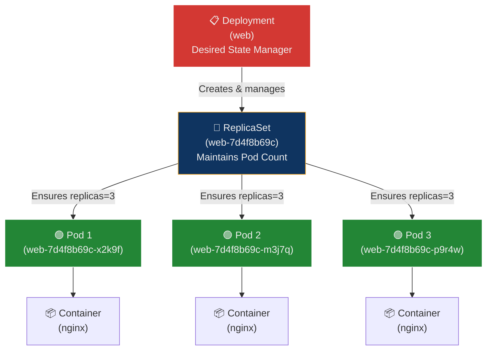
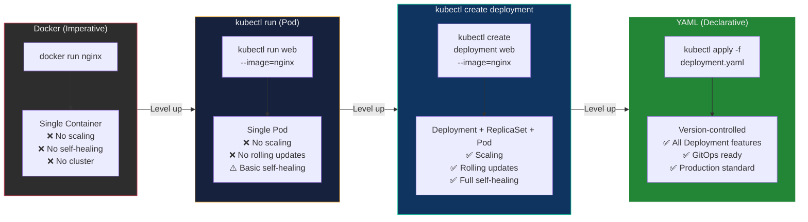
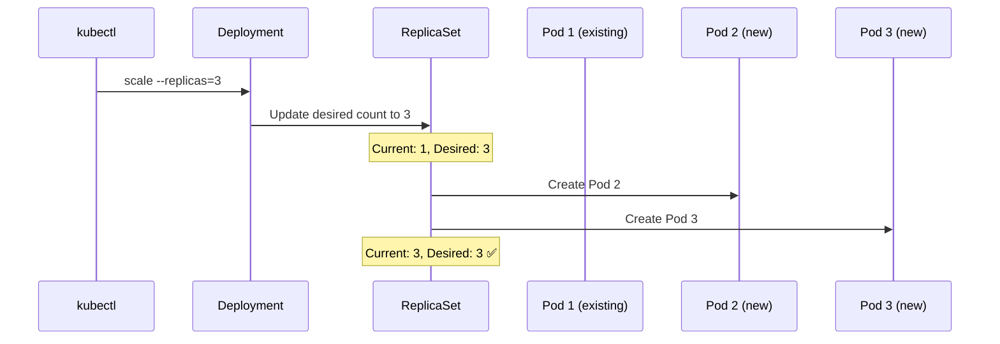
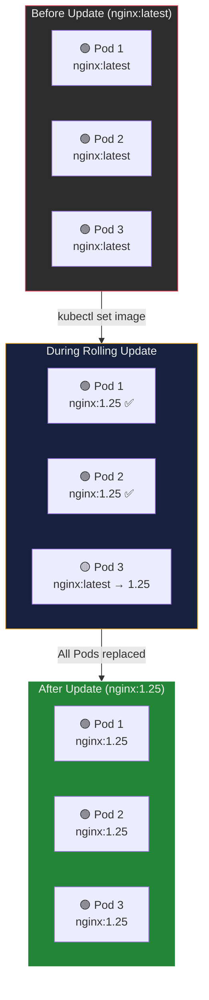
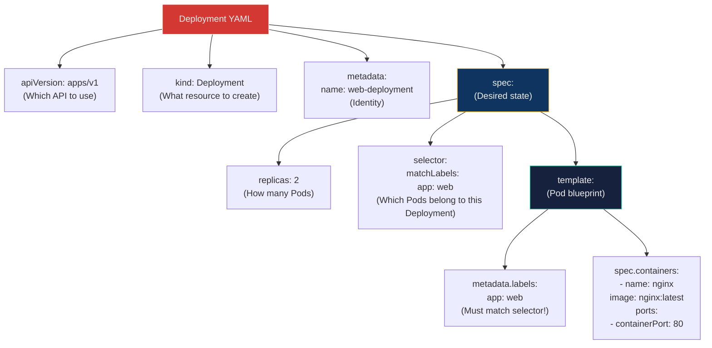
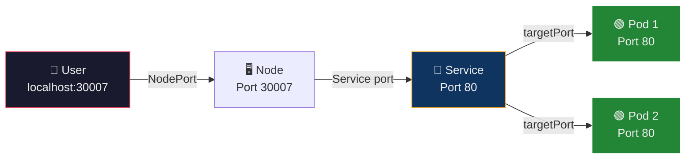

## 🎯 Objective

By the end of this lecture, you will:

- Compare `docker run`, `kubectl run`, and `kubectl create deployment`
- Understand why Kubernetes prefers Deployments over bare Pods
- Learn command flags in detail with practical breakdowns
- Practice testing, debugging, scaling, and updating applications
- Master the YAML-based (declarative) approach used in real-world production environments

---

## 🏗️ Real-World Analogy — The Restaurant Kitchen

Think of managing applications in Kubernetes like running a **restaurant**:

| Restaurant Scenario | Kubernetes Equivalent |
| :--- | :--- |
| **Cooking one dish yourself at home** | `docker run` — you manually start one container, no management system |
| **Hiring one chef** | `kubectl run` — creates a single Pod; if the chef calls in sick, nobody replaces them |
| **Hiring through a staffing agency** | `kubectl create deployment` — the agency (Deployment) guarantees you always have the right number of chefs (Pods); if one quits, a replacement is sent automatically |
| **Writing a formal contract with the agency** | YAML manifest (`kubectl apply -f`) — the contract defines exactly how many chefs, what skills they need, and the agency enforces it at all times |
| **Expanding the kitchen** | `kubectl scale` — tell the agency you need more chefs |
| **Upgrading chef skills** | `kubectl set image` — rolling update; new chefs are onboarded one-by-one while old ones finish their orders |
| **Reviewing a chef's work** | `kubectl describe`, `kubectl logs` — inspect what a Pod is doing and reading its output |

**The key mindset shift:** Docker says *"run this container"*. Kubernetes says *"maintain this desired state — always."*

---

## 📐 Architecture Diagrams

### Deployment Resource Hierarchy

When you run `kubectl create deployment web --image=nginx`, Kubernetes doesn't just create a container. It creates a **chain of resources**, each with a specific responsibility:



**Why this hierarchy matters:**

| Resource | Role | What Happens If a Pod Dies? |
| :--- | :--- | :--- |
| **Deployment** | Declares desired state (image, replicas, update strategy) | Tells ReplicaSet to fix it |
| **ReplicaSet** | Ensures exact Pod count matches `replicas` | Immediately creates a replacement Pod |
| **Pod** | Runs the actual container(s) | Gets replaced — Pods are disposable |
| **Container** | The running process (nginx, app, etc.) | Runs inside the Pod |

### The Progression from Docker to Kubernetes



---

## 📖 Step 1 — Docker Approach (Baseline Understanding)

```bash
docker run -d -p 8080:80 nginx
```

### Flag Breakdown

| Flag | Purpose |
| :--- | :--- |
| `docker run` | Creates and starts a container |
| `-d` | Detached mode — runs in the background |
| `-p 8080:80` | Maps host port 8080 → container port 80 |
| `nginx` | The container image to run |

### Limitations of Docker Alone

| Feature | Docker (standalone) |
| :--- | :--- |
| Scaling | ❌ Manual — run more containers yourself |
| Auto-restart | ❌ Only with `--restart=always` flag |
| Rolling updates | ❌ Not supported |
| Self-healing | ❌ No automatic replacement |
| Cluster management | ❌ Single host only |
| Load balancing | ❌ Not built-in |

> Docker is a **container runtime**. It runs containers but doesn't manage applications. That's Kubernetes's job.

---

## 📖 Step 2 — `kubectl run` (Pod-Level Execution)

```bash
kubectl run web --image=nginx --port=80
```

### Flag Breakdown

| Part | Purpose |
| :--- | :--- |
| `kubectl` | Kubernetes command-line tool |
| `run` | Creates a **Pod directly** (not a Deployment) |
| `web` | Name of the Pod |
| `--image=nginx` | Container image to pull |
| `--port=80` | Metadata — declares the container listens on port 80 (informational only, does not expose it) |

### Check Pod Status

```bash
kubectl get pods
```

**Expected output:**

```text
NAME   READY   STATUS    RESTARTS   AGE
web    1/1     Running   0          12s
```

### Expose the Pod (Create a Service)

A running Pod is not automatically accessible. You must create a **Service** to expose it:

```bash
kubectl expose pod web --type=NodePort --port=80
```

| Part | Purpose |
| :--- | :--- |
| `expose` | Creates a Service resource pointing to the target |
| `pod web` | The target resource (our Pod named `web`) |
| `--type=NodePort` | Makes the Service accessible from outside the cluster via a random high port (30000–32767) |
| `--port=80` | The port the Service listens on internally |

### Access the Application

For local development (k3d, Minikube), use port-forwarding:

```bash
kubectl port-forward pod/web 8080:80
```

Then open:

```text
http://localhost:8080
```

| Part | Purpose |
| :--- | :--- |
| `port-forward` | Tunnels traffic from your local machine to a Pod/Service inside the cluster |
| `pod/web` | Target Pod |
| `8080:80` | Local port 8080 → Pod port 80 |

### ⚠️ Limitations of `kubectl run`

| Problem | Consequence |
| :--- | :--- |
| Creates only a **single Pod** | No redundancy — if it crashes, the app is down |
| No scaling | Cannot run multiple replicas |
| No rolling updates | Cannot change the image version without downtime |
| Not self-healing at a higher level | The Pod restarts internally, but no controller recreates it if the Node fails |

> **Bottom line:** `kubectl run` is for **quick testing only** — never for production workloads.

---

## 📖 Step 3 — `kubectl create deployment` (Recommended)

```bash
kubectl create deployment web --image=nginx
```

### What Kubernetes Creates Internally

This single command creates a **chain of three resources**:

```text
Deployment → ReplicaSet → Pod → Container
```

| Part | Purpose |
| :--- | :--- |
| `create deployment` | Creates a Deployment resource (the recommended way) |
| `web` | Name of the Deployment |
| `--image=nginx` | Container image |

### Why Deployments Are Superior

| Feature | `kubectl run` (Pod) | `kubectl create deployment` |
| :--- | :--- | :--- |
| Self-healing | ⚠️ Pod-level restarts only | ✅ Full — ReplicaSet replaces dead Pods |
| Scaling | ❌ | ✅ `kubectl scale --replicas=N` |
| Rolling updates | ❌ | ✅ Zero-downtime image changes |
| Rollback | ❌ | ✅ `kubectl rollout undo` |
| Version history | ❌ | ✅ Tracks revision history |

---

## 📖 Step 4 — Inspect Resources

```bash
kubectl get deployments
kubectl get pods
kubectl get rs
```

| Command | What It Shows |
| :--- | :--- |
| `kubectl get deployments` | Desired state manager — shows `READY`, `UP-TO-DATE`, `AVAILABLE` counts |
| `kubectl get pods` | Actual running units — shows `STATUS`, `RESTARTS`, `AGE` |
| `kubectl get rs` | ReplicaSet — shows `DESIRED`, `CURRENT`, `READY` pod counts |

**Example output for `kubectl get deployments`:**

```text
NAME   READY   UP-TO-DATE   AVAILABLE   AGE
web    1/1     1            1           30s
```

---

## 📖 Step 5 — Expose the Deployment

```bash
kubectl expose deployment web --type=NodePort --port=80
```

This is the same `expose` command as before, but now targeting the **Deployment** instead of a single Pod. The critical difference:

| Expose Target | Behavior |
| :--- | :--- |
| `pod web` | Service points to **one specific Pod** — if the Pod dies, the Service breaks |
| `deployment web` | Service discovers Pods by their **label** — if a Pod dies and is replaced, the Service automatically routes to the new Pod |

> **Always expose Deployments, not individual Pods.**

---

## 📖 Step 6 — Access the Application

### Using Port Forward (Best for k3d / Minikube)

```bash
kubectl port-forward service/web 8080:80
```

Then open:

```text
http://localhost:8080
```

| Target | Purpose |
| :--- | :--- |
| `service/web` | Forwards traffic through the Service (load-balanced across all Pods) |
| `pod/web` | Forwards traffic directly to a specific Pod (bypasses Service) |

---

## 📖 Step 7 — Scaling the Application

```bash
kubectl scale deployment web --replicas=3
```

| Part | Purpose |
| :--- | :--- |
| `scale` | Changes the number of Pod replicas |
| `deployment web` | Target Deployment |
| `--replicas=3` | Desired Pod count — ReplicaSet creates or deletes Pods to match |

### Scaling Flow



Verify:

```bash
kubectl get pods
```

**Expected output:**

```text
NAME                   READY   STATUS    RESTARTS   AGE
web-7d4f8b69c-x2k9f   1/1     Running   0          5m
web-7d4f8b69c-m3j7q   1/1     Running   0          10s
web-7d4f8b69c-p9r4w   1/1     Running   0          10s
```

---

## 📖 Step 8 — Updating the Deployment (Rolling Update)

```bash
kubectl set image deployment/web nginx=nginx:1.25
```

### Flag Breakdown

| Part | Purpose |
| :--- | :--- |
| `set image` | Changes the container image in a Deployment |
| `deployment/web` | Target Deployment |
| `nginx=nginx:1.25` | `nginx` = container name (from the Pod spec); `nginx:1.25` = new image tag |

### How Rolling Updates Work



**Key behavior:** Kubernetes replaces Pods **one at a time** (by default). At no point are zero Pods running — this is a **zero-downtime update**.

### Monitor the Update

```bash
kubectl rollout status deployment web
```

**Expected output:**

```text
Waiting for deployment "web" rollout to finish: 1 out of 3 new replicas have been updated...
Waiting for deployment "web" rollout to finish: 2 out of 3 new replicas have been updated...
deployment "web" successfully rolled out
```

### Rollback if Something Goes Wrong

```bash
kubectl rollout undo deployment web
```

This reverts to the **previous revision** — the old ReplicaSet still exists and is scaled back up.

---

## 📖 Step 9 — Debugging & Analysis

### Describe a Resource (Detailed Info)

```bash
kubectl describe pod <pod-name>
```

Shows: events, conditions, container status, resource usage, node assignment, labels, and more. **This is your first tool when something is wrong.**

### View Container Logs

```bash
kubectl logs <pod-name>
```

Shows stdout/stderr from the container — equivalent to `docker logs`.

| Flag | Purpose |
| :--- | :--- |
| `kubectl logs <pod>` | Show logs for the default container |
| `kubectl logs <pod> -f` | Stream logs in real-time (like `tail -f`) |
| `kubectl logs <pod> --previous` | Show logs from the previous crashed container |
| `kubectl logs <pod> -c <container>` | Specify which container (for multi-container Pods) |

### Watch Live Pod Changes

```bash
kubectl get pods -w
```

The `-w` flag watches for real-time updates — useful during scaling, updates, and debugging.

---

## 📖 Step 10 — Edit Deployment (Imperative Modification)

```bash
kubectl edit deployment web
```

- Opens the Deployment's YAML in your default terminal editor (`vi`, `nano`, etc.)
- Edit any field (replicas, image, labels, etc.)
- Save and close → changes are applied **immediately**

> **Warning:** `kubectl edit` is imperative — changes are not tracked in version control. For production, always use YAML files with `kubectl apply`.

---

## 📖 Step 11 — Declarative Approach (YAML)

### Why YAML?

| Feature | Imperative (`kubectl` commands) | Declarative (YAML files) |
| :--- | :--- | :--- |
| **Reproducibility** | ❌ Commands aren't saved | ✅ Files can be replayed |
| **Version control** | ❌ Not Git-friendly | ✅ Commit, review, diff |
| **Code review** | ❌ No PR workflow | ✅ Standard PR/review process |
| **Collaboration** | ❌ "Run these commands" | ✅ "Apply this manifest" |
| **GitOps** | ❌ | ✅ ArgoCD, Flux, etc. |
| **Documentation** | ❌ Must remember flags | ✅ The YAML *is* the documentation |

> **Industry standard:** Production Kubernetes is 99% declarative. Imperative commands are for learning, debugging, and quick tests.

---

## 📖 Step 12 — Deployment YAML (Detailed Breakdown)

```yaml
apiVersion: apps/v1          # API group and version for Deployment resource
kind: Deployment             # Resource type

metadata:
  name: web-deployment       # Name of this Deployment

spec:
  replicas: 2                # Desired number of identical Pods

  selector:
    matchLabels:
      app: web               # "Select Pods that have the label app=web"

  template:                  # Pod template — what each Pod looks like
    metadata:
      labels:
        app: web             # Label applied to every Pod created by this Deployment

    spec:
      containers:
      - name: nginx          # Container name (used in `set image` commands)
        image: nginx:latest  # Container image
        ports:
        - containerPort: 80  # Port the container listens on
```

### YAML Anatomy — The 4 Required Fields



> **Critical rule:** The `selector.matchLabels` must match `template.metadata.labels`. If they don't, the Deployment cannot find its own Pods.

### Apply the YAML

```bash
kubectl apply -f web-deployment.yaml
```

| Part | Purpose |
| :--- | :--- |
| `apply` | Creates the resource if it doesn't exist; updates it if it already exists |
| `-f` | Read from a file (instead of inline definition) |

---

## 📖 Step 13 — Service YAML

```yaml
apiVersion: v1
kind: Service

metadata:
  name: web-service

spec:
  type: NodePort

  selector:
    app: web           # Matches Pods with label app=web

  ports:
    - port: 80         # Port the Service listens on (internal)
      targetPort: 80   # Port on the Pod to forward to
      nodePort: 30007  # External port on every Node (30000–32767)
```

### Port Mapping Flow



| Port Type | Value | Purpose |
| :--- | :--- | :--- |
| `nodePort` | 30007 | External access point — the port users connect to on the Node's IP |
| `port` | 80 | Internal Service port — what other Pods inside the cluster connect to |
| `targetPort` | 80 | The actual port on the container receiving traffic |

---

## 📖 Step 14 — Modify and Re-apply YAML

The power of declarative management: edit the file, re-apply, Kubernetes reconciles.

### Change Replicas

Edit `web-deployment.yaml`:

```yaml
replicas: 4
```

Apply:

```bash
kubectl apply -f web-deployment.yaml
```

Kubernetes compares the desired state (4 replicas) with the current state (2 replicas) and creates 2 more Pods.

### Change Image (Triggers Rolling Update)

Edit `web-deployment.yaml`:

```yaml
image: nginx:1.25
```

Apply:

```bash
kubectl apply -f web-deployment.yaml
```

Kubernetes automatically performs a **rolling update** — replacing Pods one by one with the new image.

### Observe Changes

```bash
kubectl rollout status deployment web-deployment
kubectl get pods -w
```

---

## 📖 Step 15 — Final Comparison

| Approach | Command | Resource Created | Use Case | Self-Healing | Scaling | Rolling Updates |
| :--- | :--- | :--- | :--- | :--- | :--- | :--- |
| **Docker** | `docker run` | Container | Local testing | ❌ | ❌ | ❌ |
| **kubectl run** | `kubectl run` | Pod | Quick K8s testing | ⚠️ Pod-level | ❌ | ❌ |
| **kubectl create deployment** | `kubectl create deployment` | Deployment + ReplicaSet + Pod | Real applications | ✅ Full | ✅ | ✅ |
| **YAML (declarative)** | `kubectl apply -f` | Same as above | Production | ✅ Full | ✅ | ✅ |

### The Mindset Shift

> **Docker** → *"Run this container"*
>
> **Kubernetes** → *"Maintain this desired state — always"*

With Docker, you tell the system **what to do** (imperative). With Kubernetes, you tell the system **what you want** (declarative), and it figures out how to get there — and keeps it there.

---

## 📚 Key Terminology — Glossary

| Term | Definition |
| :--- | :--- |
| **kubectl** | Kubernetes command-line tool — the primary interface for managing clusters and workloads |
| **Pod** | The smallest deployable unit in Kubernetes — a wrapper around one or more containers |
| **Deployment** | A controller that manages ReplicaSets and Pods, providing scaling, rolling updates, and rollback |
| **ReplicaSet** | Ensures a specified number of identical Pods are running at all times |
| **Service** | An abstraction that exposes Pods as a stable network endpoint, with load balancing and discovery |
| **NodePort** | A Service type that exposes the application on a static port (30000–32767) on every Node's IP |
| **Container** | A running process with its own filesystem, network, and resource isolation |
| **Rolling Update** | A deployment strategy that replaces Pods one by one, ensuring zero downtime |
| **Rollback** | Reverting a Deployment to a previous revision using `kubectl rollout undo` |
| **Label** | A key-value pair attached to resources (e.g., `app: web`) used for selection and grouping |
| **Selector** | A query that matches resources by their labels (e.g., `matchLabels: app: web`) |
| **`kubectl apply`** | Declarative command that creates or updates resources from a YAML file |
| **`kubectl scale`** | Command that changes the replica count of a Deployment |
| **`kubectl expose`** | Command that creates a Service for a Pod or Deployment |
| **`port-forward`** | Tunnels traffic from localhost to a Pod or Service inside the cluster (for local development) |
| **Imperative** | Telling the system *what to do* step-by-step (e.g., `kubectl create`, `kubectl scale`) |
| **Declarative** | Telling the system *what you want* and letting it reconcile (e.g., `kubectl apply -f file.yaml`) |
| **Desired State** | The state you define in YAML — Kubernetes continuously works to match reality to this state |
| **GitOps** | Operational model where Git is the single source of truth for infrastructure and application definitions |
| **`kubectl describe`** | Command that shows detailed information about a resource, including events and conditions |

---

## 🎓 Viva / Interview Preparation

### Q1: What is the difference between `kubectl run` and `kubectl create deployment`? Why is the Deployment approach preferred?

**Answer:**

`kubectl run` creates a **bare Pod** — a single instance with no controller managing it. If the Pod crashes on a failed Node, nothing recreates it.

`kubectl create deployment` creates a **Deployment → ReplicaSet → Pod** chain:

- The **Deployment** defines the desired state (image, replicas, update strategy)
- The **ReplicaSet** ensures the correct number of Pods is always running
- If a Pod dies or a Node fails, the ReplicaSet creates a replacement automatically

**The Deployment is preferred because it provides:**

1. **Self-healing** — dead Pods are replaced automatically
2. **Scaling** — change the replica count with a single command
3. **Rolling updates** — update images with zero downtime
4. **Rollback** — revert to any previous revision
5. **Version history** — tracks deployment revisions for auditing

**In production, bare Pods are never used.** Always use Deployments (or StatefulSets for stateful apps).

---

### Q2: Explain the difference between imperative and declarative approaches in Kubernetes. Which is recommended for production and why?

**Answer:**

**Imperative** — you tell Kubernetes *what to do*, step by step:

```bash
kubectl create deployment web --image=nginx
kubectl scale deployment web --replicas=3
kubectl set image deployment/web nginx=nginx:1.25
```

Each command mutates the state directly. There's no record of what was done or how to reproduce it.

**Declarative** — you define *what you want* in a YAML file and let Kubernetes figure out how to get there:

```bash
kubectl apply -f deployment.yaml
```

If the resource doesn't exist, Kubernetes creates it. If it already exists, Kubernetes computes the diff and applies only the changes.

**Declarative is recommended for production because:**

1. **Reproducibility** — the YAML file can recreate the exact same setup on any cluster
2. **Version control** — YAML files live in Git, enabling diffs, history, and code review
3. **GitOps** — tools like ArgoCD/Flux watch Git repos and auto-apply changes
4. **Collaboration** — teams review YAML changes through pull requests
5. **Documentation** — the YAML file *is* the documentation of the system state

---

### Q3: How does a Kubernetes rolling update work, and what happens when you run `kubectl rollout undo`?

**Answer:**

**Rolling update process:**

1. When you change the image in a Deployment (via `kubectl set image` or modifying the YAML), Kubernetes creates a **new ReplicaSet** with the updated Pod template
2. It scales up the new ReplicaSet one Pod at a time
3. Simultaneously, it scales down the old ReplicaSet one Pod at a time
4. At every step, at least `replicas - maxUnavailable` Pods are running (default: at least N-1)
5. The update completes when all Pods run the new image

The old ReplicaSet is **not deleted** — it's scaled to zero and kept for rollback history.

**Rollback (`kubectl rollout undo`):**

1. Kubernetes identifies the previous ReplicaSet (revision N-1)
2. It scales the old ReplicaSet back up
3. It scales the current (broken) ReplicaSet down
4. The same rolling update strategy is used — zero downtime during rollback too

You can also rollback to a specific revision:

```bash
kubectl rollout undo deployment web --to-revision=2
```

View revision history:

```bash
kubectl rollout history deployment web
```
