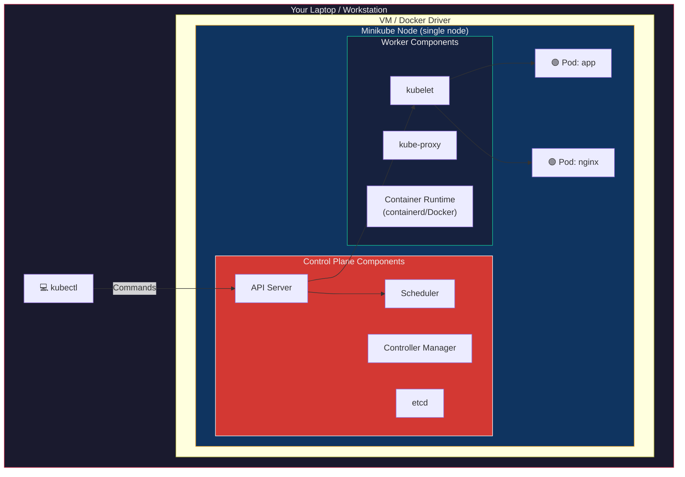
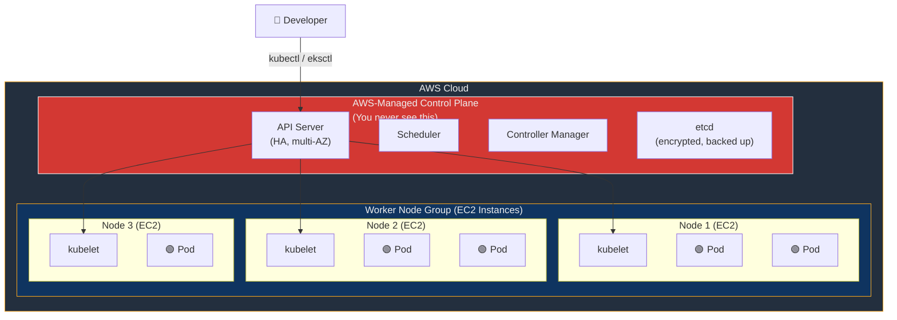
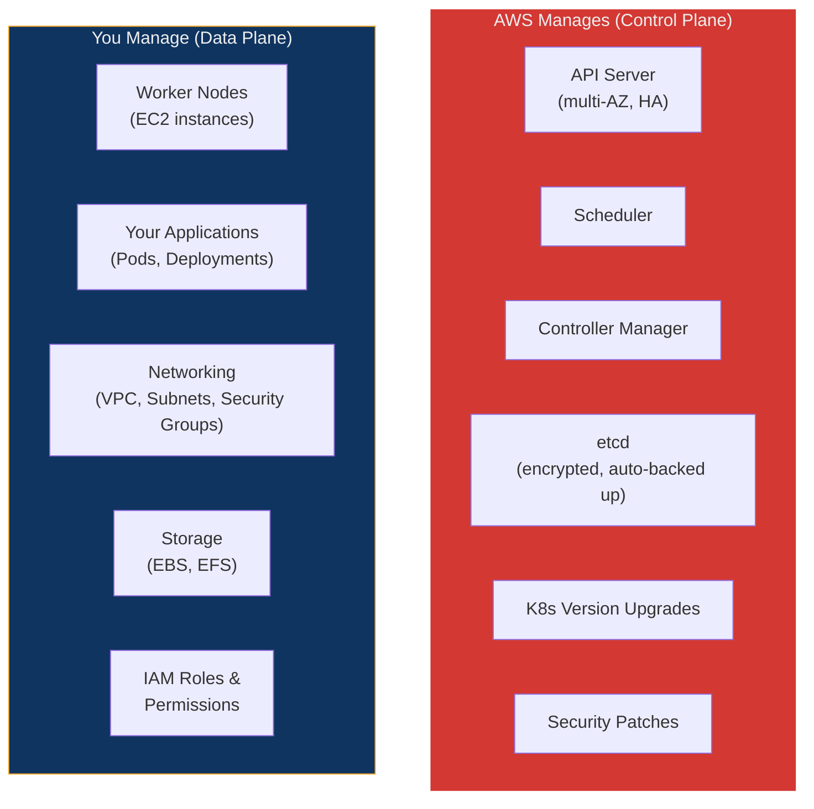
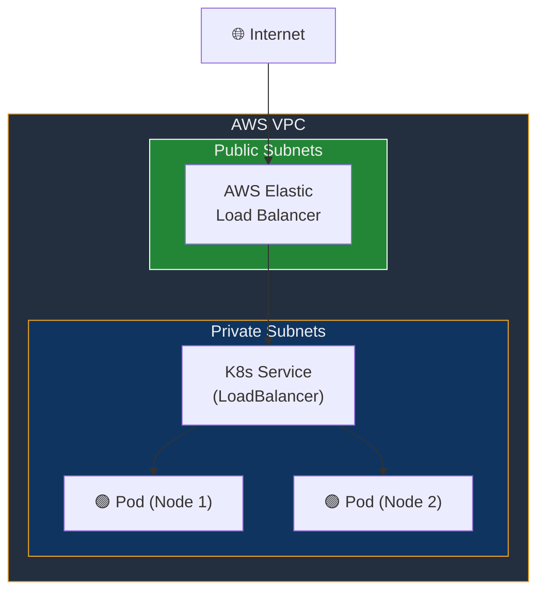
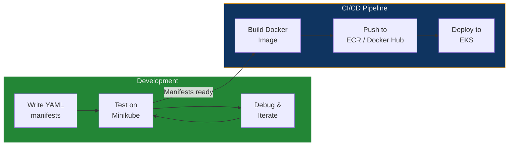

## 🎯 Objective

By the end of this lecture, you will:

- Understand what Minikube is and how to use it for local Kubernetes development
- Create, manage, and troubleshoot a Minikube cluster
- Understand what AWS EKS is and how managed Kubernetes works in the cloud
- Compare local K8s tools (Minikube, k3d, kind) with cloud-managed K8s (EKS, GKE, AKS)
- Deploy applications on both Minikube and EKS
- Know when to use each tool in a real-world workflow

---

## 🏗️ Real-World Analogy — The Training Kitchen vs. the Commercial Restaurant

Imagine you're learning to become a professional chef:

| Cooking Scenario | Kubernetes Equivalent |
| :--- | :--- |
| **Your home kitchen** | **Minikube** — a small, personal, single-node Kubernetes cluster on your laptop for learning and testing |
| **A cooking school kitchen** | **k3d / kind** — lightweight local clusters with more features, still for learning |
| **A professional commercial kitchen managed by a service** | **AWS EKS** — a fully managed Kubernetes cluster in the cloud |
| **You buy all the appliances, install gas lines, and build the kitchen yourself** | **kubeadm** — manual cluster setup on VMs or bare metal |
| **The restaurant chain handles building, maintenance, gas, electricity, plumbing — you just cook** | **Managed K8s** (EKS/GKE/AKS) — the cloud provider handles the Control Plane, upgrades, HA, and scaling |
| **Testing a new recipe at home before putting it on the restaurant menu** | **Developing on Minikube, deploying to EKS** — the standard dev → prod workflow |

**Key insight:** You don't learn to cook in a commercial kitchen, and you don't run production on your laptop. Minikube is for **learning and development**, EKS is for **production workloads**.

---

## 📐 Architecture Diagrams

### Minikube — Single-Node Local Cluster



**Key characteristic:** Everything runs on a **single node** — Control Plane and worker components coexist on one VM or Docker container inside your machine.

### AWS EKS — Managed Multi-Node Cloud Cluster



**Key characteristic:** The Control Plane is **fully managed by AWS** — you never provision, patch, or maintain it. You manage the worker nodes (or use Fargate for serverless Pods).

---

## Part 1 — Minikube: Local Kubernetes Development

### What is Minikube?

Minikube is a tool that runs a **single-node Kubernetes cluster** on your local machine. It's designed for:

- Learning Kubernetes without cloud costs
- Developing and testing YAML manifests locally
- Prototyping before deploying to production clusters
- Running CI/CD pipelines in local environments

### How Minikube Works

Minikube creates a VM or Docker container on your machine and installs all Kubernetes components (Control Plane + Worker) inside it:

```text
Your Laptop
└── Minikube (VM or Docker container)
    ├── Control Plane: API Server, Scheduler, Controller Manager, etcd
    ├── Worker: kubelet, kube-proxy, container runtime
    └── Your Pods run here
```

### Minikube Drivers

Minikube needs a **driver** to create its environment:

| Driver | Platform | Description |
| :--- | :--- | :--- |
| **Docker** | All OS | ✅ Recommended — runs Minikube inside a Docker container |
| **VirtualBox** | All OS | Traditional VM-based driver |
| **Hyper-V** | Windows | Windows native hypervisor |
| **HyperKit** | macOS | macOS native hypervisor |
| **KVM2** | Linux | Linux native hypervisor |
| **Podman** | Linux | Alternative container runtime |

---

### Installation

#### macOS

```bash
brew install minikube
```

#### Linux (Ubuntu/Debian)

```bash
curl -LO https://storage.googleapis.com/minikube/releases/latest/minikube-linux-amd64
sudo install minikube-linux-amd64 /usr/local/bin/minikube
```

#### Windows (PowerShell)

```powershell
choco install minikube
```

Or download the `.exe` from [minikube releases](https://github.com/kubernetes/minikube/releases).

#### Verify Installation

```bash
minikube version
```

---

### Creating and Managing a Minikube Cluster

#### Start a Cluster

```bash
minikube start
```

This does the following:
1. Downloads the Kubernetes ISO/Image (first time only)
2. Creates a VM or Docker container (based on the driver)
3. Installs Kubernetes inside it
4. Configures `kubectl` to point to this cluster

#### Start with Specific Options

```bash
# Use Docker driver (recommended)
minikube start --driver=docker

# Specify Kubernetes version
minikube start --kubernetes-version=v1.28.0

# Allocate more resources
minikube start --cpus=4 --memory=8192

# Start with a specific container runtime
minikube start --container-runtime=containerd
```

#### Check Cluster Status

```bash
minikube status
```

**Expected output:**

```text
minikube
type: Control Plane
host: Running
kubelet: Running
apiserver: Running
kubeconfig: Configured
```

#### Access the Kubernetes Dashboard

Minikube ships with a built-in web dashboard:

```bash
minikube dashboard
```

This opens the Kubernetes Dashboard in your default browser.

#### Stop the Cluster (Preserves Data)

```bash
minikube stop
```

#### Delete the Cluster (Destroys Everything)

```bash
minikube delete
```

#### Delete All Clusters and Cached Data

```bash
minikube delete --all --purge
```

---

### Deploying Applications on Minikube

#### Step 1 — Create a Deployment

```bash
kubectl create deployment hello --image=kicbase/echo-server:1.0
```

#### Step 2 — Expose the Deployment

```bash
kubectl expose deployment hello --type=NodePort --port=8080
```

#### Step 3 — Access the Application

Minikube provides a special command to open NodePort services:

```bash
minikube service hello
```

This automatically finds the NodePort and opens it in your browser.

Alternatively, get the URL:

```bash
minikube service hello --url
```

#### Step 4 — Use Port Forwarding (Alternative)

```bash
kubectl port-forward service/hello 7080:8080
```

Then access at `http://localhost:7080`.

---

### Minikube Addons

Minikube includes built-in addons for common features:

#### List Available Addons

```bash
minikube addons list
```

#### Popular Addons

| Addon | Purpose | Enable Command |
| :--- | :--- | :--- |
| **dashboard** | Web UI for cluster management | `minikube addons enable dashboard` |
| **ingress** | NGINX Ingress Controller | `minikube addons enable ingress` |
| **metrics-server** | CPU/memory metrics (`kubectl top`) | `minikube addons enable metrics-server` |
| **registry** | Local Docker registry | `minikube addons enable registry` |
| **storage-provisioner** | Dynamic PersistentVolume provisioning | Enabled by default |

#### Enable Ingress Example

```bash
minikube addons enable ingress
```

Verify:

```bash
kubectl get pods -n ingress-nginx
```

---

### Minikube Multi-Node Clusters

Minikube can also simulate multi-node clusters for testing:

```bash
# Create a 3-node cluster
minikube start --nodes=3

# Check nodes
kubectl get nodes
```

**Expected output:**

```text
NAME           STATUS   ROLES           AGE   VERSION
minikube       Ready    control-plane   2m    v1.28.0
minikube-m02   Ready    <none>          90s   v1.28.0
minikube-m03   Ready    <none>          60s   v1.28.0
```

---

### Minikube vs k3d vs kind

| Feature | Minikube | k3d | kind |
| :--- | :--- | :--- | :--- |
| **Underlying tech** | VM or Docker | k3s in Docker | K8s in Docker |
| **Speed** | Moderate (VM) / Fast (Docker) | Very fast | Fast |
| **Multi-node** | ✅ Supported | ✅ Supported | ✅ Supported |
| **Addons system** | ✅ Built-in (`minikube addons`) | ❌ Manual | ❌ Manual |
| **Dashboard** | ✅ Built-in | ❌ Manual | ❌ Manual |
| **Resource usage** | Higher (VM) / Moderate (Docker) | Low | Low |
| **K8s conformance** | Full | k3s (lightweight, some differences) | Full |
| **Best for** | Learning, testing addons | Fast local dev, CI/CD | CI/CD, testing |
| **LoadBalancer** | ✅ `minikube tunnel` | ✅ Via port mapping | ❌ Manual |
| **GPU support** | ✅ | ❌ | ❌ |

---

### Useful Minikube Commands Cheat Sheet

| Command | Purpose |
| :--- | :--- |
| `minikube start` | Start a cluster |
| `minikube stop` | Stop the cluster (preserves data) |
| `minikube delete` | Delete the cluster |
| `minikube status` | Check cluster status |
| `minikube dashboard` | Open the web dashboard |
| `minikube service <name>` | Open a NodePort service in the browser |
| `minikube tunnel` | Create a network tunnel for LoadBalancer services |
| `minikube ssh` | SSH into the Minikube node |
| `minikube ip` | Get the Minikube node's IP address |
| `minikube addons list` | Show all available addons |
| `minikube addons enable <addon>` | Enable an addon |
| `minikube logs` | Show Minikube system logs |
| `minikube kubectl -- <cmd>` | Use Minikube's bundled kubectl |
| `minikube docker-env` | Configure Docker CLI to use Minikube's Docker daemon |
| `minikube start --nodes=3` | Create a multi-node cluster |

---

## Part 2 — AWS EKS: Managed Kubernetes in the Cloud

### What is AWS EKS?

**Amazon Elastic Kubernetes Service (EKS)** is a fully managed Kubernetes service. AWS handles the Control Plane — you manage the worker nodes.

> Think of it as **renting a fully maintained commercial kitchen**: the landlord handles the building, gas, electricity, plumbing, and safety inspections. You just bring your recipes (workloads) and cook (deploy).

### What AWS Manages vs What You Manage



| Responsibility | AWS (Managed) | You |
| :--- | :--- | :--- |
| **Control Plane** | ✅ API Server, Scheduler, CM, etcd | — |
| **High Availability** | ✅ Multi-AZ deployment | — |
| **etcd backups** | ✅ Automatic | — |
| **K8s version upgrades** | ✅ One-click | You trigger it |
| **Security patches** | ✅ Automatic | — |
| **Worker Nodes** | — | ✅ EC2 instances or Fargate |
| **Applications** | — | ✅ Your Pods and Deployments |
| **Networking** | — | ✅ VPC, subnets, security groups |
| **IAM permissions** | — | ✅ Service accounts, roles |
| **Monitoring** | ✅ CloudWatch integration | ✅ Configure alerts |

---

### EKS Node Types

| Node Type | Description | Use Case |
| :--- | :--- | :--- |
| **Managed Node Groups** | EC2 instances managed by EKS — auto-provisioned, auto-updated | ✅ Most common, production workloads |
| **Self-Managed Nodes** | EC2 instances you launch and register manually | Custom AMIs, special hardware |
| **AWS Fargate** | Serverless — no EC2 instances, pay per Pod | Batch jobs, variable workloads, no server management desired |

---

### Prerequisites for EKS

Before creating an EKS cluster, you need:

```bash
# 1. AWS CLI — communicates with AWS services
curl "https://awscli.amazonaws.com/awscli-exe-linux-x86_64.zip" -o "awscliv2.zip"
unzip awscliv2.zip
sudo ./aws/install
aws --version

# 2. Configure AWS credentials
aws configure
# Enter: Access Key ID, Secret Access Key, Region (e.g., ap-south-1), Output format (json)

# 3. kubectl — Kubernetes CLI
curl -LO "https://dl.k8s.io/release/$(curl -L -s https://dl.k8s.io/release/stable.txt)/bin/linux/amd64/kubectl"
sudo install -o root -g root -m 0755 kubectl /usr/local/bin/kubectl
kubectl version --client

# 4. eksctl — Official CLI tool for EKS (simplifies cluster creation)
curl --silent --location "https://github.com/eksctl-io/eksctl/releases/latest/download/eksctl_$(uname -s)_amd64.tar.gz" | tar xz -C /tmp
sudo mv /tmp/eksctl /usr/local/bin
eksctl version
```

---

### Creating an EKS Cluster

#### Method 1 — Using eksctl (Recommended for Learning)

```bash
eksctl create cluster \
  --name my-cluster \
  --region ap-south-1 \
  --version 1.28 \
  --nodegroup-name standard-workers \
  --node-type t3.medium \
  --nodes 2 \
  --nodes-min 1 \
  --nodes-max 3 \
  --managed
```

#### Flag Breakdown

| Flag | Purpose |
| :--- | :--- |
| `--name my-cluster` | Cluster name |
| `--region ap-south-1` | AWS region (Mumbai) |
| `--version 1.28` | Kubernetes version |
| `--nodegroup-name standard-workers` | Name for the worker node group |
| `--node-type t3.medium` | EC2 instance type (2 vCPU, 4 GB RAM) |
| `--nodes 2` | Initial number of worker nodes |
| `--nodes-min 1` | Minimum nodes for autoscaling |
| `--nodes-max 3` | Maximum nodes for autoscaling |
| `--managed` | Use EKS-managed node groups |

> ⏱️ **This takes 15–20 minutes.** eksctl creates the VPC, subnets, security groups, IAM roles, the EKS Control Plane, and the Node Group.

#### Verify the Cluster

```bash
# Update kubeconfig to point to the new cluster
aws eks update-kubeconfig --region ap-south-1 --name my-cluster

# Verify connection
kubectl get nodes
```

**Expected output:**

```text
NAME                                           STATUS   ROLES    AGE   VERSION
ip-192-168-xx-xx.ap-south-1.compute.internal   Ready    <none>   5m    v1.28.0
ip-192-168-yy-yy.ap-south-1.compute.internal   Ready    <none>   5m    v1.28.0
```

#### Method 2 — Using AWS Console (UI)

1. Go to **AWS Console** → **EKS** → **Create cluster**
2. Configure cluster name, K8s version, and IAM role
3. Configure networking (VPC, subnets)
4. Create a Node Group (choose instance type, count)
5. After creation, run: `aws eks update-kubeconfig --name my-cluster`

#### Method 3 — Using Terraform (Infrastructure as Code)

```hcl
module "eks" {
  source          = "terraform-aws-modules/eks/aws"
  cluster_name    = "my-cluster"
  cluster_version = "1.28"
  vpc_id          = module.vpc.vpc_id
  subnet_ids      = module.vpc.private_subnets

  eks_managed_node_groups = {
    standard = {
      min_size     = 1
      max_size     = 3
      desired_size = 2
      instance_types = ["t3.medium"]
    }
  }
}
```

---

### Deploying to EKS

Once your kubeconfig is configured, **the kubectl commands are identical** to Minikube:

```bash
# Create a Deployment
kubectl create deployment webapp --image=nginx

# Scale it
kubectl scale deployment webapp --replicas=3

# Expose via LoadBalancer (AWS provisions an ELB automatically)
kubectl expose deployment webapp --type=LoadBalancer --port=80

# Get the external URL
kubectl get svc webapp
```

**Key difference:** On EKS, `--type=LoadBalancer` creates a **real AWS Elastic Load Balancer** with a public DNS name. On Minikube, you'd use `minikube tunnel` or `NodePort`.

```text
NAME     TYPE           CLUSTER-IP      EXTERNAL-IP                                                               PORT(S)
webapp   LoadBalancer   10.100.23.45    a1b2c3d4e5f6g7.ap-south-1.elb.amazonaws.com                              80:31234/TCP
```

Access: `http://a1b2c3d4e5f6g7.ap-south-1.elb.amazonaws.com`

---

### EKS Networking



| Component | Purpose |
| :--- | :--- |
| **VPC** | Virtual Private Cloud — your isolated network in AWS |
| **Public Subnets** | Accessible from the internet — hosts Load Balancers |
| **Private Subnets** | Not accessible from the internet — hosts worker Nodes and Pods |
| **Security Groups** | Firewall rules — control traffic to/from Nodes |
| **ELB** | AWS Elastic Load Balancer — handles external traffic to Services |

---

### EKS Cluster Management

```bash
# List all EKS clusters
eksctl get cluster --region ap-south-1

# Scale the node group
eksctl scale nodegroup \
  --cluster=my-cluster \
  --name=standard-workers \
  --nodes=4 \
  --region=ap-south-1

# Upgrade Kubernetes version
eksctl upgrade cluster --name=my-cluster --version=1.29 --region=ap-south-1

# Delete the cluster (removes all resources)
eksctl delete cluster --name=my-cluster --region=ap-south-1
```

> ⚠️ **Cost Warning:** EKS charges ~$0.10/hour for the Control Plane (~$73/month) **plus** EC2 instance costs for worker nodes. **Always delete clusters when not in use for learning.**

---

### EKS Cost Breakdown

| Resource | Approximate Cost |
| :--- | :--- |
| EKS Control Plane | $0.10/hr (~$73/month) |
| t3.medium (2 vCPU, 4 GB) | ~$0.042/hr (~$30/month per node) |
| 2-node cluster total | ~$133/month |
| ELB (Load Balancer) | ~$0.025/hr + data transfer |
| EBS Volumes | ~$0.10/GB/month |

---

## Part 3 — Minikube vs AWS EKS Comparison

| Feature | Minikube | AWS EKS |
| :--- | :--- | :--- |
| **Purpose** | Local development & learning | Production workloads |
| **Cost** | Free | ~$73/month + EC2 + storage |
| **Setup time** | 1–2 minutes | 15–20 minutes |
| **Nodes** | 1 (multi-node experimental) | Multiple, auto-scalable |
| **Control Plane** | You manage (sort of — all-in-one) | AWS manages (HA, multi-AZ) |
| **High Availability** | ❌ Single node | ✅ Multi-AZ Control Plane |
| **Auto-scaling** | ❌ | ✅ Cluster Autoscaler |
| **LoadBalancer support** | `minikube tunnel` (simulated) | Real AWS ELB |
| **Persistent storage** | HostPath (local disk) | EBS, EFS, S3 |
| **Networking** | Virtual network on localhost | Full VPC with subnets |
| **IAM / Security** | ❌ | ✅ AWS IAM integration |
| **Upgrades** | `minikube start --kubernetes-version` | One-click via eksctl/console |
| **kubectl commands** | ✅ Same | ✅ Same |
| **Config files (YAML)** | ✅ Same | ✅ Same |
| **Best for** | Learning, dev, testing | Staging, production, enterprise |

### The Dev → Prod Workflow



**The golden rule:** Develop on Minikube, deploy to EKS. Your YAML manifests and kubectl commands work on **both** — that's the power of Kubernetes portability.

---

## Part 4 — EKS Advanced Features

### Cluster Autoscaler

Automatically scales the number of worker nodes based on Pod demand:

```bash
# Install Cluster Autoscaler
kubectl apply -f https://raw.githubusercontent.com/kubernetes/autoscaler/master/cluster-autoscaler/cloudprovider/aws/examples/cluster-autoscaler-autodiscover.yaml
```

How it works:

```text
Pod created → no node has capacity → Cluster Autoscaler adds a node → Pod scheduled
Pods deleted → node underutilized → Cluster Autoscaler removes the node
```

### AWS Fargate Profiles (Serverless Pods)

Run Pods without managing any EC2 instances:

```bash
eksctl create fargateprofile \
  --cluster my-cluster \
  --name fp-default \
  --namespace default
```

With Fargate:
- No EC2 instances to manage
- Pay only for Pod resource usage (vCPU + memory per second)
- Each Pod runs in its own microVM (strong isolation)
- Ideal for batch jobs and variable workloads

### AWS Load Balancer Controller

For advanced Ingress with Application Load Balancers:

```bash
# Install the AWS Load Balancer Controller
helm install aws-load-balancer-controller eks/aws-load-balancer-controller \
  -n kube-system \
  --set clusterName=my-cluster
```

This enables:
- **ALB Ingress** — path-based and host-based routing via AWS Application Load Balancers
- **NLB** — Network Load Balancer for TCP/UDP workloads
- Full AWS integration with WAF, ACM certificates, etc.

### EKS + ECR (Elastic Container Registry)

Store your Docker images in AWS's private registry:

```bash
# Create a repository
aws ecr create-repository --repository-name my-app --region ap-south-1

# Authenticate Docker with ECR
aws ecr get-login-password --region ap-south-1 | docker login --username AWS --password-stdin <account-id>.dkr.ecr.ap-south-1.amazonaws.com

# Build, tag, and push
docker build -t my-app .
docker tag my-app:latest <account-id>.dkr.ecr.ap-south-1.amazonaws.com/my-app:latest
docker push <account-id>.dkr.ecr.ap-south-1.amazonaws.com/my-app:latest

# Use in Kubernetes Deployment
# image: <account-id>.dkr.ecr.ap-south-1.amazonaws.com/my-app:latest
```

---

## Part 5 — Cloud K8s Providers Comparison

| Feature | AWS EKS | Google GKE | Azure AKS |
| :--- | :--- | :--- | :--- |
| **Control Plane cost** | $0.10/hr ($73/mo) | Free (Standard) | Free |
| **Default CNI** | VPC CNI (native) | Calico / GKE native | Azure CNI |
| **Serverless Pods** | AWS Fargate | GKE Autopilot | ACI Virtual Nodes |
| **Container Registry** | ECR | GCR / Artifact Registry | ACR |
| **Service Mesh** | AWS App Mesh | Istio (managed) | Open Service Mesh |
| **CLI tool** | eksctl | gcloud | az aks |
| **Market share** | Largest | Strong | Growing fast |
| **Best integrated with** | AWS ecosystem | Google Cloud, BigQuery | Azure AD, .NET |

---

## 📚 Key Terminology — Glossary

| Term | Definition |
| :--- | :--- |
| **Minikube** | A tool that runs a single-node Kubernetes cluster on your local machine for development and learning |
| **AWS EKS** | Amazon Elastic Kubernetes Service — a fully managed Kubernetes platform where AWS handles the Control Plane |
| **eksctl** | Official CLI tool for creating and managing EKS clusters — abstracts CloudFormation and IAM complexity |
| **Managed Node Group** | EC2 worker nodes that EKS auto-provisions, monitors, and updates |
| **Self-Managed Nodes** | EC2 instances you manually launch and register with the EKS cluster |
| **AWS Fargate** | Serverless compute for EKS — runs each Pod in its own microVM without requiring EC2 instances |
| **Driver (Minikube)** | The backend technology Minikube uses to create the cluster — Docker, VirtualBox, Hyper-V, etc. |
| **Addon (Minikube)** | Built-in extensions that add functionality — Ingress, Dashboard, Metrics Server, etc. |
| **VPC** | Virtual Private Cloud — an isolated virtual network in AWS that hosts your EKS worker nodes |
| **Subnet** | A range of IP addresses within a VPC — public (internet-facing) or private (internal only) |
| **Security Group** | AWS firewall rules that control inbound/outbound traffic to EC2 instances |
| **IAM Role** | AWS Identity and Access Management role — defines what AWS resources a user or service can access |
| **ECR** | Elastic Container Registry — AWS's private Docker image registry |
| **ELB** | Elastic Load Balancer — distributes incoming traffic across multiple targets (Pods/Nodes) |
| **Cluster Autoscaler** | Automatically adds or removes worker nodes based on Pod resource demands |
| **kubeconfig** | Configuration file (`~/.kube/config`) that tells kubectl how to connect to a cluster |
| **Control Plane** | The "brain" of Kubernetes — API Server, Scheduler, Controller Manager, etcd |
| **Data Plane** | The "muscle" of Kubernetes — worker nodes that actually run your Pods |
| **Multi-AZ** | Multi-Availability Zone — deploying across multiple data centers for high availability |
| **Terraform** | Infrastructure as Code tool — defines cloud resources (including EKS) in declarative config files |

---

## 🎓 Viva / Interview Preparation

### Q1: What is the difference between Minikube and AWS EKS? When would you use each?

**Answer:**

**Minikube** is a local development tool that runs a **single-node Kubernetes cluster** on your laptop. It's designed for:
- Learning Kubernetes
- Developing and testing YAML manifests
- Quick prototyping

**AWS EKS** is a **managed Kubernetes service** in the cloud. AWS handles the entire Control Plane (API Server, Scheduler, etcd, HA, security patches). You manage only the worker nodes. It's designed for:
- Production workloads
- Multi-node, auto-scalable clusters
- Enterprise applications requiring high availability

**Key differences:**

| Aspect | Minikube | EKS |
| :--- | :--- | :--- |
| Cost | Free | ~$73/month + nodes |
| Nodes | 1 | Multiple, auto-scalable |
| HA | ❌ | ✅ Multi-AZ |
| Control Plane | Self-contained | AWS-managed |
| Real LB | ❌ Simulated | ✅ AWS ELB |

**Workflow:** Develop on Minikube → test → deploy to EKS. The same kubectl commands and YAML files work on both — that's Kubernetes portability.

---

### Q2: Explain what "managed Kubernetes" means in the context of EKS. What does AWS manage vs what do you manage?

**Answer:**

"Managed Kubernetes" means the **cloud provider handles the Control Plane** — the most complex and critical part of a Kubernetes cluster.

**What AWS manages:**
1. **API Server** — deployed across multiple Availability Zones for high availability
2. **etcd** — encrypted at rest, automatically backed up
3. **Scheduler and Controller Manager** — always running, auto-recovered if they fail
4. **Kubernetes version upgrades** — one-click upgrade via console or eksctl
5. **Security patches** — applied automatically to the Control Plane

**What you manage:**
1. **Worker Nodes** — EC2 instances (or Fargate for serverless)
2. **Applications** — your Pods, Deployments, Services
3. **Networking** — VPC, subnets, security groups, Ingress
4. **IAM** — roles and permissions for users and service accounts
5. **Monitoring** — CloudWatch, Prometheus, etc.

**Why this matters:** Managing a production Control Plane manually (via kubeadm) requires:
- Ensuring etcd is backed up and replicated
- Running the API Server across multiple AZs
- Applying security patches without downtime
- Handling certificate rotation

EKS eliminates all of this operational burden, letting teams focus on deploying and managing applications instead of infrastructure.

---

### Q3: You have a working YAML Deployment manifest tested on Minikube. What changes are needed to deploy it on AWS EKS?

**Answer:**

**The core Deployment manifest requires zero changes.** This is the fundamental promise of Kubernetes — portability. A `Deployment`, `Service`, `ConfigMap`, or `Secret` YAML file runs identically on Minikube, EKS, GKE, or any conformant cluster.

**However, the following may need adjustment for production on EKS:**

1. **Service type:** On Minikube, you might use `NodePort` or `minikube service`. On EKS, change to `LoadBalancer` to get a real AWS ELB, or use Ingress with the AWS Load Balancer Controller.

2. **Storage:** Minikube uses `hostPath` volumes (local disk). On EKS, use `StorageClass: gp3` for EBS volumes or `efs-sc` for shared EFS storage.

3. **Image registry:** Move images from Docker Hub to **Amazon ECR** for faster pulls, private access, and vulnerability scanning.

4. **Resource limits:** Add `resources.requests` and `resources.limits` to every container for the Cluster Autoscaler to work correctly.

5. **IAM:** Add IAM Roles for Service Accounts (IRSA) if your Pods need to access AWS services (S3, DynamoDB, etc.).

6. **Ingress annotations:** Change from NGINX Ingress to AWS ALB Ingress annotations if using the AWS Load Balancer Controller.

**Summary:** The Deployment itself is portable. What changes is the **infrastructure integration** — storage, networking, registry, and cloud-specific features.
