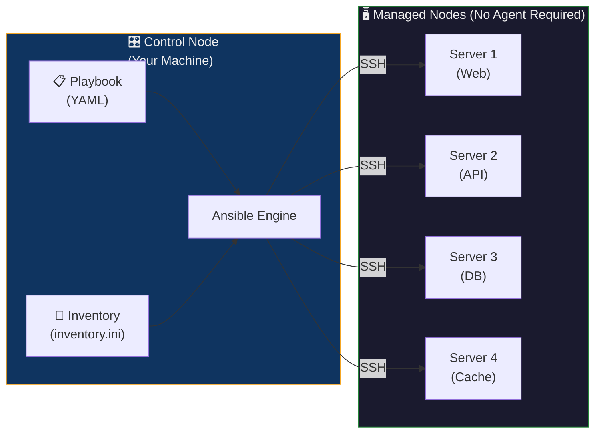
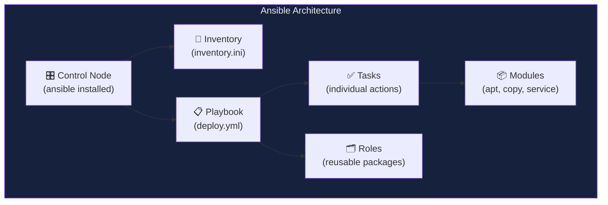
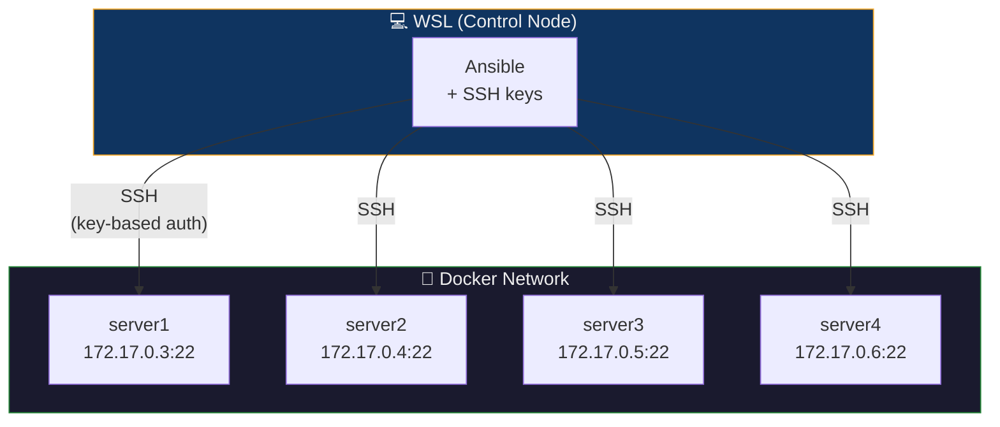
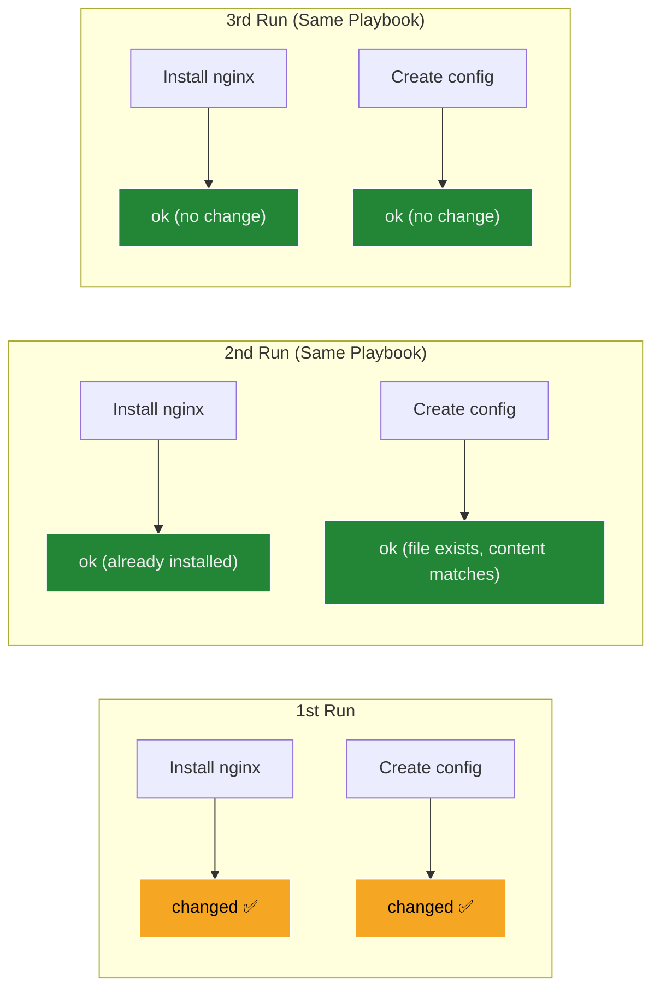

## The Hotel Chain Manager Analogy

Imagine you're the **operations manager of a hotel chain** with 50 locations:

| Hotel Operations | Ansible Equivalent |
| :--- | :--- |
| You (the manager) sit at headquarters | **Control Node** — your machine with Ansible installed |
| The 50 hotel branches across the country | **Managed Nodes** — the servers you want to configure |
| You phone each hotel with instructions | **SSH connection** — Ansible connects over SSH (no agent needed) |
| "Ensure every room has a minibar, clean towels, and a WiFi card" | **Playbook** — YAML file declaring the desired state |
| The checklist for each hotel | **Tasks** — individual actions (install package, create file, start service) |
| "If the minibar is already stocked, don't restock it" | **Idempotency** — Ansible only makes changes when needed |
| The master list of all hotel addresses | **Inventory** — list of all managed servers and their groups |
| Standard operating procedures booklet | **Role** — a reusable package of tasks, templates, and variables |

> **Key insight:** You don't need to install special software at each hotel (agentless). You just call them (SSH) and tell them what state to be in (declarative). If they're already in that state, nothing changes (idempotent).

---

## The Problem Ansible Solves

**Without Ansible:** Managing infrastructure manually across multiple servers leads to:

| Problem | Impact |
| :--- | :--- |
| **Configuration drift** | Server A has Python 3.10, Server B has 3.8 — "works on my server" bugs |
| **Repetitive manual work** | SSH into 50 servers, run the same 10 commands on each |
| **Human error** | Forgot one server, typo in a config file, wrong order of operations |
| **No audit trail** | "Who changed the firewall rules last Tuesday?" — no one knows |
| **Scaling impossible** | Managing 5 servers manually works; managing 500 doesn't |

**With Ansible:** Write the desired state once in YAML, run one command, and all servers are configured identically.

---

## What is Ansible?

**Ansible** is an open-source **automation tool** for configuration management, application deployment, and orchestration.

| Aspect | Details |
| :--- | :--- |
| **Type** | Configuration Management / Automation / Orchestration |
| **Creator** | Michael DeHaan (2012), acquired by Red Hat (2015) |
| **Language** | Written in Python, uses YAML for configuration |
| **Architecture** | Agentless — uses SSH (Linux) / WinRM (Windows) |
| **Model** | Push-based — control node pushes changes to managed nodes |
| **License** | Open-source (GPL v3), with commercial Ansible Tower/AWX |

### How Ansible Works



1. You write a **Playbook** (YAML) describing the desired state
2. The **Inventory** tells Ansible which servers to target
3. Ansible connects via **SSH** — no agent installation on managed nodes
4. **Modules** execute on the remote nodes (e.g., `apt`, `copy`, `service`)
5. Ansible reports results: changed, ok, or failed

### Key Properties

| Property | What It Means | Why It Matters |
| :--- | :--- | :--- |
| **Agentless** | No software installed on managed nodes | Zero maintenance overhead on target servers |
| **Idempotent** | Running the same playbook 10 times = same result as running it once | Safe to re-run — won't break anything already configured |
| **Declarative** | You describe *what* you want, not *how* to do it | `state: present` vs writing shell commands |
| **Push-based** | Control node initiates changes immediately | No waiting for agents to poll — instant execution |

---

## Ansible Components — The Building Blocks



| Component | Description | Example |
| :--- | :--- | :--- |
| **Control Node** | Machine where Ansible is installed — the "brain" | Your laptop, a CI/CD server, a bastion host |
| **Managed Nodes** | Target servers that Ansible configures (no agent needed) | EC2 instances, Docker containers, bare metal servers |
| **Inventory** | File listing all managed nodes, organized into groups | `inventory.ini` with `[webservers]`, `[databases]` groups |
| **Playbook** | YAML file containing ordered list of tasks — the "recipe" | `deploy.yml` — install packages, configure files, start services |
| **Task** | A single action within a playbook | "Install nginx", "Copy config file", "Restart service" |
| **Module** | Built-in function that performs a specific operation | `apt` (install packages), `copy` (create files), `service` (manage daemons) |
| **Role** | A reusable, shareable package of tasks, templates, and variables | `geerlingguy.docker` role from Ansible Galaxy |
| **Facts** | System information auto-collected from managed nodes | `ansible_os_family`, `ansible_hostname`, `ansible_date_time` |
| **Handlers** | Tasks triggered only when a change occurs | Restart nginx only if the config file was modified |
| **Vault** | Encryption for sensitive data (passwords, keys, tokens) | `ansible-vault create secrets.yml` |

---

## Ansible vs Other Configuration Management Tools

| Feature | Ansible | Chef | Puppet | SaltStack |
| :--- | :--- | :--- | :--- | :--- |
| **Architecture** | Agentless (SSH) | Agent-based | Agent-based | Agent-based (or agentless) |
| **Language** | YAML (playbooks) | Ruby (recipes) | Puppet DSL (manifests) | YAML (states) |
| **Learning curve** | Low | High | High | Moderate |
| **Model** | Push | Pull | Pull | Push or Pull |
| **Setup** | Install only on control node | Install Chef server + agents | Install Puppet master + agents | Install Salt master + minions |
| **Scalability** | Good (1000s of nodes) | Excellent | Excellent | Excellent |
| **Community** | Very large | Large | Large | Moderate |

> **Why Ansible dominates:** Zero agent overhead + YAML simplicity = fastest path from "I need to automate" to "it's automated."

---

## Installation

### Method 1: pip (Recommended — Latest Version)

```bash
pip install ansible

# Verify
ansible --version
```

### Method 2: apt (Debian/Ubuntu — Stable Version)

```bash
sudo apt update -y
sudo apt install ansible -y

# Verify
ansible --version
```

### Post-Installation Test

```bash
ansible localhost -m ping
```

**Expected output:**
```json
localhost | SUCCESS => {
    "changed": false,
    "ping": "pong"
}
```

> `"changed": false` demonstrates **idempotency** — Ansible reports that nothing needed to change.

---

## Part A — Hands-On: Ansible with Docker Containers as Servers

Instead of provisioning real VMs, we use **Docker containers as simulated servers** — each container runs an SSH server that Ansible can connect to.



### Step 1: Generate SSH Keys

```bash
# Generate RSA key pair (press Enter for defaults)
ssh-keygen -t rsa -b 4096

# Copy keys to current directory (needed for Docker build)
cp ~/.ssh/id_rsa.pub .
cp ~/.ssh/id_rsa .
```

| File | Location | Purpose |
| :--- | :--- | :--- |
| `id_rsa` (Private Key) | Your control node (`~/.ssh/`) | Authenticates when connecting — **never share this** |
| `id_rsa.pub` (Public Key) | Remote servers (`~/.ssh/authorized_keys`) | Grants access to anyone with the matching private key |

### Step 2: Create the Dockerfile (SSH-Enabled Ubuntu Server)

```dockerfile
FROM ubuntu

# Install Python 3, pip, and OpenSSH server
RUN apt update -y
RUN apt install -y python3 python3-pip openssh-server
RUN mkdir -p /var/run/sshd

# Configure SSH: enable root login, key-based auth only
RUN mkdir -p /run/sshd && \
    echo 'root:password' | chpasswd && \
    sed -i 's/#PermitRootLogin prohibit-password/PermitRootLogin yes/' /etc/ssh/sshd_config && \
    sed -i 's/#PasswordAuthentication yes/PasswordAuthentication no/' /etc/ssh/sshd_config && \
    sed -i 's/#PubkeyAuthentication yes/PubkeyAuthentication yes/' /etc/ssh/sshd_config

# Set up SSH key authentication
RUN mkdir -p /root/.ssh && chmod 700 /root/.ssh
COPY id_rsa /root/.ssh/id_rsa
COPY id_rsa.pub /root/.ssh/authorized_keys
RUN chmod 600 /root/.ssh/id_rsa && \
    chmod 644 /root/.ssh/authorized_keys

# Fix PAM login issue
RUN sed -i 's@session\s*required\s*pam_loginuid.so@session optional pam_loginuid.so@g' /etc/pam.d/sshd

EXPOSE 22
CMD ["/usr/sbin/sshd", "-D"]
```

| Dockerfile Instruction | Purpose |
| :--- | :--- |
| `openssh-server` | Enables SSH connections to the container |
| `python3` | Required by Ansible modules (Ansible executes Python on managed nodes) |
| `PermitRootLogin yes` | Allows root SSH login (lab only — never in production) |
| `PasswordAuthentication no` | Forces key-based auth only (more secure) |
| `PubkeyAuthentication yes` | Enables public key authentication |
| `COPY id_rsa.pub ... authorized_keys` | Installs the public key — allows our control node to connect |
| `CMD ["/usr/sbin/sshd", "-D"]` | Starts SSH daemon in foreground (keeps container running) |

### Step 3: Build the Image

```bash
docker build -t ubuntu-server .
```

### Step 4: Launch 4 Server Containers

```bash
for i in {1..4}; do
  echo -e "\n Creating server${i}\n"
  docker run -d --rm -p 220${i}:22 --name server${i} ubuntu-server
  echo "IP of server${i} is $(docker inspect -f '{{range.NetworkSettings.Networks}}{{.IPAddress}}{{end}}' server${i})"
done
```

This creates 4 containers, each running an SSH server:

| Container | Port Mapping | Container IP (example) |
| :--- | :--- | :--- |
| `server1` | `localhost:2201 → 22` | `172.17.0.3` |
| `server2` | `localhost:2202 → 22` | `172.17.0.4` |
| `server3` | `localhost:2203 → 22` | `172.17.0.5` |
| `server4` | `localhost:2204 → 22` | `172.17.0.6` |

### Step 5: Test SSH Connectivity

```bash
# Key-based SSH (should connect without password)
ssh -i ~/.ssh/id_rsa root@172.17.0.3
```

### Step 6: Create the Ansible Inventory

The inventory tells Ansible **which servers to manage**:

```bash
# Auto-generate inventory from running containers
echo "[servers]" > inventory.ini
for i in {1..4}; do
  docker inspect -f '{{range.NetworkSettings.Networks}}{{.IPAddress}}{{end}}' server${i} >> inventory.ini
done

# Add connection variables
cat <<EOF >> inventory.ini

[servers:vars]
ansible_user=root
ansible_ssh_private_key_file=~/.ssh/id_rsa
ansible_python_interpreter=/usr/bin/python3
EOF
```

**Resulting `inventory.ini`:**

```ini
[servers]
172.17.0.3
172.17.0.4
172.17.0.5
172.17.0.6

[servers:vars]
ansible_user=root
ansible_ssh_private_key_file=~/.ssh/id_rsa
ansible_python_interpreter=/usr/bin/python3
```

#### Inventory Anatomy

| Section | Purpose |
| :--- | :--- |
| `[servers]` | A **group** named "servers" — you can target groups in playbooks |
| `172.17.0.3` | An individual managed node (IP address or hostname) |
| `[servers:vars]` | Variables applied to all nodes in the `servers` group |
| `ansible_user=root` | SSH login user |
| `ansible_ssh_private_key_file=~/.ssh/id_rsa` | Path to the private key for authentication |
| `ansible_python_interpreter=/usr/bin/python3` | Tell Ansible which Python to use on managed nodes |

### Step 7: Test Ansible Connectivity

```bash
# Ping all servers in the inventory
ansible all -i inventory.ini -m ping
```

**Expected output:**

```text
172.17.0.3 | SUCCESS => { "changed": false, "ping": "pong" }
172.17.0.4 | SUCCESS => { "changed": false, "ping": "pong" }
172.17.0.5 | SUCCESS => { "changed": false, "ping": "pong" }
172.17.0.6 | SUCCESS => { "changed": false, "ping": "pong" }
```

> Use `-vvv` for verbose debugging: `ansible all -i inventory.ini -m ping -vvv`

---

### Step 8: Create and Run Playbooks

#### Playbook 1: `update.yml` — Update and Configure Servers

```yaml
---
- name: Update and configure servers
  hosts: all
  become: yes

  tasks:
    - name: Update apt packages
      apt:
        update_cache: yes
        upgrade: dist

    - name: Install required packages
      apt:
        name: ["vim", "htop", "wget"]
        state: present

    - name: Create test file
      copy:
        dest: /root/ansible_test.txt
        content: "Configured by Ansible on {{ inventory_hostname }}"
```

##### Playbook Anatomy

| Element | Purpose |
| :--- | :--- |
| `---` | YAML document start marker (required) |
| `name:` | Human-readable description of the play |
| `hosts: all` | Target all hosts in the inventory (could be `servers`, `webservers`, etc.) |
| `become: yes` | Escalate to root privileges (like `sudo`) |
| `tasks:` | Ordered list of actions to execute |

##### Task-by-Task Breakdown

| Task | Module | What It Does | Idempotent? |
| :--- | :--- | :--- | :--- |
| Update apt packages | `apt` | Refreshes package cache and upgrades all packages | ✅ Only upgrades if newer versions exist |
| Install packages | `apt` | Installs vim, htop, wget | ✅ Skips if already installed (`state: present`) |
| Create test file | `copy` | Creates a file with the specified content | ✅ Only changes if content differs |

> `{{ inventory_hostname }}` is an **Ansible variable** — it resolves to each server's IP (e.g., `172.17.0.3`).

#### Run the Playbook

```bash
ansible-playbook -i inventory.ini update.yml
```

**Expected output:**

```text
PLAY [Update and configure servers] ********************************************

TASK [Gathering Facts] *********************************************************
ok: [172.17.0.3]
ok: [172.17.0.4]
ok: [172.17.0.5]
ok: [172.17.0.6]

TASK [Update apt packages] *****************************************************
changed: [172.17.0.3]
changed: [172.17.0.4]
changed: [172.17.0.5]
changed: [172.17.0.6]

TASK [Install required packages] ***********************************************
changed: [172.17.0.3]
changed: [172.17.0.4]
changed: [172.17.0.5]
changed: [172.17.0.6]

TASK [Create test file] ********************************************************
changed: [172.17.0.3]
changed: [172.17.0.4]
changed: [172.17.0.5]
changed: [172.17.0.6]

PLAY RECAP *********************************************************************
172.17.0.3  : ok=4  changed=3  unreachable=0  failed=0  skipped=0
172.17.0.4  : ok=4  changed=3  unreachable=0  failed=0  skipped=0
172.17.0.5  : ok=4  changed=3  unreachable=0  failed=0  skipped=0
172.17.0.6  : ok=4  changed=3  unreachable=0  failed=0  skipped=0
```

##### Understanding the PLAY RECAP

| Status | Meaning |
| :--- | :--- |
| `ok` | Task executed successfully — no change needed OR change was made |
| `changed` | Ansible made a modification to the server |
| `unreachable` | Could not connect to the server (SSH failed) |
| `failed` | Task encountered an error |
| `skipped` | Task was skipped (conditional not met) |

#### Playbook 2: `system_info.yml` — Gather and Display System Information

```yaml
---
- name: Configure multiple servers
  hosts: servers
  become: yes

  tasks:
    - name: Update apt package index
      apt:
        update_cache: yes

    - name: Install Python 3 (latest available)
      apt:
        name: python3
        state: latest

    - name: Create test file with content
      copy:
        dest: /root/test_file.txt
        content: |
          This is a test file created by Ansible
          Server name: {{ inventory_hostname }}
          Current date: {{ ansible_date_time.date }}

    - name: Display system information
      command: uname -a
      register: uname_output

    - name: Show disk space
      command: df -h
      register: disk_space

    - name: Print results
      debug:
        msg:
          - "System info: {{ uname_output.stdout }}"
          - "Disk space: {{ disk_space.stdout_lines }}"
```

##### New Concepts in This Playbook

| Concept | Example | Purpose |
| :--- | :--- | :--- |
| `state: latest` | Install the newest version | Unlike `present` (any version), `latest` upgrades if newer exists |
| `content: \|` | Multi-line YAML string | The `\|` preserves line breaks in the content |
| `{{ ansible_date_time.date }}` | Ansible **fact** | Auto-collected system info — date, hostname, OS, etc. |
| `register: uname_output` | Store command output in a variable | Access later with `uname_output.stdout` |
| `debug:` module | Print messages to the Ansible output | Useful for displaying gathered information |

### Step 9: Verify Changes

```bash
# Using Ansible ad-hoc command
ansible all -i inventory.ini -m command -a "cat /root/ansible_test.txt"

# Or manually via Docker
for i in {1..4}; do
  docker exec server${i} cat /root/ansible_test.txt
done
```

### Step 10: Cleanup

```bash
for i in {1..4}; do docker rm -f server${i}; done
```

---

## Ad-Hoc Commands — Quick One-Off Tasks

For tasks that don't need a full playbook, use **ad-hoc commands**:

```bash
# Ping all servers
ansible all -i inventory.ini -m ping

# Run a shell command on all servers
ansible all -i inventory.ini -m command -a "uptime"

# Install a package on all servers
ansible all -i inventory.ini -m apt -a "name=curl state=present" --become

# Copy a file to all servers
ansible all -i inventory.ini -m copy -a "src=./local_file.txt dest=/root/remote_file.txt"

# Restart a service
ansible all -i inventory.ini -m service -a "name=nginx state=restarted" --become
```

| Component | Purpose | Example |
| :--- | :--- | :--- |
| `ansible all` | Target all hosts in inventory | Could be `ansible servers` for a specific group |
| `-i inventory.ini` | Specify inventory file | Can also set in `ansible.cfg` |
| `-m ping` | Module to execute | `ping`, `apt`, `copy`, `command`, `service` |
| `-a "..."` | Module arguments | What the module should do |
| `--become` | Use sudo / root privileges | Equivalent to `become: yes` in playbooks |

---

## Deep Dive: Idempotency

**Idempotency** is Ansible's most important property. It means running the same playbook multiple times produces the exact same result.



| Module | Idempotent Behavior |
| :--- | :--- |
| `apt: state=present` | Installs only if not already installed |
| `copy: dest=/path content="..."` | Writes file only if content differs |
| `service: state=started` | Starts service only if not running |
| `file: state=directory` | Creates directory only if missing |
| `command: ...` | ⚠️ NOT idempotent — always runs (use `creates:` to add idempotency) |

> **The `command` module** is the exception — it always executes the command, even if the result already exists. Use `creates:` or `when:` conditions to make it idempotent.

---

## Variables, Facts, and Handlers

### Variables

```yaml
---
- name: Deploy web application
  hosts: webservers
  vars:
    app_name: "my-fastapi-app"
    app_port: 8080
    app_user: "appuser"

  tasks:
    - name: Create application directory
      file:
        path: "/opt/{{ app_name }}"
        state: directory
        owner: "{{ app_user }}"
```

### Facts (Auto-Collected System Info)

```bash
# View all facts for a host
ansible server1 -i inventory.ini -m setup
```

Common facts:

| Fact | Example Value |
| :--- | :--- |
| `ansible_hostname` | `server1` |
| `ansible_os_family` | `Debian` |
| `ansible_date_time.date` | `2026-05-16` |
| `ansible_memtotal_mb` | `2048` |
| `ansible_processor_cores` | `4` |

### Handlers (Triggered on Change)

```yaml
tasks:
  - name: Update nginx configuration
    copy:
      src: nginx.conf
      dest: /etc/nginx/nginx.conf
    notify: restart nginx           # Triggers handler only if file changed

handlers:
  - name: restart nginx
    service:
      name: nginx
      state: restarted
```

> Handlers only run **once at the end of the play**, even if notified multiple times.

---

## Ansible Vault — Encrypting Secrets

Never store passwords or tokens in plain text. Use **Ansible Vault**:

```bash
# Create an encrypted file
ansible-vault create secrets.yml

# Edit an encrypted file
ansible-vault edit secrets.yml

# Encrypt an existing file
ansible-vault encrypt vars.yml

# Run a playbook with vault password
ansible-playbook -i inventory.ini deploy.yml --ask-vault-pass
```

---

## Roles and Ansible Galaxy

**Roles** organize playbooks into reusable components:

```text
roles/
└── webserver/
    ├── tasks/main.yml        # Tasks to execute
    ├── handlers/main.yml     # Handlers (restart services)
    ├── templates/nginx.conf  # Jinja2 templates
    ├── files/index.html      # Static files
    ├── vars/main.yml         # Variables
    └── defaults/main.yml     # Default variable values
```

**Ansible Galaxy** — community marketplace for roles:

```bash
# Install a community role
ansible-galaxy install geerlingguy.docker

# List installed roles
ansible-galaxy list

# Install a collection
ansible-galaxy collection install community.general
```

---

## Part B — Optional: Explore Further

| Exercise | What to Try |
| :--- | :--- |
| **Local testing** | Use `localhost ansible_connection=local` in inventory |
| **Vagrant VMs** | `vagrant init ubuntu/bionic64 && vagrant up` for real VMs |
| **Different modules** | Try `template`, `file`, `user`, `cron`, `git`, `docker_container` |
| **Ansible Vault** | Encrypt database passwords, API keys |
| **Roles** | Organize large playbooks into reusable roles |
| **AWS integration** | Use `amazon.aws` collection to provision EC2 instances |

### Useful Commands for Exploration

```bash
# List all available modules
ansible-doc -l

# View documentation for a specific module
ansible-doc apt
ansible-doc copy
ansible-doc service

# Search for AWS-related modules
ansible-doc -l | grep aws
```

---

## Complete Workflow Summary


---

## Common Pitfalls & Troubleshooting

| Problem | Cause | Fix |
| :--- | :--- | :--- |
| `UNREACHABLE!` error | SSH connection failed | Verify SSH keys, check container is running, test `ssh` manually |
| `Permission denied (publickey)` | Wrong key permissions or path | `chmod 600 ~/.ssh/id_rsa`, verify `ansible_ssh_private_key_file` |
| `MODULE FAILURE` on apt tasks | Python not installed on managed node | Ensure `python3` is in the Docker image |
| `Host key verification failed` | SSH prompts to accept fingerprint | Set `host_key_checking = False` in `ansible.cfg` or use `ANSIBLE_HOST_KEY_CHECKING=False` |
| `"changed": false` but nothing happened | Idempotency — desired state already met | This is correct behavior! Ansible skips unnecessary work |
| Playbook hangs on a task | Task waiting for user input (e.g., apt prompt) | Add `-y` flag or set `DEBIAN_FRONTEND=noninteractive` |
| `No such file or directory` for key | NTFS filesystem doesn't support Linux permissions | Use `~/.ssh/id_rsa` instead of a path on Windows mount |
| `ansible: command not found` | Ansible not installed or not in PATH | Install via `pip install ansible` or `sudo apt install ansible` |

---

## Glossary

| Term | Definition |
| :--- | :--- |
| **Ansible** | Open-source agentless automation tool for configuration management and orchestration |
| **Control Node** | The machine where Ansible is installed and playbooks are executed from |
| **Managed Node** | A target server that Ansible configures (no agent required) |
| **Inventory** | A file listing all managed nodes, grouped by purpose (`inventory.ini`) |
| **Playbook** | A YAML file containing an ordered list of tasks to execute on managed nodes |
| **Task** | A single action in a playbook (e.g., install a package, copy a file) |
| **Module** | A built-in function that performs a specific operation (`apt`, `copy`, `service`) |
| **Role** | A reusable, shareable package of tasks, templates, handlers, and variables |
| **Agentless** | No software needs to be installed on managed nodes — uses SSH |
| **Idempotent** | Running the same operation multiple times produces the same result |
| **Push-based** | The control node initiates changes — no polling interval |
| **Declarative** | You describe the desired state; Ansible figures out how to achieve it |
| **Facts** | System information automatically gathered from managed nodes |
| **Handler** | A task triggered only when a change occurs (e.g., restart service after config change) |
| **Vault** | Ansible's encryption system for securing sensitive data (passwords, keys) |
| **Ansible Galaxy** | Community marketplace for pre-built roles and collections |
| **Collection** | A packaged set of modules, roles, and plugins distributed via Galaxy |
| **Ad-hoc Command** | A one-off Ansible command without a playbook (`ansible all -m ping`) |
| **`become`** | Privilege escalation — run tasks as root (equivalent to `sudo`) |
| **`register`** | Store the output of a task in a variable for later use |
| **`notify`** | Trigger a handler when a task makes a change |
| **YAML** | Human-readable data serialization format used for Ansible playbooks |

---

## Exam / Interview Prep

### Q1: What makes Ansible "agentless," and why is this a significant advantage over tools like Chef or Puppet?

**Answer:** Ansible is agentless because it **doesn't require any software to be installed on managed nodes**. It connects via standard SSH (Linux) or WinRM (Windows), executes Python modules remotely, and disconnects. Chef and Puppet require dedicated agent software (chef-client, puppet-agent) running on every managed node, which must be installed, updated, and maintained. Ansible's agentless architecture offers three key advantages: (1) **Zero bootstrap** — new servers are manageable immediately via SSH, no agent installation needed. (2) **No maintenance overhead** — no agent updates, no agent-to-server heartbeat monitoring. (3) **Security** — fewer open ports and running services on managed nodes reduce the attack surface. The trade-off is that Ansible must establish an SSH connection for every run (push-based), while agent-based tools can poll for changes on a schedule (pull-based).

### Q2: Explain idempotency in Ansible with a practical example. Are all modules idempotent?

**Answer:** Idempotency means running the same playbook multiple times produces the **exact same result** — Ansible only makes changes when the current state differs from the desired state. For example, `apt: name=nginx state=present` checks if nginx is installed. On the first run, it installs nginx (`changed`). On subsequent runs, it detects nginx is already present and reports `ok` without reinstalling. However, **not all modules are idempotent**. The `command` and `shell` modules always execute their commands regardless of current state — for instance, `command: echo "hello" >> file.txt` appends text every time. To make non-idempotent modules safe, use the `creates:` parameter (`command: ./init.sh creates=/opt/initialized`) or `when:` conditions to add idempotency guards.

### Q3: Describe the Ansible architecture and walk through what happens when you run `ansible-playbook -i inventory.ini deploy.yml`.

**Answer:** The execution flow is: (1) Ansible reads the **inventory** file to identify target hosts and their connection variables (SSH user, key path, Python interpreter). (2) It parses the **playbook** YAML to build an ordered list of tasks. (3) For each host, Ansible establishes an **SSH connection** — no agent is involved. (4) It runs the **Gathering Facts** task — executing a Python module on the managed node to collect system info (OS, IP, memory, etc.). (5) For each task, Ansible copies the relevant **module** (Python code) to the managed node, executes it, captures the result (ok/changed/failed), and cleans up. (6) If a task with `notify:` reports `changed`, the corresponding **handler** is queued and executed at the end of the play. (7) After all tasks complete, the **PLAY RECAP** shows a summary per host (ok, changed, unreachable, failed). The entire architecture is push-based: the control node drives all actions, and managed nodes are passive SSH endpoints.

---

## Quick Reference Card

```bash
# ─── Installation ───
pip install ansible                     # pip (recommended)
sudo apt install ansible -y             # apt (Debian/Ubuntu)
ansible --version                       # Verify

# ─── Ad-Hoc Commands ───
ansible all -i inventory.ini -m ping                        # Test connectivity
ansible all -i inventory.ini -m command -a "uptime"         # Run command
ansible all -i inventory.ini -m apt -a "name=vim state=present" --become
ansible all -i inventory.ini -m copy -a "src=f.txt dest=/root/f.txt"

# ─── Playbooks ───
ansible-playbook -i inventory.ini deploy.yml                # Run playbook
ansible-playbook -i inventory.ini deploy.yml --check        # Dry run (no changes)
ansible-playbook -i inventory.ini deploy.yml --ask-vault-pass  # With vault

# ─── Vault ───
ansible-vault create secrets.yml
ansible-vault edit secrets.yml
ansible-vault encrypt vars.yml

# ─── Galaxy ───
ansible-galaxy install geerlingguy.docker
ansible-galaxy collection install community.general

# ─── Docs ───
ansible-doc -l                   # List all modules
ansible-doc apt                  # Module documentation
```

```yaml
# ─── Minimal Playbook Template ───
---
- name: Configure servers
  hosts: all
  become: yes
  tasks:
    - name: Install packages
      apt:
        name: ["nginx", "vim"]
        state: present
    - name: Start service
      service:
        name: nginx
        state: started
```

```ini
# ─── Minimal Inventory ───
[webservers]
192.168.1.10
192.168.1.11

[databases]
192.168.1.20

[all:vars]
ansible_user=ubuntu
ansible_ssh_private_key_file=~/.ssh/id_rsa
```

---

## References

- [Ansible Official Documentation](https://docs.ansible.com)
- [Ansible Official Website](https://www.ansible.com)
- [Spacelift Ansible Tutorial](https://spacelift.io/blog/ansible-tutorial)
- [Ansible Tower (GUI)](https://ansible.github.io/lightbulb/decks/intro-to-ansible-tower.html)
- [Ansible Tower Tutorial (GeeksforGeeks)](https://www.geeksforgeeks.org/devops/ansible-tower/)
