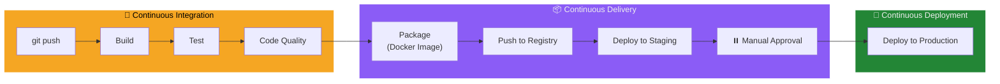
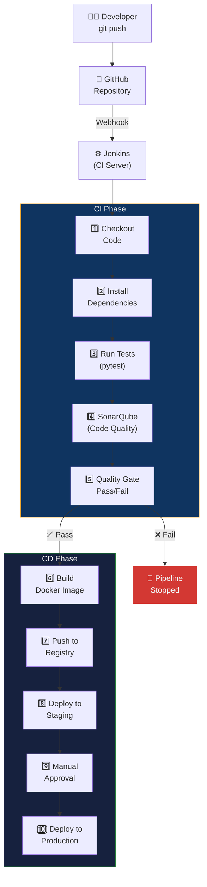
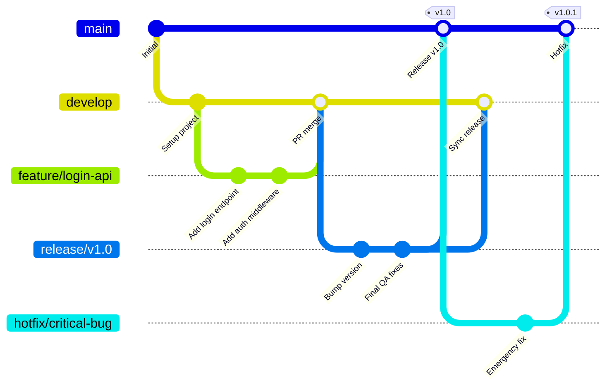
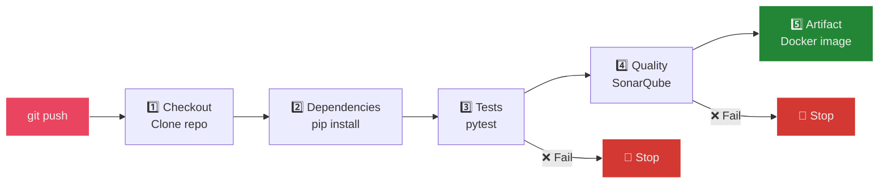
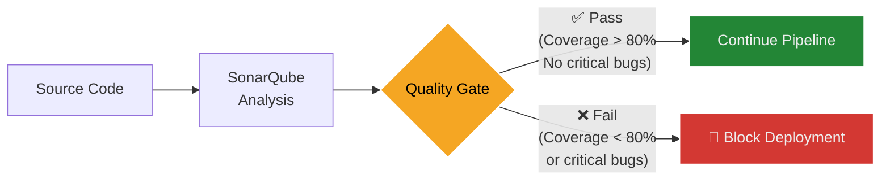
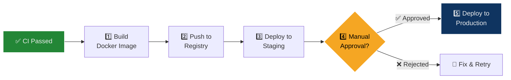
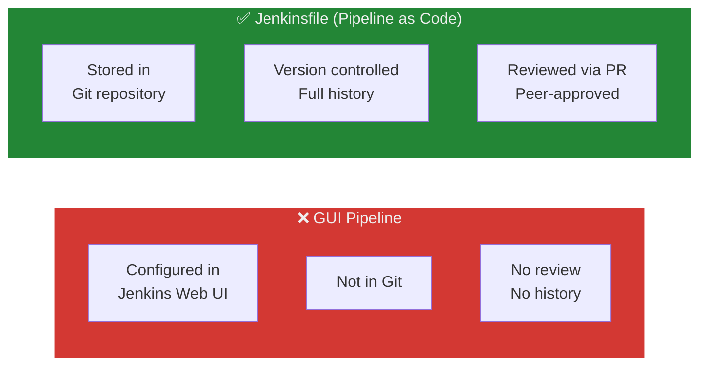
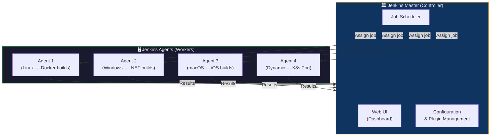
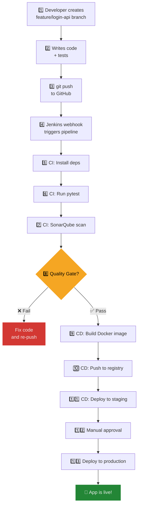

## The Newspaper Printing Press Analogy

Imagine a **daily newspaper** with a deadline every night:

| Newspaper Operation | CI/CD Pipeline |
| :--- | :--- |
| Reporters submit articles throughout the day | Developers push code to branches |
| Editor reviews and approves articles | **Pull Request** — peer review before merge |
| Copy desk checks grammar, facts, layout | **CI** — automated tests, linting, code quality (SonarQube) |
| Articles are assembled into the final edition | **Build** — Docker image created from tested code |
| Printed copies sent to the distribution warehouse | **Push** — image pushed to Docker registry |
| Delivery trucks take papers to stores and subscribers | **Deploy** — container deployed to staging/production |
| If a typo is found, the press **stops** until fixed | If a test fails, the pipeline **stops** — code never reaches production |

> **Key insight:** Without CI/CD, deploying software is like hand-delivering every newspaper article individually. CI/CD creates an automated **assembly line** that takes code from a developer's keyboard to a running production server — with quality gates at every step.

---

## What is CI/CD?

CI/CD is a set of practices that automate the journey of code from development to production. It consists of three levels:

### The Three Levels



| Practice | What Happens | Human Intervention |
| :--- | :--- | :--- |
| **Continuous Integration (CI)** | Code is automatically built, tested, and quality-checked on every push | None — fully automatic |
| **Continuous Delivery (CD)** | Code is packaged (Docker image) and ready to deploy | ✅ Manual approval before production |
| **Continuous Deployment** | Code is automatically deployed to production | ❌ None — fully automatic |

### CI: Continuous Integration

**Goal:** Detect bugs early, keep the `main` branch always in a working state.

- Developers push code to a shared repository **frequently** (multiple times per day)
- Every push triggers an **automated pipeline** that builds, tests, and validates
- If any check fails, the team is notified immediately — the broken code never reaches `main`

### CD: Continuous Delivery vs Continuous Deployment

| Aspect | Continuous Delivery | Continuous Deployment |
| :--- | :--- | :--- |
| **Automation scope** | Through staging | Through production |
| **Production deploy** | Manual button click / approval | Fully automatic |
| **Risk** | Lower — human reviews before release | Higher — bugs can reach production faster |
| **Speed** | Hours (waiting for approval) | Minutes (no waiting) |
| **Used by** | Banks, healthcare, regulated industries | Netflix, Facebook, Etsy |

> Most teams start with **Continuous Delivery** (manual production approval) and graduate to **Continuous Deployment** once they have enough test coverage and confidence.

---

## Full Pipeline Architecture



---

## Example Project: FastAPI CI/CD Application

### Project Structure

```text
fastapi-ci-cd-app/
├── app/
│   ├── __init__.py          # Makes app/ a Python package
│   └── app.py               # FastAPI application
├── tests/
│   └── test_app.py          # Automated test suite
├── requirements.txt         # Python dependencies
├── Dockerfile               # Container build instructions
├── Jenkinsfile              # Pipeline as Code
├── .gitignore               # Files excluded from Git
└── README.md                # Project documentation
```

### `app/app.py` — The FastAPI Application

```python
from fastapi import FastAPI

app = FastAPI()

@app.get("/")
def read_root():
    """Health check endpoint — returns a simple greeting."""
    return {"message": "Hello World"}
```

| Component | Purpose |
| :--- | :--- |
| `FastAPI()` | Creates the web application instance |
| `@app.get("/")` | Registers a GET route at the root URL |
| `return {"message": ...}` | FastAPI auto-serializes the dict to JSON |

### `tests/test_app.py` — Automated Tests

```python
from fastapi.testclient import TestClient
from app.app import app

client = TestClient(app)

def test_root():
    """Verify the root endpoint returns 200 OK with correct message."""
    response = client.get("/")
    assert response.status_code == 200
    assert response.json() == {"message": "Hello World"}
```

> **Key difference from previous labs:** Here we use `TestClient` (from FastAPI's test utilities) instead of `requests`. TestClient doesn't need a running server — it calls the app directly in-memory, making tests **faster** and **simpler** for CI.

### `requirements.txt` — Dependencies

```txt
fastapi
uvicorn
pytest
httpx
```

### `Dockerfile` — Containerization

```dockerfile
FROM python:3.10-slim

WORKDIR /app

# Install dependencies first (layer caching optimization)
COPY requirements.txt .
RUN pip install -r requirements.txt

# Copy application code
COPY . .

# Run the application
CMD ["uvicorn", "app.app:app", "--host", "0.0.0.0", "--port", "80"]
```

| Instruction | Purpose |
| :--- | :--- |
| `FROM python:3.10-slim` | Minimal Python base image (~45 MB) |
| `COPY requirements.txt .` first | Separating deps from code enables Docker **layer caching** — deps only reinstall when `requirements.txt` changes |
| `CMD ["uvicorn", ...]` | Starts the FastAPI app on port 80 with exec form |

### `.gitignore` — Excluded Files

```txt
__pycache__/
*.pyc
.env
venv/
```

---

## Types of Changes in a Web Application

Understanding what changes trigger the pipeline helps design better CI/CD:

| Change Type | Example | CI Impact | CD Impact |
| :--- | :--- | :--- | :--- |
| **Feature** | New `/users` API endpoint | ✅ Tests must pass for new code | New Docker image built |
| **Bug fix** | Fix incorrect calculation in `/add` | ✅ Regression tests validate the fix | Patched image deployed |
| **Refactor** | Restructure code without changing behavior | ✅ Existing tests must still pass | Same functionality, cleaner code |
| **Dependency update** | Upgrade FastAPI from 0.100 to 0.110 | ✅ Tests verify compatibility | New image with updated packages |
| **Config change** | Change environment variable for DB host | May skip tests | May require redeployment |
| **UI/API response** | Change JSON response format | ✅ API tests must be updated | Client-facing change |

---

## Git Flow — Branching Strategy

**Git Flow** is a branching model that organizes development into structured branches:



### Branch Types

| Branch | Purpose | Created From | Merges Into | Lifetime |
| :--- | :--- | :--- | :--- | :--- |
| `main` | Production-ready code | — | — | Permanent |
| `develop` | Integration branch for features | `main` | `main` (via release) | Permanent |
| `feature/*` | New features | `develop` | `develop` | Temporary |
| `release/*` | Pre-release stabilization | `develop` | `main` + `develop` | Temporary |
| `hotfix/*` | Urgent production fixes | `main` | `main` + `develop` | Temporary |

### Feature Branch Workflow

```bash
# 1. Start from develop
git checkout develop
git checkout -b feature/login-api

# 2. Work and commit
git add .
git commit -m "Add login API endpoint"

# 3. Push and create Pull Request
git push origin feature/login-api
# → Open PR: feature/login-api → develop

# 4. After PR approval + CI passes → merge

# 5. When ready for release
git checkout develop
git checkout -b release/v1.0
# → Final testing, version bump, then merge to main
```

### Why Git Flow?

| Benefit | Explanation |
| :--- | :--- |
| **Isolation** | Features developed in isolation — broken code never reaches `main` |
| **Parallel work** | Multiple features developed simultaneously |
| **Quality gates** | PRs require code review + CI pass before merge |
| **Release management** | Dedicated release branches for stabilization |
| **Emergency fixes** | Hotfix branches for critical production bugs |

---

## How CI Works — Step by Step

When code is pushed, the CI pipeline executes these stages:



| Stage | What Happens | Tools |
| :--- | :--- | :--- |
| **1. Checkout** | Clone the repository into the CI server | `git clone`, `actions/checkout` |
| **2. Dependencies** | Install project requirements | `pip install -r requirements.txt` |
| **3. Tests** | Run automated test suite | `pytest`, `jest`, `go test` |
| **4. Code Quality** | Static analysis for bugs, smells, vulnerabilities | SonarQube, flake8, ESLint |
| **5. Artifact** | Build a deployable package | `docker build`, `npm run build` |

### Automated Testing in CI

```bash
# Run all tests in the tests/ directory
pytest tests/ -v

# Expected output:
# tests/test_app.py::test_root PASSED
# =================== 1 passed in 0.12s ===================
```

Types of tests in CI:

| Test Type | What It Validates | Speed | Example |
| :--- | :--- | :--- | :--- |
| **Unit tests** | Individual functions | ⚡ Fast | `assert add(2,3) == 5` |
| **API tests** | HTTP endpoints over network | 🔄 Moderate | `GET /add/2/3 → {"result": 5}` |
| **Integration tests** | Multiple components together | 🐢 Slow | API + Database + Cache |

### Code Quality with SonarQube

**SonarQube** is a static code analysis platform that scans your code for:

| Category | What It Detects | Example |
| :--- | :--- | :--- |
| **Bugs** | Code that will produce incorrect results | Using `==` instead of `is None` |
| **Code Smells** | Code that works but is poorly written | Functions with 200+ lines, deep nesting |
| **Security Vulnerabilities** | Code with exploitable weaknesses | SQL injection, hardcoded passwords |
| **Test Coverage** | Percentage of code covered by tests | "Only 30% of code has tests" |



> **Quality Gate:** A set of conditions that code must meet before proceeding. Example: "Coverage must be ≥ 80%, zero critical bugs, zero security vulnerabilities."

---

## Continuous Delivery / Deployment Flow

After CI passes (tests + quality gate), the CD phase begins:



| CD Stage | What Happens | Example |
| :--- | :--- | :--- |
| **Build image** | Create a Docker image from the tested code | `docker build -t fastapi-app:v1.0 .` |
| **Push to registry** | Upload the image to a shared registry | `docker push registry/fastapi-app:v1.0` |
| **Deploy to staging** | Run the container in a pre-production environment | `kubectl apply -f staging.yml` |
| **Manual approval** | Human verifies staging works correctly | Click "Approve" in Jenkins UI |
| **Deploy to production** | Run the container in the live environment | `kubectl apply -f production.yml` |

### What is Deployment?

**Deployment** = running your application on a server or environment where users can access it.

| Deployment Target | Description | Example |
| :--- | :--- | :--- |
| **Virtual Machine (VM)** | Traditional server (EC2, DigitalOcean) | `ssh server && docker run ...` |
| **Docker container** | Isolated container on a host | `docker run -d -p 80:80 app` |
| **Kubernetes cluster** | Orchestrated containers across nodes | `kubectl apply -f deployment.yml` |
| **Serverless** | Function-based, no server management | AWS Lambda, Google Cloud Run |

---

## Jenkinsfile — Pipeline as Code

### The Problem: GUI-Based Pipelines

Jenkins allows creating pipelines through its **web UI** (graphical interface):

| GUI Pipeline | Problem |
| :--- | :--- |
| Configured via click-and-fill forms | ❌ Not version controlled |
| Lives only inside Jenkins | ❌ Lost if Jenkins server crashes |
| Can't be reviewed via Pull Request | ❌ No peer review |
| Hard to replicate across environments | ❌ Manual recreation needed |
| Prone to human error | ❌ Risk of misconfiguration |

### The Solution: Jenkinsfile

A **Jenkinsfile** is a text file that defines the pipeline in Groovy syntax, stored **alongside your code** in Git.



### Complete Jenkinsfile (Annotated)

```groovy
pipeline {
    agent any                              // Run on any available agent

    stages {
        // Stage 1: Clone the repository
        stage('Checkout') {
            steps {
                git 'https://github.com/user/fastapi-app.git'
            }
        }

        // Stage 2: Install Python dependencies
        stage('Install') {
            steps {
                sh 'pip install -r requirements.txt'
            }
        }

        // Stage 3: Run automated tests
        stage('Test') {
            steps {
                sh 'pytest tests/ -v'
            }
        }

        // Stage 4: Static code analysis
        stage('SonarQube') {
            steps {
                sh 'sonar-scanner'
            }
        }

        // Stage 5: Build Docker image
        stage('Build Docker') {
            steps {
                sh 'docker build -t fastapi-app:latest .'
            }
        }

        // Stage 6: Deploy the container
        stage('Deploy') {
            steps {
                sh 'docker run -d -p 80:80 fastapi-app:latest'
            }
        }
    }

    post {
        success {
            echo '✅ Pipeline completed successfully!'
        }
        failure {
            echo '❌ Pipeline failed. Check the logs.'
        }
    }
}
```

#### Jenkinsfile Key Concepts

| Element | Purpose | Example |
| :--- | :--- | :--- |
| `pipeline {}` | Wrapper for the entire pipeline definition | Required top-level block |
| `agent any` | Run on any available Jenkins agent | Can also specify `agent { label 'docker' }` |
| `stages {}` | Container for all pipeline stages | Groups the sequential steps |
| `stage('Name') {}` | A named phase of the pipeline | `stage('Test')`, `stage('Deploy')` |
| `steps {}` | Commands executed within a stage | `sh 'pytest'`, `git 'url'` |
| `sh '...'` | Executes a shell command (Linux) | `sh 'docker build -t app .'` |
| `bat '...'` | Executes a batch command (Windows) | `bat 'npm install'` |
| `post {}` | Actions after pipeline completes | `success`, `failure`, `always` |

### Advantages of Jenkinsfile

| Benefit | Explanation |
| :--- | :--- |
| **Version controlled** | Stored in Git — every change has history |
| **Peer reviewed** | Pipeline changes go through PRs — no unauthorized modifications |
| **Rollback** | Revert to any previous pipeline version with `git revert` |
| **Reusable** | Same Jenkinsfile works across branches and environments |
| **Infrastructure as Code** | Pipeline definition is treated like application code |
| **Portable** | Move between Jenkins instances by cloning the repo |

---

## Jenkins Architecture

### Master-Agent Model



| Component | Role | Responsibilities |
| :--- | :--- | :--- |
| **Master (Controller)** | Brain of Jenkins | Manages jobs, schedules builds, serves the web UI, stores configuration |
| **Agent (Node/Worker)** | Muscle of Jenkins | Executes the actual build steps (compile, test, Docker build) |

> **Why separate?** The master should focus on coordination, not heavy computation. Running builds directly on the master can overload it and cause scheduling delays.

### Types of Jenkins Agents

| Agent Type | How It Works | Best For |
| :--- | :--- | :--- |
| **Static Agent** | Pre-configured machine, always available | Stable, predictable workloads |
| **Dynamic Agent** | Created on-demand, destroyed after job | Burst workloads, cost optimization |
| **Docker Agent** | Each job runs in a fresh container | Clean, reproducible builds |
| **Cloud Agent** | Provisioned from AWS/Azure/GCP | Elastic scaling with cloud resources |

### Adding an Agent (Steps)

1. Go to **Jenkins → Manage Jenkins → Manage Nodes and Clouds**
2. Click **New Node**
3. Configure:

| Setting | Purpose | Example |
| :--- | :--- | :--- |
| **Name** | Identifier for the agent | `docker-builder-01` |
| **Remote root directory** | Workspace on the agent | `/var/jenkins` |
| **Labels** | Tags for job targeting | `docker`, `linux`, `gpu` |
| **Launch method** | How master connects | SSH, JNLP (Java Web Start) |

4. For SSH-based agents:

```bash
# Master connects to agent via SSH
ssh jenkins@agent-ip
```

5. Use labels in Jenkinsfile to target specific agents:

```groovy
pipeline {
    agent { label 'docker' }   // Only run on agents labeled 'docker'
    stages { ... }
}
```

---

## Credential Management in Jenkins

Never hardcode passwords, tokens, or keys in your Jenkinsfile. Use **Jenkins Credentials Manager**.

### Credential Types

| Type | Use Case | Example |
| :--- | :--- | :--- |
| **Username/Password** | Git repos, Docker Hub | GitHub username + personal access token |
| **SSH Key** | Server access, Git over SSH | Private key for deployment server |
| **Secret Text** | API tokens | Docker Hub access token, Slack webhook |
| **Secret File** | Config files, certificates | Kubernetes kubeconfig, SSL cert |

### Setup Steps

1. **Jenkins → Manage Jenkins → Credentials**
2. Click **Add Credentials**
3. Fill in ID, description, and the secret value
4. Use in Jenkinsfile:

```groovy
pipeline {
    agent any
    stages {
        stage('Deploy') {
            steps {
                withCredentials([
                    usernamePassword(
                        credentialsId: 'docker-hub-creds',
                        usernameVariable: 'DOCKER_USER',
                        passwordVariable: 'DOCKER_PASS'
                    )
                ]) {
                    sh 'echo $DOCKER_PASS | docker login -u $DOCKER_USER --password-stdin'
                    sh 'docker push $DOCKER_USER/fastapi-app:latest'
                }
            }
        }
    }
}
```

> `withCredentials` injects secrets as **environment variables** — they are masked in logs (shown as `****`) and only available within the block.

---

## End-to-End Walkthrough

Putting everything together — the complete journey of a code change:



| Phase | Steps | Automated? |
| :--- | :--- | :--- |
| **Development** | 1–3: Branch, code, push | Manual |
| **CI** | 4–8: Trigger, install, test, scan, quality gate | ✅ Fully automatic |
| **CD** | 9–11: Build, push, deploy to staging | ✅ Fully automatic |
| **Release** | 12–13: Approve, deploy to production | ⏸️ Manual approval (Continuous Delivery) |

---

## CI/CD Tool Comparison

| Tool | Type | Configuration | Best For |
| :--- | :--- | :--- | :--- |
| **Jenkins** | Self-hosted CI/CD server | Groovy (`Jenkinsfile`) | On-premise, custom infrastructure |
| **GitHub Actions** | Cloud-native CI/CD | YAML (`.github/workflows/`) | GitHub-hosted projects |
| **GitLab CI** | Built into GitLab | YAML (`.gitlab-ci.yml`) | GitLab-hosted projects |
| **CircleCI** | Cloud CI/CD | YAML (`.circleci/config.yml`) | Fast builds, Docker-native |
| **Travis CI** | Cloud CI/CD | YAML (`.travis.yml`) | Open-source projects |

---

## Glossary

| Term | Definition |
| :--- | :--- |
| **CI (Continuous Integration)** | Practice of automatically building and testing code on every push |
| **CD (Continuous Delivery)** | Extending CI to produce a deployment-ready artifact — production deploy is manual |
| **Continuous Deployment** | Extending CD to automatically deploy to production — no human approval |
| **Pipeline** | A sequence of automated stages (build, test, deploy) triggered by an event |
| **Stage** | A logical phase within a pipeline (e.g., "Test", "Build Docker", "Deploy") |
| **Jenkinsfile** | A Groovy file that defines a Jenkins pipeline as code, stored in Git |
| **Pipeline as Code** | Treating the CI/CD pipeline definition as version-controlled source code |
| **Quality Gate** | A set of pass/fail conditions (coverage, bugs) that code must meet |
| **SonarQube** | Static code analysis platform that detects bugs, smells, and vulnerabilities |
| **Static Code Analysis** | Examining code without executing it — finds patterns that indicate bugs |
| **Code Smell** | Code that works but is poorly structured (e.g., deep nesting, long functions) |
| **Test Coverage** | Percentage of code lines executed during automated tests |
| **Artifact** | A build output — Docker image, JAR file, binary, etc. |
| **Git Flow** | A branching strategy with main, develop, feature, release, and hotfix branches |
| **Feature Branch** | A short-lived branch for developing a single feature |
| **Hotfix Branch** | An emergency branch created from `main` to fix critical production bugs |
| **Jenkins Master** | The central controller that manages jobs, agents, and configuration |
| **Jenkins Agent** | A worker machine that executes build steps assigned by the master |
| **Static Agent** | A pre-configured, always-available Jenkins agent machine |
| **Dynamic Agent** | An on-demand agent created (and destroyed) per build — Docker/K8s |
| **Credentials Manager** | Jenkins feature for storing secrets (passwords, tokens, keys) securely |
| **`withCredentials`** | Groovy block that injects secrets as environment variables during a stage |
| **Webhook** | An HTTP callback that notifies Jenkins when code is pushed to GitHub |
| **Registry** | A service that stores Docker images (Docker Hub, ECR, GHCR) |

---

## Exam / Interview Prep

### Q1: Explain the difference between Continuous Integration, Continuous Delivery, and Continuous Deployment with a practical example.

**Answer:** **Continuous Integration (CI)** automatically builds and tests code on every push. For example, when a developer pushes a FastAPI change to GitHub, Jenkins runs `pytest` to verify the code. **Continuous Delivery (CD)** extends CI by building a Docker image and pushing it to a registry — the image is deployment-ready, but deploying to production requires manual approval. For instance, a bank's payment API is automatically tested and packaged, but a release manager clicks "Deploy" after reviewing staging. **Continuous Deployment** goes further — the code is automatically deployed to production without any human intervention. Companies like Netflix use this: every commit that passes tests is automatically rolled out to millions of users. The key difference is the **manual approval gate** between Delivery and Deployment.

### Q2: What is a Jenkinsfile, and why is it preferred over configuring pipelines through the Jenkins web GUI?

**Answer:** A Jenkinsfile is a text file written in Groovy syntax that defines the CI/CD pipeline **as code**, stored alongside application code in the Git repository. It's preferred over the GUI because: (1) **Version control** — every pipeline change is tracked in Git history. (2) **Peer review** — pipeline changes go through Pull Requests, preventing unauthorized modifications. (3) **Reproducibility** — the same Jenkinsfile works identically across branches and environments. (4) **Rollback** — revert to any previous pipeline version with `git revert`. (5) **Portability** — migrate between Jenkins instances by cloning the repo. GUI pipelines lack all of these — they're not tracked, can't be reviewed, and are lost if Jenkins crashes. This concept is called **Pipeline as Code** and aligns with the DevOps principle of treating everything as code.

### Q3: Describe the Jenkins master-agent architecture. Why would you use dynamic agents over static agents?

**Answer:** Jenkins uses a **master-agent** (controller-worker) architecture. The **master** manages the web UI, schedules jobs, stores configuration, and coordinates work. **Agents** (nodes) are separate machines that execute the actual build steps (compiling, testing, Docker builds). This separation prevents the master from being overloaded by compute-heavy jobs. **Static agents** are pre-configured machines that are always running — simple but wasteful when idle. **Dynamic agents** are created on-demand (typically as Docker containers or Kubernetes pods) and destroyed after the job completes. Dynamic agents are preferred because: (1) **Cost efficiency** — you only pay for compute when builds are running. (2) **Clean environment** — each build gets a fresh container, preventing "works on my agent" issues. (3) **Scalability** — can spin up 50 agents during peak hours and scale to zero overnight. The trade-off is added complexity in configuring Docker/Kubernetes integration with Jenkins.

---

## Quick Reference Card

```groovy
// ─── Minimal Jenkinsfile ───
pipeline {
    agent any
    stages {
        stage('Test')  { steps { sh 'pytest' } }
        stage('Build') { steps { sh 'docker build -t app .' } }
        stage('Deploy'){ steps { sh 'docker run -d -p 80:80 app' } }
    }
}

// ─── With Credentials ───
withCredentials([usernamePassword(
    credentialsId: 'docker-hub',
    usernameVariable: 'USER',
    passwordVariable: 'PASS'
)]) {
    sh 'echo $PASS | docker login -u $USER --password-stdin'
}

// ─── Target Specific Agent ───
agent { label 'docker' }

// ─── Post Actions ───
post {
    success { echo '✅ Done!' }
    failure { echo '❌ Failed!' }
}
```

```bash
# ─── Git Flow Commands ───
git checkout develop
git checkout -b feature/my-feature     # Create feature branch
git push origin feature/my-feature     # Push for PR
# After PR merge:
git checkout develop
git checkout -b release/v1.0           # Release branch
# After testing:
git checkout main
git merge release/v1.0                 # Merge to production
git tag v1.0                           # Tag release
```
