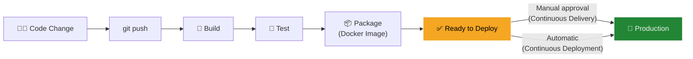
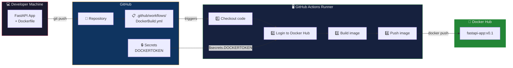
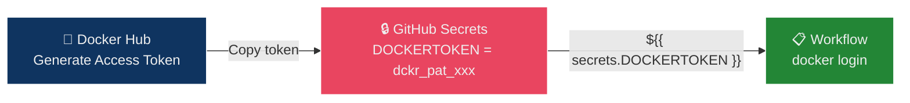
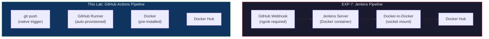

## The Pizza Delivery Analogy — Understanding Continuous Delivery

Imagine a **pizza chain** with an automated kitchen:

| Pizza Kitchen | CI/CD Pipeline |
| :--- | :--- |
| Customer places order (phone/app) | Developer runs `git push` |
| Order ticket printed in kitchen | **Event trigger** (`on: push`) — workflow starts |
| Chef assembles pizza from recipe | **Build step** — Docker builds image from Dockerfile |
| Quality inspector checks toppings | **Test step** — automated tests verify the app works |
| Pizza boxed and labeled for delivery | **Package step** — image tagged and prepared |
| Pizza placed on delivery shelf | **Push step** — image pushed to Docker Hub (registry) |
| Driver picks up and delivers | **Deploy step** — pull from registry and run in production |

> **Key insight:** With Continuous Delivery, every `git push` automatically produces a **delivery-ready package** (Docker image). The only manual step is deciding *when* to actually deliver it to production.

---

## Continuous Delivery vs Continuous Deployment

These two terms sound similar but differ in one critical way:



| Concept | What Happens | Human Intervention |
| :--- | :--- | :--- |
| **Continuous Integration (CI)** | Code is automatically built and tested on every push | None — fully automatic |
| **Continuous Delivery (CD)** | Code is packaged and **ready** to deploy | ✅ Manual deployment approval |
| **Continuous Deployment** | Code is automatically deployed to production | ❌ None — fully automatic |

> In this lab, we implement **Continuous Delivery**: every push builds a Docker image and pushes it to Docker Hub. Deploying to a server remains a manual decision.

---

## What We're Building



### The Pipeline in One Sentence

> Every `git push` triggers GitHub Actions to build a Docker image from your Dockerfile and push it to Docker Hub — no manual Docker commands needed.

---

## Prerequisites

| Requirement | Purpose |
| :--- | :--- |
| GitHub account | Host repository + run GitHub Actions |
| Docker Hub account | Store Docker images (registry) |
| Docker Hub Access Token | Authenticate `docker push` from GitHub Actions |
| Git installed | Push code to GitHub |
| Docker installed (optional) | Local testing before pushing |

---

## Project Structure

```text
fastapi-docker-actions/
├── .env                              # Local-only: Docker Hub token (NOT committed)
├── .gitignore                        # Excludes .env from Git
├── .github/
│   └── workflows/
│       └── DockerBuild.yml           # GitHub Actions workflow
├── Dockerfile                        # Container build instructions
├── main.py                           # FastAPI application
├── requirements.txt                  # Python dependencies
└── README.md                         # Project description
```

---

## Part I — Hands-On: Build the Pipeline

### Step 1: Create GitHub Repository

1. Go to [github.com/new](https://github.com/new)
2. Name: `fastapi-docker-actions` (or any name)
3. Visibility: **Private**
4. ✅ Add a README
5. Click **Create Repository**
6. Clone it locally:

```bash
git clone git@github.com:<username>/fastapi-docker-actions.git
cd fastapi-docker-actions
```

### Step 2: Create `.gitignore` and `.env`

The `.env` file stores your Docker Hub token **locally** — it must never be committed to Git.

**`.gitignore`:**

```ini
.env
__pycache__/
```

**`.env`** (local only — for reference):

```env
DOCKERTOKEN=dckr_pat_xxxxxxxxxxxxxxxxxxxx
```

```bash
git add .gitignore
git commit -m "Add .gitignore to exclude .env"
git push
```

### Step 3: Create the FastAPI Application

**`main.py`:**

```python
from fastapi import FastAPI
import uvicorn

app = FastAPI()

@app.get("/")
def read_root():
    return {
        "name": "Pranav R Nair",
        "sapid": "500121466",
        "Location": "Dehradun"
    }

@app.get("/{data}")
def read_data(data: str):
    return {
        "message": f"Hello, {data}!",
        "Location": "Dehradun"
    }

if __name__ == "__main__":
    uvicorn.run("main:app", host="0.0.0.0", port=80, reload=True)
```

#### Code Breakdown

| Line | Purpose |
| :--- | :--- |
| `FastAPI()` | Creates the web application instance |
| `@app.get("/")` | Defines a route — responds to GET requests at `/` |
| `return {...}` | Returns a JSON response automatically (FastAPI handles serialization) |
| `@app.get("/{data}")` | Dynamic route — `data` captures the URL path segment |
| `uvicorn.run(...)` | Starts the ASGI server on port 80 with hot-reload |

**`requirements.txt`:**

```txt
fastapi
uvicorn
```

### Step 4: Create the Dockerfile

```dockerfile
FROM ubuntu

# Install Python and pipenv
RUN apt update -y && \
    apt install -y python3 python3-pip pipenv

# Set working directory
WORKDIR /app

# Copy project files
COPY . /app/

# Install dependencies using pipenv
RUN pipenv install -r requirements.txt

# Expose the application port
EXPOSE 80

# Start the application
CMD pipenv run python3 ./main.py
```

#### Line-by-Line Breakdown

| Instruction | What It Does | Why |
| :--- | :--- | :--- |
| `FROM ubuntu` | Uses Ubuntu as the base image | Full OS with apt package manager |
| `RUN apt update && apt install ...` | Installs Python 3, pip, and pipenv | Combined with `&&` to reduce image layers |
| `WORKDIR /app` | Sets `/app` as the working directory | All subsequent commands run from here |
| `COPY . /app/` | Copies all project files into the container | Brings `main.py`, `requirements.txt` into the image |
| `RUN pipenv install -r requirements.txt` | Installs FastAPI and Uvicorn in a virtual environment | pipenv manages isolated dependencies |
| `EXPOSE 80` | Documents that the container listens on port 80 | Informational — doesn't actually publish the port |
| `CMD pipenv run python3 ./main.py` | Default command when container starts | Runs the FastAPI app through pipenv's virtualenv |

### Step 5: Generate Docker Hub Access Token

1. Go to [hub.docker.com](https://hub.docker.com/)
2. Click your profile → **Account Settings** → **Security** → **Access Tokens**
3. Click **New Access Token**
4. Description: `github-actions`
5. Permissions: **Read, Write, Delete**
6. Click **Generate** and **copy the token immediately** (you won't see it again)

### Step 6: Add Token as GitHub Secret

1. Go to your GitHub repository
2. Navigate to **Settings → Secrets and variables → Actions**
3. Click **New repository secret**
4. Name: `DOCKERTOKEN`
5. Value: paste your Docker Hub access token
6. Click **Add secret**



> **Why not hardcode the token?** Anyone who can see your repository (or its history) would have full access to your Docker Hub account. GitHub Secrets are encrypted and never exposed in logs.

### Step 7: Create the GitHub Actions Workflow

**`.github/workflows/DockerBuild.yml`:**

```yaml
name: Docker Image Build & Push

on:
  push:
    branches:
      - main

jobs:
  build:
    runs-on: ubuntu-latest

    steps:
      # Step 1: Clone the repository into the runner
      - name: Checkout repository
        uses: actions/checkout@v4

      # Step 2: Authenticate with Docker Hub
      - name: Login to Docker Hub
        run: |
          echo ${{ secrets.DOCKERTOKEN }} | docker login -u "your_docker_username" --password-stdin

      # Step 3: Build the Docker image
      - name: Build Docker Image
        run: |
          docker build -t your_docker_username/fastapi-app:v0.1 .

      # Step 4: Push to Docker Hub
      - name: Push Docker Image
        run: |
          docker push your_docker_username/fastapi-app:v0.1
```

> **Replace `your_docker_username`** with your actual Docker Hub username in all three places.

#### Workflow Breakdown

| Step | What It Does | Why |
| :--- | :--- | :--- |
| `actions/checkout@v4` | Clones your repo into the runner | Runner starts with an empty filesystem |
| `docker login --password-stdin` | Authenticates to Docker Hub using the secret token | `--password-stdin` is secure — avoids token appearing in shell history |
| `docker build -t ... .` | Builds the image from the Dockerfile in the current directory | Tags it as `username/fastapi-app:v0.1` |
| `docker push ...` | Uploads the image to Docker Hub | Makes it available for anyone to `docker pull` |

### Step 8: Commit and Push Everything

```bash
git add .
git commit -m "Add FastAPI app with Docker + GitHub Actions CI/CD"
git push origin main
```

### Step 9: Watch the Pipeline Run

1. Go to your GitHub repository
2. Click the **Actions** tab
3. You'll see a workflow run triggered by your push
4. Click it to see real-time logs for each step

**Expected output in the Actions log:**

```text
✅ Checkout repository — success
✅ Login to Docker Hub — Login Succeeded
✅ Build Docker Image — Successfully built abc123
✅ Push Docker Image — v0.1: digest: sha256:... size: 1234
```

### Step 10: Verify on Docker Hub

Go to [hub.docker.com](https://hub.docker.com/) → your repository. You should see:

| Field | Value |
| :--- | :--- |
| **Repository** | `your_username/fastapi-app` |
| **Tag** | `v0.1` |
| **Last pushed** | Just now |

---

## Optional: Test Locally

Before pushing to GitHub, you can verify the Docker image works locally:

```bash
# Build
docker build -t fastapi-app .

# Run
docker run -p 8080:80 fastapi-app

# Test
curl http://localhost:8080
```

**Expected response:**

```json
{
  "name": "Pranav R Nair",
  "sapid": "500121466",
  "Location": "Dehradun"
}
```

```bash
# Test dynamic route
curl http://localhost:8080/kubernetes
```

```json
{
  "message": "Hello, kubernetes!",
  "Location": "Dehradun"
}
```

---

## Part II — Verification: Validate the Full Pipeline

This verifies that the complete cycle works: code change → automatic build → updated image on Docker Hub → running container reflects the change.

### Task 1: Modify the Application

Update `main.py` to add a new field:

```python
@app.get("/")
def read_root():
    return {
        "name": "Pranav R Nair",
        "sapid": "500121466",
        "Location": "Dehradun",
        "pipeline": "GitHub Actions + Docker Hub"
    }
```

### Task 2: Push the Change

```bash
git add main.py
git commit -m "Add pipeline field for CI/CD verification"
git push origin main
```

### Task 3: Verify in GitHub Actions

1. Go to **Actions** tab in your repository
2. Click the latest workflow run
3. Confirm all 4 steps are green:

```text
✅ Checkout repository
✅ Login to Docker Hub
✅ Build Docker Image
✅ Push Docker Image
```

### Task 4: Verify on Docker Hub

Go to your Docker Hub repository and confirm:
- The `v0.1` tag shows an updated **Last pushed** timestamp
- The image size may differ slightly if code changed

### Task 5: Pull and Run the Updated Image

```bash
docker pull your_docker_username/fastapi-app:v0.1
docker run --rm -p 8080:80 your_docker_username/fastapi-app:v0.1
```

### Task 6: Validate the Response

```bash
curl http://localhost:8080
```

**Expected:**

```json
{
  "name": "Pranav R Nair",
  "sapid": "500121466",
  "Location": "Dehradun",
  "pipeline": "GitHub Actions + Docker Hub"
}
```

The `"pipeline"` field confirms the image was rebuilt with your latest code change.

### Verification Checklist

| Check | What It Proves |
| :--- | :--- |
| ✅ GitHub Actions triggered on push | Event trigger (`on: push`) is configured correctly |
| ✅ Docker image built successfully | Dockerfile is valid and dependencies install |
| ✅ Image pushed to Docker Hub | `DOCKERTOKEN` secret works, authentication succeeds |
| ✅ Container reflects latest code | The full pipeline — from `git push` to running container — works end-to-end |

---

## Comparison: This Pipeline vs EXP-7 (Jenkins)

In Experiment 7, we built the same pipeline using Jenkins. Here's how they compare:

| Aspect | EXP-7 (Jenkins) | This Lab (GitHub Actions) |
| :--- | :--- | :--- |
| **Setup required** | Install Jenkins, configure Docker-outside-of-Docker, install plugins | None — built into GitHub |
| **Configuration** | `Jenkinsfile` (Groovy syntax) | YAML workflow file |
| **Authentication** | Jenkins Credentials store + `withCredentials` block | GitHub Secrets + `${{ secrets.* }}` |
| **Docker access** | Mount Docker socket into Jenkins container | Pre-installed on GitHub runners |
| **Webhook setup** | Manual: ngrok + GitHub webhook configuration | Automatic — GitHub events trigger natively |
| **Server maintenance** | You manage the Jenkins server | GitHub manages the runners |
| **Lines of config** | ~50 (Groovy + docker-compose) | ~25 (YAML) |



> **Takeaway:** GitHub Actions eliminates the entire Jenkins infrastructure layer — no server setup, no webhook configuration, no Docker socket mounting. The trade-off is less flexibility for on-premise and custom environments.

---

## Common Pitfalls & Troubleshooting

| Problem | Cause | Fix |
| :--- | :--- | :--- |
| Workflow not triggering | Branch name mismatch | Check `branches:` in `on.push` matches your actual branch (`main` vs `master`) |
| `Login to DockerHub` fails | Wrong secret name or expired token | Verify secret name is exactly `DOCKERTOKEN`; regenerate token on Docker Hub |
| `docker build` fails | Syntax error in Dockerfile or missing files | Test `docker build .` locally first |
| `docker push` denied | Token lacks push permissions | Regenerate token with **Read, Write, Delete** permissions |
| Image on Docker Hub not updated | Same tag (`v0.1`) cached | Use unique tags (e.g., `v0.2`) or use `${{ github.sha }}` as the tag |
| `.env` file committed to Git | `.gitignore` not set up before first commit | Add `.env` to `.gitignore`; remove from Git history with `git rm --cached .env` |
| `pipenv: command not found` in Dockerfile | `pipenv` not installed | Ensure `apt install pipenv` is in the Dockerfile |
| Port not accessible locally | Wrong port mapping | Use `-p 8080:80` — maps host 8080 to container 80 |

---

## Deep Dive: Why `--password-stdin`?

```yaml
echo ${{ secrets.DOCKERTOKEN }} | docker login -u "username" --password-stdin
```

| Approach | Security |
| :--- | :--- |
| `docker login -p $TOKEN` | ❌ Token visible in `ps` output and shell history |
| `echo $TOKEN \| docker login --password-stdin` | ✅ Token piped through stdin — never appears in process list |

> GitHub Actions also masks secrets in logs automatically — if `DOCKERTOKEN` accidentally appears in output, it shows as `***`.

---

## Advanced: Dynamic Tagging with Git SHA

Instead of a fixed tag (`v0.1`), use the Git commit SHA for unique, traceable tags:

```yaml
- name: Build Docker Image
  run: |
    docker build -t your_username/fastapi-app:${{ github.sha }} .
    docker build -t your_username/fastapi-app:latest .

- name: Push Docker Image
  run: |
    docker push your_username/fastapi-app:${{ github.sha }}
    docker push your_username/fastapi-app:latest
```

This creates two tags per push:
- `abc1234def` — the exact commit that produced this image (traceable)
- `latest` — always points to the most recent build (convenient)

---

## Glossary

| Term | Definition |
| :--- | :--- |
| **Continuous Integration (CI)** | Automatically building and testing code on every push |
| **Continuous Delivery (CD)** | Extending CI to produce a deployable artifact (e.g., Docker image) — deployment is manual |
| **Continuous Deployment** | Extending CD to automatically deploy to production — no human approval needed |
| **GitHub Actions** | GitHub's built-in CI/CD platform — workflows defined in YAML |
| **Workflow** | A YAML file defining the automation pipeline (`.github/workflows/`) |
| **Runner** | The virtual machine that executes a workflow job |
| **Secret** | An encrypted variable stored in GitHub — used for tokens and passwords |
| **Docker Hub** | Public Docker image registry — stores and distributes container images |
| **Access Token** | An API key generated by Docker Hub — used instead of passwords for authentication |
| **`--password-stdin`** | Docker login flag that reads the password from stdin instead of command-line args (secure) |
| **Image Tag** | A label for a specific version of a Docker image (e.g., `v0.1`, `latest`, `abc123`) |
| **`actions/checkout`** | GitHub Action that clones your repository into the runner's filesystem |
| **FastAPI** | Modern Python web framework for building APIs — auto-generates docs and uses type hints |
| **Uvicorn** | ASGI server that runs FastAPI applications |
| **pipenv** | Python package manager that creates isolated virtual environments |
| **`EXPOSE`** | Dockerfile instruction that documents which port the container listens on |
| **`CMD`** | Dockerfile instruction that defines the default command when the container starts |
| **Registry** | A service that stores and distributes Docker images (Docker Hub, ECR, GHCR) |

---

## Exam / Interview Prep

### Q1: Explain the difference between Continuous Delivery and Continuous Deployment. Which one does this lab implement?

**Answer:** **Continuous Delivery** ensures that every code change is automatically built, tested, and packaged into a deployable artifact (in this case, a Docker image pushed to Docker Hub). However, the actual deployment to production requires **manual approval**. **Continuous Deployment** goes further — it automatically deploys every passing build to production with zero human intervention. This lab implements **Continuous Delivery** because we push the image to Docker Hub (making it deployment-ready), but the decision to pull and run it in production is manual.

### Q2: Why do we use GitHub Secrets instead of hardcoding the Docker Hub token in the workflow file? What would happen if we committed the token directly?

**Answer:** GitHub Secrets store sensitive values (API keys, tokens, passwords) in **encrypted storage** that is only decrypted at runtime and automatically masked in logs. If we hardcoded the token in the YAML file, it would be: (1) visible to anyone with repository access, (2) stored permanently in Git history (even if deleted later), and (3) could be harvested by bots scanning public repositories. An exposed Docker Hub token would allow an attacker to push malicious images to your account, potentially affecting anyone who pulls your images.

### Q3: Compare the Jenkins CI/CD pipeline (EXP-7) with the GitHub Actions pipeline in this lab. What are the key architectural differences?

**Answer:** The Jenkins pipeline requires: (1) a self-hosted Jenkins server running as a Docker container, (2) Docker socket mounting for Docker-outside-of-Docker access, (3) manual webhook configuration with ngrok for localhost exposure, (4) the Jenkins Credentials plugin for secret management, and (5) Groovy-based Jenkinsfile syntax. GitHub Actions eliminates all of this: (1) runners are auto-provisioned by GitHub, (2) Docker is pre-installed on runners, (3) GitHub events trigger natively — no webhooks needed, (4) secrets are built into repository settings, and (5) YAML syntax is simpler. The trade-off is that Jenkins offers more flexibility for on-premise infrastructure and custom build environments, while GitHub Actions is limited to GitHub-hosted or self-hosted runners.

---

## Quick Reference Card

```bash
# ─── Project Setup ───
mkdir fastapi-docker-actions && cd fastapi-docker-actions
git init
echo ".env" > .gitignore
echo "DOCKERTOKEN=your_token_here" > .env

# ─── Local Docker Test ───
docker build -t fastapi-app .
docker run -p 8080:80 fastapi-app
curl http://localhost:8080

# ─── Push to Trigger Pipeline ───
git add .
git commit -m "Add CI/CD pipeline"
git push origin main

# ─── Verify ───
# 1. GitHub → Actions tab → check workflow status
# 2. Docker Hub → check image tag timestamp
# 3. Local: pull and run
docker pull your_username/fastapi-app:v0.1
docker run --rm -p 8080:80 your_username/fastapi-app:v0.1
curl http://localhost:8080
```

```yaml
# ─── Minimal Workflow Template ───
name: Docker Build & Push
on:
  push:
    branches: [main]
jobs:
  build:
    runs-on: ubuntu-latest
    steps:
      - uses: actions/checkout@v4
      - run: echo ${{ secrets.DOCKERTOKEN }} | docker login -u "username" --password-stdin
      - run: docker build -t username/app:v0.1 .
      - run: docker push username/app:v0.1
```
