## The Library Analogy — Understanding Version Control

Imagine a **public library's manuscript archive**:

| Library Concept | Git Equivalent |
| :--- | :--- |
| The manuscript | Your source code |
| A photocopy of the manuscript | A **snapshot** (commit) — a frozen record of the entire project at one moment |
| The filing cabinet with dated copies | The **commit history** — every version ever saved, in order |
| The librarian's logbook | The **git log** — who changed what, when, and why |
| A researcher's personal photocopy | A **local repository** — your full copy of all history |
| The library's master archive | The **remote repository** (GitHub) — the shared source of truth |
| Two researchers editing different chapters | **Branching** — parallel work on different features |
| Combining both researchers' edits | **Merging** — integrating parallel changes back together |

> **Key insight:** Git doesn't just save *your latest file* — it saves *every version that ever existed*, so you can always go back.

---

## What is Version Control?

**Version Control** is a system that records changes to files over time so that you can recall specific versions later. It is the backbone of modern software development and DevOps.

### Why Version Control is Essential

| Benefit | Without Version Control | With Version Control |
| :--- | :--- | :--- |
| **History** | `final.py`, `final_v2.py`, `final_FINAL.py` | Complete timeline of every change |
| **Collaboration** | Email files back and forth, overwrite each other's work | Multiple developers work simultaneously |
| **Recovery** | Accidentally delete code? It's gone forever | Roll back to any previous commit |
| **Accountability** | "Who broke the build?" — no one knows | `git blame` shows exactly who changed each line |
| **Branching** | Copy entire folders for experiments | Lightweight branches that merge cleanly |

---

## What is Git?

**Git** is a **Distributed Version Control System (DVCS)** — the industry standard for tracking changes in source code.

- **Creator:** Linus Torvalds (also created Linux)
- **Year:** 2005
- **Design goals:** Speed, data integrity, support for distributed workflows
- **License:** Open-source (GPL v2)

### Git vs SCM — Clearing Up the Terminology

| Term | What It Is |
| :--- | :--- |
| **SCM** (Source Code Management) | The **practice/discipline** of managing code changes |
| **Git** | A specific **tool** that implements SCM |
| **GitHub / GitLab / Bitbucket** | **Hosting platforms** that provide remote Git repositories + collaboration features |

> Git is to SCM what Docker is to containerization — the tool that implements the concept.

---

## Types of Version Control Systems

### 1. Centralized Version Control System (CVCS)

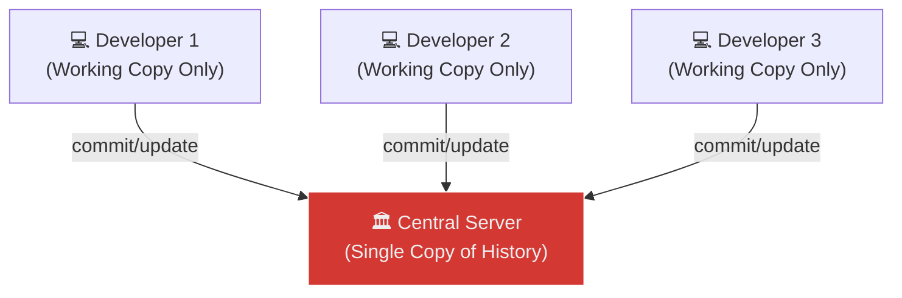

**How it works:** One central server holds the entire history. Developers only have the latest version ("working copy") and must connect to the server for every operation.

**Examples:** Apache Subversion (SVN), CVS, Perforce

**Limitations:**

| Problem | Impact |
| :--- | :--- |
| **Single point of failure** | If the server dies, all history is lost |
| **Requires network** | Cannot commit, branch, or view history offline |
| **Slow operations** | Every operation requires a server round-trip |
| **Heavy branching** | Branches are expensive copies on the server |

### 2. Distributed Version Control System (DVCS)

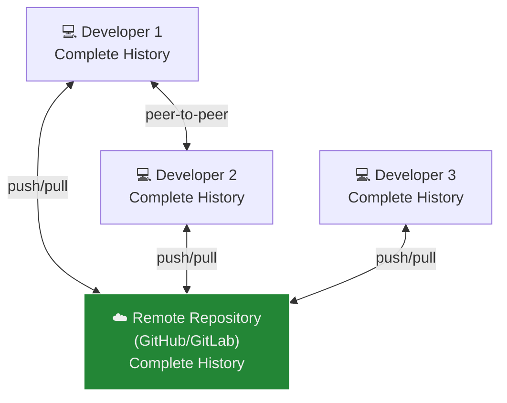

**How it works:** Every developer clones the **entire repository** including all history. Operations like commit, branch, log, and diff are **local** (instant). The remote is used only for sharing.

**Examples:** Git, Mercurial

**Advantages:**

| Advantage | Why It Matters |
| :--- | :--- |
| **Full offline capability** | Commit, branch, merge, view history — all without internet |
| **No single point of failure** | Every clone is a full backup |
| **Lightning-fast operations** | Everything runs locally (no network) |
| **Lightweight branches** | Branches are just pointers — created in milliseconds |
| **Flexible workflows** | Centralized, feature-branch, fork-based — any model works |

---

## Git vs SVN vs Mercurial

| Feature | Git | SVN | Mercurial |
| :--- | :--- | :--- | :--- |
| **Type** | Distributed (DVCS) | Centralized (CVCS) | Distributed (DVCS) |
| **Speed** | Very fast (local ops) | Slower (server ops) | Fast |
| **Offline Work** | ✅ Full capability | ❌ Need network | ✅ Full capability |
| **Branching** | Lightweight pointers | Heavy server-side copies | Simple and efficient |
| **Data Storage** | **Snapshots** of entire project | **Deltas** (changes between versions) | **Changesets** |
| **Learning Curve** | Moderate (powerful but complex) | Easy | Easy |
| **Industry Use** | Dominant (95%+ of projects) | Declining (legacy systems) | Niche |
| **Ecosystem** | GitHub, GitLab, Bitbucket, CI/CD | Limited | Limited |

### Key Concept: Snapshots vs Deltas

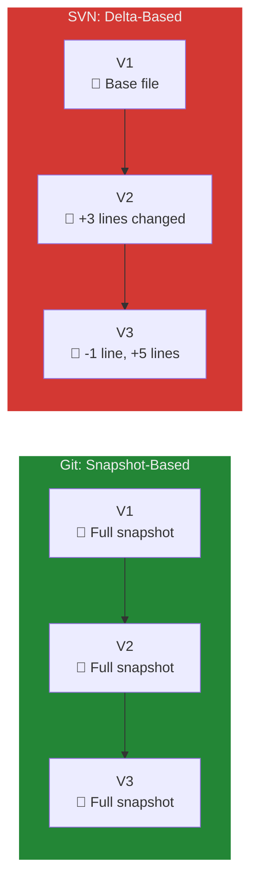

- **Git** captures a snapshot of every file at each commit. Unchanged files are stored as references (not duplicated), making it space-efficient despite storing "full snapshots."
- **SVN** stores only the differences (deltas) between versions. Reconstructing any version requires replaying all deltas from the beginning.

> **Why snapshots win:** Retrieving any version in Git is O(1) — instant. In SVN, it's O(n) — slower as history grows.

---

## Why Git Dominates

| Reason | Detail |
| :--- | :--- |
| **No central dependency** | Work offline, commit locally, push when ready |
| **Branching is free** | Branches are pointers — create 100 branches with zero overhead |
| **Merging is smart** | Git's 3-way merge algorithm handles most conflicts automatically |
| **Performance** | Written in C, optimized for speed |
| **DevOps integration** | Every CI/CD tool (Jenkins, GitHub Actions, GitLab CI) is Git-native |
| **Community** | Largest ecosystem of tools, tutorials, and contributors |

---

## Git's Internal Architecture

### The Three Areas

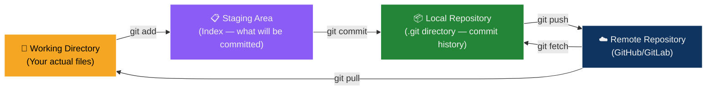

| Area | What It Is | Key Commands |
| :--- | :--- | :--- |
| **Working Directory** | The actual files you see and edit on disk | `git status` to see changes |
| **Staging Area (Index)** | A "preview" of what the next commit will contain | `git add` to stage, `git reset` to unstage |
| **Local Repository** | The `.git` folder — stores all commits, branches, tags | `git commit` to save, `git log` to view |
| **Remote Repository** | The hosted copy (GitHub) for sharing and backup | `git push` / `git pull` / `git fetch` |

### The Staging Area — Git's Unique Feature

Most VCS tools go directly from "changed files" → "committed." Git adds the **staging area** in between, which lets you:
- Commit only **some** of your changes (partial commits)
- Review exactly what will be committed (`git diff --staged`)
- Build commits that tell a clean story, even if your work was messy

---

## Git Setup — Identity and Authentication

### 1. Set Git Identity

Every commit is stamped with your name and email. Configure them globally:

```bash
git config --global user.name "Your Name"
git config --global user.email "your-email@example.com"
```

Verify:

```bash
git config --list
```

| Scope | Flag | Applies To |
| :--- | :--- | :--- |
| `--system` | All users on the machine | Rarely used |
| `--global` | All repositories for your user | ✅ Most common |
| `--local` | Only the current repository | Used for work vs personal email |

### 2. Generate SSH Key (Passwordless GitHub Authentication)

SSH keys use public-key cryptography — your **private key** stays on your machine, your **public key** goes to GitHub. No passwords needed.

```bash
ssh-keygen -t ed25519 -C "your-email@example.com"
```

| Flag | Purpose |
| :--- | :--- |
| `-t ed25519` | Key type — Ed25519 is modern, fast, and secure |
| `-C "email"` | Comment — identifies which key belongs to whom |

Press **Enter** for default location (`~/.ssh/id_ed25519`), optionally set a passphrase.

### 3. Start SSH Agent and Add Key

```bash
eval "$(ssh-agent -s)"
ssh-add ~/.ssh/id_ed25519
```

### 4. Add Public Key to GitHub

```bash
cat ~/.ssh/id_ed25519.pub
```

Copy the output, then go to [GitHub → Settings → SSH Keys](https://github.com/settings/keys) → **New SSH Key**.

### 5. Commit Signing (Verified Commits)

GitHub distinguishes between **authentication** and **signing**:

```text
Authentication key → "Who are you?" (login/push/pull)
Signing key        → "Did YOU make this commit?" (✅ Verified badge)
```

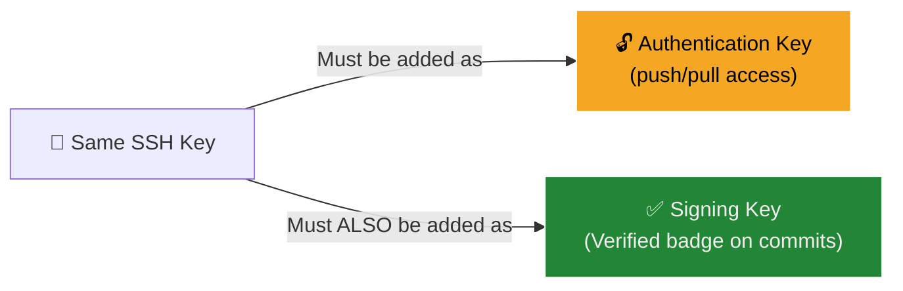

> **Important:** Even if it's the **same key**, you must add it to GitHub in **both** places — once as Authentication, once as Signing. Adding it only as Authentication will NOT verify your commits.

Configure Git to sign commits:

```bash
git config --global gpg.format ssh
git config --global user.signingkey ~/.ssh/id_ed25519.pub
git config --global commit.gpgsign true
```

### 6. Test SSH Connection

```bash
ssh -T git@github.com
```

**Expected:**
```text
Hi username! You've successfully authenticated, but GitHub does not provide shell access.
```

---

## Repository Initialization and Remote Connection

### Case 1: New Project (From Scratch)

```bash
echo "# my-project" >> README.md
git init
git add README.md
git commit -m "Initial commit"
git branch -M main
git remote add origin git@github.com:username/my-project.git
git push -u origin main
```

| Command | What It Does |
| :--- | :--- |
| `git init` | Creates a `.git` directory — turns the folder into a Git repository |
| `git add README.md` | Stages the file for the next commit |
| `git commit -m "..."` | Saves a snapshot with a descriptive message |
| `git branch -M main` | Renames the default branch to `main` |
| `git remote add origin <url>` | Links the local repo to a remote (GitHub) |
| `git push -u origin main` | Uploads commits; `-u` sets `origin/main` as the default upstream |

### Case 2: Existing Project

```bash
git remote add origin git@github.com:username/existing-project.git
git branch -M main
git push -u origin main
```

### Managing Remotes

```bash
# View remotes
git remote -v

# Add a remote
git remote add origin git@github.com:user/repo.git

# Change remote URL
git remote set-url origin git@github.com:user/new-repo.git

# Remove a remote
git remote remove origin
```

**Common error:** `fatal: remote origin already exists`
**Fix:** Remove first, then re-add:
```bash
git remote remove origin
git remote add origin git@github.com:user/repo.git
```

---

## Branching — Parallel Development

**Branches** let you work on features in isolation without affecting the main codebase. In Git, a branch is just a lightweight pointer to a commit — creating one takes milliseconds.

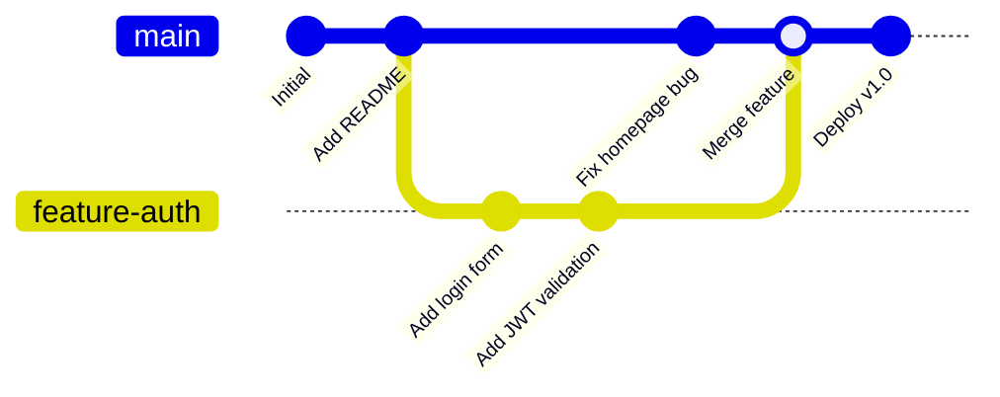

### Core Branching Commands

```bash
# Create a new branch
git branch feature-auth

# Switch to it
git checkout feature-auth
# OR (modern shorthand — create + switch in one step)
git checkout -b feature-auth

# List all branches (* = current)
git branch

# Switch back to main
git checkout main

# Merge feature branch into main
git merge feature-auth

# Delete branch after merging
git branch -d feature-auth
```

| Command | What It Does |
| :--- | :--- |
| `git branch <name>` | Creates a new branch (pointer) at the current commit |
| `git checkout <name>` | Switches HEAD to that branch |
| `git checkout -b <name>` | Creates + switches in one step |
| `git merge <branch>` | Integrates the specified branch into the current branch |
| `git branch -d <name>` | Deletes a branch (safe — only if already merged) |
| `git branch -D <name>` | Force-deletes a branch (even if unmerged) |

### How Merging Works

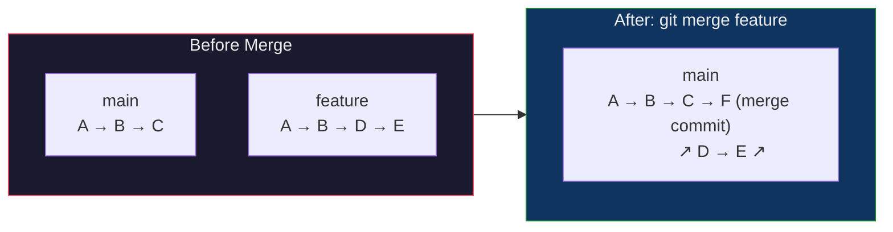

Git performs a **3-way merge** using: (1) the common ancestor, (2) your branch tip, (3) their branch tip. If the same lines weren't changed in both branches, Git merges automatically.

---

## Resolving Merge Conflicts

Conflicts occur when **the same lines** are modified in both branches. Git cannot auto-merge and asks you to resolve manually.

### What a Conflict Looks Like

```text
<<<<<<< HEAD
## Feature: Main Updates
This section is updated in the main branch.
=======
## Feature: Conflict Resolution
This branch demonstrates conflict resolution.
>>>>>>> conflict-branch
```

| Marker | Meaning |
| :--- | :--- |
| `<<<<<<< HEAD` | Start of YOUR changes (current branch) |
| `=======` | Divider between the two versions |
| `>>>>>>> conflict-branch` | End of THEIR changes (incoming branch) |

### Resolution Process

```bash
# 1. Attempt the merge (conflict detected)
git merge conflict-branch
# Output: CONFLICT (content): Merge conflict in README.md

# 2. Open the file, remove conflict markers, keep the correct content

# 3. Stage the resolved file
git add README.md

# 4. Complete the merge
git commit
# Git auto-generates a merge commit message
```

> **Pro tip:** Use `git diff` after resolving to verify your resolution before committing.

---

## Git Stash — Temporary Storage

`git stash` saves your uncommitted changes **without committing** them, giving you a clean working directory. Think of it as putting your half-finished work in a drawer.

### When to Use Stash

- You're mid-feature but need to switch branches to fix an urgent bug
- You want to pull latest changes but have uncommitted work
- You want to test something on a clean working tree

### Commands

```bash
# Save current changes to the stash
git stash

# Verify clean working directory
git status
# Output: nothing to commit, working tree clean

# View stashed items
git stash list
# Output: stash@{0}: WIP on main: abc1234 Last commit message

# Reapply the most recent stash (keeps it in stash list)
git stash apply

# Reapply AND remove from stash list
git stash pop

# Drop a specific stash
git stash drop stash@{0}

# Clear all stashes
git stash clear
```

| Command | Effect |
| :--- | :--- |
| `git stash` | Saves changes, reverts working directory to last commit |
| `git stash apply` | Re-applies changes but keeps the stash entry |
| `git stash pop` | Re-applies changes AND deletes the stash entry |
| `git stash list` | Lists all stashed entries |

---

## Fetch vs Pull

| Command | What It Does | Modifies Working Directory? |
| :--- | :--- | :--- |
| `git fetch` | Downloads new commits from remote into local tracking branches | ❌ No — safe, read-only |
| `git pull` | `git fetch` + `git merge` — downloads AND integrates | ✅ Yes — may cause conflicts |

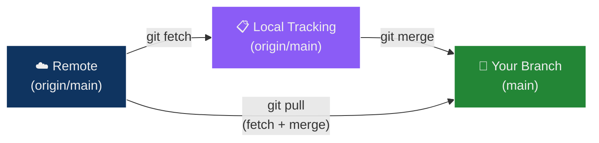

> **Best practice:** Use `git fetch` first to see what changed, then `git merge` manually. This gives you control over when changes are integrated.

---

## Rebase — Linear History

**Rebase** replays your branch's commits on top of another branch, creating a **linear** history instead of a merge commit.

### Merge vs Rebase — Visual Comparison

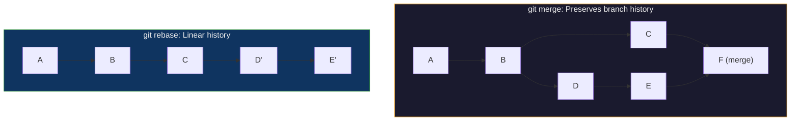

### Commands

```bash
# On your feature branch
git checkout feature-rebase

# Replay your commits on top of main's latest
git rebase main

# If conflicts occur:
# 1. Resolve the conflict in the file
# 2. Stage: git add <file>
# 3. Continue: git rebase --continue
# Or abort: git rebase --abort
```

| Aspect | `git merge` | `git rebase` |
| :--- | :--- | :--- |
| **History** | Non-linear (merge commits) | Linear (clean timeline) |
| **Safety** | Always safe | ⚠️ Rewrites history — never rebase shared branches |
| **Use case** | Integrating feature branches | Cleaning up local commits before pushing |

> **Golden rule:** Never rebase commits that have been pushed to a shared remote. Rebase is for **local cleanup only**.

---

## Submodules — Projects Inside Projects

**Submodules** let you include one Git repository inside another while keeping their histories independent.

### Use Cases

- Shared libraries used across multiple projects
- Third-party dependencies managed as Git repos
- Microservice architectures with shared components

### Commands

```bash
# Add a submodule
git submodule add <library-repo-url>

# Clone a project that contains submodules
git clone <main-repo-url>
git submodule update --init --recursive

# Update submodule to latest remote version
cd <submodule-directory>
git pull origin main
cd ..
git add <submodule-directory>
git commit -m "Update submodule to latest"
```

---

## Tagging — Marking Releases

**Tags** are permanent labels attached to specific commits — typically used for release versions.

```bash
# Create an annotated tag (recommended — includes metadata)
git tag -a v1.0 -m "First stable release"

# Create a lightweight tag (just a pointer)
git tag v1.0-beta

# List all tags
git tag

# Push a specific tag to remote
git push origin v1.0

# Push all tags
git push origin --tags

# Delete a tag locally
git tag -d v1.0

# Delete a tag from remote
git push origin --delete v1.0
```

| Tag Type | Stored As | Includes Metadata? |
| :--- | :--- | :--- |
| **Annotated** (`-a`) | Full Git object | ✅ Tagger name, email, date, message |
| **Lightweight** | Just a pointer to a commit | ❌ No metadata |

> **Convention:** Use [Semantic Versioning](https://semver.org/) — `v1.0.0` (major.minor.patch).

---

## Undoing Changes — The Safety Net

### The Undo Toolkit

| Scenario | Command | Effect |
| :--- | :--- | :--- |
| Unstage a file | `git reset HEAD <file>` | Removes from staging, keeps changes in working directory |
| Undo last commit, keep changes | `git reset HEAD~1` | Moves HEAD back one commit, changes stay staged |
| Undo last commit, discard everything | `git reset --hard HEAD~1` | ⚠️ **Destructive** — erases commit AND changes |
| Create a new commit that reverses a previous one | `git revert <commit-hash>` | Safe — doesn't rewrite history |
| Find and recover "deleted" commits | `git reflog` | Shows ALL HEAD movements, even after reset |

### Reset Modes Explained

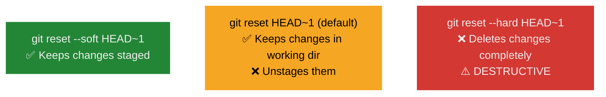

### Recovering "Lost" Commits with Reflog

```bash
# View all HEAD movements (including resets)
git reflog

# Output:
# abc1234 HEAD@{0}: reset: moving to HEAD~1
# def5678 HEAD@{1}: commit: Add authentication  ← the "lost" commit

# Recover it
git reset --hard def5678
```

> `git reflog` is your **last resort** — it records every movement of HEAD, even after destructive operations. Entries expire after 90 days by default.

---

## Git in DevOps — Why It Matters

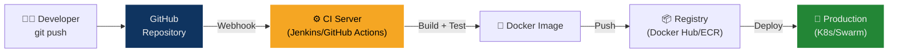

Git is the **trigger** for the entire DevOps pipeline:
- **CI/CD:** Every `git push` triggers automated builds, tests, and deployments
- **Infrastructure as Code:** Terraform, Ansible, and Kubernetes manifests are version-controlled in Git
- **GitOps:** The Git repository is the single source of truth for both code AND infrastructure state
- **Code Review:** Pull Requests (PRs) enable peer review before merging

---

## Glossary

| Term | Definition |
| :--- | :--- |
| **Version Control** | System that records changes to files over time for recall and collaboration |
| **Git** | Distributed Version Control System — the industry standard since 2005 |
| **CVCS** | Centralized VCS — single server holds all history (e.g., SVN) |
| **DVCS** | Distributed VCS — every developer has full history (e.g., Git) |
| **Repository (Repo)** | A directory tracked by Git, containing all files and their complete history |
| **Commit** | A saved snapshot of the staging area with a message, author, and timestamp |
| **Staging Area (Index)** | Intermediate area where changes are prepared before committing |
| **Working Directory** | The actual files on disk that you edit |
| **Branch** | A movable pointer to a commit — enables parallel development |
| **HEAD** | Pointer to the current branch's latest commit — "where you are now" |
| **Merge** | Combining changes from one branch into another (creates a merge commit) |
| **Rebase** | Replaying commits on top of another branch for linear history |
| **Remote** | A hosted copy of the repository (e.g., on GitHub) |
| **Clone** | Creating a full local copy of a remote repository |
| **Fetch** | Downloading new commits from remote without integrating them |
| **Pull** | Fetch + merge — downloads and integrates remote changes |
| **Push** | Uploading local commits to the remote repository |
| **Stash** | Temporarily saving uncommitted changes for later retrieval |
| **Tag** | A permanent label on a specific commit — typically used for release versions |
| **SSH Key** | Cryptographic key pair for passwordless authentication with GitHub |
| **Submodule** | A Git repository nested inside another repository |
| **Reflog** | A log of all HEAD movements — the "undo history" for recovery |
| **Merge Conflict** | Occurs when the same lines are modified in both branches being merged |
| **SCM** | Source Code Management — the discipline that Git implements |

---

## Exam / Interview Prep

### Q1: What is the difference between `git fetch` and `git pull`?

**Answer:** `git fetch` downloads new commits from the remote repository into local tracking branches (e.g., `origin/main`) but does **not** modify your working directory or current branch. It is a safe, read-only operation. `git pull` is equivalent to `git fetch` followed by `git merge` — it downloads AND integrates the remote changes into your current branch, which may cause merge conflicts. Best practice is to use `git fetch` first to review changes, then merge manually.

### Q2: Explain the difference between `git merge` and `git rebase`. When would you use each?

**Answer:** Both integrate changes from one branch into another, but they produce different histories. `git merge` creates a **merge commit** that preserves the full branching history — you can see when a branch was created and merged. `git rebase` **replays** commits on top of another branch, producing a **linear history** with no merge commits. Use `merge` for integrating feature branches into shared branches (safe, preserves context). Use `rebase` for cleaning up local commits before pushing (linear, cleaner log). **Never rebase commits that have already been pushed to a shared remote** — it rewrites history and will break other developers' work.

### Q3: How does Git's snapshot-based storage differ from SVN's delta-based storage, and what are the practical implications?

**Answer:** Git stores a **snapshot** (compressed copy) of every file at each commit. Unchanged files are stored as references to the previous snapshot, not duplicated. SVN stores **deltas** — only the line-by-line differences between consecutive versions. Practical implications: (1) **Speed:** Git can retrieve any version in O(1) by reading a single snapshot; SVN must reconstruct a version by replaying all deltas from the beginning, which is O(n). (2) **Offline capability:** Since Git has all snapshots locally, every operation (log, diff, branch, blame) works offline. SVN requires server access. (3) **Branching:** Git branches are just pointers to snapshots (instant creation); SVN branches are full server-side copies (expensive).

---

## Quick Reference Card

```bash
# ─── Setup ───
git config --global user.name "Name"
git config --global user.email "email"
ssh-keygen -t ed25519 -C "email"

# ─── Repository ───
git init                              # Initialize new repo
git clone <url>                       # Clone remote repo
git remote add origin <url>           # Connect to remote
git remote -v                         # List remotes

# ─── Daily Workflow ───
git status                            # See what's changed
git add <file>                        # Stage specific file
git add .                             # Stage everything
git commit -m "message"               # Commit staged changes
git push                              # Upload to remote
git pull                              # Download + merge

# ─── Branching ───
git branch <name>                     # Create branch
git checkout <name>                   # Switch branch
git checkout -b <name>                # Create + switch
git merge <branch>                    # Merge into current
git branch -d <name>                  # Delete merged branch

# ─── Inspection ───
git log --oneline --graph             # Visual commit history
git diff                              # Unstaged changes
git diff --staged                     # Staged changes
git blame <file>                      # Who changed each line

# ─── Undo ───
git stash                             # Save work temporarily
git stash pop                         # Restore stashed work
git reset HEAD~1                      # Undo last commit (keep changes)
git reset --hard HEAD~1               # Undo last commit (discard all)
git revert <hash>                     # Reverse a commit safely
git reflog                            # Find "lost" commits

# ─── Tags ───
git tag -a v1.0 -m "Release 1.0"     # Create annotated tag
git push origin v1.0                  # Push tag to remote
```
