## The Film Editing Room Analogy

Before diving into version control, consider how a **professional film editing studio** operates:

| Film Editing Studio | Version Control System |
| :--- | :--- |
| The director shoots scenes — 50 takes of the same dialogue, from 3 camera angles | A developer writes code — multiple iterations, experiments, and rewrites |
| Every take is labeled with a **slate** (scene number, take number, date, time) | Every change is recorded as a **commit** (message, author, timestamp, unique hash) |
| All footage is stored in a **vault** — organized chronologically, never overwritten | All code history is stored in a **repository** — every version preserved forever |
| The editor can go back to Take 3 and use it instead of Take 12 | A developer can **revert** to any previous commit instantly |
| Three editors work on different scenes simultaneously — action, dialogue, music | Three developers work on different **branches** simultaneously — auth, payments, UI |
| Editors combine their work into a **final cut** | Developers **merge** their branches into `main` |
| The assistant editor's logbook records who edited what, when, and why | `git log` records who committed what, when, and why |
| If the edit room burns down, the **off-site backup vault** has full copies | If a laptop is lost, the **remote repository** (GitHub) has a complete clone |
| **Old system:** One editing machine — only one editor can work at a time (Centralized) | **SVN (CVCS):** One central server — developers depend on it for every operation |
| **Modern system:** Each editor has a full copy of all footage on their workstation (Distributed) | **Git (DVCS):** Each developer has a full copy of the entire history locally |

> **Key insight:** Version control is not just "saving files." It's a **time machine** for your entire project — you can replay, rewind, branch, and merge the complete history of every file, at any point in time, with full accountability for every change.

---

## The Problem: Life Without Version Control

### The "Final_v2_REALLY_FINAL" Problem

Without version control, developers resort to manual file management:

```text
project/
├── main.py
├── main_v2.py
├── main_v2_fixed.py
├── main_v2_fixed_FINAL.py
├── main_v2_fixed_FINAL_actually_final.py
├── main_backup_jan15.py
└── main_DO_NOT_DELETE.py           ← Nobody knows which is current
```

This approach fails catastrophically as projects scale:

| Problem | What Happens | Real-World Consequence |
| :--- | :--- | :--- |
| **No reproducibility** | "Which version did we ship to the client last Tuesday?" — nobody knows | Cannot reproduce bugs or roll back to a working version |
| **Collaboration chaos** | Two developers edit the same file, email it back and forth, overwrite each other's changes | Lost work, duplicated effort, broken code |
| **No accountability** | "Who deleted the authentication module?" — no record | Impossible to audit changes or assign responsibility |
| **No rollback** | Accidental deletion or a bad refactor — changes are permanent | Hours of work lost; must rewrite from memory |
| **No experimentation** | Trying a risky change means copying the entire folder "just in case" | Developers avoid innovation out of fear of breaking things |
| **No branching** | Cannot work on a new feature while fixing a bug in the current version | Releases are delayed; everything is sequential |

### The Solution: Version Control Systems

A **Version Control System (VCS)** is software that tracks every change to every file over time, enabling teams to collaborate, experiment safely, and maintain a complete audit trail of their project's history.

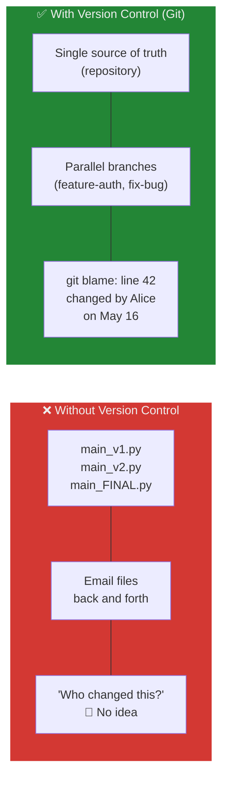

---

## What Does Version Control Do?

Version control addresses five fundamental challenges in software development:

### 1. Collaboration — Multiple Developers, One Codebase

**Problem:** In team environments, 5-10 developers work on the same project simultaneously. Without coordination, changes collide and overwrite each other.

**Solution:** VCS enables **branching** — each developer works on an isolated copy of the code. Changes are **merged** back together systematically, with automatic conflict detection when two developers modify the same lines.

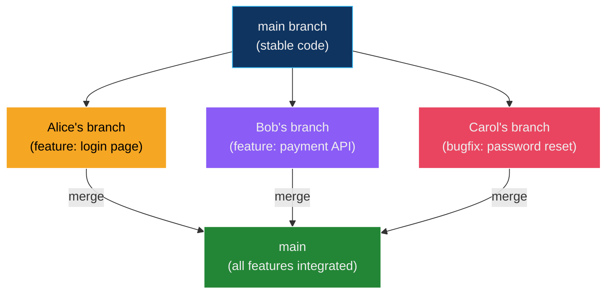

### 2. History Tracking — A Complete Audit Trail

**Problem:** Understanding *why* a change was made, or *when* a bug was introduced, is impossible without records.

**Solution:** VCS maintains a timestamped log of every change, including:
- **Who** made the change (author identity)
- **When** they made it (timestamp)
- **What** they changed (file diffs — line-by-line additions and deletions)
- **Why** they changed it (commit message explaining the rationale)

```bash
# Example git log output
commit a1b2c3d (HEAD -> main)
Author: Alice <alice@example.com>
Date:   Mon May 26 10:30:00 2026 +0530

    Fix: Prevent SQL injection in login query

    The user input was being concatenated directly into the SQL string.
    Switched to parameterized queries using prepared statements.
    Resolves #142.
```

### 3. Rollback and Recovery — The Safety Net

**Problem:** A developer deploys a broken feature to production. Without version history, there's no way to undo the damage without manually rewriting code.

**Solution:** VCS allows **instant rollback** to any previous version:

```bash
# Revert to the last known good commit
git revert HEAD

# Or reset the entire branch to a specific point
git reset --hard abc1234
```

| Scenario | VCS Command | Effect |
| :--- | :--- | :--- |
| Bad commit deployed | `git revert <hash>` | Creates a new commit that undoes the bad one (safe) |
| Last 3 commits were all bad | `git reset --hard HEAD~3` | Removes the last 3 commits entirely (destructive) |
| Accidentally deleted a file | `git checkout HEAD -- <file>` | Restores the file from the last commit |
| Need to see the code from 6 months ago | `git checkout <old-hash>` | Temporarily view the entire project at that point in time |

### 4. Accountability and Transparency

**Problem:** In a team of 20 developers, a critical security vulnerability is discovered. Who introduced it? When? Why?

**Solution:** Every change is cryptographically linked to an author. Git provides tools to trace any line of code back to its origin:

```bash
# Who last modified each line of a file?
git blame server.py

# Output:
# a1b2c3d (Alice  2026-05-20 10:30)  def login(user, password):
# d4e5f6g (Bob    2026-05-22 14:15)      query = f"SELECT * FROM users WHERE name='{user}'"  ← Bug!
# h7i8j9k (Carol  2026-05-24 09:00)      # TODO: Fix SQL injection
```

### 5. Integration with DevOps Practices

VCS is the **backbone** of modern DevOps. Every CI/CD pipeline starts with a version control event:

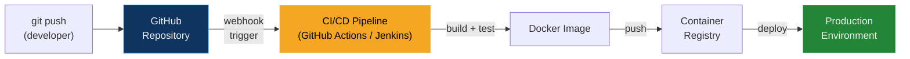

| DevOps Practice | How VCS Enables It |
| :--- | :--- |
| **Continuous Integration (CI)** | Every `git push` triggers automated builds and tests |
| **Continuous Deployment (CD)** | Merging to `main` automatically deploys to production |
| **Infrastructure as Code (IaC)** | Terraform, Ansible, and Kubernetes manifests are version-controlled in Git |
| **GitOps** | The Git repo is the *single source of truth* for both application code AND infrastructure state |
| **Code Review** | Pull Requests enable peer review before any change is merged |
| **Audit Compliance** | Git history provides a complete, tamper-evident audit trail for SOC2, HIPAA, etc. |

---

## Evolution of Version Control — From Local to Distributed

Version control didn't start with Git. Understanding the evolution helps you appreciate *why* Git is designed the way it is.

### Generation 1: Local Version Control (1970s–1980s)

The earliest systems tracked changes on a **single machine** with no sharing.

| System | Year | Mechanism |
| :--- | :--- | :--- |
| **SCCS** (Source Code Control System) | 1972 | Stored deltas (diffs) in a local file |
| **RCS** (Revision Control System) | 1982 | Improved SCCS — reverse deltas, faster retrieval |

**Limitations:** Single user only. No collaboration. If the machine died, everything was lost.

### Generation 2: Centralized Version Control — CVCS (1990s–2000s)

Centralized systems introduced **multi-user collaboration** through a single shared server.

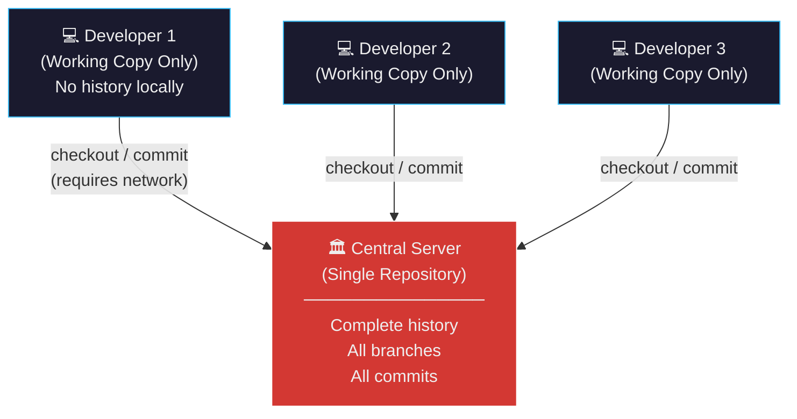

#### CVS — Concurrent Versions System (1990)

| Feature | Details |
| :--- | :--- |
| **Year** | 1990 |
| **Model** | Centralized |
| **Key contribution** | First widely-adopted multi-user VCS; introduced concurrent editing |
| **Limitations** | No atomic commits (partial commits possible on failure), poor binary file handling, renaming files lost history |

#### SVN — Apache Subversion (2000)

| Feature | Details |
| :--- | :--- |
| **Year** | 2000 (by CollabNet) |
| **Model** | Centralized (CVCS) |
| **Objective** | Fix CVS's limitations — especially atomic commits and directory versioning |
| **Key features** | Atomic commits (all-or-nothing), directory versioning (can track renames), binary file support, HTTP-based access (WebDAV) |
| **Architecture** | Single central repository; developers have only a "working copy" (no local history) |

**SVN's Limitations:**

| Problem | Impact |
| :--- | :--- |
| **Single point of failure** | If the central server dies and backups fail, all history is lost |
| **Network dependency** | Cannot commit, view log, diff, or branch without connecting to the server |
| **Slow operations** | Every operation (commit, log, blame, diff) requires a server round-trip |
| **Heavy branching** | Branches are full server-side directory copies — expensive and slow |
| **Merging pain** | SVN's merge tracking was primitive; merges were error-prone and often required manual intervention |

### Generation 3: Distributed Version Control — DVCS (2005–Present)

Distributed systems gave **every developer a complete copy** of the entire repository, including all history.

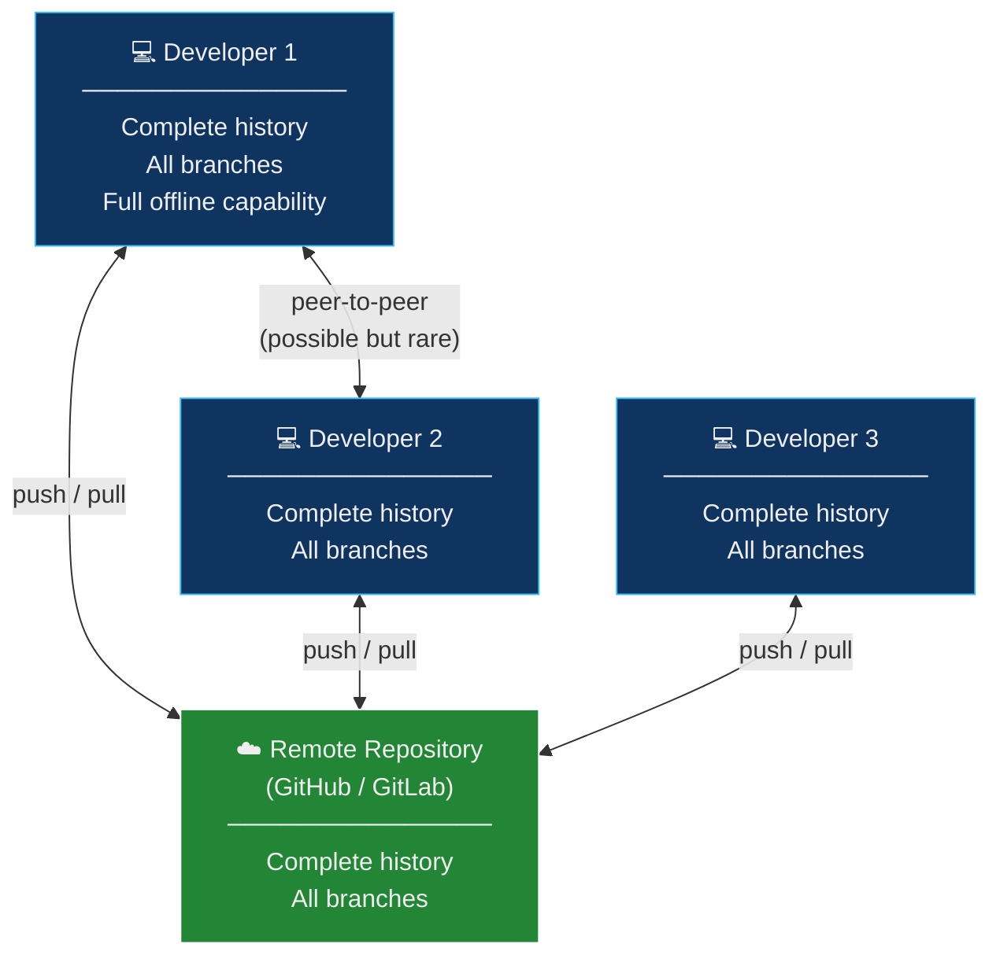

#### Git (2005)

| Feature | Details |
| :--- | :--- |
| **Year** | 2005 |
| **Creator** | Linus Torvalds (also created Linux) |
| **Motivation** | The Linux kernel needed a new VCS after the proprietary BitKeeper revoked its free license |
| **Design goals** | Speed, data integrity, support for massive distributed workflows |
| **License** | Open-source (GPLv2) |
| **Storage model** | **Snapshot-based** — each commit stores a complete snapshot of every file (unchanged files stored as references) |
| **Branching** | Branches are lightweight pointers — creation is instant (O(1)) |

**Git's Timeline and Growth:**

| Year | Milestone |
| :--- | :--- |
| 2005 | Linus Torvalds creates Git for Linux kernel development |
| 2005 | Junio Hamano takes over as Git maintainer |
| 2008 | **GitHub** founded — provides an intuitive web platform for hosting Git repositories |
| 2011 | **GitLab** launched — open-source alternative to GitHub |
| 2014 | Microsoft starts using Git internally (world's largest Git repository: Windows) |
| 2018 | **Microsoft acquires GitHub** for $7.5 billion |
| 2020 | GitHub renames default branch from `master` to `main` |
| 2024 | Git used by **95%+** of developers worldwide (Stack Overflow Survey) |

---

## SVN vs Git — Detailed Comparison

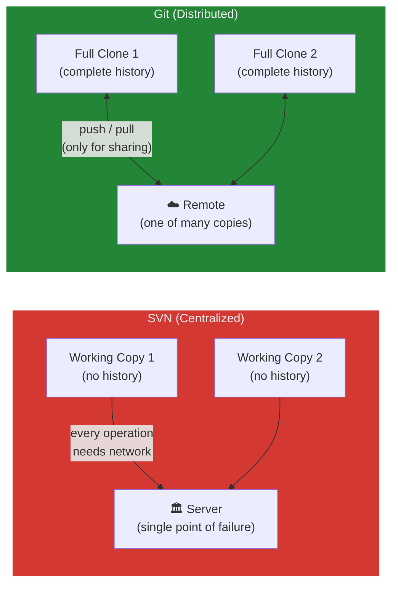

| Feature | SVN (Centralized) | Git (Distributed) |
| :--- | :--- | :--- |
| **Architecture** | Single central server; clients have working copies only | Every clone is a full repository with complete history |
| **Offline capability** | ❌ Cannot commit, log, diff, or branch without network | ✅ All operations work offline — network only for push/pull |
| **Speed** | Slower — every operation is a server round-trip | Faster — nearly all operations are local |
| **Branching** | Heavy — branches are full directory copies on the server | Lightweight — branches are just 41-byte pointer files |
| **Merging** | Primitive merge tracking; error-prone | Sophisticated 3-way merge algorithm; mostly automatic |
| **Failure resilience** | ❌ Server death = potential total loss | ✅ Every clone is a complete backup |
| **Storage model** | **Delta-based** — stores differences between versions | **Snapshot-based** — stores complete file snapshots (with deduplication) |
| **Data integrity** | Basic checksums | SHA-1 hashing — every object is content-addressed and tamper-evident |
| **Learning curve** | Simpler (fewer concepts) | Steeper (staging area, rebasing, reflogs) but more powerful |
| **Industry adoption** | Declining — used in legacy enterprise systems | Dominant — 95%+ of new projects |
| **CI/CD integration** | Limited | Native — Jenkins, GitHub Actions, GitLab CI are Git-first |

### Snapshot vs Delta Storage — Why It Matters

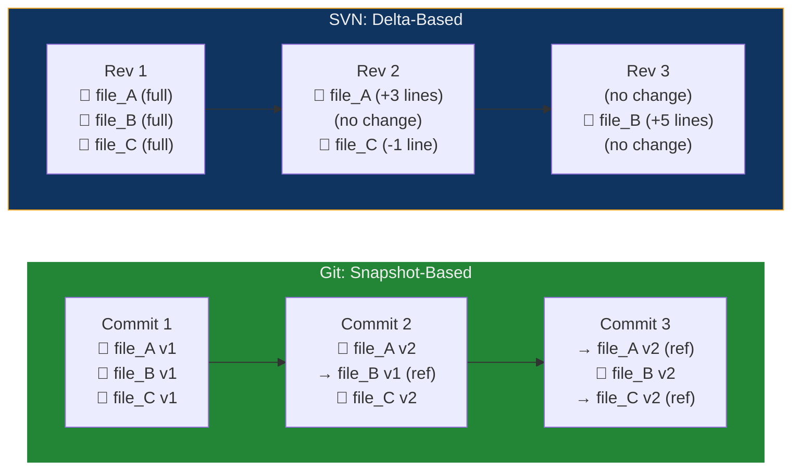

| Aspect | Git (Snapshots) | SVN (Deltas) |
| :--- | :--- | :--- |
| **What's stored per version** | Complete snapshot of every file; unchanged files stored as references (pointers) to the previous version | Only the line-by-line differences (diffs) between consecutive versions |
| **Retrieving version N** | **O(1)** — read the snapshot directly | **O(N)** — replay all deltas from revision 1 to N |
| **Space efficiency** | Highly efficient — Git uses compression (zlib) and packfiles to deduplicate content | Efficient — stores only changes |
| **Practical impact** | Checking out any commit is instant, regardless of history depth | Retrieving old versions slows down as history grows |

> **Why snapshots win:** In Git, switching to a commit from 3 years ago is as fast as switching to the latest. In SVN, reconstructing an old revision requires replaying thousands of deltas.

---

## Installing Git — Platform-by-Platform Guide

### Linux

Git is available through every major Linux package manager:

```bash
# ─── Debian / Ubuntu ─────────────────────────────────
sudo apt update
sudo apt install git

# ─── Fedora ──────────────────────────────────────────
sudo dnf install git

# ─── CentOS / RHEL ──────────────────────────────────
sudo yum install git

# ─── Arch Linux ──────────────────────────────────────
sudo pacman -S git

# ─── Nix ─────────────────────────────────────────────
nix-env -iA nixpkgs.git
```

### macOS

```bash
# ─── Option A: Homebrew (Recommended) ───────────────
brew install git

# ─── Option B: Xcode Command Line Tools ─────────────
xcode-select --install
# Git is included in the tools that are installed

# ─── Option C: From Source ───────────────────────────
# Download from https://git-scm.com/
tar -zxf git-x.y.z.tar.gz
cd git-x.y.z
make prefix=/usr/local all
sudo make prefix=/usr/local install
```

### Windows

Windows lacks a native Unix-like shell environment that Git requires. **Git for Windows** (`git-scm`) bridges this gap.

#### Why `git-scm` Is Required on Windows

| What `git-scm` Provides | Why It's Needed |
| :--- | :--- |
| **Git binaries** | The core `git` commands — `git commit`, `git push`, etc. |
| **Git Bash** | A Unix-like Bash shell (`MINGW64`) that supports commands like `ls`, `cd`, `grep`, `ssh` — essential for Git's workflows |
| **Git GUI** | A graphical interface for staging, committing, and viewing history |
| **Credential Manager** | Securely stores GitHub/GitLab passwords and tokens |
| **Line-ending handling** | Converts between Windows (`CRLF`) and Unix (`LF`) line endings automatically |

```bash
# ─── Option A: Download Installer ────────────────────
# Download from https://git-scm.com/
# Run the installer with these recommended settings:
#   - Components: Git Bash, Git GUI, Shell integration
#   - Line endings: "Checkout as-is, commit Unix-style" (recommended for cross-platform)
#   - Terminal: Use MinTTY (Git Bash default terminal)

# ─── Option B: Chocolatey Package Manager ───────────
choco install git

# ─── Option C: winget (Windows Package Manager) ─────
winget install Git.Git
```

#### Windows Line Ending Configuration

Windows uses `CRLF` (Carriage Return + Line Feed) while Linux/macOS use `LF` (Line Feed only). This causes phantom diffs in cross-platform teams.

```bash
# Recommended: checkout as-is, commit as LF (Unix-style)
git config --global core.autocrlf input     # macOS/Linux
git config --global core.autocrlf true      # Windows
```

| Setting | On Checkout | On Commit | Best For |
| :--- | :--- | :--- | :--- |
| `true` | Converts LF → CRLF | Converts CRLF → LF | Windows users in cross-platform teams |
| `input` | No conversion | Converts CRLF → LF | macOS/Linux users |
| `false` | No conversion | No conversion | Single-platform projects |

### Verify Installation (All Platforms)

```bash
git --version
# Output: git version 2.44.0 (or similar)
```

---

## Post-Installation Setup — Configuring Git Identity

Git requires a **name** and **email** to be set before you can commit. These are embedded in every commit you make.

### Set Your Identity

```bash
git config --global user.name "Your Name"
git config --global user.email "your-email@example.com"
```

### Configuration Scopes

Git configuration operates at three levels, each overriding the one above:

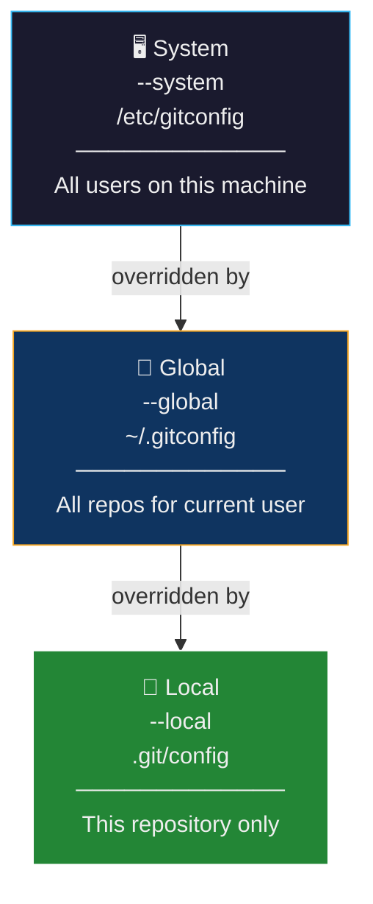

| Scope | Flag | File Location | Use Case |
| :--- | :--- | :--- | :--- |
| **System** | `--system` | `/etc/gitconfig` | Enterprise-wide defaults (rarely used) |
| **Global** | `--global` | `~/.gitconfig` | ✅ Your personal defaults — name, email, editor |
| **Local** | `--local` | `.git/config` (per repo) | Override for specific repos (e.g., work email vs personal email) |

### Useful Global Configuration

```bash
# Set your identity
git config --global user.name "Your Name"
git config --global user.email "your-email@example.com"

# Set default editor (for commit messages)
git config --global core.editor "code --wait"        # VS Code
git config --global core.editor "vim"                 # Vim
git config --global core.editor "nano"                # Nano

# Set default branch name (main instead of master)
git config --global init.defaultBranch main

# Enable colored output
git config --global color.ui auto

# Set default merge strategy for pull
git config --global pull.rebase false                # merge (default)
git config --global pull.rebase true                 # rebase (cleaner history)

# View all configuration
git config --list
git config --list --show-origin                      # Shows which file each setting comes from
```

### Test Your Setup

```bash
# Create a test repository
mkdir git-test && cd git-test
git init

# Create a file, stage, and commit
echo "Hello, Git!" > README.md
git add README.md
git commit -m "Initial commit"

# View the commit log
git log
```

Expected output:

```text
commit a1b2c3d4e5f6... (HEAD -> main)
Author: Your Name <your-email@example.com>
Date:   Mon May 26 22:00:00 2026 +0530

    Initial commit
```

---

## SSH Key Setup — Passwordless GitHub Authentication

SSH keys allow you to authenticate with GitHub without entering your password for every `push` and `pull`. They use **public-key cryptography** — a mathematically linked key pair where the private key stays on your machine and the public key goes to GitHub.

### Step 1: Generate an SSH Key

```bash
ssh-keygen -t ed25519 -C "your-email@example.com"
```

| Flag | Purpose |
| :--- | :--- |
| `-t ed25519` | Key type — Ed25519 is the modern, fast, and secure algorithm (preferred over RSA) |
| `-C "email"` | Comment — a label to identify which key belongs to whom |

Press **Enter** to accept the default file location (`~/.ssh/id_ed25519`). Optionally set a passphrase for additional security.

This creates two files:

| File | Type | Purpose |
| :--- | :--- | :--- |
| `~/.ssh/id_ed25519` | **Private key** 🔒 | Stays on your machine — **never share this** |
| `~/.ssh/id_ed25519.pub` | **Public key** 🔓 | Upload to GitHub — safe to share |

### Step 2: Start the SSH Agent and Add Your Key

```bash
eval "$(ssh-agent -s)"         # Start the SSH agent
ssh-add ~/.ssh/id_ed25519      # Register your private key
```

### Step 3: Add the Public Key to GitHub

```bash
cat ~/.ssh/id_ed25519.pub      # Display the public key — copy the output
```

Then navigate to [GitHub → Settings → SSH and GPG Keys](https://github.com/settings/keys) → **New SSH Key** → paste the public key → **Add SSH Key**.

### Step 4: Test the Connection

```bash
ssh -T git@github.com
```

Expected:
```text
Hi username! You've successfully authenticated, but GitHub does not provide shell access.
```

### Authentication vs Signing Keys

GitHub distinguishes between two uses of SSH keys:

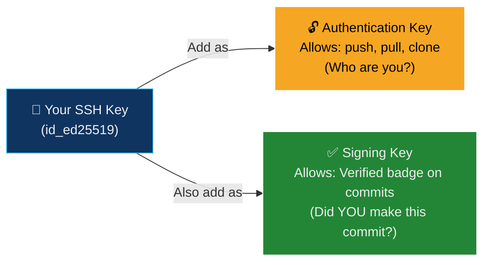

| Key Type | Purpose | Where to Add in GitHub |
| :--- | :--- | :--- |
| **Authentication key** | Proves your identity for `push`/`pull`/`clone` | Settings → SSH Keys → Authentication Keys |
| **Signing key** | Proves authorship of commits (✅ Verified badge) | Settings → SSH Keys → Signing Keys |

> **Important:** Even if it's the **same key**, you must add it to GitHub in **both** places. Adding it only as an Authentication Key will NOT verify your commits.

Configure Git to sign all commits:

```bash
git config --global gpg.format ssh
git config --global user.signingkey ~/.ssh/id_ed25519.pub
git config --global commit.gpgsign true
```

---

## Types of Version Control Systems — Architecture Comparison

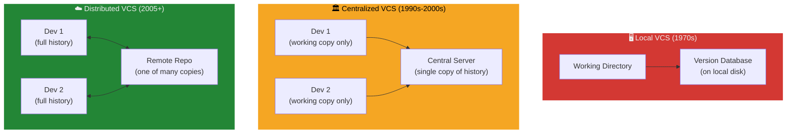

| Feature | Local VCS | Centralized VCS (SVN) | Distributed VCS (Git) |
| :--- | :--- | :--- | :--- |
| **Era** | 1970s–1980s | 1990s–2000s | 2005–Present |
| **Examples** | RCS, SCCS | CVS, SVN, Perforce | Git, Mercurial |
| **Architecture** | Single machine | Client-server | Peer-to-peer with optional central hub |
| **History location** | Local disk only | Central server only | Every developer has full history |
| **Collaboration** | ❌ Single user only | ✅ Multi-user (server-dependent) | ✅ Multi-user (fully independent) |
| **Offline work** | ✅ (single machine) | ❌ Needs network for every operation | ✅ All operations work offline |
| **Failure resilience** | ❌ Disk failure = total loss | ❌ Server failure = potential total loss | ✅ Every clone is a full backup |
| **Branching cost** | N/A | Heavy (server-side copies) | Lightweight (41-byte pointers) |
| **Speed** | Fast (local) | Slow (network round-trips) | Very fast (local operations) |

---

## Why Git Won — The Decisive Advantages

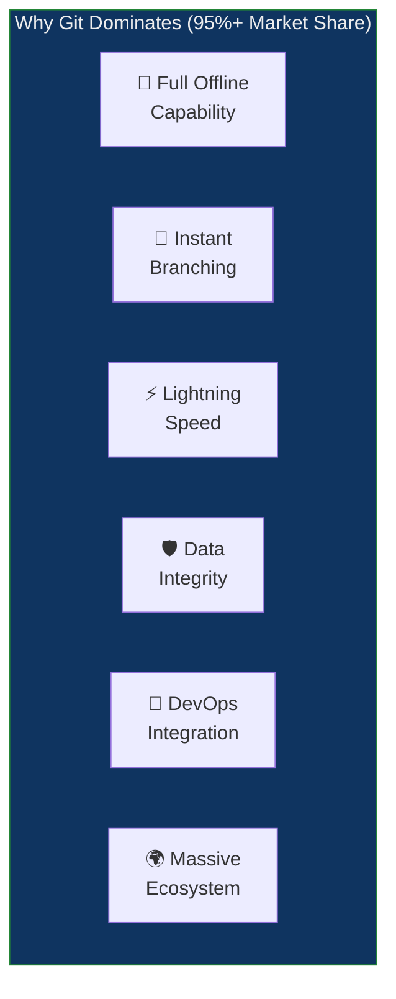

| Advantage | Explanation |
| :--- | :--- |
| **No central dependency** | Every operation (commit, branch, merge, log, diff, blame) works without internet |
| **Instant branching** | Branches are pointers (41 bytes) — create hundreds with zero overhead |
| **Smart merging** | Git's 3-way merge algorithm handles most conflicts automatically |
| **Data integrity** | Every object is SHA-1 hashed — corruption or tampering is detected immediately |
| **Performance** | Written in C, optimized for speed — handles repositories with millions of files |
| **DevOps integration** | Every CI/CD tool (Jenkins, GitHub Actions, GitLab CI, CircleCI) is Git-native |
| **Community & ecosystem** | GitHub (100M+ developers), GitLab, Bitbucket, thousands of GUI clients |
| **Flexibility** | Supports centralized, feature-branch, fork-based, and GitOps workflows |

---

## Troubleshooting Common Setup Issues

| Problem | Cause | Fix |
| :--- | :--- | :--- |
| `git: command not found` | Git not installed or not on PATH | Reinstall Git; on Windows, ensure "Add to PATH" was checked during installation |
| `Author identity unknown` | Name/email not configured | Run `git config --global user.name "Name"` and `user.email` |
| `Permission denied (publickey)` | SSH key not added to GitHub or SSH agent | Run `ssh-add ~/.ssh/id_ed25519`; verify key is in GitHub settings |
| `fatal: remote origin already exists` | Trying to add a remote that's already configured | Remove first: `git remote remove origin`, then re-add |
| `CRLF will be replaced by LF` | Line-ending mismatch between Windows and Linux | Set `git config --global core.autocrlf true` on Windows |
| `ssh: Could not resolve hostname` | DNS or network issue; wrong hostname | Verify with `ssh -T git@github.com`; check internet connection |
| Commits not showing as "Verified" on GitHub | SSH key added as Authentication only, not Signing | Add the same key as a **Signing Key** in GitHub settings |
| `git log` shows wrong author | Local config overriding global config | Check `git config --list --show-origin` to find the conflicting entry |

---

## Glossary

| Term | Definition |
| :--- | :--- |
| **Version Control System (VCS)** | Software that tracks every change to every file over time, enabling collaboration, history tracking, and rollback |
| **Source Code Management (SCM)** | The discipline/practice of managing changes to source code — Git is a tool that implements SCM |
| **Repository (Repo)** | A directory tracked by a VCS, containing all files and their complete change history |
| **Commit** | A saved snapshot of the project at a point in time, with an author, timestamp, message, and unique hash |
| **Branch** | A movable pointer to a commit — enables isolated, parallel development |
| **Merge** | Combining changes from one branch into another, creating a merge commit |
| **Conflict** | Occurs when two branches modify the same lines of the same file — requires manual resolution |
| **Clone** | Creating a full local copy of a remote repository, including all history |
| **Staging Area (Index)** | An intermediate area in Git where changes are prepared before committing — allows selective commits |
| **Working Directory** | The actual files on disk that you see and edit |
| **HEAD** | A pointer to the current branch's latest commit — "where you are now" in the history |
| **Remote** | A hosted copy of the repository (e.g., on GitHub, GitLab, Bitbucket) used for sharing |
| **Push** | Uploading local commits to a remote repository |
| **Pull** | Downloading remote commits and merging them into the current branch (`fetch` + `merge`) |
| **Fetch** | Downloading remote commits without merging — a safe, read-only preview |
| **CVCS** | Centralized Version Control System — single server holds all history (SVN, CVS) |
| **DVCS** | Distributed Version Control System — every developer has the full history (Git, Mercurial) |
| **SVN (Subversion)** | A centralized VCS from 2000 that improved on CVS with atomic commits and directory versioning |
| **Git** | A distributed VCS created by Linus Torvalds in 2005 — the industry standard |
| **GitHub** | A web platform (founded 2008, acquired by Microsoft 2018) for hosting Git repositories with collaboration features |
| **Delta** | A storage method that records only the differences between consecutive file versions (used by SVN) |
| **Snapshot** | A storage method that records the complete state of every file at each commit (used by Git) |
| **SSH Key** | A cryptographic key pair (public + private) for passwordless authentication with services like GitHub |
| **Ed25519** | A modern, fast, and secure SSH key algorithm — preferred over older RSA keys |
| **Authentication Key** | An SSH key that proves your identity for push/pull/clone operations |
| **Signing Key** | An SSH key that proves authorship of commits — produces the ✅ "Verified" badge on GitHub |
| **Git Bash** | A Unix-like shell environment bundled with Git for Windows, providing Bash commands on Windows |
| **Line Ending** | The invisible character(s) at the end of each line — `CRLF` on Windows, `LF` on Linux/macOS |
| **`git-scm`** | Git for Windows installer — provides Git binaries, Git Bash, and Git GUI for the Windows platform |
| **`git config`** | Command to set Git configuration options at system, global, or local scope |
| **`git blame`** | Command that shows who last modified each line of a file and when |
| **`git log`** | Command that displays the commit history with messages, authors, and timestamps |
| **Atomic Commit** | A commit that is all-or-nothing — either all changes are recorded, or none are (prevents partial saves on failure) |
| **SHA-1** | The cryptographic hash algorithm Git uses to uniquely identify every object (commit, tree, blob) |

---

## Quick Reference Card

```bash
# ─── Installation ──────────────────────────────────────────
sudo apt install git                          # Debian/Ubuntu
brew install git                               # macOS
choco install git                              # Windows
git --version                                  # Verify

# ─── Identity Setup ───────────────────────────────────────
git config --global user.name "Your Name"
git config --global user.email "you@example.com"
git config --global init.defaultBranch main
git config --global core.editor "code --wait"
git config --list --show-origin                # View all settings

# ─── SSH Setup ─────────────────────────────────────────────
ssh-keygen -t ed25519 -C "you@example.com"     # Generate key pair
eval "$(ssh-agent -s)"                         # Start SSH agent
ssh-add ~/.ssh/id_ed25519                      # Register key
cat ~/.ssh/id_ed25519.pub                      # Copy → GitHub Settings
ssh -T git@github.com                          # Test connection

# ─── Commit Signing ───────────────────────────────────────
git config --global gpg.format ssh
git config --global user.signingkey ~/.ssh/id_ed25519.pub
git config --global commit.gpgsign true

# ─── First Repository ─────────────────────────────────────
mkdir my-project && cd my-project
git init
echo "# My Project" > README.md
git add README.md
git commit -m "Initial commit"
git remote add origin git@github.com:user/repo.git
git push -u origin main
```

---

## Exam / Interview Prep

### Q1: What is a Version Control System, and why is it essential in a DevOps workflow? Explain with specific examples of problems it solves.

**Answer:** A **Version Control System (VCS)** is software that records every change to every file over time, maintaining a complete history with author attribution, timestamps, and descriptive messages. It is essential in DevOps for five reasons:

1. **Collaboration:** Multiple developers work on the same codebase simultaneously using **branches**. Alice builds a login feature on `feature-auth` while Bob fixes a bug on `fix-payment`. They merge their branches into `main` without overwriting each other's work — conflicts on the same lines are detected and resolved explicitly.

2. **History and Audit Trail:** Every change is recorded as a **commit** with who, when, what, and why. `git log` shows the entire timeline; `git blame` pinpoints who changed each line. This is critical for compliance (SOC2, HIPAA) and debugging ("this bug was introduced in commit `abc123` on May 15th by Bob").

3. **Rollback:** When a deployment breaks production, the team can instantly revert: `git revert HEAD` creates a new commit that undoes the damage. No rewriting code from memory.

4. **CI/CD Trigger:** Every `git push` triggers the CI/CD pipeline automatically — build, test, deploy. Without VCS, there's no automated way to detect code changes and trigger pipelines.

5. **Infrastructure as Code:** Terraform files, Ansible playbooks, Kubernetes manifests, and Dockerfiles are all version-controlled in Git, applying the same collaboration, review, and rollback capabilities to infrastructure that developers expect for application code.

---

### Q2: Compare Centralized (CVCS) and Distributed (DVCS) version control systems. Why did Git's distributed model replace SVN's centralized model in most organizations?

**Answer:** In a **Centralized VCS** (SVN), a single central server stores the entire repository history. Developers have only a "working copy" — the latest version of files without history. Every operation (commit, log, diff, branch, blame) requires a network connection to the central server. If the server goes down, no one can work. If the server's disk fails without backups, all history is lost.

In a **Distributed VCS** (Git), every developer **clones** the entire repository including all history. Operations like commit, branch, log, diff, and blame run **locally** with no network required. The remote (GitHub) serves only as a sharing hub — it's one of many full copies, not the sole copy.

Git replaced SVN for four decisive reasons: (1) **Offline capability** — developers can commit, branch, and review history on airplanes, in cafes, or during server outages. (2) **Speed** — local operations are orders of magnitude faster than SVN's server round-trips. (3) **Lightweight branching** — Git branches are 41-byte pointers created in milliseconds; SVN branches are full directory copies that take seconds to minutes. This made feature branching (the modern standard) impractical in SVN but trivial in Git. (4) **Resilience** — every clone is a full backup, eliminating the single point of failure. Additionally, GitHub's launch in 2008 provided a user-friendly collaboration platform that accelerated Git adoption beyond technical users to entire organizations.

---

### Q3: Explain Git's snapshot-based storage model versus SVN's delta-based model. What are the performance implications of each approach?

**Answer:** **SVN uses delta storage:** it stores the initial version of each file in full, then records only the line-by-line *differences* (deltas) between consecutive versions. To reconstruct version N, SVN must start from version 1 and sequentially apply all N-1 deltas — making retrieval O(N), progressively slower as history grows.

**Git uses snapshot storage:** at each commit, Git captures a complete *snapshot* of every file in the project. However, this doesn't mean duplicating unchanged files — Git stores unchanged files as **references** (pointers) to the previous snapshot's version, making storage efficient despite storing "full snapshots." Internally, Git further optimizes with **packfiles** that use delta compression for network transfer and long-term storage.

**Performance implications:**
- **Checkout speed:** In Git, checking out any commit (even one from 5 years ago) reads a single snapshot — O(1). In SVN, reconstructing an old revision requires replaying thousands of deltas.
- **Branching:** Git branches are just pointer files (41 bytes). SVN branches are full directory copies on the server. Creating a Git branch: milliseconds. Creating an SVN branch: seconds to minutes.
- **Diff operations:** In Git, diffing any two commits compares two snapshots directly. In SVN, computing a diff across many revisions requires reading all intermediate deltas.
- **Storage:** Despite storing snapshots, Git's compression and deduplication make it competitive with — and often smaller than — SVN's delta storage for the same repository.

The snapshot model is the fundamental architectural decision that gives Git its speed, cheap branching, and offline capability — the three features that drove its industry dominance.

---

## Further Reading

- [Git Official Documentation](https://git-scm.com/doc)
- [Pro Git Book (Free)](https://git-scm.com/book/en/v2) — the definitive Git reference
- [GitHub SSH Key Documentation](https://docs.github.com/en/authentication/connecting-to-github-with-ssh)
- [Atlassian Git Tutorials](https://www.atlassian.com/git/tutorials)
- [Git Internals — How Git Works](https://git-scm.com/book/en/v2/Git-Internals-Plumbing-and-Porcelain)
- [A Visual Git Reference](https://marklodato.github.io/visual-git-guide/index-en.html)
- [Stack Overflow Developer Survey — VCS Usage](https://survey.stackoverflow.co/)
