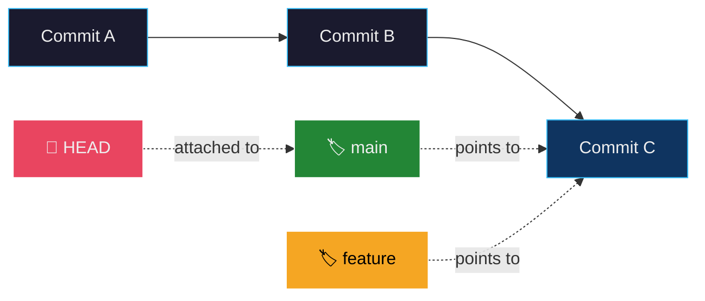
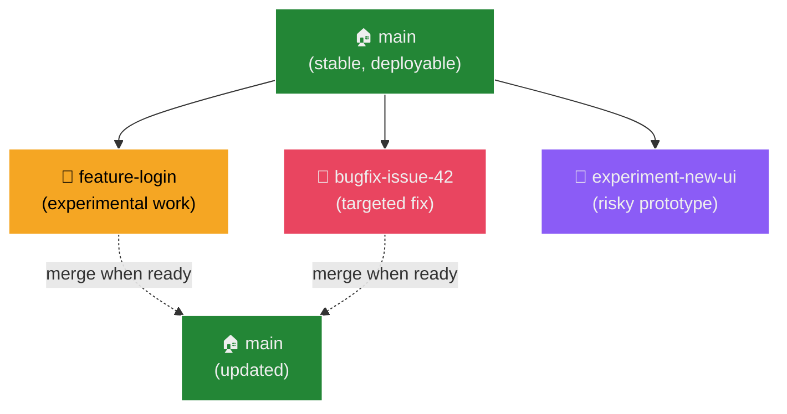
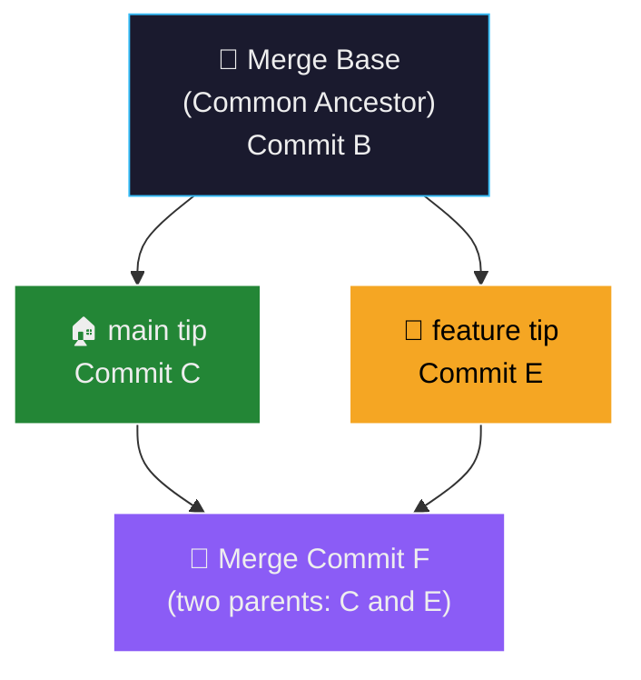
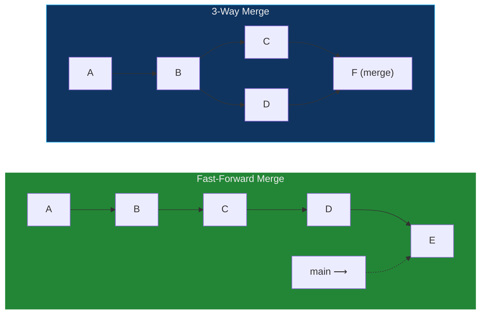
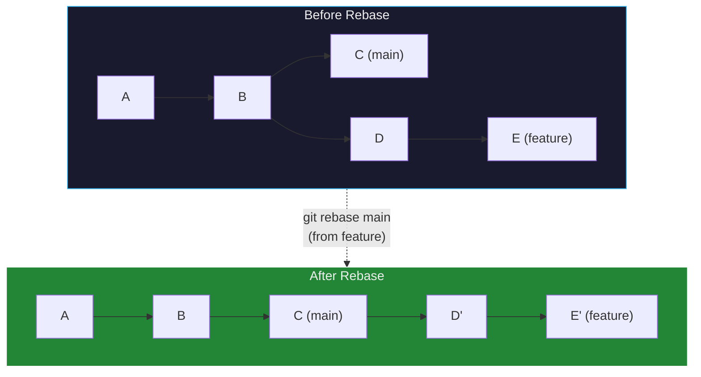
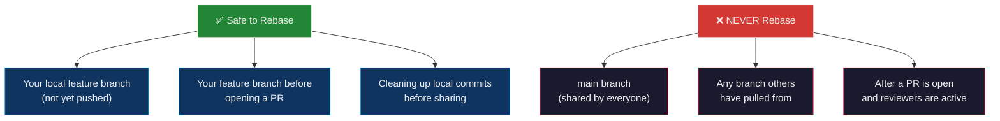
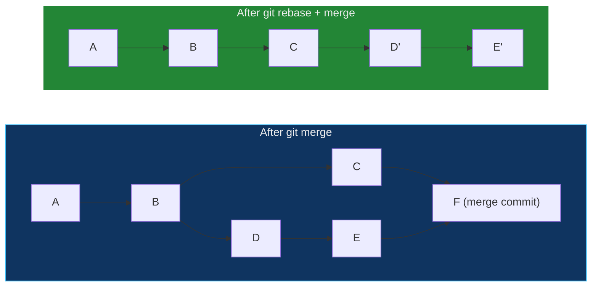
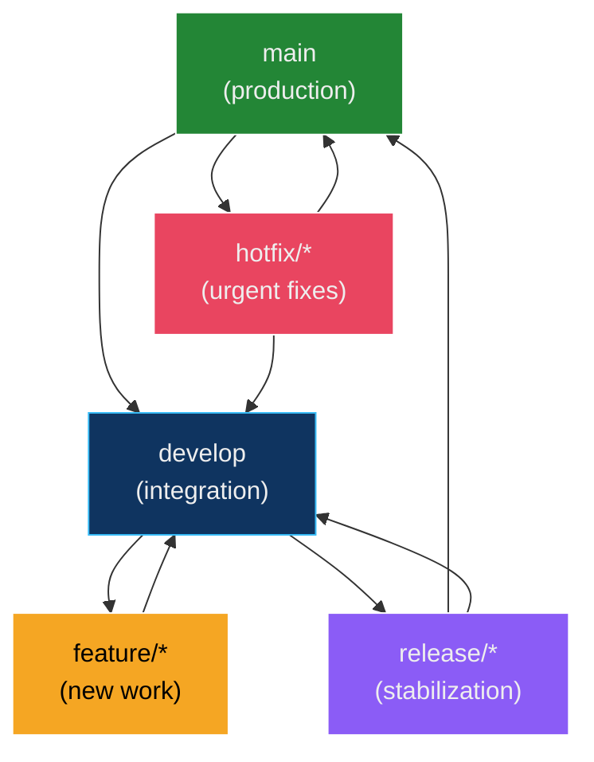
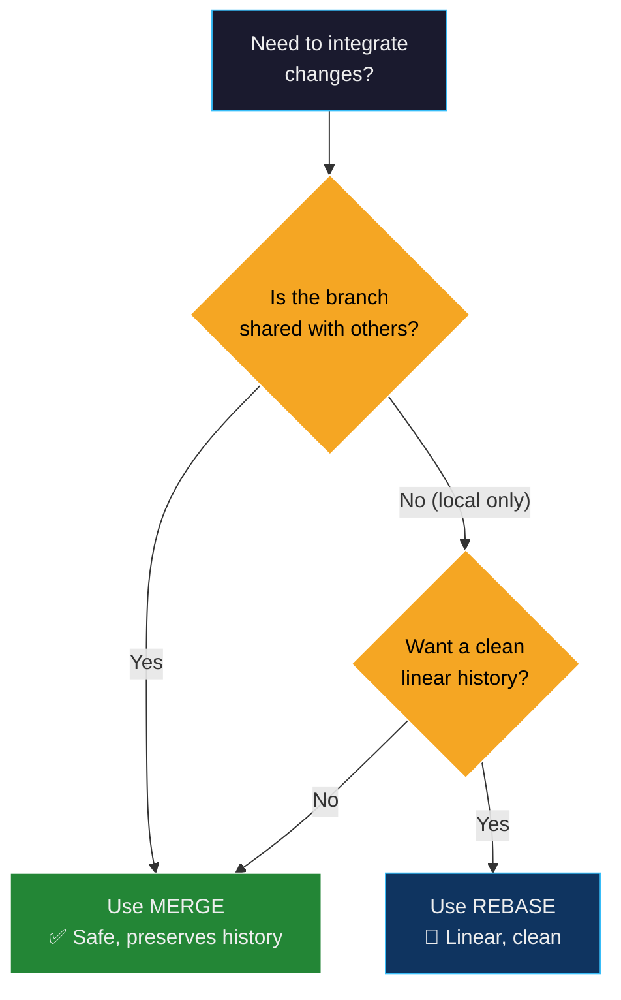

## The Highway System Analogy

Before diving into branching, merging, and rebasing, consider how a **highway system with on-ramps and off-ramps** operates:

| Highway System | Git Branching & Merging |
| :--- | :--- |
| The **main highway** carries steady traffic from point A to point B | The `main` branch carries stable, production-ready code from commit to commit |
| A **construction crew** needs to build a new lane — they can't block the highway to do it | A developer needs to add a new feature — they can't break the `main` branch for everyone |
| They build a **parallel access road** (on-ramp) to work independently while the highway stays open | They create a **feature branch** to develop in isolation while `main` remains stable |
| Multiple crews can build different sections simultaneously — overpass, bridge, tunnel — on separate roads | Multiple developers can work on different **branches** simultaneously — auth, payments, UI |
| When the new lane is ready, the crew builds a **merge ramp** to connect it back to the highway — traffic from both roads converges | When the feature is complete, the developer **merges** the branch back into `main` — both histories converge at a merge commit |
| Sometimes two roads merge at the same spot and traffic **conflicts** — a signal or roundabout resolves it | Sometimes two branches modify the same lines and Git detects a **merge conflict** — the developer manually resolves it |
| Alternatively, a city planner might **demolish the parallel road** and rebuild it as a natural extension of the highway — as if it were always one straight road | Alternatively, a developer might **rebase** the feature branch — replaying its commits on top of `main` so the history appears as one clean, linear road |
| The highway crew's logbook records which road was built when, and where the junctions are | `git log --graph` shows which branch was created when, and where the merge points are |
| **Merge approach:** Both the old highway and the parallel road are visible on the map — historical proof of how the system grew | **Merge:** Both the original branch and the merge commit are visible in the log — preserves the complete development story |
| **Rebase approach:** The map shows only one straight road — cleaner, but you lose the record of how it was actually built | **Rebase:** The log shows a linear sequence of commits — cleaner history, but the original branch structure is erased |

> **Key insight:** Branching lets you build new things without breaking what's already working. **Merge** preserves the full construction history (junctions, parallel roads). **Rebase** flattens the history into one clean road. Choosing between them is a deliberate trade-off between **clarity** and **completeness** of your project's story.

---

## What Is a Branch?

In Git, a **branch** is a lightweight, movable pointer to a specific commit. When you create a branch, Git simply creates a new 41-byte file containing the SHA-1 hash of the commit it points to — no files are copied, no directories are duplicated. This is what makes Git branching **instantaneous** and practically free.



| Concept | What It Actually Is |
| :--- | :--- |
| **Branch** | A file (`.git/refs/heads/<name>`) containing the 40-character SHA-1 hash of the commit it points to |
| **HEAD** | A symbolic reference (`file: .git/HEAD`) that tells Git which branch you're currently on |
| **Switching branches** | Git updates `HEAD` to point to the new branch, then updates the working directory to match that commit's snapshot |
| **Creating a branch** | Git writes a new 41-byte file — **no files are copied** — making it O(1) regardless of repository size |

### Why Is This Important?

In SVN (Subversion), creating a branch means **copying the entire directory tree** on the server — expensive, slow, and discouraged. In Git, branches are so cheap that teams routinely create dozens of branches per week.

> **Mental model:** A branch is a **bookmark** in a book. Creating one doesn't duplicate the book — it just marks a page so you can return to it later.

---

## Why Branching Is Needed

Branching solves five fundamental problems in collaborative software development:

### 1. Isolation of Work

Branches allow developers to work on new features, bug fixes, or experiments **without disrupting the main codebase**. Changes on a branch are invisible to other developers until explicitly merged.



### 2. Parallel Collaboration

Multiple team members can work on different features simultaneously without stepping on each other's changes. Each developer operates on their own branch.

| Without Branching | With Branching |
| :--- | :--- |
| Alice and Bob edit `server.py` at the same time | Alice works on `feature-auth`, Bob works on `feature-payments` |
| They email files back and forth | Each pushes to their own branch on GitHub |
| Changes overwrite each other | Changes are merged systematically with conflict detection |

### 3. Safe Experimentation

You can test risky architectural changes, prototype new algorithms, or refactor major components on a branch. If the experiment fails, you simply delete the branch — **the stable code is never affected**.

### 4. Organized Workflow

Teams maintain separate branches for different stages of development:

| Branch | Purpose | Stability |
| :--- | :--- | :--- |
| `main` / `master` | Production-ready code | 🟢 Always deployable |
| `develop` | Integration branch for the next release | 🟡 Mostly stable |
| `feature/*` | Individual features in progress | 🟠 Unstable — work in progress |
| `hotfix/*` | Urgent production fixes | 🔴 Critical — merged ASAP |
| `release/*` | Release candidates being tested | 🟡 Stabilizing |

### 5. Code Review via Pull Requests

Branches are the foundation of the **Pull Request (PR)** workflow. A developer creates a branch, pushes it to GitHub, opens a PR, and team members review the code *before* it's merged into `main`.

---

## Branch Commands — Complete Reference

### Command Cheat Sheet

| Command | Description |
| :--- | :--- |
| `git branch` | Lists all local branches. `*` marks the current branch |
| `git branch <name>` | Creates a new branch pointing to the current commit |
| `git switch <name>` | Switches to the specified branch (modern, safe command) |
| `git checkout <name>` | Switches to the specified branch (older command, also used for files) |
| `git switch -c <name>` | Creates a new branch and switches to it in one step |
| `git checkout -b <name>` | Same as above — older syntax |
| `git branch -d <name>` | Deletes a branch **only if fully merged** (safe delete) |
| `git branch -D <name>` | **Force deletes** a branch even if it has unmerged work (destructive) |
| `git branch -m <old> <new>` | Renames a branch |
| `git branch -r` | Lists remote-tracking branches (e.g., `origin/main`) |
| `git branch -a` | Lists both local and remote-tracking branches |
| `git push origin --delete <name>` | Deletes a branch on the remote server |
| `git merge <name>` | Merges the specified branch into the **current** branch |

> **`switch` vs `checkout`:** The `git switch` command was introduced in Git 2.23 (2019) specifically for branch switching. The older `git checkout` was overloaded — it handled both branch switching *and* file restoration — which caused confusion. Modern Git recommends `switch` for branches and `restore` for files.

### Hands-On Examples

#### 1. List All Branches

```bash
git branch
```

**Output:**
```
* main
  feature-branch
```

The `*` indicates the currently checked-out branch (where `HEAD` is pointing).

#### 2. Create a New Branch

```bash
git branch feature-1
```

This creates the branch but does **not** switch to it. You're still on `main`.

#### 3. Switch to a Branch

```bash
git switch feature-1
```

Alternatively, with the older `checkout` command:

```bash
git checkout feature-1
```

#### 4. Create and Switch in One Step

```bash
git switch -c feature-2
```

Or with `checkout`:

```bash
git checkout -b feature-2
```

#### 5. Rename a Branch

Rename the **current** branch:

```bash
git branch -m new-branch-name
```

Rename a **specific** branch (from any branch):

```bash
git branch -m old-name new-name
```

#### 6. Delete a Local Branch

Delete a branch that has been **fully merged** (safe):

```bash
git branch -d feature-1
```

**Force-delete** a branch with unmerged work (destructive — commits may be lost):

```bash
git branch -D feature-1
```

#### 7. List Remote Branches

```bash
git branch -r
```

**Output:**
```
  origin/main
  origin/feature-auth
  origin/bugfix-42
```

#### 8. Delete a Remote Branch

```bash
git push origin --delete feature-1
```

This removes the branch from GitHub / the remote server. Your local copy (if it exists) is unaffected.

#### 9. Merge a Branch

First, switch to the branch you want to merge **into**, then merge:

```bash
git switch main
git merge feature-1
```

---

## Use Case: Feature Development Workflow

Here is a complete, real-world feature development lifecycle using branches:


### Step-by-Step

##### 1. Start on the Main Branch

```bash
git switch main
git pull origin main        # Ensure you have the latest code
```

##### 2. Create and Switch to a Feature Branch

```bash
git switch -c feature-login
```

##### 3. Make Changes and Commit

```bash
# Edit files...
git add .
git commit -m "Add login form with validation"

# Continue working...
git add .
git commit -m "Add password hashing with bcrypt"
```

##### 4. Push to Remote and Open a Pull Request

```bash
git push -u origin feature-login
# Then open a Pull Request on GitHub for code review
```

##### 5. Merge Feature Branch into Main (after approval)

```bash
git switch main
git pull origin main          # Get any changes that happened while you were working
git merge feature-login
git push origin main
```

##### 6. Delete the Feature Branch (cleanup)

```bash
git branch -d feature-login             # Delete locally
git push origin --delete feature-login   # Delete on remote
```

---

## Best Practices for Branching

### 1. Use Descriptive, Consistent Branch Names

Follow a naming convention that communicates **what type** of work the branch contains:

| Prefix | Purpose | Example |
| :--- | :--- | :--- |
| `feature/` | New functionality | `feature/user-authentication` |
| `bugfix/` | Bug fix | `bugfix/login-redirect-loop` |
| `hotfix/` | Urgent production fix | `hotfix/security-patch-xss` |
| `release/` | Release preparation | `release/v2.1.0` |
| `chore/` | Maintenance (deps, CI, docs) | `chore/update-dependencies` |

### 2. Keep the Main Branch Stable

Only merge **tested and approved** changes into `main`. Never commit directly to `main` in team projects — always use branches and Pull Requests.

### 3. Enable Branch Protection Rules

On GitHub, configure branch protection for `main`:

| Rule | Effect |
| :--- | :--- |
| **Require pull request reviews** | At least 1 teammate must approve before merging |
| **Require status checks to pass** | CI/CD pipeline (tests, linting) must pass before merging |
| **Require signed commits** | Only verified (GPG/SSH-signed) commits are accepted |
| **Do not allow force pushes** | Prevents history rewriting on protected branches |
| **Require linear history** | Enforces rebase-and-merge or squash-and-merge (no merge commits) |

### 4. Delete Merged Branches

After merging, delete the feature branch to keep the repository clean. Stale branches accumulate and create confusion.

```bash
# See which branches are already merged into main
git branch --merged main

# Delete them
git branch -d feature-old-stuff
```

### 5. Adopt a Git Workflow Model

Choose a branching strategy appropriate for your team:

| Workflow | Description | Best For |
| :--- | :--- | :--- |
| **GitHub Flow** | Simple: `main` + feature branches + PRs | Small teams, continuous deployment |
| **Git Flow** | Structured: `main`, `develop`, `feature/*`, `release/*`, `hotfix/*` | Larger teams, scheduled releases |
| **Trunk-Based Development** | Very short-lived branches (hours, not days); everyone merges to `main` frequently | High-velocity teams, CI/CD-heavy |
| **Forking Workflow** | Each contributor forks the repo, works on their fork, and submits PRs | Open-source projects |

---

## Git Merge — Preserving the Full History

### What Is Merge?

`git merge` integrates changes from one branch into another by creating a **merge commit** — a special commit with **two parents** that joins the histories of both branches. It preserves the entire branching structure in the commit graph.

### How Merge Works Internally

When you run `git merge feature` from `main`, Git performs a **3-way merge** using three reference points:



The three inputs to the merge algorithm:

| Input | Role |
| :--- | :--- |
| **Merge base** (common ancestor) | The last commit shared by both branches — the "fork point" |
| **Current branch tip** (`main`) | What `main` looks like now |
| **Incoming branch tip** (`feature`) | What `feature` looks like now |

Git compares both branch tips against the merge base to determine what changed on each side, then combines the changes automatically.

### Visual Representation

```
Before Merge:

     A --- B --- C          (main)
              \
               D --- E      (feature)

After Merge:

     A --- B --- C ------- F   (main)  ← F is the merge commit
              \           /
               D --- E ---     (feature merged in)
```

Commit `F` has **two parents**: `C` (from `main`) and `E` (from `feature`). The full branching history is preserved.

### Step-by-Step Example

##### 1. Start with `main` branch

```bash
git checkout main
git log --oneline
```

**Output:**
```
d1a2b3e Update README
9f8e7c3 Initial commit
```

##### 2. Create and switch to `feature` branch

```bash
git checkout -b feature
```

##### 3. Add a new file on `feature`

```bash
echo "print('Hello from feature')" > feature.py
git add feature.py
git commit -m "Add feature.py"
```

##### 4. Return to `main` and merge

```bash
git checkout main
git merge feature
```

**Output:**
```
Merge made by the 'recursive' strategy.
 feature.py | 1 +
 1 file changed, 1 insertion(+)
```

##### 5. Inspect the merge history

```bash
git log --oneline --graph
```

**Output:**
```
*   4e5f6a7 Merge branch 'feature'
|\
| * 3c2b4d1 Add feature.py
* | d1a2b3e Update README
|/
* 9f8e7c3 Initial commit
```

Notice the **diamond shape** — this is the visual signature of a merge. The `|\ ... |/` shows where the branches diverged and reconverged.

### Types of Merge

| Type | When It Happens | Result |
| :--- | :--- | :--- |
| **Fast-Forward Merge** | `main` has no new commits since the branch was created — `main` just "catches up" | No merge commit — history is linear. The branch pointer simply moves forward |
| **3-Way Merge** (True Merge) | Both branches have new commits — they've diverged | Creates a **merge commit** with two parents |
| **Squash Merge** | `git merge --squash feature` — combines all feature commits into one | Creates a single new commit on `main` — no merge commit, no branch history |



#### Fast-Forward Merge in Detail

A fast-forward happens when `main` hasn't moved since the branch was created:

```
Before:
     A --- B           (main, HEAD)
              \
               C --- D  (feature)

After git merge feature:
     A --- B --- C --- D   (main, HEAD)
```

No merge commit is created — `main` simply moves forward to `D`. To **force** a merge commit even when fast-forward is possible (useful for preserving branch history):

```bash
git merge --no-ff feature
```

### Advantages of Merge

| Advantage | Explanation |
| :--- | :--- |
| **Preserves complete history** | You can always see when a branch was created, what commits it contained, and when it was merged |
| **Non-destructive** | No existing commits are modified — the operation only *adds* a new merge commit |
| **Collaborative-friendly** | Safe for shared branches — never rewrites history that others depend on |
| **Audit trail** | Merge commits document who merged what, when, and can link to Pull Requests |

---

## Git Rebase — Rewriting for a Linear History

### What Is Rebase?

`git rebase` rewrites the commit history by **replaying** the commits from your feature branch on top of the target branch's latest commit. The result is a **linear history** — as if the feature was developed sequentially after all the `main` commits, even though it was actually developed in parallel.

### How Rebase Works Internally

When you run `git rebase main` from `feature`, Git:

1. **Identifies the commits** unique to `feature` (not in `main`)
2. **Temporarily removes** them from `feature`
3. **Moves `feature`** to point to `main`'s latest commit
4. **Replays** each removed commit **one by one** on top of the new base, creating **new commits** with new SHA-1 hashes



> **Critical detail:** `D'` and `E'` are **new commits** — they have the same content and message as `D` and `E`, but different SHA-1 hashes (because their parent commit changed). The original `D` and `E` still exist in Git's object database but are no longer referenced by any branch.

### Visual Representation

```
Before Rebase:

     A --- B --- C          (main)
              \
               D --- E      (feature)

After git rebase main (from feature):

     A --- B --- C          (main)
                  \
                   D' --- E' (feature)   ← New commits with new hashes

After git merge feature (from main) — fast-forward:

     A --- B --- C --- D' --- E'   (main, feature)
```

### Step-by-Step Example

##### 1. Start with `main` branch

```bash
git checkout main
```

##### 2. Create and switch to `feature` branch

```bash
git checkout -b feature
```

##### 3. Add a new file on `feature`

```bash
echo "print('Hello from feature')" > feature.py
git add feature.py
git commit -m "Add feature.py"
```

##### 4. Return to `main` and make a change

```bash
git checkout main
echo "print('Hello from main')" > main.py
git add main.py
git commit -m "Add main.py"
```

Now `main` and `feature` have **diverged** — each has commits the other doesn't.

##### 5. Rebase `feature` onto `main`

```bash
git checkout feature
git rebase main
```

**Output:**
```
Successfully rebased and updated refs/heads/feature.
```

##### 6. Switch back to `main` and fast-forward merge

```bash
git checkout main
git merge feature
```

Since `feature` is now directly ahead of `main` (no divergence), Git performs a **fast-forward merge** — no merge commit needed.

##### 7. Inspect the linear history

```bash
git log --oneline --graph
```

**Output:**
```
* a1b2c3d Add feature.py
* d4e5f6g Add main.py
* d1a2b3e Update README
* 9f8e7c3 Initial commit
```

Notice: **no merge commit, no diamond shape** — the history reads like a straight line.

### The Golden Rule of Rebase

> ⚠️ **Never rebase commits that have been pushed to a shared/public branch.**

Rebasing rewrites commit history (new SHA-1 hashes). If other developers have already pulled the original commits, rebasing causes **divergent histories** — their copies have the old hashes, your branch has new ones. This forces everyone to reconcile the conflict, often resulting in duplicated commits and confusion.



### Interactive Rebase — Editing History

`git rebase -i` (interactive rebase) gives you fine-grained control over your commit history **before** sharing it. You can:

| Action | Keyword | Effect |
| :--- | :--- | :--- |
| **Reorder** | (change line order) | Move commits up/down in the history |
| **Squash** | `squash` / `s` | Combine a commit with the one before it (keeps both messages) |
| **Fixup** | `fixup` / `f` | Combine a commit with the one before it (discards this commit's message) |
| **Reword** | `reword` / `r` | Change a commit message without changing the code |
| **Edit** | `edit` / `e` | Pause at a commit to amend its content |
| **Drop** | `drop` / `d` | Remove a commit entirely |

```bash
# Interactively rebase the last 3 commits
git rebase -i HEAD~3
```

Git opens your editor with something like:

```
pick a1b2c3d Add login form
pick d4e5f6g Fix typo in login form
pick h7i8j9k Add login validation

# Rebase instructions:
# p, pick = use commit
# r, reword = use commit, but edit the commit message
# e, edit = use commit, but stop for amending
# s, squash = use commit, but meld into previous commit
# f, fixup = like "squash", but discard this commit's log message
# d, drop = remove commit
```

Example — squash the typo fix into the original commit:

```
pick a1b2c3d Add login form
fixup d4e5f6g Fix typo in login form
pick h7i8j9k Add login validation
```

Result: 3 commits become 2, with a clean, professional history.

### Advantages of Rebase

| Advantage | Explanation |
| :--- | :--- |
| **Linear, clean history** | `git log` reads like a story — no merge diamonds, no branching noise |
| **Easier debugging** | `git bisect` (binary search for bugs) works better with linear history |
| **Smaller diffs** | Pull Requests show only the feature's changes, not merge artifacts |
| **Professional commit log** | Interactive rebase lets you clean up "WIP" and "fix typo" commits before sharing |

---

## Merge vs Rebase — Detailed Comparison



| Aspect | **Merge** | **Rebase** |
| :--- | :--- | :--- |
| **History shape** | Non-linear — preserves branching structure with merge commits | Linear — appears as if work was done sequentially |
| **Commit modification** | ✅ No existing commits are changed — only adds a merge commit | ⚠️ Creates **new commits** with new SHA-1 hashes — old commits are abandoned |
| **Information preserved** | Full branching context: when branches were created and merged | Branch structure is erased — only the commit content survives |
| **Conflict resolution** | Resolve conflicts **once** during the merge | May resolve conflicts **per commit** as each is replayed |
| **Safety** | ✅ Safe for shared branches — never rewrites history | ⚠️ **Dangerous for shared branches** — rewrites history others depend on |
| **Ideal for** | Team collaboration, audit trails, regulated environments | Personal feature branches, cleaning up before merge, maintaining clean logs |
| **Git log appearance** | Diamond patterns (`\|\ ... \|/`) showing parallel development | Straight line — every commit in a single sequence |
| **Debugging with `bisect`** | Works, but merge commits add noise | Ideal — linear history makes binary search straightforward |
| **Pull Request style** | GitHub "Merge pull request" (default) | GitHub "Rebase and merge" option |

### Decision Matrix — When to Use Which

| Scenario | Recommendation | Reason |
| :--- | :--- | :--- |
| Merging a feature branch into `main` (team project) | **Merge** (`--no-ff`) | Preserves the PR history and who merged what |
| Updating your feature branch with latest `main` changes | **Rebase** | Keeps your branch clean and up-to-date without merge commits |
| Open-source project with many contributors | **Merge** | Everyone's branch history is preserved; easier to revert a PR |
| Solo project or personal branch | **Rebase** | Clean history, no unnecessary merge commits |
| Regulated environment (SOC2, HIPAA) | **Merge** | Complete, unmodified audit trail |
| Cleaning up "WIP" / "fix typo" commits before PR | **Interactive Rebase** | Professional commit log before sharing |

---

## Handling Merge Conflicts

### What Is a Conflict?

A **merge conflict** occurs when two branches modify the **same lines** of the **same file** differently. Git cannot automatically determine which version to keep, so it pauses and asks the developer to manually resolve the conflict.

### Conflict Markers

When a conflict occurs, Git inserts **conflict markers** into the file:

```text
<<<<<<< HEAD
// This is what the current branch (main) has
const greeting = "Hello, World!";
=======
// This is what the incoming branch (feature) has
const greeting = "Hello, Git!";
>>>>>>> feature
```

| Marker | Meaning |
| :--- | :--- |
| `<<<<<<< HEAD` | Start of the current branch's version |
| `=======` | Separator between the two versions |
| `>>>>>>> feature` | End of the incoming branch's version |

### Resolution Steps

```bash
# 1. Attempt the merge
git merge feature

# Git reports: CONFLICT (content): Merge conflict in server.js

# 2. Open the conflicted file and manually edit it
#    - Choose one version, combine both, or write something new
#    - Remove all conflict markers (<<<, ===, >>>)

# 3. Stage the resolved file
git add server.js

# 4. Complete the merge
git commit -m "Merge feature branch, resolve conflict in server.js"
```

### Conflict During Rebase

During a rebase, conflicts may occur **at each commit** being replayed. The resolution process is slightly different:

```bash
# 1. Start the rebase
git rebase main

# Git reports: CONFLICT — resolve and continue

# 2. Resolve the conflict in the file (same as merge)

# 3. Stage the resolved file
git add server.js

# 4. Continue the rebase (NOT commit)
git rebase --continue

# If you want to skip this commit entirely:
git rebase --skip

# If you want to abort and go back to the pre-rebase state:
git rebase --abort
```

| Command | Effect |
| :--- | :--- |
| `git rebase --continue` | After resolving a conflict, continue replaying the remaining commits |
| `git rebase --skip` | Skip the current commit and continue with the next |
| `git rebase --abort` | Cancel the entire rebase and return to the original state |

---

## Common Branching Workflows in the Industry

### GitHub Flow (Simple)


**Rules:** Only one permanent branch (`main`). Every change goes through a feature branch + PR. `main` is always deployable.

### Git Flow (Structured)



**Rules:** Two permanent branches (`main` + `develop`). Features branch from `develop`. Releases are cut from `develop` into `release/*`, then merged to both `main` and `develop`. Hotfixes branch from `main` and merge back to both.

---

## Suggested Mermaid.js Diagrams

Add these diagrams to your blog to visually reinforce the concepts:

### Diagram 1: Branch Lifecycle (Creation → Development → Merge → Deletion)


### Diagram 2: Merge vs Rebase Decision Tree



---

## Glossary

| Term | Definition |
| :--- | :--- |
| **Branch** | A lightweight, movable pointer (41-byte file) to a specific commit — enables isolated, parallel development without copying files |
| **HEAD** | A symbolic reference that tells Git which branch (or commit) you're currently working on — "you are here" on the commit graph |
| **Merge** | The operation of combining changes from one branch into another, typically by creating a **merge commit** with two parent commits |
| **Merge Commit** | A special commit with **two parents** that joins the histories of two branches — the visual "junction point" in the commit graph |
| **Fast-Forward Merge** | A merge that occurs when the target branch has no new commits — the branch pointer simply moves forward, producing no merge commit |
| **3-Way Merge** | A merge algorithm that compares three snapshots: the **common ancestor**, the **current branch tip**, and the **incoming branch tip** — to automatically combine changes |
| **Rebase** | The operation of moving (replaying) a sequence of commits onto a new base commit, creating **new commits** with new SHA-1 hashes and producing a linear history |
| **Interactive Rebase** | A mode of `git rebase -i` that lets you **squash, reorder, edit, reword, or drop** individual commits before sharing them |
| **Squash** | Combining multiple commits into a single commit — used to clean up "WIP" and "fix typo" commits before merging |
| **Merge Conflict** | A situation where two branches modify the same lines of the same file differently — Git cannot resolve automatically and requires manual intervention |
| **Conflict Markers** | The `<<<<<<< HEAD`, `=======`, and `>>>>>>> branch` text blocks Git inserts into files to show conflicting changes during a merge or rebase |
| **Branch Protection** | GitHub/GitLab rules that prevent direct pushes, require PR reviews, enforce CI checks, or mandate signed commits on critical branches like `main` |
| **Pull Request (PR)** | A GitHub/GitLab feature where a developer proposes merging a feature branch into another branch, enabling code review, discussion, and CI checks before integration |
| **Git Flow** | A branching model with `main`, `develop`, `feature/*`, `release/*`, and `hotfix/*` branches — designed for structured release cycles |
| **GitHub Flow** | A simpler branching model with only `main` and feature branches — designed for continuous deployment |
| **Trunk-Based Development** | A branching strategy where developers work on very short-lived branches (hours) and merge to `main` frequently — emphasizes CI/CD |
| **`git switch`** | A modern Git command (v2.23+) for switching branches — safer and more intuitive than `git checkout` |
| **`git checkout`** | The older, overloaded Git command for both switching branches and restoring files — still works but `switch` and `restore` are preferred |
| **`--no-ff`** | A `git merge` flag that forces creation of a merge commit even when a fast-forward merge is possible — preserves branch history |
| **`git bisect`** | A Git command that performs a binary search through commit history to find the exact commit that introduced a bug |
| **SHA-1 Hash** | A 40-character hexadecimal string that uniquely identifies every Git object (commit, tree, blob) — changes if any content changes |
| **Refs** | Short for "references" — named pointers to commits, stored as files in `.git/refs/` (e.g., `.git/refs/heads/main`) |

---

## Interview & Exam Preparation

### Potential Interview Questions

**Q1: What is the difference between `git merge` and `git rebase`? When would you choose one over the other?**

**Model Answer:**
Both integrate changes from one branch into another, but they differ in *how* they modify the commit history:

- **`git merge`** creates a **merge commit** with two parents, preserving the complete branching history. The commit graph shows where branches diverged and converged. It is **non-destructive** — no existing commits are changed.
- **`git rebase`** **replays** the commits from a feature branch on top of the target branch, creating **new commits** with new SHA-1 hashes. This produces a **linear history** but **rewrites** the original commits.

**When to use merge:** In collaborative workflows where multiple developers share branches. Merge preserves the audit trail (who branched, who merged, when) and is safe for shared branches. Use `--no-ff` to ensure a merge commit is always created.

**When to use rebase:** On *local, unpushed* feature branches to incorporate the latest `main` changes cleanly. Also use interactive rebase (`-i`) to squash, reword, or reorder commits before opening a Pull Request. **Never rebase commits that have been pushed to a shared branch**, as it rewrites history that others depend on.

---

**Q2: Explain the Golden Rule of Rebasing. What happens if you violate it?**

**Model Answer:**
The Golden Rule: **Never rebase commits that have already been pushed to a shared/public branch.**

Rebasing replaces existing commits with new ones that have different SHA-1 hashes. If another developer has already pulled the original commits, their local repository now has commits that no longer exist on the remote. When they try to push or pull, Git detects a divergence — the remote history has been rewritten. This causes:

1. **Duplicate commits** — the same changes appear twice under different hashes
2. **Force-push requirement** — the rebaser must use `git push --force`, which overwrites remote history
3. **Lost work** — other developers' changes may be discarded by the force push
4. **Merge conflicts** — everyone who pulled the old commits must manually reconcile the divergence

This is why rebasing is considered safe only for **local, unpushed branches** — where you're the only person who has seen those commits.

---

**Q3: A team of 5 developers is working on a web application. Two developers modify the same function in `auth.py` on different branches. Walk through what happens when they both try to merge into `main`, and how the merge conflict is resolved.**

**Model Answer:**
1. **Developer A** finishes their branch first and merges into `main` — this succeeds with no conflict because `main` hasn't changed since they branched.
2. **Developer B** attempts to merge their branch into `main`. Git performs a 3-way merge using: (a) the merge base (the commit where both branches diverged from `main`), (b) `main`'s current tip (which now includes Developer A's changes), and (c) Developer B's branch tip.
3. Git detects that both Developer A and Developer B modified the **same lines** of `auth.py`. Since Git cannot determine which version is correct, it declares a **merge conflict**.
4. Git inserts **conflict markers** (`<<<<<<<`, `=======`, `>>>>>>>`) into the conflicted file, showing both versions.
5. **Developer B** opens the file, reviews both sets of changes, and decides how to combine them — they may keep one version, merge both, or write entirely new code. They then remove all conflict markers.
6. Developer B stages the resolved file (`git add auth.py`) and completes the merge (`git commit`).
7. The resulting merge commit records the conflict resolution, and `main` now contains both developers' changes, correctly integrated.

**Preventive best practices:** Frequent rebasing/merging from `main` reduces conflict size. Small, focused branches minimize the chance that two developers modify the same lines. Code review catches logical conflicts that Git can't detect.

---

## Quick Reference Card

```bash
# ─── Branching ──────────────────────────────────────────────
git branch                              # List all local branches
git branch feature-login                # Create a new branch
git switch feature-login                # Switch to a branch
git switch -c feature-signup            # Create + switch in one step
git branch -d feature-old               # Delete (safe — must be merged)
git branch -D feature-old               # Force delete (even if unmerged)
git branch -m old-name new-name         # Rename a branch
git branch -r                           # List remote branches
git branch -a                           # List local + remote branches
git push origin --delete feature-old    # Delete a remote branch

# ─── Merging ───────────────────────────────────────────────
git switch main                         # Go to the target branch
git merge feature-login                 # Merge feature into main
git merge --no-ff feature-login         # Force a merge commit (no FF)
git merge --squash feature-login        # Squash all commits into one
git merge --abort                       # Cancel a conflicted merge

# ─── Rebasing ──────────────────────────────────────────────
git switch feature-login                # Go to the feature branch
git rebase main                         # Replay feature on top of main
git rebase -i HEAD~3                    # Interactive: edit last 3 commits
git rebase --continue                   # After resolving a conflict
git rebase --skip                       # Skip the current commit
git rebase --abort                      # Cancel and restore original state

# ─── Conflict Resolution ──────────────────────────────────
# 1. Edit conflicted files (remove <<<, ===, >>> markers)
# 2. git add <resolved-file>
# 3. git commit                         # (for merge)
#    git rebase --continue              # (for rebase)

# ─── History Inspection ───────────────────────────────────
git log --oneline --graph --all         # Visualize branch structure
git log --oneline --graph --decorate    # Show branch/tag labels
git branch --merged main                # Branches already merged into main
git branch --no-merged main             # Branches NOT yet merged
```

---

*Last updated: May 2026*