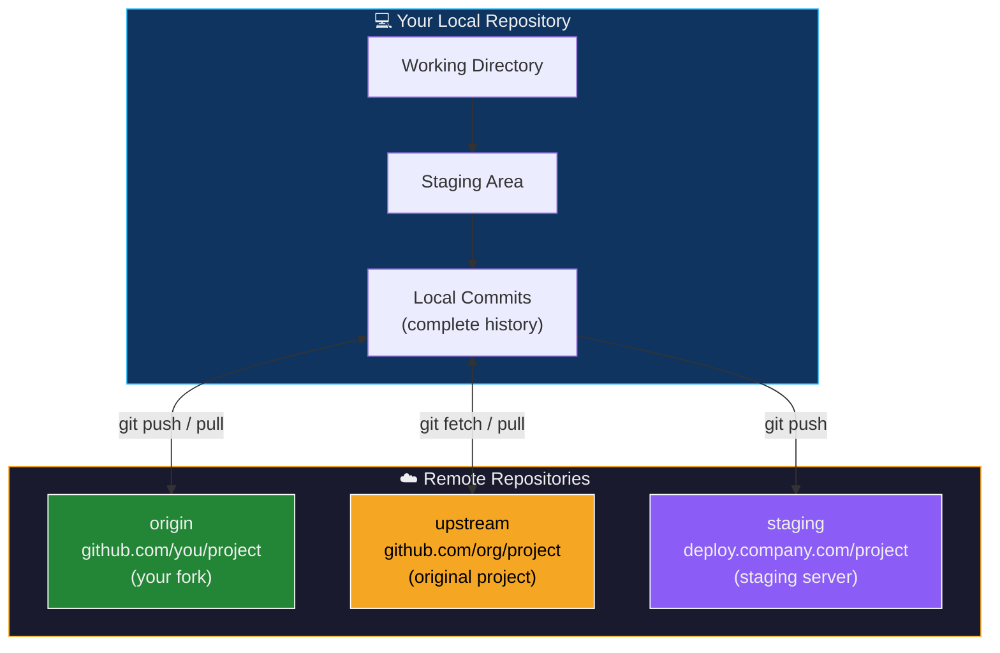
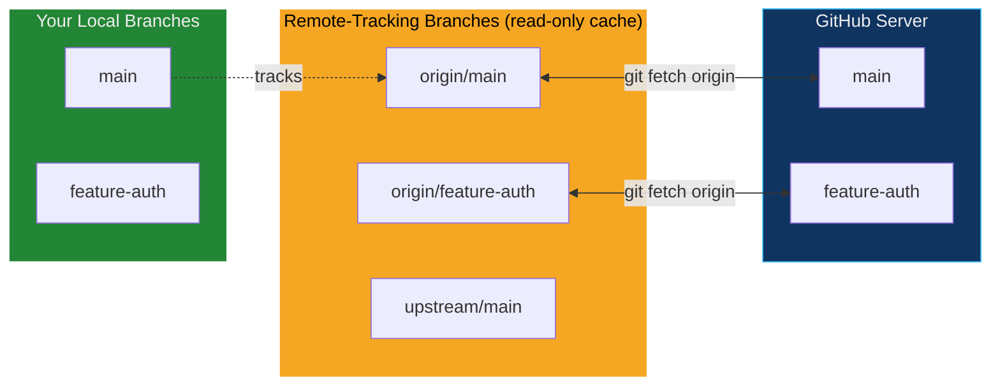
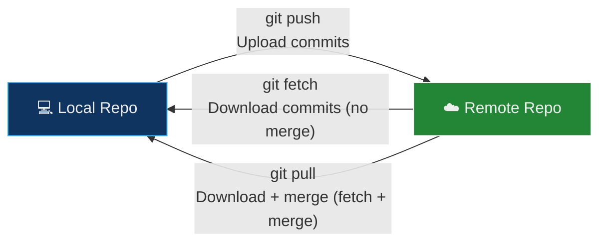
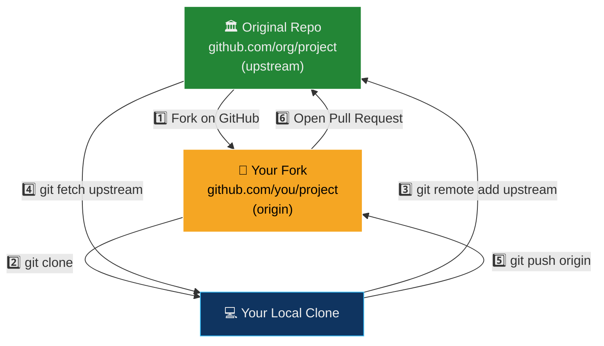
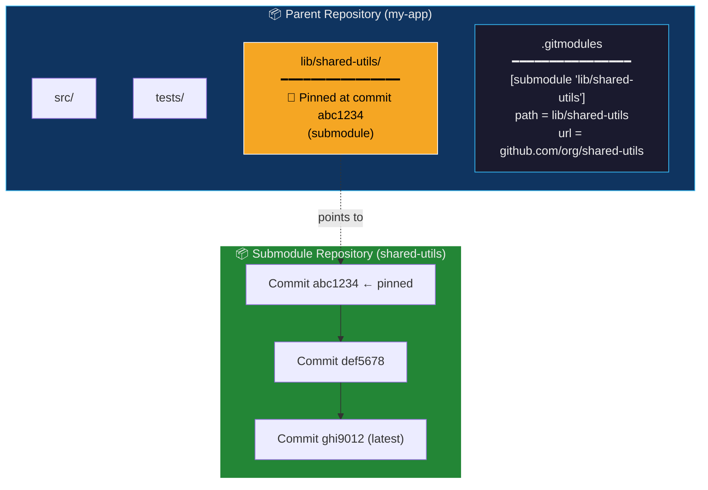
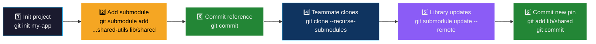
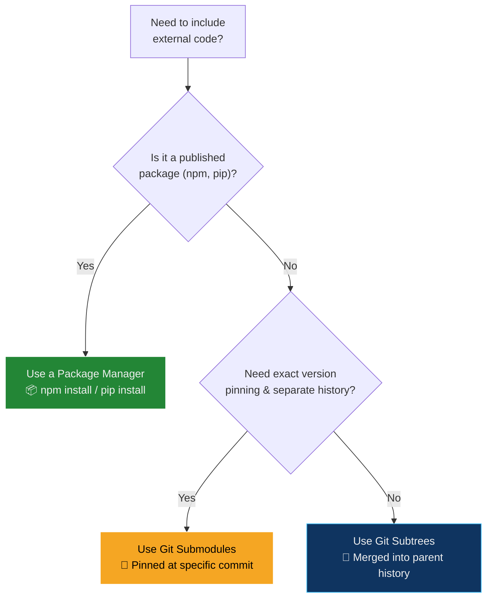
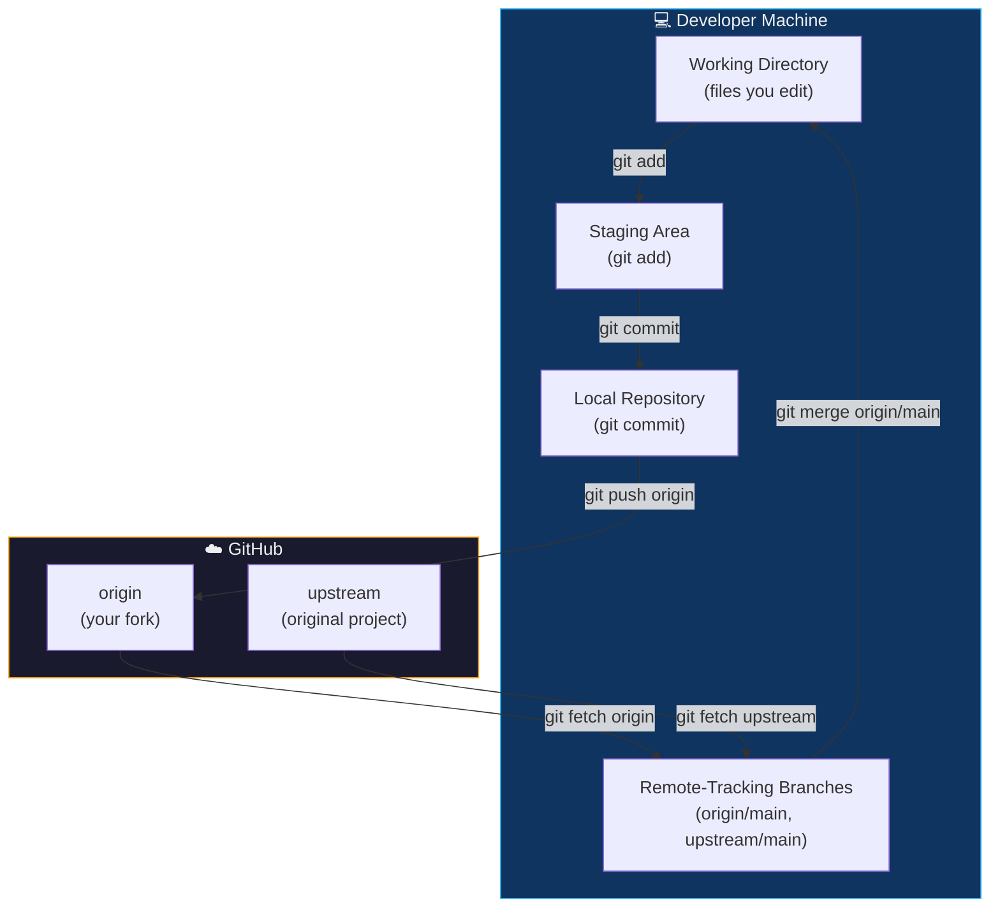
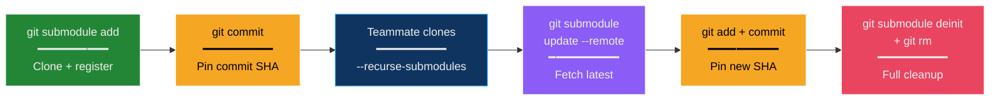

## The International Postal System Analogy

Before diving into remotes and submodules, consider how the **international postal and shipping system** operates:

| International Postal System | Git Remotes & Submodules |
| :--- | :--- |
| Your **home mailbox** stores all the letters you've written and received | Your **local repository** stores all commits, branches, and history |
| The **post office** is a shared hub where you drop off outgoing mail and pick up incoming packages | A **remote repository** (GitHub/GitLab) is a shared hub where you push outgoing commits and pull incoming changes |
| You label the post office with a name — "Main Post Office" or "International Hub" — so you remember which one to use | You label remotes with aliases — `origin` (your fork) or `upstream` (the original project) — so Git knows where to send and receive |
| You can **register multiple post offices** — local, regional, international — each with a different address | You can **add multiple remotes** — `origin`, `upstream`, `staging` — each pointing to a different repository URL |
| **Sending a package** (push): you walk to the post office and drop off your bundle | `git push origin main`: you upload your local commits to the remote |
| **Checking your P.O. box** (fetch): you check what's arrived but don't open it yet | `git fetch origin`: you download remote commits but don't merge them yet |
| **Opening your mail** (pull): you take the letters home and add them to your filing cabinet | `git pull origin main`: you download AND merge remote commits into your branch |
| Sometimes you receive a **complete filing cabinet from another office** — an independent archive that lives inside your own office | A **Git submodule** is an independent repository embedded inside your main repository — it has its own history, branches, and commits |
| That embedded cabinet has its own inventory list, its own lock, and its own delivery schedule — you just keep a reference card saying "Cabinet X, locked at Document #4527" | Your main repo stores a **pointer** (specific commit SHA) to the submodule — not a copy of the code, just a reference to a specific version |
| If the other office updates their cabinet, you must **explicitly request the update** — it doesn't sync automatically | Submodules don't auto-update — you must run `git submodule update --remote` to pull the latest version |
| **Renaming a post office** doesn't change its address or the mail inside — it only changes what you call it | `git remote rename origin upstream` changes the alias but not the URL or any data |
| If a post office **closes down**, you remove it from your address book — your local mail is unaffected | `git remote remove upstream` deletes the reference but does not delete any local branches or commits |

> **Key insight:** Remotes are **named bookmarks** pointing to repositories on the network. They're not live connections — they're addresses that Git contacts only when you explicitly run `push`, `pull`, or `fetch`. Submodules are **embedded repositories** — independent projects pinned to a specific commit, living inside your main project.

---

## Part 1: Git Remotes — Connecting to the World

### What Is a Remote?

A **remote** in Git is a named reference (alias) to a repository hosted on a server (GitHub, GitLab, Bitbucket, a private server, etc.). When you clone a repository, Git automatically creates a remote called `origin` pointing to the URL you cloned from.

Remotes enable the core distributed workflow: developers work locally with full history, then **push** their changes to a shared remote and **pull** others' changes from it.



### How Remotes Work Internally

When you add a remote, Git stores the configuration in `.git/config`:

```ini
[remote "origin"]
    url = https://github.com/you/project.git
    fetch = +refs/heads/*:refs/remotes/origin/*
```

| Component | What It Does |
| :--- | :--- |
| `[remote "origin"]` | Declares a remote named `origin` |
| `url` | The network address Git contacts for push/pull/fetch operations |
| `fetch` | The **refspec** — a mapping rule that says "download all branches from the remote and store them as `refs/remotes/origin/*`" |

Git also maintains **remote-tracking branches** — read-only copies of the remote's branches stored locally:

```bash
git branch -r
# Output:
#   origin/main
#   origin/feature-auth
#   upstream/main
```

These are **not** your local branches. They're Git's local cache of what the remote looked like the last time you ran `fetch` or `pull`.



---

### The Three Remote Operations: Push, Fetch, Pull

Understanding the difference between `push`, `fetch`, and `pull` is critical:



| Operation | What Happens | Modifies Working Directory? | Safe? |
| :--- | :--- | :--- | :--- |
| **`git fetch`** | Downloads new commits, branches, and tags from the remote. Updates remote-tracking branches (`origin/main`). Does **not** touch your local branches or working directory | ❌ No | ✅ Completely safe — read-only |
| **`git pull`** | Runs `git fetch` then immediately runs `git merge` (or `git rebase` if configured). Integrates remote changes into your current branch | ✅ Yes | ⚠️ Can cause merge conflicts |
| **`git push`** | Uploads your local commits to the remote. Updates the remote's branch to match yours | ❌ (on local) | ⚠️ Can be rejected if remote is ahead |

> **Best practice:** Prefer `git fetch` + manual merge/rebase over `git pull`. This gives you a chance to **inspect** what changed before integrating it.

```bash
# Safe workflow: fetch, inspect, then merge
git fetch origin
git log --oneline main..origin/main    # See what's new on remote
git merge origin/main                   # Merge when ready

# vs. the shortcut (less control)
git pull origin main                    # Fetch + merge in one step
```

---

### Remote Commands — Complete Reference

#### 1. `git remote add` — Register a New Remote

Creates a named reference to a remote repository.

```bash
git remote add <name> <url>
```

| Parameter | Description | Example |
| :--- | :--- | :--- |
| `<name>` | The alias you choose for the remote | `origin`, `upstream`, `staging` |
| `<url>` | The repository URL (HTTPS or SSH) | `https://github.com/user/repo.git` or `git@github.com:user/repo.git` |

**Example — setting up a forked project with two remotes:**

```bash
# origin = your fork (you have push access)
git remote add origin https://github.com/you/project.git

# upstream = the original project (read-only for you)
git remote add upstream https://github.com/org/project.git
```

#### Common Remote Naming Conventions

| Name | Convention | Typical Use |
| :--- | :--- | :--- |
| `origin` | Your own copy of the repository (or the one you cloned) | Push your work here |
| `upstream` | The original "source of truth" repository (in a forking workflow) | Fetch updates from the original project |
| `staging` | A deployment target | Push to trigger staging deployments |
| `production` | A production deployment target | Push to trigger production deployments |
| `backup` | A backup server | Mirror repository for disaster recovery |

---

#### 2. `git remote -v` — List All Remotes

Displays all registered remotes and their URLs for both fetch and push operations.

```bash
git remote -v
```

**Example Output:**
```
origin    https://github.com/you/project.git (fetch)
origin    https://github.com/you/project.git (push)
upstream  https://github.com/org/project.git (fetch)
upstream  https://github.com/org/project.git (push)
```

> **Why are fetch and push shown separately?** Because Git allows you to configure **different URLs** for fetch and push on the same remote. This is rare but useful — for example, fetching over HTTPS (read-only, no auth needed) and pushing over SSH (authenticated).

---

#### 3. `git remote show <name>` — Inspect a Remote in Detail

Displays comprehensive information about a specific remote, including tracked branches and push/pull configuration.

```bash
git remote show origin
```

**Example Output:**
```
* remote origin
  Fetch URL: https://github.com/you/project.git
  Push  URL: https://github.com/you/project.git
  HEAD branch: main
  Remote branches:
    main         tracked
    feature-auth tracked
    bugfix-42    tracked
  Local branches configured for 'git pull':
    main merges with remote main
  Local refs configured for 'git push':
    main pushes to main (up to date)
```

This is invaluable for debugging — it tells you exactly which local branches are linked to which remote branches, and whether your local branch is ahead or behind.

---

#### 4. `git remote rename` — Change a Remote's Alias

Renames a remote without changing its URL or any associated data.

```bash
git remote rename <old-name> <new-name>
```

**Example:**
```bash
git remote rename origin upstream
```

This also automatically renames all remote-tracking branches: `origin/main` becomes `upstream/main`.

---

#### 5. `git remote remove` — Unregister a Remote

Removes a remote reference and all its associated remote-tracking branches.

```bash
git remote remove <name>
```

**Example:**
```bash
git remote remove upstream
```

> **Important:** This does not delete any local branches or commits. It only removes the alias and the remote-tracking branches (`upstream/main`, etc.).

---

#### 6. `git remote set-url` — Change a Remote's URL

Updates the URL of an existing remote. Common when switching from HTTPS to SSH, or when a repository moves to a new URL.

```bash
git remote set-url <name> <new-url>
```

**Example — switching from HTTPS to SSH:**
```bash
# Before: using HTTPS (requires password/token for every push)
git remote set-url origin git@github.com:you/project.git
# After: using SSH (passwordless with SSH keys)

# Verify
git remote -v
# origin  git@github.com:you/project.git (fetch)
# origin  git@github.com:you/project.git (push)
```

---

#### 7. `git remote update` — Fetch from All Remotes

Downloads updates from **every** registered remote in one command, without merging.

```bash
git remote update
```

**Output:**
```
Fetching origin
Fetching upstream
Fetching staging
```

This is equivalent to running `git fetch --all`, but `git remote update` allows you to configure which remotes are included (using `remote.<name>.skipDefaultUpdate`).

---

#### 8. `git remote prune` — Clean Up Stale References

Removes remote-tracking branches that no longer exist on the remote server. This happens when someone deletes a branch on GitHub but your local Git still has a cached `origin/that-branch` reference.

```bash
git remote prune origin
```

**Output:**
```
Pruning origin
 * [pruned] origin/old-feature
 * [pruned] origin/stale-bugfix
```

> **Pro tip:** Add `--prune` to your fetch to do this automatically:
> ```bash
> git fetch --prune origin
> # Or configure it globally:
> git config --global fetch.prune true
> ```

---

### Command Summary Table

| Command | Purpose | Modifies Data? |
| :--- | :--- | :--- |
| `git remote add <name> <url>` | Register a new remote | Config only |
| `git remote -v` | List all remotes with URLs | ❌ Read-only |
| `git remote show <name>` | Detailed remote inspection | ❌ Read-only |
| `git remote rename <old> <new>` | Rename a remote alias | Config only |
| `git remote remove <name>` | Unregister a remote | Removes tracking branches |
| `git remote set-url <name> <url>` | Change a remote's URL | Config only |
| `git remote update` | Fetch from all remotes | Downloads objects |
| `git remote prune <name>` | Remove stale tracking branches | Removes stale refs |
| `git fetch <name>` | Download from one remote | Downloads objects |
| `git pull <name> <branch>` | Fetch + merge from remote | ✅ Modifies working dir |
| `git push <name> <branch>` | Upload to remote | ✅ Modifies remote |

---

### Workflow: Managing a Forked Repository

This is the most common real-world workflow for open-source contribution:



#### Step-by-Step

##### 1. Fork the Original Repository on GitHub

Click **"Fork"** on the original repo's GitHub page. This creates a copy under your account.

##### 2. Clone Your Fork Locally

```bash
git clone https://github.com/you/project.git
cd project
```

Git automatically creates a remote named `origin` pointing to your fork.

##### 3. Add the Original Repository as `upstream`

```bash
git remote add upstream https://github.com/org/project.git
```

##### 4. Verify Both Remotes

```bash
git remote -v
```

**Output:**
```
origin    https://github.com/you/project.git (fetch)
origin    https://github.com/you/project.git (push)
upstream  https://github.com/org/project.git (fetch)
upstream  https://github.com/org/project.git (push)
```

##### 5. Keep Your Fork Updated with Upstream Changes

```bash
# Fetch the latest from the original project
git fetch upstream

# Merge upstream's main into your local main
git switch main
git merge upstream/main

# Push the updated main to your fork
git push origin main
```

##### 6. Work on a Feature and Submit a Pull Request

```bash
git switch -c feature-new-widget
# ... make changes, commit ...
git push -u origin feature-new-widget
# Then open a Pull Request from your fork to the original repo on GitHub
```

##### 7. Clean Up After PR Is Merged

```bash
git switch main
git pull upstream main              # Get the merged changes
git push origin main                # Update your fork
git branch -d feature-new-widget    # Delete local branch
git push origin --delete feature-new-widget  # Delete remote branch
```

---

## Part 2: Git Submodules — Repositories Inside Repositories

### What Are Submodules?

A **Git submodule** is a mechanism to embed one Git repository inside another as a subdirectory, while keeping their histories **completely separate**. The parent repository doesn't store the submodule's files directly — it stores a **pointer** (a specific commit SHA) to a particular version of the submodule.

Think of it as a **symbolic link to a specific snapshot** of another project.



### How Submodules Work Internally

When you add a submodule, Git creates two things:

| File | Purpose |
| :--- | :--- |
| **`.gitmodules`** | A configuration file (committed to the repo) that maps submodule names to their repository URLs and local paths |
| **Special tree entry** | The parent repo's commit stores the submodule's path as a special Git object (`160000` mode) containing the **exact commit SHA** the submodule is pinned to |

```bash
# .gitmodules file content
[submodule "lib/shared-utils"]
    path = lib/shared-utils
    url = https://github.com/org/shared-utils.git
    branch = main
```

```bash
# What the parent repo actually stores for the submodule
git ls-tree HEAD lib/
# Output:
# 160000 commit abc1234... lib/shared-utils    ← Not a directory — a commit reference
```

> **Critical understanding:** The parent repo does **not** contain the submodule's files in its own Git history. It only stores a commit hash. When you check out the parent, Git reads `.gitmodules`, clones the submodule repo into the specified path, and checks out the pinned commit.

---

### Use Cases for Submodules

| Use Case | Example | Why Not Just Copy the Code? |
| :--- | :--- | :--- |
| **Shared libraries** | A utility library used by 5 different microservices | Changes to the library are made once and pulled into each project independently |
| **Third-party dependencies** | Embedding a fork of an open-source library that you've patched | You can track your patches as commits in the submodule's fork |
| **Monorepo components** | A large project with independently-versioned modules | Each team manages their own repo; the parent orchestrates which versions work together |
| **Documentation sites** | A docs repo embedded into the main project for GitHub Pages | Docs have their own review/deployment cycle |
| **DevOps tooling** | Shared CI/CD scripts, Terraform modules, or Ansible roles | Infrastructure code evolves independently and is consumed by many projects |

---

### Submodule Commands — Complete Reference

#### 1. Adding a Submodule

```bash
git submodule add <repository-url> <path>
```

| Parameter | Description |
| :--- | :--- |
| `<repository-url>` | The URL of the repository to embed |
| `<path>` | Where to place it in your directory tree (optional — defaults to the repo name) |

**Example:**
```bash
git submodule add https://github.com/org/shared-utils.git lib/shared-utils
```

This does three things:
1. Clones the submodule repository into `lib/shared-utils/`
2. Creates (or updates) the `.gitmodules` file
3. Stages both `.gitmodules` and the submodule path for commit

```bash
# Commit the submodule addition
git commit -m "Add shared-utils as submodule at lib/shared-utils"
```

---

#### 2. Cloning a Repository That Contains Submodules

By default, `git clone` does **not** initialize submodules. The submodule directories will exist but be **empty**.

**Option A — Two-step (explicit):**
```bash
git clone https://github.com/you/my-app.git
cd my-app
git submodule update --init --recursive
```

| Flag | Purpose |
| :--- | :--- |
| `--init` | Initializes the submodule configuration (reads `.gitmodules`) |
| `--recursive` | Also initializes nested submodules (submodules within submodules) |

**Option B — One-step (convenient):**
```bash
git clone --recurse-submodules https://github.com/you/my-app.git
```

---

#### 3. Updating Submodules to the Latest Remote Commit

By default, submodules are **pinned** to a specific commit. To update them to the latest commit on their tracked branch:

```bash
git submodule update --remote
```

This updates the submodule's working directory to the latest commit on the branch specified in `.gitmodules` (defaults to `main`).

**After updating, you must commit the new reference:**
```bash
git add lib/shared-utils
git commit -m "Update shared-utils to latest version"
```

> **Why the extra commit?** Because the parent repo stores a **specific commit hash** for each submodule. When the submodule advances, the parent must record the new hash.

---

#### 4. Inspecting Submodule Status

```bash
git submodule status
```

**Output:**
```
 abc1234 lib/shared-utils (v2.3.0)       ← Clean, at pinned commit
+def5678 lib/another-module (heads/main) ← + means local changes present
-ghi9012 lib/third-thing                 ← - means not initialized
```

| Prefix | Meaning |
| :--- | :--- |
| *(space)* | Clean — checked out at the expected commit |
| `+` | The submodule's checked-out commit differs from what the parent expects (local changes or manual checkout) |
| `-` | The submodule has not been initialized (run `git submodule update --init`) |

---

#### 5. Running a Command in All Submodules

```bash
git submodule foreach <command>
```

**Examples:**
```bash
# Check the status of every submodule
git submodule foreach git status

# Pull latest changes in every submodule
git submodule foreach git pull origin main

# Show the current branch of each submodule
git submodule foreach git branch --show-current
```

---

#### 6. Removing a Submodule

Removing a submodule is a multi-step process (this is a well-known pain point in Git):

```bash
# Step 1: Deinitialize the submodule
git submodule deinit lib/shared-utils

# Step 2: Remove from the working tree and index
git rm lib/shared-utils

# Step 3: Remove the submodule's Git directory (metadata cache)
rm -rf .git/modules/lib/shared-utils

# Step 4: Commit the removal
git commit -m "Remove shared-utils submodule"
```

> **Why is this so complicated?** Because submodules touch multiple places: `.gitmodules`, `.git/config`, `.git/modules/<path>/`, and the working tree. Each must be cleaned up independently.

---

### Submodule Command Summary

| Command | Purpose |
| :--- | :--- |
| `git submodule add <url> [path]` | Embed a repository as a submodule |
| `git submodule update --init --recursive` | Initialize and check out all submodules (and nested ones) |
| `git submodule update --remote` | Update submodules to the latest commit on their tracked branch |
| `git submodule status` | Show each submodule's current commit and state |
| `git submodule foreach <cmd>` | Run a shell command inside every submodule |
| `git submodule deinit <path>` | Unregister a submodule from `.git/config` |
| `git rm <path>` | Remove a submodule from the working tree and index |
| `git clone --recurse-submodules <url>` | Clone a repo and automatically initialize all submodules |

---

### Workflow: Using a Shared Library in Your Project



#### Step-by-Step

##### 1. Initialize a Project and Add a Submodule

```bash
git init my-app
cd my-app

git submodule add https://github.com/org/shared-utils.git lib/shared
```

##### 2. Commit the Submodule Reference

```bash
git add .gitmodules lib/shared
git commit -m "Add shared-utils library as submodule"
```

##### 3. Teammate Clones the Project

```bash
git clone --recurse-submodules https://github.com/you/my-app.git
cd my-app
# lib/shared/ is already populated and at the correct commit
```

##### 4. Update the Submodule When the Library Releases a New Version

```bash
cd lib/shared
git pull origin main        # Get the latest in the submodule
cd ../..
git add lib/shared
git commit -m "Update shared-utils to v3.1.0"
git push origin main
```

##### 5. Run a Command Across All Submodules

```bash
git submodule foreach git status
```

---

### Submodules vs Alternatives

Submodules are powerful but add complexity. Here's when to use alternatives:

| Approach | How It Works | Best For | Drawbacks |
| :--- | :--- | :--- | :--- |
| **Git Submodules** | Embeds a repo as a subdirectory; parent stores a commit pointer | Projects that need exact version pinning of dependencies; monorepo components | Complex workflow; easy to forget `--recurse-submodules`; confusing for beginners |
| **Git Subtrees** | Merges another repo's history directly into the parent repo's tree | Simpler sharing; no special clone commands needed | Muddled history; harder to push changes back upstream |
| **Package Managers** (npm, pip, Maven) | Downloads pre-built packages from a registry | Standard libraries and third-party dependencies | Not suitable for private/unreleased code or tightly-coupled internal modules |
| **Monorepo tools** (Nx, Bazel, Turborepo) | Single repo with intelligent build/test/deploy scoping | Large organizations with many interconnected projects | Requires specialized tooling; high initial setup cost |



---

### Best Practices for Submodules

##### 1. Pin to Specific Versions

Always commit the submodule reference after updating. Never leave the parent pointing to an unknown commit.

```bash
git submodule update --remote
git add lib/shared
git commit -m "Pin shared-utils to v3.1.0 (commit abc1234)"
```

##### 2. Use `--recurse-submodules` in Your Clone Instructions

Add this to your project's README:

```bash
# Clone with submodules
git clone --recurse-submodules https://github.com/you/my-app.git

# If you already cloned without submodules
git submodule update --init --recursive
```

##### 3. Configure Automatic Submodule Fetching

```bash
# Automatically fetch submodule changes during git pull
git config --global submodule.recurse true
```

##### 4. Use Relative URLs for Internal Projects

If your submodule is on the same server as the parent:

```bash
# Instead of absolute URL:
git submodule add https://github.com/org/shared-utils.git lib/shared

# Use relative URL:
git submodule add ../shared-utils.git lib/shared
```

This ensures the submodule URL works regardless of whether developers use HTTPS or SSH.

##### 5. Avoid Deep Nesting

Submodules within submodules (nested submodules) are supported but create exponential complexity. Limit nesting to one level if possible.

##### 6. Consider Alternatives

If your team frequently forgets to initialize submodules, or if the submodule's version rarely changes, a **Git subtree** or **package manager** may be simpler.

---

## Suggested Mermaid.js Diagrams

### Diagram 1: Complete Remote Data Flow



### Diagram 2: Submodule Lifecycle



---

## Glossary

| Term | Definition |
| :--- | :--- |
| **Remote** | A named reference (alias) stored in `.git/config` that points to a repository hosted on a server — enables push, fetch, and pull operations |
| **Origin** | The conventional name for the default remote — automatically created when you `git clone` a repository, pointing to the URL you cloned from |
| **Upstream** | The conventional name for the original (source-of-truth) repository in a forking workflow — you fetch from upstream and push to origin |
| **Remote-Tracking Branch** | A read-only, local copy of a remote branch (e.g., `origin/main`) — updated when you run `git fetch` or `git pull` |
| **Fetch** | The operation of downloading new commits, branches, and tags from a remote without modifying your local branches or working directory |
| **Pull** | The operation of fetching remote changes AND merging them into your current branch — equivalent to `git fetch` + `git merge` |
| **Push** | The operation of uploading your local commits to a remote repository, updating the remote's branch to match yours |
| **Refspec** | A mapping rule (stored in `.git/config`) that defines which remote branches to fetch and where to store them locally (e.g., `+refs/heads/*:refs/remotes/origin/*`) |
| **Clone** | Creating a complete local copy of a remote repository, including all history, branches, and tags — also automatically sets up `origin` |
| **Fork** | A server-side copy of a repository (created on GitHub/GitLab) under your own account — enables you to make changes without affecting the original project |
| **Pull Request (PR)** | A request to merge changes from one branch (or fork) into another — enables code review, discussion, and CI checks before integration |
| **Prune** | The operation of removing stale remote-tracking branches that no longer exist on the remote server |
| **Submodule** | A Git mechanism to embed one repository inside another as a subdirectory, while keeping their histories completely separate — the parent stores a commit pointer, not the actual files |
| **`.gitmodules`** | A configuration file (committed to the repository) that maps submodule names to their repository URLs and local paths |
| **Pinning** | The practice of locking a submodule to a specific commit SHA — ensures reproducible builds by using an exact known-good version |
| **Subtree** | An alternative to submodules that merges another repository's history directly into the parent repository's tree — simpler workflow but muddled history |
| **`git submodule foreach`** | A command that executes a given shell command inside every registered submodule in the repository |
| **`--recurse-submodules`** | A flag for `git clone` (and other commands) that automatically initializes and checks out all submodules during the operation |
| **`git remote set-url`** | A command to change the URL of an existing remote — commonly used when switching from HTTPS to SSH authentication |
| **`git remote show`** | A command that displays detailed information about a specific remote, including tracked branches and push/pull configuration |
| **Stale Branch** | A remote-tracking branch that still exists locally but has been deleted from the remote server — cleaned up with `git remote prune` or `git fetch --prune` |

---

## Interview & Exam Preparation

### Potential Interview Questions

**Q1: Explain the difference between `git fetch` and `git pull`. In a team environment, which would you recommend and why?**

**Model Answer:**

Both commands download changes from a remote repository, but they differ in what happens after the download:

- **`git fetch`** downloads new commits, branches, and tags from the remote and updates the **remote-tracking branches** (e.g., `origin/main`). It does **not** modify your local branches or working directory. It is a completely **safe, read-only** operation.

- **`git pull`** is essentially `git fetch` + `git merge` (or `git rebase` if configured). It downloads remote changes AND immediately integrates them into your current local branch. This modifies your working directory and can trigger **merge conflicts**.

**Recommendation for teams:** I recommend `git fetch` followed by a manual inspection and merge. The workflow is:

```bash
git fetch origin
git log --oneline main..origin/main    # Inspect what changed
git diff main origin/main              # Review the actual code changes
git merge origin/main                  # Merge when satisfied
```

This gives the developer full visibility into what's arriving before it touches their code, preventing surprise conflicts during focused work. `git pull` is convenient for solo developers or when you trust the incoming changes, but in team environments, the extra inspection step catches integration issues early.

---

**Q2: You're contributing to an open-source project. Describe the complete workflow from forking the repository to getting your changes merged, including all the Git remote commands involved.**

**Model Answer:**

1. **Fork** the original repository on GitHub (creates `github.com/me/project`).

2. **Clone** your fork locally:
   ```bash
   git clone https://github.com/me/project.git
   cd project
   ```
   This creates a remote called `origin` pointing to my fork.

3. **Add the original repo as `upstream`**:
   ```bash
   git remote add upstream https://github.com/org/project.git
   ```
   Now I have two remotes: `origin` (my fork, push/pull) and `upstream` (original, fetch only).

4. **Create a feature branch** (never work directly on `main`):
   ```bash
   git switch -c feature-new-widget
   ```

5. **Develop and commit** changes locally.

6. **Before pushing, sync with upstream** to avoid merge conflicts:
   ```bash
   git fetch upstream
   git rebase upstream/main    # Replay my commits on top of the latest upstream
   ```

7. **Push** my feature branch to my fork:
   ```bash
   git push -u origin feature-new-widget
   ```

8. **Open a Pull Request** on GitHub from `me/project:feature-new-widget` → `org/project:main`.

9. **Address code review feedback** — make additional commits and push.

10. **After PR is merged**, clean up:
    ```bash
    git switch main
    git fetch upstream
    git merge upstream/main
    git push origin main                         # Sync fork's main
    git branch -d feature-new-widget             # Delete local branch
    git push origin --delete feature-new-widget  # Delete remote branch
    ```

This workflow keeps my fork's `main` in sync, ensures feature branches are up-to-date before PR review, and cleans up branches after merge.

---

**Q3: Your team has a monorepo that depends on a shared authentication library maintained by another team. The library has its own release cycle. Explain how you would integrate it using Git submodules, including the trade-offs versus using a package manager.**

**Model Answer:**

**Integration with Git submodules:**

```bash
# Add the auth library as a submodule pinned to a specific release
git submodule add https://github.com/org/auth-lib.git lib/auth
cd lib/auth
git checkout v2.5.0   # Pin to a known-good release tag
cd ../..
git add .gitmodules lib/auth
git commit -m "Add auth-lib submodule pinned to v2.5.0"
```

When the auth team releases v2.6.0 and we're ready to upgrade:

```bash
cd lib/auth
git fetch origin
git checkout v2.6.0
cd ../..
git add lib/auth
git commit -m "Upgrade auth-lib to v2.6.0"
```

All team members must clone with `--recurse-submodules` or run `git submodule update --init --recursive` after cloning.

**Trade-offs vs. Package Manager (e.g., npm/pip):**

| Factor | Git Submodules | Package Manager |
| :--- | :--- | :--- |
| **Version pinning** | Exact commit SHA — deterministic | Version ranges possible (`^2.5.0`) — may introduce drift |
| **Source access** | Full source code available in the tree — easy to debug and patch | Pre-built artifacts — debugging requires separate source download |
| **Build integration** | Must be compiled alongside the parent project | Pre-compiled — faster builds |
| **Update workflow** | Manual: `git checkout <tag>` + commit | `npm update` / `pip install --upgrade` |
| **Team familiarity** | Requires Git submodule knowledge (often a pain point) | Most developers are already familiar with `npm install` |
| **Private code** | Works with private repos via SSH/tokens | Requires a private registry (Artifactory, GitHub Packages) |

**My recommendation:** Use submodules when the auth library is private/unreleased, when you need to frequently debug into its source code, or when you want absolute reproducibility (exact commit, not version ranges). Use a package manager when the library is stable, published, and treated as a black box.

---

## Quick Reference Card

```bash
# ─── Remote Management ────────────────────────────────────
git remote add origin https://github.com/you/repo.git   # Register a remote
git remote add upstream https://github.com/org/repo.git  # Add upstream
git remote -v                                            # List all remotes
git remote show origin                                   # Detailed inspection
git remote rename origin old-origin                      # Rename a remote
git remote remove upstream                               # Unregister a remote
git remote set-url origin git@github.com:you/repo.git    # Change URL (HTTPS→SSH)
git remote update                                        # Fetch from all remotes
git remote prune origin                                  # Remove stale tracking branches

# ─── Fetching & Syncing ──────────────────────────────────
git fetch origin                            # Download from origin (safe, no merge)
git fetch --all                             # Download from all remotes
git fetch --prune origin                    # Fetch + remove stale branches
git pull origin main                        # Fetch + merge (convenient but risky)
git pull --rebase origin main               # Fetch + rebase (cleaner history)

# ─── Pushing ─────────────────────────────────────────────
git push origin main                        # Upload to remote
git push -u origin feature-branch           # Push + set upstream tracking
git push origin --delete old-branch         # Delete a remote branch
git push --force-with-lease origin main     # Safe force push (checks for others' work)

# ─── Submodules ──────────────────────────────────────────
git submodule add <url> <path>              # Add a submodule
git clone --recurse-submodules <url>        # Clone with submodules
git submodule update --init --recursive     # Initialize after clone
git submodule update --remote               # Update to latest remote commit
git submodule status                        # Check submodule states
git submodule foreach git status            # Run command in all submodules
git submodule deinit <path>                 # Step 1 of removal
git rm <path>                               # Step 2 of removal

# ─── Forking Workflow ────────────────────────────────────
git clone https://github.com/you/fork.git   # Clone your fork
git remote add upstream https://github.com/org/original.git
git fetch upstream                           # Get latest from original
git merge upstream/main                      # Sync your main
git push origin main                         # Update your fork
```

---

*Last updated: May 2026*