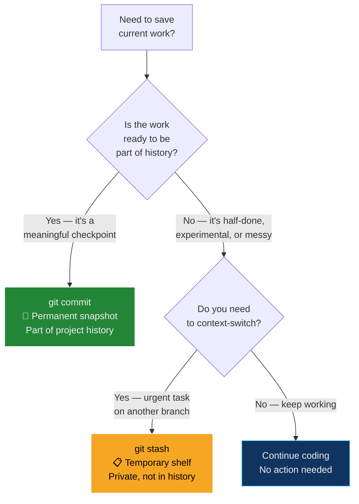
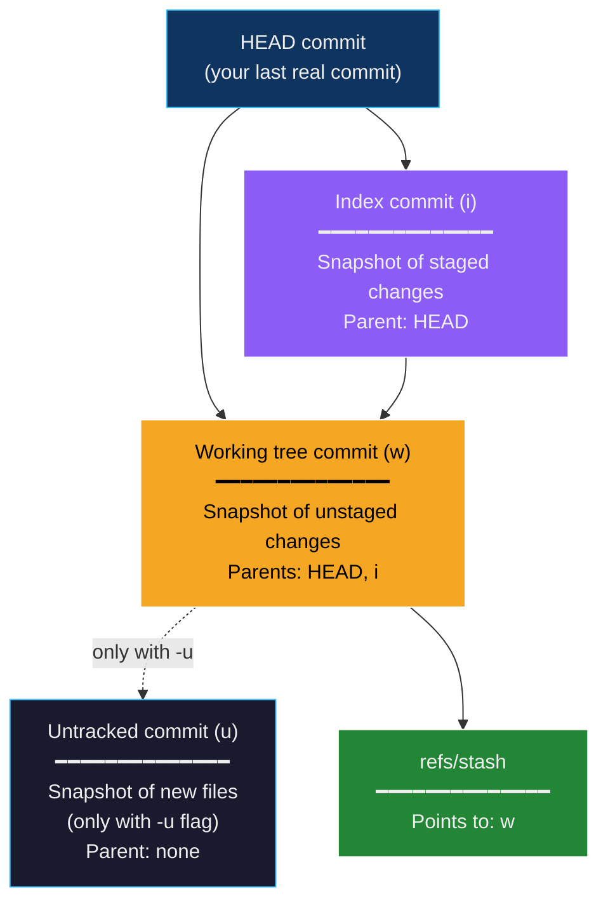
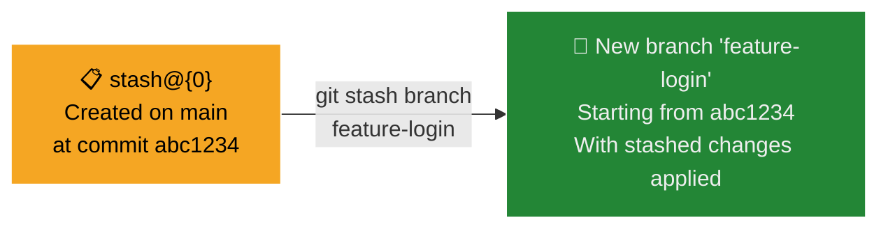
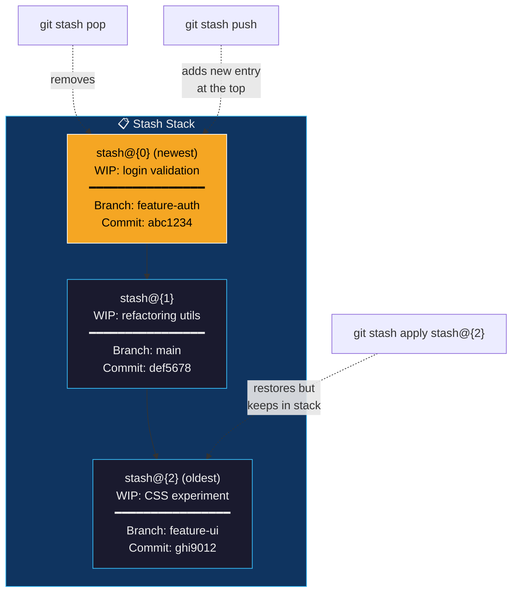
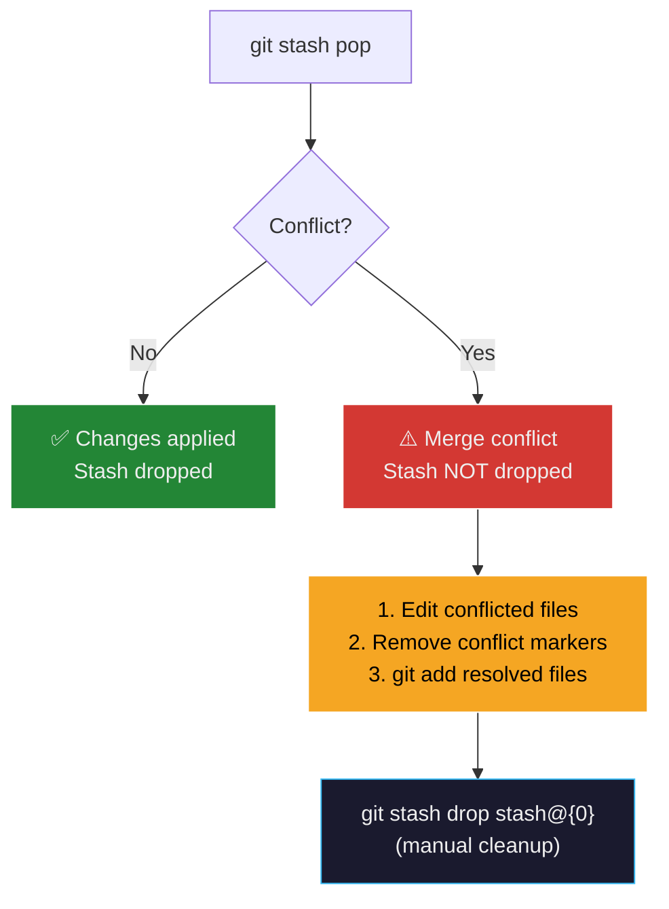
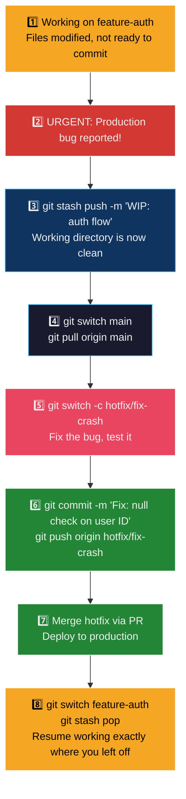
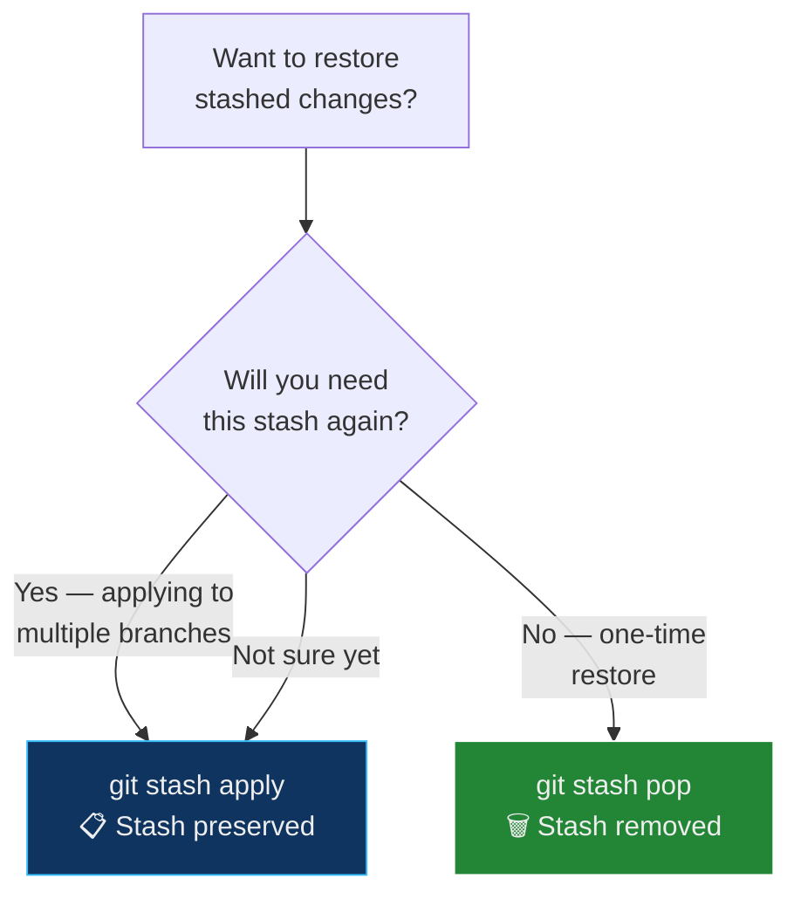

## The Painter's Drop Cloth Analogy

Before diving into `git stash`, consider how a **professional house painter** handles interruptions:

| House Painter | Git Stash |
| :--- | :--- |
| You're **halfway through painting** the living room — walls primed, rollers wet, paint trays open | You're **halfway through coding** a feature — files modified, some staged, nothing committed |
| The client calls: "**Emergency!** The bathroom pipe is leaking — drop everything and fix it now!" | Your manager messages: "**Critical bug** in production — switch to `main` and patch it immediately!" |
| You can't just leave wet paint rollers on the floor — they'll dry out and ruin the carpet | You can't just switch branches — Git will either carry your uncommitted changes with you (contaminating the other branch) or refuse to switch if there are conflicts |
| You **cover everything with a drop cloth** — rollers wrapped, paint trays sealed, labeled "Living Room — Blue, 2nd coat" | You run **`git stash`** — all uncommitted changes are saved to a named stack entry, and your working directory is restored to the last clean commit |
| You fix the pipe in the bathroom (a completely separate job) | You switch to `main`, fix the bug, commit, push |
| You come back to the living room, **remove the drop cloth**, and everything is exactly where you left it — rollers still wet, paint still fresh | You switch back, run **`git stash pop`**, and all your in-progress changes are restored exactly as you left them |
| You can have **multiple drop cloths** in different rooms — each labeled with the job name | You can have **multiple stashes** — each identified by an index (`stash@{0}`, `stash@{1}`) and a message |
| If you decide a room doesn't need painting after all, you **throw away the drop cloth and the supplies** without touching the walls | If your stashed work is no longer needed, you **`git stash drop`** it — the changes are discarded without ever being committed |

> **Key insight:** `git stash` is a **temporary shelf** for work-in-progress. It's not a commit — it doesn't appear in your project's history. It's a private, disposable save point that lets you context-switch instantly without losing anything.

---

## What Is Git Stash?

`git stash` temporarily saves uncommitted changes (both **staged** and **unstaged**) to a local stack, then reverts your working directory and staging area to match the last commit (`HEAD`). The stashed changes can be reapplied later — on the same branch, or even on a different branch.


### What Exactly Gets Stashed?

By default, `git stash` saves:

| What | Included by Default? | Flag to Include |
| :--- | :--- | :--- |
| **Modified tracked files** (unstaged changes) | ✅ Yes | *(default)* |
| **Staged changes** (in the index) | ✅ Yes | *(default)* |
| **Untracked files** (new files not yet `git add`-ed) | ❌ No | `--include-untracked` or `-u` |
| **Ignored files** (matched by `.gitignore`) | ❌ No | `--all` or `-a` |

```bash
# Default: save tracked modifications only
git stash

# Include untracked (new) files
git stash --include-untracked
git stash -u

# Include everything — even .gitignore'd files
git stash --all
git stash -a
```

> **Common pitfall:** If you created a new file but haven't run `git add` on it, a plain `git stash` will **leave it behind**. Use `git stash -u` to capture new files too.

---

## When to Use Stash vs Commit

Understanding when to stash versus when to commit is an important judgment call:



| Scenario | Use Stash? | Use Commit? | Reasoning |
| :--- | :--- | :--- | :--- |
| Half-written feature, need to switch branches for an urgent bug | ✅ **Stash** | ❌ | Work is incomplete — a commit would pollute history with broken code |
| Completed a logical unit of work (e.g., "Add login form validation") | ❌ | ✅ **Commit** | This is a meaningful checkpoint worth preserving |
| Experimenting with a risky refactor — want a safety net before going further | ❌ | ✅ **Commit** (on a branch) | A WIP commit on a feature branch is better than a stash you might forget |
| Quick context switch — check something on another branch, come right back | ✅ **Stash** | ❌ | Stash is faster and doesn't add noise to the log |
| Going home for the day, work is incomplete | Consider both | ✅ **WIP Commit** | Commits are pushed to the remote (backed up); stashes are local-only and can be lost if your machine dies |

> **Rule of thumb:** Stash is for **minutes to hours**. If you'll need the changes tomorrow or beyond, make a WIP commit on a branch instead — stashes are local-only and easy to forget.

---

## How Git Stash Works Internally

Under the hood, `git stash` creates **two (or three) special commit objects** that are not part of any branch:



| Internal Object | What It Captures | Analogy |
| :--- | :--- | :--- |
| **Index commit (`i`)** | The state of the staging area at the time of stash | The sealed paint trays (prepared but not applied) |
| **Working tree commit (`w`)** | The state of all tracked modified files | The wet rollers and brushes (active work) |
| **Untracked commit (`u`)** | New files not yet tracked (only with `-u`) | Unopened paint cans still in the box |

The stash is stored in `.git/refs/stash`, and the stack of stashes is managed via the **reflog** at `.git/logs/refs/stash`.

> **Why this matters:** Because stashes are real Git objects (commits), they're durable as long as the repository exists. They survive `git reset`, branch deletions, and other operations. However, they're **local-only** — they are never pushed to a remote.

---

## Stash Commands — Complete Reference

### 1. `git stash` — Save Changes to the Stack

Saves all uncommitted changes (staged + unstaged tracked files) and restores the working directory to `HEAD`.

```bash
git stash
```

**With a descriptive message** (highly recommended — stashes without messages are hard to identify later):

```bash
git stash push -m "WIP: login form validation logic"
```

**Example:**
```bash
echo "print('Work in progress')" > script.py
git add script.py
git stash push -m "WIP: adding script.py"
```

**Output:**
```
Saved working directory and index state WIP on main: d1a2b3e Update README
```

Your working directory is now clean — `script.py` is gone (saved in the stash).

#### Including Untracked and Ignored Files

```bash
# Include new untracked files
git stash -u
git stash --include-untracked

# Include absolutely everything (even .gitignore'd files)
git stash -a
git stash --all
```

#### Stashing Only Specific Files

```bash
# Stash only specific files (Git 2.13+)
git stash push -m "WIP: auth changes" src/auth.py src/login.py

# Stash only staged changes (keep unstaged changes in place)
git stash push --staged -m "Stash only what I've git-added"
```

---

### 2. `git stash list` — View All Stashes

Displays every entry in the stash stack, from newest (index 0) to oldest.

```bash
git stash list
```

**Output:**
```
stash@{0}: On main: WIP: login form validation logic
stash@{1}: WIP on feature-auth: a3b4c5d Add user model
stash@{2}: WIP on main: d1a2b3e Experimental refactor
```

| Component | Meaning |
| :--- | :--- |
| `stash@{0}` | The **index** — 0 is the most recent stash |
| `On main:` | The **branch** you were on when you stashed |
| `WIP: login form...` | The **message** (from `-m`) or the auto-generated description |

> **Tip:** The stash stack works like a LIFO (Last In, First Out) data structure. `stash@{0}` is always the most recent entry.

---

### 3. `git stash show` — Inspect a Stash's Contents

Shows a summary of what a stash contains (which files changed, how many lines were added/removed).

```bash
# Summary view (default)
git stash show
# or for a specific stash:
git stash show stash@{1}
```

**Output:**
```
 script.py | 1 +
 auth.py   | 5 +++--
 2 files changed, 4 insertions(+), 2 deletions(-)
```

**Detailed patch view** (shows the actual diff — line-by-line changes):

```bash
git stash show -p
git stash show -p stash@{1}
```

**Output:**
```diff
diff --git a/script.py b/script.py
new file mode 100644
--- /dev/null
+++ b/script.py
@@ -0,0 +1 @@
+print('Work in progress')
```

---

### 4. `git stash apply` — Restore Changes (Keep the Stash)

Applies the most recent stash to your working directory **without removing it** from the stack. The stash remains available for future use.

```bash
# Apply the most recent stash
git stash apply

# Apply a specific stash
git stash apply stash@{2}
```

**When to use `apply`:** When you want to apply the same stash to **multiple branches**, or when you want to verify the stash applies cleanly before deleting it.

**After applying:**
```bash
git stash list
# stash@{0}: On main: WIP: login form validation logic   ← Still there
```

#### Restoring the Staged State

By default, `git stash apply` restores everything as **unstaged** changes, even if some files were staged before stashing. To preserve the original staged/unstaged distinction:

```bash
git stash apply --index
```

| Flag | Effect |
| :--- | :--- |
| *(no flag)* | All changes restored as unstaged modifications |
| `--index` | Preserves the original staging — files that were `git add`-ed before stashing will be staged again |

---

### 5. `git stash pop` — Restore Changes and Delete the Stash

Applies the most recent stash **and removes it** from the stack in one step. This is the most common command for restoring stashed work.

```bash
# Pop the most recent stash
git stash pop

# Pop a specific stash
git stash pop stash@{1}
```

**Output:**
```
On branch main
Changes not staged for commit:
  (use "git add <file>..." to update what will be committed)
        modified:   script.py
Dropped stash@{0} (ea5b8e3...)
```

```bash
git stash list
# (No stash entries)     ← The stash was removed after successful apply
```

> **Important:** If `git stash pop` encounters a **merge conflict**, the stash is **not dropped**. You must resolve the conflict manually, then run `git stash drop stash@{0}` to clean up.

---

### 6. `git stash drop` — Delete a Specific Stash

Removes a specific stash from the stack without applying it. The changes are permanently discarded.

```bash
# Drop the most recent stash
git stash drop

# Drop a specific stash
git stash drop stash@{2}
```

**Output:**
```
Dropped stash@{2} (ea5b8e3...)
```

> **Caution:** Dropped stashes cannot be recovered through normal Git commands (though they technically persist in the reflog for a short time — see Recovery section below).

---

### 7. `git stash clear` — Delete All Stashes

Removes **every stash** from the stack. This is irreversible.

```bash
git stash clear
```

No output is produced. Verify with:
```bash
git stash list
# (No stash entries)
```

> **Warning:** Unlike `git stash drop` (which affects one entry), `clear` wipes the entire stack. There is no confirmation prompt.

---

### 8. `git stash branch` — Create a Branch from a Stash

Creates a new branch starting from the commit where the stash was originally created, applies the stash, and drops it from the stack.

```bash
git stash branch <new-branch-name>
git stash branch <new-branch-name> stash@{1}
```

**Example:**
```bash
git stash branch feature-login
```

**Output:**
```
Switched to a new branch 'feature-login'
On branch feature-login
Changes not staged for commit:
  (use "git add <file>..." to update what will be committed)
        modified:   script.py
Dropped stash@{0} (ea5b8e3...)
```

**When to use this:** When you stashed work on `main` but realize it should have been on a feature branch. Or when applying a stash to the current branch would cause conflicts (because the branch has changed since the stash was created), but applying it to a fresh branch from the original commit is clean.



---

## The Stash Stack — Understanding the Data Structure

The stash operates as a **stack** (LIFO — Last In, First Out):



| Operation | Effect on Stack |
| :--- | :--- |
| `git stash push` | Adds a new entry at position `stash@{0}`; all existing entries shift down (`stash@{0}` → `stash@{1}`, etc.) |
| `git stash pop` | Removes `stash@{0}` and applies it; all entries shift up (`stash@{1}` → `stash@{0}`, etc.) |
| `git stash apply` | Applies `stash@{0}` (or a specified entry) but **does not modify the stack** |
| `git stash drop stash@{1}` | Removes entry at position 1; entries below it shift up |
| `git stash clear` | Empties the entire stack |

> **Pro tip:** Always use `git stash push -m "descriptive message"` so you can identify stashes later. Without messages, you'll see generic "WIP on main: abc1234 commit msg" entries that are nearly impossible to distinguish.

---

## Handling Stash Conflicts

When you `apply` or `pop` a stash, Git performs a **merge** between the stashed changes and your current working directory. If the same lines have changed since the stash was created, a **conflict** occurs.



**Resolution steps:**

```bash
# 1. Attempt to pop the stash
git stash pop
# Output: CONFLICT (content): Merge conflict in auth.py

# 2. Open the conflicted file — same markers as merge conflicts
#    <<<<<<< Updated upstream
#    ... current branch code ...
#    =======
#    ... stashed code ...
#    >>>>>>> Stashed changes

# 3. Edit the file to resolve the conflict, remove markers

# 4. Stage the resolved file
git add auth.py

# 5. Since pop failed, the stash was NOT dropped — drop it manually
git stash drop stash@{0}
```

**Avoiding conflicts:**
- Stash for **short durations** — the longer you wait, the more the branch diverges
- Use `git stash branch` to apply stashes to a fresh branch from the original commit point (guaranteed conflict-free)

---

## Recovering Dropped Stashes

If you accidentally drop or clear a stash, it may be recoverable for a limited time using Git's **reflog** and **fsck**:

```bash
# Method 1: Check the stash reflog (if it exists)
git log --walk-reflogs --oneline refs/stash

# Method 2: Find unreachable stash commits
git fsck --unreachable | grep commit

# Method 3: If you know the approximate time
git log --all --oneline --walk-reflogs | grep "WIP on"
```

Once you find the commit hash:

```bash
# Inspect it
git show <hash>

# Re-apply it
git stash apply <hash>
```

> **Warning:** This only works if Git hasn't garbage-collected the unreachable objects yet (typically within 30 days). Don't rely on this as a safety net — treat `git stash drop` and `git stash clear` as destructive operations.

---

## Real-World Workflow: Emergency Bug Fix During Feature Development

This is the most common stash scenario in professional development:



### Step-by-Step

```bash
# ─── You're deep in feature work ──────────────────────
git switch feature-auth
echo "print('Incomplete auth logic')" > auth.py
git add auth.py
# ... more changes across multiple files ...

# ─── ALERT: Critical production bug! ──────────────────
git stash push -m "WIP: auth flow - halfway through OAuth integration"

# ─── Switch to main and create a hotfix branch ───────
git switch main
git pull origin main
git switch -c hotfix/fix-null-crash

# ─── Fix the bug ─────────────────────────────────────
echo "if user_id is None: return 400" > fix.py
git add fix.py
git commit -m "Fix: add null check for user_id in /api/profile"
git push -u origin hotfix/fix-null-crash
# Open PR, get approval, merge

# ─── Return to your feature work ─────────────────────
git switch feature-auth
git stash pop
# auth.py is back with your in-progress changes — exactly where you left off
```

---

## Command Summary Table

| Command | Effect | Stash Remains? |
| :--- | :--- | :--- |
| `git stash` / `git stash push` | Save tracked changes, clean working directory | ✅ Added to stack |
| `git stash push -m "message"` | Same, with a descriptive label | ✅ Added to stack |
| `git stash push -u` | Include untracked files | ✅ Added to stack |
| `git stash push --staged` | Stash only staged changes | ✅ Added to stack |
| `git stash push -- file1 file2` | Stash only specific files | ✅ Added to stack |
| `git stash list` | Show all stash entries | *(read-only)* |
| `git stash show [-p]` | Inspect stash contents (summary or diff) | *(read-only)* |
| `git stash apply [stash@{n}]` | Restore changes | ✅ Stays in stack |
| `git stash apply --index` | Restore changes, preserving staged state | ✅ Stays in stack |
| `git stash pop [stash@{n}]` | Restore changes and remove from stack | ❌ Removed on success |
| `git stash drop [stash@{n}]` | Delete a stash without applying | ❌ Removed |
| `git stash clear` | Delete ALL stashes | ❌ All removed |
| `git stash branch <name>` | Create branch from stash, apply, and drop | ❌ Removed |

---

## Suggested Mermaid.js Diagrams

### Diagram 1: Stash Lifecycle — Save, Switch, Fix, Restore

```mermaid
flowchart LR
    WORK["🔧 Working on feature<br/>(dirty working dir)"]
    STASH["📋 git stash<br/>(changes saved)"]
    SWITCH["🔀 git switch main<br/>(clean working dir)"]
    FIX["🐛 Fix bug + commit"]
    RETURN["🔀 git switch feature"]
    POP["📋 git stash pop<br/>(changes restored)"]

    WORK --> STASH --> SWITCH --> FIX --> RETURN --> POP

    style WORK fill:#f5a623,stroke:#fff,color:#000
    style STASH fill:#0f3460,stroke:#38bdf8,color:#eee
    style SWITCH fill:#1a1a2e,stroke:#38bdf8,color:#eee
    style FIX fill:#e94560,stroke:#fff,color:#eee
    style RETURN fill:#1a1a2e,stroke:#38bdf8,color:#eee
    style POP fill:#238636,stroke:#fff,color:#eee
```



### Diagram 2: Apply vs Pop Decision



---

## Glossary

| Term | Definition |
| :--- | :--- |
| **Stash** | A temporary, local-only storage mechanism in Git that saves uncommitted changes to a stack and restores the working directory to the last commit (`HEAD`) |
| **Stash Stack** | A LIFO (Last In, First Out) data structure where stash entries are stored — the most recent stash is always at index `stash@{0}` |
| **`stash@{n}`** | The notation used to reference a specific stash entry by its position in the stack — `stash@{0}` is the newest, `stash@{1}` is the next oldest, and so on |
| **`git stash push`** | The full form of the stash-save command — supports `-m` (message), `-u` (untracked), `--staged`, and file-specific stashing. `git stash` is a shorthand for `git stash push` |
| **`git stash pop`** | Restores the most recent stash and **removes it** from the stack — the most common way to restore stashed work |
| **`git stash apply`** | Restores a stash **without removing it** from the stack — useful when applying the same stash to multiple branches |
| **`git stash drop`** | Permanently deletes a specific stash entry without applying it |
| **`git stash clear`** | Permanently deletes **all** stash entries from the stack |
| **`git stash branch`** | Creates a new branch from the commit where the stash was originally created, applies the stash, and removes it from the stack |
| **`git stash show`** | Displays a summary (or detailed diff with `-p`) of the changes stored in a stash entry |
| **`--include-untracked` / `-u`** | A flag for `git stash push` that includes **new, untracked files** (files not yet `git add`-ed) in the stash |
| **`--all` / `-a`** | A flag for `git stash push` that includes both untracked **and** ignored files (matched by `.gitignore`) in the stash |
| **`--staged`** | A flag for `git stash push` (Git 2.35+) that stashes **only** the changes in the staging area, leaving unstaged modifications in place |
| **`--index`** | A flag for `git stash apply`/`pop` that preserves the original staged/unstaged distinction — files that were staged before stashing are re-staged upon restore |
| **Working Directory** | The actual files on disk that you see and edit — `git stash` temporarily reverts this to match the last commit |
| **Staging Area (Index)** | The intermediate area where changes are prepared for commit — `git stash` captures and then clears this |
| **LIFO** | Last In, First Out — a data structure where the most recently added item is the first to be removed (like a stack of plates) |
| **Reflog** | Git's internal log of all reference updates — can be used to find recently dropped stashes that haven't been garbage-collected yet |
| **Context Switch** | The act of stopping work on one task and starting another — the primary reason `git stash` exists |
| **WIP Commit** | A "Work In Progress" commit on a feature branch — an alternative to stashing when changes need to be preserved long-term or backed up to a remote |
| **Merge Conflict (in stash)** | Occurs when applying a stash whose changes conflict with modifications made to the same lines since the stash was created — resolved the same way as branch merge conflicts |

---

## Interview & Exam Preparation

### Potential Interview Questions

**Q1: What is `git stash` and how does it differ from `git commit`? When would you use one over the other?**

**Model Answer:**

`git stash` and `git commit` both save the current state of your work, but they serve fundamentally different purposes:

- **`git stash`** saves uncommitted changes to a **local, temporary stack** and is **not part of the project's commit history**. The stash is private to your machine — it's never pushed to a remote. It's designed for short-term context switches: you stash, do something else, and come back to restore your work.

- **`git commit`** creates a **permanent snapshot** in the repository's commit history. It has a message, author, timestamp, and SHA-1 hash. It's part of the project's shared timeline and is pushed to remotes for collaboration.

**When to stash:** You're midway through a feature and need to urgently switch branches — the work isn't ready for a commit (it might not compile, tests might fail). You stash, fix the urgent issue, and pop the stash when you return. Stash is for minutes to hours.

**When to commit:** The work represents a logical, meaningful unit of progress. Even a WIP commit on a feature branch is preferable to a stash if you'll need the changes the next day, because stashes are local-only (not backed up) and easy to forget. Commits are also required before creating Pull Requests.

**Key trade-off:** Stash is faster and cleaner for short interruptions. Commit is safer and more durable for anything beyond a quick context switch.

---

**Q2: Explain the difference between `git stash apply` and `git stash pop`. In what scenario would you prefer `apply` over `pop`?**

**Model Answer:**

Both commands restore stashed changes to the working directory, but they differ in **what happens to the stash entry afterward**:

- **`git stash apply`** restores the changes but **keeps the stash in the stack**. The stash entry remains available at its original index.
- **`git stash pop`** restores the changes **and removes the stash** from the stack (on success). It's equivalent to `apply` followed by `drop`.

**I would prefer `apply` in these scenarios:**

1. **Applying the same stash to multiple branches** — for example, I stashed a utility function that's needed on both `feature-A` and `feature-B`. I `apply` on branch A, switch to branch B, and `apply` again. If I had used `pop`, the stash would be gone after the first restore.

2. **Verifying before deleting** — if I'm unsure whether the stash will apply cleanly (the branch may have changed significantly), I `apply` first, verify everything works, then manually `drop` the stash. This avoids the edge case where `pop` encounters a conflict and leaves the stash in an ambiguous state (applied but not dropped).

3. **Keeping a backup** — when experimenting, I might want to apply a stash, try something, and if it doesn't work out, `git checkout -- .` to discard the applied changes and try again. The stash is still there because I used `apply`.

**Default choice:** For most everyday use, `pop` is fine — it's a one-step restore-and-cleanup. Use `apply` when you have a specific reason to preserve the stash.

---

**Q3: You have three stash entries. You accidentally run `git stash clear` and lose all of them. One contained critical work. How would you attempt to recover the lost stash, and what preventive measures would you recommend?**

**Model Answer:**

**Recovery attempt:**

Git stash entries are internally stored as commit objects. When `clear` removes them from the stash stack, the commit objects are not immediately garbage-collected — they become **unreachable objects** that persist until `git gc` runs (typically after 30 days).

```bash
# Step 1: Find unreachable commits that look like stashes
git fsck --unreachable | grep commit

# Step 2: For each candidate commit, inspect its content
git show <commit-hash>
# Look for the one that contains your critical work

# Step 3: Re-apply the found commit
git stash apply <commit-hash>
# Or create a branch from it:
git branch recovered-work <commit-hash>
```

Alternative approach using reflog (if reflog entries haven't expired):
```bash
git log --walk-reflogs --all --oneline | grep "WIP"
```

**However, this is not guaranteed** — if `git gc` has already run, or if the reflogs have expired, the commits may be permanently gone.

**Preventive measures I would recommend:**

1. **Use descriptive messages**: `git stash push -m "CRITICAL: payment gateway integration"` — makes stashes identifiable and signals importance.
2. **Don't stash critical work long-term** — if the work is important, make a WIP commit on a branch: `git commit -m "WIP: DO NOT MERGE - payment gateway"`. Commits are pushed to remotes and backed up.
3. **Use `git stash drop stash@{n}` instead of `git stash clear`** — drop stashes one at a time after verifying you don't need them.
4. **Set up automatic Git GC intervals** wisely — the default 30-day expiry for unreachable objects provides a recovery window.
5. **Keep the stash stack small** — a stash with 10+ entries is a sign that stashing is being overused. Each entry should be short-lived.

---

## Quick Reference Card

```bash
# ─── Saving to Stash ─────────────────────────────────────
git stash                               # Stash tracked changes
git stash push -m "description"         # Stash with a message (recommended)
git stash -u                            # Include untracked files
git stash -a                            # Include untracked + ignored files
git stash push --staged                 # Stash only staged changes
git stash push -- file1.py file2.py     # Stash specific files only

# ─── Viewing Stashes ─────────────────────────────────────
git stash list                          # List all stash entries
git stash show                          # Summary of most recent stash
git stash show -p                       # Full diff of most recent stash
git stash show stash@{2}               # Summary of a specific stash
git stash show -p stash@{2}            # Full diff of a specific stash

# ─── Restoring from Stash ────────────────────────────────
git stash pop                           # Apply + remove most recent stash
git stash pop stash@{1}                # Apply + remove a specific stash
git stash apply                         # Apply but keep in stack
git stash apply --index                 # Apply preserving staged state
git stash apply stash@{2}             # Apply a specific stash

# ─── Deleting Stashes ────────────────────────────────────
git stash drop                          # Delete most recent stash
git stash drop stash@{1}              # Delete a specific stash
git stash clear                         # Delete ALL stashes (irreversible)

# ─── Advanced ────────────────────────────────────────────
git stash branch new-feature            # Create branch from stash + apply + drop
git stash branch fix-auth stash@{2}   # Same, for a specific stash

# ─── Recovery (after accidental drop/clear) ──────────────
git fsck --unreachable | grep commit    # Find orphaned stash commits
git show <hash>                         # Inspect a candidate
git stash apply <hash>                  # Recover it
```

---

*Last updated: May 2026*