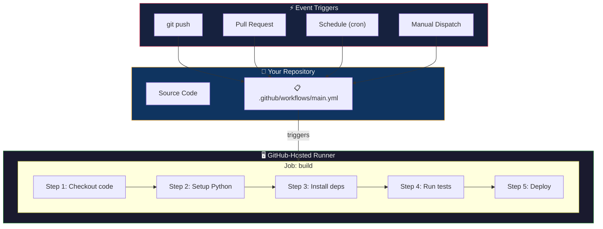
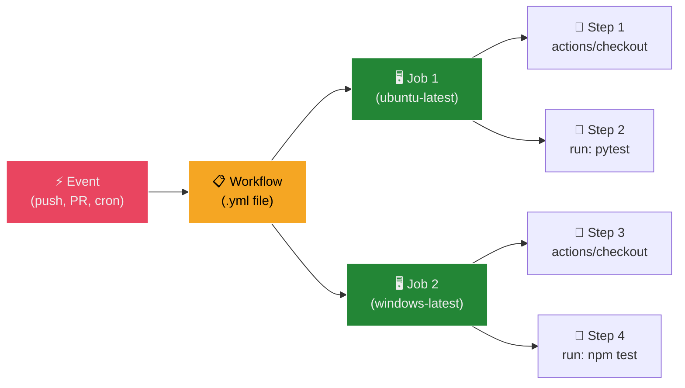
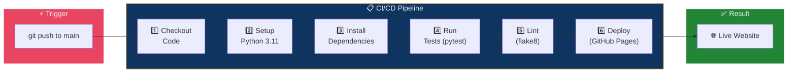
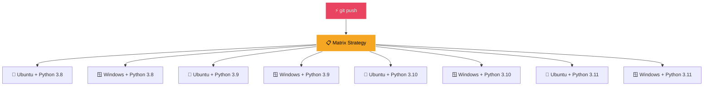
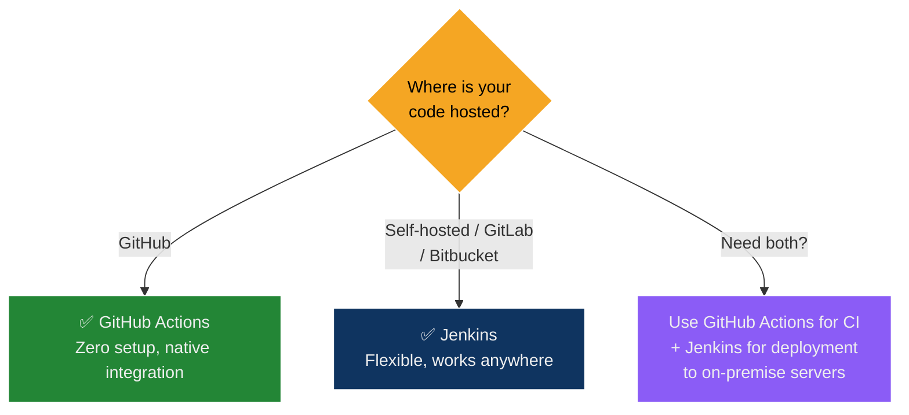

## The Assembly Robot Analogy — Understanding GitHub Actions

Imagine you run a **car factory** with an automated assembly line:

| Factory Concept | GitHub Actions Equivalent |
| :--- | :--- |
| The factory blueprint | **Workflow file** (`.github/workflows/main.yml`) — defines the entire assembly process |
| "Start the line when a new order arrives" | **Event trigger** (`on: push`) — what starts the workflow |
| An assembly station (welding, painting, testing) | **Job** — a group of tasks that run on one machine |
| A specific task at a station (attach door, spray paint) | **Step** — a single command or action within a job |
| A pre-built robotic arm module | **Action** — a reusable component from the Marketplace (e.g., `actions/checkout`) |
| The conveyor belt connecting stations | **Runner** — the virtual machine that executes the job |
| Quality control before shipping | **Tests and linting** — automated checks before deployment |

> **Key insight:** GitHub Actions turns your repository into a self-operating factory. Every `git push` triggers an automated pipeline that builds, tests, lints, and deploys — with zero manual intervention.

---

## What is GitHub Actions?

**GitHub Actions** is GitHub's built-in CI/CD platform that automates software workflows directly from your repository. Unlike Jenkins (which requires a separate server), GitHub Actions runs on GitHub's infrastructure with zero setup.

| Aspect | Details |
| :--- | :--- |
| **Type** | Cloud-native CI/CD platform |
| **Configuration** | YAML files in `.github/workflows/` |
| **Execution** | GitHub-hosted runners (free tier included) or self-hosted |
| **Triggers** | Push, pull request, schedule (cron), manual dispatch, and 30+ event types |
| **Marketplace** | 20,000+ pre-built actions for common tasks |
| **Cost** | Free for public repos; 2,000 minutes/month for private repos (free tier) |

### Why GitHub Actions Over Other CI/CD Tools?

| Advantage | Explanation |
| :--- | :--- |
| **Zero infrastructure** | No servers to install, configure, or maintain |
| **Native GitHub integration** | Triggers from any GitHub event (push, PR, issue, release) |
| **YAML configuration** | Simple, readable, version-controlled alongside your code |
| **Matrix builds** | Test across multiple OS/language versions in parallel — one line of config |
| **Marketplace ecosystem** | Pre-built actions for Docker, AWS, Kubernetes, notifications, etc. |
| **Secrets management** | Built-in encrypted secrets for API keys, tokens, passwords |

---

## Architecture — How GitHub Actions Works



### The Four Building Blocks



| Block | What It Is | Example |
| :--- | :--- | :--- |
| **Event** | What triggers the workflow | `push`, `pull_request`, `schedule`, `workflow_dispatch` |
| **Workflow** | The full automation pipeline (YAML file) | `.github/workflows/main.yml` |
| **Job** | A set of steps that run on one runner | `build`, `test`, `deploy` |
| **Step** | A single task within a job | `actions/checkout@v4` or `run: pytest` |
| **Action** | A reusable, packaged step from the Marketplace | `actions/setup-python@v4` |
| **Runner** | The VM that executes the job | `ubuntu-latest`, `windows-latest`, `macos-latest` |

### Two Types of Steps

| Type | Syntax | Example |
| :--- | :--- | :--- |
| **Action** (pre-built) | `uses: owner/action@version` | `uses: actions/checkout@v4` |
| **Shell command** | `run: <command>` | `run: pytest` or `run: npm install` |

---

## Workflow YAML Anatomy — Line by Line

```yaml
# 1. WORKFLOW NAME — appears in GitHub Actions tab
name: CI/CD Pipeline

# 2. EVENT TRIGGERS — when does this run?
on:
  push:
    branches:
      - main              # Only on pushes to main
  pull_request:
    branches:
      - main              # Also on PRs targeting main
  schedule:
    - cron: "0 0 * * *"   # Daily at midnight UTC

# 3. JOBS — what to do
jobs:
  build:                   # Job ID (your choice)
    runs-on: ubuntu-latest # Runner OS

    # 4. STEPS — sequential tasks within the job
    steps:
      # Step 1: Check out the repository code
      - name: Checkout repository
        uses: actions/checkout@v4

      # Step 2: Set up the language runtime
      - name: Set up Python
        uses: actions/setup-python@v4
        with:
          python-version: '3.11'

      # Step 3: Install dependencies
      - name: Install dependencies
        run: |
          python -m pip install --upgrade pip
          pip install -r requirements.txt

      # Step 4: Run tests
      - name: Run Tests
        run: pytest

      # Step 5: Lint the code
      - name: Run Linter
        run: flake8 .

      # Step 6: Deploy
      - name: Deploy to GitHub Pages
        uses: peaceiris/actions-gh-pages@v4
        with:
          github_token: ${{ secrets.GITHUB_TOKEN }}
          publish_dir: ./build
```

### Key YAML Fields Explained

| Field | Purpose |
| :--- | :--- |
| `name:` | Display name in the GitHub Actions UI |
| `on:` | Event trigger configuration |
| `on.push.branches` | Only trigger on pushes to specific branches |
| `on.schedule.cron` | Cron expression for scheduled runs |
| `jobs.<id>.runs-on` | Which OS the runner uses |
| `steps[].name` | Human-readable label for the step |
| `steps[].uses` | Reference to a pre-built action (`owner/repo@version`) |
| `steps[].with` | Input parameters for the action |
| `steps[].run` | Shell command(s) to execute |
| `${{ secrets.* }}` | Reference to encrypted repository secrets |

---

## Building a Pipeline — Step by Step

### Step 1: Checkout Code

Every workflow starts by cloning your repository into the runner:

```yaml
- name: Checkout repository
  uses: actions/checkout@v4
```

> Without this step, the runner has an **empty filesystem** — none of your code exists on it yet.

### Step 2: Set Up Language Runtime

```yaml
# Python
- name: Set up Python
  uses: actions/setup-python@v4
  with:
    python-version: '3.11'

# Node.js
- name: Set up Node.js
  uses: actions/setup-node@v4
  with:
    node-version: '18'
```

### Step 3: Install Dependencies

```yaml
# Python
- name: Install dependencies
  run: |
    python -m pip install --upgrade pip
    pip install -r requirements.txt

# Node.js
- name: Install dependencies
  run: npm install
```

> The `|` (pipe) character in YAML allows **multi-line commands**. Each line runs sequentially.

### Step 4: Run Tests

```yaml
# Python (pytest)
- name: Run Tests
  run: pytest

# Node.js (Jest/Mocha)
- name: Run Tests
  run: npm test
```

### Step 5: Lint Code (Code Quality)

Linters enforce coding standards and catch potential bugs **before** they reach production:

```yaml
# Python (flake8)
- name: Run Linter
  run: flake8 .

# JavaScript (ESLint)
- name: Run Linter
  run: npm run lint
```

### Step 6: Build and Deploy

```yaml
# Build a static site
- name: Build Project
  run: npm run build

# Deploy to GitHub Pages
- name: Deploy to GitHub Pages
  uses: peaceiris/actions-gh-pages@v4
  with:
    github_token: ${{ secrets.GITHUB_TOKEN }}
    publish_dir: ./build
```

| Parameter | Purpose |
| :--- | :--- |
| `github_token` | Automatically provided by GitHub — authenticates the deployment |
| `publish_dir` | Which folder to publish (e.g., `./build`, `./dist`, `./public`) |

---

## The Complete Pipeline Visualized



> If **any step fails**, the pipeline stops immediately. The failing step is highlighted in red in the GitHub Actions UI, with full logs for debugging.

---

## Event Triggers — Deep Dive

### Common Triggers

| Trigger | Syntax | When It Runs |
| :--- | :--- | :--- |
| **Push** | `on: push` | Every push to any branch |
| **Push to specific branch** | `on: push: branches: [main]` | Only pushes to `main` |
| **Pull Request** | `on: pull_request` | When a PR is opened, updated, or reopened |
| **Schedule (Cron)** | `on: schedule: - cron: "0 0 * * *"` | At midnight UTC daily |
| **Manual** | `on: workflow_dispatch` | Click "Run workflow" button in GitHub UI |
| **Release** | `on: release: types: [published]` | When a release is published |

### Cron Syntax Reference

```text
┌───────────── minute (0 - 59)
│ ┌───────────── hour (0 - 23)
│ │ ┌───────────── day of month (1 - 31)
│ │ │ ┌───────────── month (1 - 12)
│ │ │ │ ┌───────────── day of week (0 - 6, Sun=0)
│ │ │ │ │
* * * * *
```

| Expression | Meaning |
| :--- | :--- |
| `0 0 * * *` | Every day at midnight UTC |
| `0 */6 * * *` | Every 6 hours |
| `0 9 * * 1` | Every Monday at 9:00 AM UTC |
| `0 0 1 * *` | First day of every month |

---

## Secrets Management

Never hardcode API keys or tokens in your workflow. Use **GitHub Secrets**:

1. Go to your repo → **Settings → Secrets and variables → Actions**
2. Click **New repository secret**
3. Add name (e.g., `DOCKER_PASSWORD`) and value

Reference in your workflow:

```yaml
- name: Login to Docker Hub
  run: echo "${{ secrets.DOCKER_PASSWORD }}" | docker login -u "${{ secrets.DOCKER_USERNAME }}" --password-stdin
```

> `${{ secrets.GITHUB_TOKEN }}` is automatically available in every workflow — no setup needed. It provides scoped access to the current repository.

---

## Matrix Builds — Parallel Testing

The `strategy.matrix` feature lets you run the **same job** across multiple configurations simultaneously. This is one of GitHub Actions' most powerful features.

```yaml
name: Matrix Build

on: [push]

jobs:
  test:
    runs-on: ${{ matrix.os }}
    strategy:
      matrix:
        python-version: [3.8, 3.9, '3.10', '3.11']
        os: [ubuntu-latest, windows-latest]

    steps:
      - name: Checkout
        uses: actions/checkout@v4

      - name: Set up Python ${{ matrix.python-version }}
        uses: actions/setup-python@v4
        with:
          python-version: ${{ matrix.python-version }}

      - name: Install dependencies
        run: pip install -r requirements.txt

      - name: Run Tests
        run: pytest
```

### What This Creates — 8 Parallel Jobs



**4 Python versions × 2 OS = 8 parallel jobs** — all running simultaneously on separate runners. If any single combination fails, you know exactly which platform/version has the issue.

### Matrix Variables

| Variable | Purpose |
| :--- | :--- |
| `${{ matrix.python-version }}` | Current Python version being tested |
| `${{ matrix.os }}` | Current OS being tested |

> **Note:** Enclose versions like `3.10` in quotes (`'3.10'`) — otherwise YAML interprets it as `3.1` (a floating-point number).

---

## GitHub Actions vs Jenkins

| Feature | GitHub Actions | Jenkins |
| :--- | :--- | :--- |
| **Setup** | Zero — built into GitHub | Manual installation + server maintenance |
| **Configuration** | YAML (`.github/workflows/`) | Groovy (`Jenkinsfile`) |
| **Infrastructure** | GitHub-hosted runners (free tier) | Self-hosted agents (you manage) |
| **Triggers** | 30+ GitHub event types | Webhooks, cron, SCM polling |
| **Parallel execution** | `strategy.matrix` (one line) | `parallel` block (verbose Groovy) |
| **Plugins/Actions** | 20,000+ marketplace actions | 1,800+ plugins |
| **Secrets** | Built-in encrypted secrets | Credentials plugin required |
| **Cost** | Free for public repos; 2,000 min/month private | Free (self-hosted), but server costs |
| **Best for** | Cloud-native, GitHub-hosted projects | On-premise, custom infrastructure |

### Side-by-Side: Parallel Execution

**GitHub Actions** — 3 lines of matrix config:

```yaml
strategy:
  matrix:
    python-version: [3.8, 3.9, '3.10']
    os: [ubuntu-latest, windows-latest]
```

**Jenkins** — verbose Groovy with manual stage definitions:

```groovy
pipeline {
    agent any
    stages {
        stage('Parallel Execution') {
            parallel {
                stage('Python 3.8 - Ubuntu') {
                    agent { label 'ubuntu' }
                    steps { sh 'python3 -m pytest' }
                }
                stage('Python 3.8 - Windows') {
                    agent { label 'windows' }
                    steps { bat 'python -m pytest' }
                }
                stage('Python 3.9 - Ubuntu') {
                    agent { label 'ubuntu' }
                    steps { sh 'python3 -m pytest' }
                }
                stage('Python 3.9 - Windows') {
                    agent { label 'windows' }
                    steps { bat 'python -m pytest' }
                }
            }
        }
    }
}
```

> **Verdict:** GitHub Actions achieves the same parallelism in 3 lines that takes 20+ lines in Jenkins — and auto-provisions the runners.

### When to Use Which



---

## Docker Integration — Build and Push Images

A common DevOps workflow: build a Docker image on every push, then push it to Docker Hub.

```yaml
name: Docker Build & Push

on:
  push:
    branches: [main]

jobs:
  docker:
    runs-on: ubuntu-latest
    steps:
      - name: Checkout
        uses: actions/checkout@v4

      - name: Login to Docker Hub
        uses: docker/login-action@v3
        with:
          username: ${{ secrets.DOCKER_USERNAME }}
          password: ${{ secrets.DOCKER_PASSWORD }}

      - name: Build and Push
        uses: docker/build-push-action@v6
        with:
          push: true
          tags: ${{ secrets.DOCKER_USERNAME }}/myapp:latest
```

This is the **GitHub Actions equivalent** of the Jenkins pipeline from Experiment 7 — but in 20 lines of YAML instead of 50+ lines of Groovy + Docker-outside-of-Docker configuration.

---

## Common Marketplace Actions

| Action | Purpose |
| :--- | :--- |
| `actions/checkout@v4` | Clones repository code into the runner |
| `actions/setup-python@v4` | Installs Python with specified version |
| `actions/setup-node@v4` | Installs Node.js with specified version |
| `actions/upload-artifact@v4` | Saves build outputs for later download |
| `actions/download-artifact@v4` | Downloads artifacts from a previous job |
| `docker/login-action@v3` | Authenticates to Docker Hub / ECR / GHCR |
| `docker/build-push-action@v6` | Builds and pushes Docker images |
| `peaceiris/actions-gh-pages@v4` | Deploys to GitHub Pages |
| `aws-actions/configure-aws-credentials@v4` | Configures AWS CLI credentials |

---

## Multi-Job Workflows with Dependencies

Jobs run **in parallel** by default. Use `needs:` to create dependencies:

```yaml
jobs:
  test:
    runs-on: ubuntu-latest
    steps:
      - uses: actions/checkout@v4
      - run: pytest

  build:
    needs: test                    # Only runs if 'test' succeeds
    runs-on: ubuntu-latest
    steps:
      - uses: actions/checkout@v4
      - run: npm run build

  deploy:
    needs: build                   # Only runs if 'build' succeeds
    runs-on: ubuntu-latest
    steps:
      - uses: actions/checkout@v4
      - run: echo "Deploying..."
```


---

## Glossary

| Term | Definition |
| :--- | :--- |
| **GitHub Actions** | GitHub's built-in CI/CD platform for automating workflows |
| **Workflow** | A YAML-defined automation process in `.github/workflows/` |
| **Event** | A trigger that starts a workflow (push, PR, cron, manual) |
| **Job** | A set of steps that execute on a single runner |
| **Step** | A single task within a job — either an action or a shell command |
| **Action** | A reusable, packaged component from the GitHub Marketplace |
| **Runner** | The virtual machine that executes a job (Ubuntu, Windows, macOS) |
| **Matrix** | Strategy that creates parallel jobs from combinations of variables |
| **YAML** | Human-readable data serialization format used for workflow configuration |
| **Trigger** | The event that causes a workflow to execute |
| **`on:`** | YAML key that defines which events trigger the workflow |
| **`runs-on:`** | Specifies which OS the runner should use |
| **`uses:`** | References a pre-built action from the Marketplace |
| **`run:`** | Executes a shell command directly on the runner |
| **`with:`** | Passes input parameters to an action |
| **`needs:`** | Creates a dependency between jobs (sequential execution) |
| **Secrets** | Encrypted environment variables stored in repo settings |
| **`${{ secrets.* }}`** | Expression syntax to reference encrypted secrets |
| **Marketplace** | GitHub's catalog of 20,000+ pre-built actions |
| **Self-hosted runner** | A machine you manage that runs GitHub Actions jobs |
| **Cron** | Time-based scheduling syntax for triggering workflows |
| **Artifact** | A file produced by a workflow (build output, test results, logs) |
| **CI/CD** | Continuous Integration / Continuous Delivery — automating build, test, deploy |

---

## Exam / Interview Prep

### Q1: What are the four main components of a GitHub Actions workflow, and how do they relate?

**Answer:** The four components are: (1) **Event** — the trigger that starts the workflow (e.g., `push`, `pull_request`, `schedule`). (2) **Workflow** — the complete YAML pipeline definition stored in `.github/workflows/`. (3) **Job** — a set of steps that run on a single runner; multiple jobs run in parallel by default unless linked with `needs:`. (4) **Step** — a single task within a job, either a pre-built action (`uses:`) or a shell command (`run:`). The hierarchy is: Event → triggers Workflow → contains Jobs → each Job has Steps.

### Q2: How does `strategy.matrix` work in GitHub Actions, and why is it useful?

**Answer:** The `strategy.matrix` feature creates **parallel jobs** from combinations of variables. For example, defining `python-version: [3.8, 3.9, 3.10]` and `os: [ubuntu-latest, windows-latest]` creates 3 × 2 = 6 parallel jobs, each testing a different Python version on a different OS. This is useful because it ensures your code works across all supported environments **simultaneously** — what would take 6 sequential test runs happens in the time of one. Each variable is accessible via `${{ matrix.variable-name }}` in the workflow.

### Q3: Compare GitHub Actions and Jenkins for CI/CD. When would you choose one over the other?

**Answer:** **GitHub Actions** is cloud-native, requires zero infrastructure setup, uses YAML configuration, and integrates natively with GitHub events. It excels for open-source projects and GitHub-hosted codebases with its free tier and marketplace of 20,000+ actions. **Jenkins** requires manual installation and server maintenance, uses Groovy-based pipelines, and needs self-hosted agents. However, Jenkins offers more flexibility for on-premise deployments, custom infrastructure, and integration with non-GitHub version control systems. **Choose GitHub Actions** for cloud-first, GitHub-hosted projects. **Choose Jenkins** for on-premise environments, legacy systems, or when you need deep customization and control over the build infrastructure.

---

## Quick Reference Card

```yaml
# ─── Minimal Workflow ───
name: CI
on: [push]
jobs:
  build:
    runs-on: ubuntu-latest
    steps:
      - uses: actions/checkout@v4
      - run: echo "Hello, CI!"

# ─── Common Triggers ───
on:
  push:
    branches: [main]
  pull_request:
    branches: [main]
  schedule:
    - cron: "0 0 * * *"
  workflow_dispatch:            # Manual trigger

# ─── Matrix Builds ───
strategy:
  matrix:
    node-version: [16, 18, 20]
    os: [ubuntu-latest, windows-latest]

# ─── Job Dependencies ───
jobs:
  test:
    runs-on: ubuntu-latest
    steps: [...]
  deploy:
    needs: test
    runs-on: ubuntu-latest
    steps: [...]

# ─── Secrets ───
${{ secrets.MY_SECRET }}
${{ secrets.GITHUB_TOKEN }}       # Auto-provided

# ─── Common Actions ───
uses: actions/checkout@v4
uses: actions/setup-python@v4
uses: actions/setup-node@v4
uses: docker/build-push-action@v6
uses: peaceiris/actions-gh-pages@v4
```
