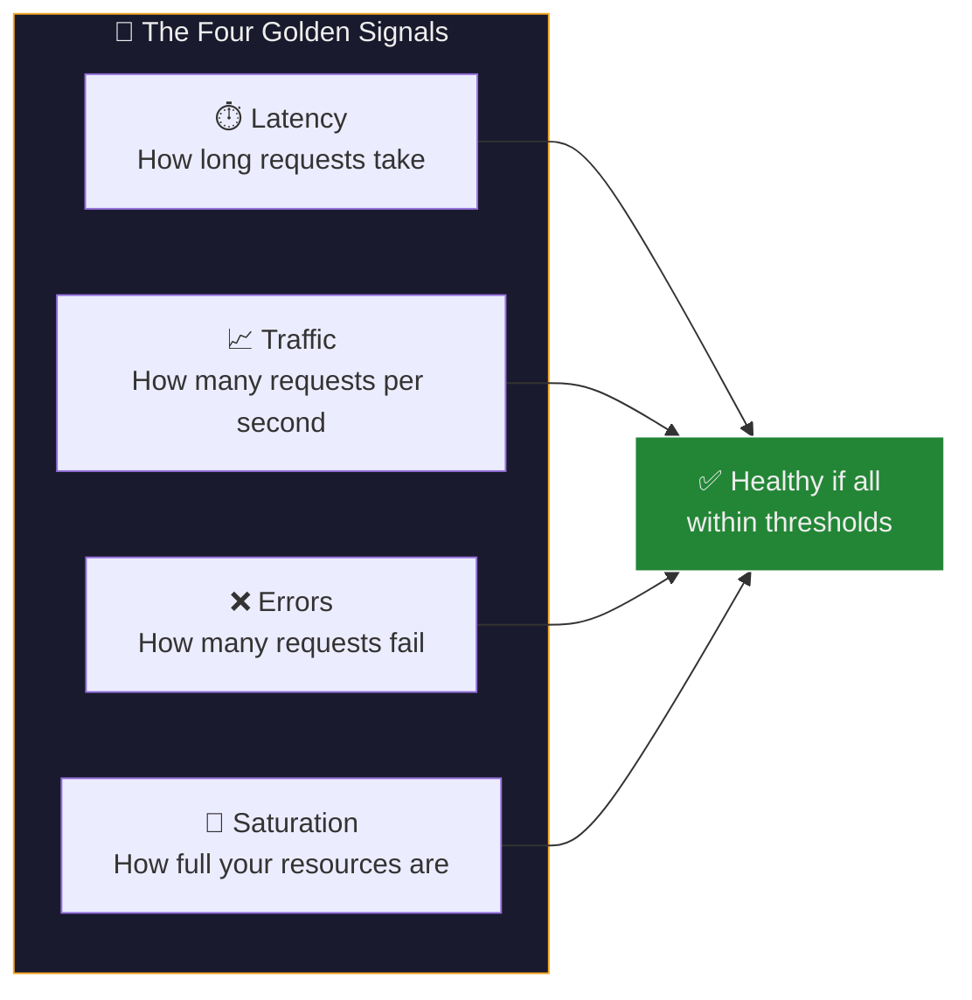
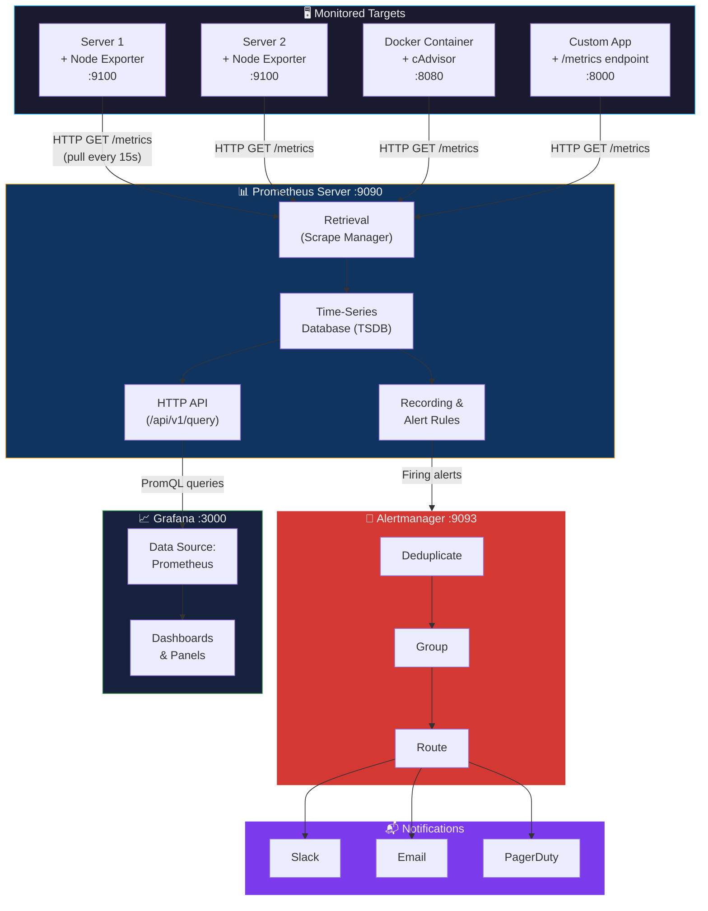
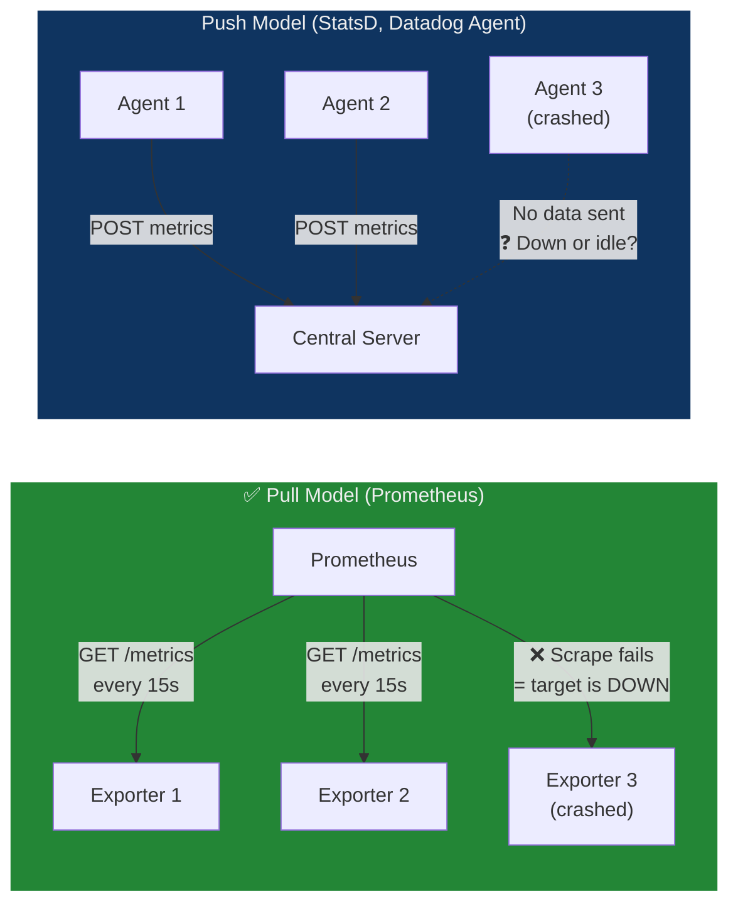
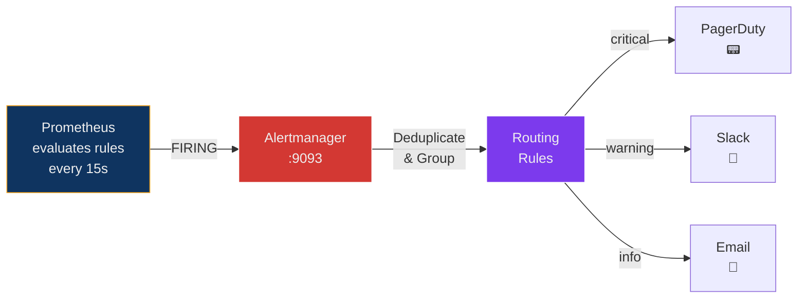
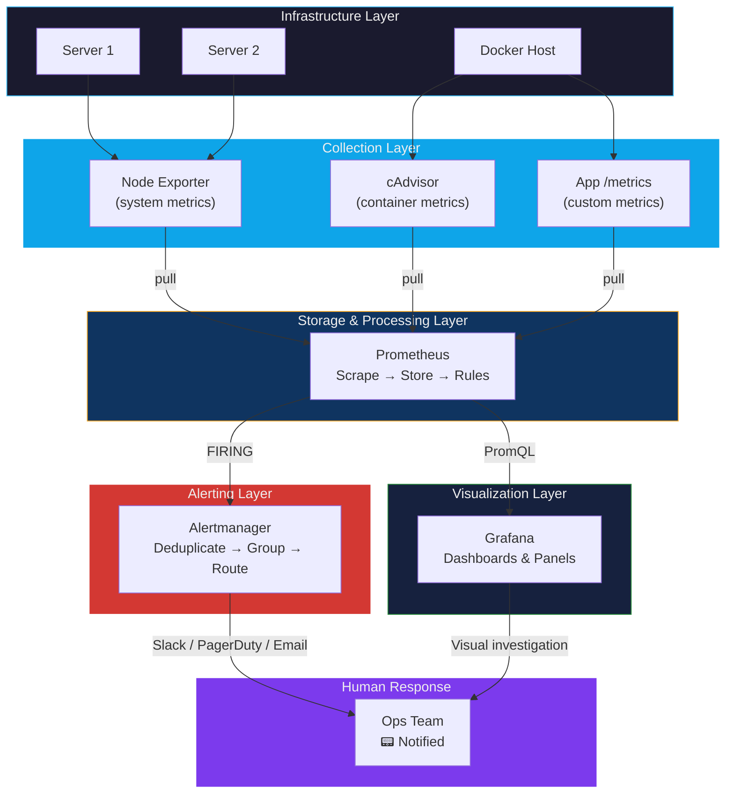

## The Weather Station Analogy

Before diving into Prometheus and Grafana, consider how a **nationwide weather monitoring network** operates:

| Weather Network | Prometheus + Grafana |
| :--- | :--- |
| Weather stations placed across cities, mountains, coastlines | **Node Exporters** installed on every server, VM, or container |
| Each station has thermometers, barometers, anemometers | Each exporter exposes **metrics** — CPU temperature, memory pressure, disk I/O |
| Stations don't call HQ — the central bureau **phones each station** every 15 minutes | Prometheus uses a **pull model** — it actively scrapes each exporter's `/metrics` endpoint at a configured interval |
| The bureau stores readings in time-stamped logbooks | Prometheus stores data in a **time-series database (TSDB)** — every data point is a `(timestamp, value)` pair |
| A TV meteorologist builds colourful maps, graphs, and animations from the raw data | **Grafana** queries Prometheus and renders interactive dashboards, heatmaps, and alerts |
| "If temperature drops below 0°C in any city, issue a frost warning" | **Alerting rules** — "If CPU > 90% for 5 minutes on any server, fire an alert" |
| A station going silent means its equipment is down — the bureau notices the gap | Prometheus knows a target is **DOWN** when a scrape fails — no ambiguity between "healthy but quiet" and "dead" |

> **Key insight:** The pull model is like the weather bureau calling stations — if a station doesn't answer, you know there's a problem. In a push model, silence is ambiguous: is the station fine with nothing to report, or is it broken?

---

## Why Monitor? The Case for Observability

In a production environment — especially one built on microservices and containers — applications fail in complex, interdependent ways. Without monitoring:

- A **memory leak** in one service silently consumes resources until it crashes, taking downstream services with it.
- A **slow database query** causes cascading timeouts, but nobody notices until customers complain.
- A **disk filling up** goes undetected until writes fail and data is lost.

Monitoring answers three critical questions in real-time:

| Question | How Prometheus + Grafana Answers It |
| :--- | :--- |
| **Is everything healthy right now?** | Grafana dashboard shows green/red status for all services at a glance |
| **What happened at 3:00 AM?** | Prometheus stores time-series data; Grafana can replay any time window |
| **Will we run out of disk in 3 days?** | PromQL `predict_linear()` function can forecast trends |

### The Four Golden Signals

Google's Site Reliability Engineering (SRE) book defines four metrics every service should monitor:



| Signal | Example Metric | PromQL Example |
| :--- | :--- | :--- |
| **Latency** | HTTP request duration | `histogram_quantile(0.99, rate(http_request_duration_seconds_bucket[5m]))` |
| **Traffic** | Requests per second | `rate(http_requests_total[1m])` |
| **Errors** | 5xx error rate | `rate(http_requests_total{status=~"5.."}[5m])` |
| **Saturation** | CPU, memory, disk usage | `node_filesystem_avail_bytes / node_filesystem_size_bytes` |

---

## Architecture — How Prometheus & Grafana Work Together



### Data Flow — Step by Step

1. **Exporters expose metrics** — Each target runs an exporter (e.g., Node Exporter) that collects system metrics and serves them as plain text at `http://<host>:9100/metrics`.
2. **Prometheus scrapes** — The Prometheus server sends HTTP GET requests to each target's `/metrics` endpoint at a configured interval (default: 15 seconds).
3. **TSDB stores** — Scraped data is stored in Prometheus's local time-series database as `(metric_name, labels, timestamp, value)` tuples.
4. **Rules evaluate** — Recording rules pre-compute expensive queries; alert rules check conditions (e.g., `cpu > 90% for 5m`).
5. **Alertmanager processes** — When alert rules fire, Alertmanager deduplicates, groups, and routes notifications to Slack, email, or PagerDuty.
6. **Grafana visualizes** — Grafana queries the Prometheus HTTP API using PromQL and renders results as graphs, gauges, tables, and heatmaps.

---

## Component Deep Dive

### Node Exporter — The System Health Reporter

**Node Exporter** is a lightweight, single-binary agent that runs on each Linux/Unix machine and exposes **hardware and OS-level metrics** in Prometheus format.

#### What It Exposes

When you visit `http://localhost:9100/metrics`, you see plain-text output like this:

```text
# HELP node_cpu_seconds_total Seconds the CPUs spent in each mode.
# TYPE node_cpu_seconds_total counter
node_cpu_seconds_total{cpu="0",mode="idle"} 123456.78
node_cpu_seconds_total{cpu="0",mode="system"} 4567.89
node_cpu_seconds_total{cpu="0",mode="user"} 8901.23

# HELP node_memory_MemTotal_bytes Memory information field MemTotal_bytes.
# TYPE node_memory_MemTotal_bytes gauge
node_memory_MemTotal_bytes 1.6777216e+10

# HELP node_filesystem_avail_bytes Filesystem space available to non-root users in bytes.
# TYPE node_filesystem_avail_bytes gauge
node_filesystem_avail_bytes{device="/dev/sda1",fstype="ext4",mountpoint="/"} 5.36870912e+10
```

#### Metric Types

Prometheus defines four fundamental metric types:

| Type | Description | Example |
| :--- | :--- | :--- |
| **Counter** | Monotonically increasing value (only goes up, resets on restart) | `node_cpu_seconds_total` — total CPU seconds consumed |
| **Gauge** | Value that can go up or down | `node_memory_MemAvailable_bytes` — current free memory |
| **Histogram** | Samples observations and counts them in configurable buckets | `http_request_duration_seconds_bucket` — request latency distribution |
| **Summary** | Similar to histogram but calculates configurable quantiles | `go_gc_duration_seconds` — garbage collection pause duration |

> **Important:** Node Exporter does **not** store data. It presents a **snapshot** of current metrics each time Prometheus scrapes it. Think of it as a thermometer — it shows the current temperature, not a history.

#### Common Node Exporter Metric Categories

| Category | Metrics | Use Case |
| :--- | :--- | :--- |
| **CPU** | `node_cpu_seconds_total` | Alert when CPU is saturated |
| **Memory** | `node_memory_MemAvailable_bytes`, `node_memory_MemTotal_bytes` | Detect memory leaks |
| **Disk** | `node_filesystem_avail_bytes`, `node_disk_io_time_seconds_total` | Prevent disk-full crashes |
| **Network** | `node_network_receive_bytes_total`, `node_network_transmit_bytes_total` | Monitor bandwidth usage |
| **System** | `node_load1`, `node_load5`, `node_load15` | Track system load averages |
| **Uptime** | `node_boot_time_seconds` | Detect unexpected reboots |

---

### Prometheus — The Time-Series Database and Scraper

Prometheus is an open-source monitoring and alerting toolkit originally built at SoundCloud in 2012. It is now a graduated project of the **Cloud Native Computing Foundation (CNCF)**, alongside Kubernetes.

#### Pull vs Push Model



| Aspect | Pull Model (Prometheus) | Push Model |
| :--- | :--- | :--- |
| **Direction** | Server fetches from targets | Agents send to server |
| **Failure detection** | Scrape failure = target is down (instant detection) | Silence is ambiguous — is the target healthy or dead? |
| **Backpressure** | Prometheus controls scrape rate | Agents can overwhelm the server |
| **Configuration** | Targets just expose an endpoint; Prometheus manages scheduling | Each agent needs server address + push logic |
| **Short-lived jobs** | Challenge — job may finish before next scrape | Natural fit — push on completion |
| **Solution for gaps** | Use **Pushgateway** for batch/short-lived jobs | — |

#### Prometheus Data Model

Every metric in Prometheus has three components:

```text
<metric_name>{<label_name>=<label_value>, ...}  <value>  [<timestamp>]
```

Example:

```text
http_requests_total{method="POST", handler="/api/orders", status="200"}  1027  1716825600
```

| Component | Purpose | Example |
| :--- | :--- | :--- |
| **Metric name** | What is being measured | `http_requests_total` |
| **Labels** | Dimensions for filtering and grouping | `method="POST"`, `status="200"` |
| **Value** | The numeric measurement | `1027` |
| **Timestamp** | When the measurement was taken (milliseconds since epoch) | `1716825600` |

> **Labels are powerful:** The same metric name with different labels creates different time series. `http_requests_total{status="200"}` and `http_requests_total{status="500"}` are two completely separate time series stored independently.

#### Prometheus Configuration — `prometheus.yml`

```yaml
global:
  scrape_interval: 15s         # Default: scrape all targets every 15 seconds
  evaluation_interval: 15s     # Default: evaluate rules every 15 seconds
  scrape_timeout: 10s          # Default: timeout after 10 seconds per scrape

scrape_configs:
  # Prometheus monitors itself
  - job_name: 'prometheus'
    static_configs:
      - targets: ['localhost:9090']

  # Node Exporter targets
  - job_name: 'node_exporter'
    static_configs:
      - targets: ['node_exporter:9100']
        labels:
          environment: 'production'
          team: 'infrastructure'
```

| Field | Purpose |
| :--- | :--- |
| `scrape_interval` | How often Prometheus fetches metrics from targets |
| `evaluation_interval` | How often Prometheus evaluates recording and alerting rules |
| `scrape_timeout` | Maximum time to wait for a scrape response before marking target as down |
| `job_name` | Logical name for a group of targets (becomes the `job` label) |
| `static_configs.targets` | List of `host:port` endpoints to scrape |
| `labels` | Additional labels attached to all metrics from these targets |

---

### PromQL — Prometheus Query Language

PromQL is a functional query language for selecting, aggregating, and computing metrics. Understanding PromQL is essential for building dashboards and alert rules.

#### Essential PromQL Operations

##### Instant Vector Selectors

```promql
# Select all time series with this metric name
node_cpu_seconds_total

# Filter by label
node_cpu_seconds_total{mode="idle"}

# Regex match on labels
node_cpu_seconds_total{mode=~"idle|iowait"}

# Negative match
node_cpu_seconds_total{mode!="idle"}
```

##### Range Vector Selectors (time window)

```promql
# Last 5 minutes of data
node_cpu_seconds_total{mode="idle"}[5m]
```

##### Functions

| Function | Purpose | Example |
| :--- | :--- | :--- |
| `rate()` | Per-second rate of increase of a counter over a time window | `rate(node_cpu_seconds_total{mode="system"}[5m])` |
| `irate()` | Instant rate — uses only the last two data points (more volatile) | `irate(node_network_receive_bytes_total[5m])` |
| `increase()` | Total increase of a counter over a time window | `increase(http_requests_total[1h])` |
| `avg()` | Average across series | `avg(node_load1)` |
| `sum()` | Sum across series | `sum(rate(http_requests_total[5m]))` |
| `max()`, `min()` | Maximum / minimum across series | `max(node_filesystem_avail_bytes)` |
| `histogram_quantile()` | Calculate quantiles from histogram data | `histogram_quantile(0.99, rate(http_request_duration_seconds_bucket[5m]))` |
| `predict_linear()` | Predict future value based on trend | `predict_linear(node_filesystem_avail_bytes[1h], 3600*24)` |

##### Practical PromQL Recipes

```promql
# ── CPU ─────────────────────────────────────────────────────
# CPU usage percentage (100% - idle%)
100 - (avg by (instance) (irate(node_cpu_seconds_total{mode="idle"}[5m])) * 100)

# ── Memory ──────────────────────────────────────────────────
# Memory usage percentage
(node_memory_MemTotal_bytes - node_memory_MemAvailable_bytes) / node_memory_MemTotal_bytes * 100

# ── Disk ────────────────────────────────────────────────────
# Disk usage percentage
(node_filesystem_size_bytes{mountpoint="/"} - node_filesystem_avail_bytes{mountpoint="/"}) / node_filesystem_size_bytes{mountpoint="/"} * 100

# Predict when disk will be full (returns seconds until full)
predict_linear(node_filesystem_avail_bytes{mountpoint="/"}[6h], 3600 * 24 * 7)

# ── Network ─────────────────────────────────────────────────
# Network throughput (bytes per second received)
rate(node_network_receive_bytes_total{device="eth0"}[5m])

# ── HTTP ────────────────────────────────────────────────────
# Request rate per second
rate(http_requests_total[1m])

# Error rate (5xx responses as percentage of total)
rate(http_requests_total{status=~"5.."}[5m]) / rate(http_requests_total[5m]) * 100

# 99th percentile latency
histogram_quantile(0.99, rate(http_request_duration_seconds_bucket[5m]))
```

---

### Grafana — The Visualization Layer

Grafana is an open-source analytics and interactive visualization platform. It connects to **data sources** (Prometheus, Elasticsearch, MySQL, InfluxDB, Loki, and 100+ others) and renders their data into dashboards.

#### Key Characteristics

| Feature | Details |
| :--- | :--- |
| **Does NOT store data** | Grafana only queries and displays — Prometheus (or another data source) stores the data |
| **Multiple data sources** | A single dashboard can pull from Prometheus, Elasticsearch, MySQL simultaneously |
| **Dashboard as code** | Dashboards are JSON — can be version-controlled in Git |
| **Community dashboards** | 1000+ pre-built dashboards on [grafana.com/grafana/dashboards](https://grafana.com/grafana/dashboards) |
| **Alerting** | Built-in alert rules with notifications to Slack, email, PagerDuty, Teams, webhooks |
| **Default login** | Username: `admin`, Password: `admin` |

#### Panel Types

| Panel | Best For | Example |
| :--- | :--- | :--- |
| **Time series** | Metrics over time | CPU usage graph |
| **Stat** | Single big number | Current error rate: 0.3% |
| **Gauge** | Value relative to min/max | Disk usage: 72% |
| **Bar gauge** | Comparing multiple values | Memory usage per server |
| **Table** | Tabular data | Top 10 slowest endpoints |
| **Heatmap** | Distribution over time | Request latency distribution |
| **Logs** | Log lines (with Loki) | Application error logs |

---

## Hands-On: Full Stack Deployment

### Prerequisites

- Docker and Docker Compose installed
- Ports `9100`, `9090`, `3000` available
- Basic command-line knowledge

### Project File Structure

```text
monitoring-lab/
├── docker-compose.yml          # Service definitions
├── prometheus.yml              # Prometheus scrape configuration
└── alert_rules.yml             # (Optional) Alerting rules
```

### Step 1: Install and Configure Node Exporter

You have two options — install directly on a Linux/WSL system, or run as a Docker container.

#### Option A: Install on Linux/WSL

```bash
# 1. Download the latest Node Exporter release
wget https://github.com/prometheus/node_exporter/releases/download/v1.6.1/node_exporter-1.6.1.linux-amd64.tar.gz

# 2. Extract the archive
tar xvfz node_exporter-1.6.1.linux-amd64.tar.gz

# 3. Move binary to a system directory
sudo mv node_exporter-1.6.1.linux-amd64/node_exporter /usr/local/bin/

# 4. Create a dedicated unprivileged user (security best practice)
sudo useradd -rs /bin/false node_exporter
```

Create a systemd service file for automatic startup:

```bash
sudo nano /etc/systemd/system/node_exporter.service
```

```ini
[Unit]
Description=Node Exporter
After=network.target

[Service]
User=node_exporter
Group=node_exporter
Type=simple
ExecStart=/usr/local/bin/node_exporter

[Install]
WantedBy=multi-user.target
```

```bash
# 5. Enable and start the service
sudo systemctl daemon-reload
sudo systemctl start node_exporter
sudo systemctl enable node_exporter

# 6. Verify
curl http://localhost:9100/metrics | head -20
```

#### Option B: Run as a Docker Container

```bash
docker run -d \
  --name node_exporter \
  --net="host" \
  --pid="host" \
  -v "/:/host:ro,rslave" \
  quay.io/prometheus/node-exporter:latest \
  --path.rootfs=/host
```

| Flag | Purpose |
| :--- | :--- |
| `--net="host"` | Use host networking so exporter sees real network metrics |
| `--pid="host"` | Use host PID namespace for process-level metrics |
| `-v "/:/host:ro,rslave"` | Mount host filesystem read-only so exporter can read disk metrics |
| `--path.rootfs=/host` | Tell exporter the host root is at `/host` inside the container |

#### Verify Node Exporter

Open [http://localhost:9100/metrics](http://localhost:9100/metrics) in your browser. You should see hundreds of lines of metrics in plain text. This is the data Prometheus will scrape.

---

### Step 2: Set Up Prometheus and Grafana with Docker Compose

#### Create `docker-compose.yml`

```yaml
version: '3.8'

services:
  node_exporter:
    image: prom/node-exporter:latest
    container_name: node_exporter
    restart: unless-stopped
    ports:
      - "9100:9100"
    command:
      - '--path.rootfs=/host'
    volumes:
      # - '/:/host:ro,rslave'  # Linux (native)
      - '/:/host:ro'           # WSL

  prometheus:
    image: prom/prometheus:latest
    container_name: prometheus
    restart: unless-stopped
    ports:
      - "9090:9090"
    volumes:
      - ./prometheus.yml:/etc/prometheus/prometheus.yml
    command:
      - '--config.file=/etc/prometheus/prometheus.yml'

  grafana:
    image: grafana/grafana:latest
    container_name: grafana
    restart: unless-stopped
    ports:
      - "3000:3000"
    environment:
      - GF_SECURITY_ADMIN_PASSWORD=admin
    volumes:
      - grafana-storage:/var/lib/grafana

volumes:
  grafana-storage:
```

##### Service Breakdown

| Service | Image | Port | Purpose |
| :--- | :--- | :--- | :--- |
| `node_exporter` | `prom/node-exporter` | `:9100` | Collects system metrics (CPU, RAM, disk) |
| `prometheus` | `prom/prometheus` | `:9090` | Scrapes and stores metrics in TSDB |
| `grafana` | `grafana/grafana` | `:3000` | Visualizes metrics in dashboards |

#### Create `prometheus.yml`

```yaml
global:
  scrape_interval: 15s       # How often to scrape targets
  evaluation_interval: 15s   # How often to evaluate alerting rules

scrape_configs:
  - job_name: 'prometheus'
    static_configs:
      - targets: ['localhost:9090']   # Prometheus monitors itself

  - job_name: 'node_exporter'
    static_configs:
      - targets: ['node_exporter:9100']   # Docker service name resolves automatically
      # For standalone Node Exporter (non-Docker): use 'host.docker.internal:9100'
```

| Field | Purpose |
| :--- | :--- |
| `scrape_interval: 15s` | Prometheus fetches metrics every 15 seconds |
| `job_name` | Logical name for this group of targets — becomes the `job` label |
| `targets` | List of `host:port` endpoints to scrape |

> **Networking note:** Inside Docker Compose, services communicate using their service names. `node_exporter:9100` resolves to the container's IP. If Node Exporter runs outside Docker, use `host.docker.internal:9100` (Mac/Windows) or the host's actual IP (Linux).

---

### Step 3: Start the Stack

```bash
docker-compose up -d
```

Verify all three containers are running:

```bash
docker ps --format "table {{.Names}}\t{{.Status}}\t{{.Ports}}"
```

Expected output:

```text
NAMES            STATUS          PORTS
grafana          Up 10 seconds   0.0.0.0:3000->3000/tcp
prometheus       Up 10 seconds   0.0.0.0:9090->9090/tcp
node_exporter    Up 10 seconds   0.0.0.0:9100->9100/tcp
```

---

### Step 4: Verify Each Component

| Component | URL | What You Should See |
| :--- | :--- | :--- |
| **Node Exporter** | [http://localhost:9100/metrics](http://localhost:9100/metrics) | Raw metrics in plain text format |
| **Prometheus** | [http://localhost:9090](http://localhost:9090) | Prometheus web UI with query box |
| **Prometheus Targets** | [http://localhost:9090/targets](http://localhost:9090/targets) | All targets showing **UP** in green |
| **Grafana** | [http://localhost:3000](http://localhost:3000) | Login page (admin / admin) |

#### Verify in Prometheus

1. Open [http://localhost:9090](http://localhost:9090)
2. Navigate to **Status → Targets**
3. Confirm that `node_exporter` is listed and shows state **UP**
4. Try a query in the query box: `up` — should return `1` for each healthy target

---

### Step 5: Configure Grafana to Use Prometheus

1. Log into Grafana at `http://localhost:3000` (admin / admin)
2. Go to **⚙️ Configuration → Data Sources → Add data source**
3. Select **Prometheus**
4. Set the URL to `http://prometheus:9090` (Docker internal hostname)
5. Click **Save & Test** — should display ✅ "Data source is working"

> **Why `http://prometheus:9090` and not `http://localhost:9090`?** Grafana is running inside a Docker container. From inside that container, `localhost` refers to the Grafana container itself — not the host. The Docker Compose service name `prometheus` resolves to the Prometheus container's IP.

---

### Step 6: Create a Dashboard

#### Option A: Import a Community Dashboard (Recommended)

1. Click **+ → Import**
2. Enter dashboard ID: **`1860`** (Node Exporter Full)
3. Click **Load**
4. Select your Prometheus data source
5. Click **Import**

This gives you a complete, pre-built dashboard with CPU, memory, disk, network, and system metrics — ready to use.

#### Option B: Build a Custom Dashboard

1. Click **+ Create → Dashboard → Add visualization**
2. Select your Prometheus data source
3. Enter this PromQL query:

```promql
100 - (avg by (instance) (irate(node_cpu_seconds_total{mode="idle"}[5m])) * 100)
```

4. Set the panel title to "CPU Usage %"
5. Under **Standard options**, set Unit to **Percent (0-100)**
6. Click **Apply**, then **Save dashboard**

Try adding more panels:

| Panel Title | PromQL Query |
| :--- | :--- |
| Memory Usage % | `(node_memory_MemTotal_bytes - node_memory_MemAvailable_bytes) / node_memory_MemTotal_bytes * 100` |
| Disk Usage % | `(node_filesystem_size_bytes{mountpoint="/"} - node_filesystem_avail_bytes{mountpoint="/"}) / node_filesystem_size_bytes{mountpoint="/"} * 100` |
| Network Received (bytes/s) | `rate(node_network_receive_bytes_total{device="eth0"}[5m])` |
| System Load (1m avg) | `node_load1` |

---

## Advanced: Alerting Pipeline

Alerting is what transforms monitoring from a passive dashboard into an active safety net. The flow is:



### Example Alert Rule — `alert_rules.yml`

```yaml
groups:
  - name: node_alerts
    rules:
      # Alert when CPU usage is above 90% for 5 minutes
      - alert: HighCpuUsage
        expr: 100 - (avg by (instance) (irate(node_cpu_seconds_total{mode="idle"}[5m])) * 100) > 90
        for: 5m
        labels:
          severity: warning
        annotations:
          summary: "High CPU usage on {{ $labels.instance }}"
          description: "CPU usage is above 90% for more than 5 minutes (current: {{ $value }}%)"

      # Alert when disk is more than 85% full
      - alert: DiskSpaceLow
        expr: (node_filesystem_avail_bytes{mountpoint="/"} / node_filesystem_size_bytes{mountpoint="/"}) * 100 < 15
        for: 10m
        labels:
          severity: critical
        annotations:
          summary: "Disk space low on {{ $labels.instance }}"
          description: "Less than 15% disk space remaining on / (current: {{ $value }}%)"

      # Alert when a target is down
      - alert: TargetDown
        expr: up == 0
        for: 1m
        labels:
          severity: critical
        annotations:
          summary: "Target {{ $labels.instance }} is down"
          description: "Prometheus cannot scrape {{ $labels.job }} target {{ $labels.instance }}"
```

| Field | Purpose |
| :--- | :--- |
| `alert` | Name of the alert |
| `expr` | PromQL expression — alert fires when this evaluates to `true` |
| `for` | Duration the condition must be true before firing (avoids false positives from spikes) |
| `labels.severity` | Used by Alertmanager for routing (critical → PagerDuty, warning → Slack) |
| `annotations` | Human-readable text for notifications; supports Go template variables |

### Adding Alertmanager to Docker Compose

```yaml
  alertmanager:
    image: prom/alertmanager:latest
    container_name: alertmanager
    restart: unless-stopped
    ports:
      - "9093:9093"
    volumes:
      - ./alertmanager.yml:/etc/alertmanager/alertmanager.yml
    command:
      - '--config.file=/etc/alertmanager/alertmanager.yml'
```

### Alertmanager Configuration — `alertmanager.yml`

```yaml
global:
  resolve_timeout: 5m

route:
  receiver: 'default'
  group_by: ['alertname', 'instance']
  group_wait: 30s          # Wait 30s to batch alerts before sending
  group_interval: 5m       # Wait 5m before sending updates
  repeat_interval: 4h      # Re-send if still firing after 4 hours

receivers:
  - name: 'default'
    slack_configs:
      - api_url: 'https://hooks.slack.com/services/YOUR/WEBHOOK/URL'
        channel: '#alerts'
        title: '{{ .GroupLabels.alertname }}'
        text: '{{ range .Alerts }}{{ .Annotations.description }}{{ end }}'
```

Update `prometheus.yml` to load alert rules:

```yaml
rule_files:
  - '/etc/prometheus/alert_rules.yml'

alerting:
  alertmanagers:
    - static_configs:
        - targets: ['alertmanager:9093']
```

---

## Other Exporters — Beyond Node Exporter

Prometheus has a vast ecosystem of exporters for different systems:

| Exporter | What It Monitors | Port |
| :--- | :--- | :--- |
| **Node Exporter** | Linux system metrics (CPU, RAM, disk, network) | `:9100` |
| **cAdvisor** | Docker container metrics (per-container CPU, memory, network) | `:8080` |
| **Blackbox Exporter** | Probes endpoints over HTTP, HTTPS, DNS, TCP, ICMP | `:9115` |
| **MySQL Exporter** | MySQL database metrics (queries, connections, replication) | `:9104` |
| **PostgreSQL Exporter** | PostgreSQL database metrics | `:9187` |
| **Redis Exporter** | Redis in-memory store metrics | `:9121` |
| **Nginx Exporter** | Nginx web server metrics | `:9113` |
| **kube-state-metrics** | Kubernetes cluster state (pods, deployments, nodes) | `:8080` |

> **Custom metrics:** Applications can expose their own `/metrics` endpoint using Prometheus client libraries available for Go, Python, Java, Node.js, Ruby, and more.

---

## Troubleshooting Guide

| Problem | Possible Cause | Fix |
| :--- | :--- | :--- |
| Prometheus shows target as **DOWN** | Exporter not running, wrong port, or firewall blocking | Verify with `curl http://localhost:9100/metrics`; check `docker ps` |
| Grafana shows **"No data"** | Data source URL incorrect | Use Docker service name: `http://prometheus:9090` (not `localhost`) |
| Grafana shows **"Bad Gateway"** | Prometheus not running | Check `docker ps`; restart with `docker-compose restart prometheus` |
| PromQL returns **empty** | Wrong metric name, typo, or label mismatch | Browse available metrics at `http://localhost:9090/graph` and use autocomplete |
| Node Exporter shows **0** for disk metrics on WSL | WSL filesystem mount differences | Use `/:/host:ro` instead of `/:/host:ro,rslave` in the volume mount |
| Dashboard graphs are **flat / not updating** | Time range too narrow or scrape interval too long | Set Grafana time range to "Last 15 minutes" with auto-refresh |
| `docker-compose up` fails with port conflict | Another process using port 9090, 3000, or 9100 | Find with `ss -tulnp \| grep 9090` or `netstat -ano \| findstr 9090` and kill or change ports |
| Alertmanager not receiving alerts | `alerting` section missing in `prometheus.yml` | Add `alerting.alertmanagers` config pointing to `alertmanager:9093` |

---

## Complete Workflow Diagram

This end-to-end diagram captures the entire monitoring lifecycle from metric generation to human notification:



---

## Glossary

| Term | Definition |
| :--- | :--- |
| **Prometheus** | Open-source, pull-based monitoring system and time-series database, graduated CNCF project |
| **Grafana** | Open-source visualization and analytics platform that connects to data sources and renders dashboards |
| **Node Exporter** | Prometheus exporter for hardware and OS-level metrics on Linux/Unix systems (CPU, memory, disk, network) |
| **Exporter** | Any agent or library that collects metrics and exposes them in Prometheus format on an HTTP `/metrics` endpoint |
| **Metric** | A numerical measurement with a name, optional labels, and a timestamp — e.g., `cpu_usage{host="srv1"} 85.2` |
| **Time-Series Database (TSDB)** | A database optimized for storing and querying time-stamped data points (e.g., Prometheus, InfluxDB) |
| **Scrape** | The act of Prometheus sending an HTTP GET request to a target's `/metrics` endpoint to collect data |
| **Pull Model** | The server (Prometheus) actively fetches data from targets, as opposed to agents pushing data to the server |
| **Push Model** | Agents actively send metrics to a central server (used by StatsD, Datadog Agent, etc.) |
| **Pushgateway** | A Prometheus component that allows short-lived batch jobs to push metrics, bridging the gap in the pull model |
| **PromQL** | Prometheus Query Language — a functional language for selecting, filtering, aggregating, and computing metrics |
| **Counter** | A metric type that only increases (or resets to zero on restart) — e.g., total HTTP requests served |
| **Gauge** | A metric type that can go up or down — e.g., current CPU temperature, number of active connections |
| **Histogram** | A metric type that counts observations in configurable buckets — used for latency distributions |
| **Summary** | A metric type that calculates streaming quantiles (e.g., p50, p99) on the client side |
| **Label** | A key-value pair attached to a metric for multi-dimensional querying — e.g., `{method="GET", status="200"}` |
| **Target** | Any endpoint that Prometheus is configured to scrape (defined in `scrape_configs`) |
| **Job** | A logical group of targets in Prometheus config — all instances of a service share the same `job_name` |
| **Instance** | A single target endpoint, identified by `host:port` — one specific server running an exporter |
| **Recording Rule** | A PromQL expression pre-computed and stored as a new time series — improves dashboard query performance |
| **Alert Rule** | A PromQL expression that fires an alert when it evaluates to `true` for a specified duration |
| **Alertmanager** | A separate Prometheus component that deduplicates, groups, silences, and routes alerts to notification channels |
| **Dashboard** | A visual display combining multiple panels (graphs, gauges, tables) into a single monitoring view in Grafana |
| **Panel** | A single visualization widget in Grafana — time-series graph, gauge, stat, table, heatmap, etc. |
| **Data Source** | A backend that Grafana queries for data — Prometheus, Elasticsearch, MySQL, Loki, etc. |
| **Scrape Interval** | How frequently Prometheus fetches metrics from targets (default: 15 seconds) |
| **cAdvisor** | Container Advisor — Google's exporter for Docker container metrics (per-container CPU, memory, network) |
| **Four Golden Signals** | Google SRE's four key service metrics: Latency, Traffic, Errors, and Saturation |

---

## Quick Reference Card

```bash
# ─── Start / Stop the Stack ────────────────────────────────
docker-compose up -d                             # Start all services
docker-compose down                              # Stop all services
docker-compose restart prometheus                # Restart Prometheus only

# ─── Verify Services ───────────────────────────────────────
curl http://localhost:9100/metrics | head         # Node Exporter raw metrics
curl http://localhost:9090/-/healthy              # Prometheus health check
curl http://localhost:9090/api/v1/targets         # List all scrape targets
curl http://localhost:3000/api/health             # Grafana health check

# ─── Open UIs ──────────────────────────────────────────────
open http://localhost:9090                        # Prometheus UI
open http://localhost:3000                        # Grafana (admin/admin)
open http://localhost:9093                        # Alertmanager UI

# ─── Debugging ─────────────────────────────────────────────
docker logs prometheus                           # Check Prometheus logs
docker logs grafana                              # Check Grafana logs
docker exec -it grafana curl http://prometheus:9090  # Test connectivity
```

```yaml
# ─── Minimal prometheus.yml ─────────────────────────────────
global:
  scrape_interval: 15s
scrape_configs:
  - job_name: 'node_exporter'
    static_configs:
      - targets: ['node_exporter:9100']
```

---

## Exam / Interview Prep

### Q1: Explain the architecture of a Prometheus + Grafana monitoring stack. What role does each component play, and how do they interact?

**Answer:** The stack has three core components operating in a pipeline:

1. **Exporters (e.g., Node Exporter)** run on each monitored server and expose system metrics (CPU, memory, disk, network) as plain text on an HTTP endpoint (`/metrics`). They do not store data — they only present a snapshot of current values.

2. **Prometheus** is the central server. It uses a **pull model**: it actively sends HTTP GET requests to each exporter's `/metrics` endpoint at a configured interval (default: 15 seconds). Scraped data is stored in a **local time-series database (TSDB)** as `(metric_name, labels, timestamp, value)` tuples. Prometheus also evaluates **alert rules** — PromQL expressions that trigger alerts when conditions are met (e.g., "CPU > 90% for 5 minutes"). Fired alerts are sent to **Alertmanager**, which deduplicates, groups, and routes them to notification channels (Slack, email, PagerDuty).

3. **Grafana** is the visualization layer. It connects to Prometheus as a **data source** and queries it using **PromQL**. It renders results as interactive dashboards with panels — time-series graphs, gauges, heatmaps, and tables. Grafana does not store metrics data; it only queries and displays.

The interaction flow: `Exporters → (scraped by) → Prometheus TSDB → (queried via PromQL by) → Grafana Dashboards`. For alerting: `Prometheus Alert Rules → (fires to) → Alertmanager → (routes to) → Slack/Email/PagerDuty`.

---

### Q2: What is the difference between Prometheus's pull model and a push-based monitoring system? What are the trade-offs of each approach?

**Answer:** In the **pull model**, the monitoring server (Prometheus) actively fetches metrics from targets by sending HTTP GET requests to their `/metrics` endpoints at regular intervals. In the **push model**, agents on each target actively send (POST) their metrics to a central collection server.

**Pull model advantages:**
- **Immediate failure detection:** If a scrape fails, Prometheus knows the target is down. In push-based systems, silence is ambiguous — you can't tell if the agent is healthy-but-idle or crashed.
- **No backpressure:** Prometheus controls the scrape rate, so targets can't overwhelm the server with a flood of pushed data.
- **Simpler target configuration:** Targets only need to expose an HTTP endpoint; they don't need to know the server's address or implement push logic.
- **Easier debugging:** You can `curl` any exporter's `/metrics` endpoint directly to verify what data it's serving.

**Pull model disadvantages:**
- **Short-lived jobs:** A batch job may start and finish between two scrape intervals, so its metrics are never collected. Prometheus addresses this with the **Pushgateway**, a bridge that accepts pushed metrics from short-lived jobs and exposes them for Prometheus to scrape.
- **Firewall/NAT challenges:** Prometheus must be able to reach every target. In complex network topologies, this may require additional configuration.

The push model is better suited for event-driven or ephemeral workloads, while the pull model excels for long-running services where continuous health monitoring is paramount.

---

### Q3: You are tasked with setting up monitoring for a production microservices application running on Docker. Walk through the steps you would take, the tools you would use, and what alerts you would configure.

**Answer:** I would deploy a **Prometheus + Grafana + Alertmanager** stack alongside the application using Docker Compose.

**Step 1 — Instrumentation:**
- Install **Node Exporter** on each host for system-level metrics (CPU, memory, disk, network).
- Deploy **cAdvisor** for per-container metrics (container CPU, memory, network).
- Add a **Prometheus client library** (e.g., `prom-client` for Node.js) to each microservice to expose application-level metrics: request rate, error rate, latency histograms, and business metrics.

**Step 2 — Collection:**
- Configure `prometheus.yml` with `scrape_configs` targeting each exporter and service's `/metrics` endpoint. Use Docker service names for resolution within Docker Compose.

**Step 3 — Visualization:**
- Configure Grafana with Prometheus as a data source. Import community dashboard `1860` for Node Exporter and build custom dashboards for application metrics. Focus on the **Four Golden Signals**: latency, traffic, errors, and saturation.

**Step 4 — Alerting:**
- Configure alert rules in Prometheus for critical conditions:
  - `TargetDown`: `up == 0 for 1m` — any service unreachable.
  - `HighCpuUsage`: CPU > 90% for 5 minutes.
  - `DiskSpaceLow`: Less than 15% disk remaining for 10 minutes.
  - `HighErrorRate`: 5xx errors > 1% of total requests for 5 minutes.
  - `HighLatency`: p99 latency > 2 seconds for 5 minutes.
- Set up Alertmanager to route critical alerts to PagerDuty (on-call notification) and warnings to Slack (team channel). Use `group_by: ['alertname', 'instance']` to avoid alert floods, and set `repeat_interval: 4h` to remind about unresolved issues.

**Step 5 — Verification:**
- Verify all targets show **UP** in Prometheus at `/targets`.
- Confirm Grafana dashboards render data.
- Test alerting by manually setting a container's CPU limit low and verifying the alert fires and the Slack notification arrives.

---

## Further Reading

- [Prometheus Official Documentation](https://prometheus.io/docs/introduction/overview/)
- [Grafana Documentation](https://grafana.com/docs/grafana/latest/)
- [Node Exporter Guide](https://prometheus.io/docs/guides/node-exporter/)
- [PromQL Cheat Sheet](https://promlabs.com/promql-cheat-sheet/)
- [Awesome Prometheus Alerts](https://awesome-prometheus-alerts.grep.to/) — community-curated alert rules
- [Grafana Dashboard Gallery](https://grafana.com/grafana/dashboards/) — 1000+ pre-built dashboards
- [Google SRE Book — Monitoring Chapter](https://sre.google/sre-book/monitoring-distributed-systems/)
- [Project Repository](https://github.com/upessocs/MonitoringWithPrometheusAndGrafana)