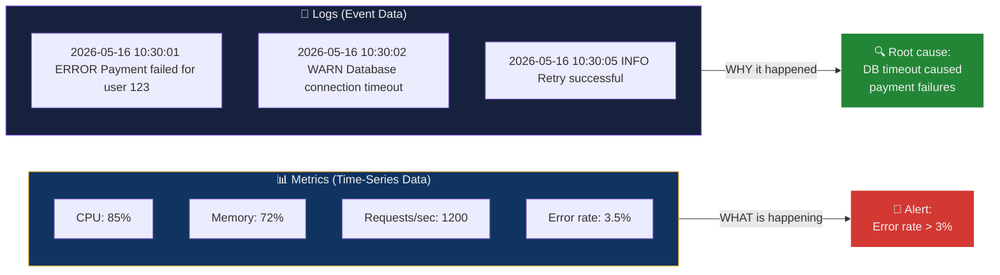
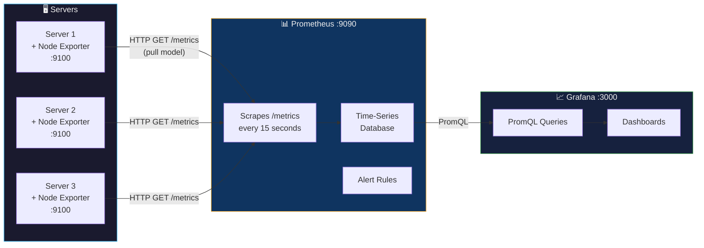
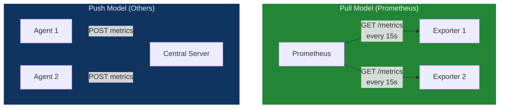
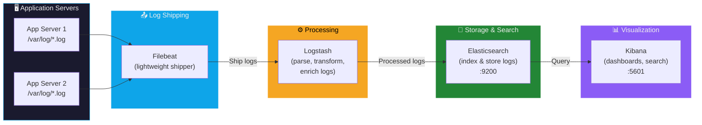
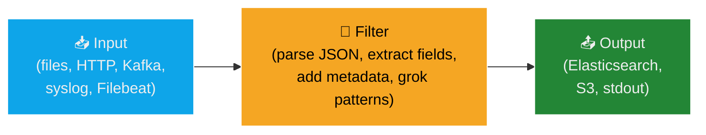
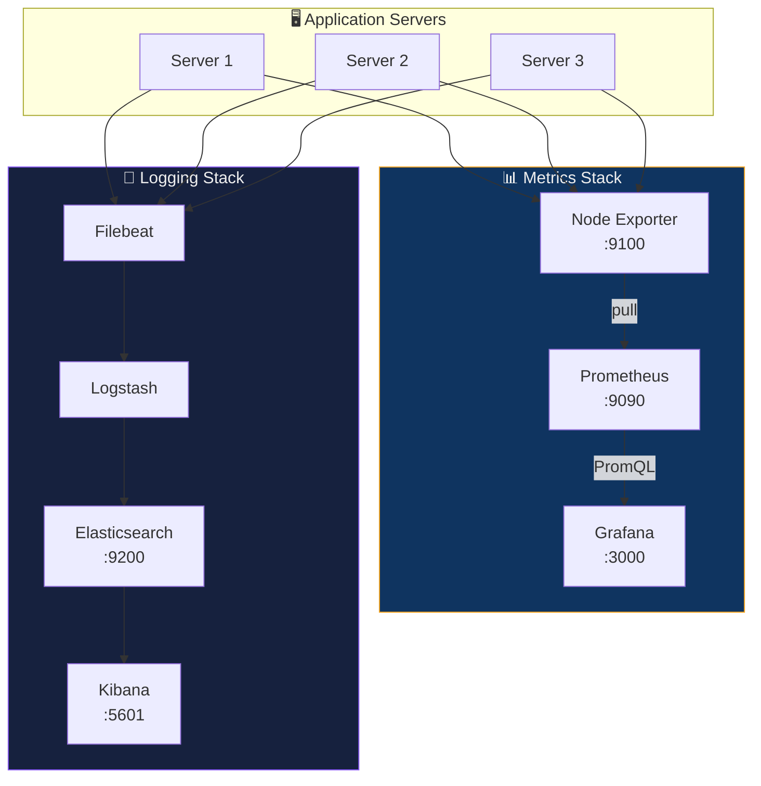

## The Hospital Monitoring Analogy

Imagine a **hospital intensive care unit (ICU):**

| ICU Operations | DevOps Monitoring |
| :--- | :--- |
| Heart rate monitor showing beats per minute | **Metrics** — CPU usage, request rate, memory (numerical, time-series) |
| Nurse's detailed notes: "Patient complained of chest pain at 2:15 AM" | **Logs** — event records with context, timestamps, and details |
| Central nurse station with all patient monitors on one screen | **Grafana dashboard** — centralized visualization of all metrics |
| The monitor beeping every second, recording vitals | **Prometheus** — scrapes metrics at regular intervals (pull model) |
| Heart rate sensor attached to the patient | **Node Exporter** — agent on each server exposing metrics |
| Patient's medical file with full history | **Elasticsearch** — searchable storage for all log records |
| Alarm sounds when heart rate drops below threshold | **Alerting rules** — trigger notifications when metrics cross thresholds |

> **Key insight:** Metrics tell you **something is wrong** (heart rate dropped). Logs tell you **exactly what happened** (patient had a reaction to medication X at 2:15 AM). You need both for complete visibility.

---

## The Problem: No Visibility in Distributed Systems

When an application fails in production, answering basic questions becomes impossible without tooling:

| Question | Without Monitoring | With Monitoring |
| :--- | :--- | :--- |
| "Where is the error?" | SSH into every server and check | Grafana dashboard shows the failing server in red |
| "Which server has high CPU?" | Run `top` on each server manually | Prometheus alert fires: "Server 3 CPU > 90%" |
| "What happened before the crash?" | Scroll through `/var/log/syslog` line by line | Kibana query: show all errors in the last 5 minutes |
| "Are there patterns?" | Compare logs on 10 servers by hand | Elasticsearch: "payment_failed occurred 500 times in 1 hour" |

### Metrics vs Logs — Two Complementary Approaches



| Aspect | Metrics | Logs |
| :--- | :--- | :--- |
| **Data type** | Numbers (time-series) | Text (structured/unstructured events) |
| **Examples** | CPU %, request count, latency | Error messages, stack traces, access logs |
| **Storage** | Compact — just numbers + timestamps | Large — full text content |
| **Question answered** | "What is happening right now?" | "What exactly went wrong?" |
| **Tool** | Prometheus + Grafana | ELK Stack (Elasticsearch + Logstash + Kibana) |
| **Volume** | Low (one number per metric per interval) | High (thousands of log lines per second) |

---

## Part I — Prometheus + Grafana: The Metrics Stack

### Architecture



### How Each Component Works

#### Node Exporter — The "Thermometer"

A lightweight agent that runs on each server, collecting system-level metrics and exposing them on an HTTP endpoint.

```bash
# What Node Exporter exposes at http://server:9100/metrics
node_cpu_seconds_total{cpu="0",mode="idle"} 12345.67
node_memory_MemAvailable_bytes 4294967296
node_filesystem_avail_bytes{mountpoint="/"} 53687091200
node_network_receive_bytes_total{device="eth0"} 9876543210
```

| Metric Category | What It Measures | Example |
| :--- | :--- | :--- |
| **CPU** | Time spent in each mode (user, system, idle) | `node_cpu_seconds_total` |
| **Memory** | Available, used, cached, buffered memory | `node_memory_MemAvailable_bytes` |
| **Disk** | Available space, I/O operations, latency | `node_filesystem_avail_bytes` |
| **Network** | Bytes sent/received, packet counts, errors | `node_network_receive_bytes_total` |

> Node Exporter **does not store** data. It presents a **snapshot** of current metrics each time Prometheus requests them.

#### Prometheus — The "Database with a Clock"

An open-source time-series database and monitoring system that **pulls** metrics from exporters on a regular interval.



| Feature | Details |
| :--- | :--- |
| **Model** | Pull-based — Prometheus actively fetches metrics from targets |
| **Storage** | Local time-series database with timestamps |
| **Query language** | PromQL — powerful query language for metrics |
| **Alerting** | Built-in alert rules that trigger on conditions |
| **Labels** | Multi-dimensional data model: `{job="api", instance="server1"}` |
| **Scrape interval** | Configurable (default: 15 seconds) |

**PromQL Examples:**

```promql
# CPU usage rate over the last 5 minutes
rate(node_cpu_seconds_total{mode="system"}[5m])

# Available memory in GB
node_memory_MemAvailable_bytes / 1024 / 1024 / 1024

# HTTP request rate per second
rate(http_requests_total[1m])

# 99th percentile response time
histogram_quantile(0.99, rate(http_request_duration_seconds_bucket[5m]))
```

#### Grafana — The "Dashboard Maker"

An open-source visualization platform that connects to Prometheus as a data source and renders beautiful dashboards.

| Key Point | Details |
| :--- | :--- |
| **Does NOT store data** | Grafana only queries and displays — Prometheus stores |
| **Multiple data sources** | Can connect to Prometheus, Elasticsearch, MySQL, InfluxDB, Loki, etc. |
| **Dashboard sharing** | Export/import dashboards as JSON; 1000s of community dashboards available |
| **Alerting** | Can trigger alerts via Slack, email, PagerDuty |
| **Default credentials** | Username: `admin`, Password: `admin` |

#### Loki — Lightweight Logging Alternative

**Loki** is Grafana's own logging system, designed as a cheaper alternative to ELK:

| Feature | Loki | ELK Stack |
| :--- | :--- | :--- |
| **Indexing** | Only labels (e.g., server name, app) | Full-text content indexing |
| **Search** | Limited — can filter by labels, then grep | Full-text search across all content |
| **Storage cost** | Low — stores raw logs, indexes only labels | High — indexes every word |
| **Best for** | Cloud-native, Kubernetes, cost-sensitive | Deep analysis, compliance, security |
| **Integration** | Native with Grafana | Kibana (separate tool) |

---

### Hands-On: Deploy the Prometheus + Grafana Stack

**Prerequisites:** Docker and Docker Compose installed.

#### Step 1: Create `docker-compose.yml`

```yaml
version: '3.8'

services:
  node_exporter:
    image: prom/node-exporter:latest
    container_name: node_exporter
    restart: unless-stopped
    ports:
      - "9100:9100"
    command:
      - '--path.rootfs=/host'
    volumes:
      # - '/:/host:ro,rslave'  # Linux (native)
      - '/:/host:ro'           # WSL

  prometheus:
    image: prom/prometheus:latest
    container_name: prometheus
    restart: unless-stopped
    ports:
      - "9090:9090"
    volumes:
      - ./prometheus.yml:/etc/prometheus/prometheus.yml
    command:
      - '--config.file=/etc/prometheus/prometheus.yml'

  grafana:
    image: grafana/grafana:latest
    container_name: grafana
    restart: unless-stopped
    ports:
      - "3000:3000"
    environment:
      - GF_SECURITY_ADMIN_PASSWORD=admin
    volumes:
      - grafana-storage:/var/lib/grafana

volumes:
  grafana-storage:
```

##### Service Breakdown

| Service | Image | Port | Purpose |
| :--- | :--- | :--- | :--- |
| `node_exporter` | `prom/node-exporter` | `:9100` | Collects system metrics (CPU, RAM, disk) |
| `prometheus` | `prom/prometheus` | `:9090` | Scrapes and stores metrics |
| `grafana` | `grafana/grafana` | `:3000` | Visualizes metrics in dashboards |

#### Step 2: Create `prometheus.yml` (Scrape Configuration)

```yaml
global:
  scrape_interval: 15s       # How often to scrape targets

scrape_configs:
  - job_name: 'node_exporter'
    static_configs:
      - targets: ['node_exporter:9100']   # Docker service name resolves to container IP
```

| Field | Purpose |
| :--- | :--- |
| `scrape_interval: 15s` | Prometheus fetches metrics every 15 seconds |
| `job_name` | Logical name for this group of targets |
| `targets` | List of `host:port` endpoints to scrape |

#### Step 3: Start the Stack

```bash
docker-compose up -d
```

#### Step 4: Verify Each Component

| Component | URL | What You Should See |
| :--- | :--- | :--- |
| **Node Exporter** | [http://localhost:9100/metrics](http://localhost:9100/metrics) | Raw metrics in text format |
| **Prometheus** | [http://localhost:9090](http://localhost:9090) | Prometheus web UI with query box |
| **Grafana** | [http://localhost:3000](http://localhost:3000) | Login page (admin / admin) |

#### Step 5: Add Prometheus as Data Source in Grafana

1. Log into Grafana at `http://localhost:3000` (admin / admin)
2. Go to **⚙️ Configuration → Data Sources → Add data source**
3. Select **Prometheus**
4. Set URL: `http://prometheus:9090` (Docker internal hostname)
5. Click **Save & Test** — should show "Data source is working"

#### Step 6: Create a Dashboard

1. Click **+ Create → Dashboard → Add visualization**
2. Select your Prometheus data source
3. Enter PromQL query:

```promql
rate(node_cpu_seconds_total{mode="system"}[5m])
```

4. You should see a time-series graph of CPU usage
5. Click **Save dashboard**

> **Pro tip:** Import community dashboard ID `1860` (Node Exporter Full) for a complete, pre-built system monitoring dashboard.

---

## Part II — ELK Stack: The Logging Stack

### Why Logs Are Different from Metrics

Metrics tell you **that** something is wrong (error rate spiked to 5%). Logs tell you **exactly what** happened ("Payment failed for user ID 123 due to database connection timeout at 10:30:01 AM").

| Without Centralized Logging | With ELK Stack |
| :--- | :--- |
| Logs scattered across 50 servers | All logs in one searchable index |
| `grep "error" /var/log/*.log` on each server | Kibana query: `level:error AND service:payment-api` |
| No search across servers | Full-text search across all servers in milliseconds |
| Root cause analysis takes hours | Find the exact error in seconds |

### ELK Architecture

**ELK** = **E**lasticsearch + **L**ogstash + **K**ibana (+ Filebeat for shipping)



### Component Breakdown

#### Elasticsearch — The "Search Engine for Logs"

A distributed search and analytics engine that stores logs in an **indexed** format, making them searchable at high speed.

| Feature | Details |
| :--- | :--- |
| **What it does** | Stores, indexes, and searches log data |
| **How it works** | Inverted index — maps words to documents (like a book's index) |
| **Query speed** | Milliseconds — even across terabytes of logs |
| **Scaling** | Distributed — shards data across multiple nodes |
| **Default port** | `:9200` |

```bash
# Example Elasticsearch query
curl -X GET "http://localhost:9200/app-logs-*/_search" \
  -H "Content-Type: application/json" \
  -d '{"query": {"match": {"message": "payment_failed"}}}'
```

#### Logstash — The "Log Processing Pipeline"

Ingests logs from multiple sources, **transforms** them (parsing, extracting fields, enriching), and sends them to Elasticsearch.



| Pipeline Stage | What It Does | Example |
| :--- | :--- | :--- |
| **Input** | Receives logs from sources | HTTP endpoint, file tail, Filebeat, Kafka |
| **Filter** | Parses and transforms log data | Parse JSON, extract timestamps, add geo data |
| **Output** | Sends processed logs to storage | Elasticsearch, S3, stdout |

#### Kibana — The "Log Browser"

The web interface for Elasticsearch — provides dashboards, log search, visualizations, and alerting.

| Feature | What It Does |
| :--- | :--- |
| **Discover** | Search and filter logs in real-time |
| **Visualize** | Create charts, graphs, and tables from log data |
| **Dashboard** | Combine multiple visualizations into a single view |
| **Alerts** | Trigger notifications when log patterns match conditions |
| **Default port** | `:5601` |

#### Filebeat — The "Lightweight Shipper"

In modern deployments, **Filebeat** replaces direct Logstash collection. It's lighter and uses fewer resources:

| Aspect | Filebeat | Logstash |
| :--- | :--- | :--- |
| **Purpose** | Ship logs from servers | Process and transform logs |
| **Resource usage** | ~10 MB RAM | ~500 MB RAM |
| **Processing** | Minimal — just reads and forwards | Rich — parse, enrich, transform |
| **Typical role** | Installed on every server | Central processing layer |

```text
Modern flow:  App → Filebeat → Logstash (optional processing) → Elasticsearch → Kibana
Simple flow:  App → Filebeat → Elasticsearch → Kibana (skip Logstash if no processing needed)
```

---

### Hands-On: Deploy the ELK Stack with Docker

#### Step 1: Create `docker-compose-elk.yml`

```yaml
version: '3.8'

services:
  elasticsearch:
    image: docker.elastic.co/elasticsearch/elasticsearch:8.11.0
    container_name: elasticsearch
    environment:
      - discovery.type=single-node
      - xpack.security.enabled=false
    ports:
      - "9200:9200"
    volumes:
      - elasticsearch-data:/usr/share/elasticsearch/data

  logstash:
    image: docker.elastic.co/logstash/logstash:8.11.0
    container_name: logstash
    ports:
      - "5000:5000"
    volumes:
      - ./logstash.conf:/usr/share/logstash/pipeline/logstash.conf
    depends_on:
      - elasticsearch

  kibana:
    image: docker.elastic.co/kibana/kibana:8.11.0
    container_name: kibana
    ports:
      - "5601:5601"
    environment:
      - ELASTICSEARCH_HOSTS=http://elasticsearch:9200
    depends_on:
      - elasticsearch

volumes:
  elasticsearch-data:
```

##### ELK Service Breakdown

| Service | Image | Port | Purpose |
| :--- | :--- | :--- | :--- |
| `elasticsearch` | `elasticsearch:8.11.0` | `:9200` | Stores and indexes logs |
| `logstash` | `logstash:8.11.0` | `:5000` | Receives, processes, and forwards logs |
| `kibana` | `kibana:8.11.0` | `:5601` | Web UI for searching and visualizing logs |

#### Step 2: Create `logstash.conf` (Processing Pipeline)

```conf
input {
  http {
    port => 5000
    codec => json
  }
}

filter {
  # Parse ISO8601 timestamp from the log
  date {
    match => ["timestamp", "ISO8601"]
    target => "@timestamp"
  }
}

output {
  elasticsearch {
    hosts => ["elasticsearch:9200"]
    index => "app-logs-%{+YYYY.MM.dd}"    # Daily index rotation
  }
  stdout { codec => rubydebug }            # Also print to console (for debugging)
}
```

| Section | What It Does |
| :--- | :--- |
| `input.http` | Listens on port 5000 for JSON log data via HTTP POST |
| `filter.date` | Extracts the timestamp from the log and sets it as the index timestamp |
| `output.elasticsearch` | Sends processed logs to Elasticsearch with a daily index pattern |
| `output.stdout` | Prints processed logs to Logstash container's console (debug) |

#### Step 3: Start the ELK Stack

```bash
docker-compose -f docker-compose-elk.yml up -d
```

> **Note:** Elasticsearch may take 30–60 seconds to initialize. Check with: `curl http://localhost:9200`

#### Step 4: Send a Test Log

```bash
curl -X POST http://localhost:5000 \
  -H "Content-Type: application/json" \
  -d '{
    "timestamp": "2026-05-16T10:30:00Z",
    "level": "error",
    "message": "Payment failed for user 123",
    "service": "payment-api"
  }'
```

#### Step 5: View Logs in Kibana

1. Open [http://localhost:5601](http://localhost:5601)
2. Go to **☰ → Discover**
3. Create an **index pattern** for `app-logs-*`
4. View and search your logs
5. Try searching: `level:error AND service:payment-api`

---

## When to Use Which Stack

| Use Case | Recommended Tool | Why |
| :--- | :--- | :--- |
| Real-time system metrics dashboards | **Prometheus + Grafana** | Purpose-built for time-series metrics |
| Long-term metric storage | **Prometheus + remote storage** | Thanos or Cortex for long-term retention |
| Deep log analysis and search | **ELK Stack** | Full-text indexing enables complex queries |
| Cost-sensitive log storage | **Loki** | Only indexes labels, not content |
| Security & compliance auditing | **ELK Stack** | Full audit trail with searchable content |
| Cloud-native Kubernetes monitoring | **Prometheus + Loki** | Native Kubernetes integration |
| Application Performance Monitoring | **Prometheus + Grafana + Jaeger** | Metrics + distributed tracing |

### Complete Monitoring Architecture



---

## Mental Model Summary

| Tool | One-Line Description |
| :--- | :--- |
| **Node Exporter** | System health reporter — collects vitals (CPU, RAM, disk) |
| **Prometheus** | Time-series database with a pull-based scraper |
| **Grafana** | Dashboard maker — visualizes what Prometheus stores |
| **Loki** | Labels-first logging — cheaper, less searchable |
| **Elasticsearch** | Search engine for logs — fast full-text search |
| **Logstash** | Log processing pipeline — transform before storing |
| **Kibana** | Log browser — search and visualize logs |
| **Filebeat** | Lightweight log shipper — forwards logs to Logstash/Elasticsearch |

---

## Common Pitfalls & Troubleshooting

| Problem | Cause | Fix |
| :--- | :--- | :--- |
| Prometheus shows "target is down" | Exporter not running or wrong port | Verify with `curl http://localhost:9100/metrics` |
| Grafana shows "No data" | Data source URL wrong | Use Docker service name: `http://prometheus:9090` |
| Elasticsearch won't start | Not enough memory | Set `ES_JAVA_OPTS=-Xms512m -Xmx512m` in docker-compose |
| Kibana can't connect to Elasticsearch | ES not ready yet | Wait 60s; check `curl http://localhost:9200` |
| Logstash drops logs | Pipeline misconfiguration | Check `docker logs logstash` for errors |
| PromQL query returns empty | Wrong metric name or label | Browse available metrics at `http://localhost:9090/targets` |
| Node Exporter shows 0 for disk metrics on WSL | WSL filesystem mount differences | Use `/:/host:ro` instead of `/:/host:ro,rslave` |
| Grafana dashboard not updating | Scrape interval too long or time range too narrow | Adjust time range to "Last 15 minutes" |

---

## Glossary

| Term | Definition |
| :--- | :--- |
| **Monitoring** | Continuously observing system health through metrics and alerts |
| **Logging** | Recording detailed event data for debugging and audit |
| **Metrics** | Numerical time-series data — CPU %, request count, latency |
| **Logs** | Text-based event records — error messages, access logs, stack traces |
| **Time-Series Database** | Database optimized for timestamped data points (e.g., Prometheus) |
| **Prometheus** | Open-source pull-based monitoring system with time-series storage |
| **PromQL** | Prometheus Query Language — used to query and aggregate metrics |
| **Scrape** | The act of Prometheus pulling metrics from a target endpoint |
| **Node Exporter** | Prometheus exporter for system-level metrics (CPU, memory, disk) |
| **Exporter** | Any agent that exposes metrics in Prometheus format on `/metrics` |
| **Grafana** | Open-source visualization platform for creating dashboards |
| **Loki** | Grafana's lightweight log aggregation system (indexes labels only) |
| **Elasticsearch** | Distributed search and analytics engine — stores and indexes logs |
| **Logstash** | Data processing pipeline that ingests, transforms, and outputs logs |
| **Kibana** | Web UI for Elasticsearch — search, visualize, and alert on log data |
| **Filebeat** | Lightweight log shipper that forwards logs to Logstash/Elasticsearch |
| **ELK Stack** | Elasticsearch + Logstash + Kibana — a complete logging solution |
| **Pull Model** | Server (Prometheus) actively fetches data from targets |
| **Push Model** | Agents send data to a central server (used by some other tools) |
| **Index** | Elasticsearch's way of organizing data — like a database table |
| **Dashboard** | A visual display combining multiple graphs and metrics |
| **Alert** | An automated notification triggered when a metric crosses a threshold |

---

## Exam / Interview Prep

### Q1: Explain the difference between metrics and logs. Why do you need both in a production system?

**Answer:** **Metrics** are numerical time-series data — CPU usage (85%), request rate (1200/sec), error rate (3.5%). They're compact, efficient to store, and ideal for real-time dashboards and alerting. **Logs** are text-based event records — "Payment failed for user 123 due to timeout at 10:30:01 AM". They're detailed but voluminous. You need both because metrics answer **"what is happening"** (error rate spiked), while logs answer **"why it happened"** (specific database timeout). A metric alert tells you the error rate is above 3%; the corresponding log tells you that 80% of those errors are caused by a specific database connection pool exhaustion on Server 3. Metrics are your smoke detector; logs are your security camera footage.

### Q2: How does Prometheus' pull model work, and why is it preferred over a push model for monitoring?

**Answer:** In the pull model, **Prometheus actively scrapes** (HTTP GET) metrics from target endpoints (like Node Exporter at `:9100/metrics`) at a configurable interval (default: 15 seconds). This differs from the push model where agents send data to a central server. The pull model is preferred because: (1) **Easy target discovery** — Prometheus knows immediately if a target is down (failed scrape = alert), while push-based systems can't distinguish between "no data" and "target is healthy but nothing changed." (2) **No backpressure** — targets don't overwhelm the monitoring server with pushed data. (3) **Simpler configuration** — targets just expose an HTTP endpoint; no client-side configuration needed. The trade-off is that pull doesn't work well for short-lived jobs (which might finish before a scrape occurs) — Prometheus provides a Push Gateway for this edge case.

### Q3: Compare the ELK Stack and Prometheus+Grafana. When would you use each?

**Answer:** **Prometheus + Grafana** is designed for **metrics** — numerical time-series data like CPU usage, request rates, and latency. Prometheus stores data efficiently (just numbers + timestamps), queries with PromQL, and supports powerful alerting. It's ideal for real-time system health dashboards and Kubernetes monitoring. **ELK Stack** is designed for **logs** — text-based event records. Elasticsearch provides full-text search across terabytes of logs, Logstash transforms raw logs into structured data, and Kibana provides a search interface. It's ideal for root cause analysis, security auditing, and compliance. In practice, **you use both together**: Prometheus alerts you that the error rate is 5% (the "what"), and ELK lets you search through the actual error logs to find the root cause (the "why"). For cost-sensitive logging, **Loki** (Grafana's lightweight alternative to ELK) can replace Elasticsearch by indexing only labels instead of full text content.

---

## Quick Reference Card

```bash
# ─── Prometheus + Grafana Stack ───
docker-compose up -d                             # Start stack
curl http://localhost:9100/metrics               # Node Exporter raw metrics
open http://localhost:9090                        # Prometheus UI
open http://localhost:3000                        # Grafana (admin/admin)

# ─── ELK Stack ───
docker-compose -f docker-compose-elk.yml up -d   # Start ELK
curl http://localhost:9200                        # Elasticsearch health
open http://localhost:5601                        # Kibana UI

# ─── Send test log to Logstash ───
curl -X POST http://localhost:5000 \
  -H "Content-Type: application/json" \
  -d '{"level":"error","message":"Test error","service":"my-app"}'

# ─── PromQL Examples ───
rate(node_cpu_seconds_total{mode="system"}[5m])  # CPU usage rate
node_memory_MemAvailable_bytes / 1024^3          # Available memory (GB)
rate(http_requests_total[1m])                     # Request rate
```

```yaml
# ─── Minimal prometheus.yml ───
global:
  scrape_interval: 15s
scrape_configs:
  - job_name: 'node_exporter'
    static_configs:
      - targets: ['node_exporter:9100']
```