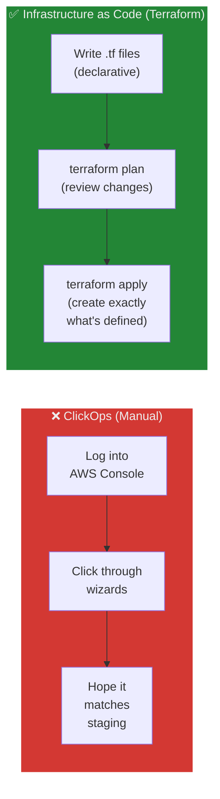
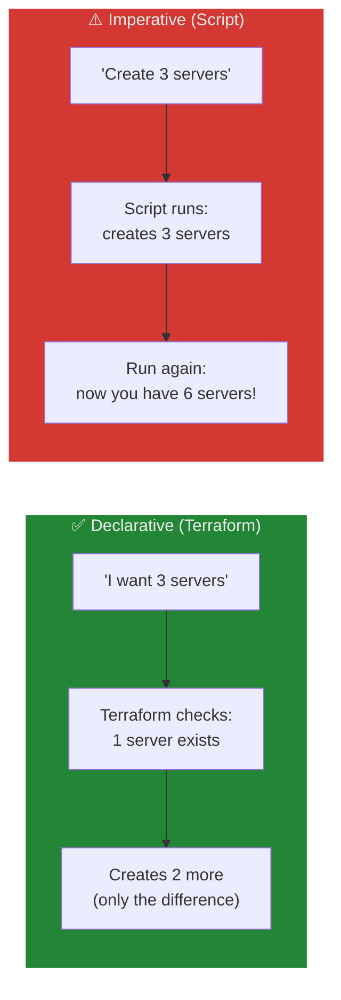
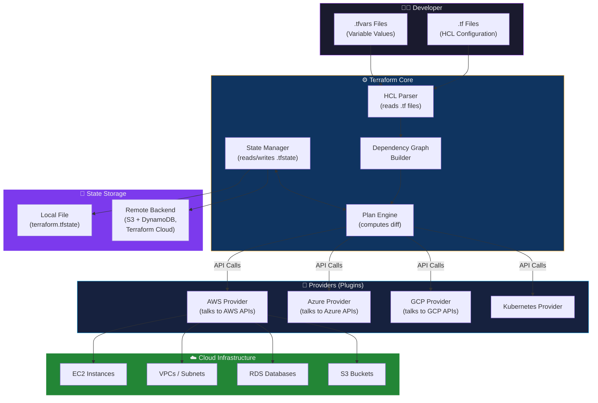
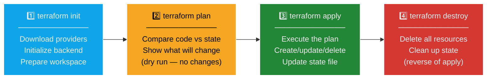
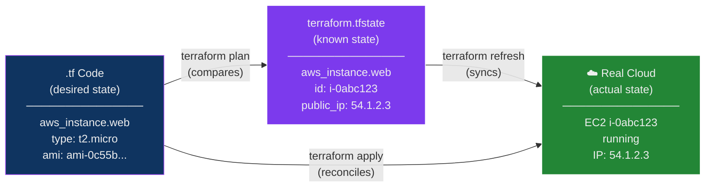
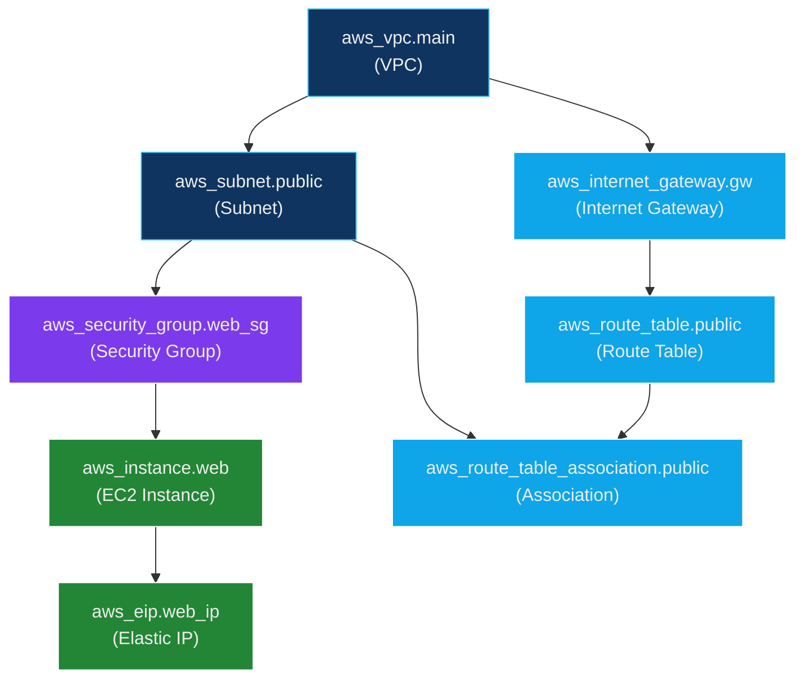
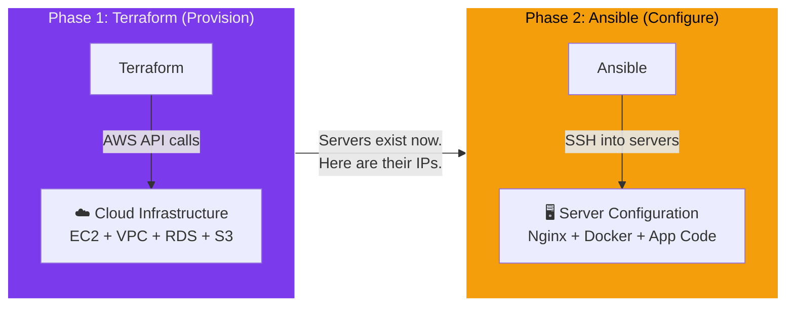

## The Blueprint Analogy

Before diving into Terraform, consider how a **city's construction department** operates:

| City Construction | Terraform |
| :--- | :--- |
| An architect draws blueprints for a building — specifying rooms, floors, plumbing, electrical | A developer writes **`.tf` files** — specifying servers, networks, databases, load balancers |
| The blueprint is **declarative**: it describes the *finished building*, not the step-by-step construction process | Terraform is **declarative**: you describe the *desired state* of your infrastructure, not the commands to create it |
| The city planning office reviews the blueprints before approving construction | `terraform plan` shows you *exactly* what will be created, changed, or destroyed — before anything happens |
| The contractor reads the blueprint and builds the structure | `terraform apply` executes the plan by calling cloud provider APIs to create real resources |
| The city maintains a **registry** — a master record of every building, its address, and its permits | Terraform maintains a **state file** (`terraform.tfstate`) — a master record mapping your code to real-world cloud resources |
| If the architect updates the blueprint to add a new floor, the contractor only builds *that floor* — they don't demolish and rebuild the whole building | If you add a new resource to your `.tf` files, Terraform only creates the *new resource* — it doesn't touch existing ones (incremental updates) |
| If the city wants to demolish a building, they reference the registry to know exactly what to tear down | `terraform destroy` reads the state file to know exactly which real cloud resources to delete |
| A general contractor builds the *structure* (foundation, walls, roof). Then an interior designer furnishes it (paint, furniture, appliances) | **Terraform** provisions the *infrastructure* (EC2, VPC, RDS). Then **Ansible** configures it (installs software, deploys apps) |

> **Key insight:** Terraform is like an architect's blueprint + a city registry combined. The blueprint (`.tf` files) declares what should exist, and the registry (state file) tracks what actually exists. The gap between the two is what `terraform plan` shows you, and `terraform apply` resolves.

---

## The Problem: Infrastructure Chaos

### Manual Infrastructure — "ClickOps"

In traditional operations, creating infrastructure involved logging into a cloud console (AWS, Azure, GCP) and clicking through wizards to create servers, networks, and databases by hand. This approach is called **"ClickOps"** and leads to severe problems:

| Problem | What Happens | Consequence |
| :--- | :--- | :--- |
| **Not reproducible** | Dev environment was set up 6 months ago; nobody remembers the exact steps | Cannot recreate environments reliably; staging ≠ production |
| **Human error** | Engineer forgets to open port 443 on the security group | Production outage after deployment |
| **No version control** | Infrastructure changes are untracked clicks in a console | Cannot audit who changed what, when, or why |
| **No code review** | Changes go directly to production without peer review | Misconfigurations reach production uncaught |
| **Scaling is manual** | Need 50 identical servers? Click through the wizard 50 times | Slow, error-prone, and soul-crushing |
| **Drift** | Someone manually tweaks a production server; it no longer matches the original spec | "Works on staging but not production" — the classic drift problem |

### The Solution: Infrastructure as Code (IaC)

**Infrastructure as Code** means defining your entire infrastructure — servers, networks, databases, DNS, load balancers, IAM policies — in text files that can be:

- **Version-controlled** in Git (full change history, blame, diffs)
- **Code-reviewed** via pull requests (peer review before any change goes live)
- **Tested** with automated validation and policy checks
- **Reused** as templates across environments (dev, staging, production)
- **Destroyed and recreated** identically at any time



---

## What Is Terraform?

**Terraform** is an open-source Infrastructure as Code (IaC) tool created by **HashiCorp** in 2014. It allows you to define cloud infrastructure resources using a declarative configuration language called **HCL (HashiCorp Configuration Language)**, and then provision those resources across any cloud provider.

### Core Capabilities

| Capability | Description |
| :--- | :--- |
| **Declarative configuration** | You describe the *desired end state* (e.g., "I want 3 EC2 instances"). Terraform figures out the steps to get there |
| **Execution planning** | `terraform plan` shows a detailed preview of what will change *before* anything is created, modified, or destroyed |
| **State management** | Terraform maintains a state file that maps your code to real-world resources, enabling incremental updates |
| **Resource graph** | Terraform builds a dependency graph and creates/updates resources in the correct order automatically |
| **Provider ecosystem** | Supports 3,000+ providers — AWS, Azure, GCP, Kubernetes, GitHub, Cloudflare, Datadog, and more |
| **Idempotency** | Running `terraform apply` multiple times with the same code produces the same result — no duplicate resources |

### Declarative vs Imperative — A Critical Distinction



| Approach | Terraform (Declarative) | Shell Script (Imperative) |
| :--- | :--- | :--- |
| **You specify** | What the end result should look like | The exact steps to execute |
| **Re-running** | Safe — Terraform computes the diff and only changes what's needed | Dangerous — script creates duplicates |
| **Example** | "There should be 3 servers" | "Create a server. Create a server. Create a server." |
| **Analogy** | "I want the room to be 22°C" (thermostat handles the rest) | "Turn on the heater. Wait 10 minutes. Check thermometer. Turn off heater." |

---

## Terraform Architecture — How It Works



### Components Explained

| Component | Role |
| :--- | :--- |
| **HCL Configuration** (`.tf` files) | Declarative code that describes the desired infrastructure — what resources should exist and their properties |
| **Terraform Core** | The binary (`terraform`) that reads config, builds a dependency graph, computes the plan, and orchestrates provider calls |
| **Providers** | Plugins that translate Terraform resource definitions into API calls for a specific platform (AWS, Azure, GCP, etc.) |
| **State File** (`terraform.tfstate`) | A JSON file that records the current state of all managed resources — the "source of truth" for what Terraform has created |
| **Backend** | Where the state file is stored — locally on disk (default) or remotely in S3, Azure Blob, Terraform Cloud, etc. |

---

## The Terraform Workflow — The Four Commands

Every Terraform workflow follows this cycle:



### Step-by-Step Breakdown

#### `terraform init` — Initialize the Working Directory

```bash
terraform init
```

What it does:
- Downloads the required **provider plugins** (e.g., `hashicorp/aws` v5.x)
- Initializes the **backend** (where state will be stored)
- Creates the `.terraform/` directory (local cache for plugins)
- Creates `.terraform.lock.hcl` (locks provider versions for reproducibility)

> **Run this first.** Every new project or after changing providers/backends requires `terraform init`.

#### `terraform plan` — Preview Changes (Dry Run)

```bash
terraform plan
```

What it does:
- Reads your `.tf` files (desired state)
- Reads the state file (current state)
- Computes the **diff** — what needs to be created, updated, or destroyed
- Displays the execution plan — but **makes no changes**

Example output:

```text
Terraform will perform the following actions:

  # aws_instance.web will be created
  + resource "aws_instance" "web" {
      + ami           = "ami-0c55b159cbfafe1f0"
      + instance_type = "t2.micro"
      + tags          = {
          + "Name" = "terraform-demo-instance"
        }
    }

  # aws_security_group.web_sg will be created
  + resource "aws_security_group" "web_sg" {
      + name        = "web-sg"
      + description = "Allow SSH and HTTP traffic"
    }

Plan: 2 to add, 0 to change, 0 to destroy.
```

| Symbol | Meaning |
| :--- | :--- |
| `+` (green) | Resource will be **created** |
| `~` (yellow) | Resource will be **updated** in-place |
| `-/+` (red/green) | Resource will be **destroyed and recreated** (forced replacement) |
| `-` (red) | Resource will be **destroyed** |

> **Always run `terraform plan` before `terraform apply`.** Treat it like a code review for your infrastructure changes.

#### `terraform apply` — Execute the Plan

```bash
terraform apply
```

What it does:
- Executes the plan from `terraform plan`
- Calls cloud provider APIs to create/update/delete resources
- Updates the state file with the new resource IDs, IPs, and metadata
- Prompts for confirmation (`yes`) before executing

> **Tip:** Use `terraform apply -auto-approve` to skip the confirmation prompt in CI/CD pipelines (never in interactive use).

#### `terraform destroy` — Tear Down Everything

```bash
terraform destroy
```

What it does:
- Reads the state file to determine which real resources exist
- Deletes **all managed resources** in reverse dependency order
- Clears the state file

> **⚠️ Critical for learning:** Always run `terraform destroy` when finished with lab exercises to avoid unexpected cloud charges.

---

## HCL — HashiCorp Configuration Language

HCL is the declarative language used to write Terraform configurations. It is designed to be both human-readable and machine-parseable.

### File Structure Conventions

| File | Purpose |
| :--- | :--- |
| `main.tf` | Primary resource definitions |
| `variables.tf` | Input variable declarations |
| `outputs.tf` | Output value definitions |
| `providers.tf` or `versions.tf` | Provider and Terraform version constraints |
| `terraform.tfvars` | Variable value assignments (not committed to Git if containing secrets) |

> **Note:** Terraform loads **all** `.tf` files in a directory. The filenames are conventions, not requirements — you could put everything in one file, but separating by concern improves maintainability.

### HCL Block Types

#### 1. Provider Block — "Which cloud am I targeting?"

```hcl
# Tells Terraform to use the AWS provider and which region to target
provider "aws" {
  region = "us-east-1"
}
```

| Field | Purpose |
| :--- | :--- |
| `provider "aws"` | Use the AWS provider plugin |
| `region` | Which AWS region to create resources in |

Terraform supports **3,000+ providers** — not just cloud providers, but also GitHub, Kubernetes, Helm, Cloudflare, Datadog, PagerDuty, and more.

#### 2. Resource Block — "What do I want to create?"

```hcl
resource "aws_instance" "web" {
  ami           = "ami-0c55b159cbfafe1f0"   # Amazon Linux 2 AMI ID
  instance_type = "t2.micro"                 # Free-tier eligible instance size

  vpc_security_group_ids = [aws_security_group.web_sg.id]

  tags = {
    Name        = "terraform-demo-instance"
    Environment = "development"
  }
}
```

| Component | Meaning |
| :--- | :--- |
| `resource` | Keyword — declares a resource block |
| `"aws_instance"` | Resource **type** — an EC2 instance (defined by the AWS provider) |
| `"web"` | Resource **name** — a local identifier used only within Terraform code |
| `ami` | The Amazon Machine Image ID (determines the OS) |
| `instance_type` | The server size (CPU, RAM) |
| `vpc_security_group_ids` | **Cross-reference** to another resource — Terraform resolves dependencies automatically |
| `tags` | Metadata key-value pairs applied to the AWS resource |

> **Resource addressing:** `aws_instance.web` is the full address. Use it to reference this resource's attributes elsewhere — e.g., `aws_instance.web.public_ip`.

#### 3. Variable Block — "Make it configurable"

```hcl
# variables.tf
variable "instance_type" {
  description = "EC2 instance size"
  type        = string
  default     = "t2.micro"
}

variable "environment" {
  description = "Deployment environment"
  type        = string
  # No default — must be provided
}

variable "allowed_ports" {
  description = "List of ports to open"
  type        = list(number)
  default     = [22, 80, 443]
}
```

How to provide variable values (in order of precedence, highest first):

| Method | Example |
| :--- | :--- |
| Command-line flag | `terraform apply -var="instance_type=t3.medium"` |
| `.tfvars` file | `instance_type = "t3.medium"` in `terraform.tfvars` |
| Environment variable | `export TF_VAR_instance_type=t3.medium` |
| Default value | `default = "t2.micro"` in the variable block |
| Interactive prompt | Terraform asks at runtime if no value is found |

#### 4. Output Block — "Show me the result"

```hcl
# outputs.tf
output "instance_public_ip" {
  description = "The public IP of the web server"
  value       = aws_instance.web.public_ip
}

output "instance_id" {
  description = "The EC2 instance ID"
  value       = aws_instance.web.id
}
```

Outputs are displayed after `terraform apply` and can be queried later with `terraform output`.

#### 5. Data Block — "Look up existing resources"

```hcl
# Look up the latest Amazon Linux 2 AMI (instead of hardcoding an AMI ID)
data "aws_ami" "amazon_linux" {
  most_recent = true
  owners      = ["amazon"]

  filter {
    name   = "name"
    values = ["amzn2-ami-hvm-*-x86_64-gp2"]
  }
}

# Use the looked-up AMI ID in a resource
resource "aws_instance" "web" {
  ami           = data.aws_ami.amazon_linux.id   # Dynamic lookup!
  instance_type = var.instance_type
}
```

| Block Type | Purpose | Creates Real Resources? |
| :--- | :--- | :--- |
| `resource` | Define infrastructure to create/manage | ✅ Yes |
| `data` | Look up existing infrastructure (read-only query) | ❌ No |

#### 6. Locals Block — "Reusable computed values"

```hcl
locals {
  common_tags = {
    Project     = "demo"
    Environment = var.environment
    ManagedBy   = "terraform"
  }
}

resource "aws_instance" "web" {
  ami           = data.aws_ami.amazon_linux.id
  instance_type = var.instance_type
  tags          = local.common_tags
}
```

---

## State Management — The Source of Truth

### What Is the State File?

The state file (`terraform.tfstate`) is a **JSON file** that maps every resource in your `.tf` code to the corresponding real-world resource in the cloud.



### Why State Matters

| Purpose | Explanation |
| :--- | :--- |
| **Resource mapping** | State maps `aws_instance.web` in your code to real EC2 instance `i-0abc123def` in AWS |
| **Incremental updates** | Terraform compares code vs state to determine what changed — creating only the diff, not rebuilding everything |
| **Dependency tracking** | State records resource relationships so Terraform can destroy in the correct order |
| **Performance** | Terraform reads state instead of querying every cloud API for large infrastructures (thousands of resources) |
| **Metadata storage** | Stores resource IDs, IP addresses, ARNs, and other attributes needed for cross-references |

### Local vs Remote State

| Aspect | Local State | Remote State (Recommended) |
| :--- | :--- | :--- |
| **Storage** | `terraform.tfstate` file on disk | S3 bucket, Azure Blob, Terraform Cloud |
| **Team collaboration** | ❌ Only one person can work at a time | ✅ Shared, with locking to prevent conflicts |
| **Security** | ⚠️ State may contain secrets (passwords, keys) in plaintext on disk | ✅ Encrypted at rest in S3/Blob |
| **Backup** | ❌ Lost if disk fails | ✅ Versioned and backed up automatically |
| **Locking** | ❌ No locking — two `apply` runs can corrupt state | ✅ DynamoDB lock (AWS) prevents concurrent modifications |

#### Configuring Remote State (AWS S3 + DynamoDB)

```hcl
# backend.tf
terraform {
  backend "s3" {
    bucket         = "my-terraform-state-bucket"
    key            = "prod/infrastructure/terraform.tfstate"
    region         = "us-east-1"
    encrypt        = true
    dynamodb_table = "terraform-state-lock"   # Prevents concurrent apply
  }
}
```

> **⚠️ Critical rule:** Never commit `terraform.tfstate` to Git. It may contain secrets (database passwords, API keys) in plaintext. Add it to `.gitignore`.

---

## The Resource Dependency Graph

Terraform automatically builds a **Directed Acyclic Graph (DAG)** of resource dependencies. It uses this graph to determine the correct order of creation and to parallelize independent operations.



| Behaviour | Explanation |
| :--- | :--- |
| **Automatic ordering** | Terraform creates VPC before Subnet, Subnet before Security Group, etc. — based on references in code |
| **Parallel execution** | Independent branches (e.g., Security Group and Internet Gateway) are created in parallel |
| **Reverse destroy** | `terraform destroy` deletes in reverse order — EC2 first, then Security Group, then Subnet, then VPC |
| **Explicit depends_on** | For dependencies Terraform can't infer, use `depends_on = [aws_iam_role.example]` |

You can visualize the graph with:

```bash
terraform graph | dot -Tpng > graph.png
```

---

## Terraform vs Ansible — The Critical Distinction

Many beginners confuse Terraform and Ansible because they overlap slightly. Understanding their distinct roles is essential.



### Detailed Comparison

| Aspect | Terraform | Ansible |
| :--- | :--- | :--- |
| **Primary purpose** | Create and manage cloud infrastructure | Configure systems and deploy applications |
| **Level of operation** | Cloud APIs — creates resources *in the cloud* | Operating system level — configures *inside servers* via SSH |
| **What it creates** | EC2 instances, VPCs, subnets, RDS databases, S3 buckets, load balancers, DNS records | Installs packages, copies config files, starts services, deploys application code |
| **Approach** | **Declarative** — "I want 3 servers" (Terraform figures out how) | **Procedural** (mostly) — "Install nginx, then copy config, then restart" |
| **State management** | ✅ Maintains a state file tracking every resource | ❌ Stateless — no record of what was previously created |
| **Idempotency** | ✅ Built-in — running apply twice has no effect if nothing changed | ⚠️ Depends on module quality — some modules aren't idempotent |
| **Cloud API interaction** | ✅ Purpose-built for cloud APIs | ⚠️ Can call cloud APIs via modules, but lacks lifecycle management |
| **Language** | HCL (HashiCorp Configuration Language) | YAML (playbooks) |
| **Agent required?** | ❌ No — Terraform runs on your machine and calls APIs | ❌ No — Ansible connects via SSH (agentless) |

### Real-World Workflow — Terraform Then Ansible

```text
Step 1 — Terraform provisions:
  ✅ VPC with public and private subnets
  ✅ 3 EC2 instances (web servers)
  ✅ 1 RDS PostgreSQL database
  ✅ 1 Application Load Balancer
  ✅ Security groups and IAM roles

Step 2 — Ansible configures:
  ✅ Installs Nginx on the 3 web servers
  ✅ Deploys the application code
  ✅ Configures database connection strings
  ✅ Sets up log rotation and monitoring agents
  ✅ Hardens SSH configuration
```

> **Can Ansible replace Terraform?** While Ansible *can* create EC2 instances using cloud modules, it lacks proper state management, doesn't track resource lifecycle, and becomes unmanageable at scale. **Possible ≠ recommended.** In production DevOps, use both tools for their intended purpose.

---

## Hands-On: Launch an EC2 Instance with Terraform

### Prerequisites

- Terraform installed
- AWS CLI installed and configured with credentials
- An AWS account (free tier is sufficient)

### Step 1: Set Up AWS Credentials

**One-time manual setup:**

1. Create an IAM user in AWS (never use the root account)
   - Enable programmatic access
   - Attach `AdministratorAccess` policy (for learning; use least-privilege in production)
2. Generate Access Keys (Access Key ID + Secret Access Key)
3. Configure credentials locally:

```bash
# Install AWS CLI (if not already installed)
sudo apt update && sudo apt install -y unzip curl && \
curl "https://awscli.amazonaws.com/awscli-exe-linux-x86_64.zip" -o "awscliv2.zip" && \
unzip -q awscliv2.zip && \
sudo ./aws/install && \
aws --version

# Configure credentials
aws configure
# Enter your Access Key ID and Secret Access Key when prompted
# Default region: us-east-1
# Default output format: json
```

Terraform reads credentials from:
1. AWS CLI config (`~/.aws/credentials`) — most common
2. Environment variables (`AWS_ACCESS_KEY_ID`, `AWS_SECRET_ACCESS_KEY`)
3. IAM instance profile (when running on EC2)

> **🔒 Security rules:**
> - **Never** hardcode credentials in `.tf` files
> - **Never** use the root account for Terraform
> - **Never** commit `terraform.tfstate` or `terraform.tfvars` (if it contains secrets) to Git

### Step 2: Create the Project

```bash
mkdir terraform-demo && cd terraform-demo
```

### Step 3: Write the Configuration

**`main.tf`** — The primary configuration:

```hcl
# ─── Provider ───────────────────────────────────────────────
# Tell Terraform to use the AWS provider, targeting us-east-1
provider "aws" {
  region = "us-east-1"
}

# ─── Security Group ────────────────────────────────────────
# Create a firewall rule allowing SSH (port 22) and HTTP (port 80)
resource "aws_security_group" "web_sg" {
  name        = "web-sg"
  description = "Allow SSH and HTTP traffic"

  # Inbound rule: allow SSH from anywhere
  ingress {
    description = "SSH access"
    from_port   = 22
    to_port     = 22
    protocol    = "tcp"
    cidr_blocks = ["0.0.0.0/0"]    # 0.0.0.0/0 = any IP address
  }

  # Inbound rule: allow HTTP from anywhere
  ingress {
    description = "HTTP access"
    from_port   = 80
    to_port     = 80
    protocol    = "tcp"
    cidr_blocks = ["0.0.0.0/0"]
  }

  # Outbound rule: allow all traffic out
  egress {
    from_port   = 0
    to_port     = 0
    protocol    = "-1"              # -1 = all protocols
    cidr_blocks = ["0.0.0.0/0"]
  }

  tags = {
    Name = "web-security-group"
  }
}

# ─── EC2 Instance ───────────────────────────────────────────
# Create a virtual machine (EC2 instance)
resource "aws_instance" "web" {
  ami           = "ami-0c55b159cbfafe1f0"    # Amazon Linux 2 in us-east-1
  instance_type = "t2.micro"                  # 1 vCPU, 1 GB RAM (free tier)

  # Attach the security group we defined above
  # Terraform automatically resolves this reference and creates the SG first
  vpc_security_group_ids = [aws_security_group.web_sg.id]

  tags = {
    Name        = "terraform-demo-instance"
    Environment = "development"
    ManagedBy   = "terraform"
  }
}
```

**`outputs.tf`** — Display useful information after creation:

```hcl
output "instance_public_ip" {
  description = "Public IP address of the web server"
  value       = aws_instance.web.public_ip
}

output "instance_id" {
  description = "EC2 Instance ID"
  value       = aws_instance.web.id
}

output "security_group_id" {
  description = "Security Group ID"
  value       = aws_security_group.web_sg.id
}
```

### Step 4: Initialize

```bash
terraform init
```

Output:
```text
Initializing the backend...
Initializing provider plugins...
- Finding latest version of hashicorp/aws...
- Installing hashicorp/aws v5.x.x...
- Installed hashicorp/aws v5.x.x (signed by HashiCorp)

Terraform has been successfully initialized!
```

### Step 5: Preview Changes

```bash
terraform plan
```

This shows exactly what Terraform will create — **2 resources** (security group + EC2 instance). Review the output carefully before proceeding.

### Step 6: Apply

```bash
terraform apply
```

Type `yes` when prompted. Terraform will:
1. Create the security group
2. Create the EC2 instance (referencing the security group)
3. Display the outputs (public IP, instance ID)

```text
Apply complete! Resources: 2 added, 0 changed, 0 destroyed.

Outputs:
instance_public_ip = "54.123.45.67"
instance_id = "i-0abc123def456"
security_group_id = "sg-0xyz789"
```

### Step 7: Verify

```bash
# Check the state
terraform show

# List all managed resources
terraform state list

# Get specific output values
terraform output instance_public_ip
```

### Step 8: Clean Up (Avoid Charges!)

```bash
terraform destroy
```

Type `yes` when prompted. Terraform reads the state file and deletes both resources in reverse dependency order (EC2 first, then security group).

---

## Terraform Modules — Reusable Infrastructure Packages

As infrastructure grows, repeating the same resource blocks becomes unmaintainable. **Modules** solve this by packaging reusable sets of resources.

### What Is a Module?

A module is simply a **directory containing `.tf` files**. Your root project is itself a module (the "root module"). Child modules are referenced using `module` blocks.

```text
project/
├── main.tf              ← Root module (calls child modules)
├── variables.tf
├── outputs.tf
│
└── modules/
    └── web-server/      ← Child module (reusable)
        ├── main.tf
        ├── variables.tf
        └── outputs.tf
```

### Using a Module

```hcl
# main.tf (root module)
module "web_server_prod" {
  source        = "./modules/web-server"
  instance_type = "t3.medium"
  environment   = "production"
}

module "web_server_staging" {
  source        = "./modules/web-server"
  instance_type = "t2.micro"
  environment   = "staging"
}
```

| Benefit | Explanation |
| :--- | :--- |
| **Reusability** | Define once, use across dev/staging/prod with different variables |
| **Encapsulation** | Hide complexity — consumers of the module don't need to know internal details |
| **Consistency** | All environments use the same module, reducing configuration drift |
| **Versioning** | Modules from registries can be pinned to specific versions |
| **Community** | The [Terraform Registry](https://registry.terraform.io) hosts thousands of pre-built, battle-tested modules |

---

## Terraform Workspaces — Multi-Environment Management

Workspaces allow you to manage **multiple environments** (dev, staging, prod) from the same Terraform code, each with its own state file.

```bash
# Create workspaces
terraform workspace new development
terraform workspace new staging
terraform workspace new production

# Switch between workspaces
terraform workspace select production

# List all workspaces
terraform workspace list

# Use workspace name in code
# terraform.workspace returns the current workspace name
```

```hcl
resource "aws_instance" "web" {
  instance_type = terraform.workspace == "production" ? "t3.large" : "t2.micro"

  tags = {
    Environment = terraform.workspace
  }
}
```

| Workspace | State File | Instance Type |
| :--- | :--- | :--- |
| `development` | `terraform.tfstate.d/development/terraform.tfstate` | `t2.micro` |
| `staging` | `terraform.tfstate.d/staging/terraform.tfstate` | `t2.micro` |
| `production` | `terraform.tfstate.d/production/terraform.tfstate` | `t3.large` |

---

## Licensing and Ecosystem

| Product | License | Cost | Features |
| :--- | :--- | :--- | :--- |
| **Terraform CLI** | Business Source License (BSL) | Free | Core IaC engine, all providers, modules |
| **OpenTofu** | Mozilla Public License (MPL) | Free | Community fork of Terraform (fully open-source) |
| **Terraform Cloud** | Proprietary (free tier available) | Free / Paid | Remote state, team collaboration, policy-as-code (Sentinel), VCS integration |
| **Terraform Enterprise** | Proprietary | Paid | Self-hosted, SSO, audit logging, advanced governance |

> For learning and most production use cases, the **free CLI** is sufficient. Remote state can be configured with an S3 bucket instead of Terraform Cloud.

---

## Common Pitfalls & Troubleshooting

| Problem | Cause | Fix |
| :--- | :--- | :--- |
| `terraform init` fails with "provider not found" | Provider name misspelled or registry unreachable | Check provider block; run with `TF_LOG=DEBUG` for details |
| `terraform plan` shows "No changes" but cloud doesn't match | Someone changed cloud resources manually (drift) | Run `terraform refresh` to sync state with reality; then `terraform plan` |
| `terraform apply` fails with "AccessDenied" | IAM user lacks permissions | Verify IAM policy; use `AdministratorAccess` for learning |
| `terraform apply` fails with "resource already exists" | Resource was created outside Terraform | Import it: `terraform import aws_instance.web i-0abc123` |
| State file is corrupted or lost | Local disk failure or accidental deletion | Use **remote state** (S3 + DynamoDB) with versioning enabled |
| Two team members run `apply` simultaneously | No state locking configured | Enable DynamoDB locking in S3 backend config |
| `terraform destroy` misses resources | Resources were created manually outside Terraform | Delete manually in the cloud console; Terraform only manages what it created |
| AMI ID not found in region | AMI IDs are region-specific | Use a `data` block to dynamically look up the latest AMI |
| Circular dependency error | Two resources reference each other | Refactor to break the cycle; use `depends_on` with care |

---

## Mental Model Summary

```text
┌─────────────────────────────────────────────────────────────┐
│                    DevOps Tooling Model                      │
├─────────────────────────────────────────────────────────────┤
│  Terraform  = "Build the house"                              │
│               Foundation, walls, roof, plumbing, electrical  │
│               (EC2, VPC, RDS, S3, IAM)                       │
│                                                              │
│  Ansible    = "Furnish the house"                            │
│               Paint, furniture, appliances, decorations       │
│               (Nginx, Docker, app code, config files)         │
│                                                              │
│  IAM        = "Keys and permissions"                         │
│               Who can enter which rooms, who owns the house   │
│               (IAM users, roles, policies)                    │
│                                                              │
│  State File = "Property deed / city registry"                │
│               Official record of what was built and where     │
│               (terraform.tfstate)                             │
└─────────────────────────────────────────────────────────────┘
```

| Concept | One-Line Summary |
| :--- | :--- |
| **Terraform** | Declare infrastructure in code → plan → apply → state tracked |
| **HCL** | Human-readable language for declaring what resources should exist |
| **State** | JSON file mapping your code to real cloud resources |
| **Provider** | Plugin that translates HCL into API calls for a specific platform |
| **Module** | Reusable package of `.tf` files — define once, use everywhere |
| **Plan** | Dry run showing exactly what will change — your safety net |

---

## Glossary

| Term | Definition |
| :--- | :--- |
| **Infrastructure as Code (IaC)** | The practice of defining and managing infrastructure through machine-readable code files instead of manual configuration |
| **Terraform** | An open-source IaC tool by HashiCorp that provisions and manages cloud infrastructure using declarative HCL configuration files |
| **HashiCorp** | The company that created Terraform, Vault, Consul, Nomad, Vagrant, and Packer |
| **HCL** | HashiCorp Configuration Language — a declarative language designed for defining infrastructure resources; human-readable and machine-parseable |
| **Provider** | A Terraform plugin that interfaces with a specific platform's API (AWS, Azure, GCP, Kubernetes, GitHub, etc.) to create and manage resources |
| **Resource** | A single infrastructure object managed by Terraform — e.g., an EC2 instance, a VPC, an S3 bucket, a DNS record |
| **Data Source** | A read-only query in Terraform that looks up existing infrastructure or external data without creating anything |
| **State File** (`terraform.tfstate`) | A JSON file that records the mapping between your Terraform code and the real-world cloud resources it manages |
| **Backend** | The storage location for the state file — either local disk (default) or a remote service (S3, Azure Blob, Terraform Cloud) |
| **Remote State** | Storing the state file in a shared, centralized location (like S3) to enable team collaboration and prevent corruption |
| **State Locking** | A mechanism (e.g., DynamoDB table) that prevents two users from running `terraform apply` simultaneously, avoiding state corruption |
| **Plan** | The output of `terraform plan` — a preview of what Terraform will create, update, or destroy, without making any changes |
| **Apply** | The command `terraform apply` — executes the plan by calling cloud APIs to create/update/delete real resources |
| **Destroy** | The command `terraform destroy` — deletes all resources managed by Terraform, reading the state file to know what to remove |
| **Init** | The command `terraform init` — initializes the working directory, downloads provider plugins, and configures the backend |
| **Declarative** | A programming paradigm where you specify *what* the end result should be, not *how* to achieve it (Terraform, SQL, HTML) |
| **Imperative** | A programming paradigm where you specify the *exact steps* to execute (Bash scripts, Python scripts) |
| **Idempotent** | The property that running the same operation multiple times produces the same result — `terraform apply` won't create duplicates |
| **Dependency Graph (DAG)** | A directed acyclic graph that Terraform builds to determine the correct order of resource creation based on references |
| **Module** | A reusable, self-contained package of Terraform configuration files — a directory of `.tf` files that can be called from other configurations |
| **Variable** | An input parameter to a Terraform configuration, declared with `variable` blocks and provided via `.tfvars` files, CLI flags, or env vars |
| **Output** | A value exported from a Terraform configuration after apply — used to display information (like IP addresses) or pass data between modules |
| **Locals** | Computed values within a Terraform module — defined once in a `locals` block and referenced as `local.<name>` |
| **Workspace** | A mechanism to manage multiple state files (and thus multiple environments) from the same Terraform code |
| **Drift** | When real cloud resources diverge from what Terraform expects — caused by manual changes outside of Terraform |
| **Import** | `terraform import` — brings an existing cloud resource under Terraform management by adding it to the state file |
| **Provisioner** | A Terraform feature that runs scripts on a resource after creation (e.g., `remote-exec`, `local-exec`) — generally discouraged in favour of Ansible |
| **Terraform Registry** | A public repository of providers and modules at [registry.terraform.io](https://registry.terraform.io) |
| **AMI** | Amazon Machine Image — a template for EC2 instances containing the OS and pre-installed software |
| **Security Group** | A virtual firewall in AWS that controls inbound and outbound traffic to EC2 instances |
| **IAM** | Identity and Access Management — AWS service for managing users, roles, and permissions |
| **ClickOps** | Slang for managing infrastructure by manually clicking through a cloud provider's web console — error-prone and unauditable |
| **OpenTofu** | A community-maintained, fully open-source fork of Terraform created after HashiCorp changed Terraform's license |
| **Sentinel** | HashiCorp's policy-as-code framework (paid) for enforcing compliance rules on Terraform configurations |

---

## Quick Reference Card

```bash
# ─── Installation ──────────────────────────────────────────
brew install hashicorp/tap/terraform          # macOS
choco install terraform                        # Windows
# Linux: download from releases.hashicorp.com

# ─── Core Workflow ─────────────────────────────────────────
terraform init                                 # Initialize (download providers)
terraform plan                                 # Preview changes (dry run)
terraform apply                                # Execute changes
terraform destroy                              # Delete all resources

# ─── State Management ─────────────────────────────────────
terraform show                                 # Show current state
terraform state list                           # List all managed resources
terraform state show aws_instance.web          # Show details of one resource
terraform refresh                              # Sync state with real cloud
terraform import aws_instance.web i-0abc123    # Import existing resource

# ─── Workspaces ────────────────────────────────────────────
terraform workspace list                       # List all workspaces
terraform workspace new production             # Create new workspace
terraform workspace select production          # Switch workspace

# ─── Utilities ─────────────────────────────────────────────
terraform fmt                                  # Format .tf files
terraform validate                             # Validate syntax
terraform output                               # Show output values
terraform graph | dot -Tpng > graph.png        # Visualize dependency graph

# ─── Debugging ─────────────────────────────────────────────
TF_LOG=DEBUG terraform plan                    # Enable debug logging
terraform plan -out=tfplan                     # Save plan to file
terraform apply tfplan                         # Apply saved plan
```

```hcl
# ─── Minimal main.tf Template ──────────────────────────────
provider "aws" {
  region = "us-east-1"
}

resource "aws_instance" "web" {
  ami           = "ami-0c55b159cbfafe1f0"
  instance_type = "t2.micro"
  tags = { Name = "my-server" }
}

output "public_ip" {
  value = aws_instance.web.public_ip
}
```

---

## Exam / Interview Prep

### Q1: What is Terraform, and how does its declarative approach differ from imperative infrastructure management? Explain the role of the state file.

**Answer:** **Terraform** is an open-source Infrastructure as Code (IaC) tool by HashiCorp that lets you define cloud infrastructure — servers, networks, databases, and more — in declarative configuration files using HCL (HashiCorp Configuration Language).

**Declarative vs Imperative:** In the *declarative* approach, you describe the **desired end state** — "I want 3 EC2 instances of type t2.micro in us-east-1." Terraform compares this desired state against the current state and computes the *minimum set of changes* needed. If 1 instance already exists, Terraform creates only 2 more. Running `terraform apply` again with no code changes results in **zero changes** — this is idempotency. In the *imperative* approach (e.g., a Bash script with `aws ec2 run-instances`), you specify the exact steps: "Create an instance. Create an instance. Create an instance." Running this script twice creates 6 instances — there's no awareness of current state.

**The State File** (`terraform.tfstate`) is a JSON file that acts as Terraform's **source of truth**. It maps every resource in your code (e.g., `aws_instance.web`) to its real-world counterpart (e.g., EC2 instance `i-0abc123` with IP `54.1.2.3`). The state file serves four purposes: (1) **resource mapping** — knowing which code block controls which real resource; (2) **incremental updates** — computing the diff between desired and current state; (3) **dependency tracking** — knowing the correct order for creation and destruction; (4) **performance** — avoiding expensive API calls to refresh all resources on every run. In team settings, state should be stored **remotely** (e.g., S3 with DynamoDB locking) to prevent corruption from concurrent access, and it should **never** be committed to Git because it may contain secrets in plaintext.

---

### Q2: Compare Terraform and Ansible. Why are they used together in a real DevOps workflow, and can one replace the other?

**Answer:** Terraform and Ansible operate at **different layers** of the infrastructure stack and serve complementary purposes:

**Terraform** provisions *infrastructure* — it talks to **cloud provider APIs** to create resources like EC2 instances, VPCs, subnets, RDS databases, S3 buckets, and load balancers. It is fully **declarative** ("I want this infrastructure to exist") and maintains a **state file** that tracks every resource's lifecycle. If you change a resource's configuration, Terraform computes the diff and applies only the necessary changes.

**Ansible** configures *what's inside the infrastructure* — it connects to servers via **SSH** and configures them at the operating system level: installing packages (Nginx, Docker), deploying application code, managing configuration files, setting up users, and starting services. It is **procedural** (mostly) and **stateless** — it has no record of what it previously configured.

**The typical production workflow is:**
1. Terraform provisions the raw infrastructure (VPC, EC2, RDS)
2. Terraform outputs the server IPs
3. Ansible uses those IPs to SSH in and configure the servers

**Can one replace the other?** Not effectively. While Ansible *can* create EC2 instances using its `amazon.aws.ec2_instance` module, it lacks Terraform's state management, dependency graph, drift detection, and lifecycle management — making it unreliable for infrastructure at scale. Conversely, while Terraform has `provisioner` blocks that can run scripts on servers, they're limited, run only at creation time, and are officially discouraged by HashiCorp in favor of dedicated configuration management tools. **Possible ≠ recommended.** The DevOps best practice is: Terraform for the infrastructure, Ansible for the configuration.

---

### Q3: You are given a Terraform project that currently uses a local state file. Your team has 5 engineers who all need to run `terraform apply`. What problems will arise, and how do you solve them?

**Answer:** Using a local state file with multiple engineers creates three critical problems:

**Problem 1: State file is not shared.** Each engineer has their own local copy of `terraform.tfstate`. When Engineer A creates a resource, Engineers B–E don't see it in their local state. When Engineer B runs `terraform plan`, Terraform thinks the resource doesn't exist and tries to create a duplicate — leading to conflicts and errors.

**Problem 2: No locking — concurrent access corrupts state.** If two engineers run `terraform apply` simultaneously, both read the same state file, both compute changes, and both try to write updated state. This race condition can corrupt the state file, orphaning real cloud resources (they exist in the cloud but aren't tracked in any state file).

**Problem 3: Security risk.** The state file may contain sensitive data (database passwords, API keys) in plaintext. Storing it locally on each engineer's laptop means 5 copies of secrets on 5 machines with no access control or encryption.

**Solution: Remote State Backend with Locking.** Configure an **S3 backend with DynamoDB locking:**

```hcl
terraform {
  backend "s3" {
    bucket         = "myteam-terraform-state"
    key            = "prod/terraform.tfstate"
    region         = "us-east-1"
    encrypt        = true                        # Encrypt state at rest
    dynamodb_table = "terraform-state-lock"       # Mutual exclusion lock
  }
}
```

This solves all three problems: (1) **Shared state** — all engineers read/write the same state file in S3. (2) **Locking** — DynamoDB provides a mutual exclusion lock; if Engineer A is running `apply`, Engineer B's `apply` is blocked with a "state locked" error until A finishes. (3) **Security** — S3 encryption at rest, IAM policies for access control, and S3 versioning for state file backups. Additionally, adding the state file to `.gitignore` ensures it's never accidentally committed to version control.

---

## Further Reading

- [Terraform Official Documentation](https://developer.hashicorp.com/terraform/docs)
- [Terraform Registry — Providers & Modules](https://registry.terraform.io)
- [Terraform Tutorials (HashiCorp Learn)](https://developer.hashicorp.com/terraform/tutorials)
- [Terraform Best Practices](https://www.terraform-best-practices.com)
- [AWS Provider Documentation](https://registry.terraform.io/providers/hashicorp/aws/latest/docs)
- [OpenTofu — Open-Source Terraform Fork](https://opentofu.org)
- [Terraform: Up & Running (O'Reilly Book)](https://www.terraformupandrunning.com)
